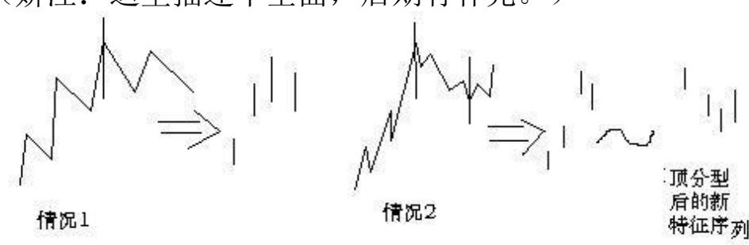
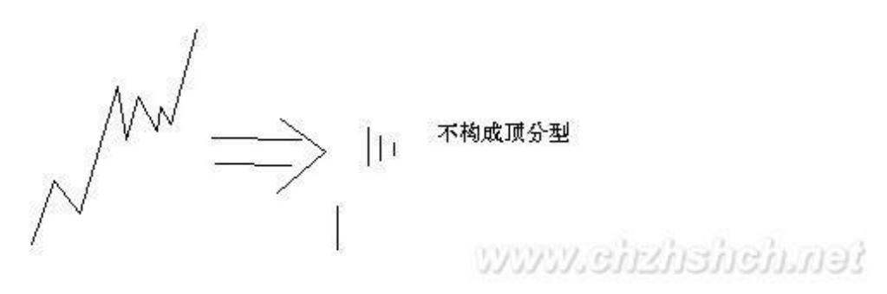
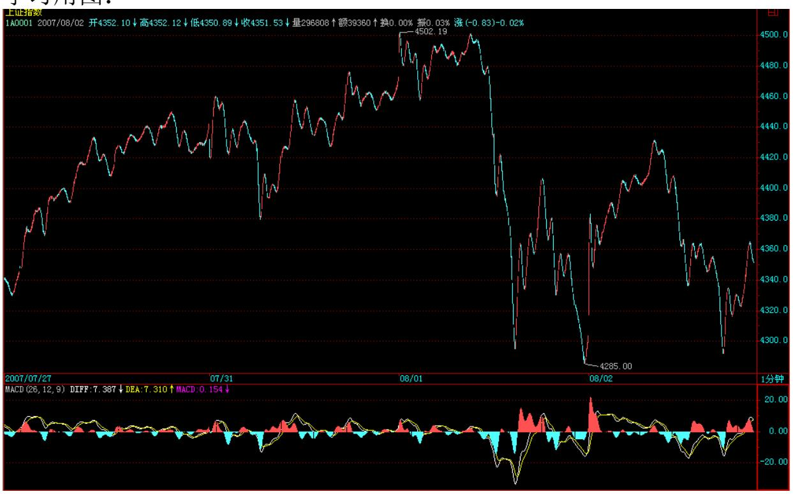
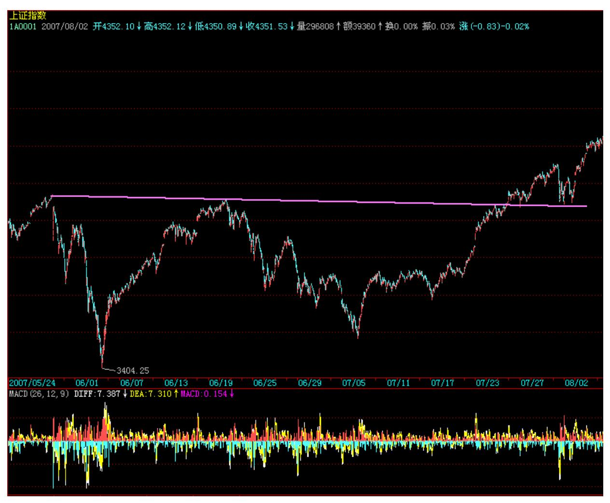
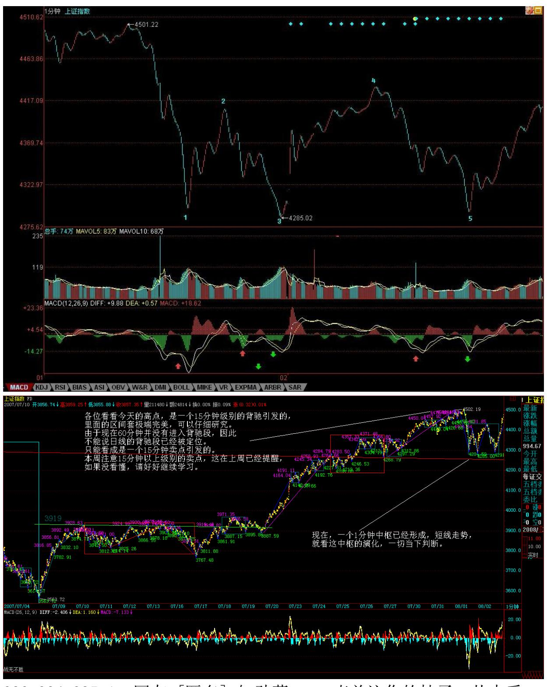
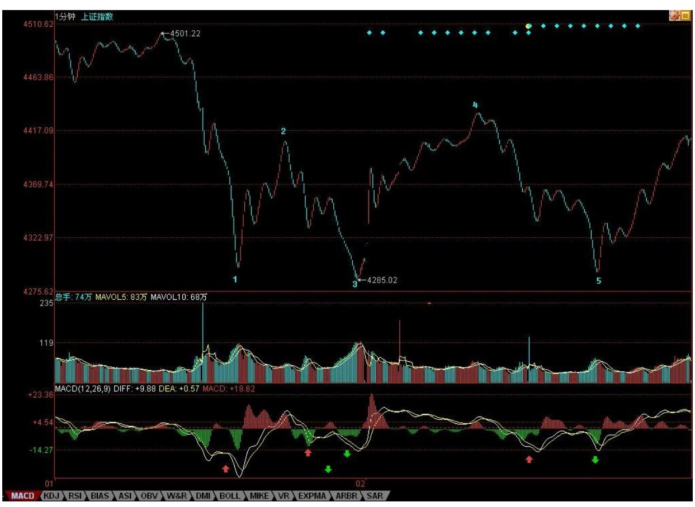
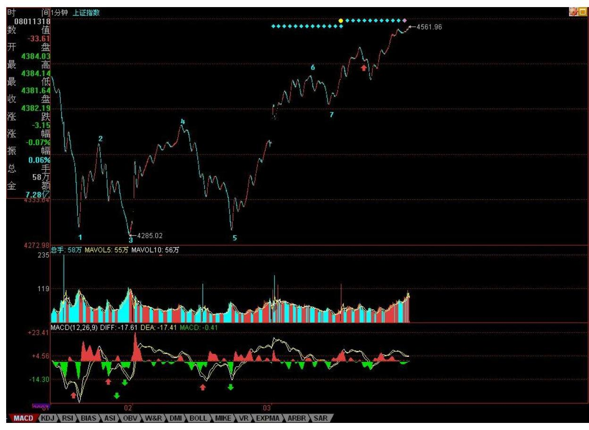
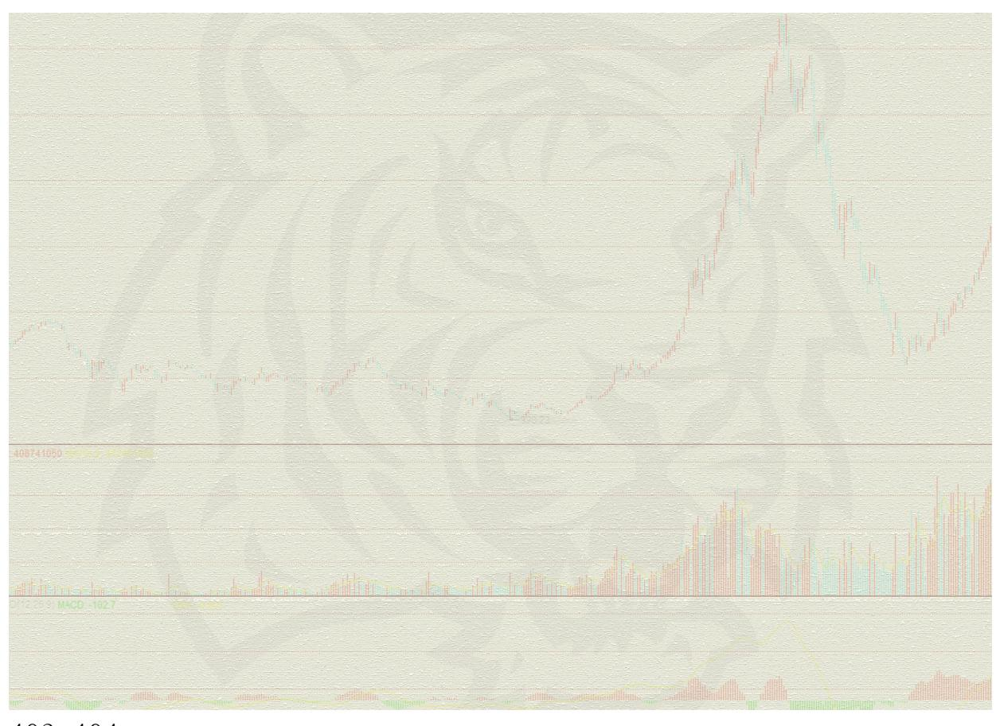

# 教你炒股票 67:线段的划分标准

(2007-08-01 22:31:55)笔的划分标准在前面已经严格给出,因此,下 一关键问题,就是如何划分线段。下面,给出类似笔划分,但有重大 区别的划分标准。用 S代表向上的笔,X代表向下的笔。那么所有的线

段,无非两种:一、从向上笔开始;二、从向下笔开始。简单起见, 以向上笔开始的线段为例子说划分的标准。

以向上笔开始的线段,可以用笔的序列表示:S1X1S2X2S3X3"SnXn。容 易证明,任何 Si 与 Si+1 之间,一定有重合区间。而考察序列 X1X2"Xn,该序列中,Xi 与 Xi+1 之间并不一定有重合区间,因此, 这序列更能代表线段的性质。

定义:序列 X1X2"Xn 成为以向上笔开始线段的特征序列;序列 S1S2"Sn 成为以向下笔开始线段的特征序列。特征序列两相邻元素间 没有重合区间,称为该序列的一个缺口。

关于特征序列,把每一元素看成是一 K 线,那么,如同一般 K 线图 中找分型的方法,也存在所谓的包含关系,也可以对此进行非包含处 理。经过非包含处理的特征序列,成为标准特征序列。以后没有特别 说明,特征序列都是指标准特征序列。(娇:这里的描述有欠缺,出 现肯定论点后找论据的逻辑顺序错误。没有明确同一段前不能进行非 包含处理。)参照一般 K 线图关于顶分型与底分型的定义,可以确定 特征序列的顶和底。注意,以向上笔开始的线段的特征序列,只考察 顶分型;以向下笔开始的线段,只考察底分型。 在标准特征序列里, 构成分型的三个相邻元素,只有两种可能:第一种情况: 特征序列的 顶分型中,第一和第二元素间不存在特征序列的缺口,那么该线段在 该顶分型的高点处结束,该高点是该线段的终点;特征序列的底分型 中,第一和第二元素间不存在特征序列的缺口,那么该线段在该底分 型的低点处结束,该低点是该线段的终点。

(娇注:这里描述不全面,后期有补充。)

387 第二种

情况:特征序列的顶分型中,第一和第二元素间存在特征序列的缺 口,如果从该分型最高点开始的向下一笔开始的序列的特征序列出现 底分型,那么该线段在该顶分型的高点处结束,该高点是该线段的终 点;特征序列的底分型中,第一和第二元素间存在特征序列的缺口, 如果从该分型最低点开始的向上一笔开始的序列的特征序列出现顶分 型,那么该线段在该底分型的低点处结束,该低点是该线段的终点; 强调,在第二种情况下,后一特征序列不一定封闭前一特征序列相应 的缺口,而且,第二个序列中的分型,不分第一二种情况,只要有分 型就可以。

上面两种情况,就给出所有线段划分的标准。显然,出现特征序列的 分型,是线段结束的前提条件。本课,就是把前面"线段破坏的充要 条件就是被另一个线段破坏"精确化了。因此,以后关于线段的划 分,都以此精确的定义为基础。

388 这个

定义有点复杂,首先请先搞清楚特征序列,然后搞清楚标准特征序 列,然后是标准特征序列的顶分型与底分型。而分型又以分型的第一 元素和第二元素间是否有缺口分为两种情况。一定要把这逻辑关系搞 清楚,否则一定晕倒。(娇注:这里的线段划分顺序是错误的论述, 注意看后期补充)显然,按照这个划分,一切同一级别图上的走势都 可以唯一地划分为线段的连接,正如一切同一级别图上的走势都可以 唯一地划分笔的连接。有了这两个基础,那么整个中枢与走势类型的 递归体系就可以建立起来。这是基础的基础,请务必搞清楚,否则肯 定学不好。

最后,尽量画点图,让各位分清楚上面的一些概念,但最好把定义看 清楚,这才是真正理解,图只是一个辅助。前两个图形中标出了线段 的划分。

#### 学习用图:

389

390 391

\*\*\*\*\*\*\*\*\*\*\*\*\*\*\*\*\*\*\*\*。

解盘及互动问答:

\*\*\*\*\*\*\*\*\*\*\*\*\*\*\*\*\*\*\*\*。

缠师:上面,由于今天跌破 5 日线,因此后面的反抽如果不能上 5日 线,则大盘的调整将加大,能重新上去,那就将重新挑战 4500点。即 使能突破 4500点,最好能反复震荡,否则,将引起昨天所说的八月中 上旬基本面上的重大不稳定因数。还是昨天那句话,不要急功近利, 要爱护市场本身。

大的技术上,日线上的背驰段依然成立,如本 ID 般第一拨进来的, 一定不能在这个位置加码,而是用先卖后买打差价的策略,通过震荡

把成本降低,万一大盘真不能突破 4500 点走出多头陷阱,到时候砸 起盘来也更爽。大家好好去看看,现在叫嚣冲多少多少点的人,在 3600 点的时候,是不是那些吼着要跌破多少多少点的。行情是合力 的,一步一步走出来的,预测都是忽悠,按照正确的策略去操作才是 一切。

如果能看明白线段、中枢、走势类型等的,现在这种行情是最好操作 的,注意,节奏一定是先卖后买,卖错了不怕,如果大盘真能突破 4500 点,很多中低价股都会大幅启动的,还怕买不到好股票?不杀 跌、不追涨,按照买卖点来。各位看看今天的高点,是一个 15 分钟 级别的背驰引发的,里面的区间套极端完美,可以仔细研究。由于现 在 60 分钟并没有进入背驰段,因此,不能说日线的背驰段已经被定 位。只能看成是一个 15 分钟卖点引发的。本周注意 15分钟以上级别 的卖点,这在上周已经提醒,如果没看懂,请好好继续学习。晚上, 把关于线段分类的课程放上来。先下,再见。

明天才是大盘短线的关键(2007-08-02 16:06:21)今天,没跌破昨天本 ID 所说的前期两高点连线以及 10 日线,所以出现反弹就理所当然 了,加上外围因素的影响,也给第三拨进来的人壮了胆。今天,也收 在昨天特别强调的 5 日线上,但这并不意味着大盘就平安无事了。大 盘在 6 月 20、21 日,也走出过类似的 K 线组合,而且时间上也是 周三、四,而周五的下跌,就使得一轮大调整得以确立。当然,一般 来说,历史不会简单重复。这只是要提醒,今天的走势其实并不重 要,关键是明天,考虑到周末消息面的因素,这个时间还要延伸到下 周一,也就是说,下周一前能否确认重新站住 5 日线,将是短线大盘 走势的关键所在。

对于新进的第三拨人,他们不想就此站上 N 个月的岗,必须要在这里 奋力一搏,现在,比 6 月 20、21 日有很多有利的条件,技术上, MACD 形态好多了,下面有前期两高点的连线,而上周的周线缺口,技 术上有三周不补就以后再补的惯例,也就是说,新进来的一拨人,只 要能顶住三周,至少可以把某些中线资金给忽悠进来了。因此,对于 这拨人来说,别无选择地,必须守住前期高点连线,重新站稳 5 日 线。

392 但是,这拨人也有可能最终毁了市场,为什么?这拨人如果急功 近利地迅速突破 4500 点,引发大量新资金涌入,那么上半年的单边 行情将不可避免。但目前国家对经济的总体判断与相应的对策,都在

一个敏感时期,如此走势,必然导致目前对多头有利的舆论、政策环 境发生极为不利的变动。目前,比印花税还要严厉的,就是关于交易 制度、规则的改变,如果谁最终乱搞,把这东西给搞出来了,那么, 才是真正恶劣的事情。

所以,虽然多头目前当然有能力快速突破 4500 点,但一个稳健的走 势依然是必要的。在 4500 点附近进行合理的震荡,将对市场长远的 发展有好处。甚至,在 4000 点到 4500 点进行一个长时间的大箱体 震荡,也比又掀起一场连续 N 根周 K 线长阳的运动要强。

当然,市场往往不会按照理智的方式进行,市场往往就是醉生梦死疯 一回,那么,对于如本 ID 一样第一拨进来的,一定要采取这样的策 略,就是绝对不增仓,因为在 3600 点开始都买够了,现在还买是脑 子水太多的表现。其次,采取保持仓位先卖后买打差价的策略,这样 成本降低,就永远立于不败之地。第三,一定不要听任何人忽悠马上 要冲多少多少,冲是别人的事情,我们的事情就是坐轿子,你有本身 把轿子抬到华山顶上,我们也没意见,但只要有人抬不动,就一定要 一脚把轿子给踹了。

个股方面,成分股继续打冲锋,一旦确认周线突破成立,二、三线股 会跟上的。下面给出这次下来的一个分段。红绿箭头给出的是黄白线 或柱子面积等的对比,看看就知道这些买卖点是完全可以当下判断 的。现在,一个 1 分钟中枢已经形成,短线走势,就看这中枢的演 化,一切当下判断。

这两天,北京的雨可露了面了,本 ID 也不想出去腐败了,免得哪条 桥又搞一个 N 米深的水库回不了家。

今天可以回答各位问题到 5 点。

393 394 395 1. 网友 [匿名] 知劲草: 一直关注你的帖子,从中受 益颇多。

请问姐姐,怎么看美股以及港股将来的走势?如果全球性股灾来临, 中国能独善其身吗?2007-08-02 16:13:10缠师:不可以,千万别相信 中国股市逆全球股市而涨的忽悠,一天可以,二天可以,但不可能永 远。

#### \*\*\*\*\*\*\*\*\*\*\*\*\*\*\*\*\*\*\*\*。

2. 网友 [匿名] 大盘: 请问博主,进行每笔划分时,相邻 k 线出现 以下三种情况,是否要合并处理:(1)相邻 k 线的高点或者低点之 一相等;(2)相邻两 k 线的高点和低点都相等;(3)好几分钟都维 持同一价位,也就是 k 线走势出现"麻点"。 2007-08-02 16:11:55 缠师:只要不包含就不需要合并,包含就是有一 K 线完全在相邻 K线 的里面。

#### \*\*\*\*\*\*\*\*\*\*\*\*\*\*\*\*\*\*\*\*。

3. 网友 [匿名] 新浪网友: "那么,对于如本 ID 一样第一拨进来 的,一定要采取这样的策略,就是绝对增仓,因此在 3600 点开始都 买够了,现在还买是脑子水太多的表现。"妹子好!这句话写错了 吧? 2007-08-02 16:18:29缠师:改了,但新浪系统慢,可能还没有 显示出来。当然,市场往往不会按照理智的方式进行,市场往往就是 醉生梦死疯一回,那么,对于如本 ID 一样第一拨进来的,一定要采 取这样的策略,就是绝对不增仓,因为在 3600 点开始都买够了,现 在还买是脑子水太多的表现。

#### \*\*\*\*\*\*\*\*\*\*\*\*\*\*\*\*\*\*\*\*。

4. 网友 [匿名] 悠悠: 想问缠姐对今天对 3 姑停盘可有什么看法? 和对明天可有什么指示? 2007-08-02 16:16:30缠师:做事情不能过 分,过分,当然有搞死的理由。

#### \*\*\*\*\*\*\*\*\*\*\*\*\*\*\*\*\*\*\*\*。

396 5. 网友 [匿名] 田鸡和猪肝: 新学,不好意思。问题:(1)怎 样判断一个走势类型为完成的?(2)如何确定中枢震荡形成或完成? 2007-08-02 16:17:40缠师:这在课程里都有,要把这问题说清楚,要 把所有课程说一遍,所以还是请把课程通读一遍。例如,某中枢震荡 的结束就是形成该中枢的第三类买卖点,这在课程里说过 N 次了,所 以还是请先把课程研究一下。

6. 网友 [匿名] 轻风吹断: "今天,经过大幅下跌的华菱认沽权证 继昨天反弹之后,在下午继续反弹,在整个交易过程中并没有出现剧 烈波动的现象。而按照原来的权证交易规则,华菱的涨停价位应该是 4.291元。也就是说,只有在这个价位才能自动停牌。但你们深交 所在下午13时43分16秒起突然对华菱等权证实施了停牌30分 钟的措施,理由居然是"价格异常波动" 。请问深交所,按你原来的 规则,此权证涨停价位在4.291元,那就是说你允许它涨到这个价 位。既然你认为可以涨到这个价位,为什么在此权证还在远离这个价 位的时候就说"异常波动"了呢?如果这样是异常波动,那涨停价位 不是更加是"异常波动"了呢?那你们为什么还允许有这个涨停价 位?现在,你们自己制造的规则,自己一手打破,请问深交所,这是 什么道理?另外,要说"异常波动",股票市场"5.30"大跌后的 第五个交易日,大部分股票从跌停板到涨停板,差价波动幅度达到了 20%,这还不够异常吗?当时为什么你们又不将这些股票停牌?" 想听听博主对今天这个事件的看法。2007-08-02 16:20:14缠师:327 的时候,成交都可以不算,这有什么奇怪的。政策风险本来就是要随 时预防的,所以一定要记住,股票是废纸,一定要买点买,只有 0 成 本才是相对安全的,否则无安全可言。

另外,这件事情其实也是一个信号,如果股票也这样,那么规则也是 可以改的。

股票是用来操作,不是用来争吵的。股票里,赢钱就是对的,输钱就 是错的,其他都是废话。

至于交易所,真正的垄断性机构,如果对他的规则有疑问,可以去外 面的交易所,如果一定要在这里,那么,就必须要知道,你面对的是 一种什么样的玩意,先把这先决条件给设定好了,否则,那是你的问 题,而不是交易所的问题。

#### \*\*\*\*\*\*\*\*\*\*\*\*\*\*\*\*\*\*\*\*。

7. 网友 [匿名] 新浪网友: 缠主,看你的文章 3 个月了,今天第一 次发言。 通过学习你的理论,很是受用,也在市场中取得不错的收 获。谢谢你!397 现请教一问题:昨日大盘下跌,你说是 15 分钟背 弛,这我同意,15 分钟的确有出现背弛。可我发现 30 分钟和 60 分

钟也出现了MACD 背弛,而你认为 60分钟还没出现背弛。我有些迷 惑。请指教。

2007-08-02 16:34:23网友[匿名] 天平 007:60 分钟黄白线还没回抽 零轴呢。这是我的理解。 2007-08-02 16:37:23缠师:对。

#### \*\*\*\*\*\*\*\*\*\*\*\*\*\*\*\*\*\*\*\*。

8. 网友 [匿名] 百思不解: 博主好!笔和线段的概念很清楚了,现 在就是同级分解的细节有困惑。比如 1 分钟图上,线段已划分好,则 对 1 分钟走势类型做同级分解。请问这同级分解规则能否象线段划分 规则一样,用严格的数学语言表达呢?以前课程里虽有大概的描述, 但文字描述总有细节不清楚的地方。请博主有时间象讲解线段一样, 详细讲讲同级分解,最好能在指数图上画出来。谢谢缠师:这在以后 都继续说到的,等等。

#### \*\*\*\*\*\*\*\*\*\*\*\*\*\*\*\*\*\*\*\*。

9. 网友 christine:( 1)在标准特征序列里,构成分型的三个相邻 元素,是指构成分型的三笔吗?(2)"特征序列的顶分型中,第一和 第二元素间不存在特征序列的缺口,那么该线段在该顶分型的高点处 结束,该高点是该线段的终点" ,和"特征序列的顶分型中,第一和 第二元素间存在特征序列的缺口,如果从该分型最高点开始的向下一 笔开始的序列的特征序列出现底分型,那么该线段在该顶分型的高点 处结束,该高点是该线段的终点"。此二段描述看着没有什么区别? 2007-08-02 16:42:11缠师:特征序列里的三相邻元素不是真实图形的 连续的三笔,里面的元素如果是上的线段,是那些向下笔,这在课程 里说得很清楚,先把这搞清楚,否则后面肯定看不明白了。这特征序 列的分型,是把特征序列里每一元素当成一个 K 线所形成的,不是实 际图形上的分型。请再研究一下。

#### \*\*\*\*\*\*\*\*\*\*\*\*\*\*\*\*\*\*\*\*。

10. 网友 [匿名] 随风: 姐姐对近期的物价全面上涨怎么看?国家是 不是失控了?2007-08-02 16:47:12398 缠师:你看看本 ID 写的关于 货币战争的帖子,2003 年没干的事,现在出现这种情况理所当然。现 在的问题还不在这里,而是这升值的战车一旦坐上去,就停不下来

了,历史上,如此大规模的升值走势后,似乎从来没有过软着陆的情 况,中国能否例外,只有天知道了。

#### \*\*\*\*\*\*\*\*\*\*\*\*\*\*\*\*\*\*\*\*。

11. 网友 [匿名] 新浪网友: 老大,图中下面的红\绿箭头不明白啥 意思。能否告知一二?(可能问题太幼稚了,不过真的不明白)2007- 08-02 16:47:12缠师:就是要你看箭头指着的黄白线或柱子面积之间 的对比。

399 400 12. 网友[匿名] 新浪网友: 老大辛苦了!那个 600636 跟 老大当初所说的相差甚远,希望老大能回答一下。谢谢! 2007-08- 0216:51:27缠师:636 没什么问题,在长线建仓中。就像 737,虽然 从 7 元多到10 元多了,依然在长线建仓中。注意,建仓都是动态 的,如果成本没被降到一定值,建仓完不了。一个天大的误解,就是 建仓时成本要很高,其实高明的人,建仓时,成本就可以不断下降, 当然,这种手法,对没耐心、短线思维的人,是痛苦的。所以本 ID 说过,散户也要学会动态建仓。

#### \*\*\*\*\*\*\*\*\*\*\*\*\*\*\*\*\*\*\*\*。

13. 网友钱末事: 权证数量发生较大改变,用 MACD 比较力度怎么去 校正呢?另外有空讲讲三个系统另外一个比价系统,好吗?谢谢! 2007-08-02 16:58:28缠师:无须校正,那以后会说到的。

醉生梦死疯一回游戏正式开始(2007-08-03 15:57:58)坐轿子的感觉确 实不错,坐在轿子上看沿路风景,别有一番情趣。下面,是关于坐轿 子上华山的第一天日记。这个日记,将有 N 日 N章。

今天大盘的跳空高开,就使得 6 月 20 前后的 K 线组合不可能出 现。昨天已经说过"市场往往不会按照理智的方式进行,市场往往就 是醉生梦死疯一回" ,站在第三拨人的立场上,尽快远离 4300 点, 吸引第四拨人进来,本来就是急切的事,至于后面将引发什么,他们 当然无所谓,而前两拨人就更无所谓。一般来说,越到后面的第 N 拨,其成分将越来越杂乱,如果说第一拨人的成分是最纯净的,到后 来,就三教九流,什么都有了。

今天的大盘开始迎来第四拨人里的先头部队,周末如果没有什么太大 的坏消息,那么,第四拨人里的主力部队将在下周大面积进入。这拨 人的成分将比第三拨更杂,有前三拨中中途开小差的逃兵,有看所谓 周线突破有效进入的技术人士,有在外面卖外卖现再回家开店的、更 大面积的是那些被钱烧得发慌的各路男女等等,醉生梦死疯一回游戏 正式开始。 对于前三拨进来的人,从现在开始,最后埋单的是谁,是 N 等于几,已经不重要,关键是如何把这个游戏玩得长一点,但这个 时间并没有什么上帝去规定,401 一个合力的结果下,从下周一开 始,这个游戏的时间 T 开始计算,T 从 0 开始,向着尽可能大的数 进发。这就如同玩电子游戏,去预测在第几关结束是脑子有水的表 现。

也正如玩游戏,关键是操作的策略,而不是去预测游戏在第几关结 束。目前的操作也一样,预测都是无聊把戏,关键是有精密的操作。

而操作是针对不同人的,如同玩游戏,高手和低手当然不是同一玩 法:对于低手,本 ID 反复说过最基本的操作策略,就是短线看 5 日 线,中线看 5 周线,长线看 5 月线,只要不有效跌破,相应的操作 就不用操作了,持股看着就可以。何谓有效跌破,就是跌破后反抽上

不来,这种反抽当然和对应级别有关,例如一个月线的跌破,至少要 看下个月反抽的情况,而不是看一日。

对于大资金以及散户里的中高手,就是要利用震荡机会就减低成本, 一路上涨,一路把成本减下来但持仓数量不变,这样,你的仓位就自 然随着大盘的上涨下降,也就是钱越来越多,但筹码没少,这样,是 既回避大盘可能的突发非系统风险,又能完全把握市场利润的有效方 法。

对于散户里的高手,就要充分利用大盘震荡中板块的轮动机会,获取 市场最大的机会。

有人可能问,做不到高手怎么办?那就做低手,持股都不会,大盘晃 悠一下就鸡飞狗跳的,那还炒什么股票,让股票炒你就行了。

昨天已经说了"个股方面,成分股继续打冲锋,一旦确认周线突破成 立,二、三线股会跟上的。"这个结论继续有效,而且,只要第四拨 资金能被忽悠进来,那些已经消除业绩风险的二、三线股,以及有题 材的股票将大肆表现,例如,你没看到这两天,本 ID 已经大肆引诱 各位到北京旅游了吗?注意,题材股的操作,一定不要追高,过了这 个村,还有那个店,天天都有新机会,不管谁的股票,都不必追高。

股票都是废纸,一个好的策略与心态,能让你把废纸变黄金。

技术上,把今天的分段放上来,还搞不清楚的,请好好学习。例如下 图中的 7,这是什么?是下面那 1 分钟中枢的什么?这么标准的图 形,都看不明白,那请把 ID 的课程重新读去。

周末,腐败的时间到了,大家放风去吧,别让股票把自己的生活套牢 了,本 ID 要去风花雪月去也,不陪各位了,自由活动,周日继续音 乐会,这次一定不爽约。

403 404
