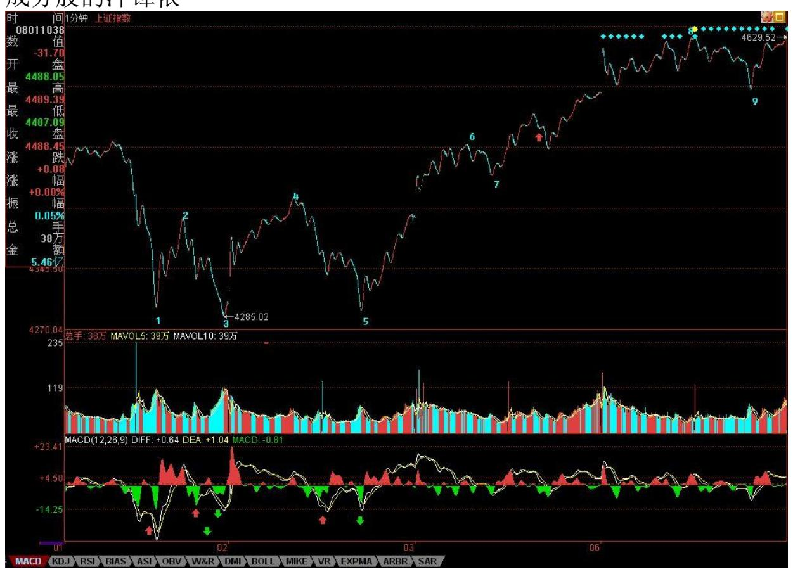
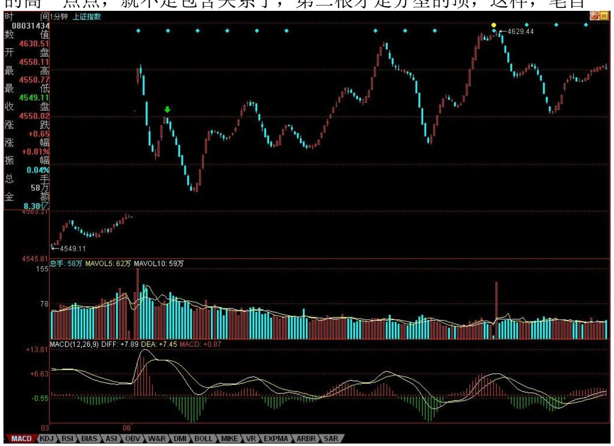
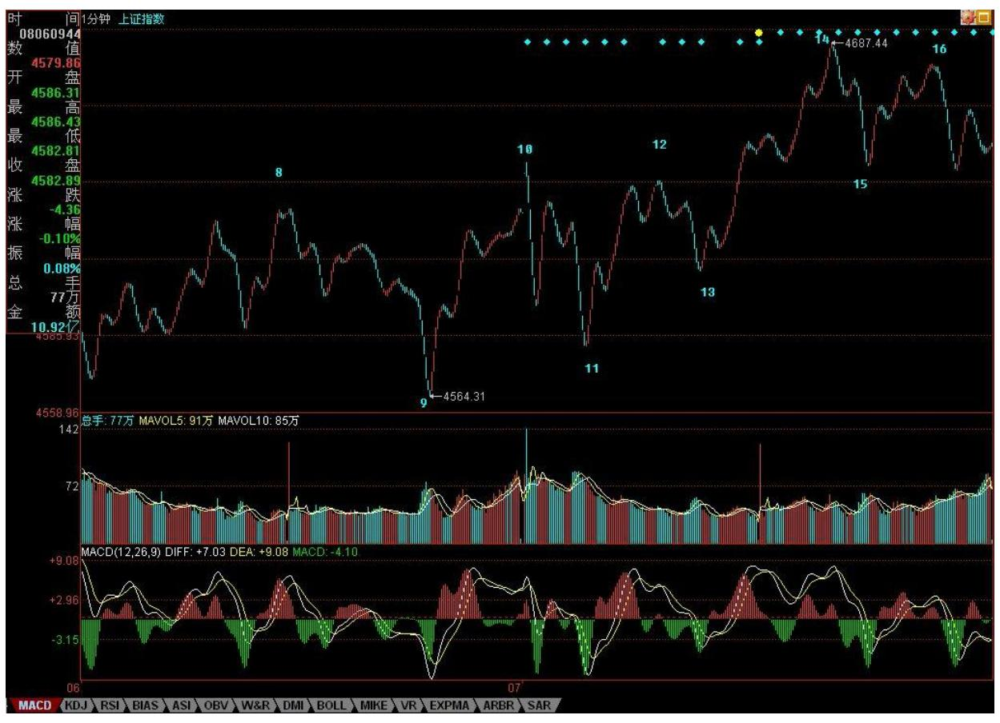
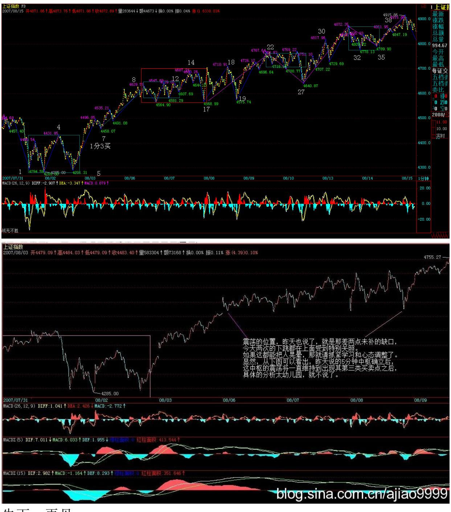
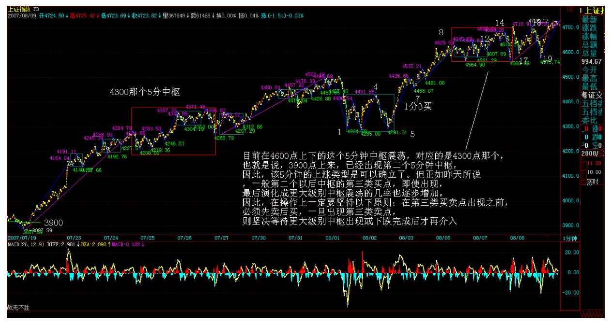
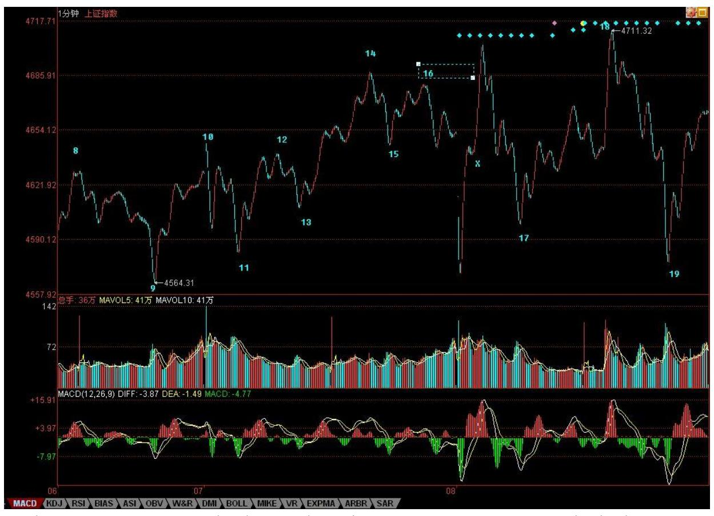
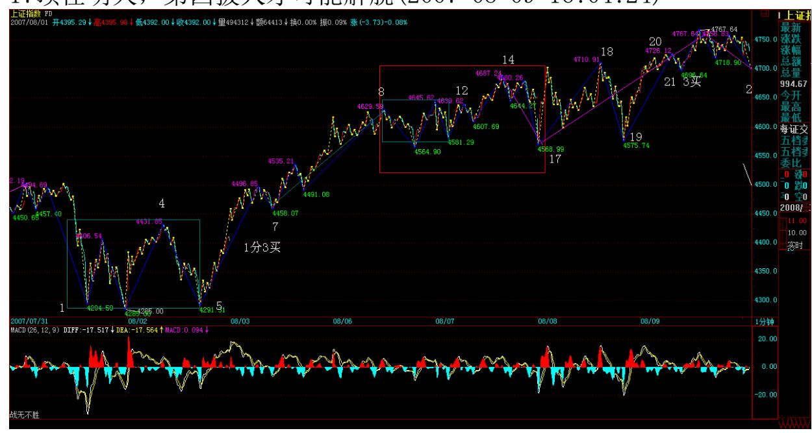
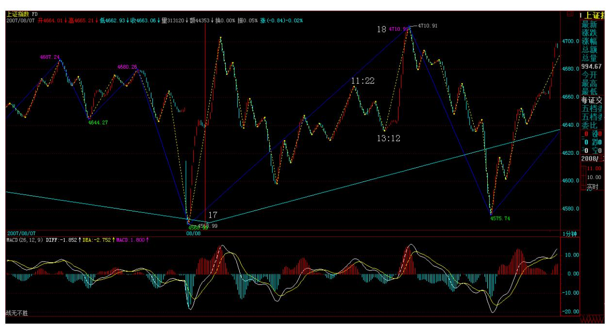
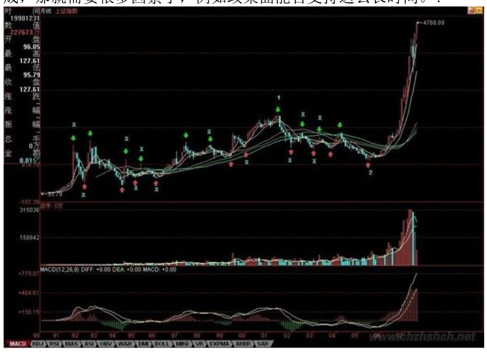

# 教你炒股票 68:走势预测的精确意义

(2007-08-05 10:36:28)今天说说预测,何谓预测?一般的预测是什么 把戏?而科学严密的预测究竟是怎样的,本 ID 的理论是如何成为最 精确最当下预测的,这都要在这里说明。真正的预测,就是不测而 测。当然,这和一般通常的预测不是一个概念。在通常预测概念的忽 悠、毒害下,很多人那根爱预测之筋总爱不时不自主地晃动几下,这 里也算给那些被预测毒害的人治疗治疗,也算死马当活马治一治了。

市场的所有走势,都是当下合力构成。例如,前几天,认沽权证突然 停牌导致的走势,就是由于规则分力有了突发性改变当下构成的。由 于一般情况下,政策或规则的分力,至少在一个时间段内保持常量, 所以,一般人就忘记、忽视其存在。但无论是常量还是随着每笔成交 变化的变量,合力都是当下构成的,常量的分力,用 F(t)表示,只是 表示其值是一个常量或者是一个分段式常量。对于任何一个具体的 t 来说,这和变化的分量在合成规则与合成的结果来说,没有任何的区 别。

但这些常量的分力,并不是永恒的常量,往往是分段式的,其变化是 有断裂点的,很多基本面上的分力,都有这个特点,这些断裂点,构 成预测上的盲点。当然,进行基本面分析,对宏观面进行大面积的考 察,可以尽量减少这些盲点,但不可能完全消除。这因素的存在,已 使得所有一般意义上的精确预测可能变成一个笑话。

更重要的是,基本面上的因素,也是合力的结果。政治、经济等等方 面,哪个不是合力的结果?现在的世界政治、经济格局,就是众多合 力的结果,一个国家里的就更是这样了。很多人一根筋思维,总是假 设政策是一个上帝,是不需要合力的,里面没有各种利益的斗争,所 有结果都如同一个预设的机器给出的。所有一般意义上精确预测的理 论,实质上都是以类似的一根筋思维为前提的。

比前面这些更深刻的,站在哲学的角度,预测也是一个分力,就如同 观察者本来就被假定在观察之中,所有观察的结果都和观察者相关、 被观察者所干预,以观察者为前提,预测也是同样的方式介入到被预 测的结果之中。正如同量子力学的测不准原理,任何关于预测的理 论,其最大的原理就是测不准。

有人可能在说,很多人都有预测准确的经历,这是为什么?其实,这 不过是一个概率事件。因为走势可以发生的情况,按任何标准来分 类,其可能情况都是有限的。一般来说,就是三、四种情况。而喜欢 预测游戏,到处宣布自己预测如何如何准的人比全世界正在被面首的 人都多,瞎猫还能碰到死耗子,就算有人连续碰对了,也依然在概率 的范围内,有什么大惊小怪的。而所有号称自己预测如何如何的人, 不过都是玩如此的招数或被如此的招数玩而不自知,至于那些把烂的 藏起来,只把忽悠对的到处晃悠,那就更等而下之了。

2 其实,预测一点都不神秘,甚至连某男都可胜任(注意,这涉及不 可知事件预测,本 ID 对此的准确性没有任何信心)。所有预测的基 础,就是分类,把所有可能的情况进行完全分类。

有人可能说,分类以后,把不可能的排除,最后一个结果就是精确 的。这是脑子锈了的想法,任何的排除,等价于一次预测,每排除一 个分类,按概率的乘法原则,就使得最后的所谓精确变得越不精确, 最后还是逃不掉概率的套子。

对于预测分类的唯一正确原则就是不进行任何排除,而是要严格分清 每种情况的边界条件。任何的分类,其实都等价于一个分段函数,就 是要把这分段函数的边界条件个确定清楚。例如下面的函数: f(X)=-1,X∈(-∞,0),f(X)=0,X=0,f(X)=1,X∈(0,∞) 关键要搞 清楚 f(X)取某值时的 X 的范围,这个范围就是边界条件。在走势的 分类中,唯一可以确定的是不可能取负值,也就是从[0,∞)进行分 类,把该区域分成按某种分类原则分为 N 个边界条件。

有人可能要说,股票怎么可能变到 0?这有什么奇怪的,股票停了算 什么?别说股票,钱都可以变成 0,你说 1950 年时候的金元券值多 少?当然,如果你的子子孙孙能把一张金元券守到宇宙爆炸的最后一 刻,那时候,这金元券会值 N 元的,这个 N,大概也会趋向一个恐怖 数字的,那就等着吧。

不仅股票是废纸,本质上货币也是废纸,其所谓的价值区间和股票是 一样的,0 同样是可能的取值。甚至按最精确的理论来说,还可以取 负值,例如,如果有某朝或某国政府规定,私藏前朝或别国钱钞股票 的一律死罪,那你说这钱钞或股票是不是负值?至于具体股票变 0 的 情况,在权证上就经常发生。

边界条件分段后,就要确定一旦发生哪种情况就如何操作,也就是把 操作也同样给分段化了。然后,把所有情况交给市场本身,让市场自 己去当下选择。例如,前几天,本 ID 用前期两高点和 10 日线进行 分类,那自然就把走势区间分类成跌破与不跌破两种。然后预先设定 跌破该怎么干,不跌破该怎么干,如此而已。这就是最本质的预测, 不测而测,让市场自己去选择。最后市场选择了不跌破,那就继续持 有。

有人说,万一他上去后又跌破怎么办?这是典型的脑子水多瞎预测思 维。任何一个市场的操作者,一定不能陷入这种无聊思维之中。市场 不跌破是一个事实,你的操作只能根据已经发生的事实来,如果跌 破,那就等跌破成为事实再说,因此在本 ID 意义下的预测里,你已 经把如果跌破的情况该干什么预设好了,这种情况没成为事实,就是 另一种情况成为事实,那就该干什么干什么。

一般来说,喜欢预测的人,通常都是神经过敏,脑子水多,操作低 下,喜欢忽悠之辈。那些从 2000 点就开始测顶的,如果说错一次割 一块肉,现在都可以去当假冒羊蝎子了。股票是用来面首的,不面首

股票,就被股票面首。面首股票,可不能光是忽悠,而是要实际操 作。所有的操作,其实都是根据不同分3 段边界的一个结果,只是每 个人的分段边界不同而已。

因此,问题不是去预测什么,而是确定分段边界。例如,前两天用前 期两高点分类有意义,现在再用,就没什么意义了,现在就可以完全 用均线系统来分类,所以本 ID 就接着强调 5 日、5 周、5 月的原 则。有了分段的边界原则,按着操作就可以,还需要预测什么?又有 什么可预测的?世界金融市场的历史一直在证明,真正成功的操作 者,从来都不预测什么,即使在媒体上忽悠一下,也就是为了利用媒 体。真正的操作者,都有一套操作的原则,按照原则来,就是最好的 预测。

那么,本 ID 理论中的分型、笔、线段、中枢、走势类型、买卖点等 等,是不是预测呢?是也不是。因为本质上本 ID 的理论,是最好的 一套分段原则,这一套原则,可以随着市场的当下变化,随时给出分 段的信号。按照本 ID 理论来的,其实在任何级别都有一个永远的分 段:X=买点,买入;X=卖点,卖出;X 属于买卖点之间,就持有。

娇加注:f(X)=买入,X∈(买点),f(X)=卖出,∈(卖点),f(X)=持 有钱或者股票,X∈(买卖点之间),而这持有的种类,如果前面买点, 卖点没出现,就是股票,反之就是钱。按照分段函数的方法,本 ID的 理论就有这样一个分段操作的最基本原则。

因此,如果你真学习和按本 ID 的理论来操作,就无须考虑其他系 统,或者说其他系统都只能是参考。本 ID 解盘的时候,之所以经常 说均线,高点连线之类的,只是为了照顾没开始学本 ID 理论的人, 并不是本 ID 觉得那种分类有什么特殊的意义。本 ID 的理论,任何 时候都自然给出当下操作的分段函数,而且这种给出都是按级别来 的,所以本 ID 反复强调,你先选择好自己的操作级别,否则,本来 是大级别操作的,看到小级别的晃动也晃动起来,那是有毛病。

给出分段函数,就是给出最精确的预测,所有的预测都是当下给出 的,这才是真正的预测。这种预测,不需要任何概率化的无聊玩意, 也没有所谓预测成功的忽悠或兴奋。这种预测的成功每一当下都发生 着,每一下都要忽悠兴奋一下,这人脑子早锈掉了。所谓碧空过雁、 绿水回风,哪个是尔本来面目?参!(娇注:缺口的分类,均线的分

类,走势的分类,买卖点的分类。。。。。。)等价于一个分段函数, 就是要把这分段函数的边界条件个确定清楚。

例如下面的函数:f(X)=-1,X∈(-∞,0),f(X)=0,X=0,f(X)=1, X∈(0,∞) 4 边界条件分清楚,触发条件使等式成立才是真正的预 测。

\*\*\*\*\*\*\*\*\*\*\*\*\*\*\*\*\*\*\*\*。

解盘及互动问答:

#### \*\*\*\*\*\*\*\*\*\*\*\*\*\*\*\*\*\*\*\*。

成分股行情的泡沫化阶段正式开始(2007-08-06 15:58:43) 正如这次 在 3600 点突击时,本 ID 写了满江红,上次突破 3000 点的总攻行 情,本 ID 在 3 月 19 日写了神州自有中天日,万国衣冠舞九韶, 时间上,回头一看,都是很是时间的。在 3 月 19 日那篇文章里,本 ID 宣称"在总市值超越 GDP 之前谈论股市的泡沫是可笑的,在中国 股市总市值超越其 GDP 之前,第一阶段行情不会结束。" 现在,这 个目标已经达到,中国股市的总市值已经达到 GDP 了。本ID 在文章 里很明确指出,第一阶段"行情最主要体现在以权重股为代表的成分 股上。" 但,今天这样一个日子里,本 ID 必须宣布,成分股行情的 泡沫化阶段正式开始。

GDP,就是整个股市市值波动的中枢,前面是恢复性上涨,恢复到这个 中枢上来。而从今天开始,将是远离该中枢的泡沫化阶段。一般来 说,泡沫化阶段的行情,将逐步走向全面疯狂,大笨象们都可以跳出 小步舞,疯狂的上涨将如瘟疫般蔓延。这个阶段,可以很短暂、也可 以延续相当时间。可以远离中枢 30%,也可以远离 300%,但最后的结 果都是唯一的,回跌到中枢处。 所有如本 ID 般正在轿子上享受的, 首先要在思想上明确这波行情的性质,但不用慌张,能在泡沫中安心 享受,在泡沫最后一刻一脚把泡沫踢破,本来就是投机的好境界,好 好享受,好好利用,别浪费了疯狂轿夫们的力气。

一般在这种泡沫化阶段,本 ID 的原则就是只坐轿子不动手。本 ID握 有大量中字头的大盘股票,基本每一个中字带头的成分股票都有,这 在 3600 点的时候,本 ID 专门说过的,等这泡沫化打到高潮时,这 些都是很好的踢破泡沫的种子好选择。其他就是原来的那十几、二十

只成本为 0 的,这是作为所谓的二、三线股配置的。这些股票,反而 有些会长线继续关注,因为第二阶段的成长股行情中,有些会成为种 子选手。本 ID 的仓位都是按 20 年的思路来建的,对有些股票,本 ID 绝对要搞他 20 年以上。

短线走势,看看下图就很明白,8-9 形成的线段,和下面 6-7 的形成 线段上类上涨走势,当然,这个走势可以延续下去,直到形成新的 1 分钟中枢,但前5 提是后面的上攻不形成类背驰,否则,将至少在目 前位置形成一个1 分钟级别的中枢震荡。是否背驰,就是明后两天关 注的重点。一旦背驰形成,那么一个大的震荡不可避免。 个股方面, 成分股的冲锋依

然会继续,但二、三线股的行情将逐步加温。今天最大的问题就是, 周末第三波人的宣传能力太差,确实是乌合之众,其他方面资源太 少,使得被忽悠的第四波人的进入还没达到应有的程度,因此,这几 天第三拨人如何在忽悠方面表演,可以继续看戏。如果第四拨人的进 入速度太慢,那么大盘必然要背驰而震荡。目前外围股市腥风血雨, 如果这两天能止,一定是第三、四拨人最大的利好,那就等着吧。

思考题:看这线段中的类背驰,是用 1 分钟图上的 MACD 还是 5 分 钟图上的 MACD 辅助判断方便?(注:5 分图明显)本 ID 原想着以下 大雨的名义而偷懒不去腐败,结果,去腐败的那区竟然没下雨,而本 ID 这区的雨也小了,看来没机会,只能先下,再见了。

#### 6 教你炒股票 68:走势预测的精确意义

class="calibre1">7 今天这雨下的不是地方,停得不是时候,最后换 来一首五律,也算这腐败没白腐败。本 ID 三教九流都交往,难免腐 败活动多。本周还有一个法国人的腐败活动在君悦,白酒是喝不上 了。喝红酒没有任何写古诗的感觉,古诗总是白酒的。

今天走的时候发现小丸子、大道等指出原来的分段有问题,因为本 ID 平时是用别的系统,写帖子才用同花顺,没注意这两个系统数据上的 细微差别,就对着标上了。仔细检查同花顺系统里的数据,确实原来 的分段有问题,所以马上改了,然后在车上还上来打了一个招呼。新 浪的刷新似乎很慢,一般本 ID 发完帖子,出来也看不到自己发的帖 子,要等上一阵,但在"我的所有文章"里能马上看到,只是在首页 以及最新文章列表不显示,不知道各位是否也有这个问题。

刚才回来看到有人说别的软件和同花顺的数据不同,那不算的一笔在 别的软件上是一笔。这个问题其实很正常,在课程里本 ID 已经说 过,每个软件对数据的反应或处理可能都有点不同,所以,数据有差 异是很正常的。这就像同样倍数的显微镜,即使同一厂家都不可能绝 对一样。所以,看的时候,坚持用同一显微镜就可以。本 ID 看盘时 用的软件和同花顺不同,以后也注意点,不能照抄过来。但这些细微 的地方,并不大影响整体的判断。而且这个分段,比原来的更简单清 晰,更美。

因此,各位必须注意,在一个具体的分析中,一定要坚持用同一套软 件的同一个数据源,这样,数据的连续性是保持在同一规范下的。不 同软件的数据不同导致的不同划分,不会实质影响大的级别划分,站 在实际操作层面,至少要在 1 分钟级别上讨论操作问题,所以这样的 测量误差,是在可接受范围内的。测量误差,是不影响理论的统一性 与严谨性的。

那么,这样的分歧,究竟有多细微的程度,各位可以看下图。关键是 绿箭头指着的两个 K 线,第一根范围是[4594.91,4597.57],第二根

范围是[4595.19,4597.44],由于第一根是最高收的,而 4597.57 与 4597.44 相差极为细微,所以可能就是 0.1 秒的数据收集差异,就导 致在同花顺中的包含关系,在别的软件中就是第二根的高点比第一根 的高一点点,就不是包含关系了,第二根才是分型的顶,这样,笔自

然就成立了。如果这里的笔成立,那么整个分段就有一定的变化了。

不过,这并不实质影响整个走势的分析,由于各位也应该明白,为什 么在实际的分类中,必须要从分型和笔开始,最后由线段构成最小级 别的中枢,其中一个原因,就是这样,到了最小级别的中枢的层次, 这种微小测量误差造成的差异就可以尽量地抹平了。而到了更大级别 的中枢,这些就不再存在。当然,这不是分型、笔、线段的主要功 用,但也是其中之一。

8 9 这件事情,可以给出一个结论:本 ID 的理论是可以进行最精确 的研究的,而且这种研究是绝对科学客观的,只和分析的具体图有 关,只要是同一个软件的同一张图,就有绝对唯一的答案,在这个答 案面前,无论是谁都一样平等。并不因为本 ID 研究出了这理论,本 ID就有任何权威,在理论面前,人人一律平等,本 ID 也有出错的时

候,但本 ID 的理论是不会错的,结论是唯一客观的,这叫依法不依 人。

对任何理论,必须有依法不依人的最基本前提,本 ID 的理论之所以 客观准确,并不是因为本 ID 的原因,而是该理论是实际走势最可能 客观的反映,无关任何人,不管他喜欢不喜欢本 ID 本人,但只要在 市场中,就被本 ID 的理论所覆盖。就如同一个在欧得里德空间里的 人,无论他对 180 如何厌恶,但任何一个他能测量的三角形,就永远 用 180 去折磨他,无处可逃。本 ID 的理论也如此,只要你在市场 中,无论你知道不知道,喜欢不喜欢,你都无处可逃。

有网友问图怎么才能看清楚,本 ID 的电脑水平基本在打字阶段,但 这个问题还是能回答一下的。请对着图按右键,然后打开属性把地址 复制下来在网上打开,就能看到清晰的大图。本 ID 说电脑,纯粹是 胡闹,各位有更好的办法,请提供。最后给小丸子、大道等人一人一 朵大红花。先下,再见。

因迎奥运一周年而延迟的震荡只是延迟了(2007-08-07 22:18:38)对不 起,现在才发帖子,今天其他内容的帖子没法写,只能说说今天的大 盘。

显然,8-11 已经极为标准地形成 1 分钟中枢,11-13 可以看成该中 枢的一个延伸。而 13-14,这个对中枢的离开后形成 14-15 的回抽, 构成 1 分钟中枢的类第三类买点(严格来说,一个线段是不能构成买 点的,只能是一个类买点,因为在这种理论前提下,1 分钟中枢是最 小级别,而最小级别的走势,必须至少包含一个 1 分钟中枢,因此说 1 分钟的第三类买点,只是类比地把线段当成了 1 分钟的次级别,但 这只是类比说法,在严格的理论上,不能这样认为。

10 11 由于收盘,使得 16 开始的 17 段走势是否完成,无从判断, 因此,明天一大早的走势就是决定该线段结束的位置,如果在图中 10 之下(也就是 4645 点下),那么将成一个 5 分钟的中枢,(8- 11)+(11-14)+(14-17)。

注意,一定要注意,一般来说,而由于第三类买点后并不必然导致上 涨的延续,而是还有第二种选择,就是形成更大级别,也就是 5 分钟 级别的中枢,而一般来说,在走势上,第一个中枢的第三类买点能形 成上涨的概率比第二个中枢的要大多了,对于上涨中第二个中枢以后 的第三类买点,其后形成上涨继续的概率越来越小,也就是说,这些 第三类买点的参与价值越来越小。站在实质操作中,在第一个中枢已 经买了,根本没必须等到第二个以后中枢的第三类买点才介入,那是 脑子反应慢的表现。

因此,无论明天开盘后那线段走成怎样,连超短线的介入价值都不 高,典型的刀口舔血,明天开始,要关注的反而是因迎奥运一周年而 延迟的震荡只是延迟了,但延迟不等于消除了,要发生的一定要发 生,昨天留下的两点缺口,也构成技术的吸引力,因此,对于实际操

作来说,如何应付好这震荡才是首要关注的事情。当然,不排除明天 出于某种原因有护盘力量使得这震荡被减震了,但周四、五,依然有 极大的可能补回来。技术上,4500 点突破后,还没有一次有力度的震 荡去确认突破的有效,一般来说,这种程序是少不了的,人为因素, 最多用时间换空间,但能否实现,那还两说呢。

个股方面,本 ID 让各位来北京旅游,这几天已足够热情了,现在, 短线也没有任何参与价值了,该股,是本 ID 的中线股票,来回折腾 到 2008,是必然的,但并不意味着就永远不回杀了。 至于那等比, 本 ID 一早就断言,等真启动的时候,肯定都是所有人拿不住的时 候。算了,这些小盘股,不会让太多人获利,就那么点筹码,还不够 塞牙缝的,千万别追高了,这种小盘股,追的人一多,马上又是一个 灾难。 大资金有什么优势?大资金的优势就是可以在一股票上耗上一 年半载还能把成本给搞没了,而小资金,没必要把时间浪费其中,有 些钱不是和任何人都有缘的。

本 ID 从 3600 点开始买股票,只和国资委保持一致,只买中字头, 这可在当时暗示过了。最近中船、中铝之类发疯,可别以为是真疯 了,当然,这类股票最近都涨多了,就别买了,欣赏吧,顺便去想想 国资委为什么前段时间出那减持的规定吧。

对中字头的,本 ID 只说了一个,原因是那价位低,对于散户合适 点。现在走得怎么样,各位也看到了。不温不火,就已经从 7 元多快 到 12 元了,这就像去年 12 底,本 ID 在 6 元让各位买那只药一 样,都是送一个大包子给有各位,让各位挣点学课程的学费。那药, 可是本 ID 准备搞 20 年的股票,为什么?华润把万科搞到中国老 大,为什么不能把药搞到世界老大?现在 20 元,还 S 股,本 ID6、 7 元大力抢入的成本早就 0 了 N 个月了,不搞他 20 年怎么对得起 自己?现在,本 ID 对这股票的要求很低,保持 0 成本,一年增加 1 到 2 倍的筹码,别人挣钱,本 ID 挣筹码。至于那只比三一成本低多 的股票,也从 7 元跑到 10 元了,这股票基本面有不确定的地方,高 了就别追了,对这股票,本 ID 的信心可不大,只是如打家劫舍的, 劫他一票而已。

二、三线股会逐步苏醒,但成分股的疯狂会直到泡沫破裂结束第一阶 段的行情。不说了,累了,上面的后面关于个股的都是梦话,休息。

先下,再见。

12 13 14 当工行都发疯后,轿夫们还有什么把戏? (2007-08-08 15:44:40)

今天的震荡,已经在昨天明说了。而且,昨天还特别强调某种护盘力 量出现的可能。但这种力量,并没有改变震荡的本质,只是让这种震 荡更具有迷惑性。

震荡的位置,昨天也说了,就是那差两点未补的缺口,今天两次的下 跳都在上面受到特别关照。如果这都能把人晃晕,那就请抓紧学习和 心态调整了。显然,从下图可以看出,昨天说的 5 分钟中枢确立后, 这中枢的震荡将一直维持到出现其第三类买卖点之后,具体的分析太 幼儿园,就不说了。

目前在 4600 点上下的这个 5 分钟中枢震荡,对应的是 4300 点那 个,也就是说,3900 点上来,已经出现第二个 5 分钟中枢,因此, 该 5 分钟的上涨类型是可以确立了。但正如昨天所说,一般第二个以 后中枢的第三类买点,即使出现,最后演化成更大级别中枢震荡的几 率也逐步增加。因此,在操作上一定要坚持以下原则:在第三类买卖 点出现之前,必须先卖后买,一旦出现第三类卖点,则坚决等待更大 级别中枢出现或下跌完成后才再介入。

15 当然,没这个技术的,看 5 日、5 周、5 月均线。短线上,后三 天是关键,因为 5 日线已经逐步上来,如果在目前位置不能有效向 上,那跌破 5 日线,向 5周线靠拢寻求支持就是理所当然了。

现在,对于第四拨人来说,一个现实的问题就是,当工行都发疯以 后,还有什么可折腾的?一个最简单的,就是继续把汽车、交通、能 源等最近没特折腾的也折腾一遍,然后再继续原来折腾的轮动再搞一 波,把第五批也给诱骗进来。那时候,比本 ID 前面说的大笨象要跳 小步舞还要厉害的是大笨象都变小笨16 鸟,飞得满天都是了。

当然,这只是第四拨人的如意算盘,能否打响,就走着瞧了。我们只 需要坚持前面的买卖原则,边把成本降下来,边耐心看轿夫的表演。

至于没这技术的,就看着均线把股票拿住。

#### 17顶住明天,第四拨人才可能解脱(2007-08-09 16:04:24)

昨天说,工行发疯后,第四拨人只能继续轮动板块把第五拨人蒙骗进 来。今天,板块轮动再次展开,当然,本 ID 已经给这论行情定了一 个性,就是成分股的泡沫化行情,最终,大笨象要跳小步舞,甚至都 要变小笨鸟飞得满天都是,行情的发展继续按这个性质不断展开。至 于哪天才会泡沫爆破,无须预测,市场自然给出。

走势上,下图中 20-21 是 14-17 的 1 分钟中枢一个类第三类买点, 站在 8-17 这个 5 分钟中枢的角度,明天是否能形成第三类买点就极 端重要了。(注意,图形一收放,图中数字会走,本 ID 今天才发现 这问题,昨天图中的 17 位置移动了,今天这个位置才是对的,其 实,这个根据定义就很容易发现,17 后向上的中间有一个 X,就是因 为这不构成一笔,因此,18 必须到目前的位置才满足至少三笔的要 求。)18 因此,今天的题目是针对此而说的,只要能顶住明天,形成 这个 5 分钟中枢的第三类买点,然后再拜托周末没有大的消息,再给 两天时间大肆宣传,下周一,新的资金才会有机会补充进来。今天成 交量的萎缩,使得第四拨人的努力有不靠谱的地方,因此,明天的第 三类买点至关重要,一旦出现跌回 8-17 的19 中枢,那么这群人当举 重手的可能性就根本无须探讨了。

看不明白上面的,本 ID 已经给出最简单的方法,就是短线看 5 日 线,但这就可以让你安心持股了。技术高的获取更高的利润,这是天 经地义的。复杂的不会,那就玩简单的,千万别吃夹生饭。会就会,

不会就学到会,没学会之前,就先用简单的方法操作。对于已经学会 的各位,也应该养成好习惯,就是边看盘,边把段给分了,这样操作 起来,就一目了然了。这包括大盘和自己操作的个股。

注意,本 ID 说了只坐轿子,但没有任何地方,本 ID 曾经说要看 空。本 ID 之所以能在市场中生存十几年而不断壮大,唯一秘诀就是 底部之后只坐轿子。本ID 的方法很简单,就是留了机动的资金后,把 仓位打到最大,然后不断在出现中枢震荡时,保持仓位把差价搞出 来。一般情况下,到一段行情顶部的时候,本 ID 原来的仓位都要下 降到 70%-75%,注意,筹码不丢失,只是钱多出来,所以仓位自然下 来了。这样,无论发生什么,本 ID 都是大赢了。

在市场中,关键是能长期保持赢利,本 ID 从来没见过喜欢当轿夫的 最终能活下来的。谁爱当轿夫就当去,本 ID 依然如故。而且本 ID还 要特不厚道,还要经常批评轿夫的姿势不美、动作恶心。例如,本ID 今天就要批评,轿夫们,本 ID 其他中字头的都不错,就是中石化、 中国银行有点蔫,连新高都没创。哪位轿夫有力气的,也来一把吧。 另外、抬中铝的,动作优美点,今天走得特恶心,搞了一个双针出 来;潍柴动力的轿夫,手脚麻利点,反正都要上 100的,就别摆太多 姿势了;中国国航,也比较丑陋,连南航都比不上,你们李总怎么见 部队的朋友?股票,要有放松的心态,轿子都不会坐,那就当抬轿 的,或者当饺子给人吃了吧。今天可以回答问题到 5 点。

#### \*\*\*\*\*\*\*\*\*\*\*\*\*\*\*\*\*\*\*\*。

1. 网友全线飘红: 缠 MM 好,说说看,这几拨咋不光顾俺们的轿子 呢?2007-08-09 16:09:56缠师:成分股行情,首先是最大那 50 家, 然后是 300,最后才会轮动到二、三线,当然,这不是绝对的,只是 大方向。

#### \*\*\*\*\*\*\*\*\*\*\*\*\*\*\*\*\*\*\*\*。

2. 网友 [匿名] 与你同行: 老师,股指狂升,很多股票价格却不 动,反而跌怎么理解?2007-08-09 16:14:41缠师:这太正常了,上半 年二、三线股涨的时候,大盘成分股也没怎么动,风水轮流转。从今 天开始,可以慢慢关注沪深 300 中的,大盘50 会慢慢扩散出20 去。 当然,还可以关注大盘 50 中没怎么动的,没动的都会轮一遍的,前 提是,有一定级别的买点。

#### \*\*\*\*\*\*\*\*\*\*\*\*\*\*\*\*\*\*\*\*。

3. 网友 [匿名] 恒灵: 缠主,我看大盘图一直有顶背却不下跌,是 不是我看错了?2007-08-09 16:17:25缠师:MACD 是辅助,首先要把 走势给分清楚,否则又怎么知道是哪段和哪段比?这次上来这一段, 可以先看成是 5 分钟级别的背驰段,如果背驰成立,就至少重新跌回 4600 点上下中枢,也最迟在周一前就有结果。也就是说,这个背驰段 是否成立的结果。

#### \*\*\*\*\*\*\*\*\*\*\*\*\*\*\*\*\*\*\*\*。

4. 网友 [匿名] 新浪网友: 缠姐,对于中国联通(600050)这支股 怎么看啊?对于散户该怎么操作(吸血)呀?2007-08-09 16:20:32缠 师:本 ID 一直有,就等中移动回来了。另外,联通要接受所有目前 中移动 GSM 的业务与客户,当然,这方案还可能有变数。联通的故事 要说完,怎么都要 N 年时间,早着呢。

#### \*\*\*\*\*\*\*\*\*\*\*\*\*\*\*\*\*\*\*。

5. 网友全线飘红:谢缠 MM,这 50 家是上证权重前 50 吗?我经常 看。还有一个是上证 50 样本股。应该是前一个吧。看来我对成分股 的含义理解错了,不懂装懂啦。2007-08-09 16:09:56网友缠中说禅: 缠 MM 好!说说看。这几拨咋不光顾俺们的轿子呢?2007-08-09 16:24:30缠师:成分股行情,首先是最大那 50 家,然后是 300,最 后才会轮动到二、三线,当然,这不是绝对的,只是大方向。应该是 两市权重前 50,然后两市的前 50 就是前 100 了,然后是 300。一 般中间那种情况很少用到。

#### \*\*\*\*\*\*\*\*\*\*\*\*\*\*\*\*\*\*\*\*。

21 6. 网友 [匿名] 胡子大将军: 标注 17-18 之间 1122-1312 这个 为什么不算一段? 是 3 笔重合, 而且破坏了上一笔。还有, 18 要 是没创新高的话怎么分段?2007-08-09 16:23:52缠师:这当然不能 算,这种情况要看该段特征序列的底分型,而这里没有,不构成。最 后新高与否问题并不大,当然,如果不新高,这段有可能成为一个三 角形,这在后面段的形态中会说到。

7. 网友 [匿名] 贪心病犯了的人: 禅你好!我被 802 困住了,短时 间还有解套的机会吗?我知道前天您对 802 有很明确的指示。但我又 贪了。结果悲剧了。想您提示最近它的走向可否?谢谢!2007-08- 0916:23:10缠师:本 ID 也奇怪,昨天在 26 上砸,怎么跟着的不 多,本 ID 就像搞了一个塔山阻击战一样。这股票,要休息一下,但 2008 肯定比26 高,这是没问题的,下来,本 ID 会回补,把差价锁 定。

22 23 8. 网友石头叁: 老大什么时候讲讲个股的线段划分?现在看 大盘操作个股有点不灵。另外那个您说过的中字头这两天表现也不 好,您也点评一下这里面的轿夫吧。谢谢!2007-08-09 16:32:52缠 师:737 没什么大事,涨了 N 元了,也该洗洗。该股票形态上还不够 完美,如果下面的均线能上移上来,把短、中、长进行一定缠绕,那 就更完美了,现在的问题是,时间上不知道够不够,尽量吧。

#### \*\*\*\*\*\*\*\*\*\*\*\*\*\*\*\*\*\*\*。

9. 网友 [匿名] 缠心禅意: 缠主好!中枢的划分真难!笔,线段是 原料,枢象是一个个迷宫,这是学习缠论的关键对吗?2007-08- 0916:32:51缠师:按照定义来,很简单的。这不是关键,而是基础,比 关键还要关键。

10. 网友 [匿名] 执迷不悟: "至于那只比三一成本低多的股票,也 从 7 元跑到 10 元了,这股票基本面有不确定的地方,高了就别追 了,对这股票,本ID 的信心可不大,只是如打家劫舍的,劫他一票而 已。" 老大提及此票以来,大盘的涨幅超过 30%了,看看 600375 多少,两市一半的票都超过它了,真想直接去给老大说说"省省吧, 还是多讲点技术好,个股就不要提了。"搞得俺们小散每天为此东奔 西走的,而且亏的比例还多。

"这股票基本面有不确定的地方,高了就别追了,对这股票,本 ID的 信心可不大"看,看,老大这不又搞错了。基本面分析错了,托大盘 的福,也跟着起来了 30%。2007-08-09 16:34:46缠师:看来你不知 道什么才是基本面,那些分析不出来的,必须通过中国特色的程序 的,才是基本面。600375 从 7 元到 10.5 元,一个月不到 50%,应 该休息一下,这是技术面。至于基本面,到时自然知道。

#### \*\*\*\*\*\*\*\*\*\*\*\*\*\*\*\*\*\*\*\*。

24 11. 网友 [匿名] 大盘: 请问博主:线段走完的划分,多少有些 滞后性质,因为至少需要类顶分型中一个下的一笔后才能最终确定。

虽然可以根据 macd 辅助提前判断,但是有时,即使是放量强势拉升 后的线段,回跌力度也很大。可以 6%上下,有时又只有 1%多,形 成类 3 买。那麽从操作程序上来说,离开中枢向上的线段,是不是即 使回跌幅度连手续费都不够也要先卖出,再看情况回补呢?还是有什 么好的方法,可以区分可能的回跌幅度?可否结合线段概念出来以 后,再重新把操作程序给诠释一遍?谢谢!2007-08-09 16:39:04缠 师:本来就不能用线段来操作,至少要 1 分钟以上级别的。当然,实 际上,一定要线段操作也可以,这样就要用类背驰的概念。

#### \*\*\*\*\*\*\*\*\*\*\*\*\*\*\*\*\*\*\*\*。

12. 网友小丸子:"走势上,下图中 20-21 是 14-17 的 1 分钟中枢 一个类第三类买点。" 请问缠师,20-21 怎么不是 16-19 这个一分 中枢的三买呢?2007-08-09 16:20:10缠师:也可以是,只是看成 14- 17,后面的就是中枢延伸。

13. 网友 [匿名] 白玉兰: 我还有很多环保山东人,还有戏吗? 2007-08-09 16:14:03缠师:000915,请看月线,你说有没有戏?

#### \*\*\*\*\*\*\*\*\*\*\*\*\*\*\*\*\*\*\*\*。

14. 网友: [匿名] 大道: 女王好!目前学习您的线段理论后,对大 盘的走势略微入了一点门了。但头疼的是,资金却始终在低位,原因 就是始终找不准板块的节奏,您能对板块的轮动或如何发现市场的热 点,指点一二么,谢谢女王!盼复。2007-08-09 16:49:13缠师:板块 轮动是蔓延开来的,有一个核心。例如,这次的核心就是大盘 50,然 后蔓延到 300,然后是二、三线,这个过程在进行中。至于能否完 成,那就需要很多因素了,例如政策面能否支持这么长时间。:

25
