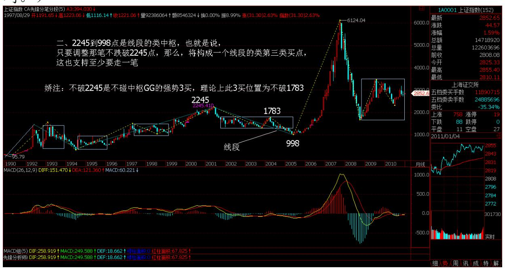
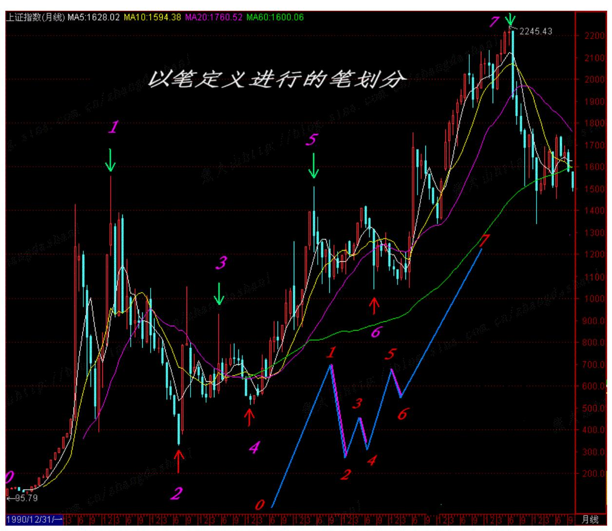
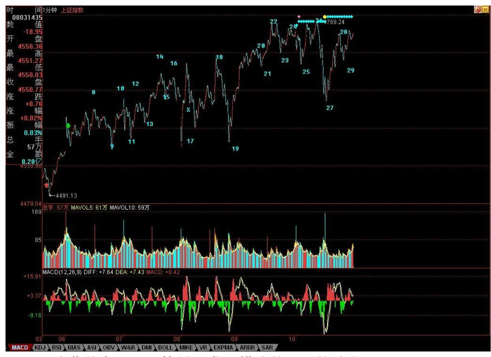
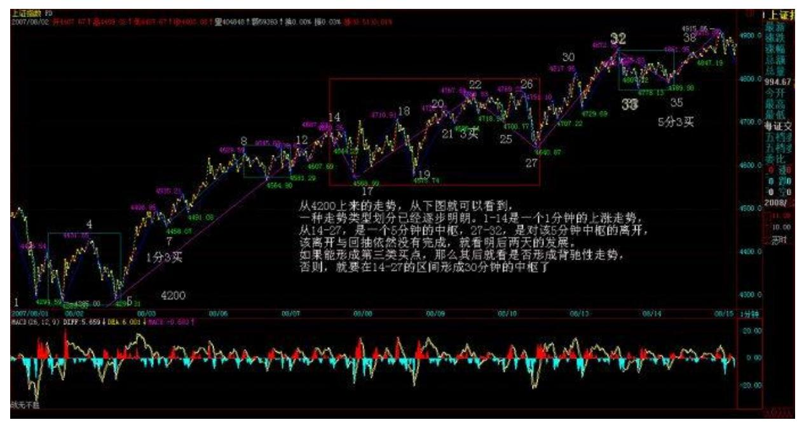
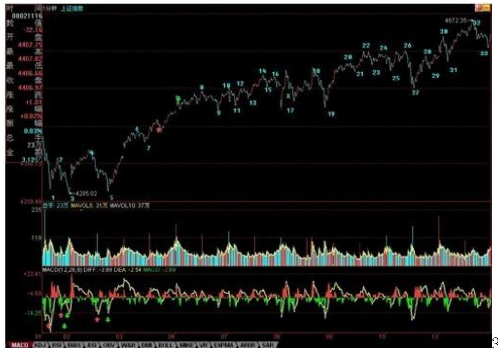
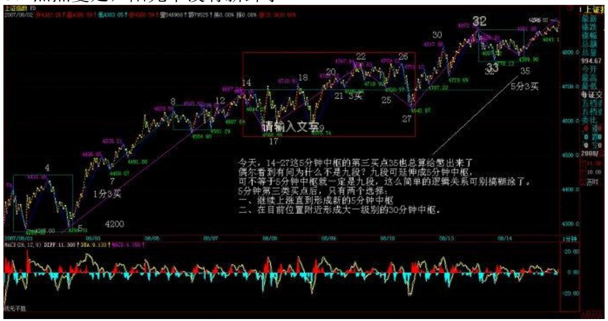
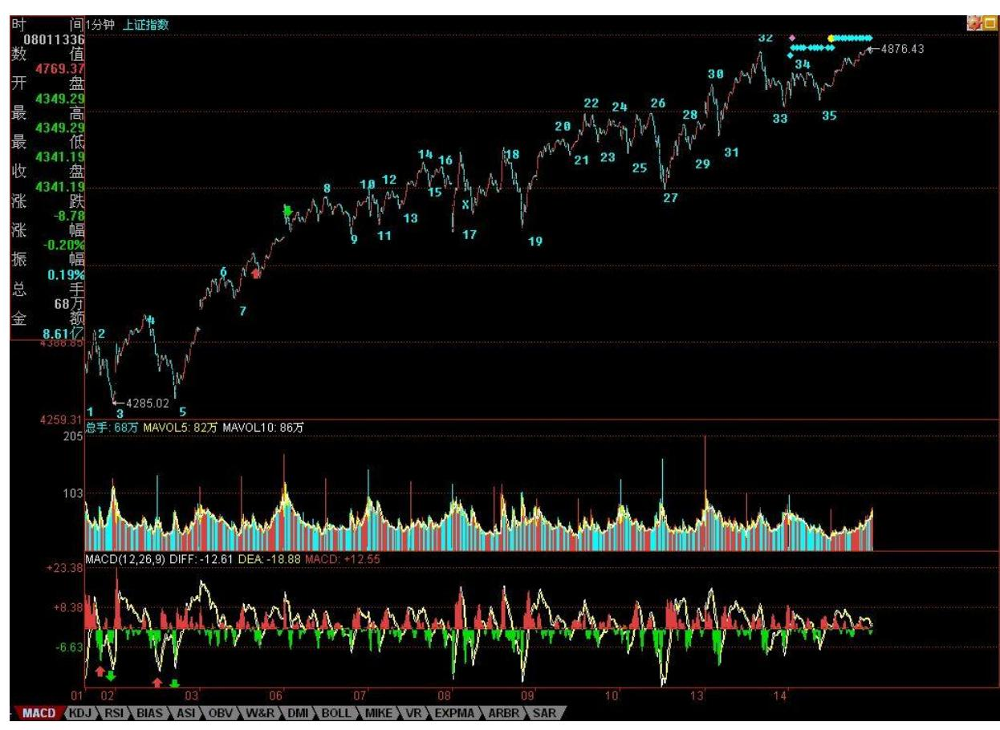
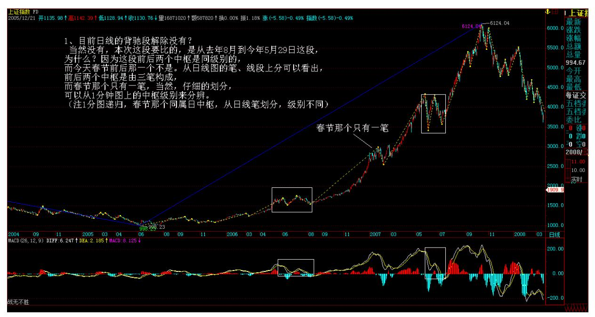
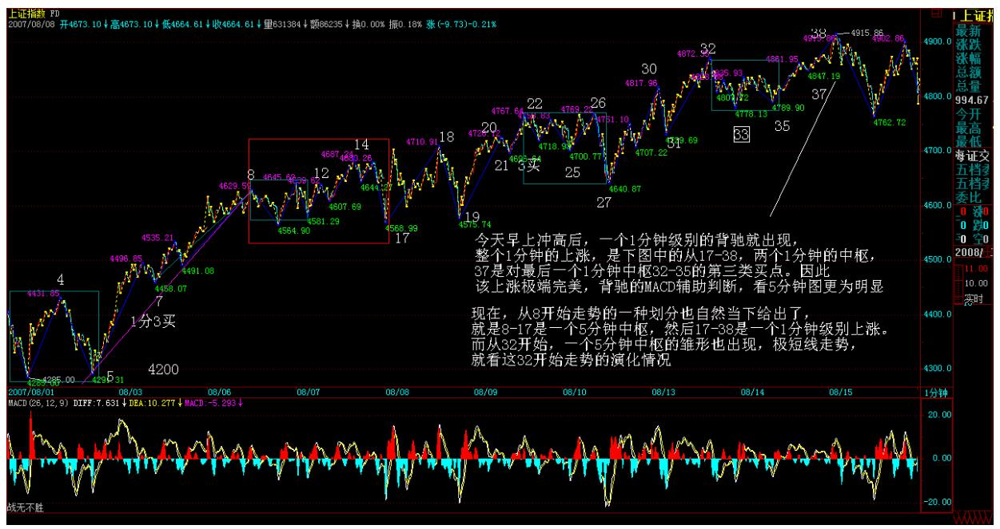
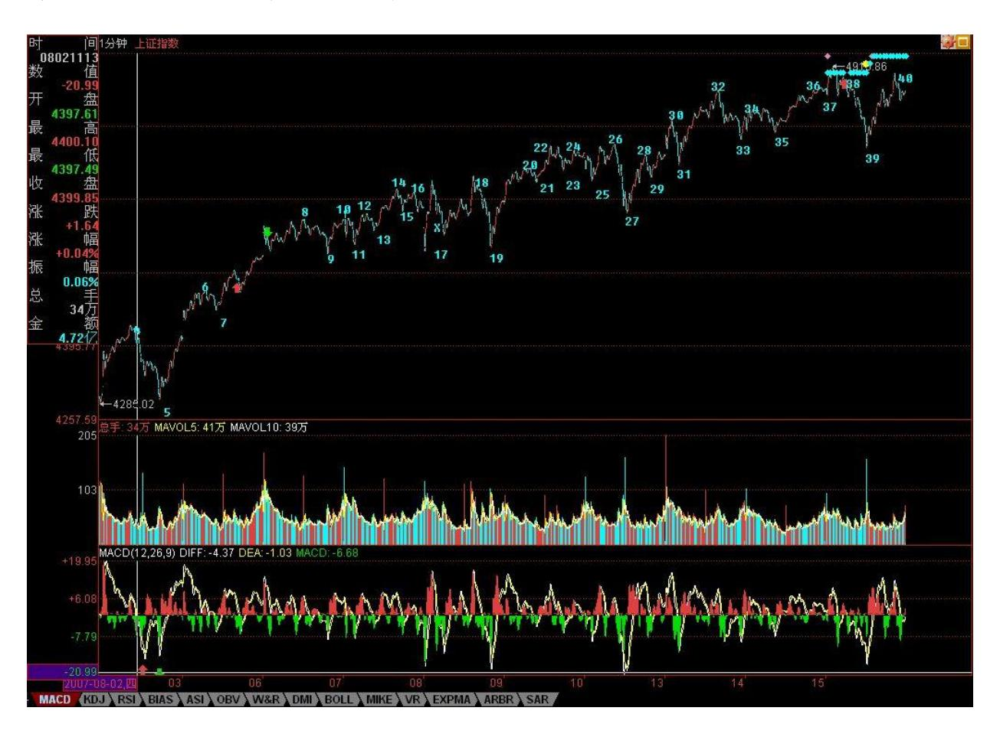

# 教你炒股票 69:月线分段与上海大走势分析、预判

(2007-08-09 23:03:22)分型、笔、线段,在 1 分钟图上可以分辨, 在月线图上的道理是一样的。但用月线图分辨,等于用一个精度超低 的显微镜,只能看一个大概,但这个大概,却是最实质性的,是一个

大方向。下面,就是上海指数的月线图。绿箭头指着的是顶分型,红 箭头的是底分型。打"X" 的就是该分型不符合笔所要求分型的规 范。这里,只要是两条:一、顶和底之间没有至少一 K 线;二、不满 足顶必须接着底、或底必须接着顶。

26 例如,第一个红箭头和第二个绿箭头之间显然不能构成一笔,也就 是说,这两个,只能取一个:如果取第一个红箭头,那么第二个绿箭 头就不是笔中分型,那么第二个红箭头,显然是一个底分型,因此, 就形成两个底分型连续的划分,显然,这时候,第一个就不算了,这 和前面说取第一个红箭头对着的底分型矛盾。所以,这里,只能取第 二个绿箭头,这时候,第一个绿箭头对应的顶分型,自然就不算笔中 的顶了。

后面的各分型,带"X"的,都可以按照上面两个原则去分析。

有人可能要问,这样分型的确定,在当下如何完成?这必须当下去完 成。例如,当走势走到第一个红箭头时,显然,第一绿箭头的顶分型 也可以暂时看成是确定的顶分型。但当第二绿箭头走出来后,这个问 题就有了可修改的地方。

有人可能要疑问,这样分型是否随时可以修改?答案是否定的。一旦 完成的图形,这修改就不可能了。分型可修改,证明图形没完成。例 如,当第二个红尖头分型出现后,前面三个的分型的取舍就是唯一 的。这个分型的可修改性,反而是一个对走势判断极为有利的性质, 例如,第二个绿箭头走出来后,这图形未完成的性质就是百分百确定 了,(娇注:强词之嫌。有中继顶分可能)但所有图形必然完成,走势 必完美。如何才能完美,这样,在理论的框架下,只有极少的可能, 而这些可能,就成为综合判断的关键条件。然后根据各级别图形的未 完成性质,就可以使得走势的边界条件极端的明确与狭小,这对具体 操作,就是极为有利的。注意,这可和概率无关,是百分百的纯理论 保证,最终所依据的,就是在本 ID 理论最早反复强调的走势必完美 原则。

其实,本 ID 的理论的关键不是什么中枢、走势类型,而是走势必完 美,这才是本 ID 理论的核心。但要真正理解这个关键,可不是看字 面意思就能明白的。

显然,目前月线上的第 1、2 段已经走出来,其中,按照线段里笔的 类背驰,1 的结束那顶与 2 结束那底都是极为容易判断的。上海指数 的历史大顶与底,根据这线段的划分,都不是什么难搞的秘密。那 么,对现在依然进行中的第 3 段走势,有什么可百分百确定的呢? 一、显然,这一段要成为段,那至少要三笔,而现在连一笔都没走 完,因此,这轮行情的幅度,可想而知。也就是说,即使该笔走完, 一个笔的调整后,至少还有一个向上的笔。

二、2245 到 998 点是线段的类中枢,也就是说,只要调整那笔不跌 破 2245 点,那么,将构成一个线段的类第三类买点,这也支持至少 要走一笔。

(娇注:当时在 2007 年 8 月 4300 点,禅师按照常理推断月线一笔 一般不会破 2245,所以这样叙述。结果一笔破 1783 到 1664, 呵。)

三、笔的完成,必须要构成一个顶分型。而一个月线的顶分型将如何 构成?这意味着什么,这个问题就当成是一个作业,各位去思考一 下,然后给出这个结论对应的操作策略。从中也可以亲自实践一下, 去明白一下理论指导下操作的力量。

28 最后,再提一个思考题:为什么本 ID 在 7 月份要大搞满江红, 而 8月以后就放手坐轿子,请利用分型的原理给本 ID 的行为一个技 术上的解释。(娇注:技术解释为使得月线顶分不成立,上升笔延 续)张大山:上证 2245 前月 K 线笔划分(终结版),仅此希望初学缠 论者, 不要在笔的划分上再过分纠缠了。笔的划分有着严格的定义, 一切按定义来就行了。

解盘及互动问答:

#### \*\*\*\*\*\*\*\*\*\*\*\*\*\*\*\*\*\*\*\*。

热点在震荡中蔓延 (2007-08-10 15:50)昨天已经给了第四拨人一个任 务,就是顶住。可以这样说,在外围环境如此恶劣之下,这总算顶住 了。当然,站在本 ID 不厚道的角度,会说他们姿势不够优美。周末 消息面,就决定这拨人的短线命运。

技术上,今天 5 分钟的第三类买点并没有被制造出来,因此依然只能 归于中枢震荡的范畴。下周一,能否制造此买点,将决定短线大盘的 上攻力度与强度。当然,偷懒的、看不懂的,就继续 5 日线,这确实 是懒人的懒招数。

个股方面,昨天在回答问题时说了,现在是从大盘 50 到 300 的热点 蔓延,如果这蔓延能成功,那么大盘的热度还会增加,今天,这迹象 已经开始。更重要的是,今天 ST 大面积启动,也表明短线的投机资 金开始蠢动起来,因此,下周的热点蔓延能否成功,是决定行情延续 时间的关键。

个股方面,中字头继续是本 ID 的主力。对那些不启动的中字头,轿 夫都应该像 777 学习。本 ID 昨天那一通骂还是有点作用的,看看今 天的中铝、中国国航,但国航确实恶心,跟着南航后面跑,那李总的 军人作风成气了。算了,大周末的,就不想骂人了。其他股票,等大 盘炒热后,会逐步补涨。

一到周末,本 ID 就对股票反胃。各位腐败去吧。

30 31 公募基金经理"快男"发展模式的不可持续(2007-08-13 08:29:07)今天,原来只有 13 页的所有文章,不知道被谁又改成 32 页,显示的文章又基本全了,其他分类也一样,但时政经济还是没 有。本 ID电脑水平连菜鸟级别都算不上,也不想搞明白究竟什么回事 情。希望是新浪的新系统有待完善。请问,有什么方法让这用得最多 的时政经济能重新显示文章。

对于粉丝无数、发行井喷的公募基金,探讨其发展模式的不可持续, 似乎有点杞人忧天。但公募基金经理的跳槽比例在今年达到惊人的 40%,已明白无误地表明,如今这种基金经理"快男"发展模式的不可 持续。

表面上,公募基金经理跳槽是由于个人待遇以及业绩压力等原因。众 所周知,公募基金只收取管理费,相对于私募基金的收益提成模式, 其分配上的激励机制明显不如后者。但只收管理费模式意味着旱涝保 收,收益提成模式在牛市中可能兴旺一时,而在熊市中,则会引发无 数法律、经济纠纷,终不是长久之计。

当然,有人可能反驳说,收益提成模式能使得基金管理者的优劣得到 更直接地反映,使得优秀的基金管理者能得到更大的发展,因此,公 募基金也可以尝试采取相应的模式。但是,在只收管理费模式中的管 理资金大小与收益提成模式中的分成收益大小具有同等的赏优汰劣意 义,而公募基金占有制度上的先天优势,由于能够合法面向公众募 集,其资金规模具有私募基金所不可比拟的优势,至少在目前的经 济、法律、社会结构下,只收管理费模式是获取这种募集优势所必须 付出的代价,不仅公募基金不可能采取收益提成模式,而且阳光化的 私募基金也只能采取只收管理费模式。

募集范围的大小通常正相关于分配比例的大小,例如,私人股权基 金,其募集范围在主要针对二级市场的公募与私募基金之间,一般就 采取收取管理费与比例较低提成的综合分配模式。如果收取了管理 费,那么像私募基金那样根据收益大小最高分成可达到 50%的分配模 式是不切实际的。公募基金只收管理费模式的不可改变,决定了其内 部的分配机理机制也不可能有大的实质改变,因此,企图通过公募基 金分配方式私募化而使其可持续发展是不切实际的。

由于个体利益的巨大诱惑,明星式人才必然趋向于高比例分配激励的 私募基金,这对公募基金来说,基金经理"快男"模式将形成一个恶 性循环,在私人利益驱动下,更多人会把公募基金当成积累个人资源 的平台。一旦从这平台得到个人所期望得到的资源,离开就成了他们 必然的选择。现在开始采取的双基金经理制,其实更坏,等于把这跳 板上的人又增加了一倍,而这些人,站在长远的角度,对于公募基金 来说都是狮子虫。

要解开这个恶性循环,就不能培养"快男"式基金经理,而是要依靠 集体、团队的力量。要明星化的不是个人,而是团队。要形成这样一 个良性循环,就32 是让优秀的人才能以在明星团队为荣。这有点类似 "智库"的品牌建立,一个"智库"是否优秀,从来都不是因为里面 有多少"快男" ,而是该"智库"的传统、风格、团队的综合研究 力。一个更通俗的例子就是,无论北大、清华曾出过多少"快男" , 但北大、清华的名声却依然凌驾于一切"快男"之上。

因此,对于公募基金来说,应该淡化基金经理的个人色彩,突出团体 的风格,逐步形成自己的特色与传统。一个好的基金,一个能可持续 发展的基金,就应该走金融"智库"的品牌之路。另外,在个人经济

利益上,对基金管理公司进行适当的股权创新,加大核心团队的持股 比例,这也是必要的。

最后,附带说说 8 月大盘的走势。7 月大盘站住了 5 月均线并突破 了 4159 点的 1/2 线,目前该线已经上移到 4174 点,而 5 月均线 也上移到 4170 点附近,并且 7 月长阳的一半位置在 4136 点,因 此,4150 点附近成了大盘中线能否保持强势的最重要位置。只要能有 效站稳该位置,那么大盘的整体走势就能保持向上拓展空间的能力, 否则将引发大盘周线指标的走坏,至少要重新陷入新的大震荡中。

但即使大盘能保持强势,本月也一定要注意大盘过分冲高所隐含的月K 线上影杀伤力。8 月是宏观政策理清思路的关键时间,这方面的变动 将对大盘走势起着决定作用。此外,外围股市的走势也会对大盘走势 产生影响。全球化社会里,没有哪个股市是可以与世隔绝的。个股方 面,一、二线成分股的行情依然会延续,但要注意升幅过大后的短线 震荡风险,而当业绩风险释放后,二、三线题材股会找到重新活跃的 动力。

热点,如期蔓延中(2007-08-13 15:38:41)上周末说了,热点会逐步蔓 延,从 50-300-二、三线,今天,300 中已经骚动不断,而二、三 线,也已经有不少按捺不住蠢蠢欲动了。今天唯一不完美的,就是第 三类买点还没有走出来,所以,明天的走势依然有变数。最简单的, 还是看 5 日线。

从 4200 上来的走势,从下图就可以看到,一种走势类型划分已经逐 步明朗。1-14 是一个 1 分钟的上涨走势,从 14-27,是一个 5 分钟 的中枢,27-32,是对该 5 分钟中枢的离开,该离开与回抽依然没有 完成,就看明后两天的发展。如果能形成第三类买点,那么其后就看 是否形成背驰性走势,否则,就要在 14-27的区间形成 30 分钟的中 枢了。

个股方面,没什么可说的,还是中字头。N 天前,本 ID 骂中行和中 石化连新高都不去太过分,今天,也都基本新高了,这可以看出,中 字头就是有力量。当然,所谓的中字头,就是大型国企,只是本 ID比 较懒,就买其中带中字开头的,这样好记。当然不会有人觉得,如果 没有中字头的就不会涨了。原来的33 那十几只老股里,依然是中字头 的 000777 表现最好,后面,一旦热点蔓延成立,其他都会逐步动起 来的。本 ID 买股票从来都不是乱买的,8 元让各位买000777 时,各

位当然不可能知道该股基本面将会怎样,但本 ID 就知道,这就是对 基本面的把控能力,光技术面,只是一方面。例如,600649,大概到 现在,没人知道这股票里卖的什么药,但如果你去研究一下该股是现 在管理层的资本运用的辉煌历史,还有上海市对国企重组的计划,那 么,当然就明白,本 ID 当时让各位在 6 元买入,不是瞎说的。好的 剧本,当然是慢慢展开的,本 ID经常是在序幕时就告诉各位,所以, 如果没耐心的,千万别买本 ID说的股票。否则,请问,有谁能把 000777 从 8 元拿到现在?大概,除了本 ID,来这里的人是不会有 了。

下面是分段图,各位研究去吧,有一个谈判在 4 点,先下,再见。

34 35 36 41 与 1,本 ID 对二级市场兴趣已失(2007-08-13 21:26:14)周五,本 ID 是一边叨唠,一边让人报盘买股票。一个 41 元的股票,本 ID 最 高买到近 43 元,心里越买越窝火。看看,里面的人,1元的成本,那 种 PE 游戏,本 ID 也干着,凭什么让本 ID 贵了 40来倍来买?今天 下午,一个关于 PE 的谈判,本 ID 已经决定全面转战 PE,当然,撤 退是战略性的,本 ID 决定的原则是:第一,本 ID 将不会再买入任 何二级市场的股票;第二,任何成本不为 0 的股票,本 ID 都将把成

本逐步抛到 0 为止;对成本为 0 的股票,本 ID 将持有到大牛市结 束,有空可以继续玩先砸后买增加筹码的游戏。

本 ID 已经有了基本的判断,就是谁执 PE 牛耳,谁得中国资本市场 的天下,PE 中,除了 Pre-IPO 等,类似收购基金之类的,在中国依 然没有大发展,当然,Pre-IPO 这类活动当然不能放弃,但收购基金 之类活动,也是可以逐步展开的。在中国,目前类似活动搞得比较好 的,是一个生了 5 个孩子的海龟中男。

当然,完全放弃二级市场是不行的,所以必须留下已经有的根据地。

但如果现在不到 PE 上大发展一把,那么就整天为人做嫁衣裳了。前 期,本 ID 那一顿忙,已经为此铺好了路。

当然,在二级市场中,也有类 PE 的机会出现,也就是当大的波动让 某些大的重组股票达到足够吸引的地步,这也是好的介入机会,在全 流通时代,如何用收购基金的模式在二级市场搞上一票,这也是一个 有趣的活动。但目前讨论这个问题有点无聊,现在,二级市场之外黄 金满地,本 ID 脑子又没进水,没那闲工夫搞这二级市场了。

以上都是心里话,也是本 ID 的决定。当然,PE 的活,意味着整天要 腐败,这是本 ID 最不喜欢的,当然,有些活可以让别人干,本 ID只 要有时间,依然会保持每天的解盘。毕竟,对于散户,二级市场是唯 一可大面积介入的地方,而且,原始积累也只能靠这地方,山高水 长,如果本 ID 能帮各位一把,也算结一段善缘。本 ID 会尽力为 之,各位有缘得之吧。

### 37 热点蔓延,阳光下没有新鲜事

(2007-08-14 15:49:37)当然,没有阳光下也同样没有新鲜事。今天的 走势,唯一的特点,就是没有新鲜事。从上周起,本 ID 不断强调热 点开始蔓延,今天,这热点已经开始燎原。

50-300-二、三线,本 ID 已经给股票的热点蔓延画出了线路图,现 在,不过是按着线路图的一种演绎,正所谓阳光下没有新鲜事。

今天,14-27 这 5 分钟中枢的第三买点 35 也总算给憋出来了(偶尔 看到有问为什么不是九段?九段可延伸成 5 分钟中枢,可不等于 5分 钟中枢就一定是九段,这么简单的逻辑关系可别搞糊涂了。) 5 分钟 第三类买点后,只有两个选择:一、继续上涨直到形成新的 5 分钟中 枢;二、在目前位置附近形成大一级别的 30 分钟中枢。

38 现在,关键是热点的蔓延持续,只要这没问题,一切都好办。

站在日线角度,提两个思考题:1、目前日线的背驰段解除没有?提 示,关键是哪段和哪段比,连相比的对象都没分清楚,还谈什么背驰 段?更不用说什么精确定位了。

39 2、4174 点的 1/2 突破后,下一条真正的压力线在哪里?注意, 本 ID 战略转移,并不会影响博客的一切活动,只是有时候晚上的文 章,可能会因为应酬改到早上发,如此而已。而且,本 ID 现在是战 略转移,0成本的股票是不会抛的,没到 0 成本的,本 ID 也不会胡

乱抛的,没到卖点,凭什么抛?今天,能在 49 下买到 002149的,可 要感谢本 ID,某人脑子进水,竟然企图让本 ID 在 50 下出来,一开 盘就企图打压,脑子有水吧?这股票,本 ID 会抛至少一半的,但想 让本 ID 今早 49 以下就抛,简直病得不轻。

今天可以回答问题到 4 点半。

缠师:各位请不要胡乱猜疑,本 ID 关于二级市场 20 年以上大牛市 的判断从来没改变过。本 ID 春节后说在突破 GDP 之前,成分股为主 的第一段行情一定不会结束,当时,有谁能如此明确的说?又有谁能 把 20 年的大牛市给明确分了段?本 ID 的这观点从来没改变过。

没有大牛市,PE 也白搭,只是现在的二级市场,比起 PE,利润太 薄,那种能 3 年翻几十倍的股票越来越难找,但在 PE 里,一点都不 难。

资本都是往利润高的地方跑,本 ID 也不例外。

本 ID 对大盘没有任何暗示,短线大盘的走势,看分段图甚至 5 日线 就能判断,谁都没必要预测。

累了,10 点了,先下,再见。

40 41 1. 网友 [匿名] 新浪网友: 能谈谈对"次级债"的看法吗? 2007-08-14 15:54:47缠师:这类问题,在本 ID 关于货币战争的帖子 里都说过了。其中一个比喻是这样的,美国这个发动机积炭了,只能 换一个新的。新的,可以是一个新国家,例如中国,但美国人显然不 乐意。唯一让美国人乐意的,就是全世界人出钱为美国人换一个新 的。而从 2001 年起美国人的所有玩意,就是这种玩意,不管这玩意 变了多少名字。

#### \*\*\*\*\*\*\*\*\*\*\*\*\*\*\*\*\*\*\*\*。

2. 网友 [匿名] 新浪网友:为什么第三买点不是 33?2007-08- 1415:56:06缠师:如果是 33,前面离开的一分钟走势就是未完成的。 现在,离开是 27-32,回抽是 32-35,都是标准的 1 分钟走势类型。

#### \*\*\*\*\*\*\*\*\*\*\*\*\*\*\*\*\*\*\*\*。

3. 网友 [匿名] 举杯邀明月: 老师,有个问题,就是假如我用 5 分 钟以及更大级别的 K 线级别操作的话,画图也还是按照笔-线段-中枢

这样的同样的方法吧?另外希望老师能继续股票课程的讲解。别真的 离开我们。2007-08-14 16:01:22缠师:本 ID 什么时候说要离开了? 本 ID 只是说不再新买二级市场的股票,买了窝火。请你先把显微镜 和被显微镜这两种关系搞清楚。

你当然可以只看 5分钟图,那等于用一个不太精确的显微镜,难道 5 分钟图上就没有线段、笔?用 1 分钟图上的线段笔,只是一个更精细 的显微镜,这并不影响任何级别的操作。关键是对精确度的要求,但 笔、线段等等,对任何精确度下的图,都是必要的。本 ID 不是有一 课示范了在月线上如何划分笔、线段了吗?

#### \*\*\*\*\*\*\*\*\*\*\*\*\*\*\*\*\*\*\*\*。

4. 网友 [匿名] 新浪网友: k 线 n-1 区间[8,10]和 k 线 n 区间 [9,10],这两 k 线是否是包含关系?2007-08-14 15:52:25缠师:当 然是。

42 5. 网友 [匿名] 新浪网友: 如此看空为何不砸盘啊!2007-08- 1416:08:05缠师:本 ID 什么时候看空?至少 20 年大牛市,目前只 是牛市第一阶段,这些观点都无须修正。本 ID 现在不会再买二级市 场的任何股票,只是因为本 ID能通过 PE 买到更便宜的股票,更大的 机会,如此而已。

#### \*\*\*\*\*\*\*\*\*\*\*\*\*\*\*\*\*\*\*\*。

6. 网友 [匿名] 新浪网友: 很想请教博主一个问题:你认为这次中 国能否避开日本和东南亚当年最终资产泡沫破灭后的经济衰退、百业 萧条的后果?或者说退一步说,不至于那么严重?虽然中国也曾经经 历过 80 和 90 年代的两次通货膨胀,但当时中国应该算是一个相对 现在来说,还是比较封闭的经济体,泡沫破灭后的强度或许可以通过 内部消化,而现在金融开放之后,情况是否应该和日本、香港当年来 比较呢?期望听到你的意见,好象也曾经听你说过一个"年线级别调 整"的看法,我认为这是相当有可能的,毕竟这次中国需要面对的是 全世界的资金,还有玩钱已经玩了几百年的大鳄们。2007-08-14 16:05:39缠师:日本、香港那些怎么能和现在的中国比,现在美国是 病人,而在美国病好之前,中国关键是如何去用好化攻大法,让美国 就算病好了,功力也被化掉一半。

如果出现世界范围的通货膨胀,那全部人都逃不掉,到时候比的是谁 能最快恢复,显然,如果中国自己不当傻瓜,那一定是中国,这里有 深刻的产业链上的道理,以后有空写个帖子说说。

只要中国能第一个恢复,那么,发生什么并不重要。如果真有 1929 年,没人能逃掉,拿着什么货币、什么资产都是废话,这就是资本主 义的本质所在,一个游戏而已。

问题不是去逃掉 1929 年,那不可逃,唯一的区别只是损失大小。能 用最小代价活下来,这就是最大的成功,就如同那场把恐龙灭掉的灾 难,在那灾难面前,唯一的问题是如何在灾难下生存,而不是祈祷灾 难不降临。地球后来的主人,只能在这生存者中。无论国家还是个 人,这道理是一样的。

43 7. 网友 [匿名] 新浪网友: 老大,你以前提到到的 8 月份政策 面风险现在解除了么?2007-08-14 16:11:55缠师:这还要感谢美国这 次的抽风,在这样的国际环境下,谁还敢乱搞,真是活腻了。所以, 政策不是万能的,政策不过是合力的结果。

但也不是太过分,毕竟,秋后是可以算帐的,当然,现在还夏天,先 把夏天过了再说。

#### \*\*\*\*\*\*\*\*\*\*\*\*\*\*\*\*\*\*\*\*。

8. 网友 [匿名] 天眼: 关于 k 线的包含关系。如果第 n-1 根 K 线 的高低点全在第 n 根 K 线的范围里,那么 n-1 和 n 是不是包含关 系?2007-08-14 16:21:55缠师:这当然是,难道还有什么疑问的?对 于连续包含关系,必须按时间顺序,一个个合并下去。

网友 [匿名] 天眼:下列情况是不是包含关系?假设 n 和 n-1 k 线 的高低点分别为 gn、dn 和 gn-1、dn-1 。那么,gn=gn-1 且 dn>dn-1;dn=dn-1 且 gn<gn-1;dn=dn-1 且 gn=gn-1。

缠师:当然是。

#### \*\*\*\*\*\*\*\*\*\*\*\*\*\*\*\*\*\*\*\*。

9. 网友[匿名] 新浪网友: 14-27 形成 5F 中枢是否不准确?因为14 开始的 3 段的高点不够高?2007-08-14 16:29:13缠师:中枢和高点

高不高有什么关系?中枢,关键是有重合部分。

#### \*\*\*\*\*\*\*\*\*\*\*\*\*\*\*\*\*\*\*\*。

10. 网友年年一变三: 缠主,看了你昨天的帖子,我们小散没法参 与,但我想 600635 按缠主的宏观思路,是否应该是只大牛呢?另 问:缠主多次提及 636是战略建仓,我只是建早了些,还小套。问缠 主,不买二级市场的股票也包含 636 吗?缠主先别走,贴了三次了, 盼回复。谢谢!2007-08-14 16:28:18缠师:不买就是都不买了,不过 600636,本 ID 在 10 元上下买了不少,本来是要继续买的,既然都 不买了,就都不买,战术服从战略,本 ID 不买,自然44 还有别人要 买。像 600737、中铝、中国国航等等中字头以及原来那十来只,本 ID 都会继续持有的。没有成本为 0 的,本 ID 会找机会变为 0,这 就是套钱的手段,套出来的钱,都离开二级市场去干 PE去,如此而 已。

#### \*\*\*\*\*\*\*\*\*\*\*\*\*\*\*\*\*\*\*\*。

11. 网友 [匿名] 新浪网友: 14-27 形成 5F 中枢是否不准确?因为 14 开始的 3 段的高点不够高?2007-08-14 16:36:36缠师:中枢和高 点高不高有什么关系?中枢,关键是有重合部分。

网友 [匿名] 新浪网友:我可能没说清楚,因为 14 开始的 3 段的高 点不够高,使得与后面的六段无法重合?缠师:临走回答一下,这问 题太典型,就是概念没搞清楚。5 分钟中枢,只要 3 个 1 分钟走势 类型有重合就可以,不是一定要里面的所有段都重合。所有都重合, 只是其中一个特殊的情况,这叫又线段延伸九段后形成 5 分钟中枢, 在这种情况下,同样可以看成是三个 1分钟走势类型的重合。

#### \*\*\*\*\*\*\*\*\*\*\*\*\*\*\*\*\*\*\*\*。

缠师:先给下午那两个问题的答案:1、目前日线的背驰段解除没有? 当然没有,本次这段要比的,是从去年 8 月到今年 5 月 29 日这 段,为什么?因为这段前后两个中枢是同级别的,而今天春节前后那 一个不是。从日线图的笔、线段上分可以看出,前后两个中枢是由三 笔构成,而春节那个只有一笔,当然,仔细的划分,可以从 1 分钟图 上的中枢级别来分辨。

45 2、4174 点的 1/2 突破后,下一条真正的压力线在哪里?是 2/3 线,目前在哪里,各位自己算算。还有一个问题请思考,日线图上的 笔、线段,和一分钟图上的日中枢有什么关系?46 外围因素引发今日 震荡(2007-08-15 15:49:33)先解答一个和打坐有关的疑问,本 ID 说 念想把横隔膜以下气息在横隔膜以上送出,这气肯定不是真正呼吸之 气。人体结构里,横隔膜以下哪里有什么呼吸之气?那只是一念,以 此一念带动那非气之气之真气。

好,说股票。最近,外围市场鬼哭狼嚎的,弄得全世界的鳄鱼都痛哭 流涕。中国市场震荡一下,也很应该。技术上,昨天已经很明确说 了,现在,或者继续上涨直到出现新的 5 分钟中枢,或者就在这里形 成一个 30 分钟中枢,除此之外,别无选择。

今天早上冲高后,一个 1 分钟级别的背驰就出现,整个 1 分钟的上 涨,是下图中的从 17-38,两个 1 分钟的中枢,37 是对最后一个 1 分钟中枢 32-35 的第三类买点。因此,该上涨极端完美,背驰的MACD 辅助判断,看 5 分钟图更为明显。(各位请自己去看,这里的贴图只 有 200 的额度,本 ID 不能浪费太多空间。在 5 分钟图中,看对应 1 分钟图中的走势去比较力度。)这是一个标准的走势,十分教科 书。

后面的震荡十分正常了。现在,从 8 开始走势的一种划分也自然当下 给出了,就是 8-17 是一个 5 分钟中枢,然后 17-38 是一个 1 分钟

级别上涨。而从 32开始,一个 5 分钟中枢的雏形也出现,极短线走 势,就看这 32 开始走势的演化情况。

47 个股方面,请问 002149 让各位爽了没有?当然,后面的走势和本 ID没关系,本 ID 只在上周五最高买到 43 元,然后把其中 41 附近 一部分清单在这里放了几个小时。这股票,为什么还有这么多人抢 入,最主要是基本面与成长性。本 ID 在 N 个月前,强调过中小版成 长股的中长线介价值。后来,本 ID 也告诉过介入了 002121,注意, 这股票和 002149 都和 600635 有关系,那纯属意外。对中小版,一 定要看其成长性,而且要有耐心。

48 注意,任何股票,都不值得追高,包括如 002149 这样的。

不过,这都是老皇历了,本 ID 现在不会再买任何二级市场的股票, 只会等待机会把成本不为 0 的的出掉变为 0,然后都去干 PE 去。至 于其他股票,本 ID说过的任何股票,本 ID 都持有着,当然,很多都 是 0 成本的,但本 ID 都会持有到牛市结束。

这前面说过。本 ID 再强调一次,本 ID 对大牛市的信心没变,但目 前进入成分股泡沫行情的判断也没变。成分股行情结束后,还至少有 两轮行情,分别是成长股与重组股带头,这些游戏,至少玩 20 年, 早着呢。

本 ID 就多累点,PE 多点如 002149 的,让各位在 40 元买了也不后 悔的好股票。

二级市场,咱相信群众。

今天有事要去谈,先下,再见。

