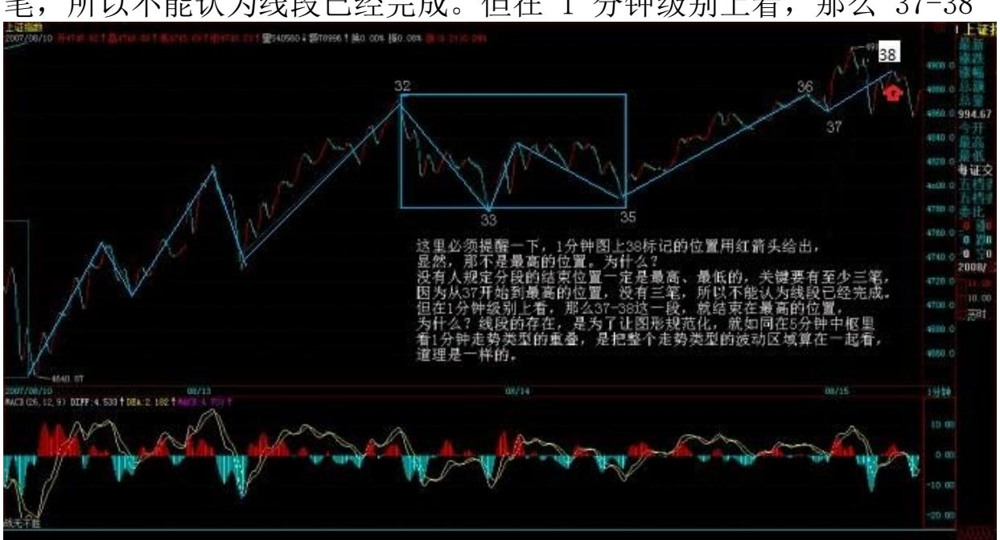
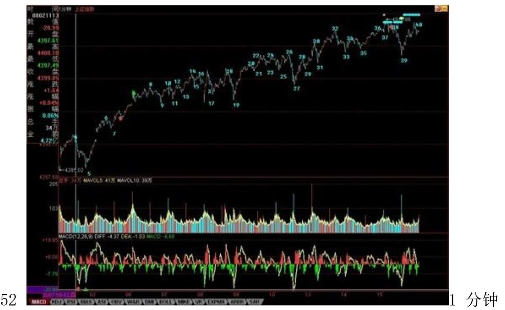
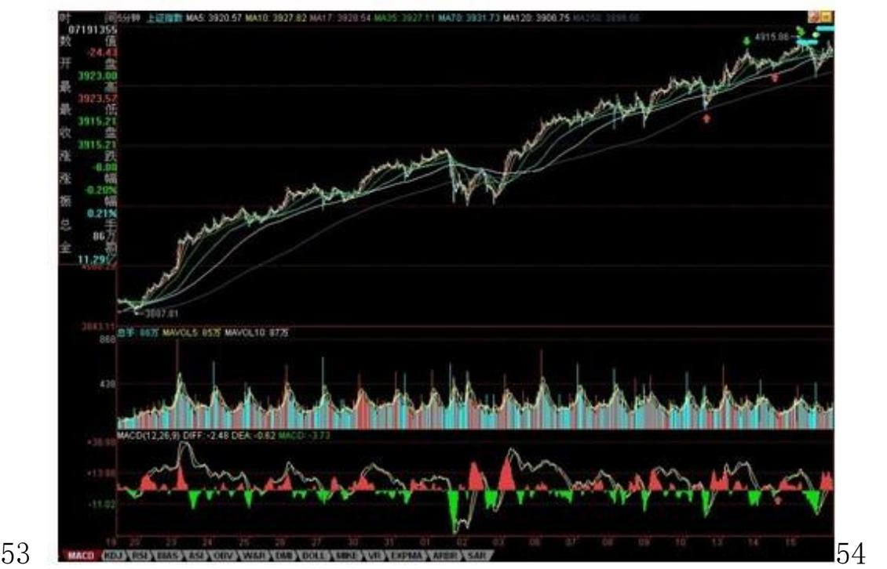
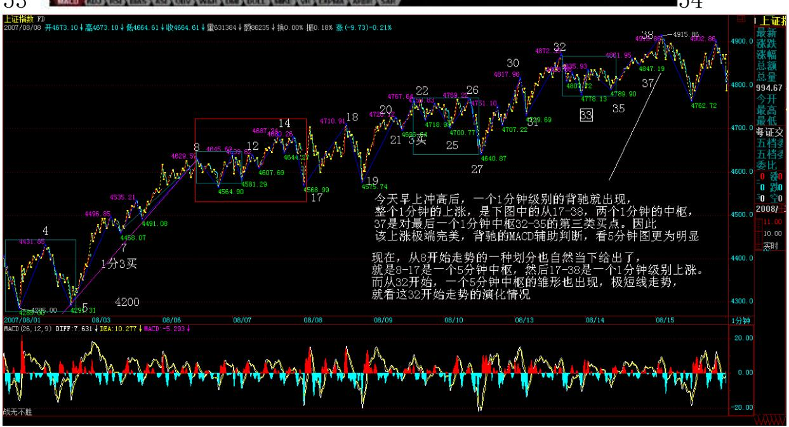
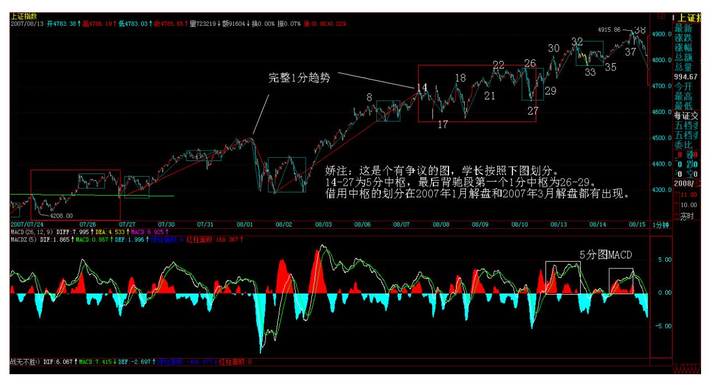
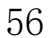
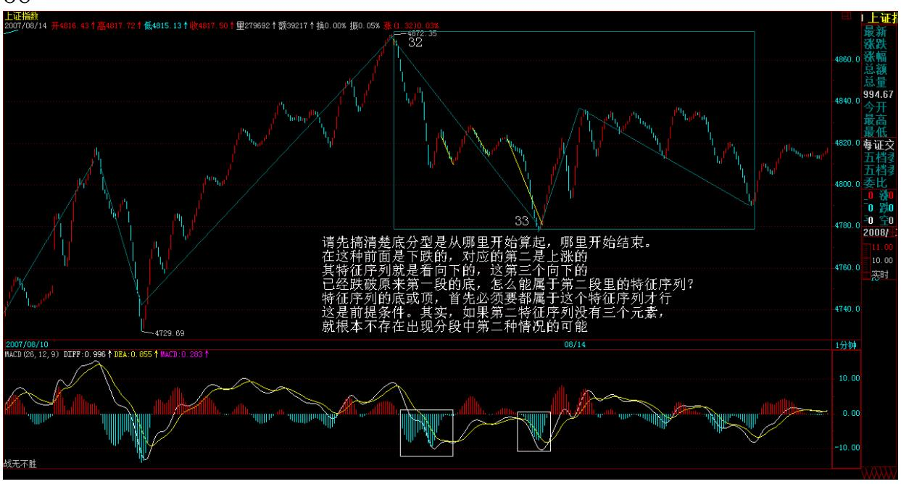
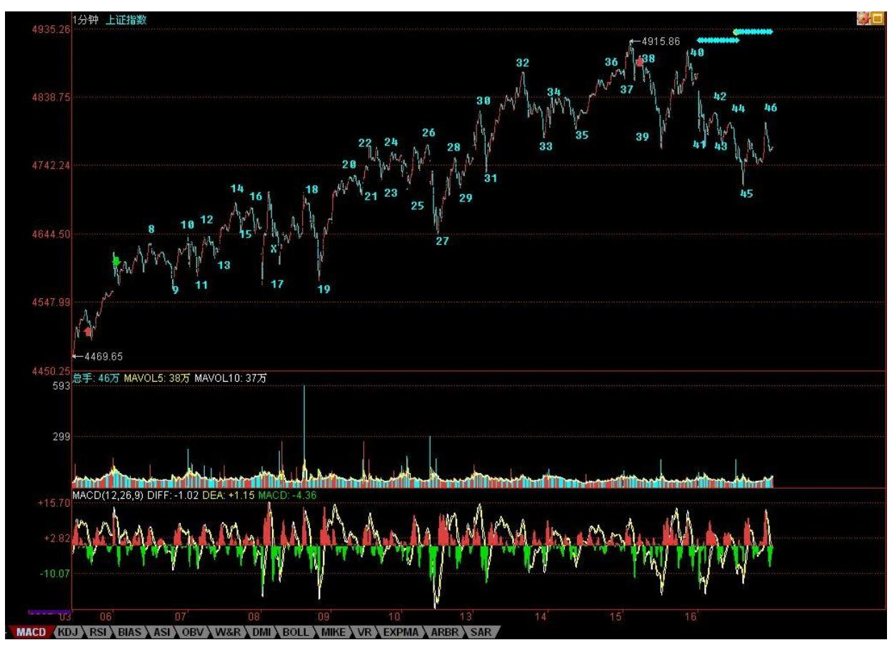
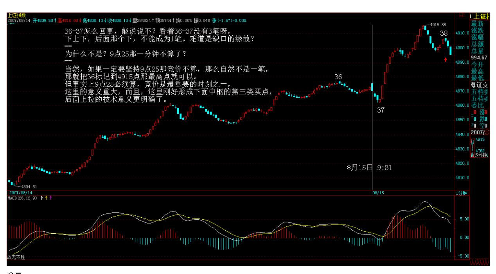
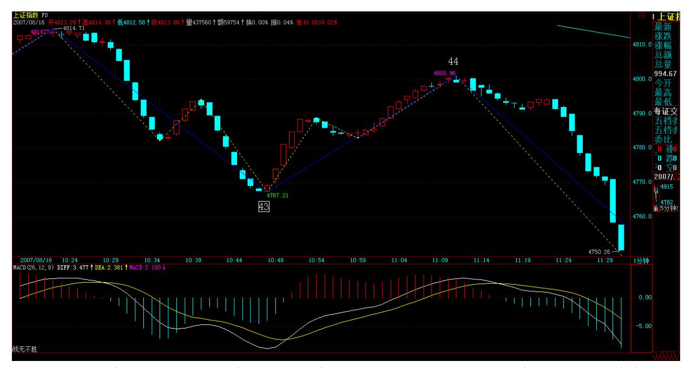

# 教你炒股票 70:一个教科书式走势的示范分析

(2007-08-15 22:41:35)首先,今天下午太匆忙,37 后就直接标记 39,晚上回来才发现,已经改过来。

在前面的课程里,本 ID 反复说过,结合律是至关重要的。这里的 人,认真学过抽象代数的人少,所以不大明白运算规则的选择对研究 对象的决定性意义。对于走势来说,结合律就是连接走势之间关系最 重要的规则,不深切明白这一点,如何能明白走势本身?无论如何结 合,本 ID 的理论对走势的分析原则是不变的。可以这样认为,本 ID 的理论,就是走势保持结合律下具有变换不变性的一套理论,而且可

以严格地证明,是唯一能保持分解变换不变且保持结合律的一套理 论。如果有点现代数学常识,对这理论的意义应该能多点了解。

这几天,随着走势的当下发展,本 ID 不断变换着所看的中枢,这根 本的原因就在于结合律,因为结合律,我们可以对走势进行最有利观 察的分解,这样,才能更容易明白走势究竟在干什么?例如,到今 天,走势一种最明显的划分已经自动走出来,就是 8-17构成 5 分钟 中枢,该中枢是 4300 点那个 5 分钟中枢上来后的一个新的 5 分钟 中枢,这个中枢,在刚形成时,我们已经指出,而且任何学过本 ID 理论的,都可以当下指出。一般来说,形成这个 5 分钟中枢后,在理 论上只有三种走势:1、向上出现第三类买点,走出 1 分钟向上走势 类型,然后构成新的5 分钟中枢;(娇注:此 3 买为同级别分解 3 买,包含在 1 分走势中。)2、向下出现第三类卖点,走出 1 分钟线 向下走势类型,构成新的 5分钟中枢。

3、中枢延伸,或出现第三类买卖点后扩展成大级别的 30 分钟中枢。

显然,在行情发展中,没必要去预测走势选择什么,走势自然选择, 只需要观察着就可以。现在,走势自然选择了第一种,为什么?因为 17-38 构成完美的 1 分钟上涨走势,目前,围绕这 1 分钟上涨走势 的最后一个 1 分钟中枢 32-35,正扩展出新的 5 分钟中枢的雏形。

51 这个 5 分钟中枢,最终至少要完成的,至于是否继续扩展出大的 30 分钟中枢,还是出现新 5 分钟中枢的第三类买点继续上涨,再形 成新的 5 分钟中枢,这无须预测,与 8-17 那 5 分钟中枢一样对 待,如此而已。

那么,如果是按 30 分钟操作的,这些 5 分钟的中枢移动、震荡之类 的活动根本无须理睬,只要看明白就是,根本无须操作;如果是按 5 分钟级别操作,那么就是不参与大于 5 分钟级别的震荡,那么就等 5 分钟上涨出现背驰后走人;如果是按 1 分钟级别操作,那么今天早上 就该先走,为什么?因为 1 分钟的上涨出现背驰,按照本 ID 的理 论,后面必然回抽到最后一个 1 分钟的中枢之内,从而至少形成一个 新的 5 分钟中枢。然后根据 5 分钟震荡的走势进行回补就可以。

注意,按照多样性分解原则,新的 5 分钟中枢,暂时先从最后一个 1 分钟中枢开始算起,后面的操作先以此为准,等走势走出最自然的选

择再继续更合理的划分。按照这暂时的划分,并不影响任何操作,5分 钟中枢该怎么操作就怎么操作,如此而已。

(注:38 处的背驰禅师这里的论述为 17-38 1 分趋势背驰。后面的论 述为 38 处为 5 分趋势背驰,1 分趋背区间套)在今天的背驰判断 中,关键是知道哪一段相比,显然,27-32 与 35-38 这两段去比。而 实际的对比中,看 1 分钟图,去加两段对应的那些 MACD,太麻烦, 所以可以看 5 分钟图。这里,把 5 分钟图给放上来了,图上,相应 对比的两段已经标记出来,下面 MACD 的红箭头,对应是回抽那一 下,对应走势,就是最后一个 1 分钟中枢形成的时候,前面两段的对 比,极为教科书,请好好揣摩。

其实,只要基本概念明确,这些分析,在当下都不是什么难事。这里 必须提醒一下,1 分钟图上 38 标记的位置用红箭头给出,显然,那 不是最高的位置。为什么?没有人规定分段的结束位置一定是最高、 最低的,关键要有至少三笔,因为从 37 开始到最高的位置,没有三 笔,所以不能认为线段已经完成。但在 1 分钟级别上看,那么 37-38

这一段,就结束在最高的位置,为什么?线段的存在,是为了让图形 规范化,就如同在 5 分钟中枢里,看 1 分钟走势类型的重叠,是把 整个走势类型的波动区域算在一起看,道理是一样的。

图。

57 58

\*\*\*\*\*\*\*\*\*\*\*\*\*\*\*\*\*\*\*\*\*\*\*\*\*\*\*\*\*\*\*\*\*\*\*\*\*\*

# 解盘及互动问答:

\*\*\*\*\*\*\*\*\*\*\*\*\*\*\*\*\*\*\*\*\*\*\*\*\*\*\*\*\*\*\*\*\*\*\*\*\*\*

全球化,没有市场可与世隔绝(2007-08-16 15:41:56)"全球化社会 [里,没有哪个股市是可以与世隔绝的。"是在本周一的公募基金经理](http://blog.sina.com.cn/s/blog_486e105c01000c6m.html) ["快男"发展模式的不可持续 上写的,主要是针对八月股市的分析。](http://blog.sina.com.cn/s/blog_486e105c01000c6m.html) 现在的问题,已经很明确了,还是该文章里说的,要注意月线上影的 杀伤力。

当然,没必要预测这个问题,而且本 ID 从来都认为,美国的事情对 中国的影响从来都是战略性的,中美游戏,只看最后结果,中间都是 游戏而已。就像原来的蒋委员长,最终只得了个蒋匪而看海水之蓝终 老,谁能把美国搞成美匪,显然更牛于将蒋委员长搞成蒋匪。

美国暴风雨,全世界陪着挨冻,但至少今天的中国散户,很多都没这 种感觉。为什么?因为二、三线股被热点蔓延了。本 ID 从上周起, 反复用到的就是蔓延这个词,这确实是一个度过风雨时节的好办法, 搞工行的被美国搞了,现正痛苦中,那些到香港 QDII 的,终于知道 全世界的乌鸦一般黑了。而这里的二、三线股的火,能否温暖这风雨 之夜,就看明天和周一了。

全球化,没有市场可与世隔绝,但可以创造与世隔绝的板块,二、三 线股,本来就是给点烛光都能灿烂,关键是,如果烛光都不能给,有 点光就把投机大帽子盖上,那就瞎闹了。那些二、三线股一动就忽悠 投机的,脑子里肯定水太多。当然,现在不比上半年,这二、三线股 之火能否燎原,还真不好说,走着瞧吧。 大盘走势上,16 这点如果 跌破,那么,形成 30 分钟中枢震荡就是唯一选择了,换言之,4700 点如果不破,还有在目前位置形成新的 5 分钟震荡可能,也就是原来 的 5 分钟上涨走势依然能维持,因此,短线调整级别的大小,就看这 4700 点。

这,关键还是要看美国这病人还要鬼哭狼嚎几天了,说实在,本 ID是 宁愿中国这边 30 分钟甚至日线震荡,也希望看到美国哭个 368 天算 了,为阿富汗、伊拉克死难的人,美国人多些破产,难道不应该?今 天心情大好,看到美国暴跌就开心,虽然会让汉奸不爽,但汉奸不爽 的事情,本 ID 最愿意干。

59 今天回答问题到 5 点,因为开心。

注意,下图中的 46 并不百分百确定,因为如果明天大幅度高开,那 就要改变了,这只是大致标记上。

60 61 1. 网友 [匿名] 新浪网友: 1. 按缠主 32-35 若是一分钟中 枢,是否 32-33,33-34,34-35 都是笔而不是线段,也就是所谓的次 级别走势,他们的重叠构成一分钟中枢,也就是在某一级别走势图 上,类似 32-35 的三笔就可以构成该级别的中枢,而不需要再到更低 级别的走势图上去看了。2. 日线背驰段的问题,缠主说:是从去年 8 月到今年 5 月 29 日这段,为什么?因为这段前后两个中枢是同级别 的,而今天春节前后那一个不是。我看 MACD 图,去年 8 月至今年 5

月29 日这段的黄白线挨得一直很近,也就是二者交叉形成的面积不 大,下面的红柱子也不高,明显感觉今年 7 月到现在的红白线的交叉 形成的面积和红柱子面积都比上面那一段大,为什么背驰段还没解除 能。

盼复。2007-08-16 15:45:17缠师:请先把概念搞清楚,32-35 是一分 钟中枢,32-33,33-34,34-35 怎么会是笔而不是线段?三笔能构成 一个 1 分钟中枢?MACD 只是辅助,关键是要把中枢找到,前后对比 的走势找对,并不是 MACD 回抽就有背驰,如果这样,那直接研究 MACD 就可以,还用其他干什么?

#### \*\*\*\*\*\*\*\*\*\*\*\*\*\*\*\*\*\*\*\*。

2. 网友 [匿名] 新浪网友: 楼主打错了吧?是 4700 。2007-08- 1615:47:57缠师:对,4700。

#### \*\*\*\*\*\*\*\*\*\*\*\*\*\*\*\*\*\*\*\*。

3. 网友 [匿名] 蓝羽: 缠 JJ,一笔是否也有类似线段那样的三角形 态或奔走形态?或者说,一笔之中的非顶、底 K 线是否允许超出顶底 的范围呢?顶或底是否一定为一笔的最高点或最低点呢?2007-08- 1615:48:44缠师:一笔,是一顶一底,怎么会有三角形?顶和底,当 然一定是那一笔的最高最低,如果不是,那里面一定不只一笔。

网友 [匿名] 蓝羽:37—38 不符合"顶和底,当然一定是那一笔的最 高最低" 。理解是否正确?缠师:怎么不符合?顶和底是对笔说的, 线段是由笔够构成的,请不要搞混了。一个线段里的各笔之间,还可 以走出三角型、扩展平台等等形态。请搞清楚几个概念。分型对应的 是笔,而特征序列里元素的分型对应的是线段的破坏判断,请不要把 不同的概念搞糊涂了。

缠师:注意:发现还有人把一笔之间的分型,与线段之中的各笔给搞 混了。一笔,只有一顶一底,如果顶接着顶,那其中一个肯定不是真 正的顶。这是在62 笔的范围里说的。在笔里,当然没有什么三角形之 类的东西,笔就是一线段,两个端点。但线段中的各笔之间,是可以 有各种图形的,只要这些图形不破坏线段本身。请把概念搞清楚了。

4. 网友 [匿名] 新浪网友: 楼主可否透露下电信业重组的方案? 谢 谢!2007-08-16 16:04:18缠师:联通专搞 GSM,移动专搞大唐那玩 意,电信专搞 CDMA。这是大原则而且是最终方案,但中国的东西,没 到最后揭盖,还可能有变数,那就天知道了。

#### \*\*\*\*\*\*\*\*\*\*\*\*\*\*\*\*\*\*\*\*。

5. 网友 [匿名] 新浪网友: 不知为啥您的图看不清,能不能整一个 能够放大的图? 2007-08-16 16:05:45缠师:很高兴有一个电脑问题 本 ID 能回答的,你对着图按右键,然后把图复制下来就有大图了。 好象新的浏览器,都带放大功能,在右下角。

#### \*\*\*\*\*\*\*\*\*\*\*\*\*\*\*\*\*\*\*\*。

6. 网友 [匿名] 听风: 妹妹,有个问题要问。前天好象才出现第三 类买点,拿联通来说,当时是 7.16 元。为何在这二天却有更低的价 格?是受系统影响?2007-08-16 16:06:32缠师:有没有这买点且不 说,就算有,也是有级别的,难道一个 1 分钟的第三类买点就保证永 远上涨,显然没有这种事情。所以先搞清楚级别,第三类买点后两类 选择,更大级别与继续上涨,如何分别这,以前课程说过,就是看相 应走势是否出现盘整顶背驰。

盘整顶背驰,对应这更大级别的情况,后面出现下跌,那是天经地义 的。但即使是更大级别的,从第三类买点到盘整顶背驰,理论上必然 保证一段向上的过程,更不用说继续上涨那种情况了。但理论从来不 保证,向上以后就不再向下。

#### \*\*\*\*\*\*\*\*\*\*\*\*\*\*\*\*\*\*\*\*。

63 7. 网友 [匿名] 新浪网友:老师不知是否能光临技术论坛?现在 已有会员 1200 名了。而且答复在论坛里也方便保存。不象新浪这么 烂。期望老师能摆驾论坛。2007-08-16 16:12:13缠师:本 ID 不反对 有这样的论坛,毕竟能方便各位互相研究,而且不光是本 ID 的理 论,任何东西都可以研究,不比较,哪里能知道谁是最好的。

但本 ID 确实不能去那里,因为那样会有不好的嫌疑。本 ID 干事 情,不能有任何把柄给汉奸们利用。本 ID 如果去一个以本 ID 相关 的论坛,肯定会被编出无数故事,汉奸们正等着呢。有什么问题,还 是在这里回答,各位可以把问题集中一下,这样效率高一点。

#### \*\*\*\*\*\*\*\*\*\*\*\*\*\*\*\*\*\*\*\*。

8. 网友石头叁: 老大好!以前好像讲过缺口视同普通 K 线,那么如 何处理其与其相邻 K 线的包含关系呢?缺口可以做为顶、底分型的组 成部分吗?缠师:当然可以,关键是符合定义。

#### \*\*\*\*\*\*\*\*\*\*\*\*\*\*\*\*\*\*\*\*。

9. 网友 [匿名] 沙滩: 缠 mm,你的心情大好,咱们都跟着高兴!不 过自己实在缺乏战术,才买中行就这么跌。长期投资一定没问题的, 你说对不对??2007-08-16 16:17:45缠师:本 ID 反对任何操作失误 被用长期投资所掩盖。长期投资,就是要在大级别买点介入,例如年 线、季线、月线的买点,然后一直持有到大级别卖点再卖,这才是真 正的长期投资。

当然,中行最终肯定是套不住的,那关键操作上要有正确的思维方 法,任何一个操作,必须要知道对在哪里、错在哪里。如果本来想 1 分钟操作的,结果搞错了,就用长期投资搪塞,这样是很难进步的。

用本 ID 的理论,和别的完全不同,所以必须洗心革面。在本 ID 这 里,任何东西都是有精确定义的,包括长期投资。

64 10. 网友 [匿名] christine: 现在我发现自己的问题,还有一个 在对待顶背驰与底背驰的问题上有些困惑,底背驰抓得比较准,但顶 背驰往往错过,仿佛近视了一般。2007-08-16 16:28:41缠师:这不是 技术问题,而是心态问题。从来,大多数人都是容易买对,永远卖不 对,结果就是坐电梯。说白了,就是贪婪所致。

宁愿卖早,不要卖晚,卖早,有钱,就有新的机会可以把握。卖晚, 不仅坐电梯,还把机会成本给搞起来了。至于卖点的精度问题,那是 一个磨练的过程。卖多了,精度自然高,对理论的把握自然好。一把 好刀,一次都不用,有什么用?

#### \*\*\*\*\*\*\*\*\*\*\*\*\*\*\*\*\*\*\*\*。

11. 网友 [匿名] 新浪网友: 缠中说禅博主,请问:36-37 怎么回 事,能说说不?看着 36-37 没有 3 笔呀,下上下,后面那个下,不 能成为 1 笔。难道是缺口的缘故?另外,发现博客已经一切正常了。 2007-08-16 16:30:22缠师:为什么不是?9 点 25 那一分钟不算了? (注:一分图上不显示9 点 25 分的 K 线,自己加上)当然,如果一 定要坚持 9 点 25 那竞价不算,那么自然不是一笔,那就把 36 标记 到 4915 点那最高点就可以。

但事实上 9 点 25 必须算,竞价是最重要的时刻之一,这里的意义重 大,而且,这里刚好形成下面中枢的第三类买点,后面上拉的技术意 义更明确了。

65

66 12. 网友潺缠禅: 昨天课程中 1 分钟趋势的第一个 1 分钟中枢 是 18-27 吗?如果是,当下的在 27 位置,如何确定之后的反弹是趋 势的延续而不是反转呢?还是只能根据策略来操作?谢谢!2007-08- 16 16:39:26缠师:不是,是 22-27。

#### \*\*\*\*\*\*\*\*\*\*\*\*\*\*\*\*\*\*\*\*。

13. 网友 [匿名] 大盘: 紧急请教博主:今天上证指数 44 处根据线 段定义,似乎不是顶分型啊,因为随后一笔大幅下跌形成包含关系。

这里的疑惑,一定帮忙解答一下,因为这个问题很普遍啊,不搞清 楚,很难分好线段。2007-08-16 16:40:09缠师:这里是第一种情况, 也就是特征序列缺口被第一笔就封闭的情况,没必须探讨第二段特征 序列分型的问题,那是第二种情况考虑的问题。

网友 [匿名] 大盘:老大走了吗? 还是有疑惑,特征序列应该先考虑 包含关系转换成标准特征序列,再看分型吧。

缠师:当然没错,但注意,特征序列和实际走势是相反的。

67 68

缠师:本 ID 把课程里两种情况的论述复制过来,各位请好好研究。 在标准特征序列里,构成分型的三个相邻元素,只有两种可能。第一 种情况:特征序列的顶分型中,第一和第二元素间不存在特征序列的 缺口,那么该线段在该顶分型的高点处结束,该高点是该线段的终 点;特征序列的底分型中,第一和第二元素间不存在特征序列的缺 口,那么该线段在该底分型的低点处结束,该低点是该线段的终点; 第二种情况:特征序列的顶分型中,第一和第二元素间存在特征序列 的缺口,如果从该分型最高点开始的向下一笔开始的序列的特征序列 出现底分型,那么该线段在该顶分型的高点处结束,该高点是该线段 的终点;特征序列的底分型中,第一和第二元素间存在特征序列的缺 口,如果从该分型最低点开始的向上一笔开始的序列的特征序列出现 顶分型,那么该线段在该底分型的低点处结束,该低点是该线段的终 点。

#### \*\*\*\*\*\*\*\*\*\*\*\*\*\*\*\*\*\*\*\*。

14. 网友石头叁: 老大,今天的划分有个疑惑,1120 那里好像构不 成一笔,所以 44 那里构不成顶分吧?2007-08-16 16:45:56缠师:还 是没搞清楚,这里是第一种情况,不存在特征序列的缺口,这种情 况,任何三笔其实都构成对前面线段的破坏。麻烦的是第二种情况, 在那种情况下,并不是任何三笔都能构成破坏,就算最终特征序列元 素间的缺口被封闭了。注意,在第二种情况下,即使封闭,肯定不是 被第一个给封闭的,因为这样就变成第一种情况了。

#### \*\*\*\*\*\*\*\*\*\*\*\*\*\*\*\*\*\*\*\*。

15. 网友: [匿名] 夜雨: 姐姐,我昨天的发言好象领会了一些您说 的长期投资想法呢。把昨天的发言帖过来:庄托是在高位让人们买, 我是在低位买,同一种理由,两种结果。在别人热情的时候我们要走 开,在别人抛弃的时候我们要捡起来。这就是最重要的操作策略。重 视基本面并没有错,只有基本面才能决定股价的长期走势。只是买入 的时点很重要。在 416,18 元的时候,说重组基本面,让大家买入, 那是骗人的,在 416,前一段时间,7-8 元的时候,让大家买入,理 由同样是基本面,那就是抄底了。所以在股市最重要的是克服自己的 恐惧和贪婪。2007-08-16 16:53:50缠师:对,关键是买点的级别。在 一个 1 分钟买点买了说要长期投资,那是自欺欺人。
