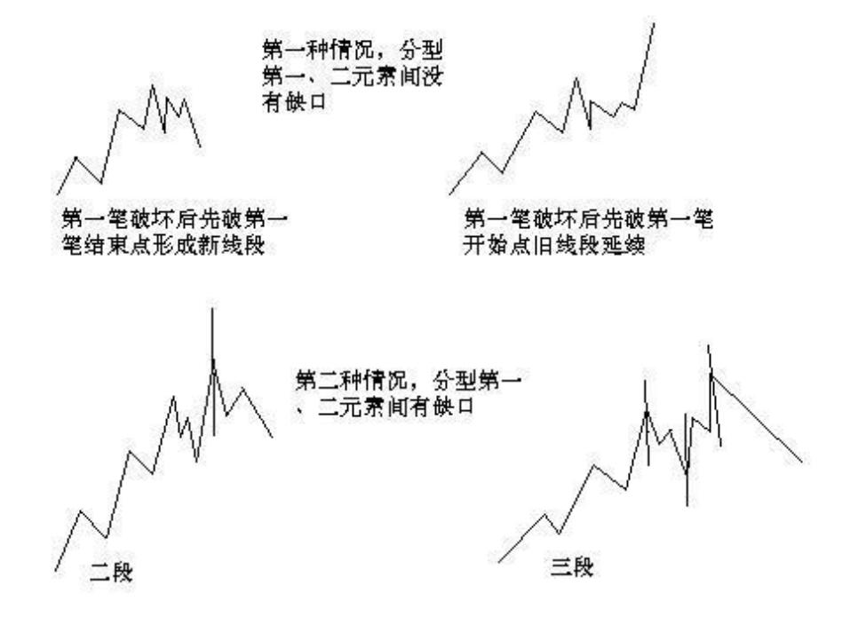
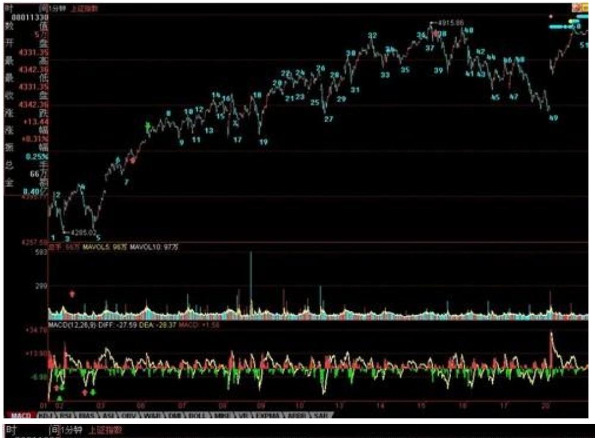
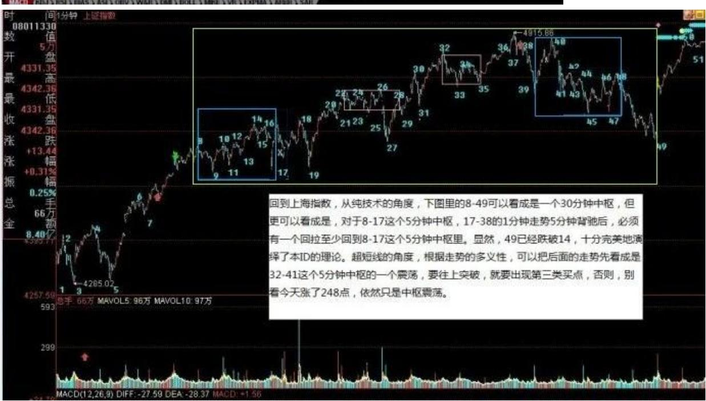
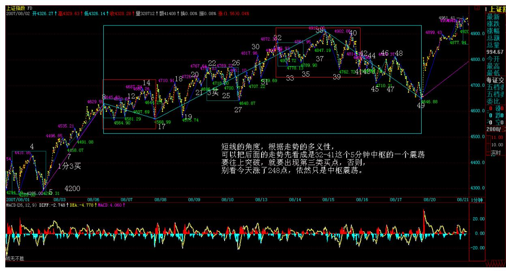
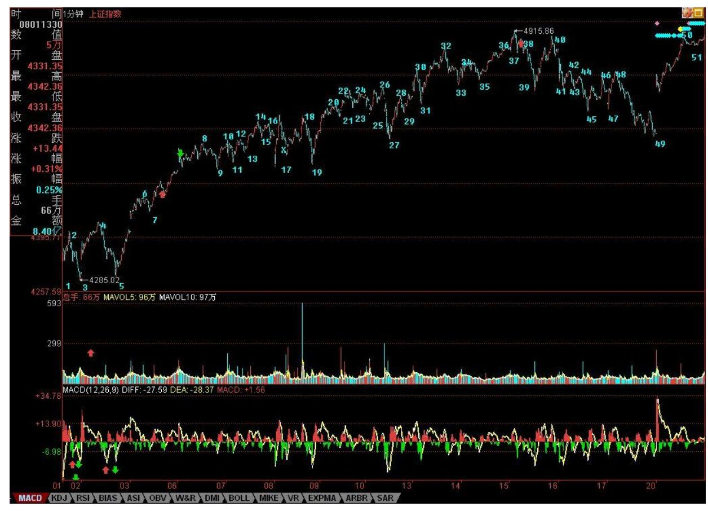

# 教你炒股票 71:线段划分标准的再分辨

(2007-08-16 23:02:06)(注:这课是针对前回复中大盘网友 44 线段 的疑问解答)虽然 67 课已经给出了线段划分的标准,但由于那里用 的是比较抽象的类数学语言,所以理解上可能还有困难,因此,逐一 进行再分辨。

首先要分辨的,是特征序列中元素的包含关系。注意,特征序列的元 素包含关系,首先的前提是这元素都在一特征序列里,如果两个不同 的特征序列之间的元素,讨论包含关系是没意义的。显然,特征序列 的元素的方向,和其对应的段的方向是刚好相反的,例如,一个向上 段后接着一个向下段,前者的特征序列元素是向下的,后者是向上 的,因此,根本也不可能存在包含的可能。

那么,为什么可以定义特征序列的分型呢?因为在实际判断中,在前 一段没有被笔破坏时,依然不能定义后特征序列的元素,这时候,当 然可以存在前一特征序列的分型,这时候,由于还在同一特征序列 中,因此,序列元素的包含关系是可以成立的;而当前一段被笔破坏 时,显然,最早破坏的一笔如果不是转折点开始的第一笔,那么,特 征序列的分型结构也能成立,因为在这种情况下,转折点前的最后一 个特征序列元素与转折点后第一个特征元素之间肯定有缺口,而且后 者与最早破坏那笔肯定不是包含关系,否则该缺口就不可能被封闭, 破坏那笔也就不可能破坏前一线段的走势。这里的逻辑关系很明确 的,线段要被笔破坏,那么必须其最后一个特征序列的缺口被封闭, 否则就不存在被笔破坏的情况。

那么,现在只剩下最后一种情况,就是最早破坏那笔就是转折点下来 的第一笔,这种情况下,这一笔,如果后面延伸出成为线段的走势, 那么这一笔就属于中间地带,既不能说是前面一段的特征序列,更不 能说是后一段的特征序列,在这里情况下,即使出现似乎有特征序列 的包含关系的走势,也不能算,因为,这一笔不是严格地属于前一段 的特征序列,属于待定状态,一旦该笔延伸出三笔以上,那么新的线 段就形成了,那时候谈论前一线段特征序列的包含关系就没意义了。

总之,上面说得很复杂,其实就是一句话,特征序列的元素要探讨包 含关系,首先必须是同一特征序列的元素,这在理论上十分明确的。

从上面的分析就可以知道,从转折点开始,如果第一笔就破坏了前线 段,进而该笔延伸出三笔来,其中第三笔破点第一笔的结束位置,那 么,新的线段一定形成,前线段一定结束。

70 这种情况还有更复杂一点的情况,就是第三笔完全在第一笔的范围 内,这样,这三笔就分不出是向上还是向下,这样也就定义不了什么 特征序列,为什么?因为特征序列是和走势相反的,而走势连方向都 没有,那怎么知道哪个元素属于特征序列?这种情况,无非两种最后 的结果:1、最终还是先破了第一笔的结束位置,这时候,新的线段显 然成立,旧线段还是被破坏了;2、最终,先破第一笔的开始位置,这 样,旧线段只被一笔破坏,接着就延续原来的方向,那么,显然旧线 段依然延续,新线段没有出现。

在 67 课里,把线段的划分分为两种情况,显然,分清楚是哪种情 况,对划分线段十分关键。其实,在那里已经把问题说得很清楚,判 断的标准只有一个,就是特征序列的分型中,第一和第二元素间存不 存在特征序列的缺口。从上面的分析可以知道,这个分型结构中所谓 特征序列的元素,其实是站在假设旧线段没被破坏的角度说的,而就 像所有的分型一样,就算是一般 K 线的,都是前后两段走势的分水 岭、连接点。这和包含的情况不同,包含的关系是对同一段说的,而 分型,必然是属于前后的,这时候,在构成分型的元素里,如果线段 被最终破坏,那后面的元素肯定不是特征序列里的,也就是说,这时 候,分型右侧的元素肯定不属于前后任何一段的特征序列。

这个道理其实很明白,例如前一段是向上的,那么特征序列元素是向 下的,而在顶分型的右侧元素,如果最终真满足破坏前线段的要求, 那么后线段的方向就是向下的,其特征序列就是向上的,而顶分型的 右侧元素是向下的,显然不属于后一段的特征元素,而该顶分型的右 侧元素又属于后一段,那么显然更不是前一段的特征元素。所以,对 于顶分型的右侧特征元素,只是一般判断方面的一种方便的预设,就 如同几何里面,添加辅助线去证明问题一样,辅助线不属于图形本 身,就如同顶分型的右侧特征元素其实不一定属于任何的特征元素, 但对研究有帮助,当然是要大力去用的,如此而已。

其实,线段的划分,都是可以当下完成的,无非是如下的程序:假设 某转折点是两线段的分界点,然后对此用线段划分的两种情况去考察 是否满足,如果满足其中一种,那么这点就是真正的线段的分界点; 如果不满足,那就不是,原来的线段依然延续,就这么简单。

特征序列的

分型中,第一元素就是以该假设转折点前线段的最后一个特征元素, 第二个元素,就是从这转折点开始的第一笔,显然,这两者之间是同 方向的,因此,如果这两者之间有缺口,那么就是第二种情况,否则 就是第一种,然后根据定义来考察就可以。

这里还要强调一下包含的问题,上面的分析知道,在这假设的转折点 前后那两元素,是不存在包含关系的,因为,这两者已经被假设不是 同一性质的东西,不一定是同一特征序列的;但假设的转折点后的顶 分型的元素,是可以应用包含关系的。为什么?因此,这些元素间, 肯定是同一性质的东西,或者就是原线段的延续,那么就同是原线段 的特征序列中,或者就是新线段的非特征序列中,反正都是同一类的 东西,同一类的东西,当然可以考察包含关系。

估计看了上面的话,很多人更晕了。下面有几个图,各位可以仔细揣 摩一下。但最好还是习惯从定义出发。另外,大盘网友问到的那个 图,显然,根据定义,是两个线段,而今天 42-44 的分段,显然也是 成立的。

71 注意,下图最后一个有问题,请看课程 81 里的更正说明。

72 线段的特征序列中元素的包含关系:73 超短线的角度,根据走势 的多义性,可以把后面的走势先看成是 32-41 这个 5 分钟中枢的一 个震荡,要往上突破,就要出现第三类买

点,否则,别看今天涨了 248 点,依然只是中枢震荡。

74 个股方面,周五也说得很清楚了"个股上,一线成分股,将跟随外 围,一旦外围走稳,将引发大反弹。二、三线股,关键是看这次资金 的流入情况,但无论如何,个股行情将再次活跃。"显然,今天的走 势完全与此符合。目前,行情要继续发展,必须把二、三线股点燃起 来,这是今后行情是否能往纵深发展的关键,否则光拉一线大盘或者 普涨走势,都不可能持续。

另外,周五用 600139、600594 为例子,只是说明持股的重要,如果 没有做短线的本事,也没有持股的耐心,怎么可能长期战胜资本市 场?不妨再举一个例75 子,那只唯一本 ID 明确说过的中字头股票 600737,本 ID 在 7月中 8 元时十分明确地告诉,这股票等于 6 元 告诉你 000999,纯粹就是给你准备点学费,可以安心学习。但现在又 有多少人能从 8 元持有到现在?其实,前后也就 1 个月时间,如果 这样都持不住,那就该干什么干什么吧。今天有事,先下,再见。

总市值超 GDP 后的泡沫化生存(2007-08-20 08:22:59)本 ID 在 3 月 19 日写的 "神州自有中天日,万国衣冠舞九韶",给出了本轮大牛 市的一个基本判断,就是至少再延续 20 年、上升 3万点,这个观点 依然有效,没有任何需要修改的地方。在同一文章中,更给出了本轮 行情第一阶段走势的基本特征,现引用如下:"第一阶段行情,伴随 着中国股市本身的制度性、结构性完善,其后,中国股市才真正具备

参与全球化盛宴的资格。全流通、整体上市、两大交易所的功能重 组、人民币逐步可自由兑换等,都不过是这种制度性、结构性完善的 必然步骤。这一阶段,行情最主要体现在以权重股为代表的成分股 上。在总市值超越 GDP 之前谈论股市的泡沫是可笑的,在中国股市总 市值超越其 GDP 之前,第一阶段行情不会结束。" 显然,这个"在 中国股市总市值超越其 GDP 之前,第一阶段行情不会结束。"的判断 已经被今天的事实所证明,因为,目前中国股市总市值已经超越 GDP,但第一轮的成分股行情依然在延续中。如果,对何谓第一阶段的 成分股行情还有所疑问,那么这段时间,中国股票市场大象狂舞的情 形,应该给这种成分股行情一个最好的注释。

在这样一个市值超越 GDP 的历史性事件如期到来之时,必须给行情今 后的发展定一下性。在市值超越 GDP 后,中国资本市场将进入第一阶 段成分股行情的泡沫化阶段,中国资本市场的参与者将进入总市值超 GDP 后的泡沫化生存状态。

正如上面引文所说"在总市值超越 GDP 之前谈论股市的泡沫是可笑 的",而在总市值超越 GDP 之后,谈论股市的泡沫,就是十分必要 了。如果把 GDP 当成总市值波动的中枢,那么在其下,可以说市场被 结构性低估,而在其上,就是出现结构性泡沫了。

显然,GDP 是变动的,随着中国经济的快速增长,总市值的波动中枢 也将不断上移,今天的泡沫,可以就是明天的低估,这一切都必须动 态去看。出现结构性泡沫并不意味着市场就没有上涨的理由,而是说 这种上涨,其基础上存在被这波动中枢回拉的压力,一旦市场上涨的 中短期理由不足以抗拒这种回拉,那么无论上涨使得总市值向上远离 GDP30%还是 300%,最终的回拉都将导致相应级别的调整。

76 如果说 4500 点附近对应目前 GDP 比较肯定的中枢,那么中国经 济的高速发展,将使得 20 年后的 GDP 至少达到目前美国的水平,也 就是说,一个 100 万亿人民币的 GDP 值是十分正常的,相应资本市 场的中枢位置至少上移到 23000 点附近,而那时候,中短期波动让指 数上冲到 30000 多点甚至 50000 点,都是可以想象的。市场总要波 动的,市场可以围绕中枢去波动,但绝对不排除市场的波动大幅度去 远离中枢,只是这种远离后都必然导致回拉的修正而已。

远期目标且不讨论,回到第一阶段这种泡沫化生存状态下,唯一能站 在长期角度抗拒泡沫的,就是成长性带来的中枢上移,一旦成长性不

足以支持这种中枢上移,那么大规模的泡沫破裂就是天经地义的。而 且,这种泡沫的破裂,往往导致中短期走势跌破中枢,形成一个新的 低估,这又构成良好的中长期介入机会。

中国资本市场目前的泡沫化生存之所以还不构成大规模的压力,就在 于,即使是中国资本市场上最大型的成分股,站在世界资本市场的历 史发展中,依然属于高速成长股。因此只要这种状态依然存在,那么 一个适度的泡沫化生存反而是合理且理所当然的。

不过,市场行情总是从非理性开始,又在非理性中结束,没有疯狂的 低估,就没有疯狂的牛市行情;同样,没有疯狂的泡沫,就没有疯狂 的熊市造就新的历史性低估介入点。第一段成分股行情,最终必然在 疯狂的泡沫中结束,在这疯狂的泡沫被制造过程中,反而能获取高额 利润。如果说低估回到中枢可让股票上涨 10 倍,那么疯狂的泡沫甚 至有更强的能力。对于任何市场的参与者,耐心等待市场的疯狂,在 市场的疯狂中等待最后的卖点,是一个最重要、最值得培养的能力。

显然,目前市场最疯狂的状态依然没有出现,外围因素制造短期的波 动反而有利于市场能量的积累。在泡沫制造能力被充分发挥之前,市 场不会最终逆转,第一阶段的成分股行情不会结束。不再战略性买 进、只战略性持有,等待市场疯狂、等待第一阶段长线卖点的出现, 是泡沫化状态下最应采取的策略。

77 78

\*\*\*\*\*\*\*\*\*\*\*\*\*\*\*\*\*\*\*\*。

解盘及互动问答:

#### \*\*\*\*\*\*\*\*\*\*\*\*\*\*\*\*\*\*\*\*。

1. 网友 [匿名] 百思不解: 缠姐好!下面是几个月以前跟贴的问 题,至今仍想不明白。能不能详细说说?第 18 课有个定理有点疑 问,该怎么理解?定理三:某级别"缠中说禅走势中枢"的破坏,当 且仅当一个次级别走势离开该"缠中说禅走势中枢"后,其后的次级 别回抽走势不重新回到该"缠中说禅走势中枢"内。这定理三中的两 个次级别走势的组合只有三种:趋势+盘整,趋势+反趋势,盘整+反趋 势。这定理三中提到的两个次级走势组合,比如"趋势+盘整",是 否同级?这里说的是两个同级走势的连接?还是从走势组合观点看, 那个盘整中枢级别高于趋势中枢级别?2007-08-21 16:01:49缠师:这 和连接的结合性有关。简单说,只要能分解出两段次级别走势就可

以。详细情况,下几堂课程会说到,请耐心等等。明天就继续说这几 种不同分解的问题。

盘整中枢为什么一定要高于趋势的?关键不是盘整还是趋势,而是中 枢究竟是什么级别,没有中枢,没有中枢的级别,哪里有什么盘整、 趋势以及他们的级别?这个问题其实说过 N 次了,盘整结束的标志就 是第三类买卖点,而趋势结束的标志就是形成该级别的背驰后对最后 一个中枢的回拉,为什么一回拉趋势就肯定完成?因为,一回拉,肯 定就有更大级别的中枢形成,所以原来级别的趋势肯定就破坏了。这 个逻辑关系是极端严格的。

那么,我们是否要等到回拉才决定进出?当然可以,可以等回拉后再 一次向上,形成所谓的第二类买卖点进行操作。这种操作,完全可以 不用背驰概念,纯粹就用三类买卖点就可以。

当然,实际操作中,可以用背驰,在第一类买卖点操作,为什么?因 为背驰后一定回拉,这是本 ID 理论的一个定理。

但从上面的分析可以知道,虽然背驰一定回拉这个定理是 100%成立 了,但即使没有这个定理,本 ID 的理论依然成立,为什么?因为走 势必完美,第一类买卖点后还有第二类买卖点,这是纯图形的,而背 驰是动力学的。

79 2. 网友石猴: 问题:封闭还是不封闭?67 课中讲:强调,在第 二种情况下,后一特征序列不一定封闭前一特征序列相应的缺口,而 且,第二个序列中的分型,不分第一二种情况,只要有分型就可以。

71 课中:这里的逻辑关系很明确的,线段要被笔破坏,那么必须其最 后一个特征序列的缺口被封闭,否则就不存在被笔破坏的情况。 200708-21 16:09:23缠师:这根本不是问题。线段破坏和线段的笔破 坏根本就是两个概念。线段被笔破坏,但线段不一定被破坏,也就是 说,线段被笔破坏,那特征序列的缺口被封闭,并不意味着线段一定 被破坏,有新的线段产生。线段破坏,就是那两种情况。其中第二钟 情况中还包括了一种最特殊的,也就是所谓小级别转大级别后连最后 的特征序列缺口都不回补的情况。

3. 网友 [匿名] 夜雨: 姐姐好,谢谢您昨天写的论语,带给我们心 灵的营养,还是要先学好本事再来讲是君子还是小人,都要有水平才 能做。结合当下,太多人只讲着好话就算好人了,其实专做糊涂事, 其实连小人都当不上,只能算伪君子。小人和君子的区别是心之所 向,而将来成就也会相差很远。2007-08-21 16:27:32缠师:对,首先 成"人",才有小人,有了小人,才有君子。如果连"人"都成不 了,那只是"伪人" ,假人,被摆布的木偶。小人和君子的区别,更 准确地说,是心量之大小,这也包括心之所向。

#### \*\*\*\*\*\*\*\*\*\*\*\*\*\*\*\*\*\*\*\*。

4. 网友 [匿名] Happysky: 久了,冒一下泡。谢谢缠主每天解盘, 从你的文章感觉你的理论很管用,可惜怎么都学不会。2007-08- 2116:14:11缠师:其实,逻辑化的东西都最好学的,关键是从最基本 的概念下手,然后把整个逻辑关系串起来,这样就一通百通。否则, 只能乱套。

#### \*\*\*\*\*\*\*\*\*\*\*\*\*\*\*\*\*\*\*\*。

5. 网友 [匿名] 新浪网友: 越来越感觉你的理论比一些我看过的理 论有用得多。不过,我还是不能很好的掌握。近段时间想试试把成本 降为 0,结果总是把筹码弄丢了。郁闷啊。2007-08-21 16:30:3380 缠师:加大操作级别,对新手来说,先练习持股,在一个大级别买点 买入后持有到大级别的卖点,怎么都应该是 30 分钟以上的。你看这 次从 3600 上来,从来就没有效跌破过 5 日线,对初学者,用这一招 就比所有的所谓专家高多了。如果资金大的,就看 5 周线。

至于中枢震荡中的短差,那是一个高难度的活动,初学者当然做不 好。至于趋势中时,根本就不存在做差价的可能,趋势中,唯一需要 干的就是等待背驰。注意,上面说的,都是在你的操作级别的意义 上。

#### \*\*\*\*\*\*\*\*\*\*\*\*\*\*\*\*\*\*\*。

6. 网友石猴: 71 课:把线段的划分分为两种情况,显然,分清楚是 哪种情况,对划分线段十分关键。其实,在那里已经把问题说得很清 楚了。判断的标准只有一个,就是特征序列的分型中,第一和第二元 素间不存在特征序列的缺口。最后这句少了个存字吧?第一和第二元

素间"存"不存在特征序列的缺口。2007-08-21 16:31:47缠师:如果 原话是那样,是少了一个字。谢谢,等一下看看,改回来。

#### \*\*\*\*\*\*\*\*\*\*\*\*\*\*\*\*\*\*\*。

7. 网友快乐 vs 菜虫: 事实上,如果用 67 课的新的精确定义,57 课里的 3-4 段的分段就迎刃而解了,正是这句"强调,在第二种情 况下,后一特征序列不一定封闭前一特征序列相应的缺口"解决了此 问题。缠姐,是否如此呢?那"小级别转大级别"是否要退居幕后了 呢?2007-08-21 16:30:58缠师:在线段的层次上,是不需要小级别转 大级别的概念的。但在最小级别走势类型之上,还是需要。

#### \*\*\*\*\*\*\*\*\*\*\*\*\*\*\*\*\*\*\*。

8. 网友 [匿名] 新浪网友: 缠主,能说说钢铁板块后面还会怎样演 绎吗?谢谢!2007-08-21 16:45:08缠师:任何板块的演绎,基本都是 一二三节奏的。
