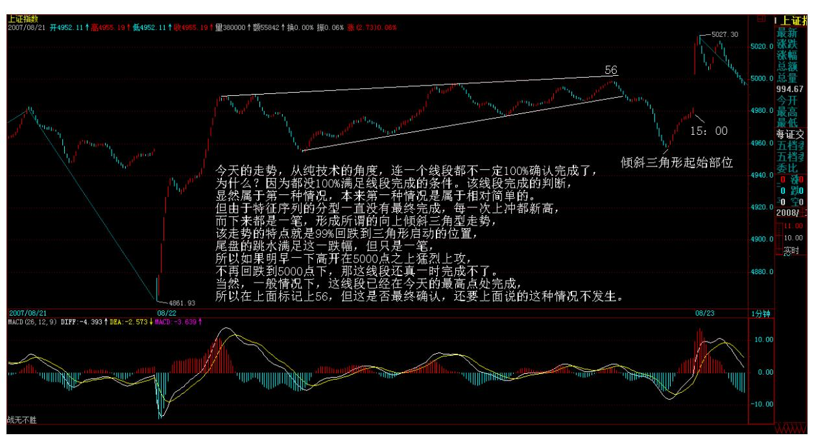
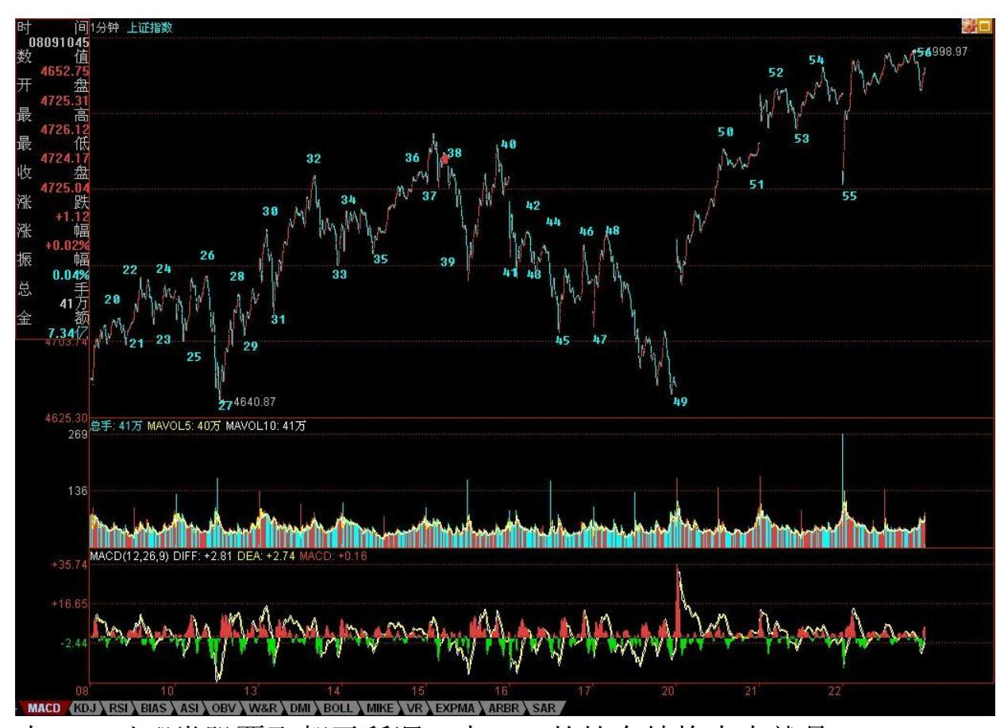
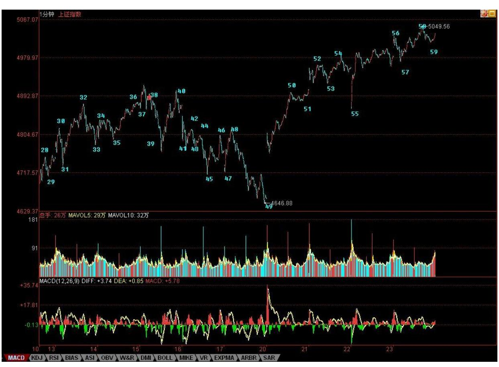

教你炒股票 72:本 ID 已有课程的再梳理 今天留下的缺口,构成短 线的技术关键,而上方的真正压力,并不是什么 5000 点,而是 2/3 线,目前在 5089 点,这在前面曾以问题的形式给各位说过了。突破 1/2 线,上一条就是 2/3 线,这涉及预测,但有比较大的经验值保 证,但本 ID 为了彻底反对预测,所以只以问题的形式和各位讲,就 是不希望让各位先入为主,影响当下的判断,那才是真工夫。(注: 下图中标出的 5 分 3 买是针对 39-48 的 5 分中枢,非禅师解盘内 容)88 教你炒股票 72:本 ID 已有课程的再梳理 预测这种东西,不 过是按一个模子照套,傻子的干活而已。2/3 后就 3/4 线,目前在哪 里,傻子都能干活出来,所以预测都是傻子的干活,还是不要提了。

89 教你炒股票 72:本 ID 已有课程的再梳理 其实,这些分类界限, 都无须预测,让市场自己去选择,根据市场的选择去反应。另外,一 定要注意自己的操作级别,如果你是月线操作,那就看 5 月线,没有 效跌破之前,都可以少管,任何的波动都可以当戏看。

另外,美国那破事,在如期反弹后续的发展,是决定今后走势的一个 重要分力,这样因素在前面反复说过了。这可能比加息、组合拳都要 根本点,毕竟,管理层的加息、组合拳都要参考这方面的因素综合给 出。

加息难阻热点蔓延(2007-08-22 16:10:16)昨天说热点的蔓延如果能持 续几天,就会燎原。而晚上公布的加息产生的新分力,使得大盘最后

选择了今早所说的第二种中等力度的走势,这都是自然的选择,无须 预测。任何有预测癖好的人,去当火星股评去吧,地球很危险的。

今天的走势,从纯技术的角度,连一个线段都不一定 100%确认完成 了,为什么?因为都没 100%满足线段完成的条件。该线段完成的判 断,显然属于第一种情况,本来第一种情况是属于相对简单的。但由 于特征序列的分型一直没有最终完成,每一次上冲都新高,而下来都 是一笔,形成所谓的向上倾斜三角型走势,该走势的特点就是 99%回 跌到三角形启动的位置,尾盘的跳水满足这一跌幅,但只是一笔,所 以如果明早一下高开在 5000 点之上猛烈上攻,不再回跌到 5000 点 下,那这线段还真一时完成不了。当然,一般情况下,这线段已经在 今天的最高点处完成,所以在上面标记上 56,但这是否最终确认,还 要上面说的这种情况不发生(实际走势发生线段未完成情况,今日标 志 56 处不成立)。

90 教你炒股票 72:本 ID 已有课程的再梳理一般来说,1 分钟线段 都不会延续这么长时间,能延续这么长时间,反而是一个技术上的重 要提示,证明多方上 5000 点的冲动比较大,反复闹,而上面,有人 不断压制,所以才会走出向上倾斜三角型的走势。而到尾盘,差不到 一点见 5000 了,多方一股真气突然泻去,回到倾斜三角形起点位 置。主要是如530 般在亢奋状态突然被惊吓留下了后遗症,因此往往 在关键时刻都来这么一下,尾盘收回去一半,只是表明多头上攻的欲 望依然没得到满足,如此而已。

91 教你炒股票 72:本 ID 已有课程的再梳理 今晚的消息面很重要, 连续两天有消息了,如果今晚还来什么调控玩意,这走势变数就大 了。由于选择了第二种走势,短线政策面的变化起着重要分力的作 用。如果今明两天没什么特别消息,使得关于政策面组合拳的猜想暂 被搁置,那么,上上 5000 点去满足一下多头的欲望,也是理所当然 的。

本 ID 早说了,5000 点根本什么都不是,关键是 5089 点的 2/3线, 这线就如同下面 4100 多点的 1/2,该线反复磨了三个月,上下跳来 跳去,2/3 线是否历史重演,这才是技术上需要注意的地方。

个股上,加息并没有延缓热点的蔓延速度,反而是加快了。银行股被 压制,反而有利于其他股票的表现,本 ID 反复强调的二、三线股的 逐步活跃已经成为现实,看看这几天涨停的都以什么股票为主就知道 了。而且,这种蔓延已经逐步偏向三线股,特别是低价股,这是游资 重新活跃的迹象。

这里,一个最现实的问题就出现了,银行股、地产股等等基金们玩的 股票,和比较正规的大资金玩的一、二线大股,与游资搞的二、三线 小股之间争夺话语权的问题。后面,能使大盘大幅度震荡的,一是政 策面,二就是这话语权争夺战了。

散户当然喜欢三线股狂飞,像本 ID 的中铝那样的中字头股票,散户 参与的热情也不会太高,特别现在,随便买个 1 万股就要 40 万,而 一个 5、6 元的股票只要 5、6 万,哪个群众基础好就根本不用说 了。

本 ID 对哪类股票飞都无所谓,本 ID 的持有结构本来就是一、二、 三全有,大小通杀,现在又不买了,只持有,所以只有看戏的份。不 过,本 ID 最喜欢的,其实是三线变一线的股票,谁又告诉你,三线 不能变一线呢?今天有事,刚才一路写东西,电话就不断,下面的事 够忙一晚上了。

晚上回来可能晚点。先下,再见。

92 教你炒股票 72:本 ID 已有课程的再梳理93 教你炒股票 72:本 ID 已有课程的再梳理 行情只会在一地鸡毛中高潮(2007-08-23 16:08:01)没有三线股参与的行情,永远都是不完整的,行情只会在一 地鸡毛中高潮,没有三线股鸡毛一地的高潮,这种行情,至少在中国 特色的市场中,本 ID 还没见过。这里的原理很简单,一个爱好群众 运动的文化中培养起来的投资者,连选秀都可以超女快男一地去鸡毛 一把,股票不亦如此,怎么对得起博大精深这四个汉字?这锅热度如 期中升高,三线鸡毛开始满地打滚,这还只是开始,被一线大盘、高 价股抛弃了的散户,才正开始撒着步子欢了起来。人类的本质是酒神 性的,人的本质中,那酒神的狂欢永远可以战胜太阳的冷酷。狂欢,

总是大众的。茅台、五粮液去大众,要困难点,还是二锅头、老白 干,更能激发人们心里的野性。如此,股票的高潮,总是老白干的。

有人问,怎么还不说今天突破 5000 点的历史时刻?5000 点算个什 么?本 ID 不是一大早就把股市的 20 年走势的剧本都告诉各位了? 5000 点在那剧本中,连一句台词都够不上,有什么可说的?站在纯技 术上,突破 1/2 线,就看 2/3 线,然后就是 3/4 线。但现在,还是 先看 2/3 线。从大盘对前几条线的突破看,都不是刚好触及就回头, 而是围绕着其震荡。由于 2/3 线与 3/4 线之间距离不大,所以在这 两线的震荡级别不大会一样,一般来说,2/3 线小级别,那么 3/4 线 级别就大点了。所以,行情在 2/3 线附近如何发展,对今后行情的发 展,有一定的意义。2/3 线如何计算?1429+183\*30\*2/3=5089。3/4 线,只要把里面的 2/3 改为 3/4 就可以。当然,下月计算时,183 要变成 184,如此类推。

短线技术上,昨天的 56,不能 100%的那种情况,今天发生了。这说 明什么?本 ID 的理论是几何,没有一种精确的数学态度,是弄不好 的。任何有预测癖好的,都离技术之门远着。今天图里,昨天 56 的 位置就要根据这种情况变了。注意,并不是本 ID 的划分可以随意 变,而是因为昨天的走势没有 100%满足本 ID 的划分标准,只是暂时 标记。例如,今天 59,同样有这个问题,那里标记上 59 并不是说59 在那里已经完成了,因为目前没有满足 59 段被 100%破坏的标准。而 58 以及以前的所有标准都是唯一的,不可更改的,为什么?因为,符 合标准了,就这么简单。这个问题,一就是一,二就是二,没有任何 可含糊的地方。

个股方面,给各位一个技术面上的判断标准。现在的个股,日线上无 非三种:一、突破 530 高位;二、没突破 530 高位但突破 530 后第 一个反弹高位;三、530 后第一个反弹高位还没突破。

94 教你炒股票 72:本 ID 已有课程的再梳理 一般来说,第一种技术 条件的股票,注意那些刚突破后回抽确认正再次启动的,这种股票要 预防假突破的危险;第二种,属于最有表现欲望的,但这种股票的预 防启动突破 530 高位后有一串洗盘;第三种,最容易吸引踏空资金, 但唯一的坏处就是,资金新近来,如果是一个喜欢打压吸货的主,那 就要被折磨一段时间,当然,如果是一个喜欢高举高打的,那就祝贺 你了。其实,这不难判断,关键是看第一次放量后回抽的位置。

昨天说到本 ID 更喜欢三线变一线,这种股票,一般人可真拿不住。

本 ID 的股票里就有很多,不过估计没人能真和本 ID 一样从最低位 拿他 N 年。以后的一线股,都必须是至少是中字头甚至是世界级的公 司,要从三线变一线,只有两个途径:一、自己能成长为中字头甚至 世界级的公司;二、中字头甚至世界级的公司全面介入。

class="calibre2"/>95
