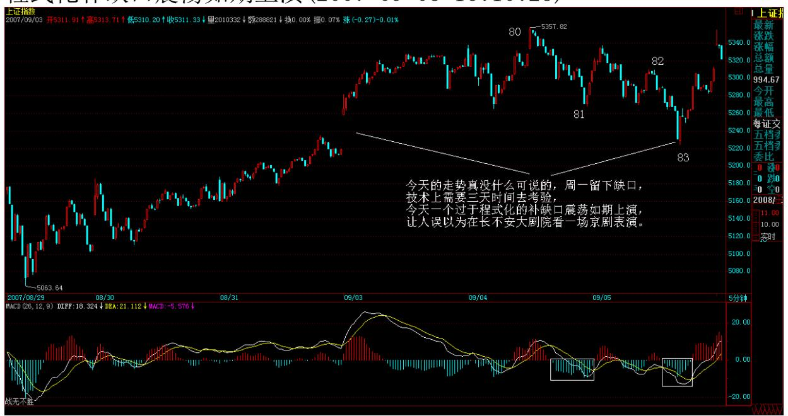
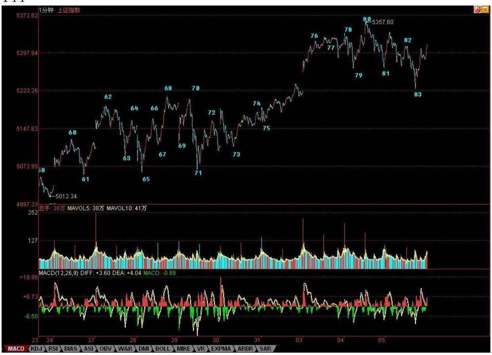
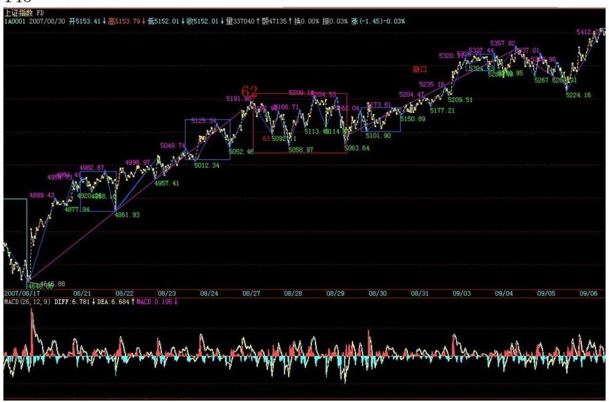
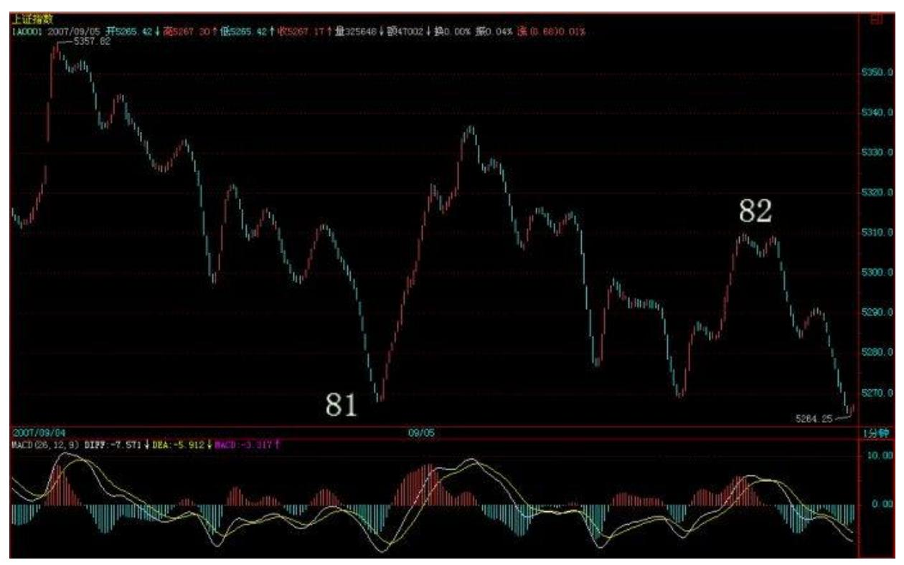
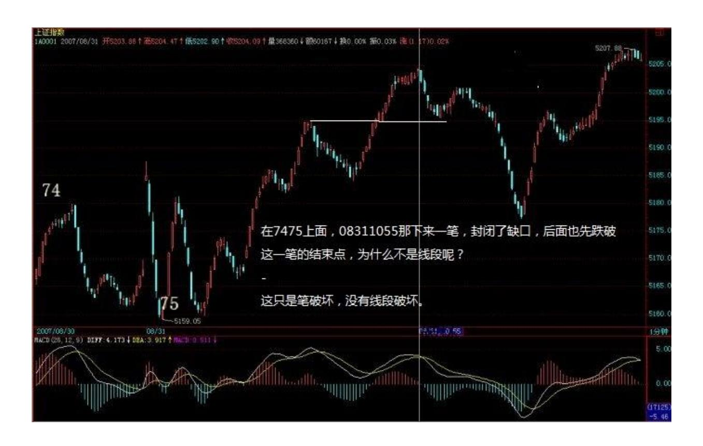
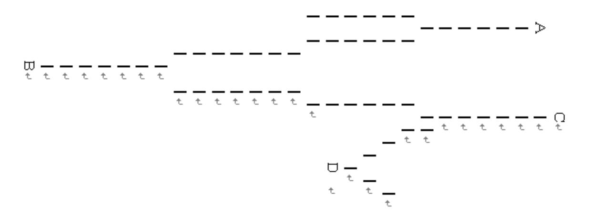

# 教你炒股票 76:逗庄家玩的一些杂史 2

(2007-09-03 19:19:43)现在梦话一点杂史,并不是说技术已经说完 了,那还早着。只能在说技术中间穿插一下,这样不会让人完全沉浸 在技术之中。毕竟,技术只是其中一方面。视角越全面,才会有更大 的成就。

以下开始说梦话,谁信谁有毛病。

股票,公开的,谁都可以买卖,这就是其复杂所在。一般来说,单纯 犯坏的难度当然比建设的难度小。如果你技术过关,你可能只拥有流 通量 5%,但你就能阻击一个有流通量 50%的人。

玩死一个庄家,归根结底,就是两种:时间上害死他;空间上害死 他。有些心理有毛病的庄家,最容易被时间上害死。特别那些有洁癖 的,总是希望把盘给洗得一尘不染,这种人,最容易玩了。你只要不 断在里面折腾,让他感觉到里面人特乱,筹码特乱,那么这些无聊的 家伙就是洗呀洗的,洗到行情都走完了,还在那里洗。很多庄家,就 是太有洁癖了而被害死的,特别那些经验不足的,资金实力又有限 的。

以前,要玩这些家伙,有一招一直都很有效,不过后来用多了,就不 大好用了,现在基本没用。当时,喜欢用一个帐号,齐刷刷就买一个

巨大的惹眼的数量。能坐庄的,基本都能打单,这样一个帐号,不可 能不知道。一般来说,这样一件事情,对于那些新手,就够他们一阵 折腾了。开始,不用在盘面上搞他们,等他们适应一段时间,有点麻 木,就要给新的刺激。例如,再找一个新的帐号买一个更大量的数 量,注意,这些数量一般都控制在流通量的 2%以下,不能大到影响这 些家伙坐庄的信心。再折腾一段时间后,就要换手法,例如,在盘面 上就要不时神经质地搞他两下,一般都是在他将高潮未高潮的时候, 狠狠来一下,让他以后欲高潮时都留下后遗症,这样反复折腾,将他 搞成 ED 男。

注意,折腾人不是靠光砸光买就可以。其实,真干的时候,就是来回 弄,那家伙砸的时候,就要敢接,拉的时候就要敢给,但那几个明目 装胆的帐号是不能动的,让他们搞不明白水的深浅。一般来说,阻 击,只要拿流通的 10%以下就足够了,其实,都不需要那么多。原则 就是有能力在出手的一天内倒出一个 10-20%上下的换手大量来,而且 震荡的区间一定要足够大,有可能就涨停到跌停来回 N 次。一个股 票,特别在准备高潮时倒出这样一个大幅度震荡的大量,想不 ED 都 难了。

而倒出这样的量,实际需要的筹码并不要太多,因为,不可能全天的 交易都是一方搞出来的。倒的时候,技术高的,完全可以做到顺便就 把差价给弄了而筹码尽量不丢。但注意,这种折腾,一定是在底部或 相对底部的位置,这样,最好就在庄家成本的附近,这样操作的难度 就小多了。如果庄家给你玩恼火了,不玩了,撤了,一定要捣乱,不 能让他顺利出去。只要你能让他亏钱出去,就是成功。一句话,就是 不能让他挣钱跑。而且,在日常的折腾中,一定要弄各类手段去垫高 其成本。

有些手法,和经验有关,不是一般人能干的。例如,要充分利用另外 的分力的力量。庄家只是其中的一个分力,如果你能利用好其他分 力,那庄家也只有给你折腾的份。

最狠的一种折腾,就是把这股票完全搞臭,也就是所有散户都知道这 股票是 ED 男,然后就搞成两家或 N 家对垒。一般搞到这种地步,就 是完全的强盗逻辑了。或者你就亏钱走,或者就送钱给大家花,否则 大家就耗着,看谁怕谁。庄家比你拿得多,占的资金多,而且他的钱 可能还来路不明,有期限的,这样折腾,100 个至少 99 个要死掉。

当然还有更狠的,那就是工夫在诗外的玩法了,一般这种招数不能 用,这样有点过分,有点不讲江湖规矩了。这种玩法,最普通的就是 从资金面下手,只要能断了对方的资金来源,你想搞死谁不可以?当 然还有更狠的,就没必要说了。

上面是说在时间上搞死,一般这种,都是走出一个复杂的大级别中 枢。而在空间上搞死,那就是另一种玩法了。这种玩法的基本原则就 是:庄家要风,就助他风;要雨,就助他雨。这样,先养其骄。等到 其觉得不可一世、春风得意时,突然出手,这出手,一定要稳、准、 狠,一下就要其命。在纯技术的角度,这就是要先砸出一个相当狠的 第一段,然后,引发散户恐慌盘后,回接。这里,出手的位置很关 键,太低没有杀伤力,太高又太晚。因此出手的时机决定成败,这需 要经验、判断、技术很多综合的因素,不是一般人能干的。

回接后,就是用来阻击庄家反扑的。庄家给第一段出手后,肯定有反 扑,这时候,就要有足够的子弹进行塔山阻击战。股票有一个好处, 没有子弹,只要有钱,马上就可以采购,所以必须要利用好这一特 性,控制好阻击的节奏、能量。

一定要注意,第一段后只能回接散户的恐慌盘,不能接庄家的抛盘。

因为你先出手,所以如果庄家跟着也砸,你就要更狠地倒下去。最好 直接倒出一个 V型反转,这样,连塔山阻击战都省了,这股票,至少 残废一年半载,再找一个机会完全把他废了,还不是迟早的事? 不能 再说梦话了,快 7 点半了,等一下还有事忙。先下,再见。

2 技术、心理引发震荡(2007-09-04 15:12:24)4 点在国贸有会,只能 以最快速度说上两句。今天的震荡,在技术上,就是昨天的缺口,这 已经明说过;心理上,最近天天报上有提示风险的文章,你说心理上 能没压力?这个震荡明天是否加大,其实都不重要,从纯技术上说, 这缺口如果补了后没有有力的回拉,那短线问题就严重了。所以,缺 口越不补越不存在技术压力,这叫强者恒强。一旦强者不能恒强,那 较大级别的调整就不可避免的。所以从技术上,走得越强越不用担 心,一旦有走弱迹象,反而是短线必须小心的。

个股方面,可能会有人骂今天的中石头和联通。这些人都是一点良心 都没有的,没有中石头、联通,3600 能不能转过来还是问题,最近这 俩为大盘已经给了足够贡献了,一直缩着不动。到现在还不让动一 下,万一刀子下来,连回跳的空间都没有,那真雷锋了。

闲话不能说了,图明天再贴,今天下午会后,晚上还有一个 PE 的项 目要谈合同,所以晚上可能很晚。对不起,先下,再见。

程式化补缺口震荡如期上演(2007-09-05 16:10:28)

今天的走势真没什么可说的,周一留下缺口,技术上需要三天时间去 考验,今天一个过于程式化的补缺口震荡如期上演,让人误以为在长 不安大剧院看一场京剧表演。

程式化震荡后,才是问题的关键。从纯技术的角度,下图中,62-71的 5 分钟中枢突破后,71-80 是一个标准的 1 分钟上涨,也就是次级别 的离开,而 80-83是一个标准的 1 分钟盘整回拉,也就是说 83是教 科书式的 62-71 的 5 分钟第三类买点,其后的走势无非两种:形成 更大级别震荡,或者是 5 分钟中枢上移的延续。

现在,最坏的情况就是形成一个 30 分钟的中枢,最好的就是继续 5 分钟的上涨,直到形成新的 5 分钟中枢。技术上的形态,就这两种情 况,没什么可说的,根据走势当下就可以判断。说得仔细点,就是明 天不能新高,或新高后出现 1 分钟的不构成第三类买点的盘整背驰 (意思是后面走势盘整背驰不能构成 1分中枢的 3 买),那么必须要 在目前位置形成新的 5 分钟中枢了,后面就很简单,就看中枢震荡后 是出现第三类买点还是卖点了。至于明天能形成 1 分钟的146 第三类 买点,那么大盘就将上涨去延续寻找新的 5 分钟中枢的过程。

147 个股方面,二、三线题材股继续发威,这是好现象。而一线大 盘,关键就看建行的发行价了,如果搞出一个比现在中行、工行差不 多甚至还高的发行价格,那么这些一线大盘就谁都按不住了。这其实 也是本 ID 为什么一手题材股、一手中字头,两手都要硬的原因。你 想,如果中移动发 30-50元,那么中国联通待在 10 元之下,他好意 思?如果中石油也搞个20-30 元的,中石头怎么好意思在 20 元之 下。

目前,这些大石头们最大的支持或动力,就是同类回归的价格,一旦 建行出现一个高发行价,后面回来的想低都没门了。这样,各位就继

续疯狂吧。

现在,情况很清楚了,本 ID 也说得很明白,管它明日洪水滔天,如 果你心态好、真来家伙时能手起刀落,够恨,那就充分享受这疯狂的 游戏吧。

东风吹,战鼓擂,这个世界谁怕谁?但如果你没这胆子,就把仓位调 节好。否则,你又想疯狂,又要疯狂没有任何代价,那还是回火星去 吧。

\*\*\*\*\*\*\*\*\*\*\*\*\*\*\*\*\*\*\*\*。

解盘及互动问答:

\*\*\*\*\*\*\*\*\*\*\*\*\*\*\*\*\*\*\*\*。

1. 网友 [匿名] 新浪网友: 不知缠妹对钢铁板块的看法,有没有 变?2007-09-05 16:13:43缠师:没有,钢铁更大的机会在收购重组 中。

2. 网友 [匿名] 退伍老兵: 姐姐,我想重仓 600050,不知道可不可 以?我是一个退伍军人,不是很懂股票,想赚点创业资金。2007-09- 05 16:16:21缠师:中国联通从中长线的角度肯定没问题,不过技术上 这个价位不是什么好的买点。

联通的题材,粗略说有三个方面:中移动回归、整体上市、电讯重 组。相比起来,后面两个才是重点。而电讯重组是最重要的,如果按 目前的方案,联通专搞 GSM,也就是以后 139、138 之类的都归联通 了,你说他的空间有多大?当然,这个电讯重组的变数还很大,没到 最后一刻,谁都说不好。

3. 网友骄阳 10000:禅师,能讲一下 81、82 这个分段,为什么中间 那个高点不是一个段呢?2007-09-05 16:18:53缠师:因为那只是一 笔,笔破坏不等于线段破坏。

149 4. 网友[匿名] 顶石猴的问题: 我的问题是:分型的开始和结束 是怎么定义的?说第二个特征序列没有三个元素,就根本不存在出现 分段中第二种情况的可能,那么第二种情况的那个三段例图,也符合 第二特征序列没三个元素的情况吧,为什么会是三段?谢谢!2007- 09-05 16:22:20缠师:在第二种情况中,如果不满足定义的情况,就 不算线段被破坏。例如一个下跌,一个 ABC 的回拉是第二种情况的,

然后一个新的一笔下跌直接就新低,那显然就不符合定义,所以就是 原来的下跌没结束。

而如果 ABC 的回拉是第一种情况,那么原来的下跌肯定结束了,这就 是第一、二种情况的区别。另外,有些概念请搞清楚。第一、二种情 况是完全的分类,不是第一就必须是第二,先区分了第一、二种情况 才有后面第二个特征序列的问题。对于第一种情况,这个问题根本不 存在。如果对第二种情况,找不到第二特征序列,那就是原来的线段 没被破坏,就这么简单。请一切从定义出发。

#### \*\*\*\*\*\*\*\*\*\*\*\*\*\*\*\*\*\*\*\*。

5. 网友 [匿名] 此生如初见: 老大,有色金属板块在新进资金尤其 是新基金的推动下,如果 N 年后它们不拆细,很有可能都达到百元, 当然市盈率可能仅有 50-60,动态市盈率可能更低,那样整个 A 股市 场可能有 30—50 只百元以上股票,这种现象可能出现么?2007-09- 05 16:28:12缠师:没有什么不可能的。如果中字头都整体上市,那 200 只 100元以上的也是太正常的现象。

#### \*\*\*\*\*\*\*\*\*\*\*\*\*\*\*\*\*\*\*\*。

6. 网友石猴: 在 7475 上面,08311055 那下来一笔,封闭了缺口, 后面也先跌破这一笔的结束点,为什么不是线段呢?2007-09- 0516:35:10缠师:这只是笔破坏,没有线段破坏。

\*\*\*\*\*\*\*\*\*\*\*\*\*\*\*\*\*\*\*\*。

151 7. 网友全线飘红: 请问缠主。79-80 这个线段是去比 77-78 (盘背),还是比(75-76)呢?标准是什么?79-80 毕竟创新高不 多。2007-09-0516:38:41缠师:这和创新高多少没关系。关键看有没 有趋势。

#### \*\*\*\*\*\*\*\*\*\*\*\*\*\*\*\*\*\*\*\*。

8. 网友 [匿名] 手机用户: 老大,一个线段有时离开中枢,力度很 大没有背驰,但不一定形成三买卖点。怎样预判?2007-09- 0516:47:16缠师:第三类买卖点,必须是回拉的力度没有离开的力度 大才可能形成。如果回拉走势都没有出来,怎么可能预判?离开的力 度大,如果回拉的力度更大,那当然就不形成第三类买卖点。所以一 切都必须等图形当下走出来。

#### \*\*\*\*\*\*\*\*\*\*\*\*\*\*\*\*\*\*\*\*。

9. 网友 [匿名] 新浪网友: 线段划分第二种情况,向上笔开始的线 段如下: /\ / /\ / \ / ./ \ /\ / \/ / \/ \ / ./ \/ /\ /./..\/ /该图是几段线段呢?2007-09-05 16:48:07缠师:一段。

#### \*\*\*\*\*\*\*\*\*\*\*\*\*\*\*\*\*\*\*\*。

10. 网友 [匿名] 新浪网友:缠主昨天说,补了缺口行情会走弱,今 天补后大盘反而放下包袱,重新站在 5300 点上,不知缠住有什么看 法?谢谢!2007-09-05 16:59:41

缠师:本 ID 没什么想法。不补缺口是最强的,补了缺口能强力拉回 并继续新高那是次强的。如果补了缺口拉回无力,不能新高,那就是 最弱的。现在大盘不能选择最强的,而后面两种,选择什么,让大盘 自己来,本 ID 没预测的兴趣。

#### \*\*\*\*\*\*\*\*\*\*\*\*\*\*\*\*\*\*\*\*。

11. 网友 [匿名] 大盘: 请问博主,对于补日线缺口,是不是只要把 缺口上一日 k 线的最高点跌破就可以是吗?2007-09-05 16:58:11缠 师:对。缺口就是从某天起没有交易的区间,在某天后,这区间有交 易了,就是缺口补了。

#### \*\*\*\*\*\*\*\*\*\*\*\*\*\*\*\*\*\*\*\*。

12. 网友 [匿名] 新浪网友: 请问下图中的笔,是AD一笔呢还是A B,BC,CD三笔呢?2007-09-05 17:04:05缠师:AB 肯定不是一 笔,BC 也不是,至于 AD 是不是,这要看 D 后面的走势。找笔,首 先要找分型。A、D 都满足分型的条件,但关键看D 后面的分型是顶还

是底,如果是顶,那么 AD 就是一笔。如果是底,那 D 肯定不是和 A 构成一笔的那个底。
