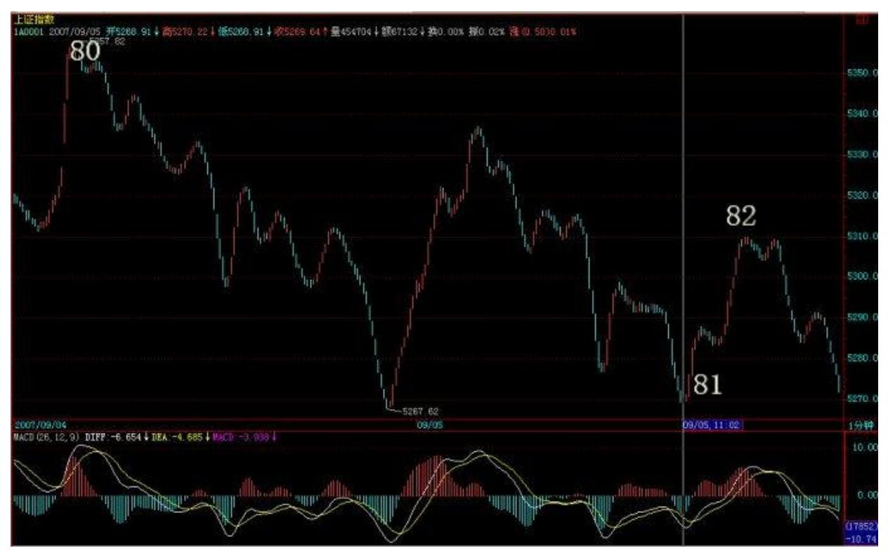
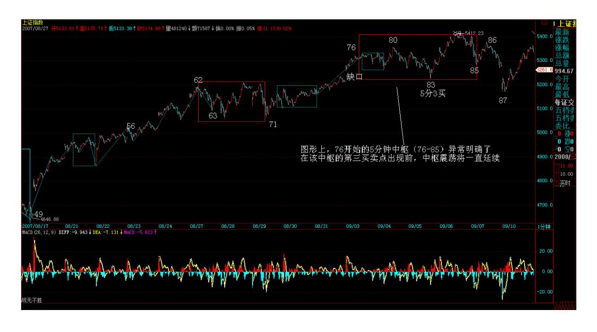
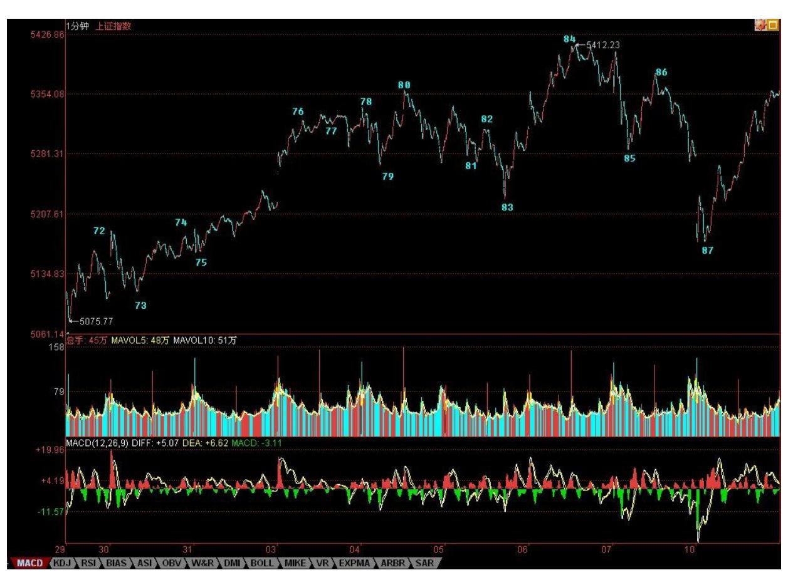
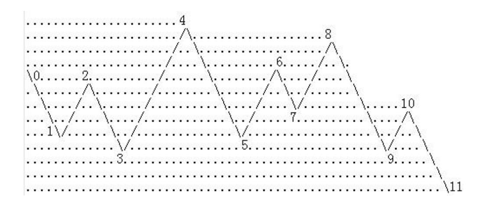

# 教你炒股票 78:继续说线段的划分

(2007-09-06 22:28:31)本来说好要开新课,但看到很多人确实还是没 搞清楚,而且,今天本来也不是说股票的,等于占用了别的时间来补 这一课。

线段的划分,就是上面课程里的两种情况,根据这两种情况的完全分 类来,没有不能唯一去划分的。但一到实际划分,很多人就晕,为什 么?因为基本的概念还是没搞清楚。

首先,线段和笔,都是有方向的,从顶开始的笔一定结束在底,同 样,以向上笔开始的线段一定结束于向上笔,不可能一个线段,开始 是向上笔,结束于一个向下笔。由于向上的笔的开始分型是底,而向 下笔的结束分型也是底,换言之,一个线段,不可能是从底到底或从 顶到顶,这是一个最基本的概念。

同样,正如同一笔不可能出现顶低于底的情况,同一线段中,两端的 一顶一底,顶肯定要高于底,如果你划出一个不符合这基本要求的线 段,那肯定是划错了。

由于图形不断延续,因此,除非是新股上市后最开始的一段,否则任 何一段都是破坏前一段的,如果你的划分,不能保证前面每一段都是 被后一段破坏,那么这划分肯定不对。线段的破坏是可以逆时间传递 的,也就是说被后线段破坏的线段,一定破坏前线段,如果违反这个 原则,那线段的划分一定有问题。

当然,实际划分中没必要都从上市第一天开始,一般都是从图 K 线中 近期的最高或最低点开始,例如,如果你今天才开始进行划分 1 分钟 图,那么,就可以从昨天下午跳水的最低点 5224 点开始,但这样, 肯定对大的走势不可能有正确认识,要对这波行情有明确的分析,即 使不从 7 月 6 日的 3563 点开始,也要从 8 月 17 日的 4646 点开 始。

选择好了开始点,就可以进行分段了。如果熟练了,就可以直接分 段,因为分型、笔都可以心算就知道,直接就可以进行分段;但如果 不熟练,还是先从分型开始,然后笔,再线段,这样比较稳妥。

在实际划分中,会碰到一些古怪的线段。其实,所谓的古怪,是一点 都不古怪,只是一般人心里有一个印象,觉得线段都是一波比一波高 或低,很简单那种,其实,线段完全不必要这样。一般来说,在类似 单边的走势中,线段都很简单,不会有太复杂的情况,而在震荡中, 线段出现所谓古怪的可能性就大增了。

所有古怪的线段,都是因为线段出现第一种情况的笔破坏后最终没有 在该方向由该笔发展形成线段破坏所造成的,这是线段古怪的唯一原 因。因为,如果线段能在该方向出现被线段破坏,那就很正常了,没 什么古怪的。

注意,这里有一个细节必须注意,线段最终肯定都会被线段破坏,但 线段出现笔破坏后最终并不一定在该方向由该笔发展形成线段破坏。

由最简单概念知道,任何线段都有方向的,例如线段 B,其方向是 下,也就是由向下笔开始的线段,那么其结束笔肯定也是向下笔。因 此,线段出现第一种情况的笔破坏,这破坏的一笔肯定是向上笔,但 这一笔之后,没有形成特征序列的分型,满足不了第一种线段破坏的 情况,因此,就在这个方向上形成不了线段的破坏。

而线段,不可能被同方向的线段破坏,任何同方向的线段,或者互相 毫无关系,或者就是其中一线段其实是前一线段的延续,也就是说前 一线段其实根本没完成。

但线段出现第一种情况的笔破坏后最终没有在该方向由该笔发展形成 线段破坏时,在上面例子中的向上破坏笔完成后,接下来肯定是向下 的笔,这笔肯定会形成一个向下的线段,否则,就意味着前面那向上 破坏笔能延续出线段,这和假设矛盾。

这个向下的线段,如果破了该向上笔的底,那么,原来的线段 B 就是 没结束,在继续延续。这种情况下,如果那向上笔突破线段 B 的高 点,这时候就会出现,线段的开始点并不是最高点的情况。(注意, 和这个情况一样,昨天的贴图里,81 那点应该在 09051101 的 5268.74 位置上,而 82 的位置不变,因为原来标记的位置是一个急 跌,当时的数据收集可能有点乱,用数据修正功能后发现实际上比 09051101 时高,因此必须有此修正。)

(娇注:本例图走势没有比 09051101 时高,按照理论维持原来定位。

为解释缠文,特配图) 174 这个向下的线段,如果没破该向上笔的 底,那么就可以肯定,由这向上的笔可以延伸出一个线段来,这时 候,线段 B 肯定被破坏了。

注意,这个例子中有一个最关键的前提,就是线段 B 已经确认线段破 坏了他前面的线段,如果线段 B 对前面线段的破坏都没确认,那就先 确认,这里的分析都不适用了。

从这个例子就知道,笔破坏与线段破坏的异同。对于线段破坏的第二 种情况,例如线段 B 对线段 A 是第二种情况,而线段 C 没有形成第 二特征序列的分型又直接新高或新低了,这时候,不能认为这是三个 线段,线段 A、B、C 加起来只能算是一个线段。

另外,一定要注意,对于第二种情况的第二特征序列的分型判断,必 须严格按照包含关系的处理来,这里不存在第一种情况中的假设分界 点两边不能进行包含关系处理的要求。为什么?因为在第一种情况 中,如果分界点两边出现特征序列的包含关系,那证明对原线段转折 的力度特别大,那当然不能用包含关系破坏这种力度的呈现。而在第 二种情况的第二特征序列中,其方向是和原线段一致,包含关系的出

现,就意味着原线段的能量充足,而第二种情况,本来就意味着对原 线段转折的能量不足,这样一来,当然就必须按照包含关系来。

通过上面的讲解,应该没有任何线段问题能难倒各位了,当然前提是 能把上面的内容搞明白。

注意,这里必须提醒一句,就是这在以前也曾说过,就是,如果线段 中,最高或最低点不是线段的端点,那么,在任何以线段为基础的分 析中,例如把线段为基础构成最小级别的中枢等,都可以把该线段标 准化为最高低点都在端点。因为,在以线段为基础的分析中,都把线 段当成一个没有内部结构的基本部件,所以,只需要关心这线段的实 际区间就可以,这样就可以只看其高低点。

经过标准化处理后,所有向上线段都是以最低点开始最高点结束,向 下线段都是以最高点开始最低点结束,这样,所以线段的连接,就形 成一条延续不断、首尾相连的折线,这样,复杂的图形,就会十分地 标准化,也为后面的中枢、走势类型等分析提供了最标准且基础的部 件。

课文学习用图:教你炒股票 78:继续说线段的划分

\*\*\*\*\*\*\*\*\*\*\*\*\*\*\*\*\*\*\*\*。

### 解盘及互动问答:

#### \*\*\*\*\*\*\*\*\*\*\*\*\*\*\*\*\*\*\*\*。

缠师:个股方面,前面没怎么动的板块都开始补涨,这是一个明确的 信号,就是如果这轮补涨后,前面调整时间比较长的板块没有再次启 动,那么大盘的调整不可避免地加大级别,其时间与力度都大为增 加。

本周,一定要注意上周高位能否被突破,如果能,那周 K 线上分型结 构不能形成,否则,就是周线上在 3600 点后第一次出现明确的警示 信号。

178 1. 网友 [匿名] 新浪网友:缠姐好!70 课里讲到 17-38 构成 完美 1 分钟上涨趋势,其中第二个中枢是 32-35,跟贴里也提到第 一个中枢是 22-27,则整个趋势的划分是:a+A+b+B+c = (17-22)+ (22-27)+(27-32)+(32-35)+(35-38) 这种划分的问题是,a 和 b 都包 含一个 1 分钟中枢,分别是 18-21和 28-31。这样 a 和 b 都是 1

分钟的走势类型,与中枢 A 和 B 同级,这样组合能成立吗?以前讲 的 a、b 不是应该比 A、B 级别低吗?2007-09-10 16:01:19缠师:为 什么一定要有 a\b?A+b+B 也是一分钟的上涨,关键是两个中枢之间 没重合,中枢之前之后有没有走势并不重要。

#### \*\*\*\*\*\*\*\*\*\*\*\*\*\*\*\*\*\*\*\*。

2. 网友 [匿名] 新浪网友: 牛市行情即将结束? 2007-09- 1016:03:23缠师:牛市要至少走 20 年,结束什么?但牛市里也有调 整的,不是一条直线上去的。

#### \*\*\*\*\*\*\*\*\*\*\*\*\*\*\*\*\*\*\*\*。

3. 网友 [匿名] 新浪网友: 601600 真的死了吗?2007-09- 1016:06:34缠师:短线死而不僵,长线活蹦乱跳。

#### \*\*\*\*\*\*\*\*\*\*\*\*\*\*\*\*\*\*\*\*。

4. 网友 [匿名] 新浪网友: 缠姐前几天说有些票有洁癖,洗来洗去 把行情都洗过了,里面是不是有科技龟头同方股份啊?2007-09- 1016:07:05缠师:那是对底部说的,同方最多是中继图形,和底部图 形的情况不同。

\*\*\*\*\*\*\*\*\*\*\*\*\*\*\*\*\*\*\*\*。

5. 网友 [匿名] 新浪网友: 老师节日好!请教一下 600569(安阳钢 铁)后期走势如何?可否继续持有?谢谢!2007-09-10 16:09:40180

缠师:569 这种规模的,最终的命运就是被收购,短线只能跟着大盘 走了。

#### \*\*\*\*\*\*\*\*\*\*\*\*\*\*\*\*\*\*\*\*。

6. 网友浆糊: 请缠姐点评一下 600737 最新出的公告的意思。谢 谢!2007-09-10 16:08:11缠师:没什么意思,737 以后的主业已经不 是番茄了。

#### \*\*\*\*\*\*\*\*\*\*\*\*\*\*\*\*\*\*\*\*。

7. 网友 [匿名] 蝉蝉:基金可长期持有吗?2007-09-10 16:05:32缠 师:说实在,本 ID 对基金一点信心都没有。如果投基金,最好就定 投指数基金,肯定不会跑输大盘。一些专投成长性企业的基金,也可 以关注,那要考虑基金管理者的水平,这就是碰运气的事情了。

至于那些大而无当的综合性基金,出事是迟早的事情,一个大级别的 调整,足以出事。以后肯定有 N 次暴跌是因为某某大基金出事造成 的,银行、证券公司等等都出过大事,基金有例外,你相信吗?

#### \*\*\*\*\*\*\*\*\*\*\*\*\*\*\*\*\*\*\*\*。

181 8. 网友 [匿名] 天眼:请问老大,上图分几段,怎样分? 2007- 09-10 16:16:44缠师:如果前面还有走势,那这根本分不了,要看前 面的走势。如果前面没有任何走势,那就是三段。

网友 [匿名] 天眼:谢谢老大!分别是 03、 38、 811 对吗?还是第 二种 05、 58 、811?缠师:笔破坏后延伸出线段破坏,所以当然是 分成 03、 38、 811了。

9. 网友 [匿名] 新浪网友: 缠主,中铝深深被套中,请问大盘由于 政策因素下调,它会被波及到吗?到年底中铝会上100元吗? 200709-10 16:22:54缠师:这种思维会害死人的。股票别设定预测的 位置,预测是胡扯。

你只需要选择好自己的操作级别,然后根据级别的买点进入。如果你 在 50 元以上才介入,那你肯定只是超短线级别的,那就按超短线级 别操作。知道股票操作中最大的毛病是什么?就是用一个超短线的买 点去期待一个超长线的卖点。

网友 [匿名] 新浪网友:超短线的买点去期待一个超长线的卖点,这 的确是问题在的关键。可怎么才能知道是一个值得做长线的买点呢? 缠师:那你就要看懂本 ID 的课程,说那么多,不就是告诉如何去找 各种级别的买卖点吗?

#### \*\*\*\*\*\*\*\*\*\*\*\*\*\*\*\*\*\*\*\*。

10. 网友 [匿名] 一个网友: 我在 600779 里面被蹂躏得痛不欲生, 请缠主给指教一下,里面的主力意欲何为?叩谢! 2007-09- 1016:22:31缠师:这股票里人太乱,有人拿了太多,有人想把他洗出 来,就这样了。股票基本面没有任何问题。

#### \*\*\*\*\*\*\*\*\*\*\*\*\*\*\*\*\*\*\*\*。

11. 网友 [匿名] 新浪网友: 请问老大,000915 可做长线品种吗? 2007-09-10 16:24:45缠师:问题不大,但前提是本 ID 说的时候是 3 元,都在长线买点的附近,而现在该股,最多就是一个中短线的买卖 中,所以,万一大盘有激烈变动,那一个中短线的调整,就有一定风 险了。所以买股票一定要分清楚买卖点,在长线买点介入,然后根据 中线震荡把成本降低为 0,然后继续增加筹码,这样就不会有这种烦 恼了。现在介入,就要吃得咸鱼抵得渴。如果你有忽略一切中短期震 荡的决心,那就没问题。或者,如果你技术不错,那就更没问题了, 先把筹码弄到手,然后根据震荡把成本降低,这样,什么时候介入问 题都不大。

#### \*\*\*\*\*\*\*\*\*\*\*\*\*\*\*\*\*\*\*\*。

12. 网友 [匿名] 新浪网友: 600737 已经形成卖点吗?看不懂。 2007-09-10 16:29:49缠师:短线的卖点早过了,就算你用最粗糙的日 线上的顶分型分析,周五的任何一个反弹,只要不过 14.28 元,都将 构成顶分型。顶分型以后下跌,那是天经地义的事情。这股票,主要 是最近买的人太多,有人疯了,13.99 元、13.49 元连续用 4000、 5000 手买挑逗庄家,庄家不出消息洗就有病了。该股中长线没有任何 问题,现在最大的问题就是盘子有点乱。

#### \*\*\*\*\*\*\*\*\*\*\*\*\*\*\*\*\*\*\*\*。

13. 网友 [匿名] 新浪网友: 神仙姐姐,002149 太可怜了,洗得只 剩排骨了。569 啥时能回归原来的剧本啊!2007-09-10 16:41:05缠

师:002149,要跑的 60 后都早跑掉了。新股一定要注意节奏,一些 新股是先炒一轮,然后下来慢慢洗盘再吸。否则现在的新股,都开得 老高,庄家的成本都这么高,让庄家怎么活?等新股真启动时,都还 以为庄家的成本就是 40、50 的,那是脑子有水了?像 002149 这种 股票,好的庄家,一拉一洗一震,怎么都把成本降到 10 几去了。就 算以后从 40、30 几地开始启动,你说庄家赢的机会有多大?

#### \*\*\*\*\*\*\*\*\*\*\*\*\*\*\*\*\*\*\*\*。

14. 网友 [匿名] 天眼: 老大,一笔中,允不允许存在最高点不是笔 的端点? 2007-09-10 16:34:36缠师:当然。顶上如果还有顶,那第 一个顶就不是顶。

#### \*\*\*\*\*\*\*\*\*\*\*\*\*\*\*\*\*\*\*\*。

15. 网友 [匿名] 新手无知: 看了一些课程,似懂非懂。请教缠: (1)是不是所有的买卖点的发现都有滞后性?而不是当时(当下)能 确定的?我的理解:买卖点出现在线段的端点,而线段端点的确定需 要下一个线段的破坏,那么一旦确认破坏,买卖点肯定已经过去一段 时间了。(不知这样理解对吗?)(2)你一直讲你的理论不涉及预 测,只关注当下。如果不涉及预测怎么能指导操作呢?比如,买点后 必然上涨,卖点后必然下跌,不是预测吗?或者如第一个问题,买卖 点只是事后的发现,才说得通呀。我是新手难免愚钝,真是困惑难 解,请缠开导。2007-09-10 16:43:04缠师:请先去研究一下区间套定 理,研究明白就没这个问题了。

#### \*\*\*\*\*\*\*\*\*\*\*\*\*\*\*\*\*\*\*\*。

16. 网友 [匿名] 想弄明白: 缠,你上次说,要想尽办法把泡沫行情 延续,给人感觉你想让它(市场)涨,这次又说风险太大了,我们应 先卖后买,到底应如何呀?缠师:一个是中长线的问题,一个是短线 的问题,怎么会搞混在一起?中长线,就是要让这个泡沫行情至少能 延伸两年,这就需要行情走得稳健,不引发政策的大规模干预,政策 就算不干预,本 ID 在该干什么的时候自然也要什么,目的只有一 个,让行情延伸得越长越好。短线在中枢震荡中,当然就是先卖后 买,这有什么问题?17. 网友 [匿名] 新浪网友: 博主,636 一直拿 着。可为什么结果却是这样呐?我是新股民,刚刚入市,被您的药所 点燃的万丈豪情,全部被浇熄了。新高的股市中,我更象一个自卑的

孩子。不是牢骚,只有无奈。2007-09-1016:23:28缠师:如果你介入 股票是以中长线的态度,那就没必要问这些问题,你只需要去研究一 下基本面是否值得继续。如果是短线介入,那么一个连半年线都没站 住的股票,你看他干什么?本 ID 介入一只股票,都是要至少持有两 年以上的,甚至是天长地久,所以,如果你没有本 ID 的目的,只有 短线的目的,就按自己的级别去操作,自然没有这些问题。

本 ID 多次说过了,想快,就学好第三类买点,那是最快的,操作上 只要把握好两点:一、级别不能太小。二、一旦出现向上的盘整背驰 一定要出来,不介入那些演化成大级别震荡的情况,只持有中枢上移 的情况,一旦新中枢成立,马上走人。走人,第一卖点看背驰、错过 了,第二卖点必须走。学好这招,所有所谓的短线高手都不会是你的 对手了。

#### \*\*\*\*\*\*\*\*\*\*\*\*\*\*\*\*\*\*\*\*。

18. 网友 [匿名] 新浪网友: 看样子,600569 已经被缠给淘汰了, 没有价值了,还是跑吧。2007-09-10 16:57:17缠师:看看 569 周五 的日分型。本 ID 所有介入的股票都不会走的,但一定会用震荡减低 成本到 0 后继续增加筹码。注意,对于散户,根本没必须长期持有一 只股票,那是大资金没办法的办法。如果这市场能让本 ID 这样的资 金短线都能杀进杀出,那本 ID 也不这样玩了,事实上不可能。

所以,对于散户,如果通道畅通的,最快的方法就是用第三类买点去 操作,杀完一只继续一只,不断干下去,不参与任何的中枢震荡,只 搞最强势的。这才是散户该干的事情。当然,如果你没这技术,那就 别玩高难度的,就玩简单的,把操作级别弄大点。中枢震荡玩不了, 就看 5 日、5 周线,持有到背驰卖点,然后坚决走人,等待新的买 点。
