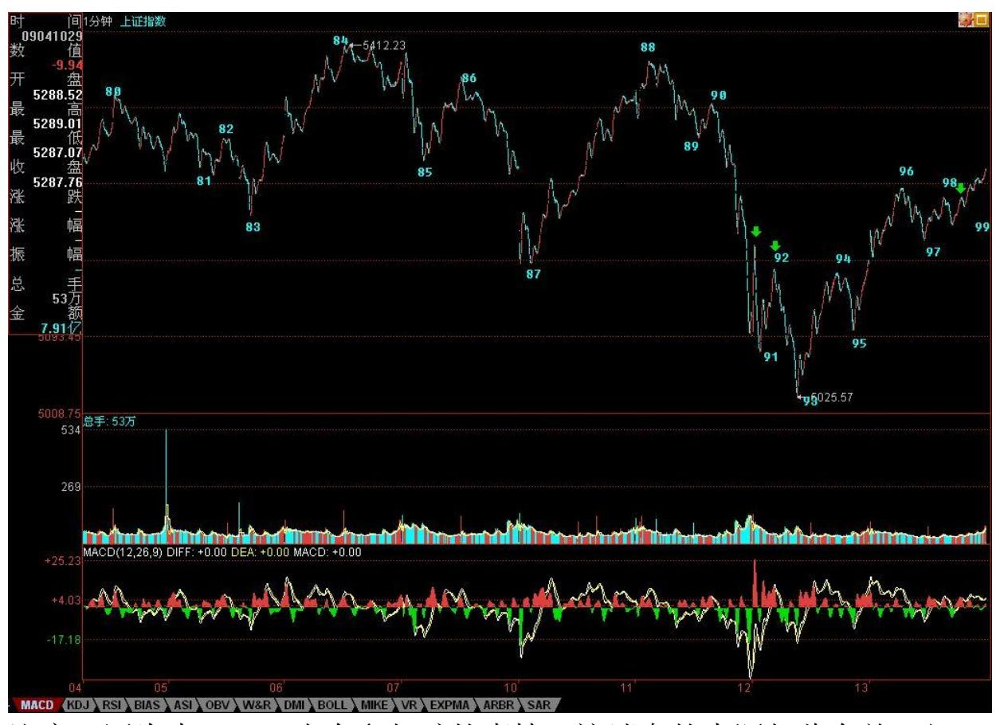
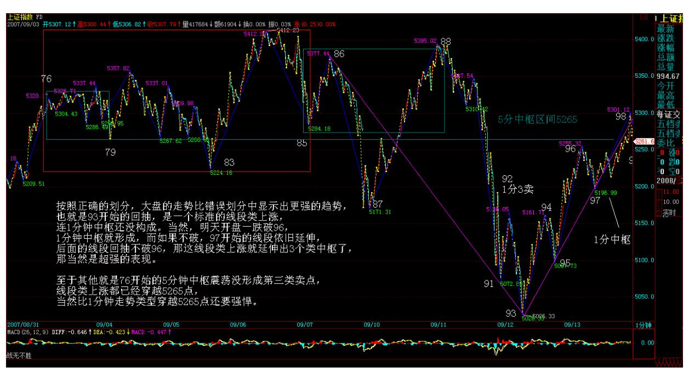
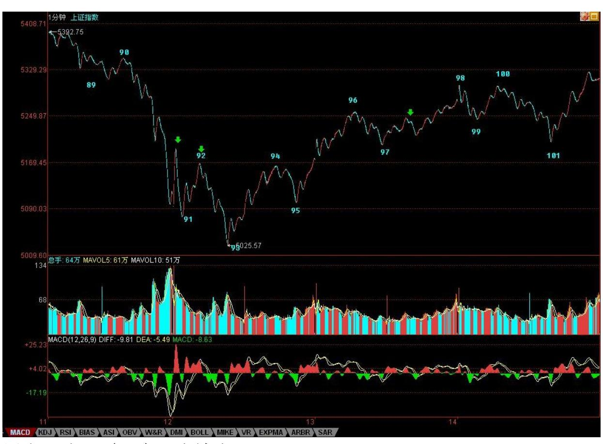
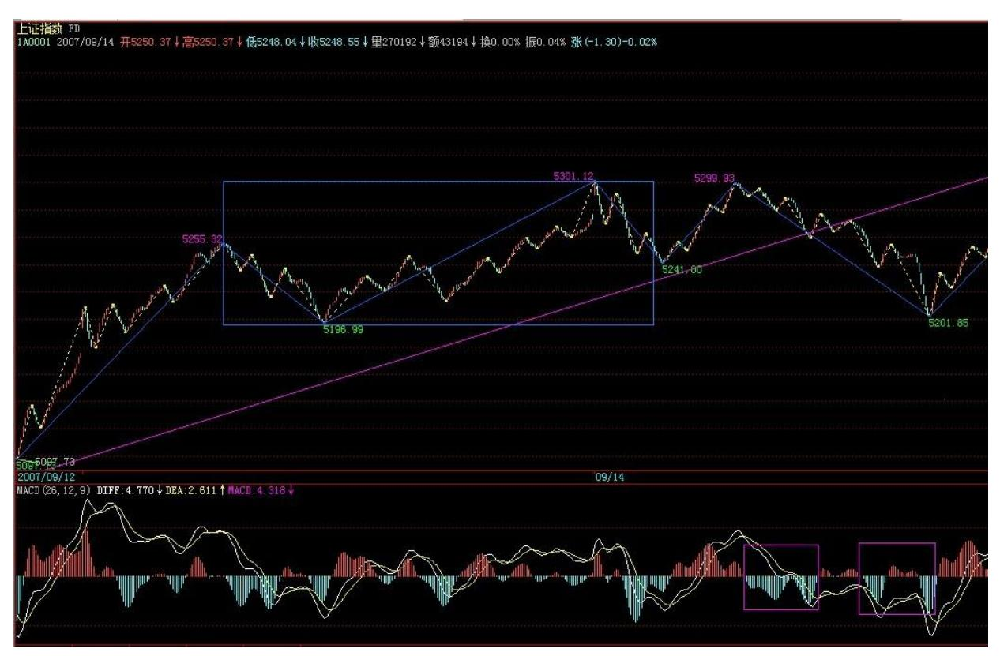
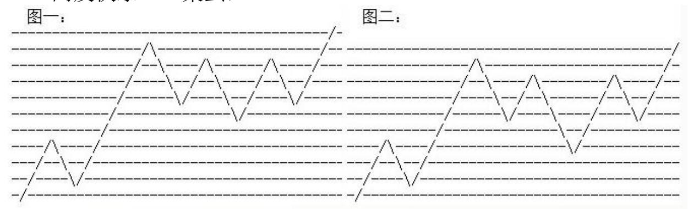
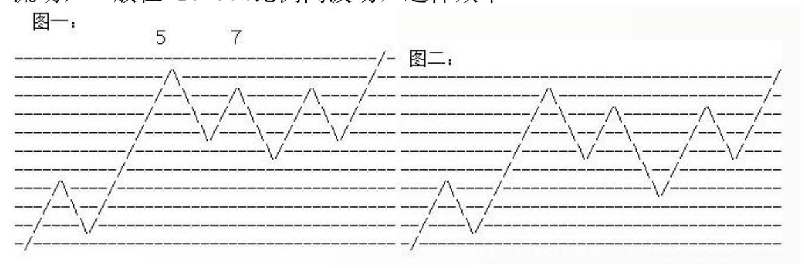

教你炒股票 80:市场没有同情、不信眼泪 不过,对于 96-99 这 1分 钟中枢,其第三类买点还没有形成,因此,比上面的盘整背驰还要急 迫的,就是要确认这第三类买点,否则,最多只能是这 1 分钟中枢的 震荡,然后由此产生 96-99 的第三类卖点,转而下跌也是符合理论要 求的。(注:为参考禅师的思路,下图划分还是继续更正前的划分, 原 1 分中枢错误划分)211 所以,明天的技术走势极为简单,最强 的,就是开盘后能形成 96-99 的 1 分钟中枢的第三类买点,然后继 续上攻,这时候必须关注其盘整背驰问题,一旦出现,该怎样操作, 就不用说了。弱的,就是不能形成第三类买点,然后继续中枢震荡, 最弱的当然就是形成第三类卖点,然后再次大幅下跌。

因此,明天的走势,只要看好这几点,一切都在当下把握中。

注意,正确的操作,就是 93 背驰进入后,现在一直持有着,或者你 有技术条件,96-97 的震荡的可以对冲一把的,回补或换股后,现在 应该是持有状态。

最坏的情况,就是今晚突然有巨大消息,这样明天一开,确定 96-99 的第三类卖点成立,就手起刀落。当然,这种情况,一百天也碰不到 一次,所以一般情况,就可以耐心等待真正卖点的出现。卖点出现干 什么,就不用说了。

上面说的都是短线,这对技术要求高,没这理解力与技术的,就算 了,把仓位调节好,有些钱不是适合每个人赚的。

当然,只要你对本 ID 的理论有一定认识,那没有什么钱是不可以赚 的,因为所有的赢利机会,本质上都被本 ID 的理论所把握,唯一的 问题是你的理论把握程度与交易通道,反应速度等等。理论保证所有 机会,那你的精力与资金不可能参与所有的,所以就只能有所选择 了。

个股方面,没什么可说的,像小安子,那些对他不满之人,现在也如 同等比一样没什么可说的了。000938,今天提供了一个底分型的买入 机会,就算你不关系这股票,那也请从纯技术角度,好好研究其图 形。

注意,下面都是梦话,谁信谁有毛病:这里再说一只股票,注意,这 股票风险极大,不适合一般人,本 ID先把其前因后果说清楚,这股票 是 600078。该股的问题是在云南买别的矿的时,突然发现买的地方下 面有另外的矿,那矿就是 600497 搞那种,据说量比 600497 还大。

注意,因为本 ID 一直有参与矿的事情,这消息的来源与此有关。但 这消息的准确性问题不大,但最大的问题是,该公司去买的时候,不 是直接用上市公司,其次,这东西,完全存在可能就是被他们低价倒 给自己,因此上市公司最终没什么利益。

因此,建议,对云南熟悉的人,自己去调研一下,看这事情的准确性 有多大,千万别只听本 ID 说,本 ID 目前也在核实中,并不保证任 何问题,而且就算是真的,也有可能不装到上市公司里,所以完全有 可能是闹剧一场。

消息就这样了,如果大盘下跌,这股票完全有可能跟着大幅度下跌, 所以任何头脑发热就冲进去的,自己负责。马上要去看一个 PE,车子 在下面等着,先下,再见。看完上面文章,请务必看。

213 各位注意,严重更正(2007-09-13 20:55:15)今天收盘后事情不 断、电话不断,后来又要赶去看一公司,司机按时到,本 ID 是在赶 着把文章写好,连复查一遍都没有,导致今天的划分出现严重错误。

以后尽量把写帖子的时间安排充裕点,但有时候实在太忙,出现点错 误,也请各位原谅。

错误的划分还在今天的收盘分析中,本 ID 也不更改,把错误的放在 那里,好当一个比较,对学习划分有大的帮助。错误就在于错把绿箭 头的那一下当成一段了,这是错误的,中间那一折仔细看一下就知道 不构成一笔,而一段是至少三笔的。

因此,按照正确的划分,大盘的走势比错误划分中显示出更强的趋 势,也就是 93 开始的回抽,是一个标准的线段类上涨,连 1 分钟中 枢还没构成。当然,明天开盘一跌破 96,1 分钟中枢就形成,而如果 不破,97 开始的线段依旧延伸,后面的线段回抽不破 96,那这线段 类上涨就延伸出 3 个类中枢了,那当然是超强的表现。

至于其他的分析,依然有效,就是 76 开始的 5 分钟中枢震荡没形成 第三类卖点,线段类上涨都已经穿越 5265 点,当然比 1 分钟走势类 型穿越 5265 点还要强悍。

215 明天,就要注意这线段类上涨的结束位置,然后下来的线段调 整,必然形成 1 分钟中枢,其后走势,都与该 1 分钟中枢的演化相 关,这太简单,就不要详细说了。等等,找找有没有发现本 ID 错误 的,都给戴上大红花。

解盘及互动问答:

#### \*\*\*\*\*\*\*\*\*\*\*\*\*\*\*\*\*\*\*\*。

1. 网友[匿名] 赚到了:缠 MM:98—99 并不是一线段啊?只是一 笔,各位同学有不同意见吗? 2007-09-13 16:23:07网友[匿名] laowang:同感,97 接下来的线段还没走完。2007-09-1317:10:22网 友[匿名] 新浪网友:有疑问:98 到 99 应该不是一个线段吧?我的 看法从 97 开始的线段目前还没有走完,请大家讨论。2007-09- 1317:18:33缠师:我觉得 98、99 段分得有问题。我在分时,仅到 97 段。请斑竹讲解一下吧。谢谢!找到不少,可能有漏掉的,一律大红 花。

由此可见,如本 ID 反复所说,本 ID 的理论如同几何学,是可以 100%严密地讨论的,这里没有权威,连本 ID 都不是,本 ID 错了也 就错了,没有什么可说的。

有人说,错了也没什么,只是把一段给分错了,但这里的差别大了去 了,因为这样,市场的真实力度等就分析不对了,原来是一个线段类 上涨,搞成 1 分钟走势,那样,回拉的力度差别就大了。而级别越 小,证明回拉力度越大,所以必须绝对准确,这才能真正反映市场的 真实情况。

必须用最严谨的态度来对待划分,这样才能真正看清楚市场在干什 么。

#### \*\*\*\*\*\*\*\*\*\*\*\*\*\*\*\*\*\*\*\*。

缠师:补充一句,600078 的基本面,在 2 个月前就有相关传闻,但 那时候关于矿的量没有说法,目前有了新进展,不过最终能否实现对 上市公司的装入,那是一个远没答案的问题。而且详勘资料本 ID 还 没看到,所以一切都只是一个传闻,就算本 ID 最近看到了正式的详 勘资料,也绝对不能保证这玩意就能放到上市公司里,所以一定不能 以此为准。下周焦点:能否破坏周 K 线顶分型(2007-09-14 15:33:01)显然,本周如期出现周 K 线顶分型,而且制造了一次绝妙 的短线机会。那么,下周就在于,能否破坏这周 K 线顶分型。看过本 ID 课程的都知道,周 K 线顶分型出现后,如果在 5 周均线处得到支 持不有效跌破,那么,该顶分型只制造一个小级别调整,不会出现周

K 线上的笔调整那样的大级别调整。因此,下周的走势十分明确,下 面就看5 周均线的支持度能否制造该顶分型的破坏。

小级别图上,今天的走势在昨天已经明确说过,就是形成 1 分钟中 枢,然后根据该中枢的震荡情况决定行情的发展。今天的走势,其实 就干了这样一件事情。下周一的走势最简单,就是 98 到 101 这 1分 钟中枢究竟是先有第三类买点还是先有第三类卖点,如果是前者,那 么这个 1 分钟的向上走势将延续,顶分型的破坏的可能性极大。如果 出现后者,那么二次探底就不可避免,5 周均线将继续受到考验。

这两天的图形,完美地演绎着本 ID 的理论,从中可以看出,一个线 段上涨如何演化出一个 1 分钟走势类型,后面,继续看这走势类型如 何生长,到最终的完成。如果你真明白本 ID 的理论,看行情的走 势,就如同听一朵花的开放,见一朵花的芬芳,嗅一朵花的美丽,一 切都在当下中灿烂。

周末,让股票豆腐、磨墙去吧。

218 2007 年末,资金与政策博弈下的走势分析(2007-09-17 00:41:48)这轮从 2005 年中开始的行情,一直受到 1992 年 1429 点 开始的系列比例线的严格控制。例如,在 3000 点下,震荡确认的是 1/4 线,也留下了 227 暴跌印记;而在 4000 点上,震荡确认的是 1/2 线,恰好在 5 月的 180 月大周期中,以 530 暴跌来继续印证这 些比例线对大盘走势控制的有效性。而目前大盘的走势,同样没有离 开这系列比例线的控制。

9 月,2/3 线的位置在 1429+184\*30\*2/3=5109;3/4 线的位置在 1429+184\*30\*3/4=5569。显然,911 的大跌行情,是对 2/3 线突破后 的回抽,但该线最终是否被有效站稳,一般来说,都需要 3 个月以上 的确认周期,这在 1/4 与 1/2 线的确认中都得到完美的验证。

由于 2/3 线与 3/4 线相差太近,所以今后行情的走势,将受到这两 条线同时的控制与确认。由于本月是第三季度 K 线的收盘月,因此, 只要本月收盘不能收到 3/4 线之上,那么可以肯定地说,2007 年的 最终收盘,将受制于 3/4 线,也就是说,即使年收盘位置最终能向上 脱离 3/4 线,但其中必然会出现至少一次类似 227、530、911 的走 势。

可以相当肯定地说,根据交替原则,227 是小调整、530 是大调整, 如果针对 2/3 线的调整是小调整,那么,针对 3/4 线的调整,将有 极大的机会至少是一次如 530 走势般的剧烈调整。根据 9 月收盘相 对 2/3 线的位置,可以将大盘走势进行分类:如果收盘在该线之上, 那么大盘是强势,反之是弱势。其强弱程度的绝对值正比于收盘相对 2/3 线的距离。

最简单的经常是最便利且最有力的,在对行情的分析与操作中,情况 同样如此。在技术分析中,没有比均线系统更简单的,但在中长周期 的分析中,一条5 月或 5 周均线,就比绝大多数的复杂系统都有效 了。从 2005 年中行情发动以来,大盘从未有效跌破过 5 月均线,甚 至在 530 大跌中,也没有发生过,任何在 5 月均线下的走势,最终 都被证明是空头陷阱。

但这样一个模式,最终必定会被打破,而打破之时,就是行情进入大 级别调整的确立之日。请注意,该调整的级别一定大于 530,也就是 说一定是 2005 年中行情发动后最大一次级别的调整。反之,在 5 月 均线被有效跌破之前,大盘的行情依然延续。

由于 7、8 月的连续月长阳,使得 5 月均线严重偏离,目前仍在4600 点不到的位置,因此,9 月的震荡,在技术上,是等待 5 月均线的上 移。因此,第四季度的走势,归根结底只是一条,就是一旦 5月均线 上移后,能否继续站稳该线。也就是是说,行情是否继续被 5月均线 的上移惯性所带动?而从中短线的角度,5周均线极为重要,一旦有效 跌破,就意味着类 530 级别的调整不可避免。根据交替性原则,由于 530 是以空间换时间,那么,下一次类似级别的调整,有绝大的可能 是以时间换空间。当然,这判断成立的前提是,行情没有受到特别的 非系统性因素的影响。

由于去年大盘涨幅是 130.43%,收盘在 2675.47 点,按相应比例, 6165 点成为今年一个标杆式的点位。还有,深圳成分指数在 96 年的 行情中,也如本次上海指数一样略微跌破 1000 点后展开,而前者最 终在 6100 点上见大顶,因此 6100 点附近是后者行情一个特别值得 留意的位置。

站在对市场发展有利的角度,大盘年内最理性也是最理想的走势是: 一、9 月收在 2/3 线之上;二、第四季度以第三季度的长阳为基础进 行震荡整理,震荡区间,以绕 2/3 线至 3/4 线区间为中枢展开,最 终以十字星或者小阴小阳收盘。

但一旦政策面的压力超乎合理的范围,大盘将演化为一种具有压力的 走势,即 9 月收盘在 2/3 线下,而第四季度最终以中阴线甚至大阴 收盘。这种走势,必然使得年 K 线留下长上影,对明年行情发展的空 间产生较大压制。反之,一旦资金面的肆虐超乎合理范围,那么大盘 将演化为一种疯狂走势,即在今年内强行突破上面所说的 6100 点区 域,这样,一次超 530 级别的调整将难以避免。

目前,资金面与政策面逐步走向平衡,一旦这种平衡被其中一面非理 性打破,那么将对中国的资本市场中长期的发展制造不必要的困难。

资金与政策的博弈,不仅是中国,也是世界资本市场历史发展中永恒 的主题。如果这种博弈能在尽可能的理性与系统性范围内展开,那么 对中国资本市场的发展将是最大的福音。

资金向政策发起新一轮挑衅(2007-09-17 15:46:13)今天的走势十分正 常,无非就是延续了加息突破的老路子。周五的分析中已经很明确 了,只要形成 1 分钟的第三类买点,那么新高就是绝大可能。今天早

上 11 点多的那个第三类买点(后面有更正 3 买为10:26),极为教科 书,后面的走势,就是本 ID 理论所 100%保证的活动,没什么可说 的。

大盘年末的走势分析,已经在今早所贴的"2007 年末,资金与政策博 弈下的走势分析"里,文章为了照顾大多数人,没有用本 ID 的理论 分析,只是用了些通常的分析方法,因为这种预测性的文章,没多大 意思,只是给各位一个大致的方向性。

真能有效战胜市场的,还是要学会用本 ID 的理论去当下的操作。上 周一个绝妙的短差,然后又一个绝妙的回补点,从那 5025 点的 93开 始,一个 1 分钟中枢类型都没完成,但你明白本 ID 的理论的,就可 以看着他按照理论的规范一步步地生长出来,这其中的从容与逍遥, 又岂是那些用无数概率化的无聊玩意去争论大盘是新高还是不新高, 真突破还是假突破的能明白的?股票是用来操作而不是用来预测的, 必须明白本 ID 理论知行合一的特点。现在十分简单,就是等待这 1 分钟走势类型的凋谢,具体的理论与操作,在课程里都反复说了,就 不一一重复了。另外,今天的划分太简单,为了节约那可怜的 200 图 空间,今天就不上传图形了。

由于在 5000 点反复震荡还跳过水,所以本 ID 对大盘所给予的空间 也打开一点,在早上的文章中已经分析过,请过去看。总的来说,只 要围绕 2/3 线到 3/4线为中枢的震荡,都是可接受的。

今天,大盘的资金面向政策面发起新一轮挑衅,能否得逞,就看这几 天政策面受刺激后的反应了,一般来说,本周没反应,下周反应的机 会就越小,毕竟有一个长假期,稳定第一,没人会用这来开玩笑的。

个股方面,中字头的继续逞强,最近开始吹中字头的人越来越多,本 ID 在 3600 点开始说,现在就不说了。当然,中字头是本 ID 组合的 一只翅膀,海枯石烂去了。

本 ID 的事情,都是尽量善始善终的。600569,当时 9 元说 5 个涨 停,这倒霉孩子,碰上 530,剧本只能变,这次从 7 元开始发力,折 腾下来,也达到原来剧本的承诺了。后面当然还有剧本,但,本 ID可 已不欠任何人的话了。

600078,本 ID 最近找人去调查,这是最新的结果。该公司的所有在 当地的子公司、孙公司都查了一遍,仍没有在当地国土部分申报有关 领采矿证的资料,由于该公司在当地乱七八糟的公司特别多,也不知 道有没有漏网的。没有采矿证,一切都不能算数。根据情况,大致有 以下可能性:一、一个闹剧二、这些民营坏蛋想私吞了。

三、想学黄某某,先晾着,等大家都不注意了,再突然装进来。

所以,现在这游戏,已经从 PE 变成 VC 了。本 ID 毕竟离得太远, 去企业又太显眼,又不想为这事情到基层兴师动众,只能通过省里某 些标准渠道去了解。

有在当地的人,如果有可能的,可以到企业进一步了解,看能否把 VC 再变回 PE。

了解这事,顺便还了解了另一件事情,就是有人希望把某驴让美驴来 入股,现在中驴很厉害,所以就有人要搞这样的把戏。不过企业相当 抵触,所以这事情还真不好说。如果美驴真给放进来了,那些驴们又 要疯了。但这只是一个有人在折腾的事情,在实际上,事都是折腾出 来的,但折腾并不一定能事,所以,这也只能是一个 VC 项目,不能 太沉迷。注意,本 ID 说的是驴,可没说什么股票。

今天踩着刀锋,醉生梦死把上周完成的顶分型给破了,那也不妨醉生 梦死一把,回答各位问题到 5 点。

#### \*\*\*\*\*\*\*\*\*\*\*\*\*\*\*\*\*\*\*\*。

2. 网友全线飘红:请问上午 10:58-11:18 当一个线段太牵强了 吧?三笔不清晰,没有重合。2007-09-17 15:52:22缠师:请继续学习 线段分段,为什么该线段不能是早上的高点开始?(注:禅师是从 9 月 17 日 10:09 一段直接到 11:18。原先是判断10:08 不成笔,所以 这样划分,后面有更正)

#### \*\*\*\*\*\*\*\*\*\*\*\*\*\*\*\*\*\*\*\*。

3. 网友 [匿名] 春日: 缠 MM 好!有一问题一直无解,100-101 对 98-99 没有出现盘整背驰,其内部也没有线段内类背弛,怎么能当下 地在 101 处判断回补呢?2007-09-17 15:51:54缠师:比较力度,用 盘整背弛一招也不是光比较最近这一段的。以前有课程专门说过中枢

震荡中的力度比较问题。你必须从 96 开始看,101 没出来前,只能 先看 96-99 这个中枢的震荡。这震荡没破 97 这点,就意味着震荡的 力度有限,所以一定只是中枢震荡。而且100(注:101)的内部,一个 典型的黄线下跌后双回拉后再下跌,而再下跌这段明显比不上第一段 黄线。另外,柱子面积也比不上。

223 还有,线段下没有中枢,所以不能照套中枢概念,这必须清楚。 一般来说,最好不要用线段操作。连中枢都没有,没什么意义,除非 你概念特别清楚,对中枢震荡研究得特别明白。

#### \*\*\*\*\*\*\*\*\*\*\*\*\*\*\*\*\*\*\*\*。

4. 网友 [匿名] 与你同行: 楼主,对于个股来说,顶分型出现后, 立刻出现底分型,而大盘的走势并不确定,可以买入此类股票吗? 2007-09-17缠师:这种情况说得很清楚了,日、周顶分型后关键看 5 日、周线,大盘这次周顶分型后继续破顶,就是因为 5 周线没有有效 跌破,构成一个完美回补点。参照原来说的 000938 就可以明白。至 于大盘和个股的关系,是另一个问题,一般来说,水平不高的,最好 还是买和大盘相关度高的。水平高的,就无所谓了。

#### \*\*\*\*\*\*\*\*\*\*\*\*\*\*\*\*\*\*\*\*。

5. 网友 [匿名] 白玉兰: 妹妹好!如果番茄酱的原高管不离职,就 不会通过增发吗?不增发就不能脱离苦海吗?2007-09-17 16:04:18缠 师:对,因为他们原来在唐家兄弟手下,现在一律要清除。干一件事 情,哪里有那么简单,事儿多着呢。

#### \*\*\*\*\*\*\*\*\*\*\*\*\*\*\*\*\*\*\*\*。

6. 网友 [匿名] 下岗工人: 每天看您的文章,不太懂。今天是说可 以疯狂一下了?持股待涨吗?可我恐高,今天卖了去打新股了。真 背,没看懂老师的文章。2007-09-17 15:57:50缠师:这是对的。心理 不行,先退出是绝对正确的。市场机会多了,不要强迫自己,让自己 心脏不舒服。当然,已经立定吃了咸鱼不怕口喝的,可以继续。这是 刀锋上舞蹈,给伤着,千万要有心理承受力。

更当然的,如果技术好的,看着走势来的,就无所谓了,就算有突发 消息,手起刀落,谁怕谁?没这心理素质,还是别玩悬的。

\*\*\*\*\*\*\*\*\*\*\*\*\*\*\*\*\*\*\*\*7. 网友 [匿名]rivus: 老大,有色要上演强 者恒强吗?除了您的票。2007-09-1716:06:03缠师:600432 不是本 ID 股票?今年头,从 20 元不到买的,到今天,除了本 ID,请问还 有谁有?

#### \*\*\*\*\*\*\*\*\*\*\*\*\*\*\*\*\*\*\*\*。

8. 网友 [匿名] 新浪网友:中铝什么时候能调整完呀?缠姐,已经被 套好久了。2007-09-17 16:17:44缠师:中驴还有什么可问的,本 ID 当时说向下阻击,说得满大街都知道,怎么不走?就像 000802,当然 说得这么明确,还有没走的。现在小 ABC 走出来了,短线就看对上面 中枢的回拉力度了。中线当然没问题了。

#### \*\*\*\*\*\*\*\*\*\*\*\*\*\*\*\*\*\*\*\*。

9. 网友 [匿名] 云儿: 缠妹好!跟妹妹汇报一下学习成果。原先涨 也糊涂,跌也糊涂,现在知道买点买,卖点卖了。即使一卖错过,还 有二卖。原先只知盲目增加投资。现在知道可以先卖后买,一样赚 钱。虽说学艺尚不精,但跟着妹妹的思路走,炒股从来没有这么轻松

又自在过。十分感谢!2007-09-17 16:20:40缠师:不用谢,本 ID 最 多就算一陪练,出成绩都是靠你自己,不断努力吧。

#### \*\*\*\*\*\*\*\*\*\*\*\*\*\*\*\*\*\*\*\*。

10. 网友 [匿名] 清空: 缠妹妹,没学好你的技术,911 之前清了 仓,至今踏空,郁闷啊!像我们这样没有太多时间看盘的,可不可以 选一两支股海枯石烂,不管股市的风吹雨打呢?2007-09-17 16:22:10 缠师:那天说得很明确,跌破 5 周线一定至少有大反弹,那天为什么 不回补。

本 ID 的理论很关键一点,就是要节奏。特别是用小级别操作的,节 奏更重要。你抛了不买回,那还不如不抛,等大级别的卖点再说。买 了就要想着卖点,卖了就要想着买点。如果时间不够,操作不方便, 就要选择大级别的操作。不要玩小级别的,否则买卖点很容易错过, 开个会,干件事就没了。小级别只适合职业、或至少是半职业看盘 的。

#### \*\*\*\*\*\*\*\*\*\*\*\*\*\*\*\*\*\*\*\*。

11. 网友 [匿名] 粗茶淡饭: 缠主,怎么看参股和参股券商板块啊? 我的参股板块的几只票怎么都耷拉作啊?000850 成本几乎为 0 了, 还好受些。可还有那个破巴士 741 至今没赚钱,能不能给点提示啊? 2007-09-17 16:22:10缠师:现在,位置高了,有些题材性,又挖掘过 度的,当然要躺一下。不过,如果没有大的政策干预,板块会轮动到 的,不过参股的太多,如果自身没有太好的基本面支持,那就不可能 如上半年一样,是参股的都给疯炒了。

#### \*\*\*\*\*\*\*\*\*\*\*\*\*\*\*\*\*\*\*\*。

12. 网友于金钱而自由: 请问缠君,这"醉生梦死"一回是否以二线 成份指标股为先锋呢?或成长股?2007-09-17 15:59:04缠师:这次 二、三线的力度当然要大点,所以说中字头、二、三线,两个翅膀。

#### \*\*\*\*\*\*\*\*\*\*\*\*\*\*\*\*\*\*\*\*。

13. 网友 [匿名] 新浪网友: 缠 mm,为什么缠论理论上很清楚,但 一但实际操作,又晕了。郁闷!2007-09-17 16:02:30缠师:实际上, 根本原因是理论还学得不够清楚,你看,上面还有很多人,对今天的

分段没搞清楚,那第三买点怎么来的,也没搞清楚,所以,还是先把 理论搞清楚,一定要多看图,那些都是用钱划出来的。你想想,现在 最牛的画,一般的级别也就几千万,而随便找一个图,几乎都要上亿 才能划一个日分时,就别说日线图、周线、年线了。这么珍贵的画, 还不好好欣赏,也太浪费了吧。

#### \*\*\*\*\*\*\*\*\*\*\*\*\*\*\*\*\*\*\*\*。

14. 网友 [匿名] 路边社通讯员: 缠 mm,学了 2 周,终于快赶上大 部队了。在学笔、分型、线段前,感觉内容前后基本一致,比较好理 解。学到线段就开始迷糊了。55 课以前关于中枢的概念,被后面的内 容推翻了。2007-09-17 缠师:没有推翻,这个问题说得很清楚。原来 的中枢定义,是纯理论的,因此,操作起来很麻烦,因为没有人真能 从每一笔成交开始看。关于这个问题,有好几节课反复说了,请再看 一遍。

#### \*\*\*\*\*\*\*\*\*\*\*\*\*\*\*\*\*\*\*\*。

15. 网友缠住我: 姐姐,什么时候能恢复音乐博客?2007-09- 1716:56:02缠师:那网站估计给那次 30 多万的点击给废掉,从那天 起就没恢复,本 ID 也没办法。找一个新的,原来的音乐又要重新传 一次,工作量太大,等等看,希望他能活过来。

#### \*\*\*\*\*\*\*\*\*\*\*\*\*\*\*\*\*\*\*\*。

16. 网友 [匿名] 新浪网友:LZ,请问在 1 分钟的图中,顶部有两 K 线高点一样,两边的笔已成型,这顶能算顶分型吗?谢谢!2007-09- 17 16:56:26缠师:没有顶分型,哪里有笔?不是顶分型,哪里会是 顶?顶就是顶分型的简称。

17. 网友快乐 vs 菜虫:

228 缠姐,请问图一是几段,图二是几段?2007-09-17 16:56:26缠 师:都是一段。

网友快乐 vs 菜虫:老师你在第 71 课中给的例图把上面的图 2 分成 3 段!上面图 2 是否应用以下这段话理解:"而在第二种情况的第二 特征序列中,其方向是和原线段一致,包含关系的出现,就意味着原 线段的能量充足,而第二种情况,本来就意味着对原线段转折的能量 不足,这样一来,当然就必须按照包含关系来。" 缠师:如果图二下 跌那段是 5 笔下跌的,就是三段。

#### \*\*\*\*\*\*\*\*\*\*\*\*\*\*\*\*\*\*\*\*\*。

18. 网友 [匿名] 大盘: 请问博主,线段纠缠很久了,问一个看待走 势如何像花开花落的问题。背驰买点后,形成两个完全不重叠的 1 分 钟中枢,如果第2 个 1 分钟中枢,没有出现三买,而是通过 9 段延 伸形成 5 分钟中枢,这 5 分钟中枢,暂时也没有与第 1 个 1 分钟 中枢有如何重叠,那么我们当下是应该把走势看作未完成的 1 分钟趋 势呢?还是按照 5 分钟的震荡来处理当下走势呢?真的很想像看花开 花落一样看股票走势,但是疑问还是不少。

缠师:当然是 5 分钟走势,看成是 5 分钟的中枢震荡。

#### \*\*\*\*\*\*\*\*\*\*\*\*\*\*\*\*\*\*\*\*。

19. 网友 [匿名] 影子: 今天踏空了一半,看多了小缠的博,我这个 几乎是死多的居然踏空了一半,真是的。博主文章对多方贬义词用的 太多了,估计缠友踏空的比例不小。我发表点不同意见。希望对大家 有点帮助。错了勿怪。 2007-09-17 17:04:52缠师:那你的判断完全 错误,除了必须保留的机动资金已经对冲风险的仓位,本 ID 从 3600

点开始都是 100%的满仓,当然,本 ID 的是机动资金会在组合中不断 流动,一般在 10-30%比例间波动,这样效率

是最高的。一般来说,有大点的卖点,那么本 ID 的机动资金会达到 30%,但一般来说不会到这比例。另外,本 ID 都会有一定比例的对冲 风险操作,这就不细说了。这一点对大资金其实很重要,如果没有这 一点,本 ID 在 530 早上就不会如此从容了,毕竟对于大资金来说, 在那兵荒马乱的早上,一个第二卖点,也走不了多少,但有对冲,就 不同了。如果按对冲基金的观点,纯多纯空都是风险级别的,一定要 有一定的对冲。

缠师:各位注意,特征序列必须要有三个元素才能有可能有分型,两 个元素怎么可能有分型?今天电话不断,还都是长途,刚又接了一 个,问题回答得不太利落。

不过要先下了,再见。
