# 教你炒股票 81:图例、更正及分型、走势类型的哲学本质

(2007-09-17 22:57:16) 请首先看一个回帖:网友【匿名】:缠姐, 请问图一是几段,图二是几段?缠师:如果5=7或者5低于7,都 是一段,如果5高于7,都是3段。下午,本 ID 回答问题时,一边 电话不断,所以给出的答案是不大完整的,因为本ID 按图中看出的 7 不低于 5 来回答的。晚上回来,发现已经有人把正确答案完整写出, 所以必须给一朵大红花。

这两种情况,都属于线段破坏的第二种情况,所以必须考虑高点下来 走势的特征序列,而且必须考虑包含关系,所以上面这位网友的回答 才是完整的。

另外,有人提到 71 课里最后一个图,那个图显然是错的,问题就在 于与这里类似的,把 7 的位置画高了,应该类似 7 的位置比类似 5 的位置低才对,那才是三段,当时画的时候,没特别注意。所以这里 必须指出。

所以,一切根据定义来,把定义搞清楚了,一切都好办,就是本 ID画 错了,你也能一眼看出来。

另外,提一个问题,今天走势的划分,有一些特别的地方,本 ID 下 午说的,有点问题,主要出在,1017 的低点 5386.47 比前一分钟的 5386.39 点高,所以顶分型的顶在 1017 那时间,所以那里就是一 笔,但图形上粗略看顶在 16 分那点,下午写东西太快,没有仔细去 比较,晚上回来,仔细对比一下数据,

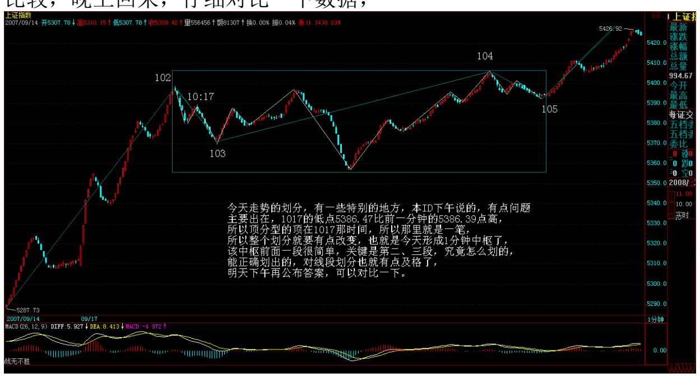

才发现那里应该构成一笔,所以整个划分就要有点改变,也就是今天 形成 1 分钟中枢了,该中枢前面一段很简单,关键是第二、三段,究 竟怎么划的,能正确划出的,对线段划分也就有点及格了,明天下午 再公布答案,可以对比一下。

各位以后要吸取本 ID 下午失误的教训,对那些只有 5、6 根 K 线 的,一定要看好其中是否有包含关系,这样才不会一时大意,这是最 容易出毛病的地方。

有人可能要问,难道就那 0.08 的差别就可以影响整个大盘?这有什 么奇怪的,如果你知道某些物理学的理论,就知道,在那些理论看

来,我们的世界之所以这样,就是因为一些极其微小的差别造成了, 没有那些差别,世界一定不是这个样子了。另外,请注意,一定要用 同一种软件,这样,等于测量的精确度或误差是基本一致的,就保持 整个划分是在同一误差或精确的基础上。

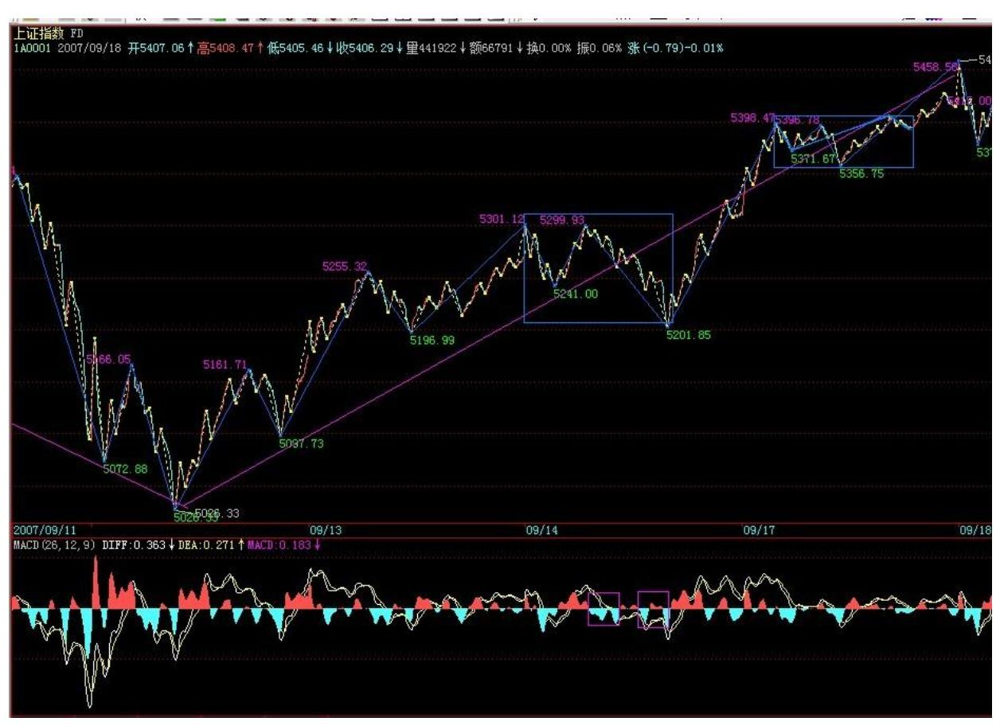

233 好了,闲话不说,进入新课程。

为什么要研究分型、走势类型等东西,其哲学基础是什么?这就是人 的贪嗔痴疑慢。因为人的贪嗔痴疑慢都是一样的,只是跟随时间、环 境大小不一,所以,就显示出自相似性。而走势是所有人贪嗔痴疑的 合力结果,反映在走势中,就使得走势显示出自相似性(后文改称自同 构性结构)。

分型、走势类型的本质就是自相似性,同样,走势必完美的本质也就 是自相似性。分型,在 1 分钟级别是这样的结构,在年线上也是这样 的结构,在不同的级别上,级别不同,但结构是一样的,这就是自相 似性。同样,走势类型也一样。

正因为走势具有自相似性,所以走势才是可理解的,才是可把握的, 如果没有自相似性,那么走势必然不可理解,无法把握。要把握走 势,本质上,就是把握其自相似性。 自相似性还有一个最重要的特 点,就是自相似性可以自组出级别来。上面的话中,先提到级别,在 严格意义上是不对的。级别是自相似性自组出来的,或者说是生长出 来的,自相似性就如同基因,按照这个基因,这个图谱,走势就如同 有生命般自动生长出不同的级别来,不论构成走势的人如何改变,只 要其贪嗔痴疑不改变,只要都是人,那么自相似性就存在,级别的自 组性就必须存在。

本 ID 理论的哲学本质,就在于人的贪嗔痴疑慢所引发的自相似性以 及由此引发走势级别的自组性这种类生命的现象。走势是有生命的, 本 ID 说"看行情的走势,就如同听一朵花的开放,见一朵花的芬 芳,嗅一朵花的美丽,一切都在当下中灿烂" ,这绝对不是孔男人式 的矫情比喻,而是科学般的严谨说明,因为走势确实有着如花一般的 生命特征,走势确实在自相似性、自组性中发芽、生长、绽放、凋 败。

因此,本 ID 的理论是一种可发展的理论,可以提供给无数人去不断 研究,研究的方向是什么?就是走势的自相似性、自组性。这里,可 以结合现代科学的各门学科,有着广阔的前景以及可开发性。

所以,本 ID 的理论,不是一些死的教条,而是一门生命学科。只 是,目前本 ID 只和各位讲述一些最简单的自相似性:分型、走势类 型。

本 ID 的理论中,有一条最重要的定理,就是有多少不同构的自相似 性结构,就有多少种分析股市的正确道路,任何脱离自相似性的股市 分析方法,本质上都是错误的。

显然,分型、走势类型是两种不同构的自相似性结构,我们还可以找 到很多类似的结构,但现在,还是先把这两个最基础的结构给搞清 楚。条条大路通罗马,只要把这两个结构搞清楚,就能达到罗马。而 其他结构的寻找、研究,本质上是一种理论上的兴趣。而不同的自相 似性结构对应的操作的差异性问题,更是一个理论上的重大问题。

本 ID 的理论上还有一个暂时没有解决的问题,就是走势中究竟可以 容纳多少自相似性结构,还有一个更有趣的问题,就是起始交易条件

对自相似性结构生成的影响,如果这个问题解决了,那么,对市场科 学的调控才能真正解决。

本 ID 的理论还可以不断扩展,也可以精细化进行。例如,对于不同 交易条件的自相似性结构的选择,就是一个精细化的理论问题。

自相似性结构有什么用处,这用处大了去了。一个最简单的结论:所 有的顶必须是顶分型的,反之,所以的底都是底分型的。如果没有自 相似性结构,这结论当然不可能成立。但正因为有自相似性结构,所 以才有这样一个对于任何股票、任何走势都适用的结论。

反之,这样一个结论,就可以马上推出这个 100%正确的结论,就是: 没有顶分型,没有顶;反之,没有底分型,没有底。那么,在实际操 作中,如果在你操作级别的 K 线图上,没有顶分型,那你就可以持有 睡觉,等顶分型出来再说。

另外,有了自相似性结构,那么,任何一个级别里的走势发展都是独 立的,也就是说,例如,在 30 分钟的中枢震荡,在 5 分钟的上涨走 势,那么两个级别之间并不会互相打架,而是构成一个类似联立方程 的东西,如果说单一个方程的解很多,那么联立起来,解就大幅度减 少了。也就是级别的存在,使得对走势的判断可以联立了,也就是可 以综合起来系统地看了,这样,走势的可能走势的边界条件就变得异 常简单。

所以,看走势,不能光看一个级别,必须立体地看,否则,就是浪费 了自相似性结构给你的有利条件。

等待那万众期盼的每周一跌(2007-09-18 15:53:21)首先,必须声明, 本 ID 昨天说的是驴,和任何股票无关。至于有些无聊股票,走出例 如涨停那种很无聊的走势,可和本 ID 一点关系都没有。本 ID 这里 可从不推荐任何股票,最多就是梦里胡言乱语一把,本 ID 要推荐, 也推荐驴肉火烧实在点。

现在的走势,极端简单,就是真突破还是假突破的问题,一般来说, 如果是假的,就是三、四天内见分晓,先来两、三个十字星之类的玩 意,然后虚晃一枪向下跳水。如果按这个把戏,周四前后就是田亮一 把的日子。而且,现在,每周一跳,跳了,都爽了,就该干嘛干嘛 了。 当然,用本 ID 的理论,就没有这么多麻烦事,而且绝对不用去 宣称什么这是世纪大顶之类的无聊事情。如果你是按 30 分钟操作 的,什么顶呀底呀,只要按照节奏来,绝对不参与 30 分钟级别的下 跌,那么这世界在你眼里,就只有三种活动,30 分钟级别的上涨、盘 整、下跌,世纪大顶、火里刀上也一样可以逍遥游,其他级别的操作 也是一样的。

现在的情况十分简单,对于短线来说,就是现在依然是原来 76-85 那 个 5 分钟中枢的中枢震荡,现在的问题只不过是,该 5 分钟的中枢 的第三类买点是否出现。如果不出现,那就继续中枢震荡,当然,那 时候,这 5 分钟就扩展成 30 分钟的中枢震荡了,那就更好玩了。

至于超短线来说,昨天问题的答案在图里就有了,分不清楚的,请好 好研究一下。目前,就是 102-105 的一个中枢震荡。注意,目前这个 离开原来 5 分钟中枢的走势并没有完成,所以还谈不上回抽,那今天 震荡的低点,刚好在 78 之上,也就看出,这中枢震荡并不是瞎掰 的,这么远的距离,依然起着作用。

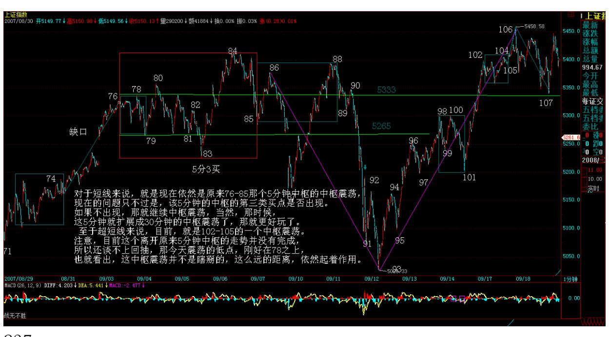

237

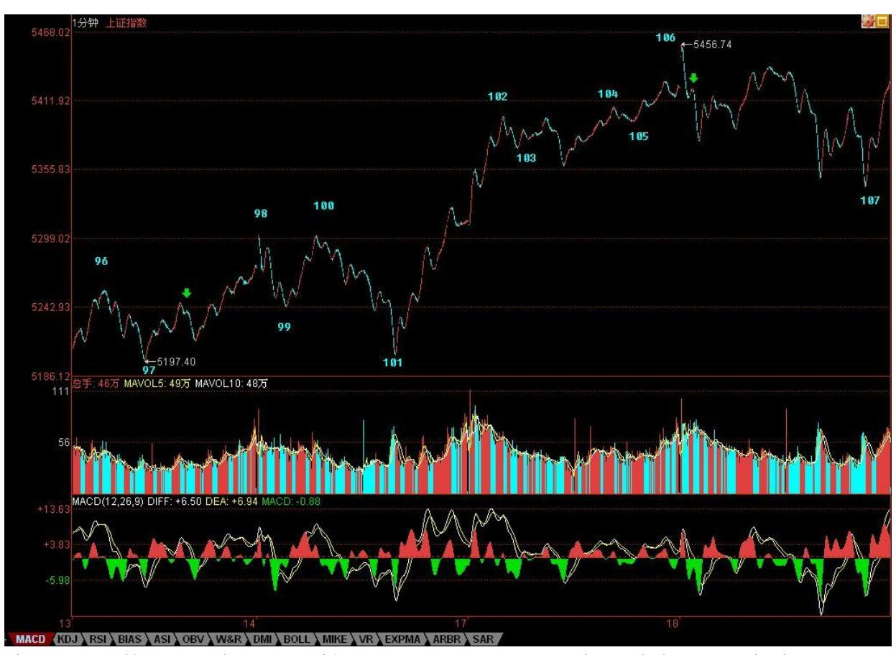

个股,没什么可说的,就算是假突破,只要这大的中枢震荡存在,那 么个股机会依然汹涌,假期前,又有一个持股持币的无聊问题,关键 还是你的操作级别和该级别中的表现。对于完全不了解本 ID 理论 的,就看 5 日或 5 周线,特别是 5 周线,这是中短线的关键。马上 有一件新疆的什么无聊管道要上市的事情要谈,不能回答问题了,先 下,再见。

238 忽闻台风可休市,聊赋七律说《风灾》(2007-09-18 22:53:57)回 来晚了,有点累。听说上海那边,明天有可能因为台风休市,借个话 头,写首七律敷衍一下各位。可惜,就算上海休市,深圳也还开,十 一将至,真是有点无心恋战了,干脆都放假休息,游山玩水去,不亦 快哉?今天,急着外出,把 107 写成 108,后来是在谈完一轮,去吃 饭的路上车里改的。

现在发现各位对那些古怪的分段还是有点乱,那些古怪的分段,经常 是因为第一次笔破坏时,延伸不出线段来,例如,今天图里绿箭头所 指的地方,顶和底分型经过包含处理后中间没有 K 线了,这就不能算 一笔。

本 ID 想了想,计算了一下能量力度,觉得以后可以把笔的成立条件 略微放松一下,就是一笔必须满足以下两个条件:1、顶分型与底分型 经过包含处理后,不允许共用 K 线,也就是不能有一 K 线分别属于 顶分型与底分型,这条件和原来是一样的,这一点绝对不能放松,因 为这样,才能保证足够的能量力度;2、在满足 1 的前提下,顶分型 中最高 K 线和底分型的最低 K 线之间(不包括这两 K 线),不考虑 包含关系,至少有 3 根(包括 3 根)以上 K 线。显然,第二个条 件,比原来分型间必须有独立 K 线的一条,要稍微放松了一点,这 样,象今天绿箭头所指的地方,就是一笔了,相应那三笔下来就构成 一段了,整个划分就不会出现比较古怪的线段。

对线段一直比较晕的人,这个新的条件大概容易处理一点,至少可以 避开处理如 106 到 107 这样复杂的线段,而这,本 ID 刚计算过, 也不会影响整个线段的动力学能量。但 103-104 这样的线段,是无法 更改的,这类线段必须能够处理。

另外,以前也说明过,现在再说一次,本 ID 平时交易时不用同花 顺,只是本 ID 用的系统网上没有,所以那里的标记无法搞过来,因 此,本 ID 在同花顺上的标记,都是收盘后才弄的,而两套系统的数 据经常有点小出入,有时候偷懒,就照抄过去,偶尔就会出问题。其 实,本 ID 这个示范,只是为了让各位能明白真正的划分,只是一个 示范,如果你真明白了划分的原则,不看也可以,根据自己系统的数 据,都有唯一正确的答案。分型、笔、线段,都是最基本的准备,关 键还是通过这去分别出更高级别的走势类型,那才是操作的关键之 处。所以,一定要把这两部分的区别搞清楚。不说了,本 ID 写的七 律来也,上海的朋友,看看和外面的比怎么样? 政策对资金挑衅的反 击(2007-09-19 15:42:03)今天算不算田亮一把,估计要看了明后两天 才知道了。因为,好象田亮参加的项目,有 1 米板,还有 10 米台, 这玩意,要对比着才知道的。本来,美国减息,全世界喝了一把水井 坊,但中国就是中国,不和全世界玩,咱自己玩。

年末行情的判断,在"2007 年末,资金与政策博弈下的走势分析"说 得很清楚,最理智的走势是怎么样的,也写得很清楚了,如果一方挑 衅,肯定会被反击,今天三大报让各位学习,各位也就学习一把,水 井坊给英国佬搞去全世界,到时候用英镑卖的,咱就喝王老吉,降降 火。

技术上,昨天已经说得最清楚不过了,基本看法一样,首先小的 1 分 钟震荡,今天没震出什么结果,而操作上,当然是冲高震荡时卖,卖 了回来看,如果向下破位出第三卖点,咱就不管他,看他跌成王老吉 还是水井坊再说,如果不出第三卖点,咱就继续陪他游戏。

不过,从短线政策的压力看,如果资金面上还继续麻辣火锅,火气旺 旺的,那么,政策上大概就不是学习学习那么简单了,让你喝王老 吉,那是给面子你,哪天让你吃点巴豆、喝点减肥茶,又有什么不可 以的?本 ID 总是想和稀泥,让双方都能平和点,但良好的愿望,绝 不是本ID 一个就能实现的,市场是大家的,是合力的。当然,本 ID 也懒得呼吁什么了,现在只有一个念头,快点放假,游山玩水去吧。

昨天,本 ID"欣闻台风可休市,聊赋七律说《风灾》"可能引起某些 敏感,本 ID 后来就改成了"忽闻" ,这就是和稀泥,本 ID 不想为 一个字去坚持什么,没什么可坚持的。虽然原来的话修饰什么,是很 明确的,不过,如果一个字能让大家少点争吵,那字又算得了什么? 所以,资金与政策目前的困局,也是一样,资金去挣所谓的钱,难道 就一定要只争朝夕了?退一步,难道不可以海阔天空?只是美国一减 息,某些如意算盘就难打了,本 ID 自己从来没什么烦恼,现在唯一 的烦恼,就是看得太明白了。

昨天是 918,我们补默哀三分钟吧。今天可以回答问题到 4 点半,不 过都请先为 918 默哀三分钟。

\*\*\*\*\*\*\*\*\*\*\*\*\*\*\*\*\*\*\*\*。

解盘及互动问答:

\*\*\*\*\*\*\*\*\*\*\*\*\*\*\*\*\*\*\*\*。

1. 网友 [匿名] 新浪网友: 那个石头在发飙啊。2007-09- 1915:49:52缠师:总不能永远学雷锋吧。

\*\*\*\*\*\*\*\*\*\*\*\*\*\*\*\*\*\*\*\*。

2. 网友 [匿名] 新浪网友: 000807,那驴子,还会疯狂吗?200709- 19 15:50:40缠师:现在,企业不愿意,但有比企业大的愿意,正在磨 着,磨出结果来才会疯狂。该股基本面不错,又有新项目将产生利

润,不过如果大盘不好,也只能跟着大盘走一段。如果有机会有一个 大的中线买点,是值得关注的。

#### \*\*\*\*\*\*\*\*\*\*\*\*\*\*\*\*\*\*\*\*。

3. 网友缠住我: 姐姐看好电力和钢铁吗?银行股算不算调整好了 呢?希望能早点听到姐姐重开的音乐会。2007-09-19 15:53:58缠师: 那网站不重开,本 ID 也没办法。那两板块都可以,钢铁最近涨多 了,压力大一点。

其实,本 ID 经常是尽可能说点东西,不过有些东西不能明说,否则 有引导之嫌疑。例如,600569,前天高收时,说了原来剧本的目标达 到了,当然,那这是本 ID 的梦话,其实本 ID 什么都没说,像上次 000802 一样。不过,这些股票,经过调整,都没大问题的,现在关键 不是个股,而是大盘。

\*\*\*\*\*\*\*\*\*\*\*\*\*\*\*\*\*\*\*\*。4. 网友 [匿名] 新浪网友: 请问缠 mm,打 坐中,气息是连续的从气嘴出来吗?现在感觉受呼吸的影响啊。我知 呼吸。2007-09-19 15:58:33缠师:只要稍微念想一下,真气无形,你 又管什么呼吸之气?

#### \*\*\*\*\*\*\*\*\*\*\*\*\*\*\*\*\*\*\*\*。

5. 网友恒灵: 缠主,昨天又重新说了笔,我们以后画线段,按新定 义还是老定义呀? 2007-09-19 15:59:46缠师:那主要是为了不同软 件间可以减少不同,因为,K 线的个数是肯定基本一样的,这样,就 不会因为一些微小的差别导致不同的结果。而且,分别起来更简单, 所以,可以用新标准。其他都不需要改变。本 ID 自己一直用老标 准,因为本 ID 从来只用一套软件。但这理论公开,就有一个适应性 的问题,毕竟不能要求所有人只用一套软件,所以稍微改改,又不影 响最终的判断,又何妨?

#### \*\*\*\*\*\*\*\*\*\*\*\*\*\*\*\*\*\*\*\*。

6. 网友 [匿名] 新浪网友: 缠主下午好!想请问缠:今日中石化逆 市拉起护盘做何解释?2007-09-19 16:04:18缠师:为什么拉起来就是 护盘?如果拉起来还走成这样,那么不拉呢?想想 530 时,中石头的 表现。当然,还有一个原因,就是上面说的,为什么一定要继续学雷 锋?中线看,中石头自己是没什么事的,众多基本面支持。

#### \*\*\*\*\*\*\*\*\*\*\*\*\*\*\*\*\*\*\*\*。

7. 网友 [匿名] 菜鸟: 缠姐姐,000807,我已经看到你回复其他同 学了。领会精神了。再帮我看看紫光吧。还可以继续拿着么?谢谢! 2007-09-19缠师:这是典型的初学者毛病,为什么跌了才问还持有 不?上面的卖点这么明确,又盘整背驰,又顶分型,为什么不可以先 走?股票操作是有节奏的,节奏错了,本 ID 也不知道怎么办。

本 ID 只知道跟着市场的节奏舞蹈,只要跟着市场的节奏,在刀锋上 一样可以凌波微步。

另外,请搞清楚自己是为什么买入的,如果是中线买入,那就应该是 中线买点进入。这股票,中长线肯定是没问题的,短线调整幅度,当 然和大盘相关。

#### \*\*\*\*\*\*\*\*\*\*\*\*\*\*\*\*\*\*\*\*。

8. 网友 [匿名] 落到实处: 妹妹,我也搞了 600078。您还在里面 吗?如果您不在,我立马走人。2007-09-19 16:07:35缠师:那天不是 明确说了,本 ID 去省里没查到有人去办采矿证,第二天一上午都有 高位,如果是短线,为什么不先退出?这股票,本 ID 会继续关注 的,在下一个买点,本 ID 当然会介入,因为本 ID 有点好奇心,想 看看这群坏蛋搞什么鬼名堂。

#### \*\*\*\*\*\*\*\*\*\*\*\*\*\*\*\*\*\*\*\*。

9. 网友 [匿名] 清茶依依: 顶分型和底分型之间,不满足三根 K 线,K 线间有缺口,这个顶分型和底分型成立不?2007-09-

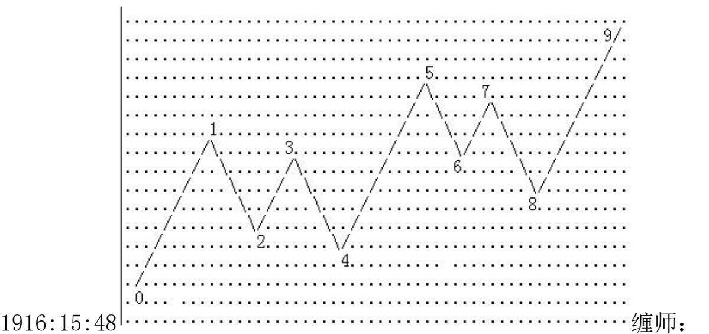

不行,缺口不说明任何问题,需要的是延续的时间。

#### \*\*\*\*\*\*\*\*\*\*\*\*\*\*\*\*\*\*\*\*。

10. 网友 [匿名] 袖手旁观:244 请教缠 mm,就这个图,56 对 0~5 构成笔破坏,但是 56 与 34 间又有缺口,按第二种情况看待吗?如 果考察 12、34、56 整个序列,可以视为无缺口吗?缠师:首先要选 择原线段待破坏的顶点,这里显然是 1,3 还没 1高,显然不构成待 破坏的顶点。这样,5 下来破坏了 1,然后扩展成线段,那就是标准 的第一种情况,和 3 没什么关系。

网友 [匿名] 袖手旁观:缠 MM,我在前一个贴子对此有回复,并对你 的定义做了如下补充,你看可以吗?我同意"两种情况的区分标准按 第一笔是否构成笔破坏" ,这应该也是缠 MM 的原意。问题是这句话 在特征序列中不好体现,所以缠 MM 才用缺口描述。因此我补充修改 为:"缺口必须不被之前的同一特征序列中的元素所覆盖,才算是真 正的缺口,否则不视为缺口" 缠师:很好体现,对 1 来说,他的特 征段是 12,对于 5 是 56,对于 7,是 78,12、56、78,就是顶分 型。

#### \*\*\*\*\*\*\*\*\*\*\*\*\*\*\*\*\*\*\*\*。

11. 网友 [匿名] 新浪网友: 今天拉动 0021 是为那般?13 年来的 天量。2007-09-19 16:08:56缠师:有事情,不能说,说了怕受影响, 也违反某些规定。过点时间就知道了。

#### \*\*\*\*\*\*\*\*\*\*\*\*\*\*\*\*\*\*\*\*。

12. 网友 [匿名] 一放:剧烈要求神仙姐姐,把应用 MACD 在背驰中 的判断方法,具体而系统全面地说一次啊。2007-09-19 16:21:02缠 师:背驰那东西关键是级别。你找张足够大的纸,把大盘的五分钟线 画上一年的,大约是 12000 根 K 线,然后把各个级别的 MACD 画在 下面,画完你就明白了。

\*\*\*\*\*\*\*\*\*\*\*\*\*\*\*\*\*\*\*\*13. 网友 [匿名] 笑天: 缠主,如果一个顶分 型和一个底分型中间只有一根K线的情况下,是不是不用考虑K线的 方向了?所以这个《顶+无方向的K线+底》就可以单独构成一笔了 吧?2007-09-1916:00:27缠师:那无所谓,只要是独立的就可以。昨 天说了一个更简单、更有适用性的,对不同软件,就算数据有点差别 也不会影响结果,请去昨天晚上帖子里看。

#### \*\*\*\*\*\*\*\*\*\*\*\*\*\*\*\*\*\*\*\*。

14. 网友 [匿名] 阿进: 姐姐能不能拿一课给大家讲讲权证?这里也 有很多人在玩权证。权证的特征,就是变动快,反应灵敏,缠论在上 面的买卖点几乎是一闪而过。当然,缠姐这样的大资金,是进不来那 些小盘子的。但权证的 T+0 以及低交易费用,实在是我们这些小资金 的天堂。我是在上面栽了个大跟头,至今有阴影。能不能给大家说一 下啊?2007-09-19 15:53:10缠师:放大级别操作。而且技术、心态不 好的,最好别参与,股票都没搞好,搞什么权证?很多人,30 分钟都 没操作好,就操作线段的,这样怎么行?

#### \*\*\*\*\*\*\*\*\*\*\*\*\*\*\*\*\*\*\*\*。

15. 网友 [匿名] 新浪网友: 缠师,能不能请教一下,S 股目前如何 操作?象 000999,600688,好象跟大盘没什么关联,我行我素。

2007-09-19 16:00:02缠师:如果没技术,就死拿着等停牌,有的,就 拿部分打短差,降成本、增筹码。

#### \*\*\*\*\*\*\*\*\*\*\*\*\*\*\*\*\*\*\*\*。

缠师:补充一句,上图里的 3,没有新高,对于原线段来说,就等于 笔里面,顶接着一个更高的顶,前面那个就不算了。所以,3 对于原

线段就不算一个顶,34,不看成是特征序列的元素。对不起,下了, 88。

空头完败:必须让预测者出丑(2007-09-20 15:40:19)预测是什么,本 ID 已经很明确说过,不过就是一个概率游戏。那些宣称什么地方是什 么大顶的,和街边算命的没什么不同。股票是用来操作的,不是用来 预测的,这是所有市场参与者的第一信条。

昨天的顶分型,有两种演化,一种就是破 5 日线延伸出笔,一种就是 不破 5 日线,反而上破顶分型。今天大盘一开盘,市场就明确给了选 择。注意,没有人比市场本身聪明,因为市场是合力的结果,如果你 觉得比市场聪明,那么你就是把自己当上帝,上帝就得死。

市场每天都有预测者,根据概率,总有人碰到那最后唯一的馅饼,但 这并不能证明市场是可以预测的,反而证明,预测市场只是一个无聊 游戏。对了,不过证明那馅饼刚好砸到你了。

本 ID 昨天说了,短期大盘,就看那 1 分钟中枢(102-105)有没有第 三类卖点,而我们的眼睛告诉我们,我们没看到,这就足够了。没有 第三类卖点,那就让市场继续发展去告诉你下一步的操作,这就是本 ID 理论的核心问题。

从资金、心理,本 ID 也可以给各位分析一下。现在,长假前只有最 后一周了,中间还有一个中秋,市场做多资金最害怕的政策强力打 压,可能出现的几率有多少?过了十一,那最重要的会议期间,还有 谁有心思去搞什么政策强力打压?这样一个空挡,就给了做多资金一 个好时机,这个时机里,如果能顺利完成诱多,那就有回跌的空间, 否则,哪里来的空间?请问,如果没有 1000 点的回跌空间,对于大 资金来说,有做空的吸引力吗?说句狠话,现在很多做多资金,都是 对政策面调控力度失望而再次做多的。现在,越来越多人接受本 ID 所说的刀锋上的游戏的观念。确实,现在很危险,但最危险的时候反 而可能最安全。没有技术、没有胆略的,应该离开或减低仓位;有技 术、有胆略的,真是最可疯狂的时机。真有什么硬东西来,就看谁刀 下够狠,只要有手起刀落的勇气,谁又怕谁?再次强调,现在的游戏 很危险,一般人,没有那心理与技术,就半仓等待,或者就看本 ID 反复说的 5 日或 5 周线,有效跌破就一刀下去。否则,就继续玩。 有人可能问本 ID 是什么头?本 ID 什么头都不干,多头抬不动,本 ID 比空头还砸得狠;空头砸不动,本 ID 比多头还回补得凶。本 ID

在刀锋上的操作原则一早就向所有公布,就是不再战略性买入,但战 略性持有,并在来回震荡中减低成本、增加筹码。

有人说,今晚就有大利空怎么办?这种问题没意义,你应该问自己, 你的刀快吗?有人又问,你不是政策和资金博弈?是,但本 ID 不站 在任何一方,本 ID 只会利用这种博弈制造的机会去增加自己的资 产,这才是最明智的策略。

所以,各位就应该明白,本 ID"2007 年末,资金与政策博弈下的走 势分析"里并不是对大盘进行预测,而是进行了一个完全分类。虽 然,本 ID 愿意看到市场走成平衡的格局,这样对以后市场的发展有 利,但这绝对不会影响本 ID 的操作。因为一旦资金对政策大面积胜 利,大盘完全有可能在年末大面积突破6100 点,但这样走势的后果, 你必须清楚,因为在中国,政策一定是最后的胜利者,资金的疯狂, 最终的结局只能是最大的扼杀。

但结局与利润无关,利润总是在过程中产生。结局很悲惨,但如果在 悲惨到来的时候,你能全身而退,悲惨又和你有什么关系?说得更狠 一点,任何的悲惨,只是去制造下一次的大机会。

没有失败者的悲惨,哪里有胜利者的辉煌。这就是市场的道理,接受 不了就请离开。留下来的,就必须接受。

今天的划分太简单,就省下来不帖了,再次说一下,那 200 图的上传 空间也太小了。现在那 1 分钟已经延伸出 5 分钟中枢来了,现在就 看这 1 分钟的离开后回抽是否形成 5 分钟的第三类买点,不是,就 再次震荡,那又有什么不可以的?

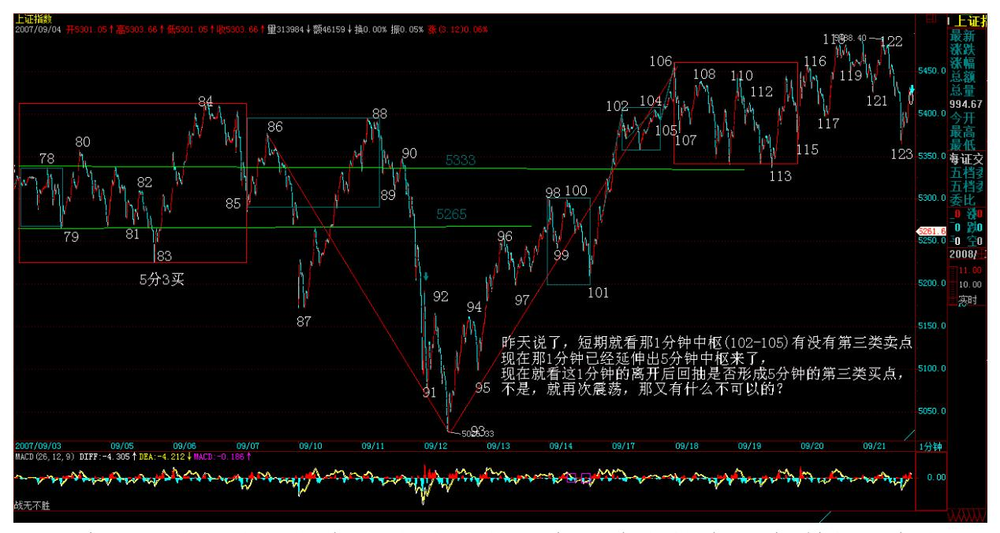

248 本 ID 欢迎市场的任何走势,包括今天晚上就有巨大利空。在市 场,就要等待接受一切,关键是你面对一切时,有没有应对一切的技 术与策略。今天可以回答问题到 4 点半。

#### \*\*\*\*\*\*\*\*\*\*\*\*\*\*\*\*\*\*\*\*。

16.网友 [匿名] 新浪网友: 缠姐,为什么没有对煤炭股建仓? 200709-20 15:48:13缠师:本 ID 也没对房地产进行建仓,本 ID 不 喜欢房地产商人的嘴脸,同样不喜欢煤炭里的血泪。难道不搞这些玩 意,本 ID 就没法活不成?

#### \*\*\*\*\*\*\*\*\*\*\*\*\*\*\*\*\*\*\*\*。

17. 网友缠中说禅技术基地: 哪天新浪不行了,缠主来论坛直播吧, 论坛收集了你全部文章。2007-09-20 15:45:38缠师:谢谢,祝你们顺 利。但瓜田李下,本 ID 还是要避点嫌疑。如果新浪没有了,那可能 就是缘分到此的信号了 。本 ID 希望新浪能地久天长,但谁又能保证 呢?

#### \*\*\*\*\*\*\*\*\*\*\*\*\*\*\*\*\*\*\*\*。

18. 网友全线飘红: 请问缠主,如果大盘不好,卧薪尝胆 3 个月左 右,刚开始表现的题材股们的剧本会否受大的影响?我摘果子的季节 到了,心理怕怕。

缠师:如果你只看短线,那当然压力大。如果从中长线看,谁又敢说 这个位置就高了?

#### \*\*\*\*\*\*\*\*\*\*\*\*\*\*\*\*\*\*\*\*\*。

19. 网友 [匿名] 新浪网友: 姐姐,同样是中字头,为何厚此薄彼 啊?737 好像是后妈的孩子? 2007-09-20 15:56:08缠师:有人在 13-14 元大量抢入,所以必须被洗。基本面没有任何问题。一直关注 该股的,一定记得在 13.99、13.49 元分别有大买盘,后来都给干 掉。可以告诉你,那些买盘不是庄家的。

\*\*\*\*\*\*\*\*\*\*\*\*\*\*\*\*\*\*\*\*。网友 [匿名] 新浪网友:缠姐好!77-79 课 更进一步地讲明了一些复杂线段的划分。但根据这几课内容,37-38 段的划分似乎又不符合规则了,缠姐能否对 37-38 段再深入讲解一 下?另外,81 课关于线段的内容出来后,32-33 的划分又产生矛盾。 32-33 和 81 课的两个图到底有何不同呢?2007-09-20 15:51:59缠 师:你自己根据定义来,有些划分不同,可能就是因为有些数据不同 造成的,所以,最新给了一个新的笔的定义来使得不同软件间数据差 异影响的减少。

#### \*\*\*\*\*\*\*\*\*\*\*\*\*\*\*\*\*\*\*\*。

21. 网友 [匿名] 新浪网友:老大,你前两天反复说,田亮的那一 跳,请给了明示。 为什么今天不说了,希望能回答?2007-09- 2015:54:08缠师:田亮不参加一米板?谁让你去预测什么?昨天最重 要一句没看到"如果不出第三卖点,咱就继续陪他游戏。"今天出第 三类卖点没有?请脑子里把预测两个字放掉,看图作业。

#### \*\*\*\*\*\*\*\*\*\*\*\*\*\*\*\*\*\*\*\*。

22. 网友 [匿名] 3408A: 妹妹,想听听您对北京现在房价后市的高 见,房市如股市。谢谢!2007-09-20 15:58:18缠师:没有下跌空间。 北京比起其他地方,房价已经一点不离谱了。

你去深圳、江浙地区看看。看完,你就知道北京房价怎么样了。

23. 网友 [匿名] 新浪网友: 请教缠主,多头这么凶猛,除了基金等 正规军,没有敢这么造次的吧?可是政策连正规军都指挥不了?是不 是太没水平了吗?2007-09-20 16:22:34缠师:谁告诉你现在做多的, 一定就是所谓的正规军?而且,正规军也还有分歧的。例如,对于中 金之流来说,他们肯定不希望大盘跌,否则他们那些红筹不用卖了?

### \*\*\*\*\*\*\*\*\*\*\*\*\*\*\*\*\*\*\*\*。24.

网友 [匿名] 爱黄金: 刘军洛说股市 2008 年要跌破 2000 点,黄金 要涨到 3000 美圆一盎司,房价更要涨上天,人民币要惨烈下跌。缠 主您觉得我们小老百姓该怎么办啊?2007-09-20 16:21:18缠师:世上 跳大神的,多了去了。鬼子来了,中国不依然中国?

#### \*\*\*\*\*\*\*\*\*\*\*\*\*\*\*\*\*\*\*\*。

25. 网友 [匿名] 藤: 缠主,有两个问题要请教你,等你等 N 久 了,昨天你来了,俺却没等着。(1)怎么能够在当下地准确判断一线 段的结束点,而不需等到下一线段反抽很远了才能确定?(2)为何有 的股票 1 分钟或 5 分钟底背了,而 30 分钟和日线上却没有买点, 但那个 1 分钟或 5 分钟的底背点却在 30分钟和日线上也成了个最低 点呢 ?老大,咋不回答俺的问题呢?等了 N 天问了 N 遍了。 200709-20 16:22:16缠师:用类背驰就可以判断,但最好不要用线段 操作,太短了。

#### \*\*\*\*\*\*\*\*\*\*\*\*\*\*\*\*\*\*\*\*。

26. 网友 [匿名] 股虱: 缠 MM 一再提示风险,是否可以用认姑权证 对冲?如南航认姑权证,但其无限量创设是否已没有对冲下跌的功 能?2007-09-20缠师:说实在,那不是好的对冲工具,但现在国内还 真没真正的对冲工具。对于散户来说,最好就是减低仓位,这样有什 么,都不怕了。

#### \*\*\*\*\*\*\*\*\*\*\*\*\*\*\*\*\*\*\*\*。

27. 网友 [匿名] 我心飞翔: 姐姐,我知道你很有耐心,可是我有问 题要问你。这里有这么多人看了你的文章就猜什么大利空消息啊,喝 了小二就猜什么小二有关的 PP 会涨啊,大风刮来利空啊什么的,你 看了会不会笑的肚子痛啊?你认为大家有没有必要产生联想啊?得快 点,不然你走了看不到问题了。2007-09-20 16:13:39缠师:开心就

好,但真用来操作,那就不好了。不过,有时候为了避嫌疑,本 ID 会说些隐晦的话,但都比较好懂,本 ID 已经不是说了,这里的人个 个冰雪聪明的。

28. 网友 [匿名] 大盘: 请问博主,对于次级别回跌形成 3 买,如 果次级别回跌过程中的次次级别有跌破本级中枢,但是次级别回跌结 束的端点没有跌破中枢,这能算 3 买吗?2007-09-20 16:32:18缠 师:临走回答一下,严格说不算,但属于一种可操作类型,可以看成 是次次级别的一个买点后的第二买点之类的东西。再见。

关于博客的一些问题(2007-09-20 19:55:37)这里,人越来越多,最近 一直都保持每天 6-8 万左右的浏览量,证明这里已经不单是本 ID 一 个人的园子了,所以,有些事情,还是想和各位商量一下:一、有人 觉得下午的解盘用红色看起来不舒服,但用黑色、绿色,又有人觉得 不吉利,所以,各位看有没有更好的,本 ID 是无所谓的。

二、有网友在 http://www.chzhshch.net/开了缠中说禅技术分析网 站,本 ID 刚去看了一眼,已经有快 4000 人注册。因此,本 ID 不 得不表明态度。首先,本 ID 不反对任何非赢利性质的类似网站,因 为,如果有一个更好的平台讨论技术问题,也有利于形成一种共同提 高;其次,瓜田李下,本 ID 不会介入类似网站的任何事情;最后, 无论是这里还是网站,都只是一种辅助,最终得力处,都要落实到自 己,这才是最关键的地方。

三、由于这里的图上传量太少,所以每天的分段都上来,这样很快就 没空间了。看到有人建议用时间(标号)的方法,本 ID 觉得可行, 以后没什么特别,就用这个方法,但每周都至少上传一次图。

四、本 ID 这里是开放,谁来、说什么都可以,如果这里能让你发泄 一下不良情绪,从而身心健康,那也是很好的事情。所以,来这里各 取所需,没必要无聊争吵。争吵有伤身体,没必要。当然,如果觉得 吵架很爽,吵完以后神功大增,可以腾云驾雾而起,那就继续,本 ID 没意见的。

五、有人似乎很关心本 ID 的私人问题,这没什么,人都有好奇心。

本 ID 是谁,以后谁都知道,当然也就自然知道了。不过,以后知道 了,可能博客缘分就到此,那可能就是另一种缘分了。缘聚缘散,各

自了却就是。

六、今天下午,本 ID 只是用具体的例子告诉各位预测的无聊。决不 是告诉各位,明天就一定要红旗满天飞了,一切都要养成看图操作的 习惯。听说,某些预测者已经在反口了,其实,这是最无能的一种。 例如,用时间之窗预测,还有一个窗口打开、关闭的问题,正负三 天,都在其中。站在纯分析的角度,现在无非就是:一、昨天的田亮 一米板已经应了该时间之窗;二、后三天才是关键所在。但站在本 ID 理论的角度,这一切都无须预测,让市场告诉你就是。

如果真说节气的影响,一般中秋前后,都容易有震荡,最出名的,就 是 94 年那次,大概都是月亮惹的祸。这一切,只能作为参考,没必 要当真,关键还是图形的信号。

一句话,涨了想卖点;跌了想买点,这才是正确的节奏。今天就不写 什么了,看球去,再见。

迷踪步舞乱多空头(2007-09-21 16:07:38)看了一下,似乎喜欢红色的 多一点,那么本 ID 就稍微改进一下,不加粗,且放大字号,这样, 觉得刺眼的博友可能会舒服点。另外,将重点加粗,这样也清楚点。

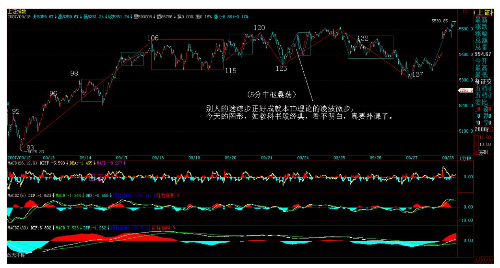

在一般人眼里,主力杀人,似乎就如同无聊股评所说的所谓多空之 争。但可以明确告诉各位,真正牛的主力,是多空齐杀,让所有人左 右挨巴掌。不明白这个道理,股票是白干了。

别人的迷踪步正好成就本 ID 理论的凌波微步,今天的图形,如教科 书般经典,看不明白,真要补课了。

254 但是,必须明确,目前的形势十分严峻,对于技术不好又迷恋短 线的,现在的走势就是典型的绞肉行情。

请记住本 ID 一句话:在中国,最后的胜利者一定是政策。因为有技 术,所以我们可以在刀锋上凌波微步,但是刀锋依然是刀锋。现在的 政策信号已经足够频繁,如果如此大力的密集新股发行都不能平息资 金的冲动,那么,更严厉的政策一定会出来。

现在,有人说,公募基金牛,有最大的做多冲动,没人管得了。真是 典型的幼稚想法,一个基金黑幕就可以打跨他们,难道他们的头不受 党纪国法管吗?难道不可以派调查组下去调查调查吗?现在为业绩以 及自己的老鼠仓疯狂的所谓公募们,你们连孙悟空都不是,还想逃出 掌心?可笑!所以,刀锋就是刀锋,虽然这个游戏,我们无所畏惧, 但一定要有一根弦紧绷着,对政策的动向,1000%地密切关注。而对于 一般的投资者,必须要适当控制好仓位,没那技术的,就把均线看 好。

下周,关键是能否破本周的顶,如果不行,大盘就会走出小的头肩 顶,后面的震荡就会很大。而且,中秋前后,人心浮动,震荡少不 了,现在的问题,不是多空的问题,而是不要左右挨巴掌的问题。记 住:不多空通杀的,没资格当主力。

对于个股,本 ID 说的那 10 几只股票,对于散户来说,如果你作为 股票池进行不断的换股操作,你想想你的收益有多少?难道不记得本 ID 说过在里面资金不断流动的概念?你看看那十几只股票,此起彼 伏,有哪天闲着的,用本 ID 的理论,难道在 10 几只里找卖点买点 都很难?不要这几天 000099 涨了,才问能不能介入,这是节奏吗? 还有,对股票不要有感情,本 ID 反复说,散户最大效率的就是不断 换股,卖点卖了,一定要等买点,等的时候就去找别的有买点的,如 果有时间,你把本ID 那 10 几股票比较一下,感受一下那此起彼伏的 节奏,大概你的操作水平就会有更大的提高。

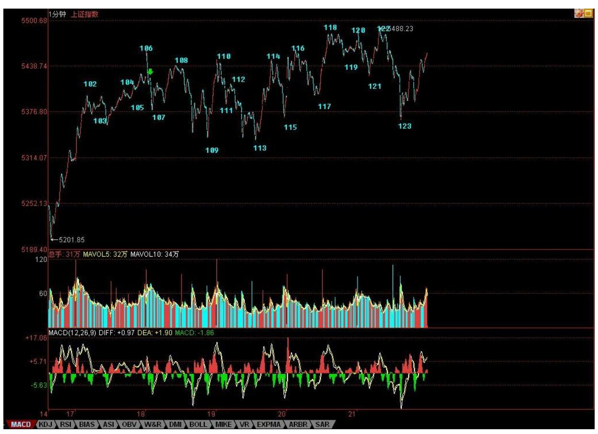

这里的公众场所,本 ID 的言论必须符合法律的要求。但本 ID 已经 尽量告诉各位节奏了,请问,前几天,本 ID 在最高位时,不是告诉 你小安子的剧本如何如何了吗?其他股票,有了顶分型,而且还跌破5 日线,那么不等到底分型出现,你管他干什么?还有人不断问,636怎 么样?一个连半年线都没站住的股票,是散户买的吗?大资金可以在 里面打架,散户有必要陪着浪费时间吗?等打完了,图形走好了,自 然就动了,这样,关注着,但先去操作别的股票,不更节约时间、提 高效率吗?有时候,本 ID 都为各位着急,为什么这个节奏这么难把 握呢?应该很简单的啊。

256 "港股直通车"难以背负的使命(2007-09-24 08:52:17)最近, "港股直通车"试点吸引广大投资者眼球。随着中国资本市场大发 展,中国投资者参与世界上任何资本市场的途径都将越来越便利,个 人直接参与港股投资只是一个小序曲。现实问题在于,这本来极为正 常的"港股直通车",却有意无意中背负了一个本不该背负的调控使 命,通过"港股直通车"使 A 股软着路竟成了一剂调控妙药。

据说,这剂妙药还能治好流动性过剩,是解决流动性过剩以及股市泡 沫的一箭双雕之举。

所有把"港股直通车"炼成包治百病妙药的妙论,都离不开如下假 设:在 A 股与港股同时上市的股票存在巨大价格落差是不合理的。而 事实上,这只是一个并不高明的误读。该误读,不过建立在这样一个 错误认识上,例如以中国人寿为例,无论在 A 股还是港股交易,都是 同一公司,因此,其每股价格应该一致。但南橘北枳,在市场中能评 估的,只能是交易的价值,这是由市场中的众多因素合力而成。A 股 的中国人寿到了港股,就有不同的价格,这反而是最正常不过的事 情。

不妨用一个最简单的模型来评估不同市场中同一品种的交易价值:用 在市场中交易的流通总市值代表同一公司,相应地,可以以不同市场 中同一品种的总流通市值必须相等来建立相应的价值分析模型。

例如,对于同在 A 股与港股中交易的中国人寿,就有 A 股价格 XA 股流通量=港股价格 X 港股流通量。目前,中国人寿的 A 股流通量只 有港股流通量的五分之一,因此,即使 A 股价格是港股价格的 5倍, 也并没有任何不合理的地方。而事实上,两者之间的差价连 1 倍都不 到。

从另一个方面看,港币的币值由于和美圆挂钩,在人民币升值的大背 景下,港币资产自然没有人民币资产保值,而港币的利率比人民币高 多了,其能接受的合理市盈率自然要比 A 股低得多,因此同一品种在 A 股比在港股里得到高得多的交易价值是极端合理的。

由此可见,那种认为同一股票就该在全世界的任何地方都以同一价格 买卖的想法无比幼稚可笑。可以断言,即使是同一群交易者,在不同 的市场中交易同一品种,其交易价格也不可能相同。例如,面对流通 量大五倍以上的港股中的中国人寿,其价格,即使是同一群人在交 易,显然要远低于在 A 股中的价格。因此,那种以为有了"港股直通 车"就可以拉平两地股票价格的幼稚想法极端可笑。除非把 A 股和港 股间的所有基础市场变量都完全调节成基本相同,否则,这背负调控 使命的"港股直通车"注定不能直通向其使命所指定的方向。

其实,A 股的结症异常明显,根本无须任何形式的直通车就能解决。

在上面的模型分析里,只要把港股变成调控达标的 A 股,那么在这调 控达标的 A 股中,希望其股票价格在一个更合理、更低市盈率的环境 下交易,最简单的方法就是把流通量加大。例如,现在只有 15 亿 A 股流通量的中国人寿,如果变成 75亿,其交易价格显然就不可能如现 在一样。

问题的关键还在于,目前被大规模拉抬的所谓漂亮 50 或大盘蓝筹, 站在证券法的角度,都有违法的嫌疑。证券法规定"公司股本总额超 过人民币四亿元的,公开发行股份的比例为百分之十以上" ,这样, 中国人寿的 A 股流通量应该在 28 亿以上,而不是目前包括还未上市 战略配售在内的 15 亿。这在所有大盘蓝筹中,都是一个普遍的现 象,这恰好是目前一线蓝筹能被轻易泡沫化的一个不可忽视的因素。

没有合理的流通量,就没有合理的价格。目前,蓝筹供应不足问题的 解决就应先从严格执行证券法开始,让公开发行股份比例达到百分之 十以上标准。有人可能要说,公开发行股份还包括 H 股。如果是这 样,那么该条款就有修正的必要,应明确修正为在 A 股的公开发行股 份比例都必须在百分之十以上。否则,新的超低流通量蓝筹的上市只 会让市场又多了能提供杠杆投机的品种,在股指期货迫在眉睫的今 天,这点犹为重要。

站在资本市场历史发展的角度,目前国内的资金不是太多,而是太少 了。这些宝贵的资金,更应该留在 A 股中,不能雨季怨水多、旱季怨 水小,那么还要水库干什么?中国的资本市场如果蓄水功能不强,不 能怪水,而是要怪水库修得还不够合格,因此就应该想方设法尽快把 水库修得能够满足经济发展的需要,这才是实事和正事。否则,一味 把水引到外面去解一时之急,这种病急乱投医所求回来的药,能成妙 药的可能确实太渺茫了。

震荡前行、多空齐杀(2007-09-24 15:26:30)最近的行情,估计对绝大 多数的人都极为困难,不过,不难发现,本ID 那些股票已经越来越像 喝了水井坊一样。中字头、题材股,两个翅膀,所以能翱翔到现在。 在目前这样一个震荡前行、多空齐杀的行情中,有这样的节奏,就是 刀锋上的凌波微步了。

那些大海龟,从明天开始,陆续回来了,当然,承销的、摇旗的,都 要护着点。以前看不出本 ID3600 点接石头的妙用,现在也应该明白

了。至于联通之类的,等于一个抢劫,你承销中移动的,有本事就别 抬联通,有本事就别送钱给本 ID,本 ID 就是收路费的。

当然,这些都是对大资金说的,小资金,一般都可以不管这些大家 伙,在题材股上折腾,不是更好玩?600078,请好好研究 15、5、1之 类的图,看看那区间套是多么教科书。还是那句话,跌的时候,要想 买点,涨的时候,要想卖点,这才是搞股票的,否则是被股票搞的。

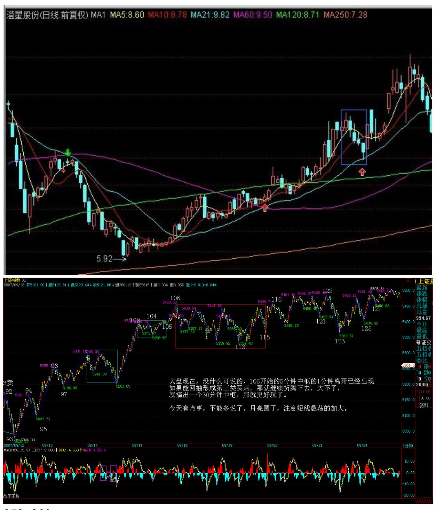

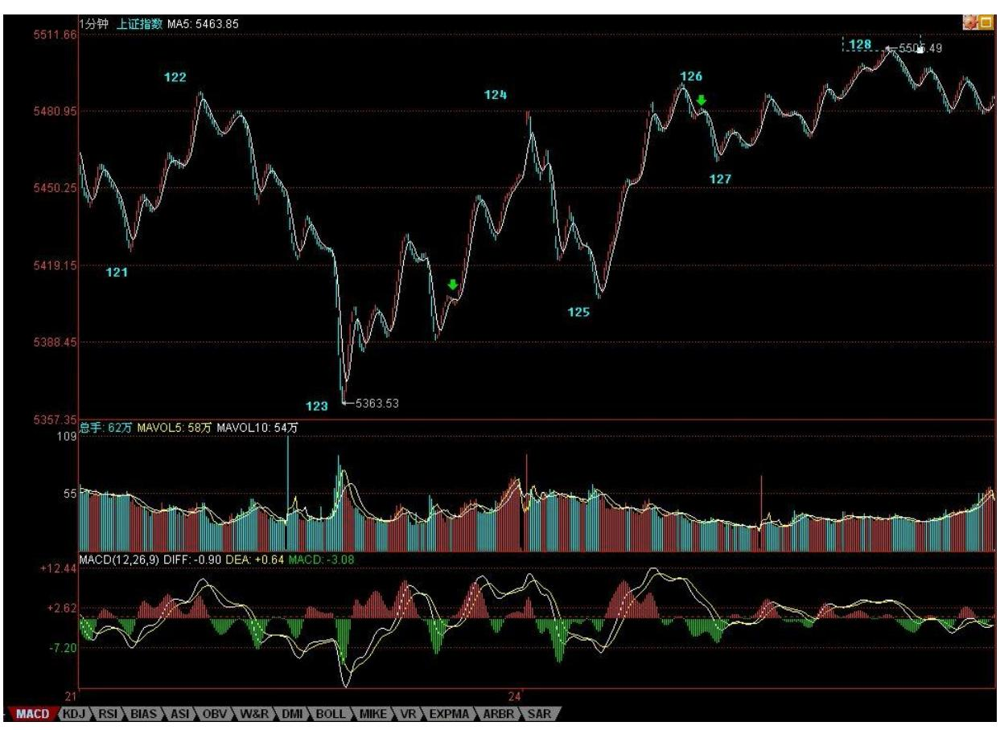

大盘现在,没什么可说的,106 开始的 5 分钟中枢的 1 分钟离开已 经出现,如果能回抽形成第三类买点,那就继续折腾下去,大不了, 就搞出一个 30 分钟中枢,那就更好玩了。今天有点事,不能多说 了。月亮圆了,注意短线震荡的加大。

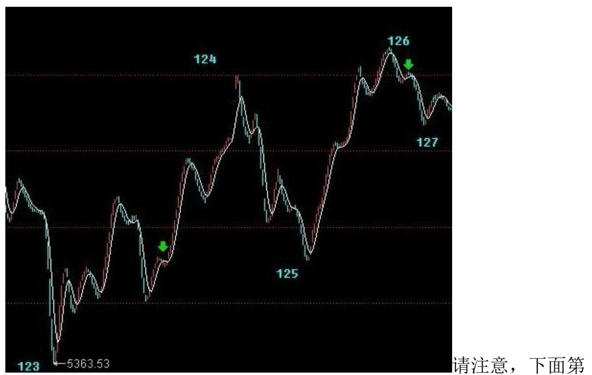

一个绿箭头处不是笔,为什么?因为顶分型都在底分型下面了,怎么 可能?而第二箭头处就是标准是按最新标准的笔了.(娇注:禅师的原

图意思为底分型的第二元素在顶分型第一元素里。指分型区间)262

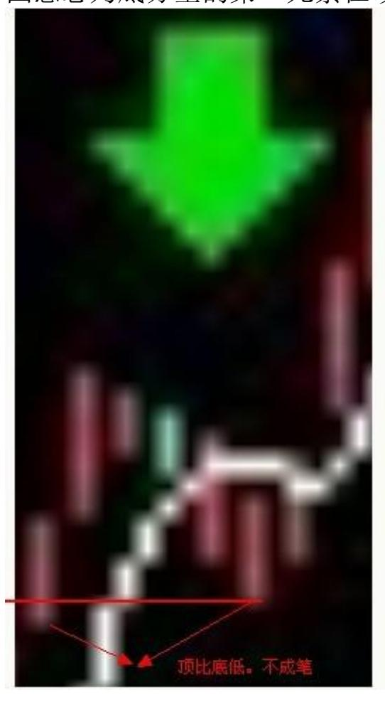
