教你炒股票 82:分型结构的心理因素

(2007-09-24 21:31:06)走势反映的是人的贪嗔痴疑慢,如果你能通过 走势当下的呈现,而观照其中参与的心理呈现,就等于看穿了市场参 与者的内心。心理,不是虚无飘渺的,最终必然要留下痕迹,也就是 市场走势本身。而一些具有自相似性的结构,就正好是窥测市场心理 的科学仪器。

注意,分型不是分形,分形理论,是数学的一个分支,有人用这分支 的一些研究成果硬套到市场走势上,得出来的结论,没有太大意义。

本 ID 理论的逻辑,是直接来源于市场走势本身,而不是一个先验 的,市场之外的数学理论。至于这现实的市场逻辑显现出数学理论的 结构,那是另一回事情。

世界,本来就是数学的。但本 ID 的理论,不是任何原有数学理论的 应用,而是市场本身现实逻辑的直接显现,这是一个极为关键的区 别。

显然,一个顶分型之所以成立,是卖的分力最终战胜了买的分力,而 其中,买的分力有三次的努力,而卖的分力,有三次的阻击。用最标 准的已经过包含处理的三 K 线模型:第一根 K 线的高点,被卖分力 阻击后,出现回落,这个回落,出现在第一根 K 线的上影部分或者第 二根 K 线的下影部分,而在第二根K 线,出现一个更高的高点,但这 个高点,显然与第一根 K 线的高点中出现的买的分力,一定在小级别 上出现力度背驰,从而至少制造了第二根 K 线的上影部分。最后,第 三根 K 线,会再次继续一次买的分力的攻击,但这个攻击,完全被卖 的分力击败,从而不能成为一个新高点,在小级别上,大致出现一种 第二类卖点的走势。

由上可见,一个分型结构的出现,如同中枢,都是经过一个三次的反 复心理较量过程,只是中枢用的是三个次级别。所谓一而再、再而 三,三而竭,所以一个顶分型就这样出现了,而底分型的情况,反过 来就是。

现在,我们可以深入分析这三根 K 线的不同情况。首先,一个完全没 有包含关系的分型结构,意味着市场双方都是直截了当,没有太多犹 豫。包含关系(只要不是直接把阳线以长阴线吃掉)意味着一种犹

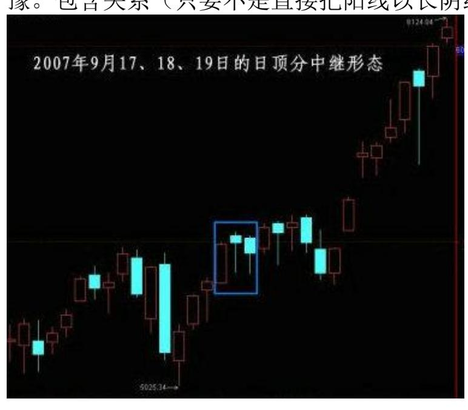

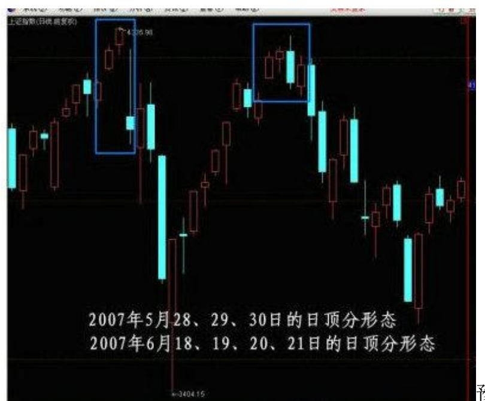

豫,一种不确定的观望 等,一般在小级别上,都会有中枢延伸、扩展之类的东西。其次,还 是用没有包含关系的顶分型为例子。如果第一K 线是一长阳线,而第 二、三都是小阴、小阳,那么这个分型结构的意义就不大了,在小级 别上,一定显现出小级别中枢上移后小级别新中枢的形成,一般来 说,这种顶分型,成为真正顶的可能性很小,绝大多数都是中继的。 例如,上海日线 9 月 17、18、19 这三根 K 线组成的顶分型结构。

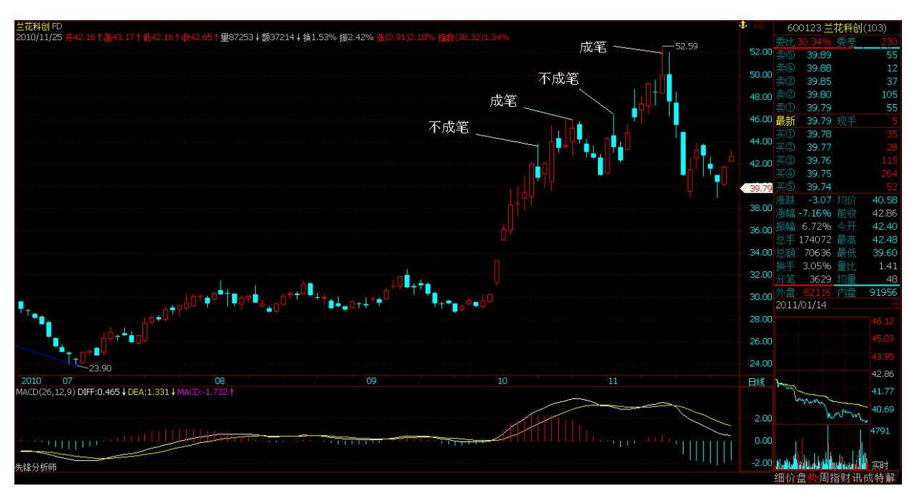

但,如果第二根 K 线是长上影甚至就是直接的长阴,而第三根 K 线

不能以阳线收在第二根 K 线区间的一半之上,那么该顶分型的力度就 比较大,最终要延续成笔的可能性就极大了。例如上海日线 6 月 18、19、20、21,里面有一个包含关系,但这包含关系是直接把阳线 以长阴线吃掉,是最坏的一种包含关系。

一般来说,非包含关系处理后的顶分型中,第三根 K 线如果跌破第一 根 K 线的底而且不能高收到第一根 K 线区间的一半之上,属于最弱 的一种,也就是说这顶分型有着较强的杀伤力。例如上海日线 5 月 28、29、30。(娇注:上涨中底分能否延续成笔观察分型 3 元素反 之。)267

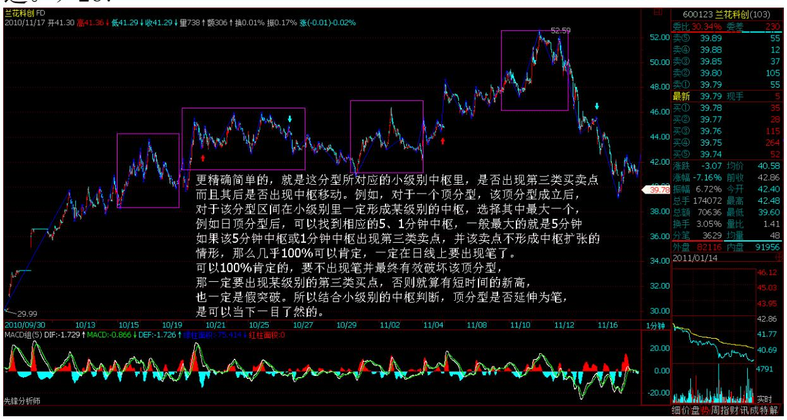

268 分型形成后,无非两种结构:一、成为中继型的,最终不延续成 笔;二、延续成笔。对于后一种,那是最理想的,例如在日线上操作 完,就等着相反的分型出来再操作了,中间可以去宠幸别的面首,这 是效率最高的。而对于第一种情况,前面说过,可以看是否有效突破 5 周期的均线,例如对日线上的顶分型,是否有效跌破 5 日均线,就 是一个判断顶分型类似走势很好的操作依据。

不过,还有更精确简单的,就是这分型所对应的小级别中枢里,是否 出现第三类买卖点,而且其后是否出现中枢移动。例如,对于一个顶 分型,该顶分型成立后,对于该分型区间在小级别里一定形成某级别 的中枢,选择其中最大一个,例如日顶分型后,可以找到相应的 5、1 分钟中枢,一般最大的就是 5 分钟,30 分钟没可能,因为时间不 够。如果该 5 分钟中枢或 1 分钟中枢出现第三类卖点,并该卖点不

形成中枢扩张的情形,那么几乎 100%可以肯定,一定在日线上要出现 笔了。

可以 100%肯定的,要不出现笔并最终有效破坏该顶分型,那一定要出 现某级别的第三类买点,否则就算有短时间的新高,也一定是假突 破。所以结合小级别的中枢判断,顶分型是否延伸为笔,是可以当下 一目了然的。 如果你能有效地分辨中继分型,那么你的操作就会有大 的进步。

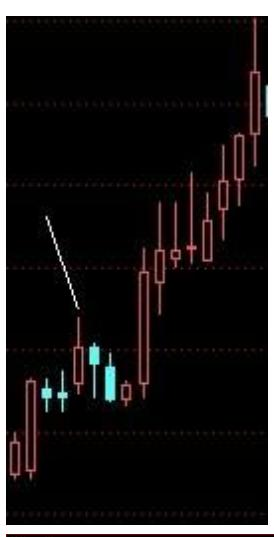

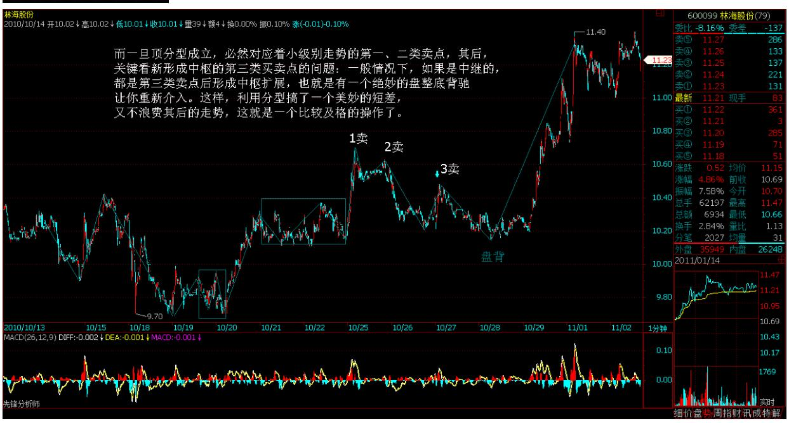

一般来说,可以把分型与小级别走势类型结合操作,例如日线与 5 分 钟的。如果一个小级别的中枢震荡中连日 K 线都没出现顶分型结构, 那么,这个中枢震荡就没必要走了,后者就算打短差也要控制好数

量,因为,没有分型,就意味着走势没结束,随时新高,你急什么? 而一旦顶分型成立,必然对应着小级别走势的第一、二类卖点,其 后,关键看新形成中枢的第三类买卖点的问题:一般情况下,如果是 中继的,都是第三类卖点后(娇注:3 卖后盘背)形成中枢扩展,也就 是有一个绝妙的盘整底背驰让你重新介入。这样,利用分型搞了一个 美妙的短差,又不浪费其后的走势,这就是一个比较及格的操作了。

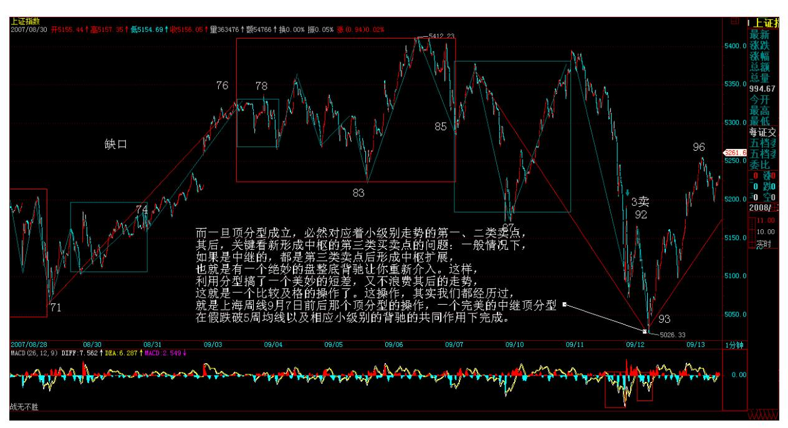

这操作,其实我们都经历过,就是上海周线 9 月 7 日前后那个顶分 型的操作,一个完美的中继顶分型,在假跌破 5 周均线以及相应小级 别的背驰的共同作用下完成。

注意,利用分型,例如顶分型,卖了以后一定要注意是否要回补,如 果一旦确认是中继的,应该回补,否则就等着笔完成再说。但一定要 注意,中继顶分型后,如果其后的走势在相应小级别出现背驰或盘整 背驰,那么下一顶分型,是中继的可能性将大幅度减少。中继分型, 有点类似刹车,一次不一定完全刹住,但第一刹车后如果车速已明显 减慢,证明刹车系统是有效的,那么第二次刹住的机会就极大了,除 非你踩错,一脚到油门上去了。

都是月亮惹的祸(附录七古:中秋见月)(2007-09-25 15:49:49)从上 周就开始告诉各位,月儿圆,有震荡,昨天最后一句还特别强调"月 亮圆了,注意短线震荡的加大",因此,对今天的震荡,如果还把握 不住,那只能证明,你确实不适宜短线操作,那就中线点,无所谓

的。中线上,大盘的压力越来越大,如果不是有人为了新股护盘,今 天可不止跌这么点。

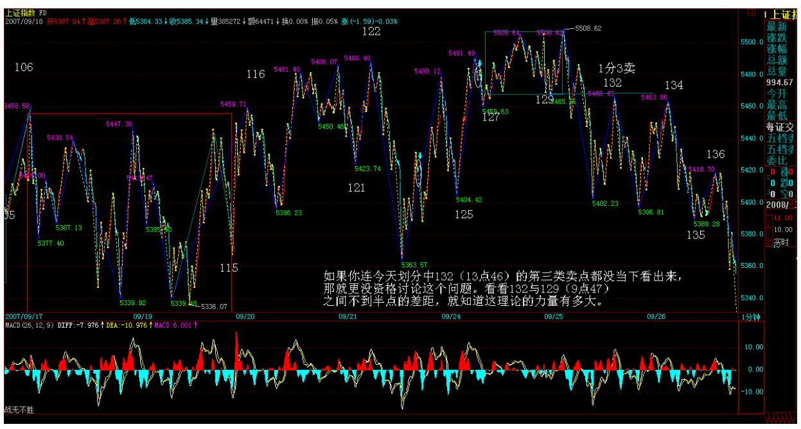

至于本 ID 的理论有没有用,这个问题根本无须讨论,如果你连今天 划分中 132(13 点 46)的第三类卖点都没当下看出来,那就更没资 格讨论这个问题。看看 132 与 129(9 点 47)之间不到半点的差 距,就知道这理论的力量有多大。

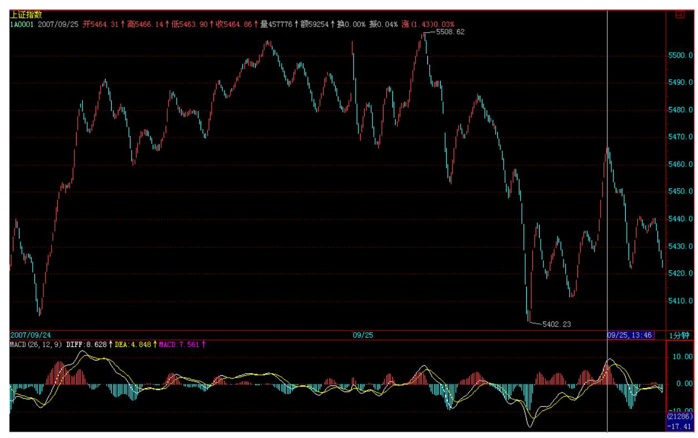

现在的人都很奇怪,似乎全世界的人都欠了他的,你考不上北大,那 一定是老师的错,老师欠了你的。你学不会几何,那几何肯定错了, 就如同今晚的月亮,都是他的错。本 ID 对这套逻辑从来没兴趣搭 理,本 ID 又不是卖月饼的,过了今晚,本 ID 的理论依然框架着所 有的股票走势,就如同三角形之和 180度框架着欧几里德平面上的图 形。

个股方面,说句梦话,千万别信:可以开始关注两只股票 600319、 000822,这都是基本面上有可能出现重大变化的。不过必须声明:由 于目前大盘的位置十分危险,对个股的介入,一定要在大级别的买卖 点。有些股票,如果技术好的,可以不断震荡减低成本去介入,例如 600078。毕竟现在不是 3000 点,1000 点,没有什么便宜的价位了, 如果成本没本事降下来,最好就什么都别介入,等大盘暴跌再说。如 果有那本事,那就无所谓了。

无聊的股票,就不说了,这里有本 ID 的七古旧作一首,祝各位中秋 好。补充一句,如果连平水韵都没搞明白,就不要批评本 ID 的韵不 对了,本 ID 的七古都从来不借邻韵,别说律诗了。

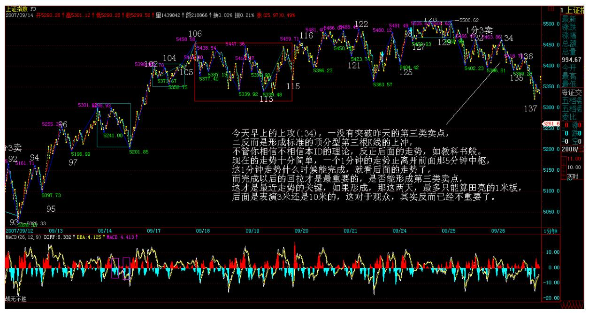

可以不相信月饼,但一定要相信月亮(2007-09-26 15:56:37)月亮的力 量有多大,各位这两天也见识了。可以不相信月饼,但一定要相信月 亮。为什么?连地球上的潮汐都要抄袭月亮,那破股票难道比潮汐还 要潮汐?昨天已经明确告诉"如果不是有人为了新股护盘,今天可不 止跌这么点",昨天没跌够,今天继续,就这么简单。

今天早上的上攻,一没有突破昨天的第三类卖点,(娇:3 卖后盘背能 否逆转成中继分型还得看有无 3 买)二反而是形成标准的顶分型第三 根 K 线的上冲,不管你相信不相信本 ID 的理论,反正后面的走势, 如教科书般。现在的走势十分简单,一个 1 分钟的走势正离开前面那 5 分钟中枢,这 1 分钟走势什么时候能完成,就看后面的走势了,而 完成以后的回拉才是最重要的,是否能形成第三类卖点,这才是最近 走势的关键,如果形成,那这两天,最多只能算田亮的 1 米板,后面 是表演 3 米还是 10 米的,这对于观众,其实反而已经不重要了。

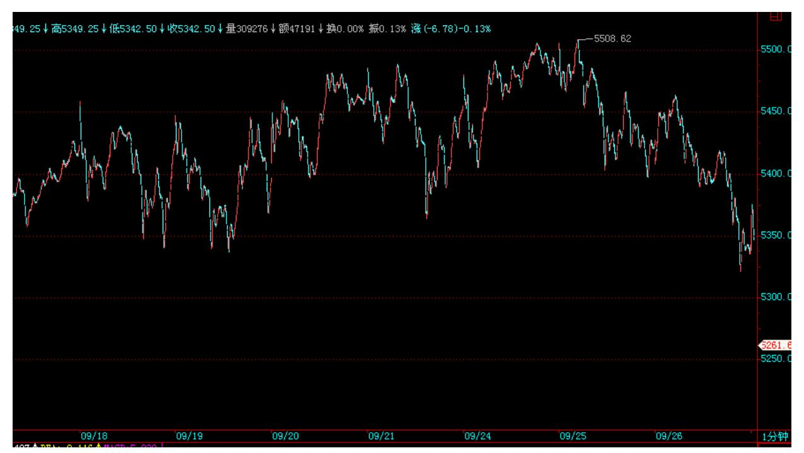

个股方面,今天水井坊终于像水井坊应该那样水井坊了一把,看看这 股票,就知道什么叫折腾。几乎一年,就在这里搞,为什么?就是因 为里面有着 N 伙人,还都看好,所以就互相折腾,这次是真是假?天 知道。为什么?因为后面谁只要一先动手,N 方又一起开始折腾。其 实,这个游戏很好玩,只是浪费了一只质地如此好的股票。

不过,好股票最终都要发光的。就像 000999,从本 ID 在这里开始讲 到现在,快 10 个月了,开始 6 元抢东西,然后在 12 元上下和汉奸 基金的斗法,后来又涌入一群无聊人在 15 元上,东搞西搞,中间传 闻漫天飞,结果怎么样?请看看新进来的大股东掏了多少钱,一个掏 了这么多钱的人,要干什么大事,难道还有什么疑问?本 ID 反复说 要海枯石烂,但真正干起来,估计很多人就会被市场的波动所迷惑 了。

每一只股票,都是一个故事,说不完。做完一只股票,你就成了有故 事的人了。

再次提醒,昨天说那两只股票,如果大盘有大问题,也会跟着调整 的,但由于基本面上潜在大变化,所以市场如果大波动,将提供一个 好的介入时机。本ID 说的股票,从来都是中长线角度的,有足够的时 间让你介入,关键是看好买卖点。今天可以回答问题到 4 点半。

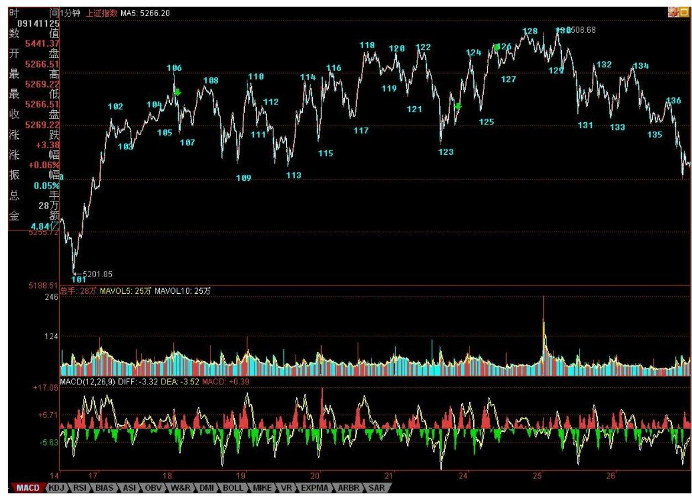

280

\*\*\*\*\*\*\*\*\*\*\*\*\*\*\*\*\*\*\*\*。

解盘及互动问答:

#### \*\*\*\*\*\*\*\*\*\*\*\*\*\*\*\*\*\*\*\*。

1. 网友[匿名] 月儿:缠泽天下!我今天买了 600319!听缠姑娘的 话!2007-09-26 15:59:37缠师:不是听本 ID 的话,而是要看图,有 卖点先卖,有买点再回补,这样才能把成本降下来。注意,现在介入 股票,和 1000 点时候不同,如果能动态就要动态,否则大盘一旦有 大波动,谁都不能保证,一定有人给你举杠铃。

#### \*\*\*\*\*\*\*\*\*\*\*\*\*\*\*\*\*\*\*\*。

2. 网友[匿名] 小小: 妹妹的 432 过百啦。妹妹踹轿子的时候一定 不能过猛啊! 2007-09-26 16:01:36缠师:很好,现在还能拿着。从

20 元能拿到现在的,估计也凤毛麟角了。这股票,中长线潜力还在, 当然,短线如果大盘特别恶劣,会有影响。

#### \*\*\*\*\*\*\*\*\*\*\*\*\*\*\*\*\*\*\*\*。

3. 网友绿幽灵: 缠好!中枢虽然看得懂了,但是运用起来一点也不 着边际。唉。还有一个,明明看起来是背驰了,买进却又再跌,为啥 呢?缠师:请首先要确定你的明明是正确的,事实上,很多所谓明明 的背驰,根本就不是。很多人,连中枢、走势类型、级别都没搞清 楚,就分析背驰,这有可能准确吗?

#### \*\*\*\*\*\*\*\*\*\*\*\*\*\*\*\*\*\*\*\*。

4. 网友[匿名] 新浪网友: 缠子,在看高级别 K 线图时,是应该把 低级别图上的分段转过去,还是重新分笔找线段?有时候这两种做法 的分段,是不一致的。2007-09-26 16:07:25缠师:为什么要一致?低 级图上用中枢、走势类型。高级图上用分型,线段,等于有两套有用 的工具去分析同一走势,这是天大的好事。

#### \*\*\*\*\*\*\*\*\*\*\*\*\*\*\*\*\*\*\*\*。

5. 网友 [匿名] 新浪网友: LZ 老师,000822 是不是有外资注入? 2007-09-26 16:08:04缠师:本 ID 不是上市公司,不能发布任何消 息,请原谅。

#### \*\*\*\*\*\*\*\*\*\*\*\*\*\*\*\*\*\*\*\*。

6. 网友 [匿名] 空言: 相信月亮,是不是每到农历十五前就清仓 啊?2007-09-26 16:10:47缠师:哪里有这么机械的,但如果月亮还带 上一个背驰、分型之类的东西,那当然就有效了。月亮只是借了太阳 的光辉,本 ID 理论所框架的东西,才是太阳。

#### \*\*\*\*\*\*\*\*\*\*\*\*\*\*\*\*\*\*\*\*。

7. 网友 [匿名] 新浪网友: 是不是买高价股更安全,尤其是上百元 的?2007-09-26 16:14:11缠师:只能说,高价的,散户都走了,杠铃 举起来轻松点。但如果特别大的调整,谁都不会硬抗,除非脑子有 水。

8. 网友 [匿名] 50 年以前: 老师好,对今天线段划分有疑问,1346 上去那一段并没有破坏 130 向下段的最后一笔,所以我觉得不应该单

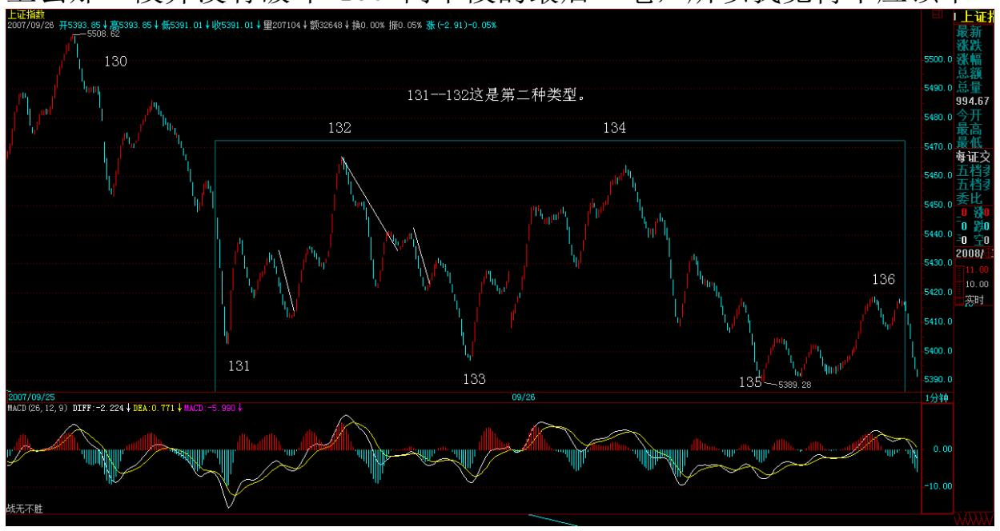

独画成一段,也就是 131 段应该是图上的 133 的位置,请老师明 示。2007-09-26 16:15:47缠师:这是第二种类型。

283 9. 网友 [匿名] 新浪网友: 不知 636 年线会否有支撑。持有三 个月了。2007-09-2616:16:14缠师:这种思维要不得,不要考虑什么 支撑位置。看图形本身。而且,本 ID 不是一早说过,连半年线都没 上,散户没必要参与。但这股票,中长线肯定是好股票,不过,最近 和水井坊前期一样,进入一个怪圈。

#### \*\*\*\*\*\*\*\*\*\*\*\*\*\*\*\*\*\*\*\*。

10. 网友 [匿名] 新浪网友: 请问缠主,对建行的定价怎么看?谢 谢!2007-09-26 16:19:31缠师:本 ID 只看走势,不看定价。

#### \*\*\*\*\*\*\*\*\*\*\*\*\*\*\*\*\*\*\*\*。

11. 网友 [匿名] 夜雨: 三九的走势就是教科书现场版,从去年到今 年的走势是一部还未完成的作品,跟 000858 从 2006 年初到现在的 走势都是主流资金的作品,他们有参照作用。这样的公告,早在主力 的意料之中,昨天有几人会在前几天卖了之后买回来呢?一般人,都

会想今天确认了再买的,可再也不给机会了。所以我们能做的就是持 有,逢低加仓。

说实话,三九我是从年前 10 元买入的,但仓位很少。到 530 低点加 仓,四个月盘整中,有钱赚了,我就加一些,这一次 18 元加仓, 21.5 元再加仓。现在已经是最初投入的 10 倍了。自己认为,陪同他 一路走来。是一次成功的操作了,对意志,对持股,对技术,都得到 很大的提高。谢谢姐姐,送给我最好的中秋节礼物,能对我在 999 的 操作,发一朵大红花吗?2007-09-26 16:07:59缠师:当然可以,大红 花。成功操作一只股票,就是对自己心态最好的锻炼。其实,每一只 股票的故事都大同小异,就如同每一个故事,归根结底,都只是故事 般平常。

\*\*\*\*\*\*\*\*\*\*\*\*\*\*\*\*\*\*\*\*12. 网友年年一变三: 请问缠主,这几天钢铁 板块已经调整得比较厉害了,若再碰到大盘跳水,它能独善其身吗? 盼复!谢谢!2007-09-26 16:25:28缠师:涉及预测的问题,本 ID 都 没兴趣。应该培养这样的习惯,就是你的眼光,只投向有买点的股 票。股票这面首想被宠幸,这很简单,用买点来搔首弄姿就可以。 2007-09-26 16:29:45286
