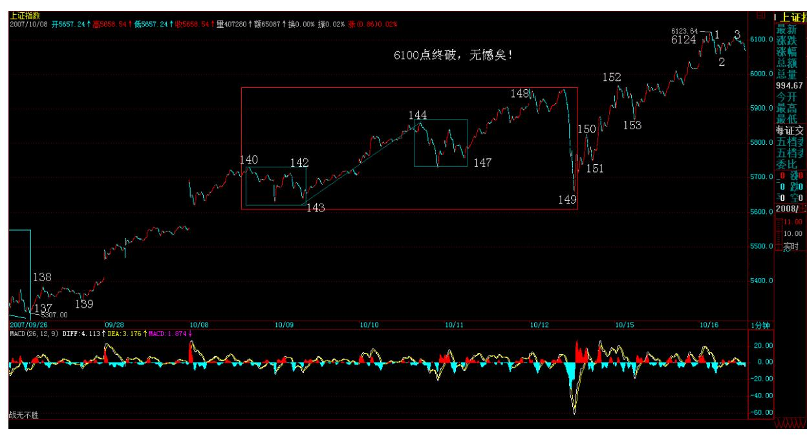
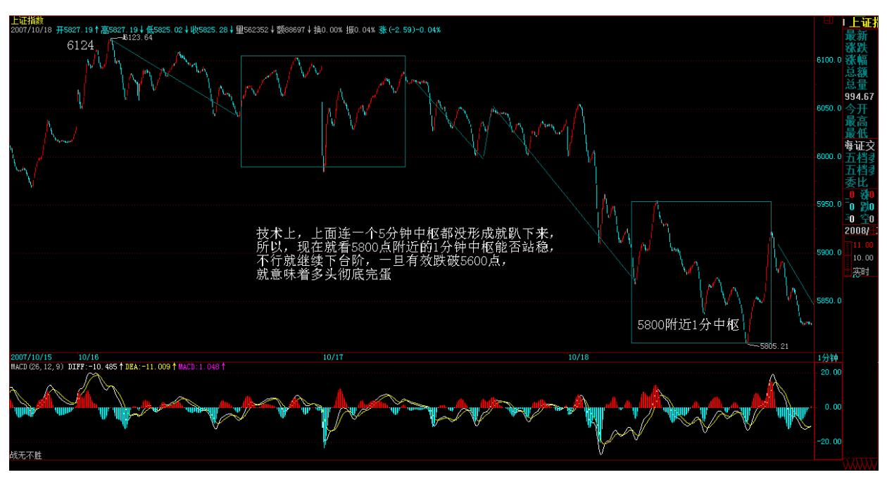
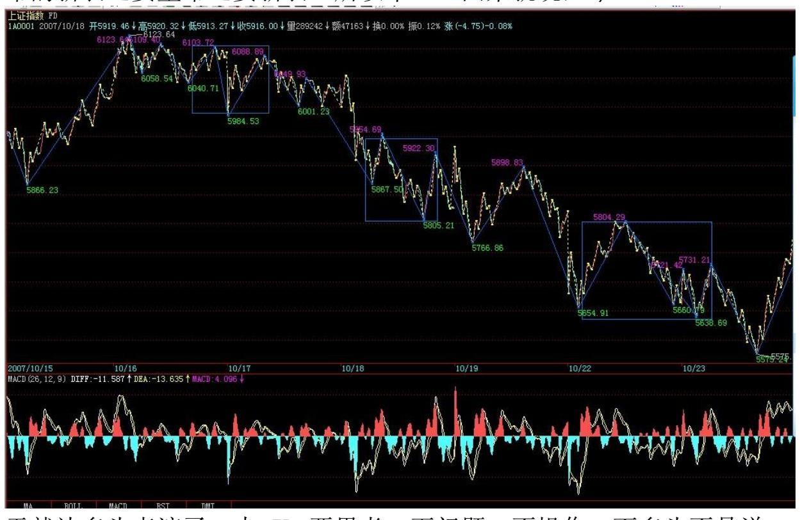
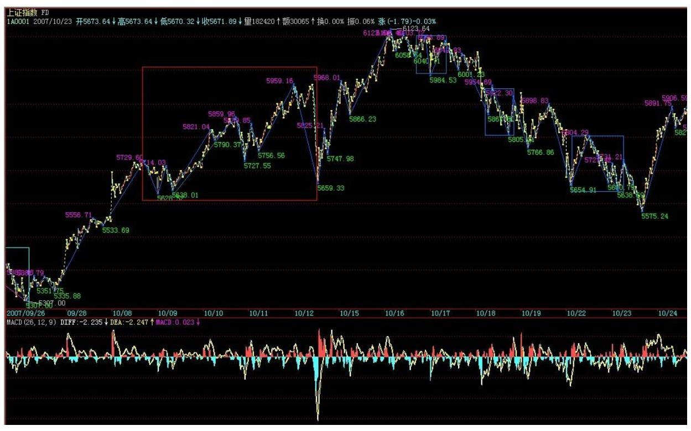

教你炒股票 84:本 ID 理论一些必须注意的问题320 成老先生,请慎 言(2007-10-16 07:49:06)昨天,成老先生关于投机有利市场的言论, 令人不禁想起 3000 点下成老先生关于泡沫等等的言论,而昨天的点 位是 6000 点。作为学术观点,这本没什么,而且这种观点宣扬的人 多了去了,但成老先生的身份显然比较特别,在目前的环境下,一改 几个月前的观点,在公开场合为投机说好话,确实有点让人觉得不 妥。

投机,不过是一种市场行为,对市场无所谓好坏,而且,市场充满骗 线,例如,以前,某股票,短时间内暴涨 100%,然后连续跌停,最终 跌到 0,给摘掉了,所有为那 100%兴奋的,结果发现,即使按那100% 的起点算起来,也是一个高高的山顶。前面那 100%的做多,不过是总 体做空的一部分程序,这就如同目前的大盘,正在赶顶之中,这时候 宣扬投机,难道是一个合适的时间?市场总是很公平的,最终赚钱的 总是少数人,80%的人,不过是坐坐电梯,然后坠入深渊。散户的命 运,大多如此。这时候宣扬投机,给那些散户是什么印象?什么影 响?并不是每个人都适合无限风光在险峰的,不是每个人都适合玩赶 顶的游戏的,这时候,作为一个有身份、有影响的老者,似乎更应该 对提醒,而不是发表对投机的如此言论。

高潮之后,总是一地鸡毛,这就是投机。高潮是投机的快感,一地鸡 毛是投机的代价,而且,至少 80%以上的人,鸡毛一地的。现在,一 个负责任的人,更应该说的是:没能力的、没那本事的,先离开,没 有任何最终的跑道,是可以让所有人通过的,最终通过的,最多20%, 首先,投机前,先搞清楚,你的能力,是否能在那 20%内。

当然,有能力的,就无限风光在险峰,而如果能利用投机,达到更高 层次的目的,那就更好了。由于管理者,大多没有实践经验,一些明 显错误的安排,就需要有人把这个错误的后果演示一下,如果这样都 不改变,那么,就真是气数如此了,那也没什么遗憾的了。

卖点,总在上涨时,股票如此,经济也如此,难道经济就没节奏?不 明白这,经济也难以经济了。人,总是在下跌后才问卖不卖。经济, 一旦转折,那卖出的通道在哪里,只有天知道了。

经济的调控,就如同股票的买卖,节奏第一。这个道理,确实需要道 理道理了。

322 6100 点终破,无憾矣(2007-10-16 15:29:29)今天站上 6100 点,终于没什么可遗憾的了。6100 点,曾经是 96 年大牛市的深成指 的最高点,当时也是刚破 1000 点后启动的。相比,这轮牛市并不太 猛,走了 2 年多才达到上次 1 年多完成的幅度,正因为这个速率比 较温和,所以才不会是最终真正的顶部,但中期调整是需要的,只是 等待共振点。

今天的大盘,延续上周说的大震荡后的中字头休息、题材股启动。今 天糖业大启动,600737 不大动,主要是现在,中国最大的糖产还没装 进来,今天跟着启动,似乎有点名不正。不过,该股最牛的题材,还 不是将有最大的糖,而是其他,这类中长线的股票,短线的走势并不 重要。就像 000777,从去年 12月的 7 元多到现在的 47 元多,真正 的题材还没出来,这就是中长线股票的走法。

但是,现在个股并不重要,重要的是这个赶顶游戏的节奏,可以把下 面的剧本先说一下:题材股轮动一次后,如果还没有特别的消息,那 么中字头还要冲一次的。现在,中字头的同伙回归题材,就主要剩下

中石油和移动了,神华也没上 100,空间都有,关键是政策所给的时 间。短线上,一次震荡是逃不掉的,震荡后,如果没什么消息,那中 字头又会切换重启。

中字头把同伙回归行情玩烂后,就是指数期货了。但,这里有变数, 当然也会有一种努力在行情外进行着,就是让指数期货延后。位置并 不总是那位置的,很多位置都可以重新位置的,没有什么事是一定不 可以改变的,事在人为。当然,如果努力后还改变不了,那也没什么 遗憾,投机,那还是最简单的游戏,谁怕谁?当然,这都是小问题, 关键是总的政策的风向问题,本 ID 说得很清楚,11 月前后,就是这 个时间的共振窗,一旦转向,这个赶顶游戏就宣告结束,顶的左边做 完,当然就是右边了。

本 ID 可以很明确地说,最终顶部形成后,最多只有 20%的人,能把 今天的市值保持下来。不是不报,时候未到。

该说的都说了,今晚有事,写不了帖子,有可能,明早补上。

确实存在全面泡沫化的潜在风险(2007-10-17 08:44:44)下午收盘要飞 机回北京,解盘在晚上,抱歉。

今天,二大报齐说泡沫的全面化问题,这是在会议期间,可能采取的 最大提示之一了。显然,按照中国人的性格,面子比里子大,不是迫 不得已,都不会撕破最后那张脸。所谓先礼后兵,中国人从来如此。

因此,在 530 之前,N 次的风险提示,已经是仁至义尽;530 唯一不 好的,就是发布的时间不对,如果是第二天早上发布,那发布应该是 完美的。

现在,确实存在全面泡沫化的倾向。一旦全面泡沫破裂,那调整的时 间将极为长。目前,如果市场能进行中期的休整,有利的是市场行情 的长期发展。所以,本 ID 已经明确说了,如果 11 月前后的政策之 窗不打开,就展开低价革命,那多头最后的精气神给耗尽,然后就是 第一阶段的结束,该怎么死就怎么死。但如果 11 月份前后的政策之 窗适时打开,那么大牛市的第一阶段还没完,将能延续更长的时间。

一切都是所有参与者的共业,如果大家一起合力着要下地狱,那本 ID 也没意见,对于本 ID 来说,地狱和天堂没什么区别,熊市一样可以 吸血,而且更爽,杀的人更多。嗜血,从来都是市场的本性。

当然,这市场如果能救,能让第一阶段的牛市延长更长时间,本 ID也 会为此努力的。但成功与否,那就是所有参与者的事情。本 ID 天堂 地狱任来往,无所谓。就是可怜苍生,牛市动力过快耗尽,进入大调 整,甚至经济出现大调整,通涨没压住,又有无数人要受苦了。

有时候,人爱死,可能就让他去死更好,本 ID 确实有时候太多事 了。

解盘兼北京旅游指南,为奥运贡献一把(2007-10-17 22:36:22) 对不 起,刚回家。今天大盘,继续 6124 下来的中枢震荡,技术上,能否 震荡出 5 分钟中枢,明天就有分晓,然后就是该中枢的第三类买卖点 问题。现在,无论怎么走,都没太大意义,关键是会议结束后基本面 的进展速度,这决定该冲顶游戏的结束时间。

个股方面,题材股继续活跃。中字头,由于今天被点名批评,所以休 息时间延长点,需要诸如中石油等回归题材的再度明确。这一次的中 字头启动,就留给多头吧,本 ID 就没兴趣了,这就是一个节奏问 题,只抬第一波,决不搞第二波,这就是操作的微妙之处。

好了,今天就把两个帖子合一了。飞机上想了想,写了两首五律,就 当一个北京旅游的指南。

累了,在外面快一周时间,本来一天的出差延长,不过这个成果大大 的,值得。以后,本 ID 将大大地制造股票,PE 一把给市场,也让市 场 300 元买买本ID1 元的股票。

先下,再见。请看北京旅游指南,为奥运贡献一把。

不费吹灰之力,空头完胜(2007-10-18 15:39:47)本 ID 说过,本 ID 有一个情结,就是 6100 点,过了,情结就了了。如果这波大盘真给 顶出顶来了,最好不过的点位就是 6124.04点,这比 6144.44、 6124.44点都好。当然,空头从来都是很谦虚的,并没觉得这顶就一定 完成顶成,但空头这次的冲顶游戏中,占尽先机,现在,又回到前两 次盘中实验跳水的地方,空头已经完全掌握主动,上下自如了。上, 大不了再玩一次这几天的游戏;下,那更是空头的拿手好戏,就等着 政策配合一下了。

空头,干事情,从来都是光明正大的,宣布做空时已经明确说了,这 次是让资金、技术来等待政策,而且说了,有一个情结是 6100 点,

这一点,通过这六天的努力,已经初步达到目的。

但是,由于目前图形依然没有走完,大盘的顶部构造更谈不上破位, 所以,这里还有反复,关键是政策的配合,如果政策不配合,那么, 没有人会故意压在这个位置,压是压不住的,而是要冲,比多头还要 多头。今天,严重鄙视多头,连一个盘中反弹的勇气都没有。空头只 好让可怜的 600737 兴奋一把,盘中最猛烈的反弹,竟然是可怜的小 737 引领,这么弱小的身躯,竟然成了今天对指数贡献的第七位。多 头,你们的名字就是软弱,鄙视你们。

这两天,印度已经举起大棒,中国的大棒,还远吗?技术上,上面连 一个 5 分钟中枢都没形成就趴下来,所以,现在就看5800 点附近的 1 分钟中枢能否站稳,不行就继续下台阶,一旦有效跌破 5600 点, 就326 意味着多头彻底完蛋。所以,今后几天,就等着多头反击,希 望多头能组织起有效的反击,否则,空头这样就赢了,也太没挑战性 了。空头的仓库里,还有N 的 N 次方的阶乘再叠加 N 的 N 次方的阶 乘次的武器,别采用一种,多头就招架不住了。

空头现在的策略可以大公开:在震荡中先买后卖,逢反弹必抢,然后 再抛出,制造出无穷的抛压,把多杀多的惨剧导演出来。

注意,散户千万别抢小级别的反弹,没那技术,继续看戏,没你们什 么事。

本 ID 已经想好了,万一这次做空失败,除了来次低价革命外,就是 多多去 PE,制造出无数的股票来给多头。听说,印度有 7000 多股 票,中国现在连 2000都不到,看来,太多活需要空头干了。

对不起,刚回来(2007-10-18 23:20:32)对不起,刚回来。下午、晚 上,分别二个关于商业的无聊会面,但今晚的意义不在这上,9 点后 赶了第三场,一个小聚会,一朋友明天要飞降南方某省去扑火,其事 起因,简直比所有滑稽笑话还要笑话,笑话之后,骨头都冰凉,我的 中国,哎。

就像看戏,千万别去后台,否则就别看算了。有时候,就当一个观 众,傻忽忽地,嘴边流着口水,或者也是挺幸福的。

听过今天铁一样冰冷的、无关股票经济的巨大笑话,而且还有后续的 去明天,本 ID 都有点提不起精神了。多头,明天任你们放烟花,看 你们能折腾出一个什么的世界。本 ID 要好好想想,我的中国。 先 下,再见。 多头,没种,有屁用(2007-10-19 15:33:22)昨天,本 ID 晚上听了一个很恶心的笑话,无关股票经济,只关于一个苹果,比皇 帝的新衣还要皇帝还要新衣。所以本 ID 回来就说,今

天就让多头表演了,本 ID 要思考一下问题,不操作。而多头不是说

前面冲 6100 点都是他们的干活吗?今天,又辟谣又利好的,怎么冲 不起来干活不起来连烟花都起不来。多头,你究竟什么能起来的?头 多没用的,关键要有种。多头,没种,有屁用。技术上,昨天说得很 清楚,就是 5800 点的 1 分钟震荡,这震荡形成后,就看其第三买卖 点的问题了。

328 今天,本 ID一直在思考一个问题,一个苹果,如果从心里都烂 了,是否有必要为此浪费时间?本 ID 现在还没想清楚,毕竟,救一 个心都烂的苹果,就是把自己放到火上烤,本 ID 生性疏懒,现在, 吃喝不愁,天天可以把酒三人,清风明月的,真不想为一个烂苹果浪 费时间。但,谁又让本 ID 对这苹果爱得如此深切?不多说了,说多 了也没什么意思。对于本 ID 自身来说,确实是一个艰难的抉择。选 择了苹果,可能要为此付出余生的安逸,包括现在拥有的一切。

注意,本 ID 宣布做空后,就不会让任何人对买任何股票了,如果本 ID 写首诗都被联系上股票,那本 ID 要考虑不说股票了。股票,对于 本 ID 来说算得了什么。如果股票不是关系到苹果,本 ID 连看都不 看一眼。

可以光明正大地宣布,为什么空头一定要在一定时间内比多头还要多 头,就是因为要某些决心能决心,要把一切的风险先演示一把。可以 很明确地说,如果这都改变不了什么,那么,一个更大规模地比多头 还要多头的行为将要上演,而这,最终,做空的可不是股票本身了。

想想日本、台湾相应的走势,难道还不足以让某些决心决心下来吗? 下周,是关键性的一周,如果消息面不配合,比多头还要多头的行为 会再次出现,但这和散户无关。

本 ID 可以很明确地说,如果期货出来,大部队打仗,就算指数上了 10000 点,也没散户什么事情,能赚到钱的,不会超过 20%,而且是 和 6100 点那天比。想想你自己的技术,有没有这本事,如果这几天 的节奏都踏不准,那么,以后更大幅度的震荡,就是更大型的绞肉 机。

别以为上涨、下跌才能搞死人,期货出现以后,大幅度的震荡,三方 里一定死两方,而无论多头还是空头赢,绝大多数的散户,一定死, 就这么简单。

好了,不管谁死,周末,都让股票去死。好好休息,先下,再见。

让今天要拉大阳的多头见鬼去(2007-10-22 15:25:35)首先,以最热烈 的掌声祝贺从此股市北大了。

听说,多头要今天拉大阳,就如同上次有空头说要 9 月 20 时间之 窗,就要这些人丢脸,世界很北大,后果北大了,本 ID 高兴 ing。

但,本 ID 没什么可说了,一切尽在把握中的感觉总是没什么可说 的。对于空头来说,现在最美妙的掌声,就是多头的漫骂,这一定是 世界上最动听的音乐。

从 6124.04 这样一个绝妙的点位开始的 1 分钟下跌走势,在中枢的 不断下移中延续着,现在刚好收在 3600 点上来的上升通道下轨上, 而那 5600 点的缺口,就在眼前,一旦这个地方有效跌破,这针对从 3600 点开始上升行情的调整就得以确认。

技术好的,可以密切留意 6124.04 点下来的 1 分钟下跌走势的底背 驰出现,然后有一个反弹将可以操作,技术不好的,就算了,没那本 事,就继续在小板凳上看戏。

331 当空头,就是要下跌中还要赚钱,这才是真正的空头,底背驰抄 进去,然后上去砸,这是一种令人感觉比较爽的游戏,问题的关键 是,你有爽的潜质吗?如果今天市值比 6124.04 点那天少了的,就要 好好反省自己的潜力了。

至于没技术的,今天市值比 6124.04 点那天少了的,就等机会走吧, 虽然有点晚,但这就是没有正确认识自己的结果,如果有机会重新回 来 6124.04 点那天的市值,先出来点吧,这样还可以有机会成为了 20%不到的人。

注意,现在政策进入敏感期,虽然有利于空头的可能性较大,但新官 上任,其风格暂时没人能把握得准,本 ID 现在对市场没兴趣,就像 本 ID 在国航跌破发行价时买并到处号召买,实质上对国航一点兴趣 都没有,只对李军人有兴趣。

1 分钟下跌结束后,极大可能进入一个箱形,一个适合上下吸血的图 形,然后等待政策去完成突破,现在本 ID 也很想知道,究竟在某位 先生心里,5000 点算不算高,是不是有泡沫。有谁知道的,请告诉本 ID。

下午、晚上都是谈判,先下,再见。

房地产泡沫,经济发展的真正毒瘤(2007-10-09 20:57:56)原文地址: http://blog.sina.com.cn/s/blog\_486e105c01000cye.html 在经济发 展中,希望不出现任何的泡沫,是不切实际的。泡沫是必然的,而泡 沫破裂引发经济调整,也是经济发展的必然规律,这个阶段,从本质 上是不可逃避的。但不可逃避的泡沫,亦有好坏之分。区分的标准就 在于,是否最终影响到实体经济的深层结构与运行。通俗地说,股票 市场的泡沫,属于好泡沫;而房地产市场的泡沫,就属于坏泡沫。股 票市场,就算泡沫破裂了,但由于不是直接作用在实体经济层面,所 以其影响是有限的;而房地产市场的泡沫一旦破灭,整个银行、金融 体系就将受到最直接的冲击,其影响是灾难性的。

如果股市泡沫破裂是一场重感冒,那么房地产泡沫就是癌症了。世界 经济发展历史上,关于这两种泡沫以及相应破裂后的影响,都有很多 经典的例子,而其中最为熟知的,就是美国世纪之交互联网狂潮引发 的股市大泡沫和破裂,以及日本上世纪八、九十年代房地产狂潮引发 的经济大泡沫和破裂。

有一种错误的观点,认为日本那次的世纪大泡沫是因为股市引发的, 而实际上,最终引发其经济大跳水的是房地产泡沫以及泡沫破裂后造 成的整个金融体系的严重破损。单纯说股市泡沫,日本那次和美国的 互联网泡沫根本无法相比,美国那次连市梦率都炒出来了,纳指更是 几个月内就从5000 多点崩溃到1000 多点,但美国经济并没受到太大 的影响。为什么?就是因为房地产泡沫没起来,而银行、金融体系没 有受损,实体经济依然健康。

而美国这次的次级债风波之所以危险,就是因为来自房地产,一个如 此小的波折就引发银行、金融体系的不少震动,由此可见,房地产的 问题绝对不会是小问题,其放大效应与对银行、金融体系的影响都是 致命的。美国这次之所以还不会出真正的大乱子,就是因为其房地产 还没有形成真正的泡沫,因此,暂时还是虚惊一场,但这已足以引起 各方警醒。

比单纯的房地产泡沫更大杀伤力的,就是股市中房地产股票比重太 大,在虚实两方面制造房地产泡沫。房地产企业,通过所谓的重估, 拉抬自己的股价,从而用极高的价格在市场上圈钱,再去圈地,炒高 土地价格与房价,然后再进行重估,开始新一轮恶性循环。没有比这 种游戏更能制造恶性经济泡沫的,这绝对是致命的游戏。

因此,当某些公司戴上世界上最大房地产企业的高帽高呼要去冲击万 亿市值并借此大肆高价增发圈钱,有些股票只是因为某房地产企业的 注入就连拉几十个涨停之时,这房地产与股市的虚实结合所产生的危 机就已经到了不可忽视的地步。在股票市场上做庄的,只要资金链不 断,那杠铃还不一样能一直举着?那些大面积囤地的房地产商,本质 上和庄家没什么不同,如果他们从资本市场、银行体系上不断补充新 鲜血液,那房地产的狂潮是不可能得到平息的。

中国房地产行业的发展不是太慢而是太快了,必须在相当长时间内限 制房地产企业的上市以及再融资,严格控制房地产企业的信贷规模, 严厉打击囤地现象。而对房地产的发展,其战略以及政策、资源等的 配置,都应该采取双轨制。世界上绝大多数国家与地区对房地产问题 的解决,本质上都采取双轨制,而不是单纯地把房地产问题抛给市 场。

面对大多数公民,房子绝对不是奢侈品,而是必须品,必须保证的权 利。"居者有其屋",这就是检验一切房地产政策的最基本标准。对 于大多数居民的居住问题,完全市场化的方式是绝对行不通的。而中 国的宪法规定土地公有,因此国家的土地必须首先保证所有公民最基 本的居住需求,在满足这个需求之后,才谈得上市场化的需求。而对 于少数经济能力较强的公民,可以通过市场化方式进行更高标准的房 屋消费,其价格可完全由市场供求关系决定。

总之,房地产问题的处理绝对不能实行"拖"字诀,这问题越迟着手 解决,积累的风险将越大,而相应化解的手段也将越少,一旦积重难 返,那就是病入膏肓、无药可治。而中国经济的希望,不在于有多少 世界级房地产企业,而在于有多少领导世界技术发展潮流、真正有自 主创新能力的企业。至于那些过多关系能量、过少技术含量的房地产 企业,在财富榜中还是不要太多了。

谨防 A 股被挟持,股指期货应缓行(2007-10-12 08:20:11)原文地 址:http://blog.sina.com.cn/s/blog\_486e105c01000dzu.html 在股 指期货已经呼之欲出时,还写这样的题目,可能确实有点不合时宜。 但是,不合时宜的话如果是正确的,为什么不能说呢?因此,问题的 关键在于,股指期货在目前情况下推出,是否真的合时宜了?要讨论 期货推出是否合时宜,关键又在于,目前现货市场的成熟度是否满足 期货推出的基本客观要求,显然,在这一点上,依然有着诸多值得商 榷的地方。

虽然已经被人多次引用,但依然不得不再次引用的事例,还是那令人 无法忘怀的 1995 年国债期货悲剧。这一悲剧产生的因素太多,但有 一点是不容忽视的,就是当时的国债现货流通量太小,几个机构联 手,就足以控制相应期货的走势。至于最终形成两大集团对赌局面, 那不过是这种控制走势分化演变的必然结果。

那么,对于现在的 A 股市场,其可控制性就如同 1995 年的国债市 场,问题的核心就在于,超级大盘股流通比例过小,而该流通量却能 控制住一个超大规模的市场,这里的投机收益与风险成本完全不成比 例。在本 ID 前面关于"港股直通车"的文章里已经明确指出,没有 合理的流通量就没有合理的价格,目前中国股市最大的问题就是超级 大盘股的流通量过小,普遍达不到证券法要求 10%的最低流通比例要 求,这样条件下的股市必然是一个能被轻易操纵的市场。

一个能被轻易操纵的现货市场一旦出现期货交易,那么,这种交易必 然导致极端投机行为的出现。目前没有任何的现货卖空,也就是现货 中,本质上只能做多才能赚钱,而实际的流通筹码又极端不足,可以 断言,在这样的流通量条件下,指数期货的推出,将极大地有利于疯 狂的做多行为,任何在期货中的空头头寸,最终都会被疯狂的逼空走 势所吞没。筹码就那么少,资金又那么多,任何的空头头寸最终都是 死路一条。而极端的疯狂做多行为,将把 A 股短时期内推向难以控制 的高度,将 A 股长期发展的精气神耗尽,最终导致难以收拾的局面。

有一种观点认为,目前红筹、H 股大量回归后,股指期货所需要的流 通量条件就能达到。但这种回归,并没有改变超级大盘股流通比例过 小的状况。最近回归的中国神华,其 A 股流通比例是 6.33%,而建设 银行更是只有可怜的 2.7%,请问,这不等于火上浇油吗?这样低流通 比例的超级蓝筹回归,必然是来一个被炒飞一个。至于借助 A 股的超 低流通比例,通过控制 A 股走势去操纵港股相应股票走势进而两头套 利,就更不是新鲜事了。

本 ID 前面的文章已经指出,要使得 A 股有一个合理的价格,达到与 H 股接轨的目的,一个最简单的办法,就是让超级蓝筹的流通量与 H 股接轨。可以断言,在超级蓝筹的A 股流通比例未被调整到合理水平 前,股指期货的推出都是不合时宜的,必将蕴藏着巨大的后续风险。 甚至不排除这种情况,就是 A 股因此被挟持,让后续的监管与调控陷 入难以解决的困局。

按照最正常的资本市场层次设计,必然是先完善现货市场,再开始期 货市场。而目前 A 股分为深沪两个市场,一个横跨两个市场的现货标 的设计,在以后会面临诸多不便。本来,一个最理想的思路,就是先 发展创业板市场,等该市场发展到一定规模后,再让主板都合并到沪 市,而让深市成为创业板,最后在沪市的基础上开展开指数期货,当 然,相应地,深市也可以有创业板的指数期货。

当然,以上思路,在目前已经错过了实施的机会,但并不能因此让期 货过早推出而留下严重隐患。一个最简单的道理,期货是现货充分发 展后的产物。而目前 A 股这现货市场,依然有着诸多不完善的地方, 急忙推出其指数期货交易,是否有点拔苗助长了?至于那种认为期货 可以对冲风险的说法更不值一驳,世界证券历史一再证明,最大的风 险从来都不在现货市场,而是高比例透资以及期货等衍生品。期货能 否降低现货风险暂且不论,期货自身的风险如何防范,这绝对是比应 付现货风险更为棘手的问题。而这问题,不光对于所有的参与者,更 对于市场的监管者。

说白了,现在期货被市场热切期待,不过是现货市场的投机资金有了 最终锁定投机利润的绝好机会,更看到了加大这种利润空间的新的投 机机会。目前,反而应该逆投机资金的意向而行,釜底抽薪,将主动 权把握在监管者自己手里,按照市场健康发展所需要的节奏去完善市 场,而不是被国际性投机资金牵着鼻子走,为国际性投机资金的兑 现、出逃制造世纪大机会。
