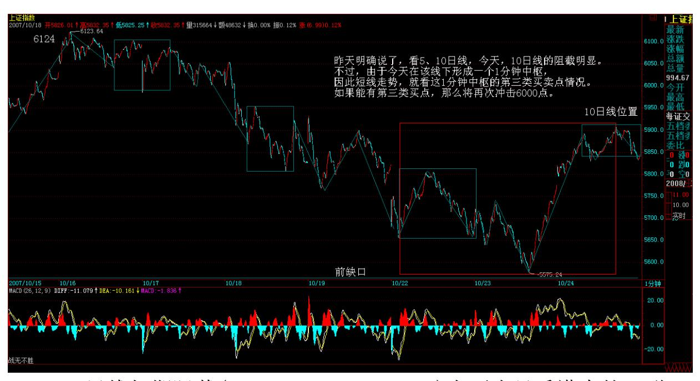

教你炒股票 85:逗庄家玩的一些杂史 3 上升通道下轨支持如期反弹 (2007-10-23 15:40:39)昨天说得很清楚,1 分钟下跌底背驰后,一轮 反弹将展开。今天的技术走势十分标准,更重要的是,这里是 3600 点上来的上升通道下轨位置,又是缺口位置,因此技术上必须要有这 次反弹。

339 在前面已经明确说了,空头现在的策略,就是逢反弹必抢的,抢 了以后,等不死心的涌上去没力时,才有筹码喂饱人。注意,这里本 ID又有金针度人,不是任何反弹都可以抢的,只是做顶行情中的反弹 可以抢,一旦顶部完全形成,破位后,那么反弹就没必要抢了,让别 人去多杀多就可以,除非有特别大级别的买点。这是一个十分微妙的 关系,但一般脑子进水的都不大明白。因为在那些人眼里,反弹都是 一样,而实际上,在做顶行情中搞反弹,只是为了促进顶部的形成, 而且也为一旦顶部形成不了而准备好后手。

做盘就如同下棋,必须有大的想法,而不是看一步走一步。着着有后 手,这样才能稳胜不败。

以上的话,都是给现在技术还行的人看的,这里的标准就是,空仓或 者目前的市值比 6124.04 点那天高的人。其他人,根本没资格抄什么 反弹,先借反弹把市值恢复上去再说。

这如同跳舞,节奏已经错了,就不能错上加错,先把节奏调整对再 说。

反弹的压力,首先是 5 日线,然后是 10 日线,如果这两条线都不能 突破,那么这个反弹就将构成第二类卖点,后来是什么就不用说了。

注意,中石油上市,会给市场又一个兴奋的借口。但关键是政策面的 趋向能给多少时间,中字头会借此兴奋一下,今天这已经有点表现。

另外,二线蓝筹在反弹中也会表现的,例如科技股以及其他题材股之 类,因为前面根本没动,所以有所轮动也很应该,但这些股,大面积 表现的可能性不大。

本 ID 已经反复强调,顶不是一天搞成,这里有一个微妙的潜在语: 最后破位之前,最终套住谁,现在还没有定呢,所以,6124.04 点逃 掉的,也不要高兴太早,一旦反弹做错,最后来个站岗大换班,那是 常有的事情。

所以,现在的反弹操作,一定要谨慎,请量力而行。

最近很忙,刚才一边写东西一边就电话不断,所以没时间回答问题 了,抱歉。

先下,再见。

太累了,没时间写帖子,说两句闲话(2007-10-23 22:37:58)太累了, 没时间写帖子,说两句闲话。

本来是可以写帖子的,结果晚上谈事回来,看到下面搞的合同,几乎 把本 ID 看晕了,完全不是本 ID 的意思。本 ID 只好浪费不少时 间,等于重写一遍合同,这种事还要亲自干,真是晕。

那些破事就不说了,说实话,最近本 ID 是越来越忙,明天下午又是 一个谈判,别人专门从香港飞过来,还是一群人,不见不合适,所 以,这博客如果有照顾不周的地方,请原谅。

当然,本 ID 会尽力坚持下去,如果实在太忙,也请各位谅解。下周 又有一件剪彩的事情,必须出一次差,不去不行。本 ID 现在都有点

担心,万一铺的事情太多,以后要撒手不干了,可能还不是简单的事 情。

人在世上,总难如愿的。想安静,就太与世隔绝。一入红尘,很多事 情就身不由己了,毕竟事情要好来好去,不可能干一半就撒手不管。

吃饭时,有一电话又来勾引本 ID,说软银投了某某项目,让本 ID 也 投点,明年就上市。一个老熟人,本 ID 又不好推,只能说先把项目 资料发过来,看了资料,如果不错,不投不合适,投了又多一件事, 无聊呀。

刚才改合同的时候,突然觉得很累,现在的事情有点收不住了,总 之,本 ID 有一个心愿,40 以后完全转向文化的建构,现在到 40 还 有太多年了,怎么熬啊。

对不起,一时无聊,胡乱唠叨,抱歉了。

342 10 日线如期阻截(2007-10-24 15:14:14)上要去见香港来的一群 无聊人,只能快速说两句。昨天明确说了,看5、10 日线,今天,10 日线的阻截明显。不过,由于今天在该线下形成一个 1 分钟中枢,因 此短线走势,就看这 1 分钟中枢的第三类买卖点情况。如果能有第三 类买点,那么将再次冲击 6000 点。

如果短期没有特别消息,这个反弹应该继续延续,只是以横盘还是以 继续上冲的类型选择。由于那资金解冻在后面,这么多资金,不骗点 进来太对不起大家了,所以,只要没有突发性消息,反弹至少能延续 下去把解冻资金骗点进来站岗。

个股没什么可说,都告诉各位中字头了。当然,这种形式是最消磨多 头意志的,指数涨,却没有赚钱效应,这就是空头最爱干的事情。

如果特别的消息一直不出来,那么在没什么事干的情况下,空头不排 除会再次上演拉指数的好戏,把消息给拉出来。

短线技术,明天就看今天这 1 分钟中枢的震荡情况,如果出现第三类 卖点,那就有二次探底的需要。

就算是反弹,也可以是二次探底后再展开的,所以现在对于反弹类型 的选择,是可以有很多种的,判断标准就是这 1 分钟中枢的震荡情 况。

注意,再次强调,最后指数的破位,必须有消息配合,没有的话,最 多只能箱体,除非这箱体延长时间太长,把所有搞怕了才可能破位。

对不起,要走了,先下,再见。
