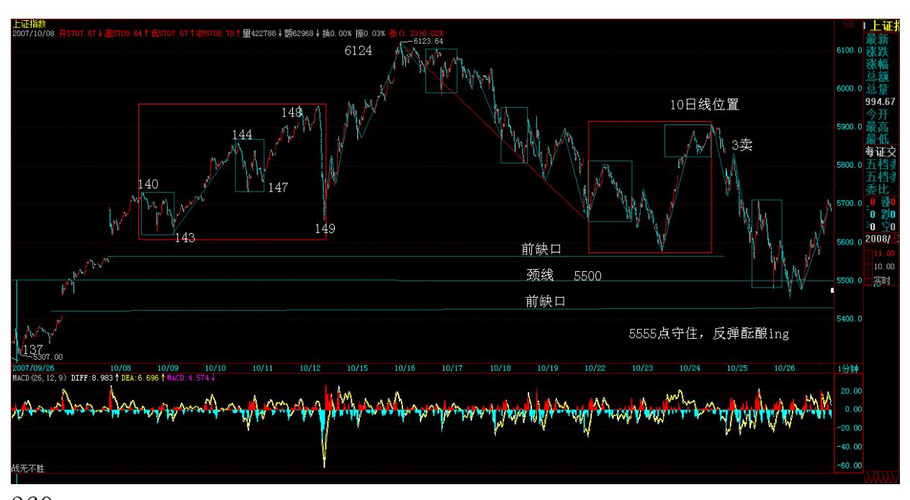
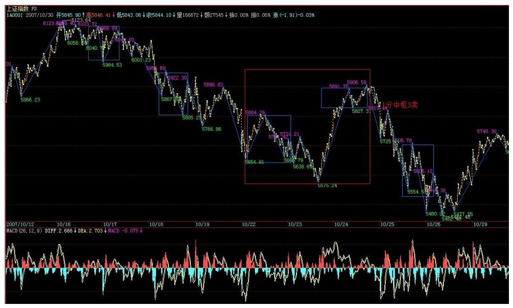
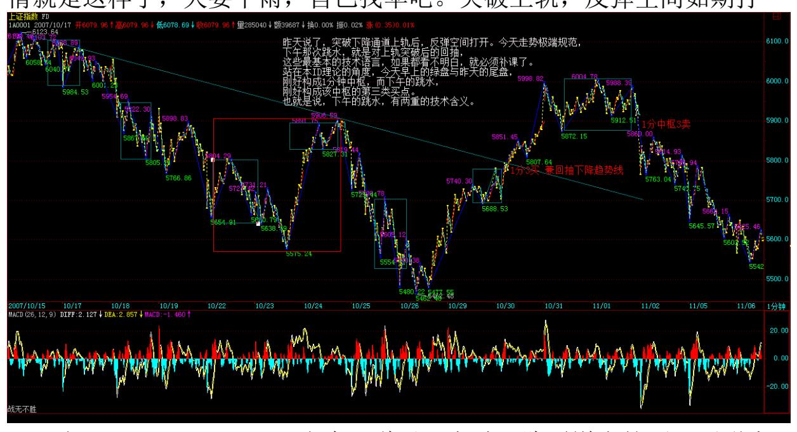

教你炒股票 86:走势分析中必须杜绝一根筋思维当然,最好的走势, 就是对颈线假跌破,然后反抽上来,这样,甚至有再冲 6000 点的可 能,当然,这是最好的走势,能否出现,多头答应,空头不一定答 应,即使空头答应,政策面可能也不一定答应。

(注:实际走势为最好这类,反弹到 6004 点)356 本 ID 已经说过, 反弹的操作,风险极大,如果你连第三类买卖点都分不清楚,那还是

继续小板凳吧,这些反弹操作,你没资格参与。

虽然,本 ID 这一方已经全面大胜,但就像 3600 点大胜后,本 ID要 把后面的情况先说明一下。这次下来,为后面的低价股积聚了潜力, 年底、明年的,又有不少好股票有好价位了,这才是这轮走势最大的 用处。

节奏,有大节奏,也有小节奏。当然,首先必须有大思维、大节奏。

这里的道道,自己漫漫体会吧。先下,再见。

中国经济和股市的未来依然美好(2007-10-25 21:04:33)今天本不想说 股票,但在这个月圆之时如期地鬼哭狼嚎的,一幅浮世绘,所以,本 ID 一早说,不于股市自由,就谈不上自由,因为这是世界上的一大炼 狱。别以为股市就是股市,这里,有着最多的贪嗔痴疑慢,确实是一 个好的修炼场所。所以,所有在股市中被股市的,都是有福慧的。受 其灾,消其灾,三生有幸。

对年末的走势,本 ID 早有总体的分析。在"2007 年末,资金与政策 博弈下的走势分析 2007-09-17 00:41:48"里,已经对走势给出最明 确的分析,本 ID后面的所有判断与行为,都在 9 月 17 日把剧本公 布了,6100 点,在这帖子里明确分析过了,但有多少人能留意?大概 都被每天的波动所消磨掉了。

没有大的思路、大的节奏,为每天的波动所折磨,那是被股票面首, 而不是面首股票。

请看那 9 月 17 日帖子其中的一段:"由于去年大盘涨幅是 130.43%,收盘在 2675.47 点,按相应比例,6165 点成为今年一个标 杆式的点位。还有,深圳成分指数在 96 年的行情中,也如本次上海 指数一样略微跌破 1000 点后展开,而前者最终在 6100 点上见大 顶,因此 6100 点附近是后者行情一个特别值得留意的位置。" 还有 最后结论性的一段:"反之,一旦资金面的肆虐超乎合理范围,那么 大盘将演化为一种疯狂走势,即在今年内强行突破上面所说的6100 点 区域,这样,一次超 530 级别的调整将难以避免。" 该说的,其实 早说了,大蓝图都没看明白,盯着每天的盘子有用吗?那么,现在难 道就是世界末日吗?不是,中国经济和股市的未来依然美好。这里本

ID 反而要为各位打气,因为中国经济的基本面没有任何实质的改变, 人民币升值也在加速中,一切利好的因素依然存在。

但是,正如本 ID 反复强调的,现在需要的是中级调整,为了中国股 市的未来,这调整是必须的。

关于中国股市的最大蓝图,本 ID 在"神州自有中天日,万国衣冠舞 九韶 2007-03-19 08:52:42"有着最明确的描画。这帖子发出的当 天,大盘就拉出长阳,突破 3000 点下的震荡,展开了今年波澜壮阔 的走势。

当时,大盘还在 3000 点下风雨飘摇,本 ID 明确说了:"在总市值 超越 GDP 之前谈论股市的泡沫是可笑的,在中国股市总市值超越其 GDP 之前,第一阶段行情不会结束。" 后来,这一切都实现了,而 且,目前这一阶段的行情其实并没有结束,在中级调整后,这行情依 然要展开,依然要新高,这是毫无疑问的。

但是,一个合理的调整去积聚新的能量,让市场走势更加稳健,使得 20 年大牛市的基础更加牢固,这是必须的。

就像在 3600 点,本 ID 站出来说要满江红,因为在中国的市场,散 户太多,散户天生就是死多,所以那肯定受欢迎。

而这次,本 ID 站出来说要做空,而且又刚好在提前说的 6100 点上 阻挡了疯牛,这当然不会招人待见,但,为了中国股市的未来,这必 须这样干。

试想,如果中国股市也如台湾、日本式地醉生梦死一次,然后是十 几、二十年的大熊市,最终害的是谁?特别中国,经济的转型还没完 全结束,一旦资本市场被毁,经济转型所需要的核心动力就彻底丧 失,最终伤害实体经济,而后面就是所有人的生活。

对于本 ID 这种人,经济好坏都不会影响到个人的风花雪月、99419, 但绝大多数的人,特别那些还有住房、医疗、教育等等问题需要解决 的人,一旦经济3出现问题,将是最大的受害者。

最大的利好,对于任何一个中国经济的关系者来说,就是经济的长期 稳定的发展,而不是暴冷暴热。

我们需要的是长牛,而不是疯牛。

中国股市的牛市依然,中国股市的未来依然是世界上机会最多的,有 着最远大的前途,必将成为世界上最大的市场。暴风雨,只是让它更 健康,如果没有这样的大视野,那么,在市场上注定不可能成功。

中国股市充满机会,未来无限。而这机会、未来如何成为你自己,这 才是对每个人最重要的问题。

这市场不怕做错了,只怕死不改错。好好反思一下自己的操作,大概 上面这个问题,就能更好地找到正确的答案了。

360

5555 点守住,反弹酝酿 ing(2007-10-26 15:13:40)上几天来的香港 人的头今天过来了,在工体北他们的总部等着,本 ID 只能快速说两 句,抱歉了。

本 ID 已经把 5555 点这个位置告诉各位了,这是颈线位置,守住, 那么还有机会来一波有力度的反弹,否则,形势就更恶劣了。

由于股指期货、中石油等的预期,所以中字头依然在反弹中继续扮演 最重要的角色,而一些跌到重要均线位置的题材股,也会有一定的表 现,但将趋于个股,板块效应不大。

当然,反弹是否能在 5555 点颈线酝酿成功,还要看周末消息面的情 况,如果没有特别的消息,在资金解冻前后,这个反弹将出现并延 续,而中石油的上市表现,将决定这个反弹的最终命运。

362 后面的游戏,关键是考技术,以及一看反弹不行就跑的灵活性, 如果技术和灵活上都达不到要求,那就算了,这种活,一旦失手,痛 但一定不会快乐着,除非你有受虐倾向。好了,周末,让股票磨墙 去。

今天不得不破例说股票(2007-10-27 16:44:21)虽然道理上,那地方不 是随便可以住的,但其实,只要认识门道,确实可以很随便就入住,

特别今天开那所谓衍生品大会的地方。那地方今天就这么把股指期货 如此地随便了一下,难道就为了里面那些别的最高档酒店也没有的古 董玩意?一些外国人或者外地来的,总是以能被带到那地方住为高规 格的接待。其实,不妨揭密一下,那地方,如果认识门道,其价格比 北京最好那几家酒店都要便宜点。当然,这里指的是标准的房间。而 今天的衍生品在这个还算新装修的地方开,不知道是否有点上面那种 希望住这种房子人的心态,说得难听点,就是土老冒心态。

土老冒心态,当然不一定是一般认为的土老冒才有。像现在,急着要 被期货股指一下的心态,就与此类似。现在推出期货的时间根本就不 合适,除非已经把股指期货当成一种住国宾馆显摆的玩意了。

住国宾馆的,特别那些做生意的去住的,往往不过是为了忽悠,真有 实力是不用忽悠的。同样,没有股指期货,中国资本市场依然可以辉 煌。

竟然有人在会上说,有了期货,就有了做空机制,就可以如何如何, 股市就不会单边乱涨之类的玩意。说这话的人难道没经历过 327?还 有 319 难道不是一直单边乱涨最后导致国债期货停了?本 ID 早把狠 话说了,在目前的流通量环境下,期货推出后,主力做空的最后一定 死得尸骨无存。连股票的卖空都没有,谈什么做空机制?想推出股指 期货,先把流通量增大,卖空给搞了,否则,越期货越死人。 当然, 本 ID 一点都不担心目前的状况,新官都没上任,更谈不上三把火, 现在的,想说什么是什么,关键是说了算不算数。

如果目前的流通量与交易机制不变,那么,一旦在近期确认期货推 出,本 ID 将成为最坚定的多头。当然,可能是先诱空再多。

汇丰都 N 百了,工行为什么不可以?把工行、中行干上 200 元,又 有什么不可以的?疯狂,谁不会?疯一把,一起死。早死早干净。

明天面临下降通道上轨压力(2007-10-29 15:25:18)5555 点站稳后反 弹,这都在预计之中早说了,明天面临下降通道上轨压力,这是技术 的话,基本面上,如果指数期货出来,点位根本没意义,特别在形成 多空对赌的局面时,那时候,只需要关于如何把对方打爆了,什么点 位不点位的,如果夹到 100000 点才能把空头夹死,那当然也是可以 这样操作的。

期货,从来都是你死我活的斗争,没有什么仁慈可说的。拥有相应的 筹码,就是拥有市场的发言权,有发言权比什么都重要。

明天一旦冲破上轨压力,反弹的空间将被彻底打开。当然,这个位置 出现反复也是很自然的。由于大面积资金被冻,所以没什么消息的情 况下,这反弹是不会轻易结束的。

如果期货在年内推出,那么 6100 点当然不会是什么位置了,这是目 前大盘最大的变数。但无论走势到什么位置,其实和大多数人无关, 因为真正上涨的股票基本依然是带指数的,其他股票,大多数只能暂 时继续反弹然后回跌,最多保持盘整的走势,没什么大戏。

不过短线,超跌股票的反弹还是有一定机会的,但风险同样大。至于 中字头,有期货这保护伞,当然是爱多疯有多疯。

期货出来后,个股分化将继续加剧,散户的生存空间进一步减少,事 情就是这样了,天要下雨,自己找伞吧。突破上轨,反弹空间如期打

开。(2007-10-30 15:26:44)昨天说了,突破下降通道上轨后,反弹空 间打开。今天走势极端规范,下午那次跳水,就是对上轨突破后的回 抽,这些最基本的技术语言,如果都看不明白,就必须补课了。

站在本 ID 理论的角度,今天早上的绿盘与昨天的尾盘,刚好构成 1 分钟中枢,而下午的跳水,刚好构成该中枢的第三类买点。也就是 说,下午的跳水,有两重的技术含义。

现在的走势十分简单,只要不出现回到这 1 分钟中枢,而在上面形成 新的中枢,那这反弹的级别就至少不小于 1 分钟的上涨。这样,操作 就极为简单,耐心等待背弛出现就可以。

365 短线总体的节奏,本 ID 在上周五"5555 点守住,反弹酝酿 ing 2007-10-26 15:13:40"已经说得很明确了,就是 5555 颈线站稳后, 反弹至少延续到中石油资金解冻前后。就算是最坏的情况,也要先把 这些资金骗进来再说,否则太对不住这 3 万亿资金的热情。

中期走势,本ID 已经说得很清楚,如果期货出来,那点位就没什么意 义了,6100点也不是大不了的位置,那时候只有疯狂,没什么点位不 点位的。而如果期货被阻击出不来,那么,6100 点当然还是一个位 置,这次的反弹,也就是构成顶部图形的第二个尖。至于这个尖,比 前面一个高点还是低点,都问题不大,例如双头,可能就低点;头肩 顶,就高点,这都没有太大的影响。

无论什么顶部的最终图形,5555 点都是生命线,只要不有效跌破,这 图形就没完,而且有变成中继图形的潜力。否则,就是顶部图形成 立,中级调整确立。而目前,唯一的变数就是期货的时间。

关于期货,本 ID 也说得很清楚了,本 ID 不愿意见到出来,特别是 现在。因为这样将会耗尽中国资本市场的那点能量,然后的调整就不 是小儿科了。现在,这事的折腾,依然不能说完全定局。有些事,最 后一晚还可以改变,没到最后一下,市场外的努力是不会放弃的。

至于现在瞎忽悠的,又不是能拍板的人,本 ID 连看都不爱看他们的 废话。

当然,现在舆论在造势,有一群势力在为自己的利益忽悠着,这事 情,就看最后一下的智慧了,但本 ID 这里放一句狠话:请别像327、 319 那样,谁拍板、谁负责,这个政治、经济责任,不可能拍拍脑袋 就没事。

另外,本 ID 还要说:所有忽悠这事的,请先说明白,出事了,你们 负责吗?如果由此把资本市场和经济搞砸了,你们负责吗?不负责, 为了名利而忽悠,这不是中国人该干的事情。

现在,站在本 ID 的立场,很简单,就是该反弹就反弹,该疯狂就疯 狂,在 5555 跌破之前,进行大幅度的震荡操作去吸血。而在市场之

外,该有的努力一定不会少,最终的结果如何,只要心到了、力到 了,本 ID 也无怨无悔了。

但相信,管理层对目前点位风险会有足够的认识,一旦市场进入不可 自我调节的状态,管理层一定不会袖手旁观。 好了,最近确实事多, 明天要出差,还有很多事要忙,先下,再见。
