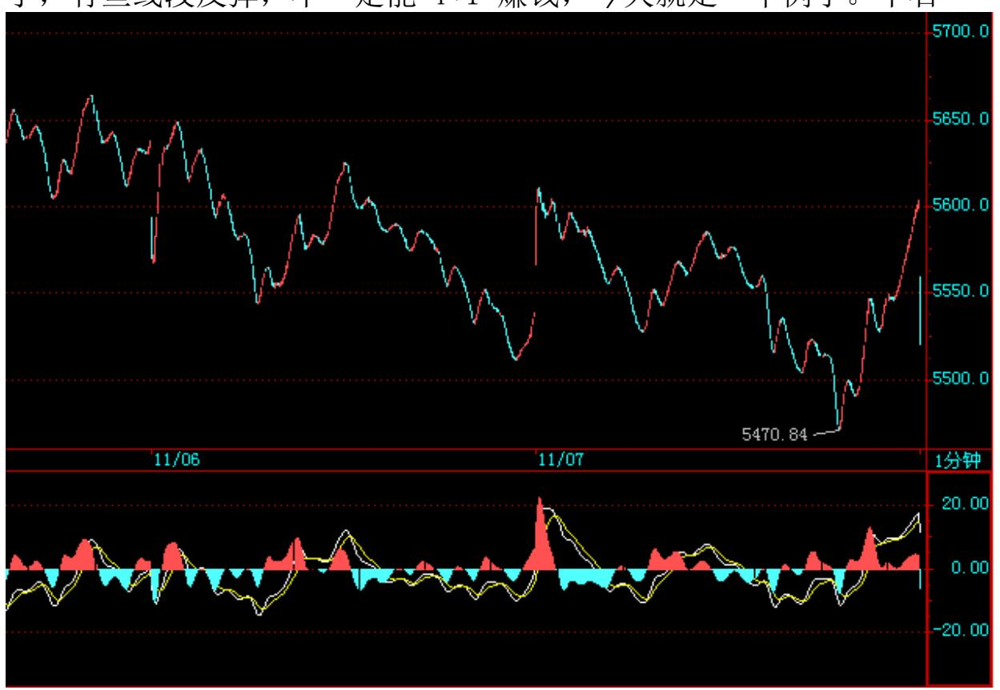

教你炒股票 87:逗庄家玩的一些杂史 4 5555 点争夺战(2007-11-06 15:37:47)今天的走势,就是一个5555 点争夺战,一般这样的战斗, 胜负至少看 3 天,上下还有一个3%的缓冲区域,5555X97%是多少,自 己去算吧。

当然,这次下跌,和上次不同,大多数人都没什么感觉,因为这次跌 的都是中字头的,其他 90%都没怎么跌。但并不意味着这次的可能风 险就小,如果真跌破颈线,那么很多这次趁着中字头跌而反弹的股 票,也会再次探底的。

所以,5555 点争夺战,对于多头来说,是输不起的。空头反而是无所 谓,反正后面还是 6000 点、6100 点的防线,其实,站在本 ID 的空 头立场,本 ID 不大愿意这样就破了颈线,因为这样力度有限,很可 能就是一个假跌破。

对于空头来说,对颈线的突破,一定要是致命的,用本 ID 的理论术 语,就是一定要第三类卖点后出现中枢的下移,而不能去构成大的中 枢那种无聊玩意,那样杀伤力太小。如何达到那种力度,就是要在颈 线上反复磨,如果再冲一次上不去,又一批人开始失望,然后再来一 次,反复失望,这样才有杀伤力的。

多头空头,绝大多数都是猪头,都是急功近利的,本 ID 只是分力, 最终是否能如本 ID 所希望那样,搞得更有杀伤力,那不是本 ID 一 个人能决定的。而且,很有可能,有些傻空头急功近利,企图快速破

颈线,最后反而中了多头的埋伏。 本 ID 最近心大都在 PE 上了,没 心情没时间去找人开小会协调协调,所以空头爱干什么就干什么吧, 本 ID 有时间,还不如去再造 N 个西部矿业出来卖给多头,1 元的东 西,到时候卖了几十上百的,感觉不错。

中石油今天走出了线段下跌的走势,今天早上到 41.2 的那次反弹, 就是对 41.7 上那类中枢的类第三类卖点,然后就继续下跌,现在就 看这个线段下跌的类背驰了,一旦出现,就至少有一个级别更大的反 弹,比昨天尾盘那个线段反弹要大,至少是可 T+1 操作的。昨天说 了,有些线段反弹,不一定能 T+1 赚钱,今天就是一个例子。中石

油,最终的走势很有可能和中国人寿类似,这在昨天也说了,当然, 不可能完全照抄,但基本模式,估计差不多。

上面说了如何才能杀伤力大,大概又得罪不少人,但市场就是这样 的,讲感情就不要在市场混了。本 ID 说出来,只是把市场可能的残 酷一面说出来,有时候,本 ID 没时间干了,并不意味着别人没时间 干。

如果你对市场有了足够的洞察,那么,任何人的鬼把戏,都无效了, 这才是最重要的。市场里,需要的是智慧,而不是煽情。

381 认清自己,冷静再冷静吧。先下,再见。
