# 教你炒股票 88:图形生长的一个具体案

(2007-11-06 22:38:43)本 ID 的理论,对所有的走势,进行了一个最 明确的分解,所有的分解,本质上只有两类,就是延续与转折,用残 酷一点的词语,就是生和死。

- 一个走势类型的死,必然意味着一个走势类型的生,走势,就在这样 一个生死的轮回中,如同众生的生命,生死轮回不断。看明白了股票 的走势,对人生,也大概应该有点领悟了。
- 一个走势类型确立后,同时就确认了前一个走势类型的死,同时也开 始了自己面向死亡的生存。

如同众生的轮回生死,在死与生之间,有一段被称为中阴身的阶段, 股票的走势,同样存在着这个阶段。如果说前一个走势类型的背驰或 盘整背驰宣告了前一个走势类型的死亡,那么到新的走势类型确立, 这里有一个模糊的如同中阴般的阶段。

要把握这阶段的走势,必须把前一段走势的部分走势结合起来分析。

也就是说,前一段走势的业力在发挥着作用,这个业力与市场当下的 新合力构成了最终决定市场方向的最终合力。

用一个例子,就很好地能说明这个问题。

下图中,191 的背弛宣告前一走势类型的死亡。按道理,新的走势类 型,是从 191 开始分析的,但这时候,新的走势类型连第一段线段都 没走出来,甚至走到 193 的位置,也依然轮廓不明,因此,这时候, 就是典型的中阴身阶段,必须借助前面 189 开始形成的中枢来完成分 析与相应的操作。

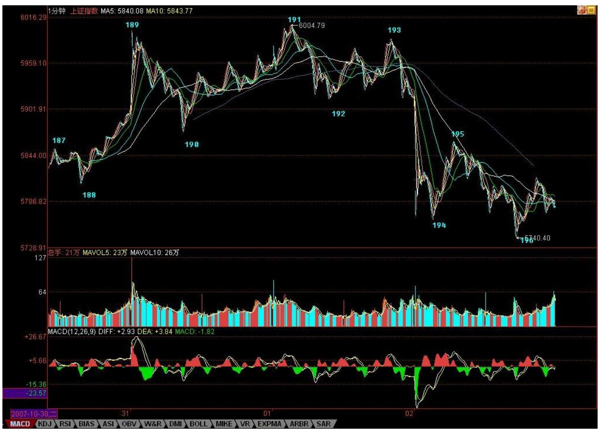

383 384 教你炒股票 88:图形生长的一个具体案例 如果从 191 开 始,192、193 都很难说有什么可依据的。当然,可以说 193 就是第 二类卖点,这个自然没错,但站在 189 开始中枢的角度,这就存在一 个中枢震荡的问题,这样,这个干瘪的第二类卖点,就有一个更大的 可依靠的分析基础。一切关于中枢震荡的分析,都可以利用到关于 192、193 以及后面走势的分析中,这等于有了双重的分析保证。

当然,后面的 195 的第三类卖点,也是站在中阴阶段的角度说的。但 这一点是一个中阴阶段与新的走势类型确立阶段的分界点,195 出来 以后,新的走势类型最开始的形态就确立了,也就是至少是一个线段 的类下跌走势。这时候,分析的重心,就可以移到 191 开始的新走势 类型上了。这时候,就可以基本在这个线段级别上,不用考虑 191 之 前的事情。

但 191 之前的走势并不是没有用了,而是在更大级别上,例如在 1分 钟、5 分钟等等级别上发挥作用了。191 后面出现的走势,就和191 之前的,结合出大级别的走势形态。

因此,当各位熟练以后,标记上就不一定要不断地标记下去了,例 如,如果你是按 1 分钟级别操作的,那么,前面 191 个线段记号, 可能就可以一下简化为 10 个不到的 1 分钟级别相关的记号。当 191 后面的走势演化出的 1 分钟走势结束后,这 1 分钟级别的记号才再 增加一个,这样,记号的数目就很有限了。当然,如果是 5 分钟级 别、30 分钟、日线等等,就更少了。

为了方便明确起见,还是把记号的级别进行分类,例如,用 Xn 代表 线段的记号,用 Yn 代表 1 分钟的级别,Wn 代表 5 分钟的记号,Sn 代表 30 分钟记号。日、周、月、季、年,分别也可以用 Rn、Zn、 Mn、Jn、Nn 来表示。其中的 n 都是具体的数字,这样,所有的走 势,都可以被这个标号体系所标记而清楚异常了。

例如,对于 191 这个点位,站在线段上,就是 X191 的标号,站在 1 分钟级别,可能就是某个 Yn 的标号,而 189 这个点,就只有线段的 标号,这同时也显示了,191 这点和 189 点的重要性是不同的。

什么是最牛的点?就是从线段一直到年,同时都有标号的那个点,如 果是顶,那就是百年大顶,当然,是否有幸碰到这样的点,就看各位 的运气了。

这个标号体系,不单单为了方便阅读、记号,首先就培养了各位一种 综合的、系统的习惯。看一个走势,就要知道,不是单单是一个线 段,而是在一个大的多层次系统里,这样才不会被每天的波动所迷 失。

其次,这个标记的过程,意味着什么?既然线段有中阴阶段,那么其 他级别当然也有。所以无论任何级别,在一个顶点出来后,都有对应 级别长度的中阴阶段。

注意,一定要注意。为什么很多人逃了顶,最后还是被套住了;抄了 底,最终还是没赚到钱,被震出来了。这就是被相应级别的中阴阶段 给搞死的,而且,越大级别转折后的中阴阶段,越能搞死人。

就如同人的中阴,非人非鬼;行情走势的中阴阶段,也是多空齐杀, 不断折腾转换。等最后转折确认时,就如同已经重新投胎,饭熟了, 还找米,能有戏吗?有些蠢人,经常在行情转折的中阴阶段,觉得世 界又美好了,或者世界又恶劣了,结果都是被业力所牵引。

中阴阶段,无一例外,都是表现为不同级别的盘整(注意,这是只从 截取这一阶段的形态说,并不是说新的走势类型一定是盘整)。也就 是围绕前一走势的某一部分所构成的中枢震荡,即使是所谓的 V 型反 转,也一样,只是震荡的区域回得更深而已。

其实任何转折,也就是第一类买卖点之后,都对应着某一级别的 V 型 反转,例如,191 的转折,190-191 与 191-192,其实就是一个 V 型 反转,只是级别特别小。这个 V 型反转的级别,决定了中阴的级别与 力度。例如,站在日线图上看 6124 点前后 N 天的走势,其实就是某 级别的 V 型反转,然后就同时进入中阴阶段。

注意,中阴阶段结束后,不一定就是真正的反转,也可以是继续延续 前一走势类型的方向,例如上涨+盘整+上涨,这样的结构是完全合理 的。例如,人的中阴后,不一定就要变鬼之类的,也可以成所谓的神 仙,如果你前一世是从鬼来的,鬼到人是上涨,中阴盘整后,从人到 神仙,也是上涨。

但,上涨+盘整+下跌,上涨+下跌等等,同样是可能的选择。这时候, 唯一正确的操作,只有一点:如果你技术好的,就在这个大的中枢震 荡中中枢震荡操作一把,如果技术不好的,就拿着小板凳看戏,看它 最后是升天还是下地狱,等市场自己去选择,然后再决定操作。

不过,站在本 ID 理论的角度,最大效率的,就是利用这个震荡去中 枢震荡操作一把,学了本 ID 理论,就是要把技术练好,练好了,就 自然不用整天小板凳了,上台自己票友一把不是更爽?当然,没这本 事的时候,还是别玩这一招,为什么?这就如同,在中阴身的阶段, 还是可以去修炼去证悟,但你总不能因此说,我现在就不修炼了,等 中阴再说。真等那时候,业力牵引着,你修什么鬼呀。

所以,有真本事,什么情况都不怕,都可以折腾。关键,是要有真本 事。

386 5555 点决战即将进入临界点(2007-11-07 15:26:47)这个题目有 点名不副实,因为这决战,对于空头来说,只是小战役,结果并不重 要;但对于多头来说,就是决定生死存亡的。从 6124 点开始的行情 转折中阴阶段,对于多头是垂死挣扎一下,还是干脆破罐子破摔,早 死早投胎,很快,准确地说,最迟下周一前后就有答案了。

站在空头立场,本 ID 希望多头能挣扎挣扎,这样,会增加很多残忍 的快感;当然,站在纯技术探讨的角度,多头最好的招数就是以退为 进,用一个空头陷阱,把主动进攻的空头给废了。

由于目前的空头比较蠢,所以本 ID 不妨提醒,屠杀之前,一定要多 点多头色彩,披着多头外衣的空头才是最有杀伤力的,在 5555 点上 制造出一个大点级别中枢,然后再背后来一刀,把多头砍倒,踢下悬 崖。

由于目前多头也比较蠢,所以本 ID 也不妨教教多头招数。从月线 上,无非两种可能,就是本月确认顶分型,或者不确认。不确认,就 是有包含关系或创新高。而目前 5462 点,就是这个顶分型是否成立 的关键,而跌破成立后,最关键是 5 月均线,目前在 5300 点附近。

也就是说,多头完全可以在 5 月均线附近埋伏大部队,让空头先进 攻,把分型给搞出来,然后反手把主动进攻的空头给废掉。

请回想一下,本 ID 在 3600 点,是如何完美地利用顶分型与 5 月均 线来把空头给灭了。现在多头最完美的策略,依然是照搬本 ID 的老 剧本。

不过,这些蠢蠢的多头,估计抄也抄不成样子,最后,可能还是要和5 月均线吻别于狂乱的夜。现在的多头,如果这 2 年多不被攻破的 5月 均线竟然给你们弄丢了,那你们也别丢人了。不丢人最好的方法就 是:早死早投胎。

有人可能要问:你究竟是多头还是空头,怎么又教多头又教空头如何 干?

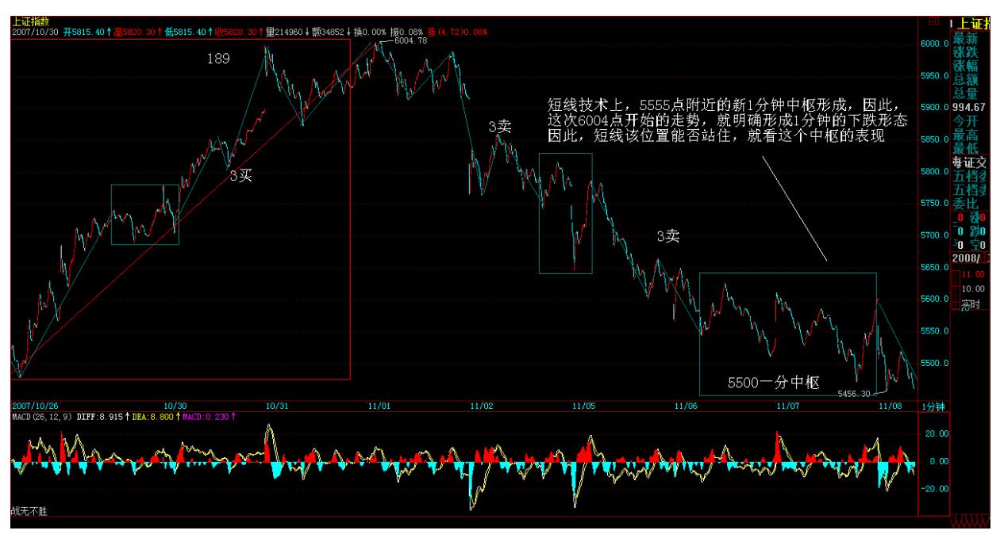

本 ID 很明确地说:本 ID 是那准备杀死空头的空头,一个不准备杀 死空头的空头,不是好空头。见顶以后,就是一个空头面向死亡的生 存过程。这时候当多头,将被空头蹂躏,而空头的命运,最终都是 死。所以,唯一正确的就是,当一个随时准备把空头搞死的空头,里 面的道理深着了,明白了,你对市场就有更深一步的了解。

387 短线技术上,5555 点附近的新 1 分钟中枢形成,因此,这次 6004 点开始的走势,就明确形成1 分钟的下跌形态,因此,短线该位 置能否站住,就看这个中枢的表现了,看明白这个中枢后面的发展, 也就看明白了这场多空拉锯的短线胜负了。

本 ID 的观点还是很明确,就是在这样一个中阴阶段,什么事情都可 能发生,技术好的,可以充分利用这大型的中枢震荡玩抽血游戏。多 空越分歧,意味着震荡的幅度机会越多,就越是本 ID 理论的天堂。 至于没这本事的,就算了。

今天的中石油,如昨天所说,38 元上线段底背驰后形成较强反弹,然 后形成一个 1 分钟的中枢在 40 元上下,这是该股形成的第一个 1分 钟中枢,因此给后面的操作具有最重要的指导意义。后面的走势无非 两种:一、以这 1 分钟中枢震荡扩展出大的中枢。二、这 1 分钟中 枢不过是 1 分钟下跌走势的第一个中枢,最终将跌破该中枢形成 1分 钟中枢下移去完成 1 分钟级别的下跌。

具体操作,就按实际走势的选择来决定。例如,如果你在今天背驰时 介入部分仓位的,就可以开始利用后面走势的波动,把成本逐步降 低。

最近天天说石油,主要是以此为基础,从最开始把一个股票的走势的 生长是如何演进的给教科书一番,各位顺便就可以看到,个股的分析 和大盘的分析没什么不同,都一样的。

今天下午晚上都有事,明天收盘马上有事,解盘要到晚上了,先说明 一下。先下,再见。

如期决战,多头不堪一击(2007-11-08 22:21:05)对不起,回来晚了, 把解盘补上。

昨天说,决战进入临界点,最迟周一有结果。结果是,多头如此不堪 一击,太令人失望了。这证明了本 ID 的一个断言:空头是心急的。

而昨天,本 ID 给多头编的 5 月均线大埋伏剧本,是否如本 ID 所担 心的那样:"这些蠢蠢的多头,估计抄也抄不成样子,最后,可能还 是要和 5 月均线吻别于狂乱的夜" ,很快也有答案了。

前几天,还有多头叫嚣,质问本 ID 不是说要至少跌 1000 点吗,为 什么还不跌?现在,这个本 ID 布置的任务,确实有点没完成,本 ID 对演员们的表现也很不满意,那就继续努力吧。别心急,小板凳坐 好,别到处跑动,现在,1000 点只完成了 800 点,空头多头演员 们,努力!加油!现在,5462 点到 5555 点颈线位置,将是中线反抽 最关键的位置,不能重新上去,那么跌势将持续到这跌的业力耗尽的 一天,本 ID 可从来没说过 1000 点389 外就没有空间,本 ID 只是 说,没有 1000 点的回跌空间,这做空不过瘾,没空间,不好玩。所 以,1000 点这小康水平达到后,我们还可以有更高的现代化目标,这 难道有什么问题?今天不爽的,基本上有两种人:一、牛人,觉得自 己很牛,可以短线,有天赋。本 ID 说认清自己,冷静加冷静。认清 什么?就是你是不是牛人。牛人,不在乎什么线,但不是,就别累着 自己。本 ID 不早给了所有非牛人一个最好的选择:小板凳?二、大 牛人。这种人,以被套为光荣,号称牛市就要中长线,就要持有。就 算那股票从 300到 3 元,也要持有,也要中长线,这种大牛人,本 ID 没什么可说的。有人喜欢电梯,上上下下享受,本 ID 一点意见都 没有,慢慢享受去吧,还有你爽的时候。

明天、周一,5 月均线能否有埋伏,埋伏能否有效,很快就有答案 了。如果是本 ID 搞的,本 ID 当然有信心,但现在,本 ID 又不当 多头了,和 3600 点那时候不同了,本 ID 可不想为任何人担保什 么。

现在,多头短线的问题,是这次跌破,是否能尽快拉回去,否则,一 旦确认颈线跌破,那么,按照双顶的量度跌幅,你觉得该到哪里呢? 本 ID 很想仁慈地安慰一下今天受苦的人,但本 ID 最终决定还是不 这样干,因为这样只能害人。市场从来不仁慈,本 ID 该说的也早说 了,既然,今天痛苦的,都是大小牛人,那么就继续梅花香自苦寒来 去吧,这大概是牛人爱干的活。

如果想真学点什么的,请复习一下本 ID 这帖子。

2007 年末,资金与政策博弈下的走势分析2007-09-17 00:41:48如果 能学点什么,本 ID 觉得,就没必要学梅花了。股市里,不需要学梅 花,不需要苦寒来,股市只需要智慧。 技术高的,可以关注这6004 点开始的 1 分钟下跌的背驰,然后将有一个大反弹;如果技术不高 的,还是继续小板凳吧。

390 5 月均线大埋伏剧本如期上演(2007-11-09 15:20:08)今天行情没 什么可说的,就本 ID 前两天已经公布的 5 月均线大埋伏剧本的现场 版。不过,说老实话,同样的剧本,不同的导演,效果当然是不同。 今天这种演出水平,显然不是太令人满意的,所以本 ID一早就给了一 个定性:"这些蠢蠢的多头,估计抄也抄不成样子" ,至于是否会 "最后,可能还是要和 5 月均线吻别于狂乱的夜",很快也会有答案 了。

当然,在这个答案出来之前,无论答案如何,都会有一个对前面5462- 5555 点颈线位置的反抽确认过程,这是例行手续,能重新上去,就证 明多头这次的5 月均线大埋伏剧本没演砸,否则,这戏就要退票,重 新开始空头的魔兽表演。

空头这头魔兽,最终肯定要被本 ID 砍了劈了,但如果多头不争气, 剧本演砸了,首先被砍被劈的一定就是多头。

本 ID 这种要砍死空头的空头,目前最爱干的事情就是,多头伏击 时,本 ID 也在后面伏击着,多头掩杀,本 ID 就跟着呐喊,等多头 冲得没力,空头开始反击,本 ID 就在后面连续绞杀,把多头变成少 头。

有人可能说,你这样也太无耻了。本 ID 只知道,在资本市场里,最 无耻的行为就是亏钱、被套,只要你在市场上,远离这种行为,那你 自然就是一个高尚的人、脱离了低级趣味的人,可以鄙视所有宣称你 无耻的人的人。

这如同打仗,蒋光头就是最无耻的人,占尽优势最终还被赶到岛上洗 海水浴去了,这世界上还有比这更无耻的吗?无论多少无耻的人给他 找一万条无耻的理由,也改变不了他是最无耻的结论。打仗,最终只 看结果,别说任何理由。输了,磨墙去,JJWW 没用。

市场比打仗更无情,打仗输了,还会有无耻文人,忽悠点这英雄那豪 杰的,蒙骗一下少年儿童。市场输了,连尸骨都不会有人替你收。有 人喜欢温情,喜欢有人说软话温暖一下破碎的心,那是有病。这种 人,在市场中永远只有一种命运:死。

中石油在 38 附近又有一个新的 1 分钟中枢,不过这个中枢与上面一 个太近了,极有可能就 2 合一地扩展成更大级别的中枢,当然,实际 走势,由市场决定。

大盘没什么可说的,5 月均线埋伏后,就看反抽力度,十分简单,没 必要多说了。

391 个股方面,由于人气涣散,最近能逆市的,更多是小市值的低价 股,年未,重组闹剧又到上演的时候,这是可多多关注的。至于,中 字头,一定还是市场的重心,不过一定要踏稳节奏才可以去短差,否 则就会被人绞杀。

不想说了,一到周末,股票就成了最无趣的东西。周末,腐败去,发 展晚上经济去、为吃喝玩乐经济贡献去,千万别股票去了。如果什么 都不想干,就打坐吧。先下,再见。

1000 点小康跌幅胜利完成(2007-11-12 15:28:57)本 ID 宣布做空时 说,没有 1000 点的下跌空间,不爽,所以要先拉出空间来。今天, 1000 点的基本任务已经胜利完成,本 ID 在前面已经给了这个跌幅一 个名字,叫小康水平的跌幅。请问,各位是希望下一步小康就算了, 还是要继续富裕下去?今天,5 月均线大埋伏剧本继续演绎,今天的

利空,刚好为 6004 点下来的 1 分钟下跌构成底背驰做出最后的贡 献。本 ID 已经早说了,6004 点下来的 1 分钟下跌一旦背驰,会出 现较大级别反弹。现在,5月均线大埋伏剧本与 1 分钟下跌背驰剧本 最终两剧合一。

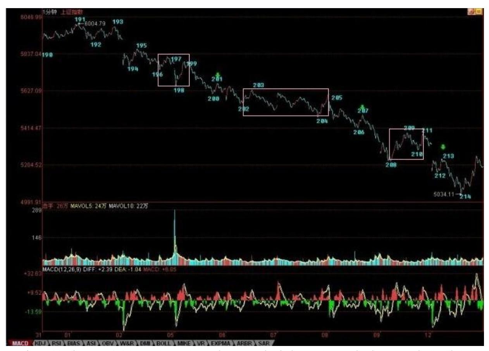

注意,这个 1 分钟下跌,搞出来了三个中枢,然后在今天一个完美的 底背驰。最后的一个 1 分钟中枢的第三类卖点,就是早上的补缺失败 走势,然后继续的下跌构成了线段的类背驰,这和 1 分钟大走势的背 驰段构成完美的区间套,这么教科书的走势,请好好去研究。

1 分钟底背驰后,最基本的涨幅,就是拉回原来 1 分钟下跌的最后一 个 1 分钟中枢的波动区间,这个在今天就达到了,后面就是这个中枢 如何扩展出 5 分钟中枢的问题。技术上,就要关注这个 5 分钟中枢 的位置以及后面相应的中枢震荡结果。

392 393 通俗地说,如果大家都觉得短线小康就算了,不要富裕了, 就让这 5 分钟中枢第三买点;否则,大家都急切奔向富裕,那这 5 分钟中枢将第三卖点;事情就这么简单,各位民主一把,投票吧。

更通俗地说,就是以 5 月均线陷阱对 5462-5555 点颈线的例行反抽 继续展开,注意,反抽可不一定要一定碰到 5462 上,最弱的反抽, 就是装模作样在颈线下面折腾几天,然后就和 5 月均线吻别于狂乱的 夜。

当然,多头现在也不是完全没希望,多头要成功,首先是要让所有人 只要小康、不要富裕;其次,好好利用 5 月均线大埋伏剧本,绝对不 让那狂乱的夜发生,特别不能让狂乱的月圆之夜发生;最后,找准机 会,重新回到 5462-5555 点颈线之上站稳。

以上,是多头唯一可以走得通的路,鲁男人说,人走多了,就成了 路。多头就从这一刻起,如果要活命,就要不断地到处乱踩,把所有 板块都踩一遍,看能不能走出路来。 这句话,通俗的意思就是,反弹 如果真能延续,必定以板块轮动的方式,这种方式,好听地说,就是 为了聚拢人气,不好听地说,就是忽悠蒙骗点新的站岗者。

特别强调,并不是任何反弹都是任何人有资格玩的。站在本 ID 理论 的角度,这个反弹完全可以就已经结束了,为什么?因为最基本的回 抽最后一个中枢的幅度已经达到,所以,现在关键是回来那一下能否 构成第二类买点,如果不行,那狂乱的夜的吻别就马上上演,不过, 更适当的名称应该叫:刎别。

今天的解盘,写得太长了,主要是有趣版本与通俗版本都写了,本 ID 经常用自己的语言写,其实只是为了有趣与简练,但这世上无趣的人 太多,本 ID 就受累点,夹带上通俗版本。

下面给出了 6004 下来的分段,请仔细研究,里面用绿箭头把三个 1 分钟中枢的第三类卖点都给标记出来了。按照本 ID 的理论,最晚的 逃命点 195 处,从第 1 个绿箭头开始的所谓第三类卖点,其实都没 什么意义,这里,只是显示,第三类卖点后,市场是可以多么狠。按 本 ID 的理论,从 195 逃命的,在 214才真正开始值得考虑是否回 补。当然,前提是你的操作可以接受 1 分钟级别的,如果是 5 分钟 以上级别的操作,那还是继续睡觉吧。

214,从 191 开始的 1 分钟下跌走势的底背驰,对应着三重的区间套 定位,最后一重是 213-214 之间的线段内部笔之间的定位,其中的精 确性,教科书一般,关键是你能真明白,并且能当下去把握。

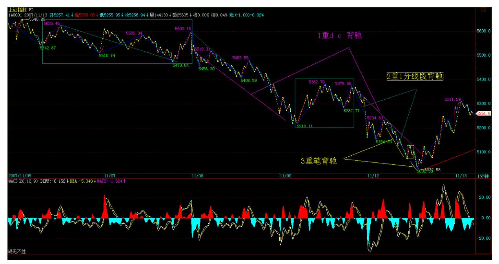

394 好好研究吧,这可能比讨论小康好还是富裕好更有意义。本 ID 要出差了,晚上飞机走,晚上的帖子肯定写不了,明天收盘再解盘。 不过,在外地,时间上可能不能太准时。另外,后面几天的晚上帖 子,估计很难完全保证,因为应酬肯定少不了,又要为茅台、五粮液 大大贡献一把了。最后,一句话,请问:要小康还要富裕?

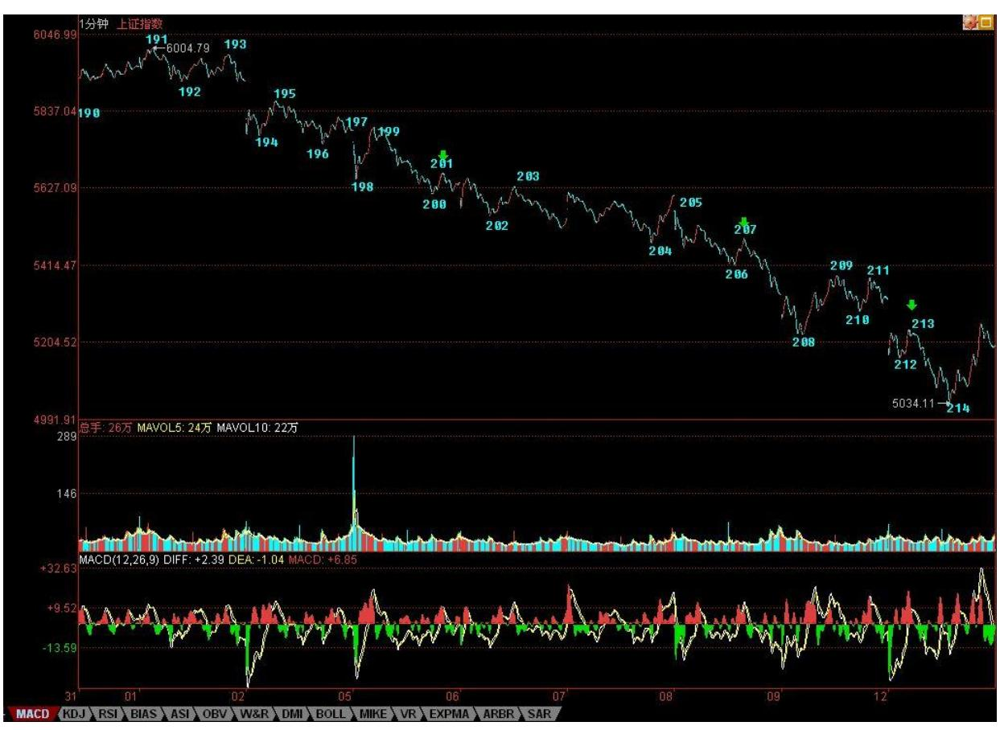

395 396 市场总是少数人成功(2007-11-13 08:27:42)本 ID 开始课程 时,有人还问一个很傻的问题,一旦都掌握了本 ID的理论,那理论还 有用吗?这种想法,就如同那种同样傻忽忽的逻辑,人人都有共产主 义思想,这共产主义就实现了。可惜,共产主义和什么思想没关系, 把老马的伟大堕落成培养共产主义新人的可笑,这就是这种逻辑的历 史悲剧。

市场总是少数人成功,为什么?因为只有少数人能真正把握自己。征 服世界,并不意味着你能把握自己。认识自己、把握自己,这比征服 世界更难。

当然,站在市场逻辑的角度,没必要为那些待宰的羔羊而煽情。问题 是,最重要的问题是,千万别把自己往羔羊里挤。因此,本 ID 也只 能抱着能惊醒一个是一个的心态。

没有人天生是羔羊,是你的心、你的眼界、你的行为让你羔羊。不修 炼自己,不在市场中磨练,羔羊永远只能是羔羊。

一个 1000 点,10%几的回调,已经让这么多人方寸大乱,以前随便就 是 50%、60%的调整,那不就真要尸横遍野了?该来的,总要来,市场 的重新真正走强,一定是在清理了该清理的之后,就像河道被淤积 了,不清理,能行吗?目前只是大牛市第一阶段的一个中级调整,这 一点从来没有任何的疑义。而本 ID 以前说过的股票,没有一只会放 弃的,等中级调整结束,会再度启动,而且有些已经开始预热,这也 是很显然的。但调整,首先必须先面对,这是当下的事,先处理好。

按照市场的节奏,6004 点跑掉的,昨天开始回补闹一闹反弹,反弹一 旦结束,就砸出去,没什么可犹豫的。图形告诉你一切,反弹是否结 束,一切尽在走势中。

关键是,你的心能如明镜一样,当下地映射出行情的真实走势吗?下 午收盘,马上有事,有时间再把解盘给出。在外面,只能如此,尽量 在宴会前给出解盘,否则,晚上回来估计也没可能写东西了。 人世皆 苦,才有修行的可能。有苦,真好。

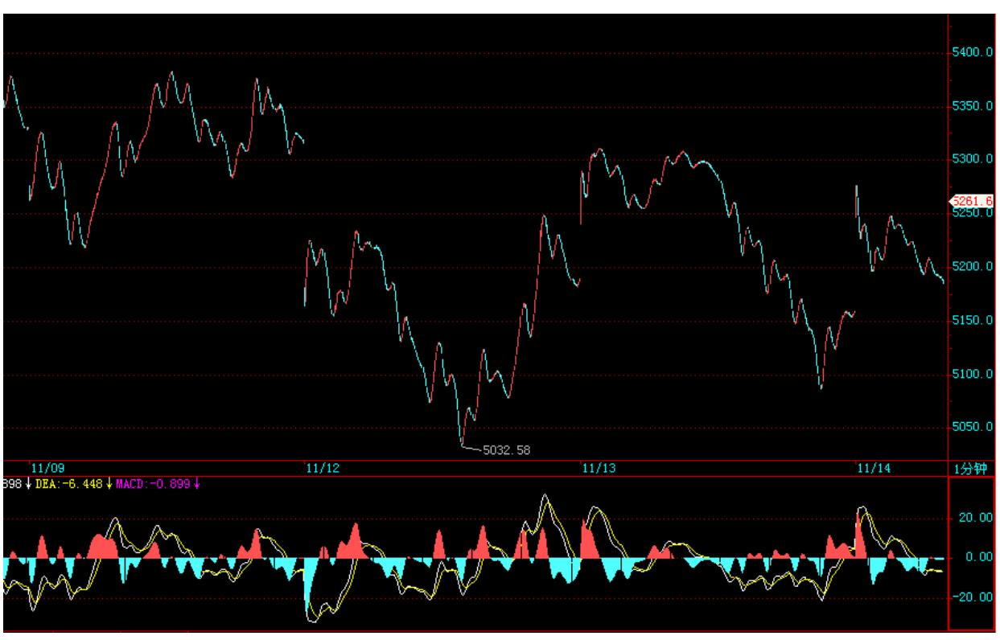

397 (2007-11-13 15:06:24)快速说几句。今天反弹受阻 5 日线,这是 最简单的走势,按本 ID 的理论,分型成立后是否能延伸为笔,关键是看 5 日线,只要不能重上,那么这个底分型就有破坏的可能。当然,一般 这底分型即使真的被破坏,也会在不远处形成新的能最终形成笔的底

分型,所以,多头还是有短线希望的,只是过程可能有点多灾多难, 例如,今天中午传出的CPI,就给早上的多头泼了凉水。但更精确的分 析,还是看昨天 1 分钟底背驰后的中阴走势,刚好课程说到这里,这 是一个标准的现场版本,请好好研究,仔细分析。

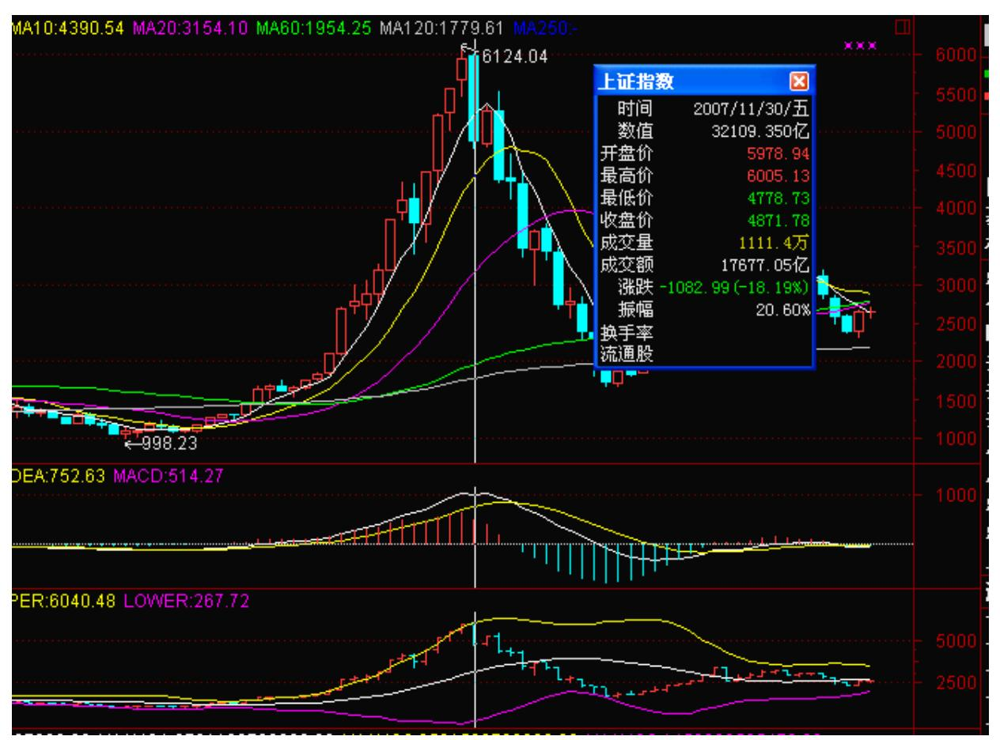

昨天说了,多头会如鲁男人一样狂踩不同板块去找路,今天下午的回 落,很多板块并没有破坏反弹的形态,所以多头还有继续努力的资本 的。

短线继续关注 5 日线,以及 1 分钟图上的中阴走势演化。技术差 的,就继续小板凳,等风和日丽再出来撒野吧。

听说北京今天要下雪,如果是也太无聊了,本 ID 刚离开,难道就让 本 ID 错过这 2007 年的第一场雪?拜托,雪还是别下了。

晚上如果酒后还清醒,就再见吧,否则,还是让本 ID 去见周公算 了。

抱歉,先下。

节奏爽了才是真的爽(2007-11-14 15:17:22)对不起,在外面,帖子就 不能保证了,请原谅。解盘还是保证的,但也只能快速说说。

昨天说得很明确,就是看 5 日线,因为昨天刚好构成底分型,所以今 天下午一站上 5 日线,大盘就强烈启动起来,这都是极端教科书的走 法,自己好好体会吧。

前两天的 1 分钟底背驰后,后面是一段中阴走势,各位可以看看本ID 的课程里关于为什么很多人抄到了底却拿不住,就是因为不明白中阴 走势的处理。更仔细的分析,只能等回北京后写课程时再说了,不过 这两天的走势,也很规范,是其中最简单的走势的标准版本,请好好 分析一下。

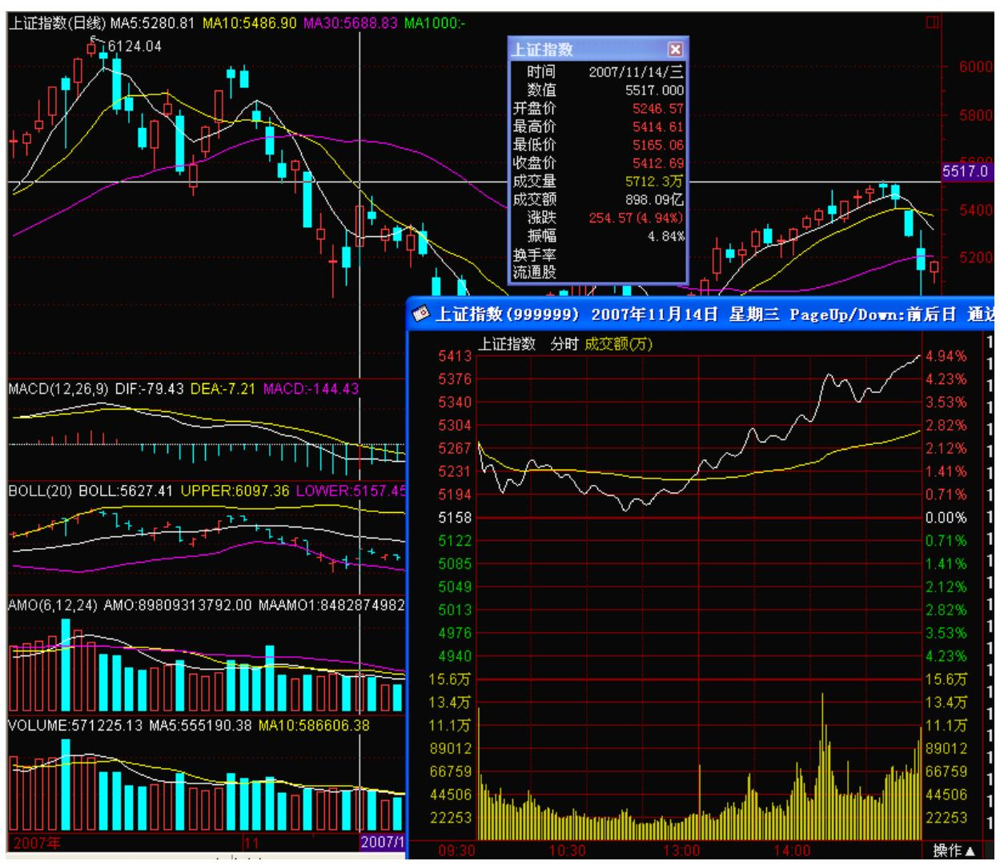

本 ID 的理论有没有用,从这次下跌到 1 分钟背驰的把握,到这个反 弹的全面处理就是一个很好的例子。这不需要你任何的其他渠道的消 息,图形告诉了一切。当然,前提是你看得明白,否则就是对牛弹琴 了。

本 ID 很肯定地给了多头如何利用 5 月均线对空头进行大埋伏的剧 本,看来,多头经过前几天的不熟悉,终于演得有点模样了,给朵大 红花。

下面的问题就是 5462 点重回后能不能站住,站住就有更大的反弹空 间。另外,注意期货的消息,如果最近有关于这方面明确的消息,那 么指数的走势就会有很大变数,也就是说,指数存在创新高的可能, 不过这和绝大多数人无关。

对反弹的把握,如果想懒点的,就看这个日线上的笔最终延伸的结 束,如果它有本事延伸到 10000 点,本 ID 也没有反对的理由。当它 没本事的时候,本ID 就把这几天买的拿出来开砸,如此而已。

只要重回 5462 点上,无论站住与否,都将形成一个大的中枢,所 以,中枢震荡一把,折腾一把甚至回来 N 把,还是很爽的。

个股方面,已经明确说过了,都会被踩一次,但如果期货消息很快出 来,那么还是中字头更牛一些。其实,各位看看中驴,就知道方向 了,你看这驴,从来都是最聪明的,无论涨跌,哪次不是领先于大盘 的?爽,要有爽的潜质。现在最危险的,反而是这种状况的,就是底 部没敢动,反弹 N 天后忍不住的,站在反弹的角度,反弹往往意味着 换岗。本 ID 现在没什么事,就等着多头没力的时候,把钢枪发给想 换岗的了。

所以,节奏是第一位的,节奏爽了,才是真爽。关于利用 1 分钟走势 底背驰进行抄底反弹的操作,已经提醒 N 天了,不管处理得怎么样, 都请好好反省,这样才会有真的进步。

先下,再见。 对不起,解盘晚了(2007-11-15 21:47:45)对不起,解 盘晚了。今天一收盘,就给抓去看企业,书记亲自出面,你说有什么办 法?来到下面,个个人都急着,把你当点石成金的圣手,苦呀,没办 法,

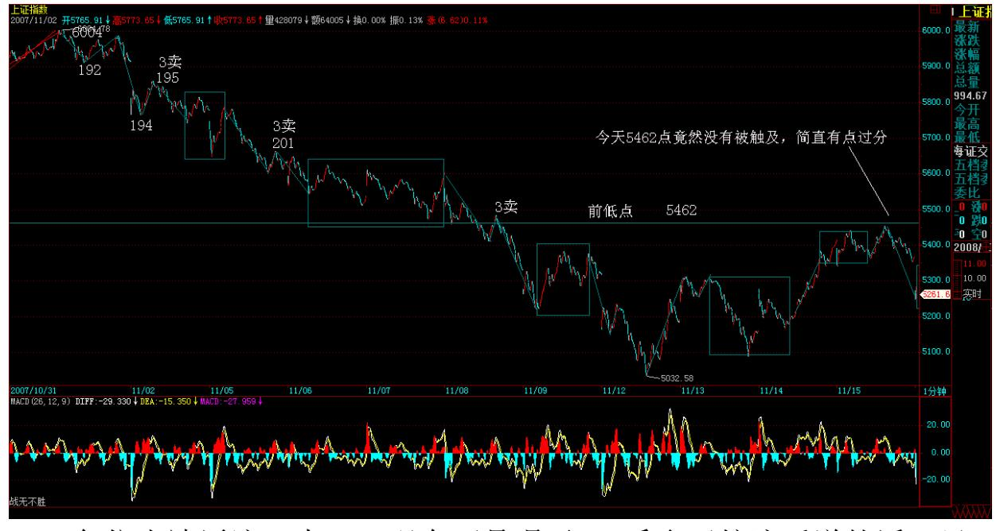

402 各位也请原谅。本 ID 现在可是喝了 1 斤多五粮液后说的话,虽

然相当清醒,但各位也知道,本 ID 这收盘后的 N 小时内受到的苦是 多么的深切。苦呀,苦。 今天5462 点竟然没有被触及,简直有点过 分。喝了点酒,本 ID 也真要狂言一句,没有本 ID 的多头,就是阳 痿的货。连 5462 点都不碰,多头难道想找死吗?本 ID 现在酒后胡 言,但不骂他们也不爽了。

今后几天,首先站上5462 点,让本 ID 觉得多头还有点男人的器官, 否则,本 ID 以后就宣告多头根本没头,都是中关村的货色,多头也 没什么可抱怨的。

这里,先说明一个典故,估计北京外的人都不知道。中关村,其实是 中官村,中官,就是太监,中国的第一所谓科技村,竟然就是历史上 的太监村,你说要哭还是笑?喝多了,也没必要技术什么了,5462 点,多头,想证明你们不是中关村的,就给搞上去,否则,后面本 ID 的题目就是:多头,都是中关村的货。

对不起,思维混乱,明天估计也没机会解盘了,周六回北京再补上。

北京,不总是中关村的。让中关村的太监太监去吧。北京爷们,请爷 们一下,别让本 ID 看不起你们。

洗洗睡吧,讨厌五粮液,最恶心的酒。下了,周六见。

多头,不要争当中关村的货(2007-11-16 15:25:28)快速说两句,明天 就回北京了,不知道雪下了没有?北京有中关村,多头,也不要争当 中关村的货,北京可不止中关村。

5462 点,连这都如此困难重重,本 ID 都没了骂多头的兴趣了。

这次出差,本 ID 还是深切感到了中国企业的创业热情。虽然,有些 手段,有点太那个了。例如,本 ID 这几天考察的企业里,就有从世 界性大公司出来,用完全盗用的技术,改头换脸地疯狂发展出来的。

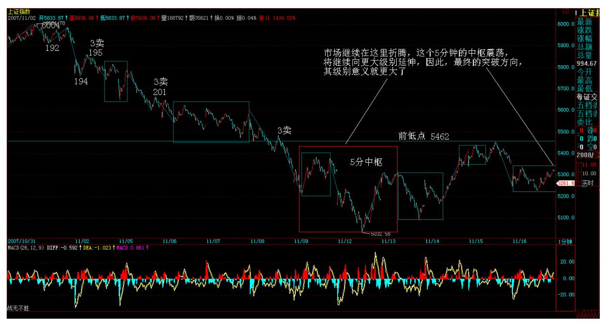

虽然本 ID 并不特反感这种企业,但这毕竟不是长久的办法,中国人 有足够的脑子,为什么一定要盗用鬼佬的?市场继续在这里折腾,这 个 5 分钟的中枢震荡,将继续向更大级别延伸,因此,最终的突破方 向,其级别意义就更大了,暂时,估计还需要一定的时间。

404 个股方面,依然是乱踩走势,暂时不会有太多板块具有持续的走 强能力,总之,就是来回折腾。

不说了,周末,本 ID 还要熬上最后一晚的饯行酒,明天就回北京 了。

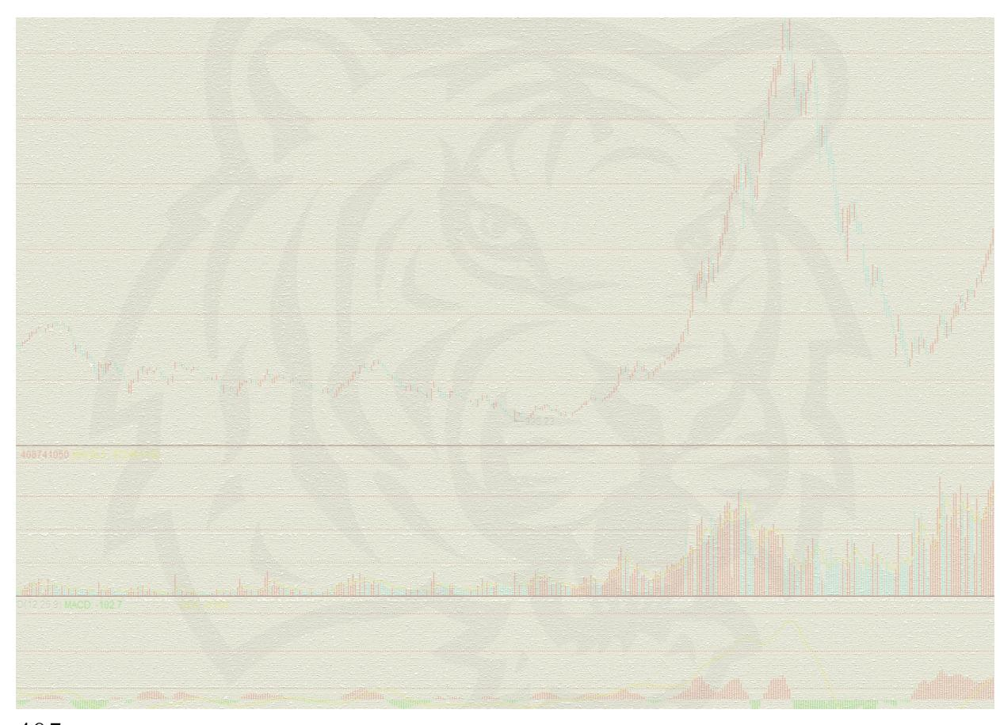
