# 教你炒股票 89:中阴阶段的具体分析

(2007-11-18 20:14:06) 大概很多人都想,上次说的中阴阶段也没什 么特别的,其实也是一个盘整,和其他的盘整也没什么不同。如果有 这种想法,就有大问题了。 中阴阶段能否处理好,关系到操作节奏的 连接问题。很多人的操作节奏特乱,就是因为不知道中阴阶段的问 题。中阴阶段,虽然表现为中枢震荡,但并不是一般性的中枢震荡。

(娇注:中阴后有上,下,盘市场发展在各种级别的可能性。) 另外,特 别要注意,精确的理论,当然也可以很粗略地说,例如,有人都知 道,市场不是上就是下或者就是盘整,这本质上是废话。但废话的另 一面,就是公理。这个废话,刚好表现了市场的本质。 就如同欧氏平 面几何里,说两点之间只能有一条直线。这对于常识来说,就是废 话。但这废话就是公理,关于欧氏平面几何里的公理,这个公理正好 反映了欧氏平面几何的本质特征。同样,市场不是上就是下或者就是 盘,这一点,刚好反映了地球上现在所存在的股市的特征。完全有可 能在别的星球上的股市,就存在第四种情况,那里有和我们的思维有

着完全不同的分类。 但更重要的一点是,知道了公理,其实什么都没 知道。这其实也是中国人思维里的一个大弱点。中国人喜欢大而化之 地讨论问题,结果最终讨论的都是废话,都是所谓的公理,或者说就 是我们的共业所生的东西。 但科学,特别对于具体操作来说,这些大 而化之的东西,没有任何意义。例如,市场上的操作,是一就是一, 多一分不行,少一分也不行。所以,这里,必须有严密的逻辑思维习 惯,而且是精确思维的习惯。 我们从公理出发,并不意味着我们就停 留在公理的水平上。否则,欧氏几何就是干瘪瘪的 5 条公理,那还研 究干什么?同样,讨论市场,不是上就是下或者就是盘,那样什么都 别研究讨论了,抛硬币就可以。 中阴阶段的存在,就在于市场发展具 体形式在级别上的各种可能性。这些可能性的最终选择,并不是预先 被设定好的,而是市场合力的当下结果,这里有着不同的可能性。而 这些可能性,在操作上并不构成大的影响,因为都可以统一为中阴过 程的处理。

例如,这次从 6004 点开始的 1 分钟级别下跌背驰后,就进入中阴时 段。首先,根据走势分解的基本定理,就知道,其后的行情发展,一 定是一个超 1 分钟级别的走势。但超 1 分钟级别的走势,存在很多 可能,就如同一个人死后在中阴阶段,也存在着多种可能:人、鬼、 神、阿修罗、地狱、畜生等等。 这些可能,首先一个最基本的原则 是,必须先出现一个 5 分钟

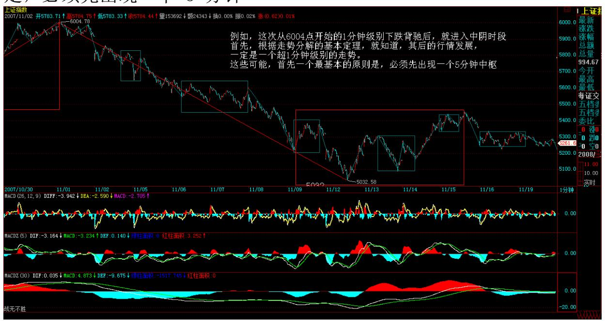

中枢,因为无论后面是什么级别的走势,只要是超 1 分钟级别的,就

一定先有一个 5 分钟中枢,这没有任何特例的可能。而这个 100%成 立的结论,就构成我们操作中最大也是 100%准确的基本依据。

1 分钟级别的走势后,你不能说他一定是下还是上还是盘,因为都有 可能。但你一定能说,他最终必须先有一个 5 分钟中枢,这是 100% 的,而且,只有本ID 的理论才能明确给出这样的必然结论。 3 有了 这个结论,一切关于行情后续演化的争论都没有了意义。不管后面是 什么,首先把这 5 分钟中枢给处理好,这才是唯一重要而且有着 100%操作性与准确性的事情。 因此,你在操作中,脑子里必须有这样 一个 100%准备的判断。而 5 分钟的中枢震荡如何操作,那是最简单 的幼儿园问题,如果还不懂,上面有 88 节课程,请好好再学学。 当 然,如果你是按 5 分钟以上级别操作的,那么这个 5 分钟中枢的中 阴过程对于你来说可以说是不存在的,你可以根本不管。 而这 5 分 钟中枢成立后,就必然 100%面临一个破坏的问题,也就是一个延伸或 着第三买卖点的问题,而这也是超级幼儿园的问题,不懂就回头学。 当然,如果这中枢不断延伸,搞成 30 分钟中枢了,那就按 30 分钟 中枢的第三买卖点来处理,如此类推,总要面临某一个级别的第三买 卖点去结束这个中枢震荡。 一般性的,我们可以以 5 分钟中枢后就 出现第三类买卖点为例子,那么,这个 1 分钟的走势,就演化为 5 分钟的走势类型了,至于是只有一个中枢的盘整,还是二个中枢的趋 势,那用背驰的力度判断就可以把握,这也是幼儿园问题。 例如现 在,如果已经形成的 5 分钟中枢出现第三类卖点,那么,就算共同富 裕的目标达不到,全面小康肯定是没问题了。 从上面就可以看到,本 ID 的理论是这样把一个看似复杂,没有方向的中枢问题,以 100%准 确的逻辑链连接成一个可以100%具有准确操作度的简单操作程序,而 这,不过是本 ID 理论的最低级威力而已。 这里,必须再次说明,本 ID 理论的盘整和一般所说的区间震荡盘整的概念不是一回事,指数从 10000 点跌到 0 也可以是一个盘整,只要中间只有一个中枢。另外, 盘整和中枢也不是一个概念。中枢如果是苹果,那么盘整就是只有一 个苹果的苹果树,而趋势就是可以有两个以上直到无穷个苹果的苹果 树。你说苹果和苹果树是一个概念吗? 另外,千万别以为盘整就一定 比趋势弱,有些盘整,第一段就杀得天昏地暗的,后面一段,即使力 度没有第一段力量,两者加起来,也可以超越所谓的趋势了。还是上 面的比喻,只有一个苹果的苹果树,难道一定比有 100 个苹果的苹果 矮?显然不是的。

4 所以,那些连中枢、盘整、趋势都没搞清楚的,就请虚心点好好去 学习。本 ID 的理论,不会因为多一人学了而多一分准确性,更不会

因为少一人学了多一人反对了而少一分准确性,这就如同三角型之和 180 度,只要在欧氏平面里,你爱信不信,都不会变成 179 度的。

\*\*\*\*\*\*\*\*\*\*\*\*\*\*\*\*\*\*\*\*。

解盘及互动问答:

#### \*\*\*\*\*\*\*\*\*\*\*\*\*\*\*\*\*\*\*\*。

1. 网友雨天:相信猴哥对我问过老大的这个问题有印象。缠子:在看 高级别 K 线图时,是应该把低级别图上的分段转过去,还是重新分笔 找线段?有时候这两种做法的分段是不一致的。 但是老大的答复好像 侧重于两套相差较大的 K 线图,并没完全解决我的疑问,比如那天说 到大盘 30 分上 11 笔的问题,猴哥的答复是要结合次级别。我的理 解是对高级别图来说,次级别又有次级别,是否要一直看下去?一直 看下去的结果势必等同于从 1 分图推上来。 结合我前面的问题,30 分钟图上的两笔,5 分钟图上可能其一仍然为一笔,另一笔可能为上 下上 3 笔,此时该如何分解?能否认为它们在 30 分钟图上都是不可 再分的次级别走势?2007-12-04 00:43:38 网友石猴:一般不太需要 看次次级别图,除非某些局部需要。两种分析方法不需要一致,因为 用的地方不一样啊。看大的趋势用大级别图,比如你看 30分钟的图, 看日线图,看 5 分钟就足够了,不需要再看 1 分钟的图。但 30 分 钟图上中枢的每一段,也就是每一个 5 分钟级别走势如何结束,就要 仔细看到1 分钟图了。上面也就是老师说的侧重点不同。 缠师: 两 种分析都是你的工具,你的目的是要看下面会怎么样,这就够了,为 什么要一致?自己对照几个级别图多看,看多了就会明白这里的精 妙。2007-12-04 02:20:26

#### \*\*\*\*\*\*\*\*\*\*\*\*\*\*\*\*\*\*\*\*。

2. 网友雨天:在 36 课里有一个例子,其中提到一个 30 分钟的中 枢,当时还没有笔、线段的概念,在 5 分钟图上,其 3 段次级别走 势分别是 1、3、5 笔。那个例子感觉比较典型,是不是所谓次级别, 需先确定本级别,本级别以下,次或次次级别,都可以不再细分?5 从该例子理解,好像所谓次级别,在确定本级别后,本级别以下的 次、次次级别,都是当作次级别来处理的。再有,就是在线段划分属 于第二种情况时,有时一段延伸很长,但在 5 分钟图上却是明显的好 几笔形成类中枢。按多义性理解,应该所有的分解(正确定)都是有意

义的。 网友石猴: 这个问题,在我那个级别,谁的级别那个帖子里 已经说了很多了,你再去看看吧。唉,我已经反复说了很多遍了,明 白的人还是不多。 另外,还有个概念还得提提:这里说的 5 分钟中 枢,是从 5 分钟图上看到的形状直接找出,大概相当于从 1 分钟图 用笔,和线段得出的 1 分钟级别中枢。但这种找出不是乱找的,也同 样是由定义来的,也是由次级别走势定义来的,大略直接在高级别图 上用笔的效果。有时候笔不是很准,要参照次级别图来分析。上次那 个级别的帖子,说的主要就是这个意思。这两种中枢是什么关系呢, 用个类比大概解释下,比如直接从 30 分钟图上找出的中枢,相当于 你看到一棵树的外貌,树干。而从 1 分钟图上,用笔和线段直接递推 的 30 分钟中枢,相当与这个树干内的经络。从这两种,都可以分析 走势,用小缠的话说:有两种方法看一个东西不是更好吗。2007-11- 29 23:41:30

#### \*\*\*\*\*\*\*\*\*\*\*\*\*\*\*\*\*\*\*\*。

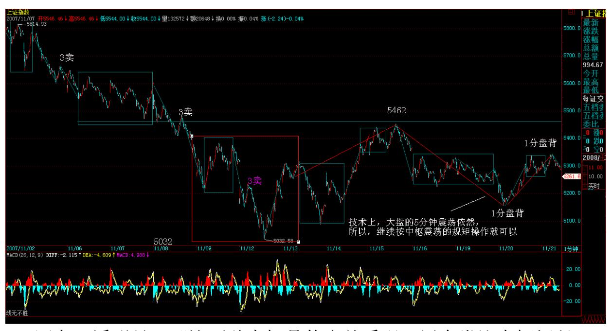

3. 网友一溪明月:"这两种中枢是什么关系呢,用个类比大概解释 下,比如直接从 30 分钟图上找出的中枢,相当于你看到一棵树的外 貌,树干。而从 1分钟图,用笔和线段直接递推的 30 分钟中枢,相 当与这个树干内的经络,从这两种都可以分析走势,用小缠的话说: 有两种方法看一个东西不是更好吗。" 猴兄,这个比喻好,一点即通 了。2007-11-29 23:45:23

缠师:阶级斗争,打土豪,分田地。(2007-11-19 15:13:40) 快速说 两句。今天就是大搞阶级斗争,把中国神(华)、(石)油为代表的 大土豪给狠揍几下,然后像奥运、VC、军工等等的垃圾股票就显摆显 摆。 但阶级斗争,经常有胡汉三又回来的时候。反正,题材垃圾与中 字神油,来回折腾的局面是一时难以改变了,这就构成了最基本的两 大阵营的轮流举旗。 技术上,大盘的 5 分钟震荡依然,所以,继续 按中枢震荡的规矩操作就可以,当然,现在指数的意义不断下降,所 以可以根据具体板块的图形决定操作。 6

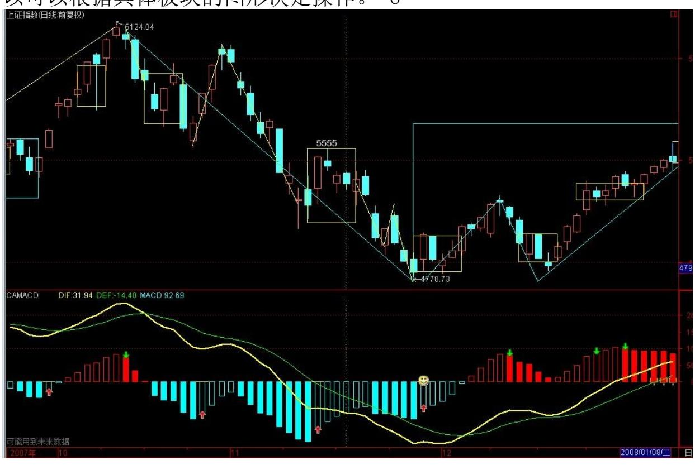

7 中线的角度,目前 5 月线依然能被守住,所以本月收盘很重要,只 要能守住 5 月线,多头就算成功了,否则,后面多头被屠杀就不值得 任何同情了。 目前,中枢震荡中,就是涨不上去杀多头,跌不下来杀 空头,两头杀,才是正路。当然,你需要有这工夫,否则连中枢都分 不清楚,那还是拿小板凳吧。

至于个股,本 ID 说了,本 ID 说过的个股,站在中长线的角度,现 在还没有一只会放弃的,因为中长线的能量都依然充足。只是利用这 次调整,该杀点差价的搞点差价、赚点筹码,没筹码的也好好找机会 储备点,不能把东西都今年吃了,明年还要开大餐,总不能明年才准

备吧。 至于像中国神油之类的东西,肯定也是要储备的,只是如果有 更理想的价位就更好了,例如神华,那煤液化的项目一旦投产,明年 石油又被搞上 150 元,你说他有没有价值?不过现在 60 多,确实有 点不爽,不过要太砸下去也会有点困难,那就折腾着搞,震荡着把成 本搞低,有机会再搞低点,没机会就算了。其他的铝呀油呀的,都是 这种心态:动态回补或动态建仓。当然,如果给一个狠砸的机会,本 ID 也不会反对的。不过,会有吗?即使有,也只有一次。这一次是否 能真出现,那就把现实照进梦想吧:不强求,不放过,大概是目前最 合理的原则了。先下,再见。

管理层终于又做对了一次 (2007-11-21 15:36:59) 今天,最重要的消 息,就是关于 AH 股上市顺序的问题,今天这个比较官方的表述证 明,A 股的重要性再次得到加强,以后港股被吸收进来的命运是不可 逆转了,只是时间长短的问题。更重要的是,本 IDN 个月来到处大声 呼吁要大幅度提高 A 股大盘流通比例终于有了一个切实的解决。以后 的问题就是,新发行的大盘股,一定要达到流通比例 10%的底线,前 面这些投机性蓝筹,将不会再出现。 今天这消息,有着正负两面的影 响。正面影响是:1、A 股的重要性将大幅度提高。2、现在的非法投 机性蓝筹,反而成了稀罕货,一旦指数期货出来,这些股票的控盘重 要性就更为加大。反面影响是:1、原来低比例蓝筹这历史问题如何解 决。2、以后扩容的压力将进一步加大,由于流通比例加大,那么太高 的价格将受到影响。 现在的大盘,技术上是中阴阶段,政策上也同样 如此。因此,后面中阴阶段的突破方向就很重要了,当然,向下突 破,也不是世界末日,只是为明年的行情留出空间。

后面最大变数还是期货问题。 个股方面,今天是神油分裂,所以大盘 是上下折腾幅度加大,这也是一个很好的控盘试验。大盘要想真站 住,首先要神油合一都站稳。 月亮快圆了,大家都开始烦躁起来,是 否又来一次天人合一的闹剧,很快就知道了。 至于其他个股,本 ID 现在都不想说太小盘的股票,像那个等比股票,这次调整,一下砍下 来一半,这就是小盘股的风险。最近,其实本 ID 新搞了一个等差股 票,盘子比等比大点,价格涨起来也就 7 元多,市值比等比更小,但 也又是 ST 的,所以就一直没说。其他的股票,都等着折腾的机会, 不过大盘方向未定,本 ID还有把现实照进梦想的想法。 小康了,接 着是全面小康,还是更雄伟的富裕,这确实是一个很现实的问题。但 有一点是必然的,昨天也说了,即使再次破位,陷阱的可能性也就大 了。 又来电话,说人到了,没办法,不能多说了,要走了。先下,再 见。

又是月亮惹的祸 (2007-11-22 15:32:48) 昨天说"月亮快圆了,大家 都开始烦躁起来,是否又来一次天人合一的闹剧,很快就知道了"结 果今天就应验了,看来大伙对全面小康真的充满了热情,虽然周六才 是十五,但这热情已经要十三就闹剧一把,这也太热情了。 当然,站 在纯技术的角度,虽然小的 1 分钟级别的第三类卖点早上就有了,但 目前的破位是否能形成大的 5 分钟第三类卖点,还是一个未知的事。

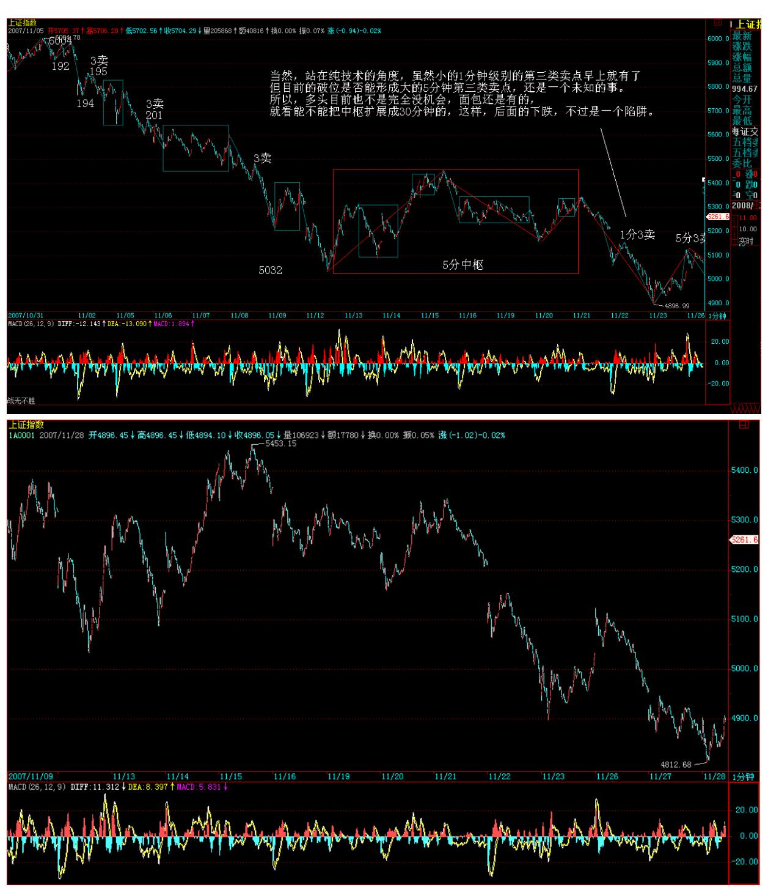

所以,多头目前也不是完全没机会,面包还是有的,就看能不能把中 枢扩展成 30 分钟的,这样,后面的下跌,不过是一个陷阱。 10 12 当然,是否陷阱,用是否出现大的第三类卖点以及出现后背驰出现的 位置就很容易判断了。另外,中枢震荡操作的原则,从来都是冲不起 来,在次级别上涨背驰的时候卖,跌下来,如果不形成中枢下移,而 最多只是中枢扩展,那么就在次级别下跌的背驰时候买。这是最基本

的方法,N 堂课前就反复说过,这里再提醒一下。 上面说的,都是给 有技术,或者对技术已经很清楚的人说的,没技术的,本 ID 一直给 的建议还是小板凳。 中线上,如果这月收盘多头依然过于窝囊,连 5 月线都确认失手,那么,10 月线就是下一个比较靠谱的支持。但站在 日线角度,120 日的半年线快到了,无论是否有效跌破该线,在该线 上下至少有一个大反弹去确认 5000 点是否有效跌破。 个股方面,有 技术的,可以对明年有前途的股票进行动态关注,长期关注一组股 票,对熟悉股性是很重要的。你对股性熟悉了,操作起来就更有把 握。 现在的操作,都要为明年去打算。对关注的股票,可以在反弹操 作中动态介入,熟悉其股性,等中级调整完成后,多野的马也给你驯 服了,那时候全面介入完全熟悉的股票,赚大钱还不是天经地义的事 情? 其实,股票某种程度和做生意一样,不熟不做,做熟了才能赚大 钱。没有点耐心,整天等着天上掉馅饼,那还不把天上做馅饼的都给 累着了? 今天比月亮惹祸更高兴的事情,莫过于英格兰队没吃到天上 掉下的馅饼。早死早投胎,股市如此,英格兰队也如此,整天中阴也 没意思。

对不起,晚到的解盘 (2007-11-25 22:00:34) 回来了,不过要开打一 个股权收购战。因此,请各位原谅。 前面说了,在 120 天线附近, 最坏情况也肯定有至少一次对 5000 点的反抽,大盘周五走势其实就 来自演绎这剧本。问题在于,给多头最后一次机会,多头能否给点勇 气,依靠 120 天线站住 5000 点,下周就要分晓。

13 5163 点(注:5 分中枢ZD)是一个关键的位置,能重新上去,就 是继续中枢震荡,否则就要严重考验 120 天支持。下周,是月线收 盘,如果不能收在 5 月线附近,那么后面将要去考验 10 月线支持。 注意,从中长线角度,月线的顶分型成立后,唯一重要的事情就是是 否延伸为笔,一旦延伸为笔,那么在月的底分型出来之前,大盘不会 有任何中长线上实质性的上涨。

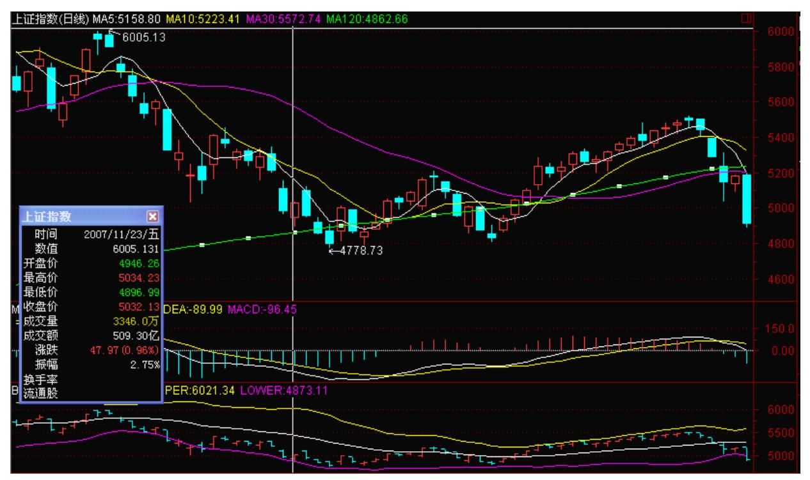

14 个股,题材股已经有些开始骚动了,除了那些特别兴奋的,一般大 的骚动,还是在明年。中字头,在中石油完成其本 ID 在上市当天就 说的类中国人寿走势前,都会被反复折腾,毕竟,好多人都怀有残暴 的倾向,企图对这些中字头进行打击。

15 不过,打击只是为了拿到足够多以及足够便宜的筹码,只是在这样 一种酷刑下,死扛永远都是痛苦的。本 ID 对老虎凳之类的玩意没兴 趣享用,本 ID 只知道,在大买点出现后买,不需要享用老虎凳。 没 什么时间写了,今天,一轮合同大战估计要通宵进行,本 ID 要忙去 了。 现代战争中,最凶狠的往往是股权之战,往死里杀人吧。先下, 再见。

抱歉,刚回家,还要忙 (2007-11-26 23:59:35) 抱歉,刚回家,还要 忙。这股权之战开始白热化,无耻招数要开始用上了。其实,最无耻 的就是打败仗。胜者为王,丛林法则。别讨论丛林法则如何无耻,如 何不应该,在血腥之中,生存是第一位的,丛林中,难道还有比丛林 法则更不无耻的? 股市同样是一个丛林,同样有着最伟大的丛林法 则,就是这么血腥,怎么了?中石油,就要无耻地继续类中国人寿的 走势。多头,站不上 5163 点,就是要被强暴地打击,没什么可讨论

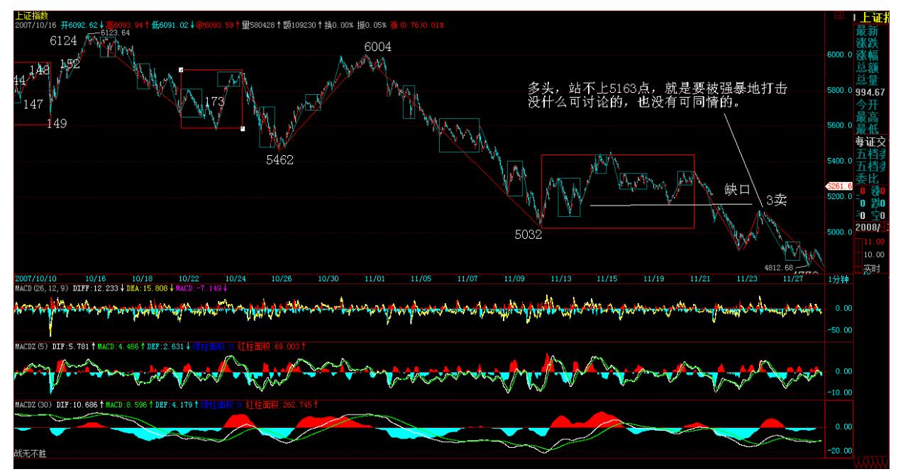

的,也没有可同情的。 16 不过,120 天线应该有足够的弹性。也就 是说,在这附近,还会来回折腾。现在的走势,本质上的多空齐杀才 能活得很好。也就是说,本质上,任何的急跌都将构成大震荡视角上 的空头陷阱,由于下月 10月线将快速上移,因此,10 月线与 120 天 区间将为震荡留下足够的陷阱制造空间。 对于长线来说,250 天是关 键的,也就是所谓的牛熊分界,在没有有效跌破该线之前,谈论牛市 的结束都是无聊的。 17

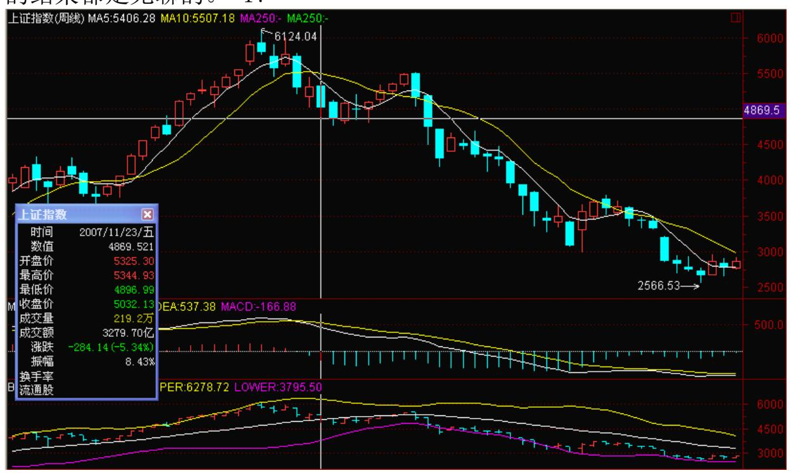

中短线操作,可以多关注 120天、10 月线等制造的空头陷阱,但必须 暂时以反弹的眼光来进行具体的操作。 如果关注周线图的,可以看看 6124 点那周前后构成的顶分型的威力。那么要化解这个顶分型,必须 首先要构造一个底分型,以此来完成一笔的运行。因此,后面的走 势,就在一个底分型的探求与构造之中。站在这个视角,就会对后面 N 周的走势,有一个更大视角的把握。

18 最近太忙,除了开盘那 4小时,基本都忙不过来了。所以解盘都不 能准时,但一定都会回来后补上,过了这几天最关键的时间会好一 点。抱歉,再见。 时间错乱还有两天,抱歉了 (2007-11-27 23:54:13) 这几天,真是疯狂了,时间也跟着错乱,这种状态还需要 两天。写完这帖子,还要修改一个文件,再坚持两天吧。 今天的大 盘,走得没什么可说的,5160 点上不去后的延续性走势而已。站在周 K 线角度,因为本周肯定新低了,所以这周 K 线肯定完成不了底分型 的构造。站在周线角度,只要 5 周线不能重新站住,基本可以不看这 个盘了,爱跌到多少都行。

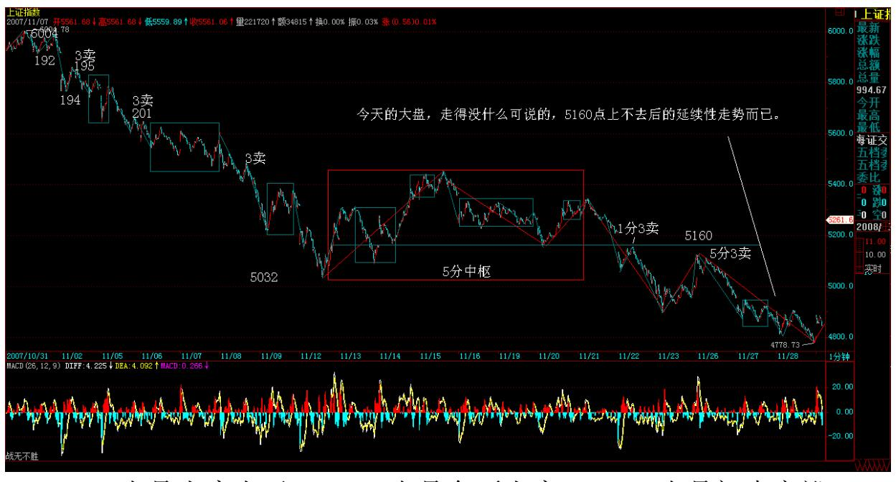

19 1000 点是小康水平,1500 点是全面小康,2000 点是初步富裕, 2500 点中等发达,3000 点是实现现代化,3500 点叫什么好呢?请建 议一下。 不要恨。 20

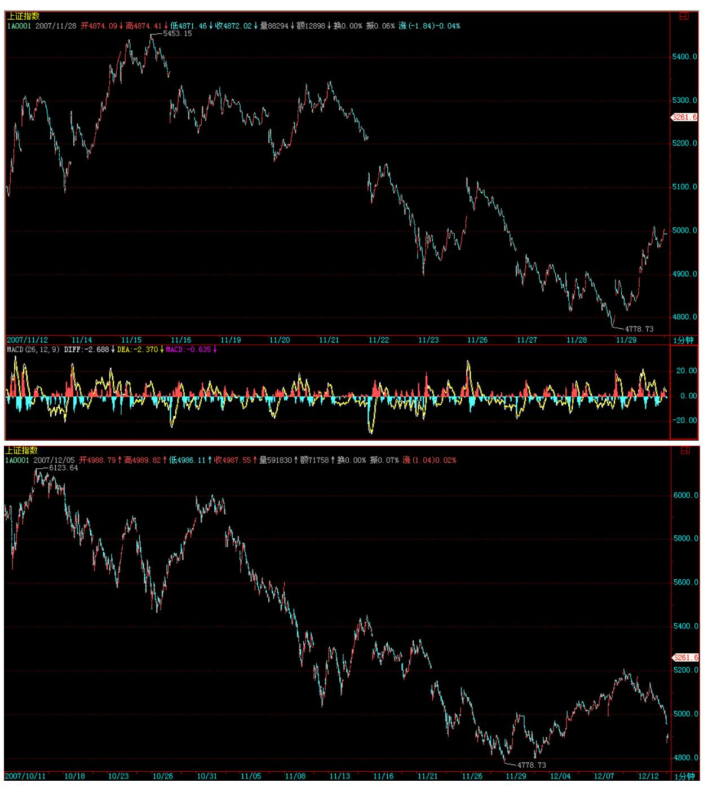

21 不说了,累了,再见。

22 120 天支持终显威力(2007-11-29 23:53:11) 今天的收购小决战出 现比较好玩的局面,一场好戏,还要继续唱下去。从明天开始,大概 可以逐步正常,这几天的时间错乱,对不起了。 大盘的走势,不太错 乱。本 ID 在前面说了,跌破 5000 点,只是一个空头陷阱,而 120 天线有基本支持,即使继续下跌,也不过是继续构造空头陷阱。今天

大盘拉回 5000 点之上,使得一个更大级别的中枢在扩展开来。 (注:拉回 5000 点,而前 5 分中枢 DD 是 5032,中枢扩展此时是 未完成的)也就是说,5000点上下,将扩展出 30 分钟的中枢,后面 的走势,就可以用这 30分钟震荡的观点来观察,当然,如果这 30 分 钟竟然震荡出第三类卖点,那么全面小康、初步富裕都不是什么奇怪 的事情。这里无须预测什么,只要看好这震荡就可以把握了。 不过, 如昨天所说,大盘没有选择在 120 天线下制造更大的空头陷阱,因此 反抽的意义将有所减弱,首先看 5 周均线,如果能站上去,那么力度 将大点,否则后面再次探底的压力依然不可小视。 目前的操作很简 单,就是继续以中枢震荡的观点处理,只是这次的震荡级别更大而 已。操作上,依然是游击战,至于阵地战之类的玩意,就留给多头和 空头。本 ID 的操作思路很简单,就是放冷枪,放暗箭,专挑多头空 头没力的时间落井下石。

多空齐杀,找准机会落井下石、突施冷箭,这从来都是震荡行情中的 不二法门。震荡中的利润,从来都是在多头空头的尸骸中炼出来的, 虽然残忍,但却是震荡行情的生存之道。 市场中,最大的残忍就是把 自己送上断头台;市场中,最崇高的道德就是踩着节奏错乱者的尸骸 前行。市场就是市场,装道德孙子的,不是早死的就是即将死的,有 必要听他们的道德说教吗? 当然,请一定注意。当你还没有成为钢铁 战士之前,还有一个最好的全身之道:就是在大级别的调整中紧抱小 板凳,不参与一切的反弹。 宁愿错过,绝不过错,伟大光荣正确的小 板凳。

23 周末继续效应 (2007-11-3015:20:29) 今天开始正常。 今天的大 盘同样正常,也就是继续周末效应。大的走势上,继续是 5000 上下 的震荡。下周,反复强调的 10月线上移,而 5 周线下移,因此,这 构成大盘震荡的两个夹板。所谓夹板,就是上破是多头陷阱,下破是 空头陷阱,总之,到处是陷阱,多头空头都没好日子过。 昨天,再次 强调小板凳的伟大正确光荣,这是所有技术有问题的人的护身符。这 护身符,从 6100 点就强调到今天。不过,就算小板凳是红宝书,也 不能整天拿着跳忠字舞。如果想进步,最终还是要学会抛弃小板凳, 学会在震荡中赚钱。 当然,如果真学不会,就不必要学了。并不一定 每个人都需要变得英明神武的,

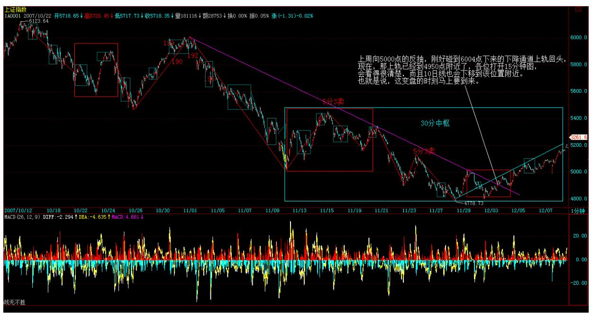

如果每个人都这样英明神武,那么小板凳不是就要滞销? 至于震荡的 操作技术,是必须磨练出来的,所以如果没有这种磨练的决心,还是 买把小板凳,这样更有意义。 什么时候不再用小板凳?等大盘整个风 给转过来了,底部经过确认后,才无须小板凳。现在,还在第一次的 探底之中,也就是大盘的第一只脚还没有落地。而大的底部构造,往 往需要两只甚至两只以上脚落地去确认,站在这个角度,小板凳还要 旺销紧俏一段时间。 不过,由于本月大长阴线,因此下月一定有较大 反抽去攻击本月阴线的实体部分,所以对于钢铁战士,以及准备成为 钢铁战士的,可以密切关注一个大的反抽的准备与介入时机。 个股方 面,很多题材股已经压制不住了,指数其实已经反映不了很多股票的 走势,所以,如果你是钢铁战士以及准备成为钢铁战士的,更多应该 关心个股的走势,指数走势只能成为参考。 技术上,周线、月线上底 分型已经构造完成的股票,显然是最值得关注的。当然,如果你的手 脚特别麻利,日线上底分型构造完成的也可以注意的。如果再进一步 考察个股,就要看他在大的级别中是什么类型的中枢位置,这可以进 一步确认较大力度爆发的可能性。 本周太累了,要好好休息一下。

24短线面临变盘 (2007-12-0315:26:04) 上周向 5000 点的反抽,刚 好碰到 6004 点下来的下降通道上轨回头,现在,那上轨已经到 4950 点附近了,各位打开 15 分钟图,会看得很清楚,而且 10日线也会下 移到该位置附近。也就是说,这变盘的时刻马上要到来。

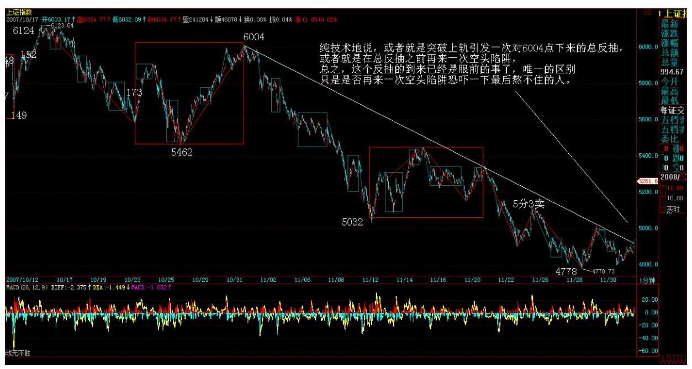

25 26 其实,站在个股方面,很多个股已经反抽不少了,指数走成这 样,都是神油在做怪。不过那油也快破 30 了,第一基本目标也基本 达到,唯一有变数的只是是否要破一下 30 恐吓一下最后的不坚定分 子,这就对应了大盘是否要再走一空头陷阱的选择。 本 ID 曾经说过 的个股,已经反复说过,一个都不会少地继续折腾下去的,其实有不 少已经比大盘要提前走好了。其他个股,一旦大盘走好,都会有所反 应的。 不过,这次反抽后,至少还有一次探底确认的过程。10 月 线,站在中短线角度,应该是比较重要的,至于下面,就是 250 天线 的位置的,在跌破 250 天线之前,根本没有探讨牛市是否结束的必 要。 中长线角度,目前,比较不明朗的是那经济会议是否有比较猛烈 的措施,但无论那会议有什么措施,应该不会造成致命的影响,只是 会被利用去清洗不坚定分子。 为了那收购的事情,某集团的头专门从 香港跑过来,正在下面等着,本 ID 要去应酬一下,先下,再见。 27
