# 教你炒股票 90:中阴阶段结束时间的辅助判断

(2007-12-0322:33:08) 注意,这里给出的是中阴阶段结束时间的辅助 判断,并不是一个绝对性的判断,如同用 MACD 判断背驰一样,只是 一个辅助性,但由于准确率极高,绝对的判断反而因为太复杂而不实 用,所以就可以一般性地利用这进行判断。一般来说,这个中阴阶段 结束时间的辅助判断的有效性可以达到接近 100%,很少有例外。 当 然,由于是辅助性判断,所以技巧性与熟练程度就很关键了。这就如

同玩杂技,训练有素的上台出错的几率很小,而一个训练都没有的一 上台肯定出错。

这个辅助判断,可以利用所有软件都有的一个指标:布林通道。一般 在软件上都用 BOLL 表示。该指标一般都三条线,上、中、下三个轨 道。一般性地,在上轨以上和下轨以下运行是超强状态,一般中枢移 动时肯定会出现,唯一区别是前者是上涨超强,后者是下跌超强。 注 意,用这个指标有一个很好的辅助判断第二类买卖点,有时候也可以 用来判断第一类买卖点。一般来说,从上轨上跌回其下或从下轨下涨 回其上,都是从超强区域转向一般性区域,这时候,如果再次的上涨 或回跌创出新高或新低但不能重新有效回到超强区域,那么就意味着 进入中阴状态了,也就是第一类买卖点出现了。 但更有效的是对第二 买卖点的辅助判断,一般来说,在进入中阴状态,上轨和下轨都会滞 后反应,也就是等第一次回跌或回升后再次向上或下跌时,上轨和下 轨才会转向,而这时候转向的上轨和下轨,往往成为最大的阻力和支 持,使得第二类买卖点在其下或其上被构造出来。一个例子,就是上 海大盘在 6004点时构成的第二类卖点,还有一个例子就是 6 月 20日 那天的第二类买卖点。 28

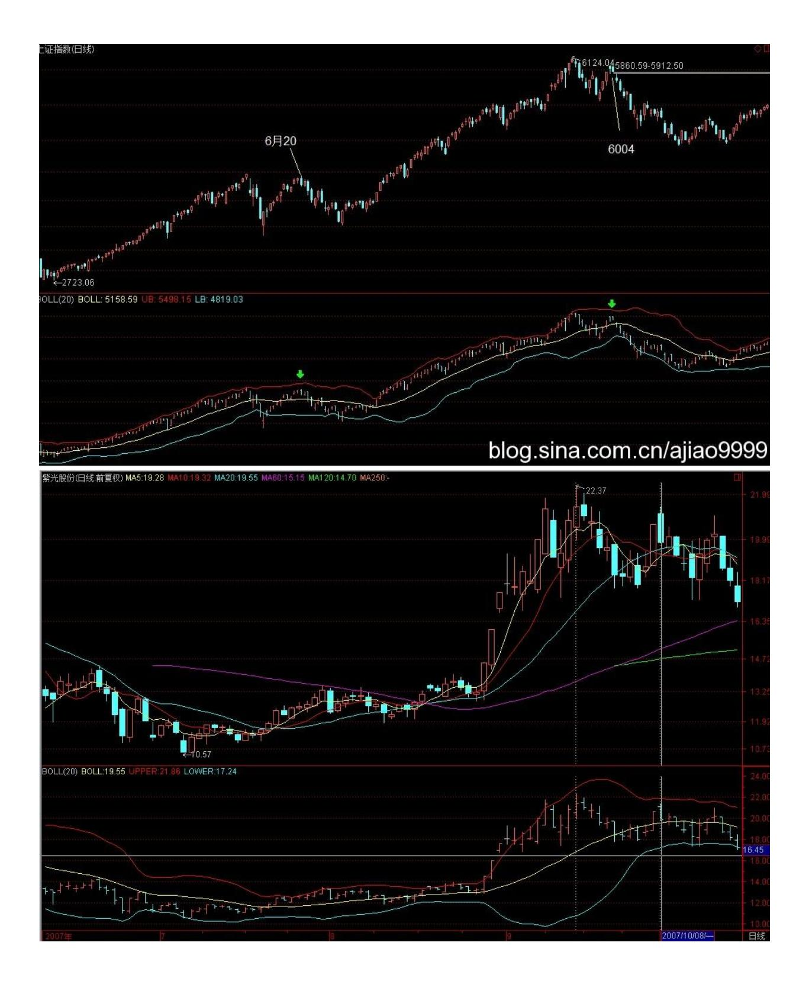

个股方面,000938 是

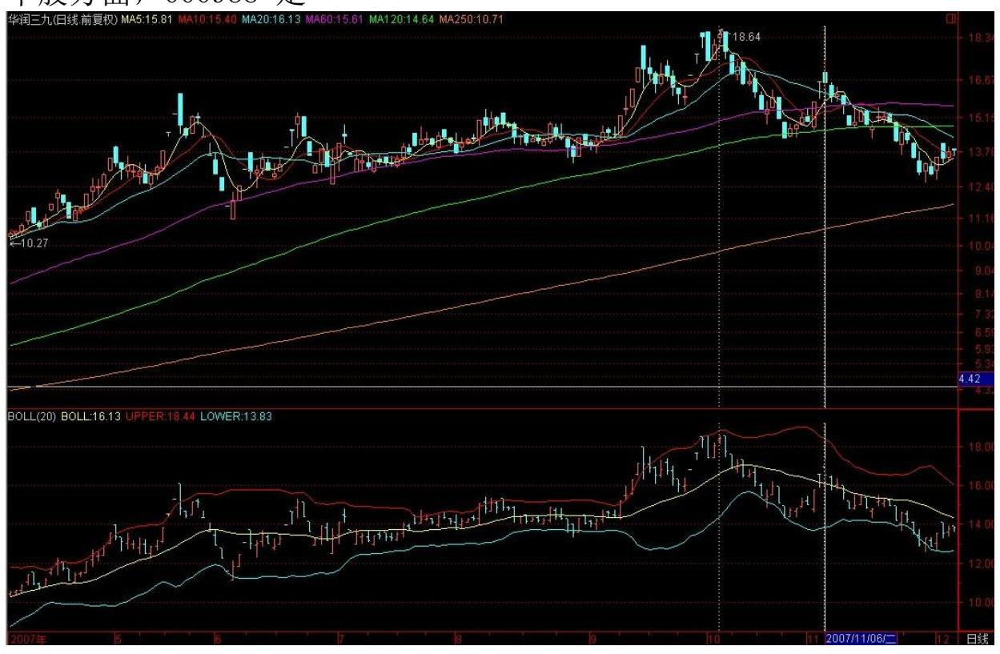

一个经典的例子,9 月 14 日的第一类卖点,10 月 8 日的第二类卖 点,太教科书了。

30 000999 的 10 月 10日的第一类卖点以及 11 月 6 日的第二类卖 点,也同样教科书。这些例子太多,而且在不同的级别中都一样有 效。

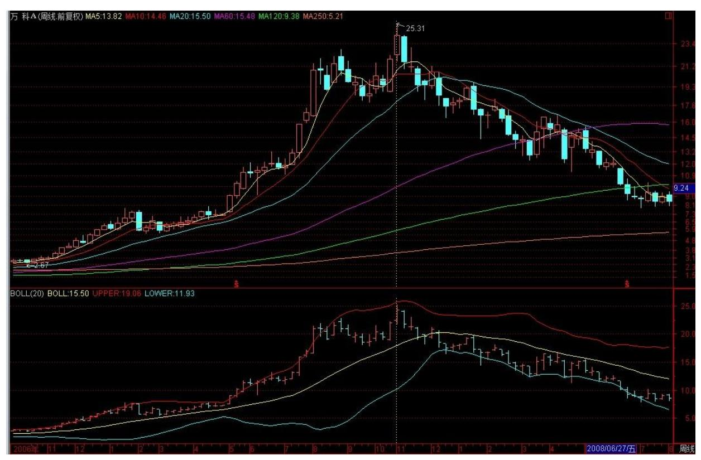

31 注意,有人可能说本ID 上面那两个例子都是自己的股票,那肯定 对。其实,别的股票更准确,例如 000002,这股票够大众情人了,请 看他的周线,40.78元那周,看看究竟发生了什么事竟然构成了周线的 第一卖点?

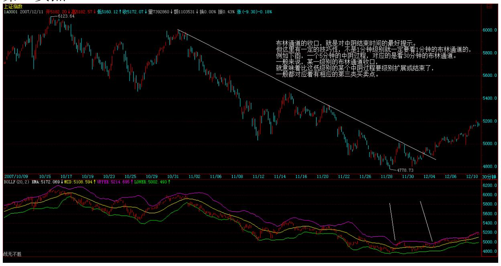

32 不过,布林通道最有用的,还是关于中阴结束时间的预判上。一般

来说,布林通道的收口,就是对中阴结束时间的最好提示。但这里有 一定的技巧性,不是1 分钟级别就一定要看 1 分钟的布林通道的,例 如下图,一个 5 分钟的中阴过程,对应的是看 30 分钟的布林通道。 一般来说,某一级别的布林通道收口,就意味着比这低级别的某个中 阴过程要级别扩展或结束了,一般都对应着有相应的第三类买卖点。

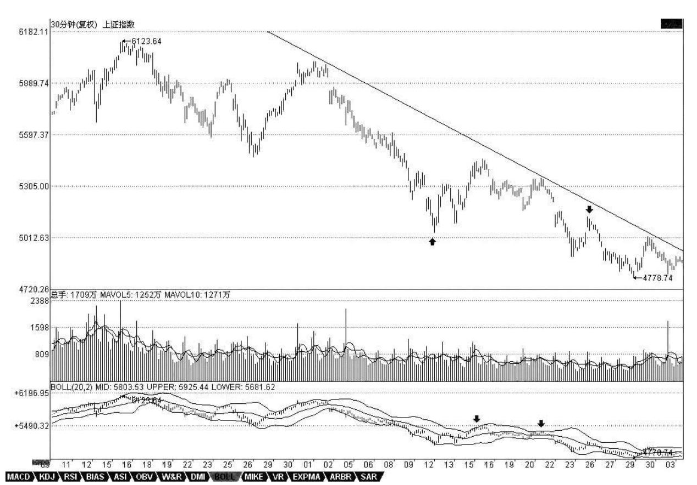

33 下图这个例子请好好研究一下,里面还有下午说的那条下降通道, 可以看到,现在离这个上轨有多接近。注意,这个辅助判断,比 MACD 那个技巧性还要高点,必须不断看图,自己去总结自己的经验才会有 所得。本 ID 这里只是把月亮指给各位,要把月亮变成自己的,还需 要自己去努力。

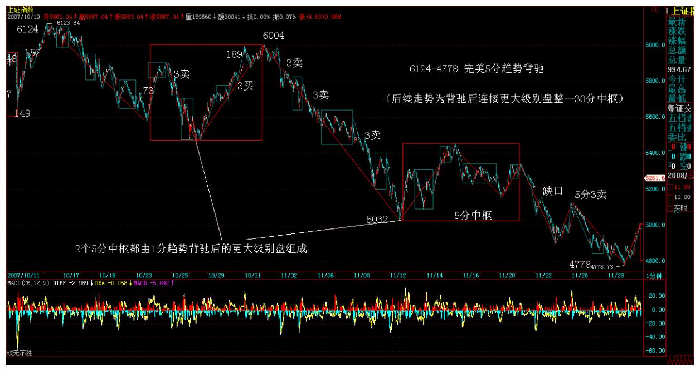

34突破回抽,明后是关键 (2007-12-04 15:29:26) 今天大盘略微发了 点力,突破 6004 点下来的下降通道上轨,但受阻于 10 日线,不过 其后的回落并没有跌回上轨之下,因此,暂时还是一个可接受的局 面。一般来说,突破后需要 3 天确认,因此明后就是关键了。 其 实,今天大盘之所以比较犹豫,就是因为昨天开始的那经济会议还没 有明确的结论性东西,现在贸然发力,万一有什么不招人待见的东西 出现,那不是自讨没趣吗?所以在这里突破反抽地耗点时间,并不是 太坏的事情。 这会议的精神,很快就会明确,这决定了短线大盘的走 势。但无论结论是怎么样,最终都会制造出一波针对 6124 点下来第 一波调整的大反抽,这个结论是必然的。唯一的区别就是昨天所说的 是否先有一空头陷阱的问题。 由于目前成交太小,市场本身的合力太 弱,而消息的力量在这时候特别容易放大,所以走势上如果要特别细 致地判断,不能忽视这会议消息的力量。但如果只需要知道大方向性 的东西,那对这会议也无须太过看重,就算有什么特别的东西,也就 多制造一个空头陷阱的问题。 大盘大反抽的最终确立,以 10 日线的 站稳为标志。 个股方面,很多中低价格股票都开始启动了,所以指数 的意义不太大,不过一旦指数启动,要小心又是 9119 地折腾。 对这 个反抽的定性一直都很明确,就是反抽,其后还需要第二次探底去确 认底部。当然,如果这次是先再一个空头陷阱再起来,这样下次的确 认就不一定要再破

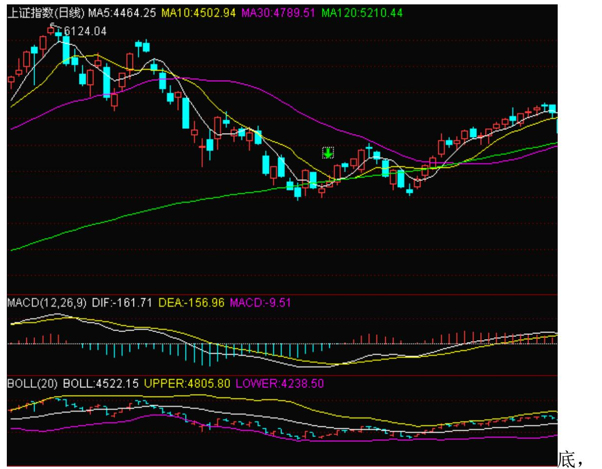

因为可以走成所谓的双底,否则,破底并不是太奇怪的事情。长阳突 破 10 日线,大反抽确立 (2007-12-05 15:20:16) 本来今天该用红字 的,但为了让各位冷静点,还是用绿字比较好。毕竟,这本 ID 反复 强调马上要来的大反抽后还至少有一个探底确认的过程,所以冷静是 必须的。

不过,现在这反抽刚确认,我们还是先探讨这反抽本身的问题。昨天 明确说了"大盘大反抽的最终确立,以 10 日线的站稳为标志。"今 天早上前 30 分钟,这 10 日线就被攻克了,然后后面的上涨,就是 顺理成章的事情了。 从这次对下降通道上轨的突破,然后再回抽确 认,然后再突破 10 日线最后确认,这一切都是极端教科书化的,这 种情况,在以后都会反复遇到。光这次对了没用,还要知道为什么, 以后碰到类似情况就会处理了,不需要本 ID 再废话了。 38

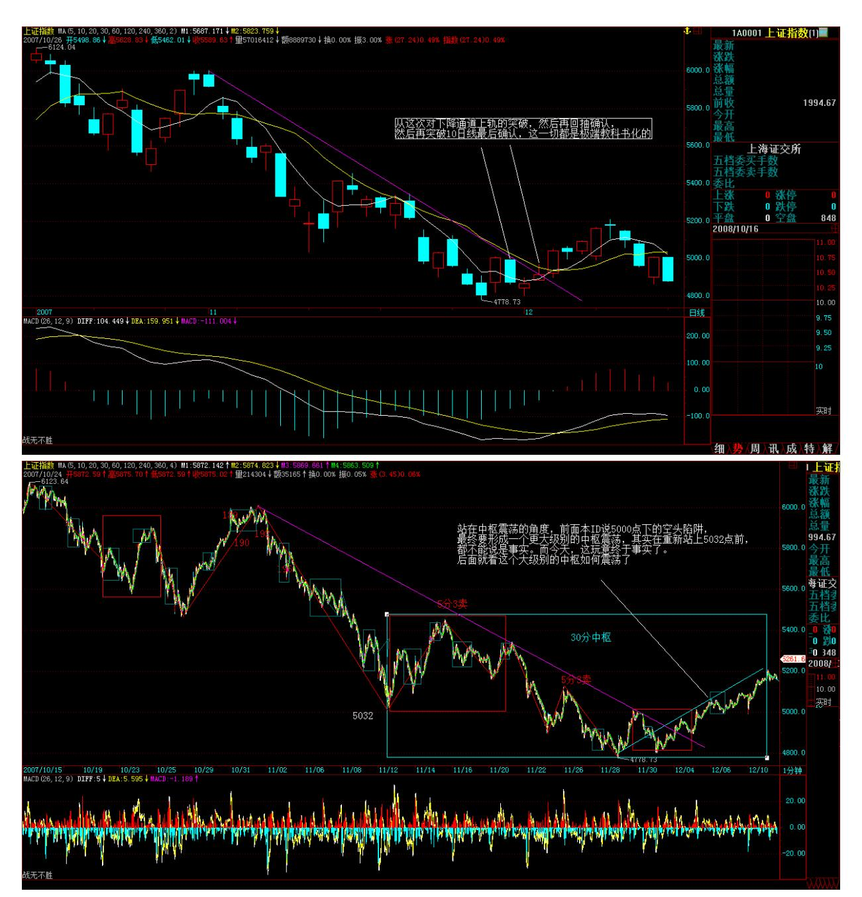

明天,关键是 5010 点,这是这次小双底的颈线位置,只要这位置站 住,那么就有攻击双底基本升幅的潜力。 站在中枢震荡的角度,前面 本 ID 说 5000 点下的空头陷阱,最终要形成一个更大级别的中枢震 荡,其实在重新站上 5032 点前,都不能说是事实。而今天, 这玩意 终于事实了。

后面就看这个大级别的中枢如何震荡了。

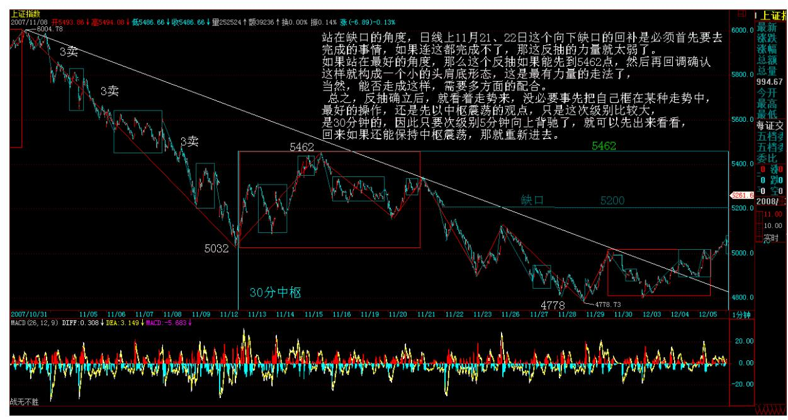

站在缺口的角度,日线上 11 月 21、22 日这个向下缺口的回补是必 须首先要去完成的事情,如果连这都完成不了,那这反抽的力量就太 弱了。如果站在最好的角度,那么这个反抽如果能先到 5462 点,然 后再回调确认,这样就构成一个小的头肩底形态,这是最有力量的走 法了,当然,能否走成这样,需要多方面的配合。 总之,反抽确立 后,就看着走势来,没必要事先把自己框在某种走势中,最好的操 作,还是先以中枢震荡的观点,只是这次级别比较大,是 30 分钟 的,因此只要次级别 5 分钟向上背驰了,就可以先出来看看,回来如 果还能保持中枢震荡,那就重新进去。(当然,你手脚特麻利的,也 可以看 1 分钟的。)41 当然,看不明白的,就看 5 日线,只要 5 日线不破,那么大盘就继续保持反抽的潜力。 5010 点的回抽确认 (2007-12-06 15:17:59) 今天按昨天所说的,全天就是对 5010 点的 回抽确认。其实,如果心思缜密的,就知道,今天下午突然下破 5010 点的走势,就是一个典型的小空头陷阱。 这里顺便上上课,前面说 过,明白陷阱,你的技术水平就会高多了。什么是陷阱?陷阱必须由 中枢而来,所谓陷阱,归根结底都是中枢震荡的结果。如果不是中枢 震荡,而是中枢移动,那就不可能是陷阱,而是真陷进去了。 今天早 上高开线段回落,然后再线段向上,根据走势必完美的原则,肯定就 在该位置有一个 1 分钟中枢了。有了这个中枢的大概位置,就有了制 造陷阱的可能。一般这种小陷阱,都是

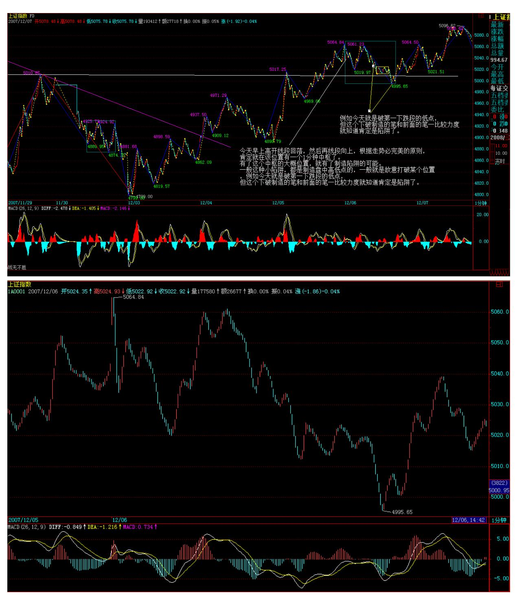

制造盘中高低点的,一般就是故意打破某个位置,例如今天就是第一 下跌段的低点,但这个下破制造的笔和前面的笔一比较力度就知道肯 定是陷阱了。 陷阱与非陷阱最关键的区别,除了是否中枢震荡外,就 是力度上的前后比较问题了,这需要好好去研究,真研究明白,变成 自己的直观,那才真有用的。 技术不说了,由于明天是周末,因此, 那一直的周末心理效应就看有多大了,只要明天以及周一开始都能站

住 5010 点上,走势就没什么问题。 在这个位置停留的最大心理意义 在于,让犹疑的人有一个心理转变的时间,争取更多的人。反弹行 情,就是一个逐步忽悠的过程,不可能是主力一直拉到底的过程,通 俗讲,做反弹,就是要逐步掂上去,在一个新的水平,等足够多的人 认同了,再掂高一点,等哪天认同减少或风声不对,就突然过河拆 桥,这样,主力才有可能全身而退。否则都是主力自己拉,那不是送 死吗? 技术不行的就继续看 5日线。先下,再见。

5010 点站稳,行情继续展开 (2007-12-07 15:17:09) 今天真没什么 可说的,早上再次回试 5010 点,结果在 5021 点就被拉起,而且还 是在周五,说明市场心态还是比较反弹行情的继续展开的,其后的走 势,就是理所当然的事情了。 其实现在的走势,根本无须过于细致地 看每天的盘,因为日线上一早就确定一定至少走一笔出来了,因此, 在一个日线的顶分型确立之前,行情就会一直延续。而且日线上一笔 过后,还可以看是否延伸出笔的上涨来,所以,只要行情不走出相应 的形态,都可以持股待涨。 45

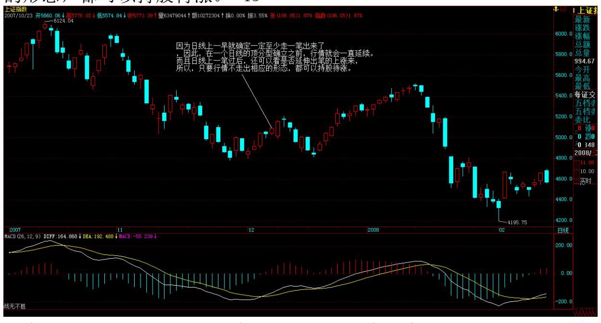

学本 ID 的理论,一定要学会不同级别的通盘考虑。下周的关键,就 是 5 周线已经能否制造周线的底分型。由于本周没到上周的高位上, 只搞了一个包含关系,所以要底分型,还要看下周。 46

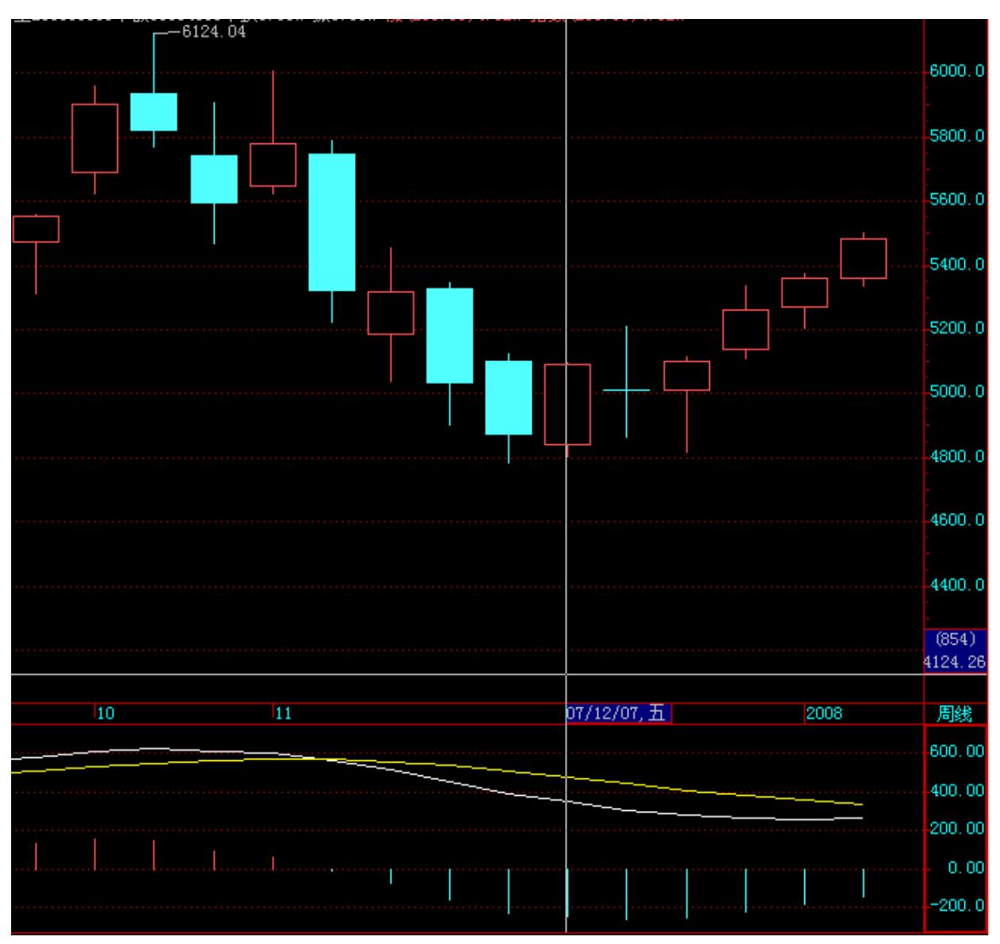

个股方面,没什么可说的,现在基本是普涨状态,因为很多前面做空 的,都陆续有点回补,所以就比较平均。关键是突上去以后,就需要 领涨板块了。所以普涨后是否形成领涨板块的市场共识,决定了行情 最终的高度。 不说了,周末,出去腐败吧。 本 ID 要去山里泡泡温 泉,可惜北京一直没有雪,真怀念在雪地里泡温泉数星星的日子呀。

# 先下,再见。

今天不是 530(2007-12-10 15:29:40) 今天不是 530,为什么?你见 过 530 北京下雪吗?既然北京都下第一场雪了,大盘当然也要放放 血,见见红了。

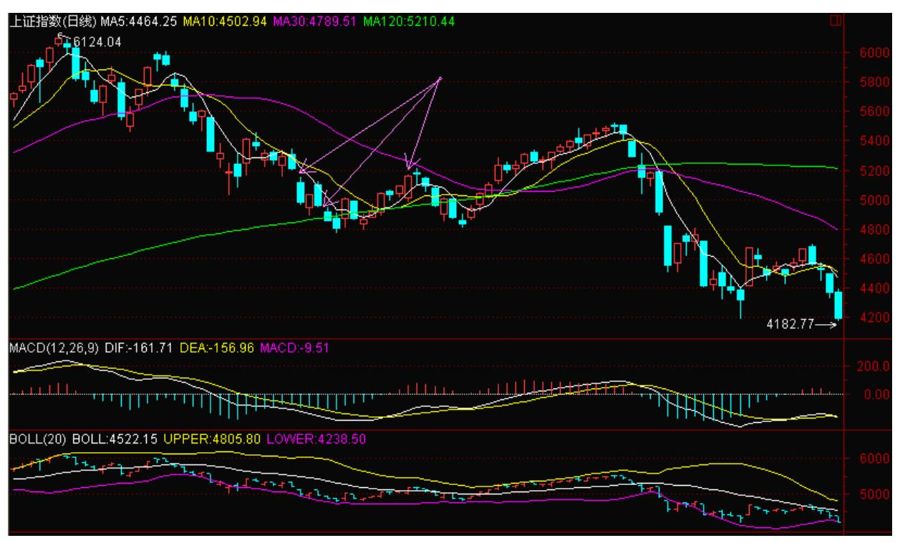

不过,本 ID 这里还是要继续绿的,这是继续让各位冷静,别一见红 的就太兴奋,那就要变成西班牙那被杀的牛了。 走势,没什么可说 的,周五已经说了,如果连日线的第一个顶分型都没出现,那就别整 天一惊一乍的,所以本 ID 这样要继续绿色,就是让各位节省点能 量,环保点。最节省能量的办法是什么?就是买点介入后,一直持有 等待卖点。而日线笔的成立意味着,如果盘中那些一惊一乍的活动不 足以制造顶分型,那就继续睡觉,等出现日顶分型再起来看看是否能 有效跌破 5 日线确立。 当然,如果你手脚特麻利,就利用 1 分钟的 走势去换股或打差价操作,不过反弹的第一轮是普涨为主,因此换股 操作难度要大点。 后面的任务就是前面已经说过的第一目标,把缺口 给补了,今天补了一小部分。完成第一任务,再站稳,然后再看第二 任务,饭要一口口吃,人要一拨拨骗,这就是反弹的要点。 本 ID 这 一年以来说了不少股票,但唯一两只是声明是给各位赚学费的。一只 是 6 元时候的 000999,那是去年 12 月的事情。第二只就是今年下 半年的600737,当时价格是 8 元。现在,000999 且不说了,600737 现在有谁还能从 8 元一直拿到现在? 提一个思考题,2008 年,本 ID 继续看好的是有色、钢铁、奥运、环保、农业、中字头、整体上 市、军工

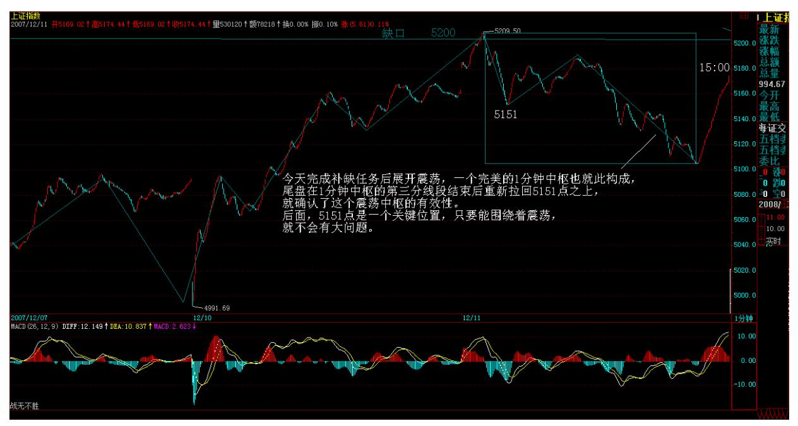

等等的股票,你说者 600737 属于哪一类呢? 让梦想继续照进现实, 面包会有的。 先下,再见。

反弹剧本第一目标胜利完成 (2007-12-11 15:33:37) 前面 4800 点说 要反弹时,给了一个剧本,第一目标就是回补 5200 点这个缺口,今 天总算胜利完成了。下一个目标是什么(5462),前面可也说了,如 果不知道,那是看帖子不认真,本 ID 可没有义务重复说。 今天完成 补缺任务后展开震荡,一个完美的 1 分钟中枢也就此构成,尾盘在 1 分钟中枢的第三分线段结束后重新拉回 5151 点之上,就确认了这个 震荡中枢的有效性。后面,5151 点是一个关键位置,只要能围绕着震 荡,就不会有大问题。

现在的操作,十分简单,大的可以继续看日线上的笔是否结束来决定 卖出。手脚麻利的,可以利用这个震荡进行换股或打短差。没感觉 的,就继续看 5 日线。 从稳健的角度,在这个位置震荡长点时间, 骗多点人进来,有利于以后走得更高。如果太急,那可能就很快夭折 了。 51

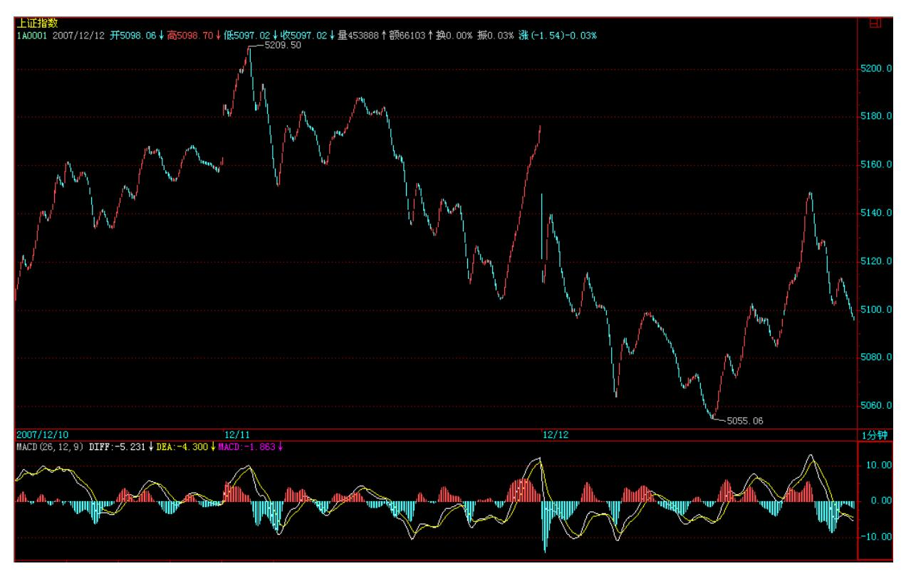

第一目标达到后的例行休整 (2007-12-12 15:33:01) 昨天达到反弹的 第一目标后,今天出现例行的休整,本就是天经地义的事情,和外围 以及基本面因素都关系不大。 昨天给了一个判别休整强弱的重要点 位,就是 5151 点,显然,今天开盘就跌破且反抽不上,就明白无误 地告诉各位休整的弱势性质。5151 点依然是后续关键的位置,在站稳 该位置之前,大盘不可能重新走强。

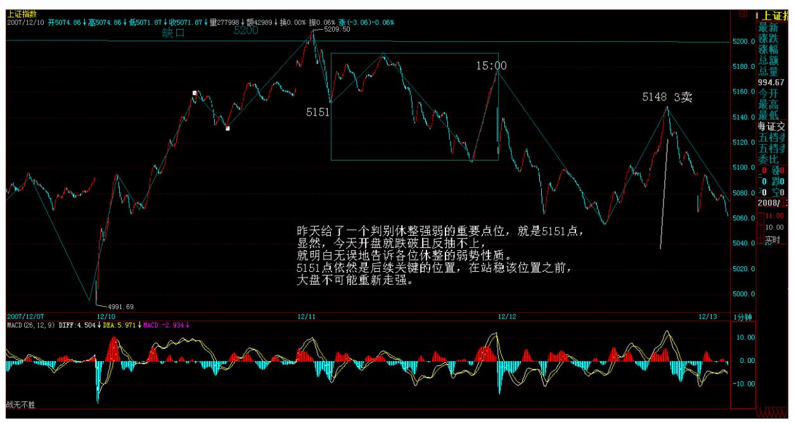

由于大盘采取了弱势休整,用本 ID 的理论语言,就是休整将和前面 5010 点那次 1 分钟级别的中枢震荡一起扩展成了 5 分钟级别的,因 此,震荡的区间就自然从这个大的震荡着眼。 54

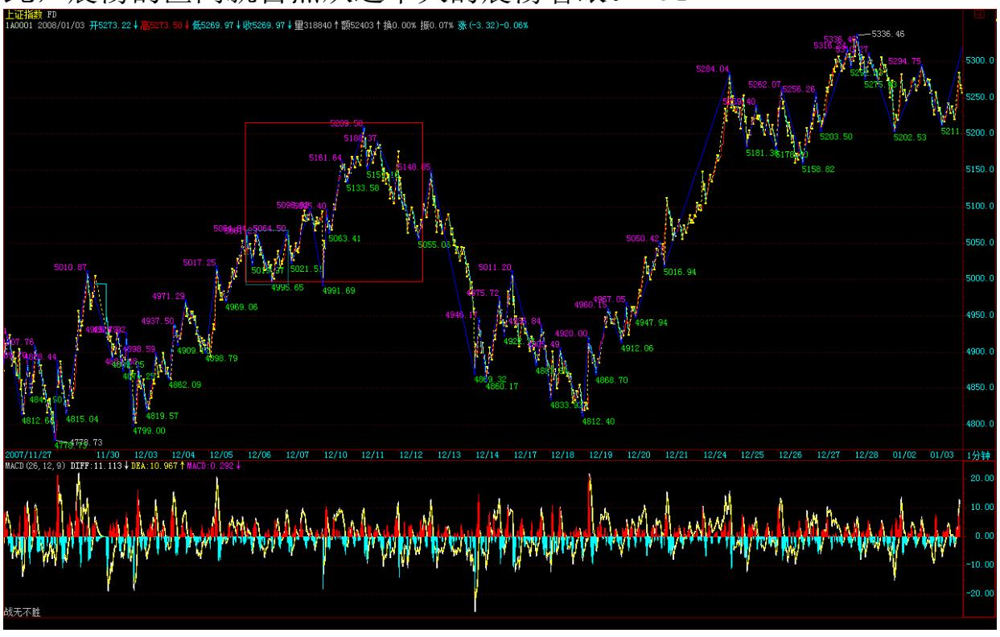

日线上,因为今天顶分型形成,但 5 日线并没有确认有效跌破,因 此,并不能马上断言这个休整必然在日线上留下向下的笔,所以明后 两天的 5 日线是关键,一旦有效跌破,那么休整将至少形成向下的

笔,也就是至少要等到底分型出现才会结束。 不过大盘的走势其实已 经很不重要,很多个股已经完全和大盘没关系。而且大盘只要能保持 这 5 分钟的震荡,即使再扩展为 30 分钟的,只要不出现向下的第三 类卖点,最终大盘依然要向上继续反弹的。 如果你的股票已经出现周 底分型的确认,那么就以 5 周均线为参照持有就可以,不必太注意大 盘的震荡。当然,如果你手脚特麻利,那就可以来回短跑,一般人就 算了。

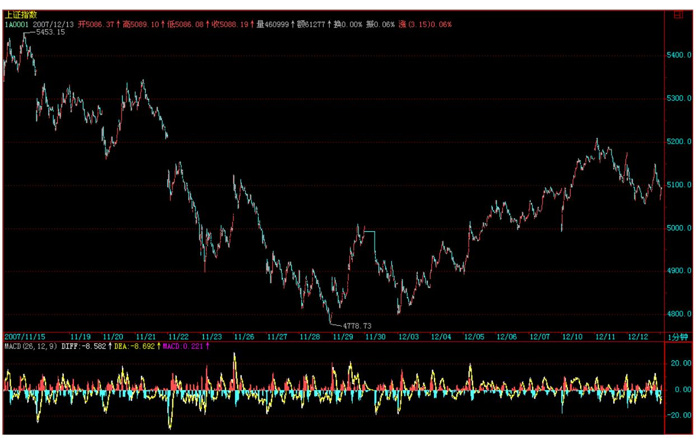

顶分型确立显威力(2007-12-14 00:49:00) 刚回家,喝了不少,还 行。看看时间,已经是明天了,本想早上起来再说股票,趁着有点酒 劲,现在就说说。 昨天早上反抽不上 5 日线,顶分型确立。当然, 顶分型确立,并不一定要拉出长阴线,但更不一定不拉出长阴线,10 条短阴线与一条长阴线,只要不出现底分型,最终都只是指向一个向 下笔的过程。而站在本 ID 理论的角度,只关心买卖点的结果,并不 关心过程。 一个顶分型跌破 5 日线,就是未病-欲病-已病模式中的 最后一个已病了,既然已病了,就只能等大盘病好,病好的日线标志 就是底分型。站在中枢震荡的角度,昨天说了,5010 点那次的中枢震 荡扩展成一个大的 5分钟中枢震荡,今天的下跌,暂时没有把这个中 枢震荡的第三类卖点给震出来,所以,只要不出现这个卖点,那么一 切依然保持在基本的中枢震荡中,当然,如果出现了,那么大盘跌破 上次低点的几率就极大了。 站在中枢震荡的角度,第三类卖点是典型

的已病了。第一等的高手,是未病就下手了,第二等的高手是欲病就 下手,等到已病,那确实有点不太高明了。 当然,对于这样的反弹, 如果操作不过来的、心态跟不上的、手不够狠的,最安全的无疑还是 正确光荣伟大的小板凳,有时候,休息几个月并不是什么坏事,这点 是反复强调的了。 不

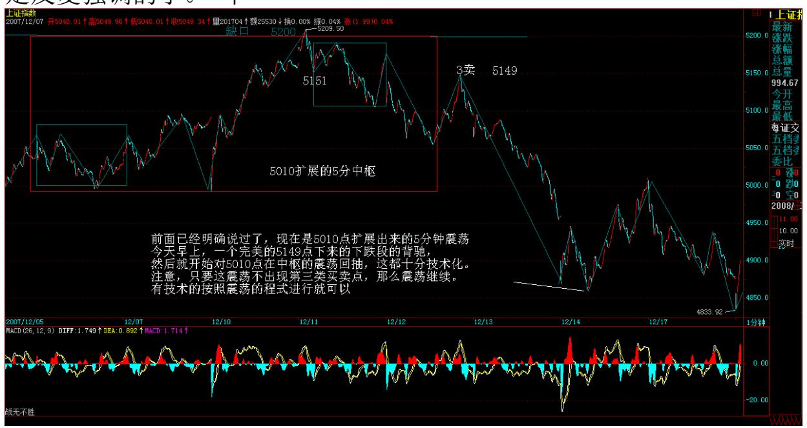

过,站在周线的角度,暂时还没有破坏可能形成的周的底分型,而下 周 5 周均线将继续下移,一旦站住,大盘仍将继续反弹。所以,今天 的走势很关键,今天只要不跌破 4778 点,周线上至少还不太坏。上 周五已经说了,本周的任务是构造周线的底分型,能否成立,就看今 天了。 周底分型构成待确立 (2007-12-14 15:48:40) 上周给了本周 一个任务,就是去构成周底分型,今天早上也特别强调这一点,现在 任务算是完成了。下周的任务也先给出,就是去确认周底分型的确 立,技术上十分简单,就是 5 周均线站住。

前面已经明确说过了,现在是 5010 点扩展出来的 5 分钟震荡,今天 早上,一个完美的5149 点下来的下跌段的背驰,然后就开始对 5010 点在中枢的震荡回抽,这都十分技术化。当然,这些走势的操作,需 要比较高的技术把握,如果没这技术的,就算了。

注意,只要这震荡不出现第三类买卖点,那么震荡继续。有技术的按 照震荡的程式进行就可以,那程式是什么?课程里反复说过了。 周 一,从日线上看是能否形成底分型,如果成立,然后周二以后是对这 底分型的确立,也就是能否站住 5 日线的问题。一旦确立,这向下笔 就完成了。然后就看后面的向上笔能否带领出周线的向上笔了。当 然,所有的前提都是周一能够构成日的底分型。 本 ID 对没学会的 人,已经很给面子了,600737 让那些没学会的一棵树吊死,如果都办 不到,那本 ID 也没办法,自己磨练去吧。不经历点痛苦,怎么能学 到好东西? 本 ID 这里是一个训练场所,本 ID 更象一个教练,本 ID 这里其实没什么,密在汝边。 周末,不想说太多股票,把以前说 过的股票最后几只都说说。 周五,累了一周,本 ID 也要去腐败腐败 了。先下,再见。 抛弃指数,冰火两重天 (2007-12-17 15:30:15) 今天,并没有构成日的底分型,只是制造了一个典型的包含关系。由 于离周五低位很近,所以只要明天比周五低,那么就意味着 5209 点 开始的下跌笔依然要延续。 其实,根本无须等到收盘才知道底分型不 能构成,因为要构成底分型,首要,是要比周五的最高位置还要高, 而大盘开盘就低开,因此,只要大盘不红盘,怎么折腾都可以去睡 觉,而底分型都不能构成,当然也是一个睡觉的局面。 不过,这只是 从大盘来说,个股方面,冰火两重天,本 ID 前面已经说过,有些真 有题材的股票,不会搭理大盘的走势的,大盘越没方向,反而给部分 股票以表现的机会。

操纵股票的,也需要有点营销手段的,现在快 2000 只股票,要大家 有印象,当然是需要点手段的,而逆势而走,往往就是最省事的办 法。现在资金这么多,犯贱追高的人也少不了,现在敢于表现,是不 会没有回报的。

由于目前在周线上,周的底分型没有被确认,而日的底分型又没有被 构成,所以后面就是首先等日底分型的构成,这是必须首要完成的。 当然,周线的底分型如果最终不能确认,那么大盘无疑就必须面对再 次的破位,一个必然的事情就是,大盘要走出中级的底部,一个必要 的前提就是周底分型的确认,如果这位置确认不了,也会下一台阶却 构成并确认,这是技术上的必然要求。 站在 5010 点上下的中枢震荡 来说,现在要面临着出现第三卖点的巨大威胁,一旦第三卖点确认, 大盘新低是不可避免的。因此,对于多头来说,后面几天是唯一可以 去努力的时间了,否则,将必然面对被再下一城的现实。 当然,对于 如本 ID 一样的,就根本不关心什么破烂指数,抛弃指数,大玩冰火 两重天,这并不是太坏的事情。当然,如果大盘跌得太狠,偶尔也需 要避避风头,但有一点是肯定的,就是明年的生意都要做的,要做生 意,年底开始就要准备了,否则明年的营业额怎么保证? 先下,再 见。
