# 教你炒股票 91:走势结构的两重表里关系 1

(21:40:15) 判断走势,如同中医看病,未病而治的是第一等的,次之 的是对治欲病,到已病阶段,那只能算是亡羊补牢了。但绝大多数的 人,病入膏肓了还在幻想,市场里最终牺牲的,总是这种人。 级别的 存在,可以比拟成一种疾病的级别,1 分钟的可能是一个小感冒,而 有时候一个 5 分钟的下跌就足以是一个小的感冒流行了。至于 30 分 钟、日线的下跌,基本就对应着一些次中级或中级的调整,大概就相 当于肺结核之类的玩意。而周线、月线之类的下跌,那是什么就不用 说了。如果是季线、年线级别的下跌,就算不是死人一个,也至少是 植物人了。 未病-欲病-已病,对应的界限就是相应级别的第一、二、 三类买卖点,注意,对于上涨来说,踏空也是一种病,涨跌之病是相 对的。 如何诊断出这病所处的阶段,这和中医的道理是一样的(娇 注:多级别系统判断)。例如,肺和大肠相表里,注意,中医里的肺 不单单指西医那叫肺的玩意,而是相应的一个功能系统,例如,鼻子 就属于肺这个系统的,因此,鼻子的毛病,可能就和大肠相关系着, 而在西医里,这两样东西无论如何都是不搭界的。 而在走势中,当下 的走势,就对应着这样类似的两重表里关系。在我们前面所讨论的走 势分解的配件中,有两种类型:一、能构成中枢的。二、不能构成中 枢的。 第一种,包括线段、以及各种级别的走势类型;第二种,只有 笔。笔是不能构成中枢的,这就是笔和线段以及线段以上的各种级别 走势类型的最大区别。 因此,笔在不同时间周期的 K 线图上的相应 判断,就构成了一个表里相关的判断。越平凡的事情往往包含最大的 真理,一个最简单的笔,里面包含了什么必然的结论?一个最显然又 有用的结论就是: 缠中说禅笔定理:任何的当下,在任何时间周期的 K 线图中,走势必然落在一确定的具有明确方向的笔当中(向上笔或 向下笔),而在笔当中的位置,必然只有两种情况:一、在分型构造 中。二、分型构造确认后延伸为笔的过程中。

根据这个定理,对于任何的当下走势,在任何一个时间周期里,我们 都可以用两个变量构成的数组精确地定义当下的走势。第一个变量, 只有两个取值,不妨用 1 代表向上的笔,-1 代表向下的笔;第二个 变量也只有两个取值,0 代表分型构造中,1 代表分型确认延伸为笔 的过程中。 例如(1,1)这就代表着一个向上的笔在延伸之中, (-1,1)代表向下的笔在延伸中,(1,0)代表向上的笔出现了顶分 型结构的构造,(-1,0)代表向下的笔出现底分型的构造。 任何的 当下,都只有这四种状态,这四种状态描述了所有的当下走势。更关 键的是,这四种状态是不能随便连接的,例如(1,1)之后绝对不会

连接(-1、1)或者(-1,0),唯一只能连接(1,0);同样, (-1,1)只能连接(-1,0);而(1,0)有两种可能的连接:(1, 1)、(-1,1);(-1,0)有两种可能的连接:(-1,1)、(1, 1)。 有了上面的分析,我们就很容易进行更复杂点的分解。考察两 个相邻的时间周期 K线,例如 1 分钟和 5 分钟的。如果 5 分钟里是 (1,1)或者(-1,1)的状态,那么 1 分钟里前面的任何波动,都 没有太大的价值,因为无论这种波动如何大,都没到足以改变 5 分钟 (1,1)或者(-1,1)状态的程度,这里就对 1 分钟的波动有了一 个十分明确的过滤作用。如果你是一个最少关心 5 分钟图的操作者, 你根本无须关心这些无聊的波动。 此外,如果 5 分钟是(1,1),1 分钟也是(1,1),那么,5 分钟是断无可能在其后几分钟内改变 (1,1)模式的,要 5 分钟改变(1,1)成为(1,0),至少要在 1 分钟上出现(1,0)或(-1,1),而在绝大多数的情况下,都是必然 要出现(-1,1)的。 因此,站在病的三阶段判断的角度,对于 5 分 钟的笔状态,1分钟的笔状态的可能导致 5 分钟笔状态的改变,就是 一种未病的状态。例如,对于 5 分钟的(1,1),1 分钟出现(1、 0)是一个小的警告,但这个警告如果只出现在 1 个 5 分钟的 K 线 里,那么不足以破坏 5 分钟的结构,所以这个警告不会造成实质的影 响,但如果这个1 分钟的(1,0)被确认了,那么一个重要的警告就 成立了,这就是将向欲病发展了。 但这个 1 分钟的(-1,1)出现并 导致 5 分钟的(1,0)在形成中,就是一个欲病向已病发展了。当 5 分钟的(1,0)也确认向(-1,1)发展时,就确认已病了。 这种分 析,同样可以应用在日线与周线的关系上,例如最近大盘的走势,在 周线上出现(-1,0),而日线上目前是(-1,1),这种状况是下跌 里第三恶劣的情况,因为最恶劣的是周线是(-1,1),日线也是 (-1,1);次恶劣的是周线是(-1,1),日线也是(-1,0)。对于 第二、三恶劣的情况,(娇:周,日有一个底分型)技术高的也是可以 去操作的,至于对于最恶劣的那种,就算技术高的,也算了。目前, 首要等待的就是日线出现(-1,0)的信号,而如果这信号出现时,周 线还能保持(-1,0),那么就会出现第四恶劣的情况,也就是有可能 出现转机的情况,是否出现,大盘走出来就知道了。而目前的大盘处 在最微妙的时候,为什么?因为一旦日线的(-1,1)延续到打破周线 的(-1,0),这样就会变成最恶劣的走势状态,也就是周线(-1, 1),日线也(-1,-1)。换言之,目前的大盘只面临两种选择,第 1 恶劣还是第 4 恶劣,如此而已。 为了记录,我们可以随时给大盘开 一个即时的病情记录,这个记录是一个矩阵,按 1、5、30、日、周、 月、季、年的级别分类,这矩阵有 8 行,每一行就是对应级别的状态

数组,这矩阵可能的情况就有4 的 8 次方个,一个相当大的数字,代 表了走势所有可能的状态,也就是所有病的状态。 当然,用巨大的计 算机,我们可以实时监控所有股票的病情。注意,每一种状态后并不 是随机到任何另一种状态的,可变的状态是极为有限的,从中,可以 分析出可能变化状态中出现最大可能赢利的转折状态,这种转折是必 然的。然后用大型的机器监控所有股票,在相应的状态买入,相应的 状态卖出,一部自动赚钱的永动机器就构造成了。 关于那些状态的转 折效率是最高的,这是一个纯粹的数学问题,知识是有力量的,这就 是一个例子。 当然,对于一般人来说,完全没必要去制造这样的机 器,研究这样的问题。因为我们完全可以只关心三个连续的级别,例 如,1、5、30 分钟,然后这就对应着 64 种状态,这里,就和易经联 系上了,很多人用易经研究股票,都是糊涂一通,其实,真要用易经 研究,就从这下手,这才是正道,这个以后慢慢说。

可能不少人对日分型、周分型,这笔那笔地搞得晕,这其实是最简单 的情况了,现在很少有好的中医,因为学医的看到这生那克的,那里 这表的都晕了,所以中医的前途堪忧。不是中医有什么大问题,而是 现在笨人、一根筋的人太多了。 当然,光是笔这重表里关系,不足以 精确地诊断市场走势,这就象光搞清楚肺和大肠的关系,是治不好人 的。可能在这重关系中的未病,站在别的关系下就看出已病来了。因 此,必须再研究另外的表里关系。 更重要的是,不同的表里关系,之 间还是有生克关系的,就如同中医里不同系统间的生克关系一样,只 有在这个层面上,才能算初步沾了一点诊断的边。 后面这些问题,后

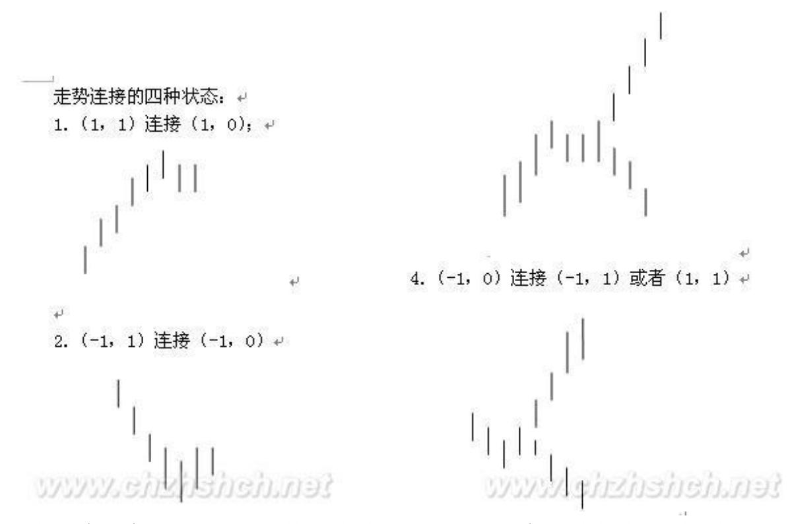

面再说,今天累了,睡觉。多头,早死早投胎还是背水一战 (2007- 12-18 15:31:11) 现在对于多头来说,形势十分明确,就是两个选 择:早死早投胎还是背水一战。

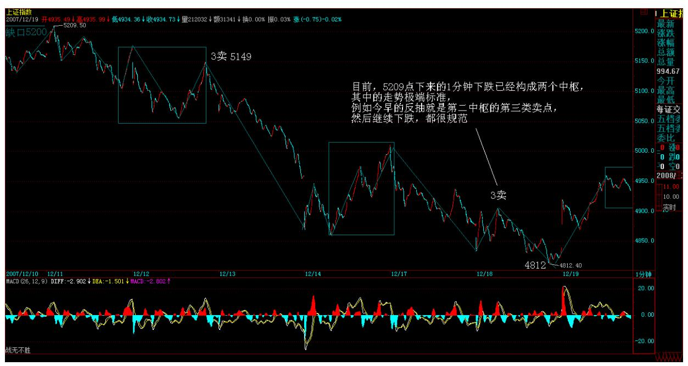

技术上,本 ID 已经分析得很清楚,周线上是(-1,0),日线上两种 选择,在 4778 点上制造(-1,0),这样多头还有背水一战的机会, 否则就早死早投胎。 中线上,本 ID 已经反复强调,反抽以后必然还 要探底,而在 11 月底谈论 12 月月 K 线形态时,就明确说过,至少 有上影对 11 月长影实体进行反抽,这点已经做到了。后面的问题其 实很简单,就是这月 K 线是包含关系,还是继续月上的向下笔延伸, 也就是 4778 点是否要在 12 月被破。一旦被破,也就是月线上要走 出向下笔,在月出现新的底分型之前,一切中级的向上都免谈,这在 技术上是不需要分析的,是必然的。 如果用更精细一点的分析,就是 5209 点下来的这个 1 分钟下跌走势究竟在什么位置结束,如果在 4778 点上结束,那么最坏的情况还不至于马上发生,也就是说,大盘 的反抽最坏也能走成类似三角形之类的收敛形式,否则,这 1 分钟下 跌,将是一轮大级别下跌的第一段,后面至少要等这个级别的下跌结 束,才有中线站稳的可能。

目前,5209 点下来的 1 分钟下跌已经构成两个中枢,其中的走势极 端标准,例如今早的反抽就是第二中枢的第三类卖点,然后继续下 跌,都很规范。下面的问题,就是要关注后面是否能制造出背弛,其 实更重要的是,背驰以后的反抽是否就在这第二中枢区间受阻,一旦 如此,后面的走势一定大大不利于多头。

说实在的,现在的情况对多头确实是华山一条路,除非走出直接突破 5200 点颈线的走势,否则早死晚死都是死,还不如早死早投胎。 其

实,跌破 4778 点并不是世界末日,反而必然会构造出走势上的背 驰,也就是说,跌破也是空头陷阱,并没有什么大不了的。而在这里 死顶,反而会让这陷阱杀人更多,所以,如果多头没有直接突破 5200 点的能力,还不如早死早投胎,例如这一生没活明白,6100 点当多 头,投胎回来活明白点,也不是什么坏事。 这里说的是大盘,个股并 不一定太关联于大盘。即使大盘破位,那些明年肯定会被大搞的股 票,一定会利用陷阱把不坚定分子清洗干净。至于中石油之类的,那 天吃饭,有人问本ID,本 ID 说既然开 48,那就到 24 也很好。48, 死都要发的都死了;24,想死反而得活。结果给酒桌上的人声讨,说 本 ID 太残忍,让 48 的人怎么活。但市场从来都不为任何人的生死 而不市场,当然,24 的中石油只是一句酒话,说老实话,站在长线利 益上,本 ID还愿意见到 14元的中石油,但估计没人会给。而实际 上,中石油在30 分钟上也跌出了一个线段的类下跌走势,后面就要开 始关心底背驰制造的问题了。 超短线上,明后两天,是给多头最后的 机会,如果还发不出力来,就早死早投胎吧。本 ID 给出的操作原则 已经反复说了,没技术的,最好还是继续光荣伟大正确的小板凳,有 技术的,就继续折腾那些强势的股票,当然,如果某些股票有大的底 背驰,也是可以关心的,不过即使多头能发力,但如果再次反抽不能 重上 5032点,那么就必须小心被刀子刮伤。先下,再见。

多头绝地反击,仍需努力 (2007-12-19 15:15:39) 昨天说了,多头面 临两个选择,如果连背水一战、绝地反击的勇气都没有,干脆早死早 投胎。今天,在资金大回笼,利好不少的情况下,多头最终有了点动 作,但这远远不够。这就像煮青蛙,多折腾两次,并不意味这青蛙就 要成神仙了。 青蛙要成神仙,多头要真正逃出绝地,最基本的位置昨 天也说了,就是 5032 点,(注:30 分中枢 ZG,2007 年 11 月 12日 低点 5032)这样,基本还是继续保持 5000 点附近的大级别震荡。

当然,光震荡还是没用的,5209 点的颈线还是必须攻克,否则最终青 蛙还是要变成清炖青蛙。

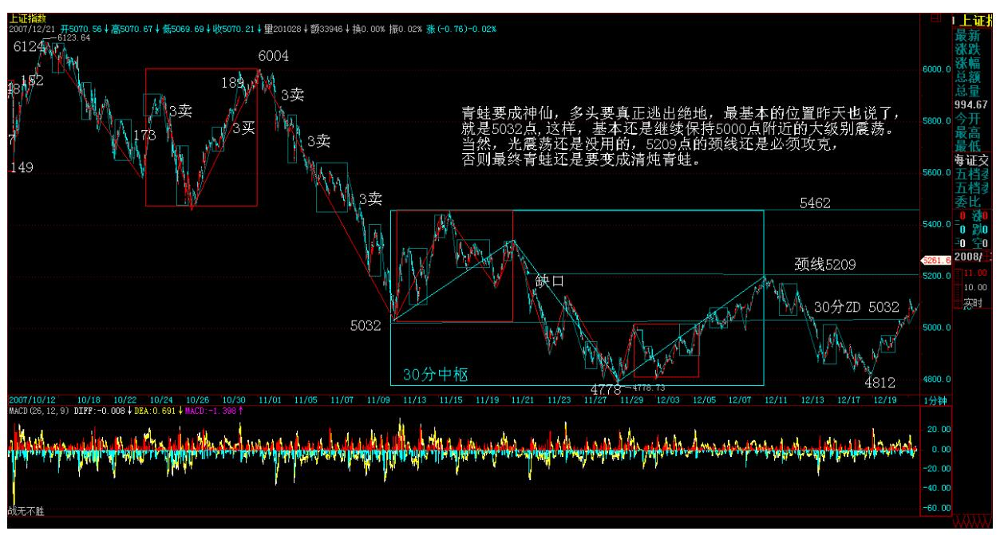

技术上,今天把日的底分型给折腾出来了,早上第一波冲高就基本确 认,因此后面的第一次回调,就构成超短线的一个第二类买点。这次 的反抽,就是昨天所说的 5209 点下来的 1 分钟下跌背驰后的结果, 因此在这里,至少要制造一个 5 分钟的中枢,该中枢的第三买卖点出 现情况决定短线大盘的生死。 68

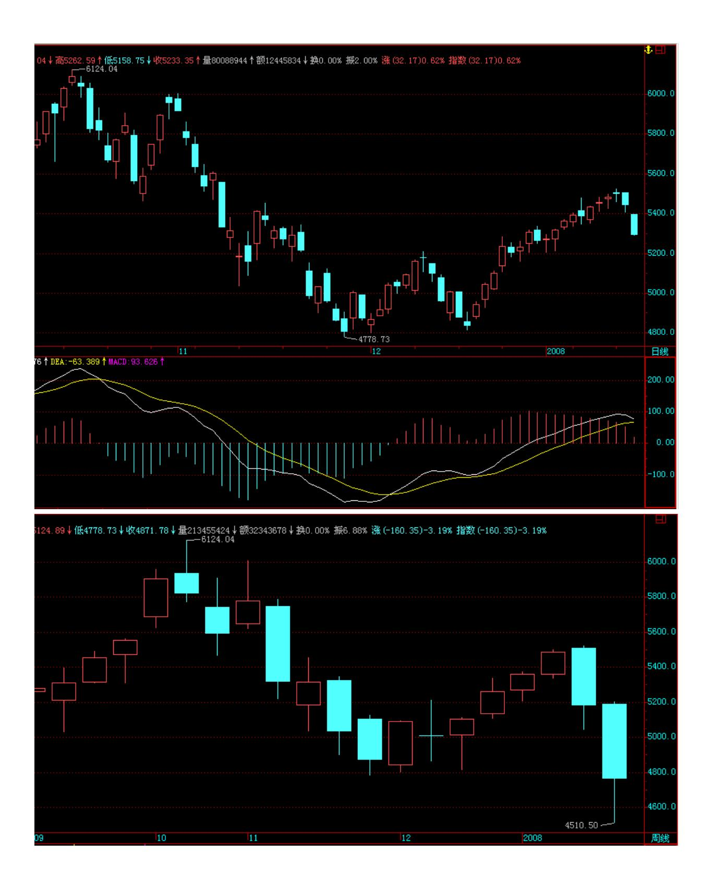

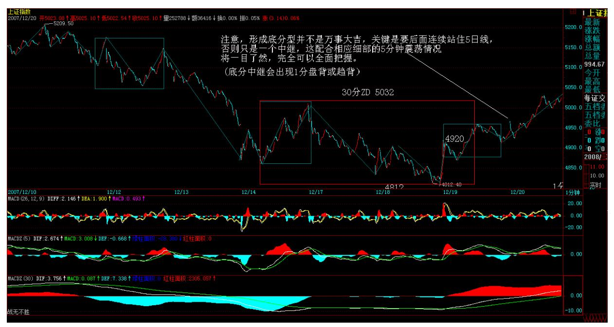

注意,形成底分型并不是万事大吉,关键是要后面连续站住 5 日线, 否则只是一个中继,这配合相应细部的 5 分钟震荡情况,将一目了 然,完全可以全面把握。

中枢震荡的操作法则,课程里反复说到,必须多练习才能真正把握。

本 ID 在这里,只是一个陪练,最终希望各位自己学会去分析。如果 你只希望来这里获得一些现成的结论,那就最好别来了,因为这里没 有。 希望来这里的人,都是不需要拐杖,自己能走的人。本 ID 只是 陪练,教练都算不上,这个道理必须清楚。 攻克 5032,完成初步任 务 (2007-12-2015:15:02) 因为晚上要出差,所以等一下就把晚上关 于明年大盘走势的展望写了,4 点左右贴出来。明天收盘尽量解盘, 如果没时间,就在周六或周日补上。 今天大盘攻克 5032 点,初步任 务完成,大盘围绕 5000 点上下震荡的大格局依然保持。下一步,就 是要站稳 5032点,为攻击 5209 点颈线的进一步任务打好基础。因 此,5032 点能否站住,就是判断大盘超短线强弱的关键点位。 今天 盘中走势,5032点位置的重要性表现无遗,整个下午基本就是围绕该 位置蓄势、突破、回抽的过程。很多人到现在还不大会看盘,例如今 天的走势,其实一点可担心的地方都没有,因为整天连一个线段都没 有完成,你有什么可担心的? 4812 点上来,在 4920 点附近有一个 1 分钟的中枢,因此,下面就等待第二个 1 分钟中枢的出现,看这 1 分钟的上涨是否确立,最后再看其顶背驰的出现。这和 5209 点下来 的 1 分钟

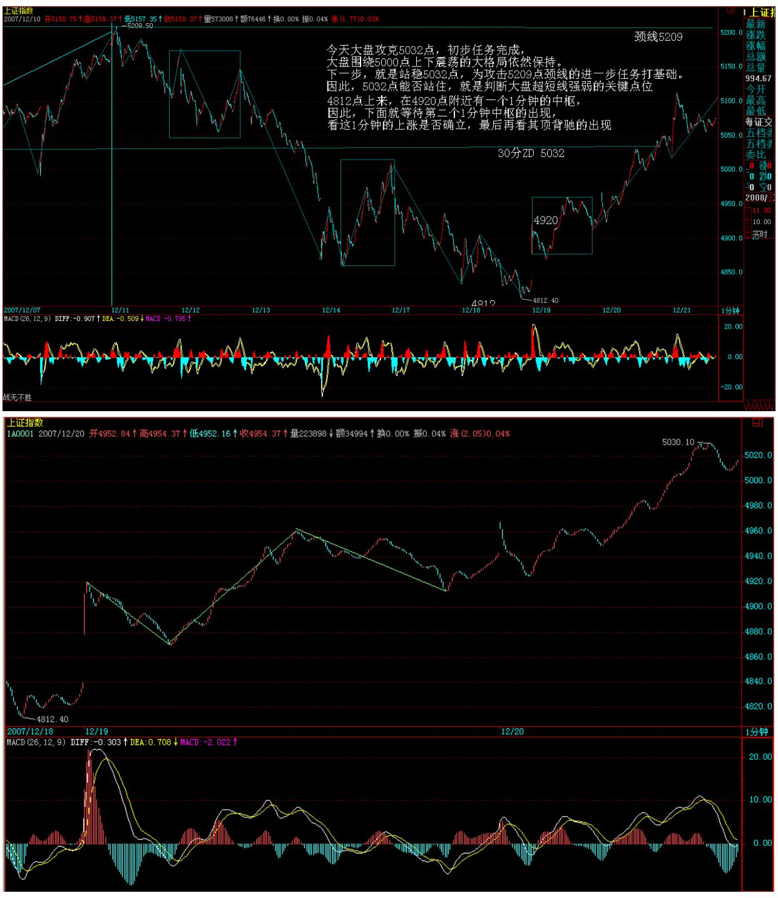

下跌是一样的,只是反过来而已。 中石油今天终于把底分型给构造出 来,后面就是确认的问题。在 30 分钟上,这个线段的类背驰显然是 制造这次回升的关键,这也说明了,中石油在 30 元附近至少可以构 造一个大点级别的中枢,以后是再次破位还是继续上涨,就看这中枢 的第三买卖点问题了。 大盘比中石油强点,向笔的延伸已经展开,所

以和上次 5209 点一样,等到顶分型出现再说。当然,会看 1 分钟上 涨的背驰,可以直接看那背驰操作,那更精确。

今天大盘股票的启动,与所谓期货的传闻有关,因为某部门递交了所 谓要求期货开的玩意,但这玩意是需要批的,现在谁有时间批?谁负 责批?这事情至少在程序上不是一个人的签名就可以批的,只要有签 名权的人有一个人有保留意见,估计这东西就需要折腾。 其实,本ID 是欢迎这种折腾的。现在的中国资本市场,连小学都没毕业、现货都 没有搞好,就想搞期货上大学?谁的脑袋大、脖子粗,就顶吧。如果 真出来,本 ID 是乐于看笑话的。 请先把创业板搞好,先完善多层次 的资本市场间架。而最无耻的就是那些利益集团,为了自己的利益, 企图在年底抢闸。 中国资本市场目前最大的问题是多层次资本市场的 间架、印花税等交易成本的合理化,而不是好高务远(这个成语写成 这样可是公开发行的软件制造的,连成语都写错却能发行,请问是谁 负责的?我们的期货千万可别是这种水平)的所谓指数期货。 先下, 4 点再上帖 2008 年走势展望。 2008 年行情展望 (2007-12- 2015:59:05) 年末,不可免俗地要对明年的行情展望一番。今年,无 论是 5 月份的 180 个月时间周期、6100 点的顶部以及调整的第一落 脚点 120 天线,都被预先剧本了。不过,现在完全精确剧本明年走 势,几乎是不可能的,因为明年市场上的可变分力太多,下面只从纯 技术的角度进行一些界定性的分析。 从今年年 K 线上看,由于还有 几个交易日,所以不能完全确认年 K 线的收盘位置,但年 K 线将留 下较长上影,这点大概不会有太大改变。同样,年 K 线的实体部分也 将相当长。因此,明年的走势,今年的 K 线上影尖端 6124 点以及 K 线实体的一半位置(目前大约在 3800 点附近)将分别构成明年关键

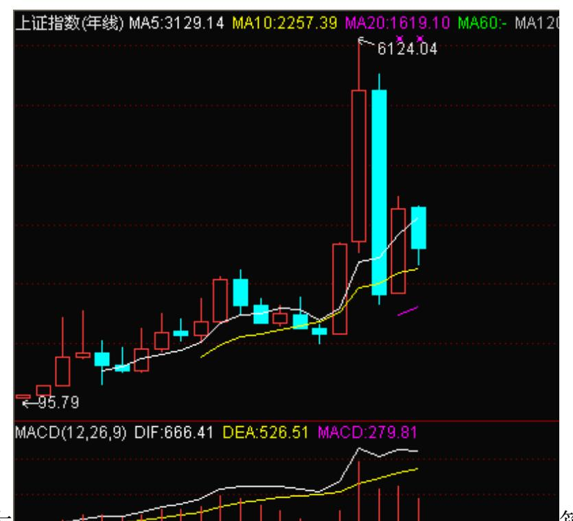

大 箱体的上下边沿。目 前大盘的位置,大致在这箱体的一半位置。将这箱体进行 4 等分,那 么次级的支持与阻力大概分别在 4355 点与 5555 点。

可以断言,即使突破 6124 点后,明年能突破 6124 点+该箱体宽度, 也就是大概 8400 点的可能也会极小,就算最终发生了,也肯定是一 个将导致巨大灾难的多头大陷阱。同理,将原箱体宽度按 4 等分划 分,那么,可以计算出突破 6124 点后依次的阻力位置。由于最后的 年收盘没有出来,所以精确的计算可以留待今年收盘时,但方法是一 样的。 从日线的均线系统上看,250 天线将是明年最关键的位置。前 面的文章已经说过,本次调整的第一只脚将落在 120 天线,那么第二 只脚就极有可能是在 250天线。明年,至少有两次考验 250 天线的机 会,极有可能是,第一次是喜剧,第二次是悲剧。 明年年 K 线最终 是长阳的概率不大,十字星或类十字星的小阴小阳出现的概率极大。

无论哪种情况,明年最需要关注年 K 线上影所制造的多头陷阱,当 然,相应也要关注年 K 线下影所制造的空头陷阱。如果配合上股指期 货,明年的陷阱多多,多头空头都不会好过,一旦落到井里,其后果 一定比这次 6124 点这76

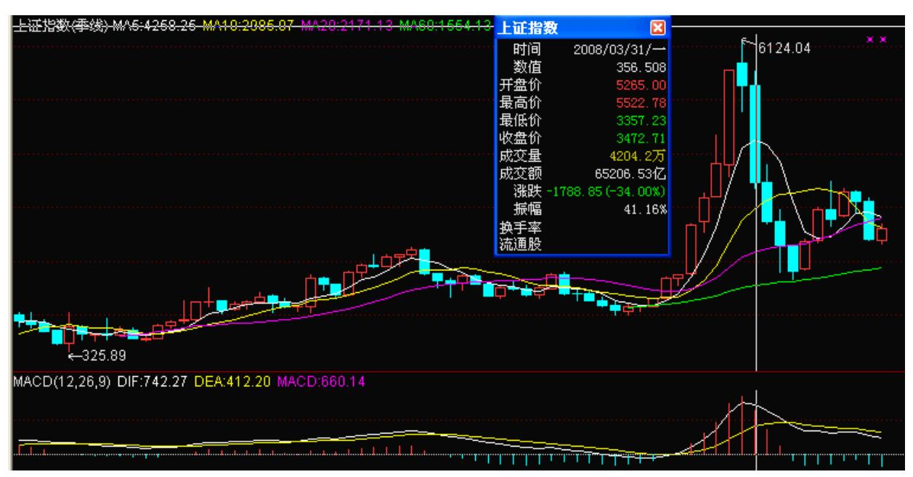

个小井要严重得多。月K 线太多就不分析了,这里只分析一下明年的 季 K 线。由于本季度的K 线基本定型,那么明年 1 季度的 K 线将最 为重要。如果该 K线低点比本季度 K 线低点低,而又不能马上创出 6124 点新高,那么季度线上的顶分型就构成。然后,后面三个季度, 5 季度的平均线将成为最重要的线,一旦有效跌破,后果相当严重, 其后的调整压力比这次6124 点下来的要大得多。因此,5 季度均线是 明年多头的生命线,就如同这两年 5 月均线对多头的意义一样。

明年,最理想的走势是先抑后扬再抑,当然,细分起来,也可以是先 小扬再抑接着大扬后大抑的走势,很难再出现这两年的单边走势。明 年上半年最重要的事情,就是 6124 点下来的调整究竟最终走成什么 形式,按照综合的判断,大平台型与大三角型的可能性最大,但无论 哪种情况,其中第一子段走出锯齿 型的可能性依然存在。 明年,至 少有两个顶部是必须注意的,第一个就是 6124 点大调整的第二段上 升所构造的顶部,这是一个小顶,第二个就是如果突破 6124 点以后 制造的那个大顶。底部注意三个,就是 6124 点下来的第一子段和第 三子段的底部以及大顶以后第一段杀跌结束后所构成的底部。当然, 如果先是大三角形调整,将还有一个小顶与小底需要注意。另外,在 多头运气最好的情况下,6124 点的第一子段的底部也有可能在今年年 底就完成,但这并不影响总体图形的走势分析。 个股方面,明年是题 材股大热,各类的题材会层出不穷,指数可能没多大油水(期货另 算),但如果能踏准题材轮动的节奏,明年的收益一点都不会比今年 少,但相应的操作难度将急促加大。可以断言,明年超过 2/3 以上的 股票走年 K 阴线或超长上影 K 线的概率将极大,而明年能从年头一

直牛到年底的股票将极为罕见,更多的股票将为投资者准备的是各种 深浅不一的井。明年股票里最流行的行为,就是掉到井里,唯一有点 悬念的是,究竟最夸张的投资者,一人能依次掉到多少个井里? 当 然,井有多头的,也有空头的,但明年多头的井将更有人气。如果说 今年的最流行汉字是"涨" ,那么明年最流行的就是"井" 。明年 投资市场里将出现四类人:一、挖井的;二、落井的;三、挖井不慎 落井的;四、利用不同的井大力抽水的。请问,您将要成为哪一种? 明年除了现有的品种所产生的机会,最大的可能将是创业板和指数期 货。可以肯定,如果是充分理智的决定,那么创业板必然在指数期货 之前。由于本 ID一直反对指数期货过快推出,而明年又有如此瞩目的 会议,因此,指数期货绝对不适宜明年推出,否则,一旦引发大的指 数动荡,其影响将难以承受。站在稳健的角度,明年很可能只有创业 板,指数期货将继续是期货而不是现货。 因此,明年的指数完全存在 这样一种可能的变数,就是一旦指数期货不能推出,而政策的严厉程 度继续加大或外围市场再出现超大震荡,那么甚至明年不能突破 6124 点或者稍微突破一点就多头陷阱下来的可能性一点都不能排除。当 然,如此悲观的局面暂时只能作为一个可能的选项,但却是不能不防 的。总之,6124 点上,陷阱将逐步多于机会,越往上去,掉到井里的 机会急促放大。 站在对资本市场长期发展的角度,明年本 ID 最期待 的政策就是印花税重新回到原有的水平,印花税的问题,是市场最基 础的交易成本问题,明年是否有一个走势与政策合适的平衡点去解决 这个问题,是站在资本市场长期发展角度上一个最值得关注的问题。 综上所述,明年的市场,将和这两年的有着巨大区别,一些这两年的 成功经验与习惯很可能就是明年里的毒药。能否及时调整心态,采取 更加实际、灵活的操作策略,将决定明年最终操作的成败。 加息再为 市场打鸡血 (2007-12-21 15:17:26) 快速说两句。 加息的宏观面意 义的无聊程度,暂且可以继续讨论。而加息对于市场的作用,就如同 鸡血,先别管有效无效,打了再说,而市场也一如既往地鸡飞狗跳起 来。 技术上,今天没什么可说的,顶分型在日线上不出现,1 分钟的 上涨不出现背驰,就可以继续睡觉等卖点。 周末,如果没有什么特别 事,加上一阵媒体攻势,周一怎么都能忽悠点人上来,5209 点,颈 线,多头能否一鼓作气,就看多头周末的嘴上功夫了。 本 ID 的策略 依然是,不顶风、不出头,专门放冷枪,多头还行,我们就呐喊助 威,一旦不行,就开枪送行,如此而已。 周末,为了我们的股票能快 高快长,咱们一起喊:多头万岁。一边喊,

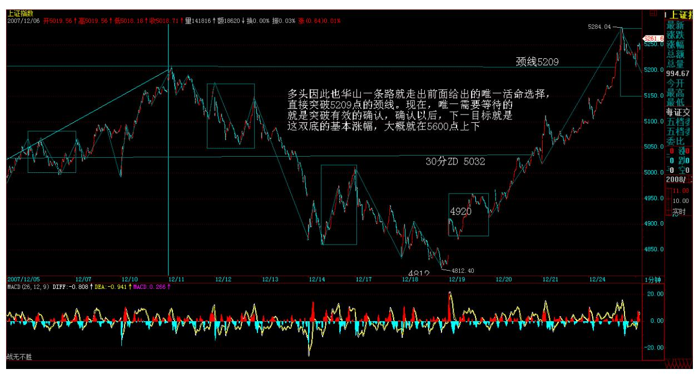

一边把弓箭、大刀、机关枪都擦好了。 市场,总是眷顾最卑鄙无耻 的,而不是赤膊上阵的。周末,快乐。 做账行情,突破颈线待确认 (2007-12-24 15:24:04) 自从有了开放式基金,年末这轮做账行情就 变得常规性了。多头因此也华山一条路就走出前面给出的唯一活命选 择,直接突破 5209 点的颈线。现在,唯一需要等待的,就是突破有 效的确认,确认以后,下一目标就是这双底的基本涨幅,大概就在 5600 点上下。确认不了,那就回去再震荡震荡等机会。正如周末所 说,多头的大喇叭在周末风起云涌,从今天骤然增加的成交量就知 道,被忽悠的不在少数。当然,进进出出,都很正常,关键是能把 5209 点站住,这样,出去的还会进来,因此,今天进来的,也不一定 有什么大问题,不过,超短线在 5209 点站住前被折磨一下,那是很 正常的。 技术上,日线的顶分型没有出现,1 分钟走势中的第二个中 枢也没出现,因此还是一个睡觉局面。当然,由于这次拉升不少,因 此这第二中枢有比较大的震荡幅度也是很正常的,因此要有点心理准

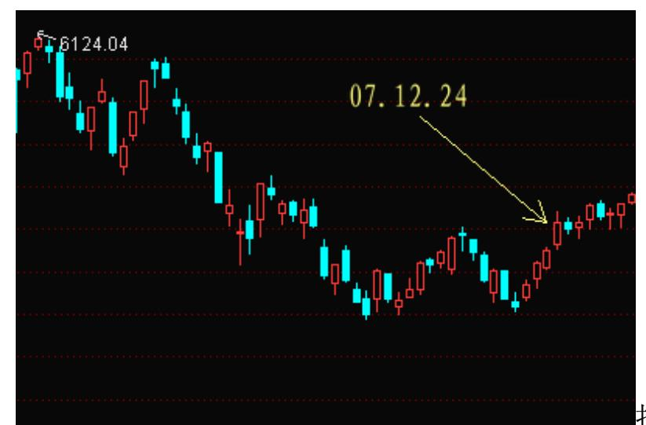

备。 80 技术上,对多 头最理想的走法就是,现在 5209 点上下震荡出 1 分钟的第二中枢, 然后再上,接着一个大的跳水,确认 5209 点真的站住,顺便把那第 二中枢扩展成 5 分钟级别的第一个中枢,这样,后面的走势,就有可 能向 5 分钟的上涨发展,这当然是牛且稳健的走法所需要的,能不能 走出来,就看多头的能力了(后续走势为此类)。 个股,去年,工行 等这时候暴拉,今天,那神油们大有再工行一把的势头,不过这两种 情况是有区别的,去年是上涨途中,今天是反弹途中,就算行为、目 的类似(毕竟大家伙拉市值快),但力度肯定要差点的。至于其他股 票,就看里面人的心情,需要做账好看点的,就用力点,否则,反而 会利用这机会洗洗盘,年底了,从来就是这点破事,没什么可说的。 先下,再见。

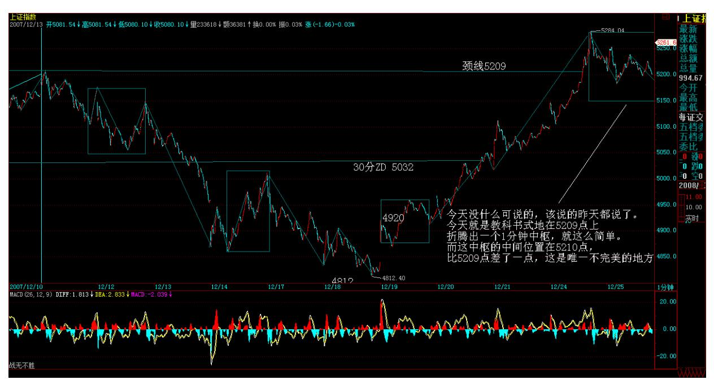

5209 点,教科书式震荡(2007-12-25 15:16:24) 今天没什么可说的, 该说的昨天都说了。今天就是教科书式地在 5209 点上下折腾出一个 1 分钟中枢,就这么简单。而这中枢的中间位置在 5210 点,比 5209 点差了一点,这是唯一不完美的地方。

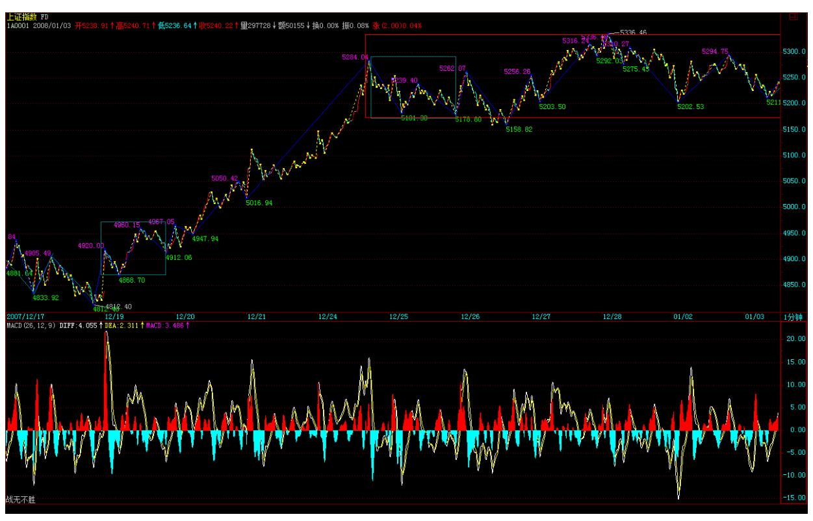

一般来说,这种调整,关键看 5 日线,只要这线不破,调整的级别就

不会高。(思考题:为什么是 5 日线而不是其他线,用本 ID 的理论 可以很合理地解释,请给出。) 操作上,有本事的,手脚麻利的,就 利用这个震荡上下折腾,换股、打差价都可以。没本事的,就张大 嘴,给出一副很入迷的样子,看着这上下折腾如何上下地给折腾了。 后面的发展无非三种:最坏的,这里震荡出第三类卖点,然后就形成 日向下笔的较大调整;一般的,就是震荡出一个更大级别的中枢,把 1 分钟级别的走势给扩展成 5 分钟级别的;最好的,就是走出第三类 买点,不过由于已经有了两个中枢,所以后面即使不背驰,也进入该 小心的时候,而更可能的情况就是出现背驰,然后再回跌构成更大的 中枢。 从上面的分析知道,除了第三种情况中最强势的不形成背驰继 续 1 分钟中枢上移的情况,其他情况都是至少最终要搞出一个更大级 别中枢的,所以,中枢震荡的操作,就是更为重要了。 中枢震荡,除 了打差价外,对于散户,最好就是不断换股,当然,这需要你对板块 的轮动特别有节奏感,因为在上升中途的震荡中,往往个股行情少不 了,特别是题材或中小盘的。震荡高点砸出短线钱途不大的,震荡低 点买入短线钱途更

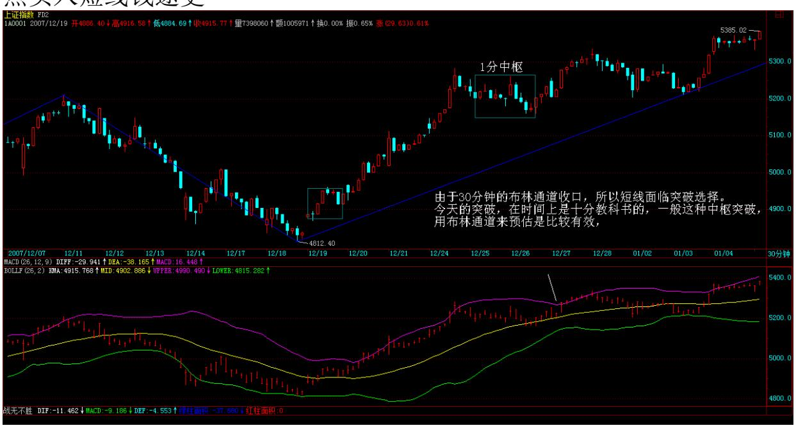

大的,这样你的效率是最高的。 如何判断一个股票有没有短线钱途? 这种问题就没必要问了,你说一个刚顶背驰的股票有钱途还是刚开始 第一次中枢上移的股票有短线钱途?你说一个刚进入大阻力区的股票 有短线钱途还是刚确认脱离阻力区的股票有短线钱途?其他的情况, 可以自己去摸索,归根结底,图形告诉你一切。 当然,当下的中枢选 择哪个级别的布林通道,这必须根据中枢的对应图形来选择,不是见 任何级别的布林通道收口都是有效的。这就如同MACD 在背驰判断的作

用。有些人永远整不明白,是走势类型的分解是本,而不是 MACD,否 则,研究走势类型干什么?还不如直接看 MACD就可以。可惜,光看 MACD,根本无效。

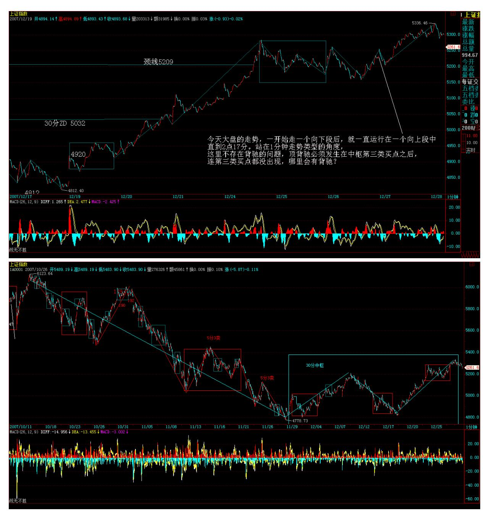

今天大盘的走势,一开始走一个向下段后,就一直运行在一个向上段 中,直到 2 点 17 分。

站在 1 分钟走势类型的角度,这里不存在背驰的问题,顶背驰必须发 生在中枢第三类买点之后,连第三类买点都没出现,哪里会有背驰?

后面的走势,很简单,只要向下笔的回跌不回到 5240 点下,那么就 是第三类买点成立,后面只有两种情况:一、顶背驰回跌构成 5 分钟 中枢;二、没顶背驰,继续中枢上移构成第三个 1 分钟中枢。

87面临短线突破选择(2007-12-26 15:12) 今天一开盘就受到一个电话 严重的嘲笑,什么内容,等一下再说。不过,收盘了,本 ID 也要先 来一个超级简单的问题刁难一下各位,请问:今天的高低点和昨天说 的中枢中间位置 5210点有什么关系? 注意,这种关系并不一定这么 精确的,只是,这次的震荡确实太标准了,连一点误差都没有,不好 玩。显然,利用这种数值关系,知道高点就能预先算出低点大致的位 置,反之亦然。不过,这都是参考性的,关键还是看图形本身。 由于 今天没什么可说的,所以顺便上一下课。昨天的思考题太简单,绝大 多数人都知道和分型的关系,所以就不用多说了。 由于 30 分钟的布 林通道收口,因此短线将面临突破的选择问题,注意,本 ID 这里说 的是昨天那三种选择的选择,不是说一定要突破出一个方向,例如, 突破为更大级别的震荡也是一种选择,这是时间换空间的选择。 最后 两天,做账的如何选择,就决定了突破的方向与类型。但如何走其实 根本没什么特别的意义,关键是把年 K 线给决定出来,然后明年的走 势,就有了一个基本的参照标准,这才是最关键的。 当然,按照基金 的品性,以及他们的奖金分配原则,如果没有大的事,你说这群人会 自己毁自己吗? 个股不想说了,因为今天一开盘被严重嘲笑。嘲笑对 象是一只刚上来的股票,N 个月前,今天打电话来的朋友也曾过来, 拿着 N 百万股这股票,要以 12元的价格给本 ID,本 ID 当时嫌太少 了,又嫌太贵了,说他黑,1 元的竟然卖 12 元,抢呀。 结果,今天 被严重嘲笑。

晕,这世界太疯狂,不过本 ID 也很高兴,因为极端便宜地投了类似 的企业,不过要等等才能上。希望这玩意到 1000 元吧,以后按比价 关系,本 ID 按 1500元卖给今天打电话来的坏蛋。祝各大小坏蛋们都 快高快长,万事顺利。

教科书式突破如期而至 (2007-12-27 15:15) 昨天说了,由于 30 分 钟的布林通道收口,所以短线面临突破选择。今天的突破,在时间上 是十分教科书的,一般这种中枢突破,用布林通道来预估是比较有 效,这点在课程里已经说过。 当然,当下的中枢选择哪个级别的布林 通道,这必须根据中枢的对应图形来选择,不是见任何级别的布林通 道收口都是有效的。这就如同 MACD 在背驰判断的作用。有些人永远 整不明白,是走势类型的分解是本,而不是 MACD,否则,研究走势类

型干什么?还不如直接看 MACD 就可以。可惜,光看 MACD,根本无 效。 今天大盘的走势,一开始走一个向下段后,就一直运行在一个向 上段中,直到 2 点 17分。站在 1 分钟走势类型的角度,这里不存在 背驰的问题,顶背驰必须发生在中枢第三类买点之后,连第三类买点 都没出现,哪里会有背驰? 后面的走势,很简单,只要向下笔的回跌 不回到 5240 点下,那么就是第三类买点成立,后面只有两种情况: 一、顶背驰回跌构成 5分钟中枢;二、没顶背驰,继续中枢上移构成 第三个 1 分钟中枢。

注意,纯理论上说,一般第二个中枢以后的第三类买点都没有介入价 值,你只要持有等到整个走势类型完成就可以,因为根据正确的操 作,你必须在第一个中枢的第三类买点就完成最后的介入,以后的都 是没多大意义的。 由于如果这次又回跌到 5240 下,那么其实已经有 9 段线段的震荡了,所以也将扩展成 5 分钟中枢,所以后面的走势, 无论是否形成第三类买点,都只有两种选择:一、继续 5 分钟震荡。

二、继续 1 分钟中枢上移。 你根本无须预测,让市场自动当下告诉 你。当然,如果你看不懂市场的语言,那是你自己的问题,而不是市 场的问题。 站在中线角度,其实哪种走势都没大问题。为什么?即使 是在这里震荡出 5 分钟甚至 30 分钟中枢,最终只要出现第三类买 点,就可以延伸出 5 分钟或 30分钟的上涨类型,这在中线上更牛。

至于,继续 1 分钟中枢上移,只不过把最终必然要形成的 5 分钟中 枢位置也同时上移,站在中枢角度,第一个 5 分钟中枢太高,反而不 一定是好事,因为,一旦不能构成第二个,就只能是盘整走势,这 样,反而后面回杀的力量更大。

市场,总是在这种各级别的相生相克中前行,一条筋思维注定没戏。 当然,站在日线角度,用分型去判别,现在根本没有任何值得危险的 地方,所以,可以继续睡觉。至于,是明天大涨,还是元旦后大涨, 这根本没有任何区别。只要图形没有信号,一切继续冬眠中。 今天某 人继续打电话骚扰本 ID,看这某股票上市第二天的表现,本 ID 无话 可说,谁让自己给别人好不容易逮着一次,留下一个 N 个月前送上门 12 元不要,现在12 元的平方看戏的大笑话。现在只能化悲痛为食 欲,PE 多点玩意搞废这老骚扰本 ID 的坏蛋。 没有这些好玩的东 西,一切都像机器,人生就没乐趣了。

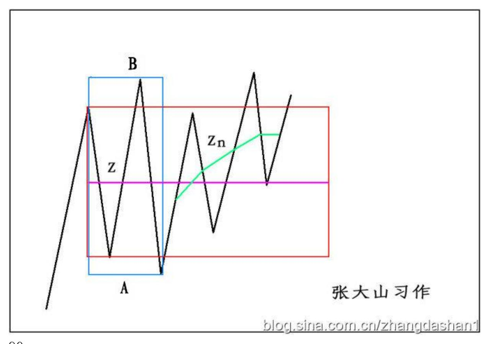

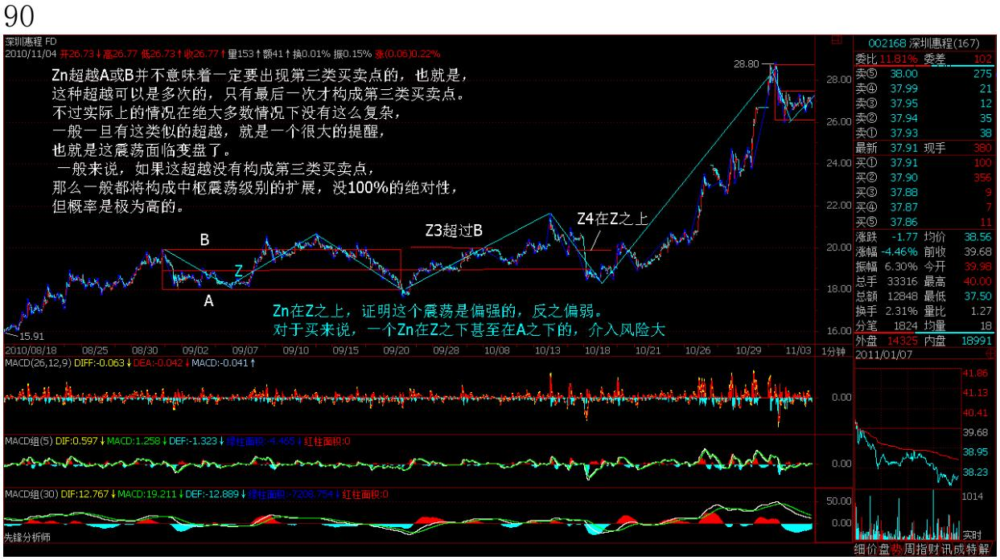
