教你炒股票 92:中枢震荡的监视器\

一般来说,这个指标是一个监视。这里,存在着一种必然的关系,就 是最终,Zn 肯定要超越 A 或B,为什么?如果不这样,就永远不会出 现第三类买卖点了,这显然是不可能的。 但必须注意,反过来,Zn 超越 A 或 B 并不意味着一定要出现第三类买卖点的,也就是,这种 超越可以是多次的,只有最后一次才构成第三类买卖点。不过实际上 的情况在绝大多数情况下没有这么复杂,一般一旦有这类似的超越, 就是一个很大的提醒,也就是这震荡面临变盘了。 一般来说,如果这 超越没有构成第三类买卖点,那么一般都将构成中枢震荡级别的扩 展,这没有 100%的绝对性,但概率是极为高的。

有了这些知识,对于中枢震荡的可介入性,就有了一个大概的范围。 对于买来说,一个 Zn 在 Z 之下甚至在 A 之下的,介入的风险就很 大,也就是万一你手脚不够麻利,可能就被堵死在交易通道中而不能 顺利完成震荡操作。 同时,那些 Zn 缓慢提高,但又没力量突破 B 的,要小心其中蕴藏的突然变盘风险,一般这种走势,都会构成所谓 的上升楔型之类的诱多图形。这种情况,反着,同样存在下降楔型的 诱空,道理是一样的。 另外,中枢震荡中次级别的类型其实是很重要 的,如果是一个趋势类型,Zn 又出现相应的配合,那么一定要注意变 盘的发生,特别那种最后一个次级别中枢在中枢之外的,一旦下一个 次级别走势在该次级别中枢区间完成,震荡就会出现变盘。(娇注:类

似 5 浪上涨,3 浪整理在小 4区间,构成大 1 大 2 浪) 结合上布 林通道的时间把握,这样对震荡的变盘的把握将有极为高的预见性 了。 93

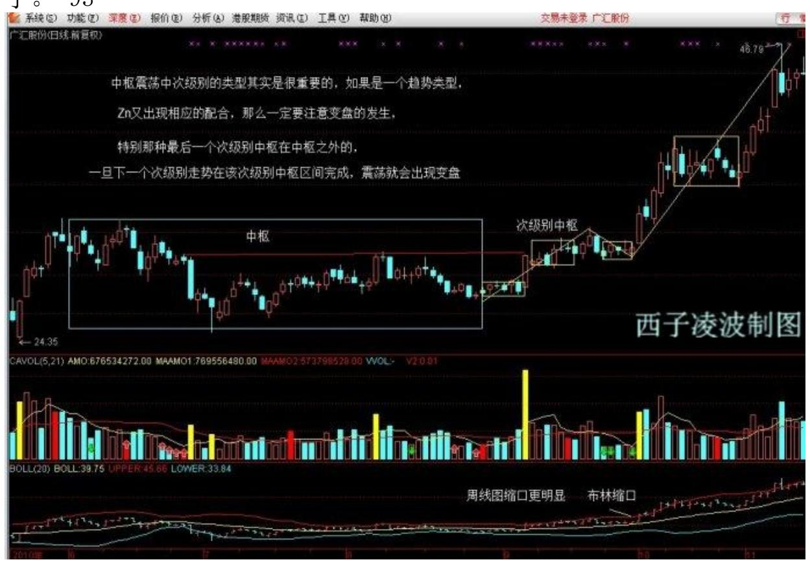

除了特殊的情况,Zn 的变动都是相对平滑的,因此,可以大致预计其 下一个的区间,这样,当下震荡的低点或高点,就可以大致算出下一 个震荡的高低点,这都是小学的数学问题,就不说了。

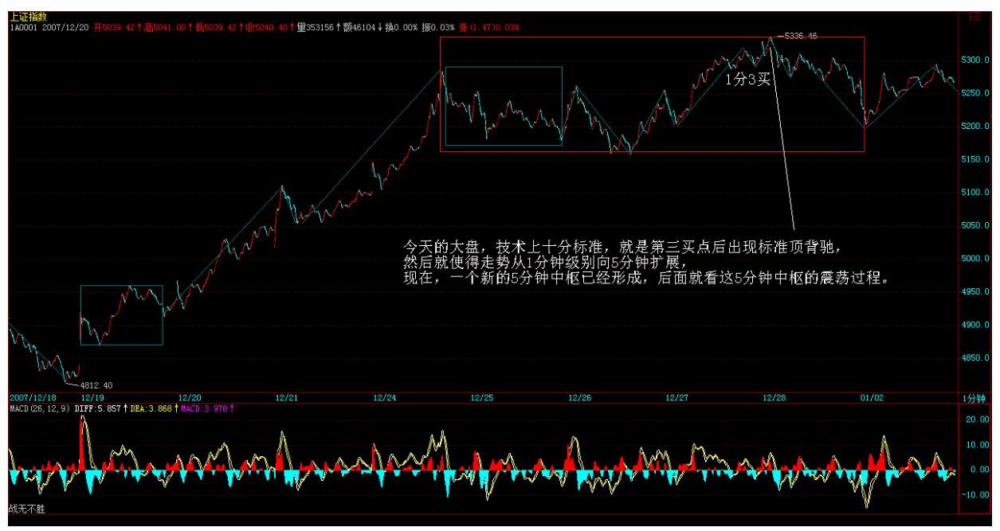

94 教你炒股票 92:中枢震荡的监视器 2007 年低调收盘预示明年行 情性格 (2007-12-28 15:27:45) 其实,这句话是有问题,今天指数虽 然低调,但个股并不是都低调,例如本 ID 说那些股票,大多数就都 继续在上攻。这也预示了明年的一个基本特征,指数油水不太大(除 非期货很快出来),而个股油水不少。关于明年的分析,一早已经给 出,请看《2008 年行情展望》一文。2007-12-20 15:59:05 今天的大 盘,技术上十分标准,就是第三买点后出现标准顶背驰,然后就使得 走势从 1 分钟级别向 5 分钟扩展,现在,一个新的 5 分钟中枢已经 形成,后面就看这 5 分钟中枢的震荡过程。

95 教你炒股票 92:中枢震荡的监视器 估计这次 4800 点上来的 1 分钟走势,虽然很标准,但也不一定都能分解对,下面有图,其中 286、296 是第一、二个中枢的第三类买卖点。297 顶背驰后,最少跌 回287 下,这点已经完成,所以这 5 分钟中枢的扩展是逃不掉了。

下面的问题,很简单,就是这5 分钟的走势类型究竟是一个上涨还是 盘整,如果是上涨,这是第一个中枢。明年的第一个问题,就是这 5 分钟中枢的第三类买卖点问题。 明年,小心"井",这就是本 ID 年 [末最好的忠告。 年末的功课,就是把"2008 年行情展望 2007-12-20](http://blog.sina.com.cn/s/blog_486e105c01007xa0.html) 15:59:05"提到的箱体给算出来,这是明年走势的一个基本框架指 导。 去年年底有 6 元的000999,今年下半年有 8 元的 600737 当各 位的学费,但现在没有,因为明年的行情,本 ID 的原则是把该原有 的完成了,新的没有什么好选择,毕竟明年不是前两年,土都耕种了 两三年,明年能收割好就是真本事,后面,是该施肥增加肥力的时候 了。 说一句有点恶心的话,资本市场里最好的肥料,就是人。这话恶 心,却是真相与事实,关键是,不要把自己当成了肥料。 为了让各位 不至于成为肥料,明年

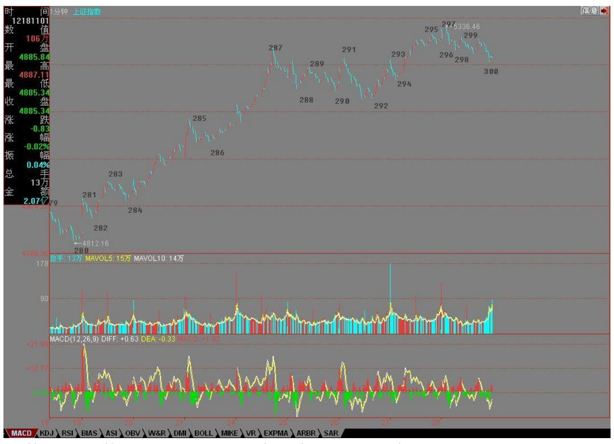

指数无论到什么地方,这里只有绿色,就是让各位时刻提醒自己,至 少可以知道,如果当了肥料,就见不到新苗了。 先下,再见。 注 意,下面的 300 并不是已经完成的。

指数疲软下的个股高潮不断如同这题目,第一天的行情继续预示着本 年行情的特点,指数油水不大,个股油水不少,这已经在去年末反复 说到了。用句概括性、动感更大的口号,就是:疲软指数,高潮个 股。 当然,指数也不会无限制地疲软,指数往往会表现出痉挛式走 势,突然抽起来,然后就再抖个不停。抽两下,抖十下,大概就是今 年指数上经常会碰到的。哪天指数不痉挛,而是一往无前起来了,那 反而要小心。 技术上,指数就是继续去年末那 5 分钟中枢的震荡, 在第三类买卖点出现之前,继续抖个不停。 个股上,没什么可说的, 本 ID 说的那些股票,今天又有好几只创出 6124 点来的新高,对于 个股来说,6124 点的高位就是一个强弱分界,突破站稳这位置,行情 就会更猛烈。例如,600737 就是一

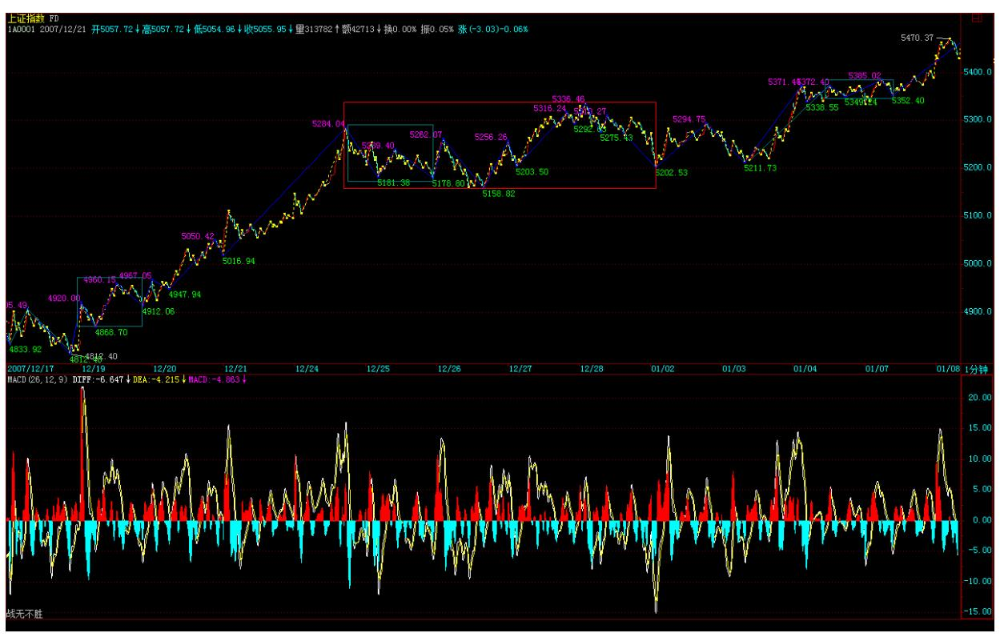

个好例子,14 元多是 6124 点下来的高位,突破站稳后,现在已经到 20 元上了。 当然,对于具体个股,突破那位置后肯定都有反复,对 待这种反复,最好的就是顺着做短差,把差价搞出来又不丢失筹码, 不过这对操作水平要求高。还有一种就是定好 5 周线之类的中线位 置,只要调整不破就拿着,例如,你看看 600737,晃来晃去,把无数 人恐吓下去了,你看他突破调整后什么时候有效破过 5 周均线? 面 包会有的,今年是越早越安全,现在,个股机会远大于风险,就算个 股年线要收阴,怎么也要先搞一个上影,而越到年中以后,就难说 了。今年是先把粮食打足了,如果能有第二次机会最好,没有,也不 会饿着了,一年的面包也会有着落了。 千万别追高买任何股票,如果 错过了前面的,就在低价与二线中找那些反应迟钝但有资金驻守的。

都是人,都要吃饭,只要有资金驻守,总要开张的,否则一年的花费 谁给呀? 至于大家伙,技术好的,就等抽筋那几下抽点血,抖的时候 就不一定陪着玩了。 先下,再见。

向 5600 高地攻击前进 站住5209 点颈线,下一位置就是 5500-5600 一线,这是十分简单的技术问题了。由于这个 5 分钟的中枢震荡还没 有震荡出第三类买点,所以说这颈线突破 100%有效是不严谨的。但生 活有时候并不太严谨,否则就太无趣了,所以,没有 100%的把握已经 确认的事情,我们依然可以喊:向 5600 高地攻击前进。

做股票,说白了就是忽悠着冲锋陷阱,只是你去忽悠别人,别让别人 忽悠你。既然 08 年属于早收割早有面包的年份,我们当然要在年初 就大力忽悠。说实在,"向5600 高地攻击前进"这点小目标,说出来 都不好意思,也太低了,不过先忽悠低的,现在的人胆子小,毒药要 慢慢喂,不像以前,说年内冲 10000点,都有人和你急,他愣要说 10000 太低,还是 12500 比较好,50 个 250 呀。 如果要冲指数, 当然就轮到大家伙抽风的时间,但一定要认清楚现在他们抽两下抖 10 下的本性,现在是刚一阳复始,不适宜大家伙们太剧烈的运动的。 其 他个股,去年下半年基金牛了一把,私募都憋坏了,今年肯定要报仇 的。所以,收集好的,肯定是按节奏继续搞,没收集好的,就加快摩 擦速度,不过那些现在都没收集好的,都是有点毛病的,算了,反正 每次都要有人最后垫背的,没什么可说的。 个股的大节奏昨天说的, 分水岭就是 6100 点相应的位置,对于中低价的,可能 530 那次是另 一个更高的位置,如果在春节前后都不能有效突破这些位置,那这股 票今年的前途就有问题了。当然,不排除有些最后当炮灰的庄家就是 这么慢,但这里说的是正常的节奏,不说炮灰。 在那些分水位置上, 肯定都要洗洗,如何洗,那是手法问题,看明白了,这股票就是给你 送钱的,来这里,希望是真学会点什么。否则,白送股票给你也没 用。例如,600737,8元这么明确告诉是送学费的,但估计也没几个能 真把钱给挣到,这难道也是本 ID 的错? 再说一遍,本 ID 在这里只 是陪练,能学到多少,还只能靠自己了。先下,再见。

多头,有了冲动就要喊 (2008-01-04 15:12:12) 今天走势最大的意义 是什么?站在本 ID 理论的角度,就是突破 5336 使得周线上(1, 1)的状态延续,在周线的(1,0)出来之前,也就是周线顶分型出现

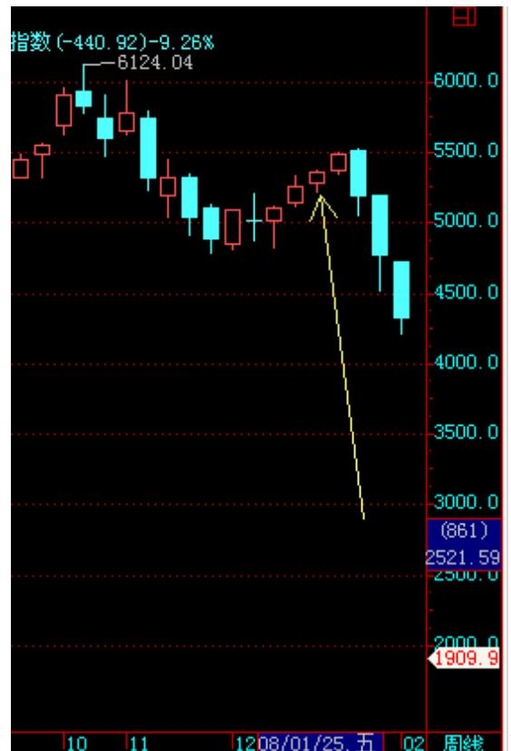

之前,尽管持股睡大觉。炒股票,对于 中短线来说,有什么比周线都出现向上笔的延续更理想的状况?在这 种状况下,你的利润就有了一个超稳定的保障系统给于最强有力的保 障并使得该利润尽可能地延伸。那些每天如惊弓之鸟一般的,请好好 复习一下历史图形,如果那让你每天惊弓之鸟一样的震荡连周的顶分 型都震荡不出来,那又有什么可惊弓之鸟的? 请复习一下历史走势, 看看从 3563 点到 6124 点的走势,按照本 ID 理论里最低级的周顶 分型就足以让所有的利润得到最大的延伸。 当然,如果技术高的,在 周的(1,1)延伸里,也可以利用更低级别的走势搞出不少差价来, 或者通过不同级别的震荡换股达到利润最大化。但这是对技术高的说 的,如果没那技术,就天天睡觉,顺便可流点口水,每天收盘很无耻 地看看周顶分有没有出现,然后继续更无耻地睡大觉,这样就足以让 你超无耻地比很多人厉害了。 103

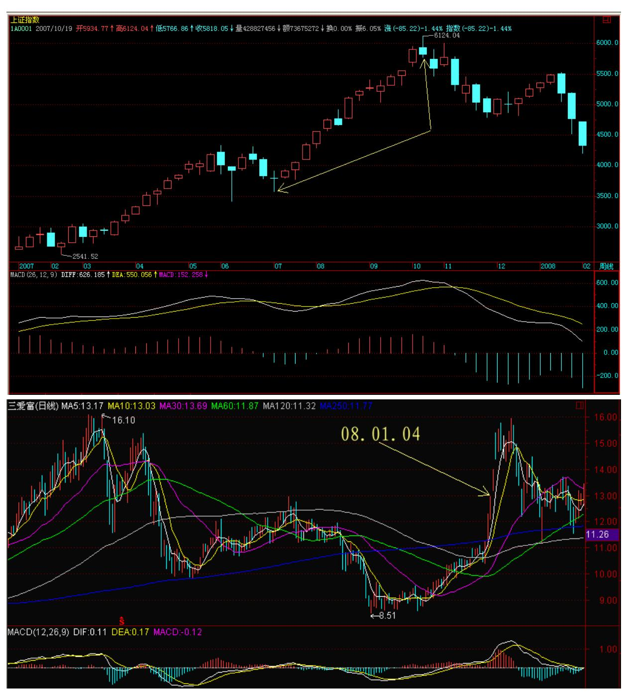

来本 ID 这里,关键是学东西。

如果太计较自己有没有这股票,是不是赚了,那你的水平永远提不 高。还是用本 ID 的股票为例子,一个最令人深恶痛绝的股票: 600636。你是否在里面赚钱并不重要,关键是你能否在这经典走势中 学到点什么。看看这经典的走势:一个 ABC 的下跌,其中的 B 段在

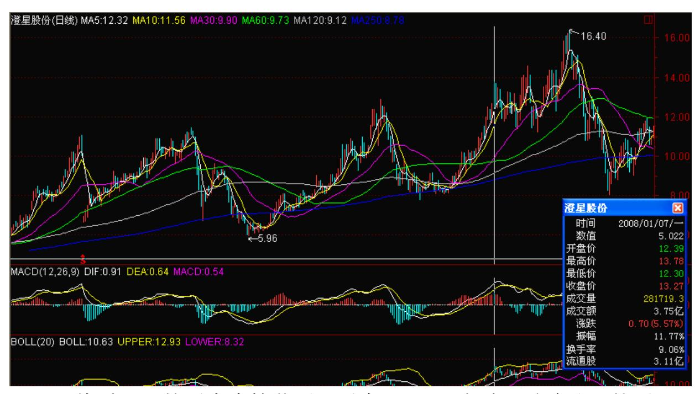

120 天线受阻,然后大力挖井后回手在 120 天突破回试确认,然后迅 速回到井的上沿 13 元附近,一个超完美的井。后面干什么?就是要 确认这井的上沿能否站住的问题了,这都是最标准的走势。如果对这 类似的走势烂熟于胸,难道你还不能自如地应付类似的走势? 600078、000938 等的是另一类型的走势,也是超经典的,请当成作业 分析一下。

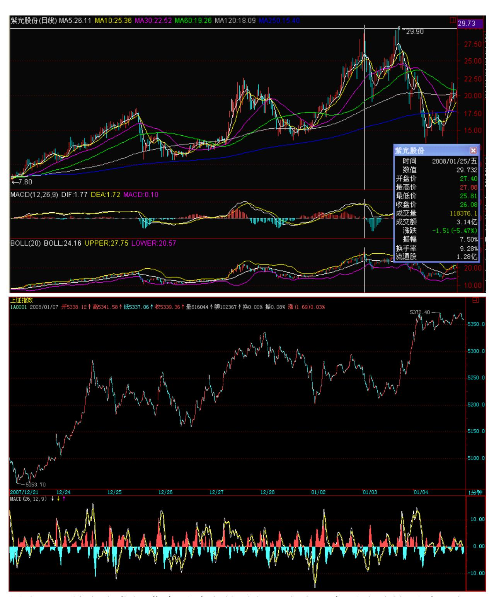

周末,又是多头发挥嘴皮子功夫的时候。多头,有了冲动就要喊。上 升行情,本质上是喊出来的。就是上升多头爽了,然后就喊,见人就 喊,喊得满大街的人都很冲动,结果就又上又升了。周末,多头就多 喊喊吧,爽了不喊会憋坏的。 至于超短线的技术分析,由于第三类买 点还没有整出来,因此今天的突破并没有 100%的保证,这突破是否有

效,就看多头周末的嘴皮子功夫与喊功的诱惑力了,把大家都喊爽 了、都冲动了,大盘自然就有效突破了。

勇戴金箍大翻筋斗云 (2008-01-07 15:12:36) 这题目不是紫霞仙子给 那只没良心的死猴子写的情书,而是关于现实股市的现实记录。 就算 那死猴子,压在五指山下也要吃点铁丸喝点铜汁,而现在公历新年刚 过,农历新年还没到,就算玉帝老儿也没资格让各路资金从此就饿 着;就算有那资格,思凡下界妖魔鬼怪一番的,谁也挡不住。 因此, 今天因为飞天烤鸭念出的2008 第一次紧箍咒,也只能象征性地走了次 过场。确实,当鸭子,也应该本分点,人家八戒还没上演飞天大乳 猪,你急匆匆地扒光了毛来个鸭子大裸飞,还烤鸭版本的,这就有点 过了。 过了就过了,修正了再来。这世界上,最折磨人的就是饿啊, 一饿人就变态,资金饿了股票就变态,这点,大概连紧箍咒也只能不 断升级才能走过场。 因此,今年的紧箍咒版本,肯定是不断升级的, 各路资金,就根据自己的承受能力以及市场的总体状况,选择自己筋 斗云的时机与方式。 大概现在没有人会反对本 ID 一直强调的两点: 一、疲软指数,高潮个股,指数让他抽两抽抖 10 抖;二、先下手才 会早点有面包,晚了,等紧箍咒变成大铁笼,我们就啃着面包看笼里 的八戒变飞天大乳猪吧。 今天的走势,没什么可说的,周线依然 (1,1),看看你自己的股票,他的周线是什么?然后继续睡觉。当 然,如果你心特别急,那就看日线的,如果日线都是(1,1),那你 还急什么? 不过,本周出现一次有点力度的震荡是很正常的,毕竟 6124 点下来的所谓双顶颈线 5462点已经在面前,震荡一下,身心舒 畅。先下,再见。 109

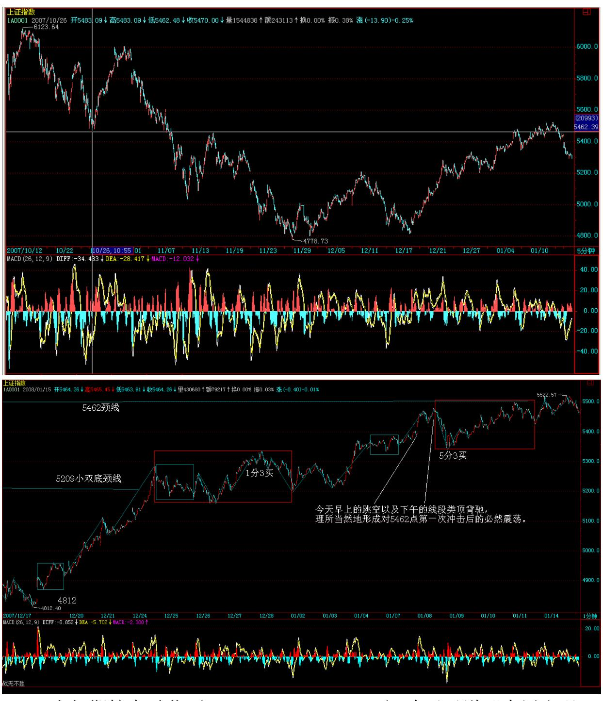

5462 点如期较大震荡 (2008-01-08 15:21:47) 昨天已说"本周出现 一次有点力度的震荡是很正常的,毕竟 6124 点下来的所谓双顶颈线 5462 点已经在面前" ,今天早上

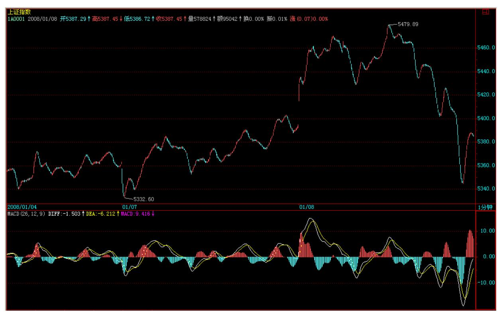

的跳空以及下午的线段类顶背驰,理所当然地形成对 5462 点第一次 冲击后的必然震荡。

本 ID 昨天后面还说了:"震荡一下,身心舒畅。"今天收盘后,被 震荡一番的诸位大概每个毛孔洋溢的快感都如江水滔滔不绝于掩耳盗 铃儿响叮当我们年轻时五月风光正迷人如蚁月如刀削面子曰俺这旮旯 贼好。

其实,这些走势都是超技术化的,而 5462 点,也是一个超技术化的 点位,这点位上下震荡一下,不仅必然而且必要。后面的问题只有两 个:震荡的形式以及可能的结果。 开始上课。(本课堂可以自由出 入,绝对不点名,特别是关门点名,对公然离开课堂者也绝对不拳脚 相加,各位可以大肆交头接耳、手舞足蹈、谈情说爱、吃葡萄不吐葡 萄皮不吃葡萄反吐葡萄皮。) 无论任何情况,首先都可以很教科书化 地给出震荡的形式,按强弱分的一个完全分类,对应着相应的结果: 1、如果在今天跳空附近站住,这样,5200 点那 5 分钟上来的 1 分 钟上涨就形成,该 1分钟上涨结束后,就是对应那 5 分钟的第三类买 点,然后,就有绝大的可能形成 4800 上来的 5 分钟上涨,最坏,也 就是一大的 30 分钟中枢。 2、如果在 5360 点那 1 分钟中枢处站 住,这样,对原来 5

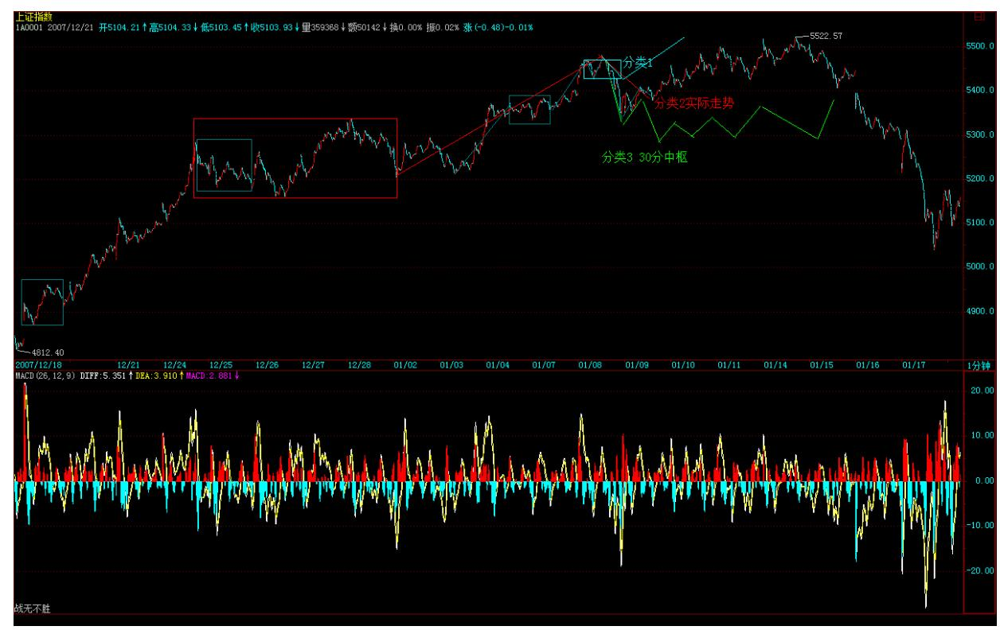

分钟中枢的 1 分钟向上只是一个盘整类型,后面站住形成一个第三类 买点,后面形式一个大的 5分钟中枢的机会更大,当然也有突破爆发 形成继续中枢上移在更高位置形成 5 分钟中枢的可能,但一般来说, 一个盘整类型的次级别偏移后的第三类买点,总是不那么激动人心。

3、如果跌回 5200 点上那 5 分钟中枢才站住,那就没什么可说的, 一个大的 30 分钟中枢就此形成。 所以,纯分类化分析,不管是哪种 情况,除了最强那种继续 1 分钟中枢上移,其余的都将面对一个至少 5 分钟中枢的形成,最坏还要形成一个 30 分钟中枢,唯一需要确认 的,只是这个中枢震荡的位置高点还是低点,这对操作,本质上没有 任何影响。 而实际上,大盘今天马上就把第一种情况给否了,所以, 只要把第二、三种情况与实际对应好就可以。 以上,只是顺便把思维 的方法演示给各位看,而在实际中,这些分类、判断 1 秒钟就应该预 先反应出来,而有了这完全分类的预先操作方案,你还怕什么? 震荡 是好事,特别对手脚麻利、技术高强的,最好就荡个千把回,3000%的 利润都出来了。当然,对于技术不好的,震荡就是坐电梯,上上下下 享受;对于心态更不好的,那震荡就是噩梦,左右被巴掌。 究竟自己 属于哪种,请对号入座。 注意,本 ID 这里,是高低皆应。有些话是 对高点的人说的,例如如何买卖点、背驰、震荡操作、换股、板块轮 动之类的;有些是对没时间、短线反应慢的说的,诸如周的顶分型、5

周线、持有睡觉之类的;所以,也请对号入座,并不是每一种操作都 适合任何人的。 甭说本 ID 最近少写课程,每天解盘的课程的陪练意 义可不要小视了。至于课程,写是要有兴致的,本 ID 最近兴致在和 各位陪读历史,股票就先且陪练吧。股票,陪什么都可以,就是不能 陪套。

上涨动力,来自清洗 (2008-01-09 15:12:50) 其实,不仅是股票,这 世界游戏的一个基本玩法,就是"上涨动力,来自清洗。"没有清 洗,所有人都成功,所有人都吃香喝辣的,那就不是全球化资本的美 丽新世界了。 到达顶端的,永远只能是少数人。当然,股票上涨的动 力,更离不开清洗。没有中途下车的,哪里有最后被落井下石的?没 有踏空的、被洗的,哪里有最后被套的、接棒的? 藐视技术的,最终 只会被技术所藐视。对付震荡、清洗,本 ID 理论里早给出了最好的 办法:分型。请问:如果震荡连(1,1)在日线上都没打破,有什么 可说的呢?对于技术高的,震荡后就要回补,如果没这个反应能力, 就不做震荡,这个道理说了N 的 N 次方遍了。 震荡,对于有准备的 个股与资金,就是给了一个更好的上涨理由,越震越强。抛下一批 人,轻装好前进。所以,很多股票,在震荡一下后就开始很无耻地创 出新高。 无耻,一定是市场上最荣耀的事情。 本 ID 反复说了,年 初越无耻越有面包,1 月 10 日都没过,就想着逃命,那干脆今年什 么都别干了,回家学君子剑吧。

技术上的情况昨天早说了,就是第二、三种情况的选择,5 分钟还是 30 分钟中枢的选择。不管是什么,最终都以是否有效站住 5462 点为 标志,站住,就再狂飙突进一次;站不住,就歇歇等能量聚集够了再 来。 而个股并不大关心这些,因为资金很饿,管你站不站住什么傻点 位,市场这么多资金,就算指数大跌,个股行情也依然不会含糊。所 以,本 ID 早给了各位一个明示:疲软指数,高潮个股。 今天谁能越 早把面包赚到手,就是牛人。年初不大胆,难道等着年底倾家荡产? 慢慢地,锅热了,大家伙也会变只蝴蝶满天飞。 在站住 5462 点前, 震荡依然继续,震荡中会有三种人:随便抽血的、看着周顶分睡觉 的、被左右巴掌的。你希望成为哪一种? 先下,再见。

把下面的指数剧本告诉你(2008-01-10 15:19:00) 剧本早写好了,本 来瓜田李下,不想八卦。

但本 ID 只是想证明一件事情,就是在资本市场里,就算把剧本告诉 你了,绝大多数人最后还是要在井里的,好一点的,就是上上下下去

为电梯卖广告,不信?走着瞧。 告诉各位一个总原则,牛市里,深圳 成分股是一个先头部队,十几年了,从来没改变过。为什么?说白了 太简单,因为深圳一大早就爱看成分股,操控几十只股票总比搞 1 千 几百只股票容易吧。自从 96 年那次把琼民源之类深圳成分股搞得漫 天鸡毛以后,这特色就算留下了。这里还有资金方面的一些历史性与 结构性原因,具体就不想八卦了,总之,这是一个总原则。 所以,所 有关于上涨的有野心的剧本,第一原则,就是先把深圳成分股给挑出 一片蓝天,如果深成指都没有蓝天,其他指数就更要一边晾着了。 挑 出一片蓝天,关键是测试风向。 至于上海指数,一般都十分技术化。

所有人都知道 3600 的 1/8 是多少吧?这次从 6124 点下来,就是 3/8 的 3600,1350 点,精确位置是 4774 点,结果搞了一个 4778 点,差了 4 点,真够差劲的。 6124 点下来的 2/8 的位置是 5224 点,结果第一拨反弹的位置在 5209 点,差得有点多,都快 15 点 了,太过分啊。 1/8 的位置是 5674 点,这是下一个位置。但由于整 个跌幅的一半在 5451,而那 M 头的颈线位置在 5462,所以这个点位 是任何剧本里都需要折腾的位置。另外,注意,下跌的 2/3 位置在 5675 点,是不是和 5674 点有点类似? 剧本里对 5860 到 5912 这 个缺口很不满意,已经准备了不少胶水,不过还有点缺货,什么时候 把剩余的胶水准备齐了,关键看在 5462 到 5675 点时间段内政策面 的风向,风向不对,那就先把买胶水的钱换成买棒棒糖的,一人一个 棒棒糖,看你要棒还是糖。 风向不变,那就开始倒卖假冒的胶水,一 人分一杯,粘只鸟儿就往天上飞。飞着飞着,突然散了架,剧本的一 节到此结束。 至于下一节,有心情的时候,再告诉你。今天大盘,继 续折腾这 5462 点,看着越来越多人接受本 ID 早折腾早有面包的理 念,本 ID 相当欣慰。

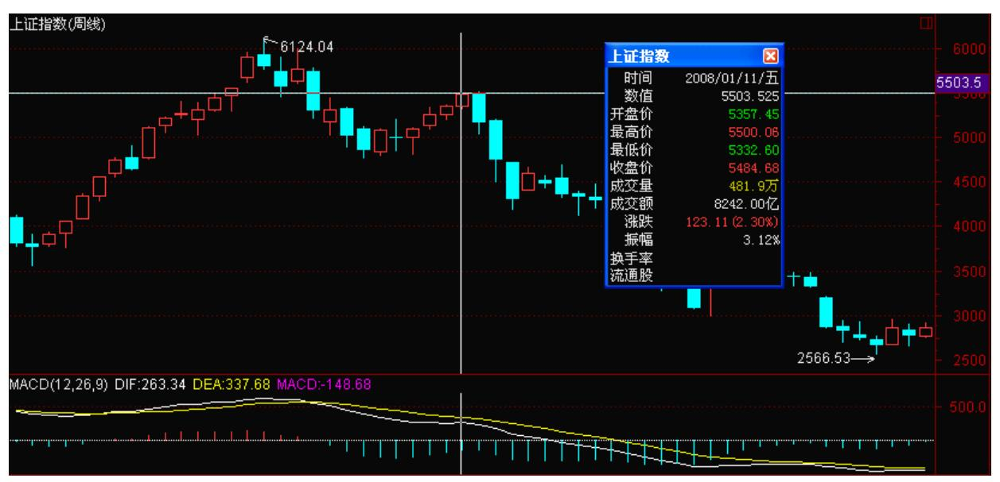

因为饿,所以疯狂 (2008-01-1115:10:16) 世界上最疯狂的是什么? 是饿。这对于资金,也是一样的。今天的大盘,没什么可说。周末效 应了一把,但依然继续对 5462点的震荡确认,今天当然只会是试探性 质的,完全没必要在指数上干些只争朝夕的事情。 但个股上当然不同 了,资金饿啊,春节要买年货啊,年货都在贵 ing,除了那些脑子有 水的,饿绿了眼的资金,哪里管得了什么周末效应。站在周线角度, 下面两、三周是极为关键的,为什么?因为 MACD 的绿柱子在收敛, 而所有的骗线,最爱的就是这种收敛放红途中的突然转折。

当然,这只是技术的可能陷阱,政策面上,按道理,春节前是不应该 有人太干活的。但今天的天气是否如常,没人说得清楚。预测天气这 种事情,完全没必要。 唯一必要的,就是大干快上,把自己安放在一 个绝对安全的位置。管他刮风下雨,有了足够的利润,什么变化都可 以从容面对。 到了 5600 点上下,政策的因数就会变得极为重要了, 新人新思路,市场各方无一不在相互摸索探究中,放个气球,测测风 向,大概还不是问题的根本所在。

这些无聊问题,其实都可以安放到周的顶分型、(1,1)里,对于懒 人来说,没时间探究这些分力之间的游戏,一切都在走势之中。 看 看,周(1、1)依然,日(1,1)依然,你就继续睡觉。 周末,放风 了。先下,再见。

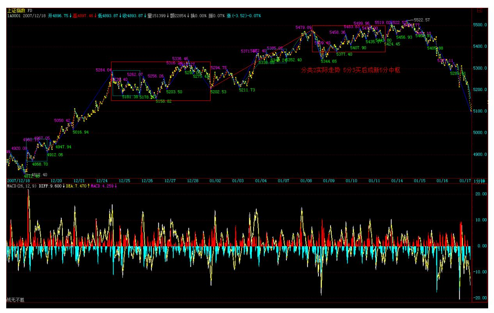

指数犹疑,个股补涨 (2008-01-14 15:10:28) 到了目前这个位置和时 间段,大盘进入敏感阶段。首先,对于多头来说,好不容易到了 5600 点上下这最重要的阻力跟前,绝对不想一个哆嗦就给震回去。但这个 关口确实比较压力大,主要不是技术上的,而是心理与政策面上的。

从政策面的角度,很快就进入春运阶段,因此,对于政策的活动空 间,这几天是最敏感的。如果要有什么花样,这几天的可能性最大。

到了月底,快春节了,大家都有忙的事,而且没人想给中国足球队当 挡箭牌,那群家伙除夕准备给大家添堵,难道还有谁想分担一下被骂 的风险?这种人大概是没有的。 所以,指数在这个时间段犹疑一下, 并不是太严重的事情,目前技术上,继续是原来说的第二种情况,在 5462 点附近震荡出一个 5 分钟中枢,大不了向一个 30 分钟的延伸 去,所以指数依然继续抽两下,哆嗦十下的节奏。 个股上,一些前提 幅度较小的板块开始补涨,由于大家伙这时候不适宜集体暴动,因此 这些补涨后板块的动向就很关键了。现在市场越来越大,参与的资金 成分越来越复杂,只要指数形态不破坏,板块机会还是很多的。 到 5600 点上下后,震荡的幅度会有所加大,现在最好的策略,就是往上 拱,拱一下,震几下,这样心态、技术等压力就会慢慢破解,千万不 能急,急了,根基就不稳。 技术不行的,中线上,继续看周的(1, 1)保持情况与 5 周均线,短线看日线的相应指标;技术好的,可以

利用 5 分钟震荡的节奏进行板块操作。 大盘压力期下的多头策略 (2008-01-1515:09:40) 已经反复说过,目前大盘进入压力期,首先是 政策的敏感期,其次,技术上也有相应的重压力区在面前,更重要的 是,除了大家伙,板块在基本轮动一次后,很多股票都进入相对的调 整期,这时候对多头来说,确实有点压力。 一般来说,碰到这种情 况,有两种处理的方法:一、跳一次大水,把压力变动力,把不坚定 的赶跑,用空间换时间,加快调整的结束;二、在这里上下震荡继续 磨,让成交量慢慢萎缩下来,以时间换空间,最后取得新的上升能 量。 不管哪种情况,用本 ID 理论的角度看,都是扩展出 30 分钟的 中枢,然后再寻求突破。5462 点这个位置,反复强调,一直不能有效 站住,需要多头努力的事情还很多。 说白了,现在最好有一个不大不 小的利空,这是对多头最好的礼物,否则,现在消息面太平静,反而 对心理上不是一个好的暗示。大盘究竟采取哪种调整方式,其实从 30 分钟的震荡走势中不难发现,一般来说,成交量能萎缩下来,就第二 种方式;否则,并不排除有一到两天让大家再次想起亮晶晶的机会。

个股的节奏以前已经说过了,一般突破 6124 点或 530 高位的股票, 都会相应有所调整,如果能站住,就会有第二波,现在很多股票都处 在这种状态,等待大盘最终调整的结束。 只要有一点机会,多头都会 往上面去挑逗那 5600 点的重压力,但折腾少不了,必须耐心才有好 果子。 121
