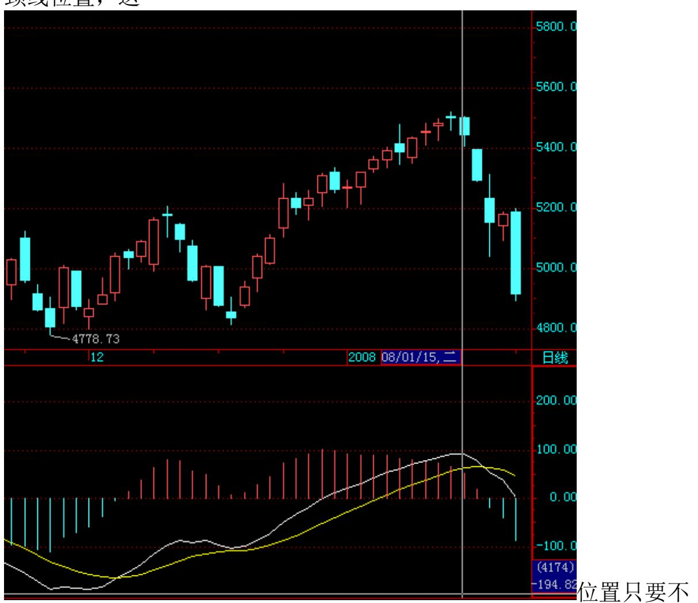
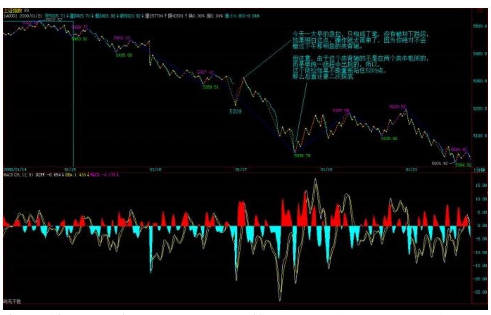
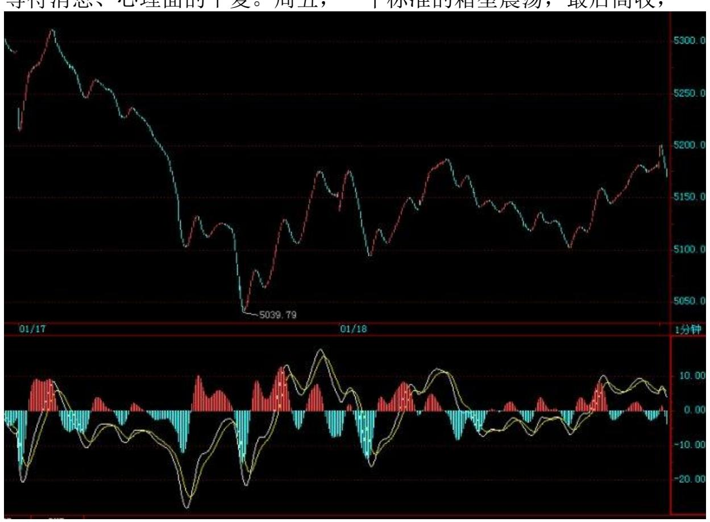
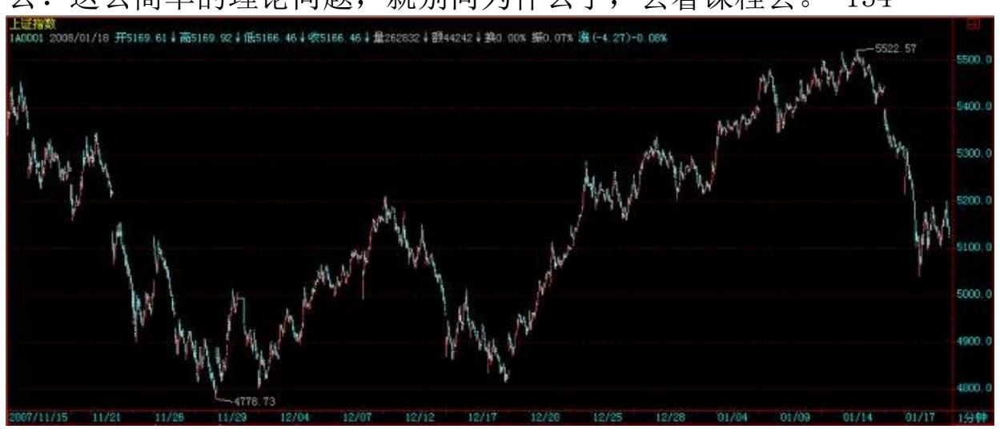
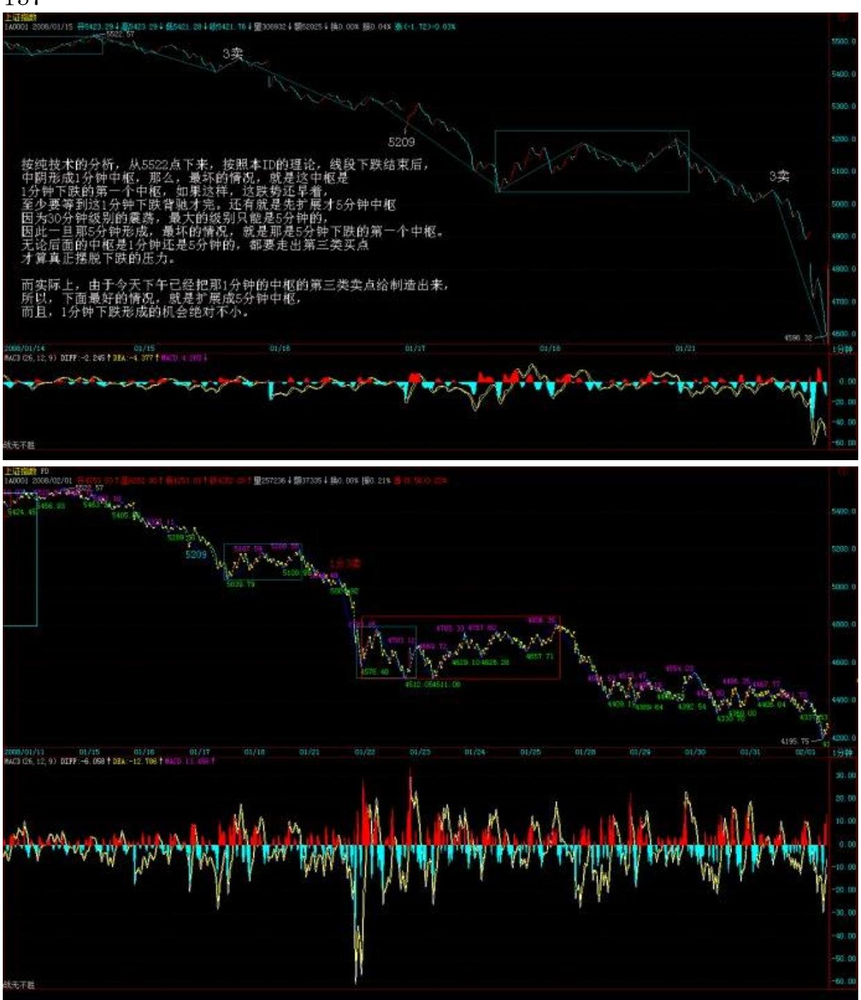
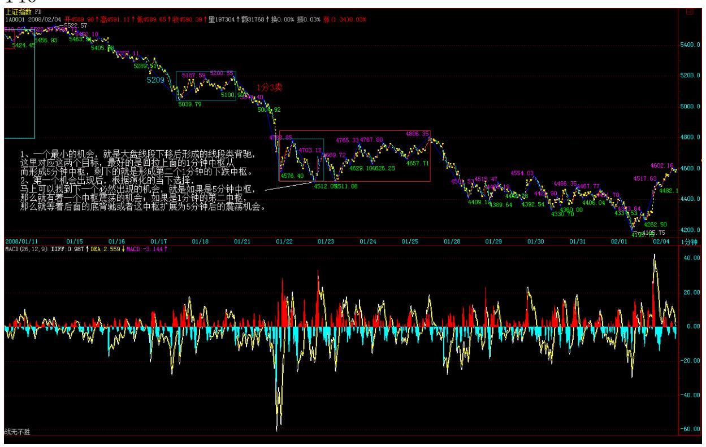

教你炒股票 93:走势结构的两重表里关系 2 [大盘又见亮晶晶昨](http://photo.blog.sina.com.cn/showpic.html#blogid=6223e8fb0100k59s&url=http://s6.sinaimg.cn/orignal/6223e8fbt89587956de65)天说 "并不排除有一到两天让大家再次想起亮晶晶的机会",结果,今天 那花旗参大作广告,使得大盘又见亮晶晶,严重怀疑亮晶晶暗中代理 了花旗参的销售。 中投公司,前段时间不是牛哄哄地趁底买这股权那 股权,现在花旗参来了,中投公司是不是又想把一千几百亿往里面填 数堵窟窿呢? 中国人该干什么,本 IDN 年前的人民币与货币战争里 就说清楚了。中国人根本没必要去美国人的地头玩,中国人要烂也只 能烂在自己的锅里,自己创造一个全世界的市场,别人爱来不来,我 们就自己玩了,憋死你们。十三亿中国人难道还要请 3 亿的美国鬼子 来才可能开桌打麻将?甚至还要漂洋过海去纽约开麻将桌?可笑! 当 然,如果你今天把本 ID 说的股票当成自选股,没看指数,那么,今 天好多无耻地放红,不少更无耻地创出新高,完全没美国鬼子什么 事。不过,这种情况,如果过分延续,是不好的,太脱离指数也不 好,所以下面还是探讨一下指数的问题。 显然,今天的走势对多头来 说,并没有什么大不了的,甚至是多头所乐于看到的。这原因,昨天 已经说了。技术上,今天的缺口有着极强的技术意义,如果三天之内 不回补,那么大盘后面的压力就进一步加大。下面关键是 5209 点的

有效跌破,大盘就依然在多头的控制之中。 短线上,5522点下来的这 个线段的类下跌过程十分技术化,两个类中枢也十分明显,下面就是 这类下跌的类背驰问题了,一旦出现,就是一次有力度的反弹,关键 是这反弹能否突破第二个类中枢的牵制,如果不行,那么缺口的回补 就有困难,所以这才是技术上的关键。 日线上,昨天的顶分型后,现 在延伸成笔的可能太大了,只要明天有新底就基本确定,所以,稳健 的角度,可以等底分型才会有真正的站稳可能,所以这个类背驰能否 最终制造出底分型,就是进一步考察的关键。

#### \*\*\*\*\*\*\*\*\*\*\*\*\*\*\*\*\*\*\*\*。

解盘及互动问答:\*\*\*\*\*\*\*\*\*\*\*\*\*\*\*\*\*\*\*\*缠师:个股方面,很多股票 会继续表现的,当然,如果你觉得心脏受不了,可以先把本拿出来, 例如 600737 之类的,剩下利润在里面继续。有些股票,会涨到你不

相信,等你相信了,就是井了。要出一次差,到深圳开一个和 PE 有 关的股东会议,后面几天,晚上的帖子,可能保证不了了,不过解盘 还是保证的。先下,再见。 不会享受大震荡的人股票就没入门 (2008-01-17 15:14:57) 当然并不是本 ID 去深圳,所以就深深地把 各位深圳了一把,千万别这样想,否则本 ID 肯定不能再去长沙了。 亮晶晶一、两天,今天不过就是第二天,多么优美的节奏,不懂得欣 赏,太浪费剧本费、排演、场租了。 当然,享受有不同级别,一种是 被动型的,一种是主动型。被动的就不说了,都是电梯广告的最好代 言。而主动型的,就要靠技术了。 别小看了最基础的分段技术,5522 点下来,近 500 点,就是一个线段的类下跌,你明白了,就主动了, 就享受了。为什么?最猛烈的中枢移动中,往往就是一个线段的类趋 势,所谓的单边跌势或涨势,就是这玩意,明白了,你说你能不爽 吗? 今天一大早的急拉,只构成了笔,没有破坏下跌段,如果明白这 点,操作就太简单了,因为你绝对不会错过下午那明显的类背驰。 但 注意,由于这个类背驰的不是在两个类中枢间的,而是单纯一线段中 出现的,所以,这个回拉如果不能重新站住5209 点,那么后面还要二 次探底。

本周开始时已经说了,春节前要出点情况,就是这周了,后面,就要 逐步营造点和谐的气氛,但在营造和谐之前,首先要营造的是恐怖,

没有恐怖,把不坚定分子彻底清洗,哪来和谐啊? 个股方面,昨天的 提示已经足够明确:"这种情况,如果过分延续,是不好的,太脱离 指数也不好"、"如果你觉得心脏受不了,可以先把本拿出来,例如 600737 之类的,剩下利润在里面继续",今天早上,这些股票都有红 盘,000822 之类的甚至还有新高让各位去反应,如果你没反应,那本 ID 也没办法了。总不能举着杠铃让最没反应的人去反应吧,如果这 样,这就不是市场,而是童话世界了。 至于 600319 今天还涨停,那 不过是一个态度问题,这里的老人大概都知道,就算是 530 最恶劣的 时候,本 ID说的股票里还总有一两只顽强地红盘的,注意,一定要声 明这可和本ID 无关,那大概是电脑出毛病了,抽筋了。 注意,现在 没必要追高买股票,注意调整中洗盘洗干净后准备重新启动的,还有 就是前期不动,有新资金介入的,但所有的前提是,大盘的恐怖期过 去了。 明天周末效应,震荡肯定还会有,但如果没有什么特别的东 西,幅度会逐步小下来的,其他,等过了周末,看看消息面、政策面 情况再选择。

技术高的,现在是游戏的黄金期,一个 30 分钟的震荡,操作好了, 收益比单边还要高,特别对资金不大的散户。没这水平的,就把仓位 控制在适当范围,也就是可以睡觉睡好的范围,等日的底分型出现再 说了。 今年投资者的四种命运 (2008-01-18 11:45:59) 下午一收盘 就开始股东会,没时间写解盘,晚上,这群家伙不会放过本 ID 的, 周末有时间再补上,抱歉了。 早上走势,和昨天说的一致,就是两天 的亮晶晶后,震荡还有,但幅度变小,但由于 5209 点没重新站住, 大盘总体还在一个剧烈震荡后的平复期,依然有较大不稳定因数与情 绪需要时间平复,另外,周末的政策消息面以及外围因素,依然有巨 大的心理影响。 下面,把写好的一帖子贴上来,算是今天的帖子了。

在去年底的今年展望中,已经明确指出今年走势的多变性与操作难 度。 今年"与井同行",一般来说,没有足够的自我意识,企图靠拐 杖的人,今年都会比较麻烦。投资,是一种专门的学问,前提是,你 首先是一个有思想的人,而不是一个木偶。 就像在那篇关于剧本的帖 子里本 ID 说的,就算把剧本告诉你,很多人最终还是要落井。为什 么?因为,首先很多人大概都是跟着孔男人学的中文,中文理解力几 乎为 0,剧本可能也读不懂。例如,当时写的这一段:" 剧本里对 5860 到 5912 这个缺口很不满意,已经准备了不少胶水,不过还有点 缺货,什么时候把剩余的胶水准备齐了,关键看在 5462 到 5675 点 时间段内政策面的风向,风向不对,那就先把买胶水的钱换成买棒棒 糖的,一人一个棒棒糖,看你要棒还是糖。" 如果你竟然能理解成大

盘一定要先到5675 点,那么,就去找孔男人追讨中文的学习费用吧。 请问,5522点是否 5462 点到 5675 点之间?请问,这时候发棒棒糖 难道有一丝一毫违反剧本吗?关键是,你在这过程中,是吃棒了还是 吃糖了?技术好的,在这个震荡中,早爽呆了;技术不好,心态又不 好的,不吃棒那是没天理了。 "一人一个棒棒糖,看你要棒还是 糖。"这句话,好好体会吧,全年都有意义。 其次有些人,理解到 了,看到 5522 点后的日顶分型,但就是对自己的判断没信心,一定 要一个拐杖。好了,就算本 ID 提示有 1、2 天亮晶晶的拐杖,但真 来了,估计你也没心情拐杖了。 本 ID 在日顶分出现的当晚给了"教 [你炒股票 93:走势结构的两重表里关系 2 2008-01-15 18:08:05",](http://blog.sina.com.cn/s/blog_486e105c0100869y.html) 很多人看了,觉得是重复,和以前的没什么不同,你现在在去看看这 针对性,你选择好了自己的位置没有?你属于什么类型,对应的处 理,你处理好没有? 操作,不是一个纯学院的讨论,操作都在细节之 中。何谓细节?你自己的水平,就是第一大的细节。然后选择符合自 己水平的操作,这就是第二大的细节。最后,按规程操作细节去操 作,这就是操作的全部。 在市场中,不首先认识好自己,一切都瞎 掰。 本 ID 之所以写这帖子,是因为现在 2008 年才过了 10 几天, 如果现在不彻底清醒过来,那么,今年将是很多人的灾难之年。最好 的选择,就是现在马上退出吧。 今年,所有人将面临四种命运: 1、 技术好、心态好的,将比去年还赚钱,别小看震荡的功夫,回头看 看,从 6124 点下来到今天,也就是走了一个 30 分钟的盘整,只不 过这中枢有点低,在 5209 点上下。

谁只要把线段、1、5、30 级别搞清楚,对于散户来说,足够了。按本 ID 的理论,2005 年中开始的行情,到目前为止,最多就算是日线级 别的,一个日线级别就走了 2 年多,你就知道本 ID 这体系的宽广 度。 2、技术好,心态不好的。这种人几乎没有,因为真的技术好 了,一切都看明白了,自然心态好。如果真有这种人,那今年的成绩 也就赚点小钱了。 3、技术不好,心态好的。今年就做电梯广告,最 后,那电梯广告做多,老化了,有出大事故的风险,例如,突然从 20 楼掉到负 18 楼。 4、技术不好,心态更不好的。今年将是这种人的 灾难年,是最好的绞杀对象了。 今年,给所有技术不好的人一个忠 告,就是一旦有足够的利润而有出现不好信号时,一定要先把本给拿 出来。 另外,给那些还希望有更大追求的一个提示,你看看本 ID 说 的股票,当成一个投资组合,你就会发现这个组合十分地有意思,就 是此起彼伏,几乎没有一天闲着的。为什么?对于大资金来说,这样 是效率最好的。资金才可以最大效率地流动,才可以又清洗又发力, 动态地膨胀。 其实,去年初本 ID 就明确告诉过,本 ID 的股票组合

就是这样的,如果你是散户,能左跳右跳地根据组合中的买卖点来轮 动,那你的收益就十分惊人了,绝对比追什么黑马股票要牛多了,而 且极为安全。当然,能做到这一点,并不容易,但这好像是一个考 验,一个提高,现在做不到,也要有这方面的意识才行,否则,资金 的高效率,就很难办到了。 注意,你的组合选择不一定按本 ID 的 来,本 ID 的可以当成一个教学的版本。 不过,一定要注意,没这水 平与意识的,就算了。我们总要实际点,不是每个人都能成为高手 的,更多人一生的努力,也就是这样了,这是实际的话。 有些话,只 是说给相应的人。世界上的山峰,并不是所有人都能或需要会当临绝 顶的,先把自己认识清楚,把自己的能量激发出来,如果这样,你就 是能会当临绝顶的人了。在那绝顶之上,万古长空。 多头能否构建缓 升通道? (2008-01-19 10:31:53) 对不起,昨天忙于开会,没时间解 盘,现在补上。

周五大盘这种走势,已经在周四解盘中说过了,就是震荡幅度减少, 等待消息、心理面的平复。周五,一个标准的箱型震荡,最后高收,

由于 5209 点的跌破,没有到三天的基本限期,所以只要下周初能站 上去,就可以了。 好了,现在,用最明确的语言告诉各位后面大盘的

走势。但本 ID 依然要告诉你,肯定还有很多人,特别是跟着孔男人 学中文的,最后还是要到井里去。本ID 的语言,从来都是如数学般精 确,关键你能看明白。 现在,就是一个30 分钟的大震荡,按照本 ID 的理论,30 分钟的震荡,最坏的情况,破 4778 点也是可以的,为什 么?这么简单的理论问题,就别问为什么了,去看课程去。 134

当然,对于多头来说,当然不希望出现 30 分钟震荡中那种最坏的情 况,那么,对于多头来说,化解这 30 分钟震荡的唯一方法,就是制 造一条缓升通道。 现在,你打开日线图,这缓升通道的 4 个原始支 点中的 3 个早出现了,这次的亮晶晶,如果多头能控制住,那么就是 完成第 4 个原始支点的制造。有了 4个点,上面两个,下面两个,这 通道就形成了,后面就可以按这通道继续游戏了。 这通道的特点,就 是速率比较缓,但幅度比较大,这样,就可以制造出相应的行情,又 有足够的回旋余地。是目前多头在如此政策消息技术面下唯一最佳的 选择。 通道式上涨,是最不消耗能量的,只要操控得当,就可以把成 本震荡得最低而又保持好基本的形态,一旦有一个飞腾的机会,就可 以破通道而出,最后挖出了迷绝众生的大井,让所有被通道折腾的都 变青蛙去。 本 ID 已经把坏招都说了,但本 ID 一定要声明,本 ID 不是多头也不是空头,本 ID 只按自己的理论办事,因为,一旦多头 失败,陪葬的只能是他们自己,本 ID 最多会给他们加一把土的,不 过,为了今年的面包,在年初的时候,本 ID 在精神上当然是支持多 头的,对多头下手温柔点,目的是为了后面把他们养肥了好下重手。 无疑,对多头的缓升通道,本 ID 是乐见其成的,也会一旁摇旗呐喊 一番。 但,本 ID对 30 分钟震荡的所有情况,都会有相应的对策, 一旦多头不能显示出足够的信心,本 ID 会把他们变成青蛙煮粥喝 的。面包不够,只能喝青蛙粥了,好可怜啊。 如果上面的文字都看不 明白,就快去追讨孔男人去吧,孔男人,你教的什么中文? 但更重要

的,比追讨孔男人更重要的,就是一定要知道,学习本 ID 的理论 后,就永远不会有什么无聊的多头空头滑头的想法,市场只是市场, 走势只是走势,如此而已,你需要的,只是倾听。然后,你的心里马 上升腾出所有可能走势以及相应的对策,然后,就看着市场的出牌去 出牌,如此而已。市场,不过就是一桌麻将,周末,搓去吧。 又被暗 算的多头尚能饭否?(2008-01-21 15:18:54) 刚被花旗参暗算完,周 末又被平安保险暗算了一把,多头至少在指数上已经没有任何的回旋 余地。技术上,前面已经说了,5209 点不能重新站住,就要二次探 底,直到出现日的底分型为止。而一个 30 分钟震荡,4778 点在最坏 的情况下完全可以被击破。被暗算的多头今天开盘无力站上 5209 点,就使得后面的走势变得只能以坏的选择去选择了。 站在本 ID 的 角度,并不大关心这类问题。本 ID 最关心的问题,最近都有了答 案。应该记得,去年末时,本 ID 痛斥了某些人为了某些原因,企图 年末抢闸上报所谓的股指期货,现在,事实已经出来了,那企图已经 破产,而那些尾随而上资金,不仅失去了一波大的个股行情机会,而 且终于忍受不住,落荒而去。 这就是本 ID 最愿意见到的结果,股 票,可不单单是那几条曲线。对于散户,当然可以只关心曲线,但后 面的刀光剑影,你又能知道多少? 大资金,只有杀大资金才能爽的, 那些整天盯着散户的资金,算个屁。 本 ID的观点从来都很明确,要 烂就都烂在 A 股,本 ID 一直的愿望就只有一个,把 A 股变成全世 界最大、中国人自己的麻将桌,让鬼子只有屁颠屁颠的份,任何违背 这个目标,本 ID 都要竭尽全力去阻击,例如上次那无聊的直通车。 回到今天的市场,那平安不平安,石油变瀑布,大家伙当然是有用 的,等某些人彻底认输了,大家伙就有用了,如果不认输?那就想想 本 ID 曾说过的关于中石油的一个酒桌上的故事,把话挑白了,如果 不投降,那故事里的数字是可以修改的。 不说故事,说技术。按纯技 术的分析,从 5522 点下来,按照本 ID 的理论,线段下跌结束后, 中阴形成 1 分钟中枢,那么,最坏的情况,就是这中枢是 1分钟下跌 的第一个中枢,如果这样,这跌势还早着,至少要等到这 1 分钟下跌 背驰才完。还有就是先扩展才 5 分钟中枢,因为 30 分钟级别的震 荡,最大的级别只能是 5 分钟的,因此一旦那5 分钟形成,最坏的情 况,就是那是 5 分钟下跌的第一个中枢。无论后面的中枢是 1 分钟 还是 5 分钟的,都要走出第三类买点才算真正摆脱下跌的压力。 而 实际上,由于今天下午已经把那 1 分钟的中枢的第三类卖点(在什么 位置和时间,一个简单的题目,如果当时不能正确马上给出的,都要 补课)给制造出来,所以,下面最好的情况,就是扩展成 5 分钟中 枢,而且,1 分钟下跌形成的机会绝对不小。

从理论上有了这么明确的分类,后面的操作就很简单了。如果你不想 烦,就看日的底分型的形成时再说。如果你特爱好换股短线,那么, 就根据这个中枢的演化去安排具体的操作,事情就是这么简单,唯一 有点复杂的是,你操作的是具体股票,指数是指数,股票是股票,从 来就不经常是一回事情。所以,多关心你自己的股票,你的股票池的

具体走势。例如,就算今天的走势,依然有股票继续新高。 注意,严 重注意,任何股票都不值得追高,本 ID 也不需要任何散户来抬轿 子,没有永远上涨的股票,股票涨多了就要歇歇,有本事的,歇歇也 能震荡出利润,没本事的,涨多了,就把本拿出来。 任何持有的股 票,都以能吃能睡为最基本的持仓标准。如果你持有一只股票,已经 影响到的睡眠与吃饭,请马上退出。 股票,说白了只有四个字:级 别、节奏。参透了这一点,就大块吃肉,大碗喝酒,日日好时光,天 天 419。否则,就被股票节奏去吧。 中线上,又被暗算的多头尚能饭 否?本 ID 在去年末的今年分析中已经明确说过,今年完全有可能创 不出 6124 点的新高,但,今年不是指数的行情,而是板块行情,这 点,在那帖子里已经明确说过了,就算指数不创新高,依然有无数机 会在等着,关键是你有没有这样的技术和心态。 少坐电梯,多练技 术。最简单的一招,见日顶分型走,日底分型再回来,这一招练熟 了,今年就能少坐很多电梯。 再次将本 ID 今年希望的三件事情说一 下:想见创业板,不想见股指期货,印花税要降低。不管如何,希望 都能实现。 先下,再见。

#### 140

