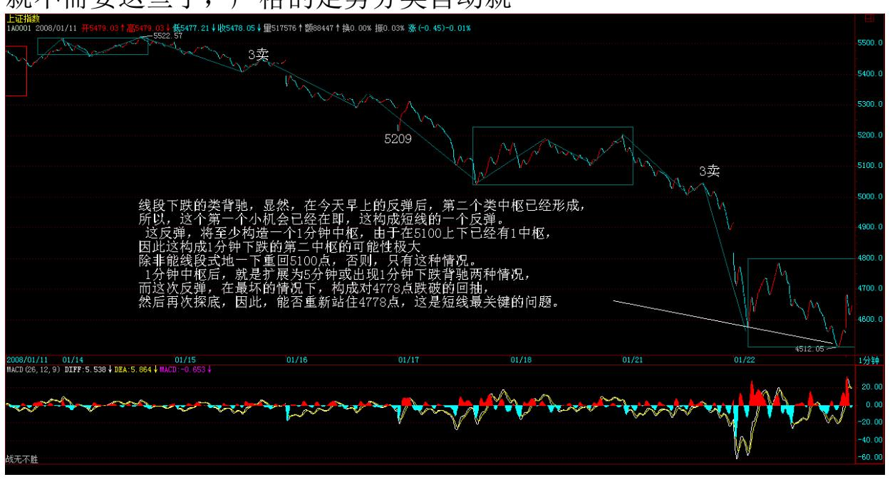
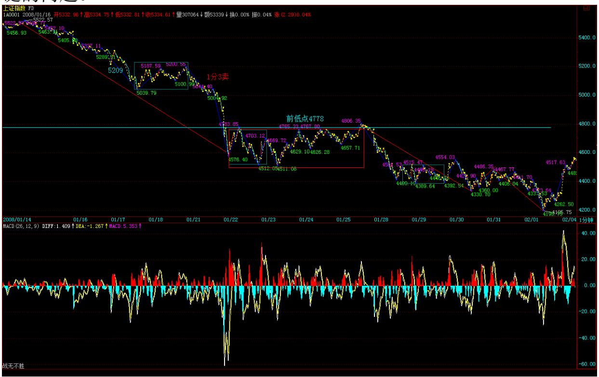

# 教你炒股票 94:当机立断

类似地,对任何走势,我们都可以根据理论,马上严格地给出必然出 现的机会。市场就是这么贱,虽然折腾无数的人,但就是从来没有任 何失误地按照本ID 的理论去走,所以,本 ID 可以把市场叫为面首。 任何一个当下,你都可以根据本ID 的理论马上给出后面必然要出现的 机会。上面说的是买点,卖点的情况是一样的。 好了,你根据理论, 可以罗列出一大堆必然出现的机会。后面面临的,只是选择问题。例 如,第 1 个机会,你会觉得级别太小,不想搞。那么不想搞就不想搞 了,就像一个面首,你见了不想搞,难道还需要什么理由? 你真正明 白了本 ID 的理论,操作其实就是这么简单,唯一需要问自己的,就 是你现在有没有搞的兴趣,这个机会,这个面首,在这一刻,你想搞 吗? 如果你想搞,那么,你就需要一系列的准备,通道的、资金的、 一切的安排都要安排好,然后关键要把退出的边界条件也设置好。 例 如,对于第 1 个机会,设置的退出条件,就可以是原来的最后一个类 中枢,或者是线段向上走势类型中的类背驰或类盘整背驰。(娇注:线 段间盘背或线段内背) 当然,根据这样的设置条件,在 T+1 条件 下,你完全有可能走不出来,为什么?因为这买卖点可能就在当天完 成了,买了卖不掉。所以,在设置时,可能还要参考机会出现的时 间,如果在早上,可能要考虑一下。如果在下午,那就胆子可以大 点。 当然,这还和你自己实际的情况有关,例如一个中线走势极为良

好的股票,如果一个线段下跌就去掉了 20%,而你又在高位跑掉了, 那这个回补机会当然就可以胆子大点。 更容易的,就是把级别放大 点,如果你按周线操作,那么从2005 年下半年买了到现在,你根本连 一次都不需要操作,谁告诉你本ID 的理论只做短线的?是孔男人告诉 你的吧? 对于每种机会类型,都需要把各种可能的出现情况都考虑清 楚,这样可以判断其力度,从而绝对(决定)进出的资金量。这就如同 419,你今天想 419 了,但总要看到真正的货后,才能决定这投入的 量。谁告诉你 419 就一定要奋不顾身的?419 难道就不可以见了就 撤?从见了就撤到奋不顾身,这里可以有无数的情况出现,当机立 断,这就是唯一的。

学了本 ID 的理论,脑子里必须时刻有两个字:级别。如果连级别都 搞不清楚,你还 419?被 419 还差不多。有了级别,就是节奏问题 了,419,就是见好要收,而不是天长地久,这都不明白,就等着灾难 连连吧。 不会卖出,就等于失去了下次买入的机会。这个节奏之所以 难,说白了,就是贪嗔痴疑慢作怪。 对于初学者,一定要机械地给点 束缚,等于那死猴子带上个圈圈。这个束缚,就是 5 周、5 日这些 线,一旦分型后有效破了,一定走,这就是束缚。当然,对熟练的, 就不需要这些了,严格的走势分类自动就

给出一切。 练习的第一步,很简单,就是在任何时刻点位,都能马上 把后面根据理论把机会第一时间反应出来。注意,任何的机会,必然 在本 ID 理论的输出中。市场的机会与本 ID 理论的输出,是严格一

一对应的。这就是本 ID 理论所以厉害的其中一面。第二步,根据自 己当下的心情、资金等等,选择介入的机会,放弃不想介入的机会。

然后就等待机的显现,当机立断,就这么简单。但,这最后一步,足 够你修炼 N 年了。 超短线反弹在即 (2008-01-22 15:12:04) 看今天 的帖子之前,如果没有看过下面的帖子的,请先看看"2008 年行情展 望 2007-12-20 15:59:05" 大盘的走势,和昨天晚上课程说的是一致 的,就是等待第一个机会,线段下跌的类背驰,显然,在今天早上的 反弹后,第二个类中枢已经形成,所以,这个第一个小机会已经在 即,这构成短线的一个反弹。 这反弹,将至少构造一个 1 分钟中 枢,由于在 5100 上下已经有 1 中枢,因此这构成 1 分钟下跌的第 二中枢的可能性极大,除非能线段式地一下重回 5100点,否则,只有 这种情况。 1 分钟中枢后,就是扩展为 5 分钟或出现 1 分钟下跌背 驰两种情况,而这次反弹,在最坏的情况下,构成对 4778 点跌破的 回抽,然后再次探底,因此,能否重新站住 4778 点,这是短线最关 键的问题。

上面这机会的把握,就看你的技术了,没这技术,继续等到日的底分 型确认才介入,这样,风险比较小。 注意,这次的回跌,有着很多股 票之内之外的因素,站在长远的角度,这样一次走势,是必须的。就 算最简单的情况,印花税如果还是现在的,谁都没法混。此外,那些

所谓的大家伙,随便就狮子大开口,这样的情况不警戒一下,以后谁 都没法混。 市场的游戏规则的维持,有时候是很残酷的,这点没什么 可说的。 注意了,今年是井的年份,井可以是上面的,也可以是下面 的,今年,只有心态加技术才能够成功。 心态好的,坐一次电梯,那 这次电梯后,最好也顺便把技术提高一下;至于心态不好的,那就上 面落井,下面再落井,本 ID 的青蛙粥原料充足了。 当青蛙还是猎 手,自己瞧着办吧。 先下,再见。
