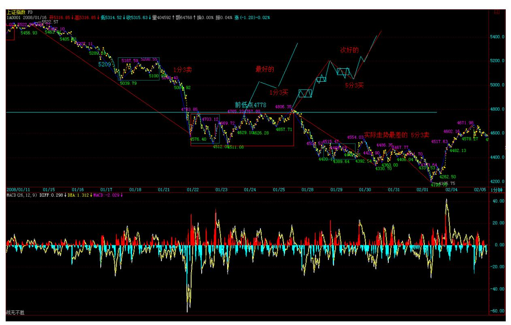

# 教你炒股票 95:修炼自己

本 ID 觉得,当人被刺激后,大概学习的效率会高点,所以就连续写 课程了,让有缘人得之。 要战胜市场,首先要了解市场的众生。市场 是合力的,而合这力的不是机械,而是活生生的人。 市场中,最多数 的,都是糊涂蛋,赚钱了不知道为什么,亏钱了不知道为什么,最后 变青蛙了,也会说,井上面的天空好大,好复杂,怎么处理啊?哪里 有拐杖啊? 几乎绝大多数的人,进市场来时,根本不知道市场是什 么,然后就不断投入,最后有些输红眼了,砸锅卖铁也就进来了。 对 于市场,本 ID有一个观点,大概有点过分,但确实是对的。市场,就 是要 0 投入去赚钱。 很多人很关心 ID 的投资历史,当然,有很多 事情,不能说,因为涉及太多的东西。但有一样事情,本 ID 是可以 说的,就是本 ID在市场中,等于没有投入过 1 分钱。 本 ID 第一笔 钱是 90 年初新股赚回来的,那时候买新股的钱,很不好意思,不是 本 ID 的,上市后,就把本还了,剩下的利润,就是本 ID 在市场中 的第一笔钱,从此,无论本 ID 操作的钱有多少,本 ID 从来没有在 市场中投入过 1分钱。 当然,现在还按 90 年代初那种疯狂状态是不 行了,但本 ID还是觉得,你投入市场的钱,一定不能无限增加。如果 你第一笔投入100 万,还不能赚到钱,你还投什么啊?你 100 万都搞 不好,难道想搞 100 万的平方啊? 只要你有稳定的技术和操作,初 始投入多少根本不重要。就算你只有 1 万元,10 次翻倍操作后也就 1000 万了,而即使你开始有 1000 万元,10 次连续的亏损后,你也 没有多少钱了。 问题不是投入的多少,而是技术与操作。所有把市场 当赌场的,最终的命运都只能是悲惨的。 对于市场上的众生,本 ID 给的第一忠告就是,把你的第一笔钱运作好,然后把本拿走,最后把 这利润变成巨大的数字,这才是市场中的真正操作。 市场上的真正成 功,是以十年为单位的,无论你开始有多少钱,10 年都足以让你变成 上一个足够大的台阶,一笔 0 成本、0 投入的钱,让你在市场中无比 轻松。 绝大多数的人,因为贪婪而不断投入,又因为恐惧而落荒而 逃。但市场,进来一次,几乎就很难再离开了。

落荒而逃的,最终都是在高潮中又被忽悠进来,最终还是青蛙给煮 了,这种事情,难道还少见? 还有不少的,以评价别人为事情,市场 中,唯一的评价,就是你的操作,有那时间,练习一下操作吧,这才 是市场中人干的事情。 市场,不是选秀场,别把自己当超男超女或它 们的粉丝。市场里,是刀和血,超男超女和粉丝,只有被煮的份。 市 场中,唯一需要考虑的,就是对操作水平的提高,这是一切的根本。

别人,最多是你的陪练。 学习理论,一定要彻底穷源,然后在实践中 不断升级,工夫是要靠磨练出来的。用你的第一笔钱,一笔绝对不影 响你生活的钱,创造一个操作的故事,这就是市场的操作者。 操作的 层次很多,这是一个不断修炼的过程,把基础弄好了,你可以不断前 行。市场的机会无穷,做一次电梯不怕,关键是电梯之后,你能不再 电梯。 修炼自己,市场中生存,别无他法。 如期反弹后的 4778 点 压力 (2008-01-23 15:16:53) 今天没什么可说的,该说的昨天就说 了,关于这个反弹点,前两天的课程里已经预先说过,这就是本 ID理 论输出与实际走势的绝对一一对应性所决定的。

但是,就算是这样,每个人的操作成果肯定相差极大,为什么?这才 是问题的关键。根据理论,相应的机会预先就知道,只要等到市场实 际走出来。但,一到实际操作,水平就差了去了,为什么?这对于每 个人都是最好的问题。 本 ID 最鄙视一种人,就是从来不看走势,请 你自己反省一下,大盘 4 小时,你都干了些什么?每天的走势,无数 的资金在那里画出来的,世界上最昂贵的图画,你不去好好欣赏,从 中修炼,想想自己都干了些什么?你有这资格吗? 特别对于初学者, 走势中的每一秒种,你都要尽可能学会解读市场的语言,你不从此全 身心地和走势合为一体,就想战胜市场?做梦去吧。 本 ID 的理论, 就是市场语言的语法,但光会语法,你能真正学会语言吗?你不每天 去练习,有这可能吗? 所有坐电梯的,一跌就又哭又闹的,想想自己 都在干些什么,就算把机会列出来了,想想你能操作成什么样子。 市 场哪里有便宜而来、不费力气的成功?醒醒吧。 说白了,战胜市场, 就是战胜市场的合力,就是战胜那构成合力的绝大多数人,你不成为 这所有市场参与者中最顶尖的那一部分,那么,谈论成功都是废话。 这是一场人与人智力、体力、资金等等综合的搏杀,是血与血的争 斗,你以为是超女比赛八卦一下、走走旁门左道就可以? 偷心不死, 永无出期。 你如果要学习,请好好看看诸如 600737、600635、 000938、000802、600779、600195、000822、600636 等等这几天震荡 中的每一分钟的图形,看看在震荡中是如何抽出比上涨还要多的血。 注意,本 ID 这里说的是学习,不是说股票本身。只是股票本身的图

形是用钱画出来的,你不尊重图形,图形自然惩罚你。 回到大盘本 身,第二个 1 分钟中枢如期到来,但只要这 1 分钟不能出现第三类 买点,不能有效重新站上 4778 点,后面的震荡依然少不了,但这将 提供更多的短线获利机会。 大盘的走势:最好的,就是直接形成这 1 分钟中枢第三类买点,然后形成线段或 1 分钟式的上涨,重新回到 5100 点上,这走势的前提就是那第三类买点。

次好的,就是在这里形成 5 分钟中枢后再出现第三类买点,这里有两 种途径,一种是 9 次级别的震荡扩展出 5 分钟,一种是先 1 分钟的 第三类卖点后底背驰上来再出来 5 分钟。这里就构成了 N 次必然的 短线机会。 最坏的,就是在这里 5 分钟后出现其第三类卖点,这甚 至构成一个 5 分钟下跌的第一个中枢,这样,后面的走势就比前面还 要恶劣。

由于现在的走势有如下复杂的演化可能,所以操作上必须严格根据图 形来,一旦出现 5 分钟不能重站住4778 点的情况,(注:前底点 4778,30 分中枢 DD)就一定要注意后面可能向最坏情况演化的任何苗 头。 正如本 ID 在 5209 点说的,站不住 5209 点就把多头当青蛙煮 了(注:5209 双底颈线)。这里一样,在这后面的震荡反弹中,我们 用技术赚足钱,然后,一旦多头不行,我们就再次把多头当青蛙煮了 当汤喝。 当然,如果多头行,我们不介意陪着多头再到 5000 点上走

一趟,但,我们只看图形,多头有本事画出那样的图形,我们就跟着 走,否则,就煮开水等青蛙跳下来。 思维方式,要彻底改变。让所有 一根筋的青蛙去,这就是市场。

先下,再见。
