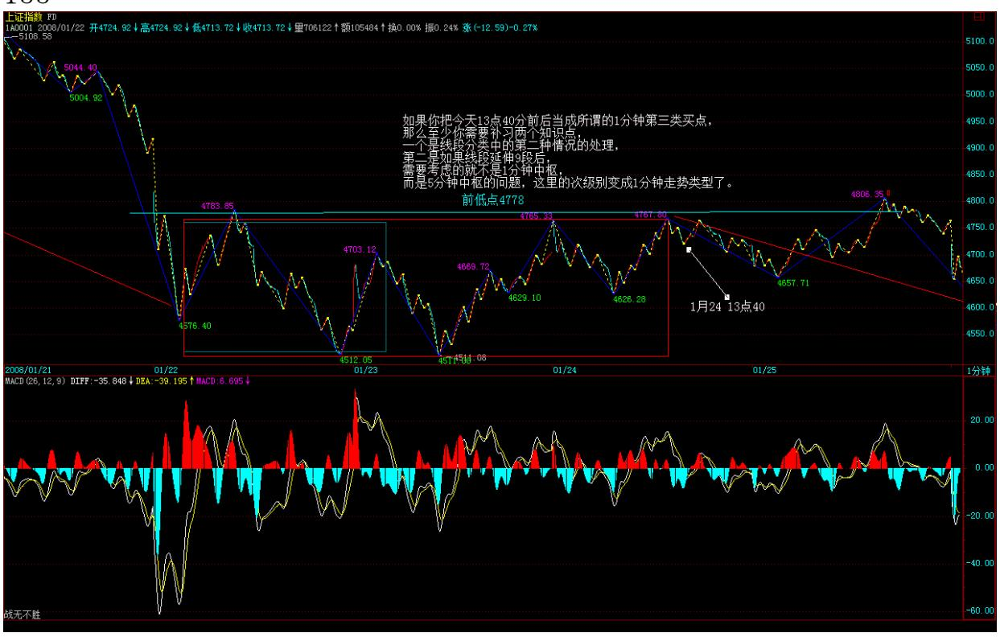
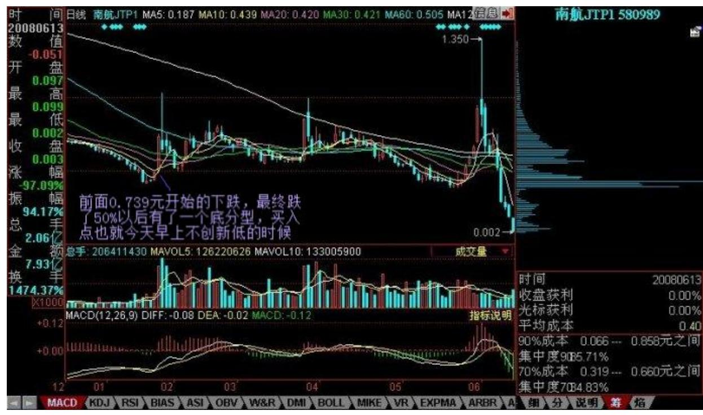
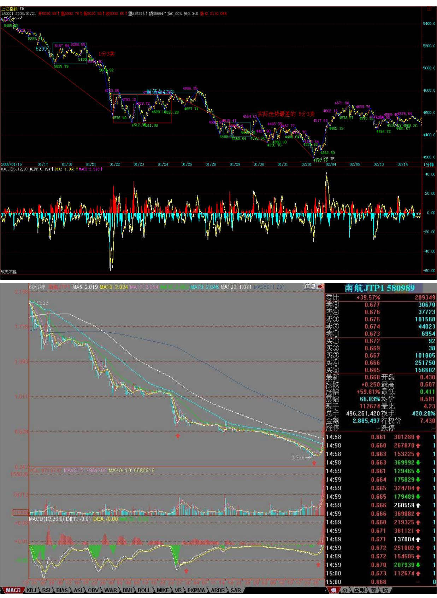
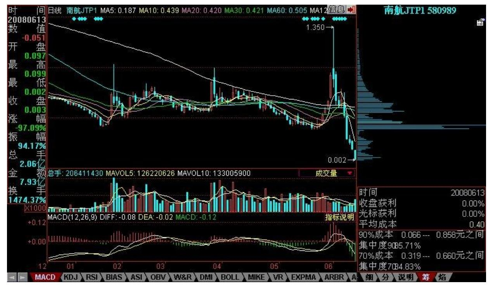
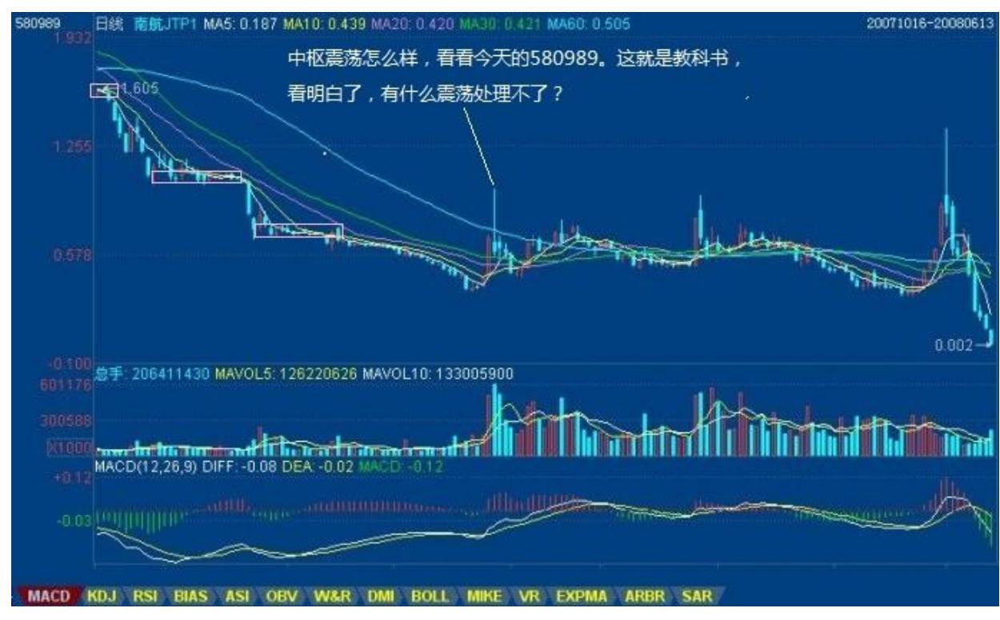

# 教你炒股票 96:无处不在的赌徒心理

(2008-01-23 16:18:38) 市场中,最大的敌人之一,就赌徒心理、赌 徒思维。赌,最终的结局就只有一个,如果你以赌徒心理参与市场, 那么你的结局就已经注定,你就算还没再锅里,那也只是养肥了再煮 而已,没什么区别。 赌徒心理无处不在,除了上一课说的不断加码, 还有一些,甚至自己都没注意到。 例如,有人亏钱了,然后就想,等 反弹到多少多少一定出来,以后不玩了。这看起来很不赌徒,但其实 也是赌徒心理。 赌徒心理一个最大的特点,就是预设一个虚拟的目 标,一个想象中的目标,完全无视市场本身。 还有一个特点,就是怕 失去机会,怕失去了赚大钱的机会。例如,万一走错了,怎么办?万 一还涨,不就亏了?诸如此类。

注意,市场中生存,从来就不是靠一次暴富得到的,一次暴富最后倾 家荡产的,本 ID 见多了。 市场真正的成功,都是严格的操作下完成 的。操作失误了有什么大不了的,市场的机会不断涌现,一个严格的 操作程序,足以保证你长期的成功。 赌徒心理,一个很经常的行为, 就是砍了又追,追了又砍,完全被一股无明的业力牵引,就往那鬼窟 里去了。这所谓的杀红了眼,所以就被杀了。 赌徒心理,一个更经常 的行为,就是不敢操作,看到机会到来,就是怕,等机会真正起来 了,又后悔,然后就追上去,5 元不敢买的,过段时间 50 元都敢 买,结果又被杀了。 赌徒心理,还有一种就太常见了,就是听消息, 找捷径,以为这世界上就有一个馅饼一定能拍着自己,可能吗?就算 能吃到点馅饼,那玩意能当长期饭票吗? 赌徒心理,还有一种大概是 最常见的,就是我要赚钱买房子、车子。我投入,要把装修的钱赚回 来。可悲呀,你以为市场是慈善场所?那是杀人的地方!生活,很简 单,一天三顿,五谷为养、五果为助、五畜为益、五菜为充,而不是 那些古灵精怪的玩意;市场很简单,就如同生活,在一定的韵律中生 长出利润。只有那韵律,那平凡但又能长久的赢利模式,才能使得你 战胜市场。 你不需要如赌徒一样整天烦躁不安,又期盼又恐惧,折腾 不休。你只要平静地按照自己的韵律、按照市场的显现去与日俱增地

强大自己。错过了,就错过了,后面有无数的机会等着。 你,不需要 把自己设计为超人。

超人是不需要设计的,超人是干出来的。你能长期地战胜市场,你就 是市场的超人。因为市场的原则就是,只有最少数的人才能长期地战 胜市场,你不是超人,谁还是? 你,当然会不时面对不同的危机,危 机不能躲,用最快最明确最直面的手段解决,只要还有翅膀,天空就 是你的。 前面说,你要用 0 成本投入。当然,实际上也没必要这样 严格。你可以把你完全不影响生活的钱拿出来,告诉自己,这就是你 唯一的资本,你没有后援,然后就用这创造你自己的神话。当然,如 果你输光了,你可以再给自己一次机会,但在给自己这次机会之前, 你必须把自己彻底解剖一次,把你所有失败的根源都挖出来,然后你 告诉自己,这是你最后的尝试。 如果你又输光了,那么,你就退出 吧,不是每一个人都适合市场的,不是每一个人都要去当市场的高峰 的,我们有时候必须面对的最客观的事实就是:我不行。 然后给自己 N 年的机会,去学习、去历练,在 N 年以后,你觉得你有足够的信心 重新回到市场了,你再给自己一次机会,如果这还不行,那这一生, 你就和市场永远再见。买基金,买国债,什么都可以,但还是别亲自 到市场来了。市场,只是生活的一部分,如此而已。

4778 点,多空抉择线 (2008-01-24 15:17:30) 今天,在昨天所说的 4778 点受到压制产生震荡。4778 点,在技术上十分重要,因为这是 前期低点,能否出现上去站住,决定了这次下跌的性质与最终完成形 式。说句直接的,就是一条多空抉择线。 从日线上,今天早上的下跌 反而是为了最终构成日的底分型,这是一个买点。但后面的问题更为 关键,就是这底分型能否延伸为笔,还是最终被 5 日线压制夭折。由 于 5 日线已经下移到4815 点,明天大概也就到 4778 点附近了,因 此,这个问题和上面一个问题是同解的,还是 4778 点能否突破站住 的问题。

技术上,如果你把今天 13 点 40 分前后当成所谓的 1 分钟第三类买 点,那么至少你需要补习两个知识点,一个是线段分类中的第二种情 况的处理问题,第二是如果线段延伸 9 段后,需要考虑的就不是 1分 钟中枢,而是 5 分钟中枢的问题,这里的次级别变成 1 分钟走势类 型了。 本 ID 的理论是纯数学,一就是一,二就二,没有半点可以含 糊的地方。不妨再问一个问题,今天究竟走了几个线段?请选择:A、 2;B、3;C、4;D、5;E、都不是。 没分清楚的,请去补课。

个股方面,本 ID 那些股票表现怎么样,都有眼睛,就不用说了。已 经有 N 只创出了新高,而大盘比 5522 点跌了快 1000 点。当然,这 种走势,最终不能完全脱离大盘,如果大盘站不住 4778 点而展开新 一轮下跌,追高的风险是极大的。 本 ID 再次强调,本 ID 不需要任 何人抬轿子,如果本 ID需要你抬轿子,就不会让各位在 8 元去买 600737 了,再次强调,600737 这类股票,如果你害怕了,就把本拿 出来,留下 0 成本的继续游戏,没买的就算了。 这世界上 N 的 N 次方的股票,不需要买本ID 的,而且本 ID 也不喜欢太多人买,因为 本 ID 杀人的时候,可不管亲疏的,对于本 ID 来说,股票就是筹 码,就是纸,本 ID 杀的是纸,后面是谁,本 ID 可没兴趣知道。 来 这里,就要学会自己顶天立地,有一天,你能在市场游戏里把本 ID 杀了,本 ID 最高兴了。可惜,现在,还没有这个人,好无聊啊。 先 下,再见。 下周补缺,多头别无选择 (2008-01-25 15:17:34) 4778 点,其实就是一张纸,但现在人的心理,比纸都脆弱,看来风险教育 还是太少,股灾见得还不够多。看看人家恒生指数,上窜下跳地,A 股的投资者还是少历练。

相比,深圳成分指数更有领先性,这点在前面已经反复说过。今天这 指数已经把本周下跌的缺口给补了,而上海显然需要补课,这课就是

下周的任务了。如果周末没什么不招人待见的消息,这任务应该不算 是什么大不了的事,下周补缺,多头别无选择,连这都完成不了,多 头也就只有当青蛙的命了。 注意,由于目前日线的形态不好,所以, 就算这笔延伸出来,后面肯定还有向下的笔来确认的,这个向上笔结 束的位置很重要: 一、如果在 4818 点上下(注:4778,前低点, 4818 为 1 月 22 缺口下沿)就结束,(实际走势 4805 结束)那么 就是最弱的,后面就不亮晶晶了,改 10X10米晶晶亮了。 二、如果 4918 上下结束(注:1 月 22 缺口上沿),这还有较大可能回头形成 诸如双底、头肩底之类的形态。 三、冲上 5000 点后再结束,(注; 5000 点为第一个 1 分中枢 DD)那么形态上稍微好转了,后面只要回 头幅度不大,多头又可以重新架设炮台,再次进攻了。

因此,这个向上笔的结束位置很重要,市场最终的走势,走出来自然 就当下辨别了,无须预测。 这两天的走势,对底分型的具体操作是一 个很好的锻炼。依据底分型的买卖,不是今天才买,而是昨天探底不 创新低时就买,当然,如果你技术好一点,你可以确认这个探低是震 荡性质的。注意,分型的操作,不是分型已经确认形成才操作,那时 候已经是"已病"状态,就太晚了,这一点必须明确。 例如,昨天买 了以后,今天走势继续保持(1,1)形态,所以可以不管,等到出现 顶分型时再处理。当然,说起来简单,实际操作,又少不了诸多的练 习才能把握。 其实,这底分型的操作,就算是最难搞的认沽也是有效 的,你看 580989 这几天的日线,里面稍微复杂点,有一个包含关 系,你看看前面 0.739 元开始的下跌,最终跌了 50%以后有了一个底 分型,买入点也就今天早上不创新低的时候。 158

注意,这只是上课,认沽可不要乱玩,你没这本事,就注定要倾家荡 产的,不是开玩笑。这只是说明,本 ID 的理论,对这么难缠的认 沽,也是可以轻松应付的,就别说一般的股票了。 至于昨天问题的答 案,很高兴看到大多数人都回答正确,当然就是第三段还没完成了, 问题就这么简单。

周末,又是大冬天的,都去补补,大盘下周任务是补缺口,各位就缺 什么补什么,补钙、补牙、补肾、补心、补脑、补衣服、补课,诸如 此类,选择去吧。

580989 完美地达到理论要求的第一目标 (2008-01-28 15:20:28) 周 五说 580989,并不是让一般人买,这点说得很清楚,今天继续说 580989,主要是两点,这两点都值得所有想学点东西的人学习:1、上 周五启动 580989,正在于一个消息面上的不稳定性,因此有了一个大 面积对冲风险的选择。2、这个启动,完美地体现本 ID 理论,后面再 详细分析。 强烈注意,580989 几个月后连纸都不如,特别在上涨这 么多以后,任何人都不能再参加了,除非你是在底分型时买入的而且 有极高的震荡技术。这东西最后的命运是 0,千万注意。 先回到大 盘,周末,都是不招人待见的消息,最严重的,就是中石油准备有 10 亿上来这条,不过这正好完成了本 ID 说的那个故事所说的目标,当 然,那个目标只是一个大概数,就是让最早买的有腰斩的快感,如此 而已。等那 10 亿出来,其活力会有所增加,但只要没有期货,还是

折腾的命,暂时没有大戏,而且也不能有大戏,否则我们可爱的题材 股怎么办? 大盘今天开盘就选择" 一、如果在 4818 点上下就结 束,那么就是最弱的,后面就不亮晶晶了,改 10X10 米晶晶亮了。" 一个线段就下来了 400 点,然后是一个线段的反弹,这反弹只要不能 重新回来原来震荡区间,就有逐步扩展成 5 分钟第三类卖点的风险。

关于目前的情况,前面已经很明确地说过,最坏的情况就是在 4778点 下形成 5 分钟下跌的第一个中枢,一旦这种情况出现,后面的下跌可 能更加惨烈。 那么,我们可以讨论什么情况才可能出现这种情况,大 概唯一的可能就是美国出现 1987 年那样的崩盘,说实话,本 ID特愿 意见到这一点,如果在短期里出现这样,估计 580989 会被爆拉到 N 元,更重要的,看到美国鬼子不爽本 ID 总是比较爽的,所以本ID 并 不介意这种情况的出现。但 99.999%都不会出现如此情况,今晚,美 国是否继续减息,这点很重要。 一般情况下是不会出现这种最坏走势 的,毕竟年线在那里,在关于今年的展望里,本 ID 已经明确说过, 今年至少见两次年线,第一次应该是喜剧。 那么次坏的情况,就是这 5 分钟中枢是盘整类型中的,最终扩展成 30 分钟的。这种情况,不 过依然是震荡局面,没什么大不了的。(注:实际走势为此类) 最好 的情况,就是这 5 分钟又震回去,最后还震出第三类买点来,但你的 思维里千万不能被这种最好的走势完全占据,这样会蒙住你自己的眼 睛。 161

个股方面,今天还有不止一只股票顽强地走出新高,一旦大盘走稳,

该爆发的都要爆发,仔细看好借机洗盘的,题材股继续火暴。 下面, 请好好分析一下 580989 的图,里面的标准性一目了然,60 分钟上从 2.3 下来的底背驰(注:60 分图为 3 个中枢的下跌背驰),然后今 天回拉到第一个红箭头指出的中枢中,完全符合本 ID 的理论最低回 拉幅度的走势。后面很简单,首先是围绕该中枢的震荡,如果有机 会,例如美国 1987 年(1987 美国股灾),那么就一飞冲天,如果到 4、5 月美国还不1987,那么就清 0,如此简单。注意,这是学习材 料,一般人绝对不能介入,否则一切后果自己负责。

吃完饭上来说两句 (2008-01-28 18:54:02) 由于每个人的理解能力相 差太远,所以有些事情本ID 必须再次说说,就是 580989 不是谁都能 玩的,按照理论的最基本回拉,今天也完成了,后面出现任何大的下 跌都是一点不奇怪的,千万别见到这两天涨了快 100%就追上去。你想 想,你连股票都操作不好,怎么可能操作好权证?一定要注意,本 ID 可不想有人因为一时的贪念而倾家荡产。 当然,如果你技术很好,那 么后面震荡的机会很多,但这一切都是合力的,受很多因素的影响, 毕竟这玩意还面临可以大量创设,现在用的闪电战,这里对赌的力量 太多,没那水平,就别在里面折腾。 股票跌下来,就是把赢利的空间 给再次打开,操作关键是纪律,是长期的规范操作。 做股票就如同一 个将军率领一支军队,股票的机会就是战机,但战机能不能战,战有 多大风险,首先你都要有所预计。例如,这次,跌破 4778 点,马上 根据理论就有那几种情况,那么反弹后将出现什么,都是很明确的, 因此,如果你技术不好,你就把最坏的情况作为自己面对的情况,你 就问自己,一旦出现这种情况,你能应付否?如果不行,那就不操 作,就这么简单。 操作,是一种能力,能力强的,就可以参与更多的 战机,这就像打仗,有多大能耐打多大的仗,没能耐的,就在小板凳 里待着,等看到可以适合自己能力的机会再出手。 其实,操作就是这 么简单,首先你要明白自己的能力,然后判断这机会的难度你能否胜 任,你不胜任,就闪开,就这么简单。 事情总是简单的,只是人把事 情搞复杂了。人的贪念,总是看到别人抓住机会就不爽,那样,你就 永远不可能进步。 对于真正的操作者,只倾听市场与自己的声音,本 ID 的理论把所有的机会无一遗漏地输出,关键是你能否正确地认识自 己,能否去把握这机会是否适合自己。 本 ID 理论中机会的输出是最 基础的,谁只要读懂了都可以做到;但这机会如何进入操作的层面, 最终修炼的是人,这才是最关键的。 再把前面说过的重复一次: 首 先,你必须能在任何时刻正确无遗漏地给出所有机会的输出,这是最 基本的,如果连这都达不到,那么你就根本不适宜用本 ID 的理论去 操作。 很简单,你要考察自己的水平,请回答下面的问题:请列出最

近三个必然发生不会遗漏的机会,并说明其必然的级别。 注意,本 ID 的理论与所有技术分析理论都不同的,就是本 ID 不关心这些机会 的具体点位和时间,因为点位和时间涉及预测。而机会的显发,就如 同花的开放,你看到了,就是了,就这么简单。 说得更明白,本 ID 的理论把所有级别的机会逐一列出,这些机会是必然要出现的,你只 需要等待它出现就可以,就这么简单,你何必去预测什么点位时间的 废话? 机会出现,你必须会看出来,看不出来,就错过了,就这么简 单。能否看出机会,这是第二步的问题,任一个机会如何成立确认 的,在课程里都有,你看明白就知道了,然后多看,就不会漏过了。 例如,你知道按理论下一个是 1 分钟底背驰这个机会,但你连底背驰 都不会看,那就不行了。 看,有一个逐步精确的问题,你看的水平有 多高,这和你去理论的把握有关。你连如同用 MACD 去辅助都不知 道,以为 MACD 就等于背驰,那么这种水平,是无论如何看不出背驰 来的。 看出来了,就要操作了。要决定操作,就要把下一步给想清 楚,就是下一个必然的卖点是什么,一旦这卖点出现后,最坏的情况 是什么,每种可能的情况如何去分类,界限在哪里,每种界限触及后 如何处理等等。如果你连这个都不明白,事先没搞清楚,心里不是明 镜似的,那不被市场搞就怪了。 你能把上面三步搞清楚,熟练了,那 么你就算是一个初级的有自我意识的操作者了,否则,你不过是糊涂 蛋。 对于糊涂蛋,谁都救不了你,而且,谁又有必要去救一个糊涂 蛋? 年线支持初显现 (2008-01-29 15:19:24) 首先还是说 580989, 你看那中枢的力量是多么巨大,早上的远离,后面的回拉,一切如教 科书一般,围绕这个原来的中枢进行震荡,这在昨天已经说了,后面 震荡逐步减少,由于该中枢大致在 0.6 一线,依次向下的震荡空间是 存在的。想想一个中枢震荡可以从 0.4 到 0.95,这就是震荡的力 量。 之所以说这个,是希望以一种强烈的方式表现本 ID 理论的一些 方面,你不需要参与其中的操作,但请你必须学习。另外,早上砸到 0.72 逐级上台阶回拉0.85,这是一个很典型的骗人图形,这些图形后 一般就是制造第二类卖点,然后后面的就是走势必须完美,再杀一波 下来,多看这些图形,对你理解中枢的形成与结构十分有用。你千万 别操作,但你必须学习,这就是 580989 这经典案例的作用。

说大盘,大盘今天碰年线,这是第一次,去年底已经说,今年至少两 次,第一次应该是喜剧。不过,年线这里也可以先制造空头陷阱,一 切需要各方面的合力配合。 走势不是必然的,例如今天美国不减息, 全世界暴跌,那就会选择空头陷阱的形式。否则,就可以直接上去。

那么,美国减息与否这个因素,谁都不知道,但今天市场上已经反应 出来,就是堵其减了,这就是一种合力的表现,一旦赌错了,市场就 会报复性去相反反应。 当然,对这些走势,是可以去参与的。为什 么?因为就算是空头陷阱的方式,也不会远离目前的位置太多,只要 控制好仓位,当然可以参与。 此外,一定要注意,你不是多头也不是 空头,但你一定要知道一旦发生什么情况,多头会干什么,空头会干 什么。例如,多头的愿望肯定是想补上面的缺口,这就构成市场的一 个潜在力量,这个力量,在其他力量的干扰下,可能一时发挥不出 来,但这反而构成我们一个更好的买入点。 请好好品味这句话:你不 当多头也不当空头,但一定要知道空头多头想干什么,而走势是最终 的结果,他们想干的是否干出来了,这才是关键。干不出来,有什么 后果,他们会有什么后续的步骤,这才是该想的东西。 现在的走势很 简单,只要不有效破年线,就继续是原来的中枢震荡。中枢震荡怎么 样,看看今天的 580989。这就是教科书,看明白了,有什么震荡处理 不了? 先下,再见。 168

169
