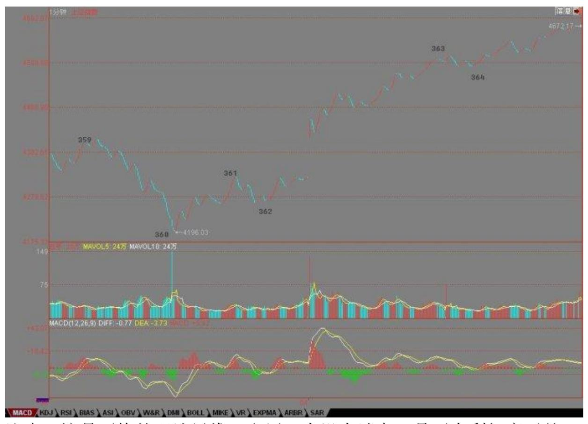

# 教你炒股票 98:中医、兵法、诗歌、操作 2

一种思维模式的改变是很难的,因为一种思维模式的存在,往往连自 己都不察觉,特别,一出现强烈走势后,那些老的毛病就又出来了。 这几天的大盘转折走势,就是一个很好的例子。 一个背驰后,无论是 盘整背驰还是真正的背驰,理论只能保证其回拉原来的中枢,这是正 确的思维方式,那么,回拉之后如何,这涉及预测。正确的思维是, 把回拉后出现的情况进行完全的分类,根据每种分类对应的后果,决 定你自己的对策。

例如,上周五下午的背驰是很明显的,任何人都可以当下发现。这个 背驰进去后,收盘了,后面面临着继续向中枢上边突进以及再次回探 两种情况。第一种情况,意味着 362 开始的线段要继续延续下去,而 第二种情况,首先就要破坏 362 开始的线段。那么,这两种情况就很 简单了,就等周一的开盘当下地决定这线段是否被破坏。

注意,这是严格的理论思维,和周一有没有消息,是否有利好毫无关 系。特别地,如果有利好,竟然还走出破坏 362 开始线段的走势,那 么这问题就严重了。当然,实际上,大盘一直到了 364 才破坏了这线 段。但这时候,就不存在走的问题了,为什么?因为理论上,这演化 成线段类上涨的可能性极大,除非 363 开始这线段跌破 361 这个位 置。所以,后面你只要看这着线段是否跌到那位置,显然也没有,所 以就继续持有。 等364 这出来,展开新的线段后,因为已经的第二个 线段类中枢,所以就要注意是否有可能出现类背驰,这就看明天开盘 后的情况,如果不能继续保持类似斜率的上涨,那么这线段类上涨结 束形成一个 1 分钟中枢就要情理之中了。 你看,上面所有的分析, 都要严格的逻辑关系之中,这是理论的必要结果,也是一种正确的思 维方式。当然,一个线段的类背驰是否需要抛点货,这是每个人的爱 好问题,你的操作级别问题。 这就如同打仗,你不能假设明天某某山 头还在自己手里,然后根据这个假设去安排兵力,山头是否在自己手 里,那是当下的。当然,你可以去反复争夺一个山头,但你不可以假 设这山头在未来的某一个时刻 100%就在自己手里。 这也如同中医, 你不能认为你的药一定有什么效果,效果是吃了药以后再望闻问切测 出来的,而同一病人的药,要根据这不断地望闻问切进行必要的增

减。当然,你也可以保持不变,就如同在一个上涨趋势中,你可以保 持持有,但一旦出现超越你的级别,你的操作限度的转折信号,也就 是背驰,那么你的药就必须要变了,甚至是大大地改变。 因此,如果 周一并没有出现今天的利好,你的操作逻辑并不会有任何改变,还是 根据当时的图形是否触及你的操作分类界限进行,这才是正确的思 维。 换言之,你在操作时,你后续的所有可能面对的情况与对策都必 须了然,否则你就没资格操作。对于一个真正的操作者,没有任何情 况是意外的,因为,所有的情况都被完全地分类了,所有相应的对策 都事先有了,只是等着市场自己去选择,去触及我们事先给定的开 关。 说实在,比起中医、打仗,股票是最简单的,为什么?因为股票 的后续走势,因为有了本ID 的理论,都可以严格地唯一地给出统一的 完全分类,而中医、打仗,要面对的可能就更复杂了,特别打仗,完 全的分类,可能只能是一种假设了。 如果你的思维还是转不过来,那 么就没有必要再去学习,首先把思维转过来。 有人可能问,如果出现 回探的情况,那么可能在背驰买的出不掉。显然,这种情况是很可能 的,因为 T+1,该反应的时间你可能没资格卖。不过,一个很简单的 对策就是,你必须买比大盘要强势的股票,也就是先于大盘的股票, 这样,一旦大盘回转,这类的股票走势都会比大盘强,这样自然有足 够的空间让你选择。 192注意,最好的选择是比大盘稍微先一点的, 而不是完全逆于大盘的,因为后者,往往有可能补跌,或者逆着大盘 洗盘,例如,今天的 600737 就是一个很好的例子。当然,新股也是 一个很好的选择,不过这需要这类股票开得不太高,而且有明显的新 资金介入,在一个有一定级别的向上过程中,这一般都有比较稳定的 表现。还有就是先于大盘调整的,例如这次那聪明的驴,就是这种类 型。 当然,如何选择股票,这是一个经验问题,必须要反复练习才会 有灵感与感应的。其实,股票真没有那么复杂,如果你有了感应后, 打开一个股票的图,你一眼就能看出这面首是否在搔首弄姿在等着宠 幸,这就如同 419 时,你选择人难道还需要技术分析吗?那不就是一 眼的事情吗?哪天,你看股票就如同419 选人一样有感觉,那你就有 点靠谱了。 阴线迎春给一根筋上了生动一课(2008-02-05 15:09:59) 本 ID 前面说了,节前连涨三天是不允许的,而两天要看周末消息和 石油的变态程度。昨天,有利好涨了,而今天的石油,有人疯狂地抛 出来,似乎那石油是不用钱买的,这么变态,你说能红盘吗? 一根 筋,不是别有用心就是脑子有水,市场操作,不脱离一根筋,那命运 是怎么样,是不用讨论的。 技术上的问题,昨天说得很清楚了,就是 线段类背驰后必然出现 1 分钟中枢,节后,就看这中枢的演化,事情 就这么简单,不需要任何一根筋的想法。而中短线上,还是 4500 点

上下那中枢的震荡走势。 请好好看看真正的大资金是如何运作的,大 概很多人都忘了 580989 了吧,看看今天的走势,有什么想法?一个 长假期,一个稳健的大资金,当然要这样进行有效的对冲,很多时 候,不确定因素是要靠对冲来解决的。

这样,不管外围在春节发生什么事情,都可以吃嘛嘛香了。 当然,对 于小资金来说,580989 这类东西风险太大,没必要参与,而且小资金 不一定要对冲了,就要发挥自己机动灵活的特点,看不确定,就先走 一部分,有钱在手里,什么都不怕了。 贪婪总是希望行情按自己的欲 望发展,那是鸭屁思维,不改变,永无出期。

总结一句,任何不确定时,唯一正确的做法就是控制仓位,你能自如 地控制仓位,那你的水平就能上一台阶。控制仓位,并不是说一定要 空仓,而是把仓位控制在一旦发生特殊情况能有足够反应的水平。 任 何想把最后一分钱赚到的,最终的命运只能是倾家荡产。 大过节的, 就不说这些事情了。但市场的残酷,是不分节日的,那种春节一定要 红盘,奥运一定要大行情的思维,要好好醒醒了。 大过节的,抛弃股 票,享受人生。

你的身体、家庭、父母、亲人,比股票重要一亿万倍,好好珍惜吧。

还是说说这无聊的大盘吧。 只有一根筋的才喜欢开门红,知道 1993 年开门红以后就从 368 点的深圳综指跌到 94 点,大概也只用了 1年 半不到时间。不开门红,其实真没有什么,至少证明,里面有足够多 的资金都没觉得今年是必须在春节一开门就要骗人来埋单的,至少有 足够多的资金还有下一步的打算。 技术上,本 ID 已经说得超明确, 就是原来最后那中枢的扩展,这震荡什么时候结束的唯一标准,就是 出现第三类买卖点,其他一切都是废话。 大的方向,本 ID 说过N 次 了,但糊涂的人太多,再明确说一次: 一、下面最大的机会,就是 6124 点下来 30 分钟走势类型结束后的向上 30 分钟走势类型,这机 会在酝酿中,也就是在中阴阶段。但那 30 分钟的向上类型,最坏的 情况,就是一个盘整,并不一定走出上涨类型,这是必须明确的。如 果是盘整,就在这上下搞出一个日的中枢,然后就面临 6124下来的日 走势类型的第一个中枢,后面无论延伸出下跌或盘整,都是完全可能 的,如果是下跌,那当然恐怖无比,比这几个月都要恐怖。

所以,3 月前后,对中线走势极为关键,要继续全面富裕还是怎么 着,就看着办了。 (娇注:真实走势 30 分盘背后构成最简单的 30分 3 卖后继续跌延续 30 分趋势,禅师这里是设想年线上构成 30 分盘 背走势类型的结束,开始新的上 30 分走势) 二、个股依然机会不 断,新股、高送配的,有各类题材的,都会有机会。当然,从上线角 度,本 ID 看好的类型也说过无数次了,就是环保(包括新能源)、 农业、消费类消耗品等等,短线,当然就是高送配中股价特别低的, 例如现在不到 20,而要送 10 之类。中线,化工等玩意是值得注意 的。 注意,看本ID 的文章,你必须连着看,因为有些前面的结论, 本 ID 不可能每次都重复,例如对大盘的总判断。还有,本 ID 在前 面那波中把人分为两类,一类就是坐小板凳的,一类是可以不断参与 活动的,你首先要分清楚自己是哪一类。 就象从 4778 到 5522 那 次,本 ID 从来没让坐小板凳的起来,为什么?因为那次是 30 分钟 以下级别的活动,既然我们假设小板凳至少要搞 30 分钟以上的,否 则搞不过来,那么当然就一直不用起来。但还是有无数孔男人的学生 叫嚷,为什么涨了不让我们从小板凳起来,那你首先问自己,你有搞 30 分钟以下级别的本事吗?5522 点的急促下跌,就是因为上来的级 别小,下来的当然也就小,你能反应过来吗?那些下来时不会动的, 你认清自己的水平了吗? 认清自己,否则一切瞎掰。就像 580989, 机会就这么大,但你首先要有这水平,自己都认清不了,那只能等着 被屠杀。 认清自己,然后根据实际走势决定自己的操作,就这么简 单,还孔男人什么呢?开门不红又何妨? (2008-02-13 15:15:42) 开 门大红包,本 ID 可给足了,580989 的两次启动,都给足提示,第一 次,提示后在 0.42 下随便买到,这次,即使节前你自己没看明白, 今天在 0.5 下随便买,而且还两次机会,操作好了,随便一天 50%的 利润。 所以,本 ID 绝对不欠任何人红包了。 至于大盘没有红,本 ID 可真没什么兴趣关心,具体的说法,在节前最后的帖子里已经无比 清楚了。 580989 的中线中枢,本 ID 在第一次启动时已经明确说 过,就是 0.6 上下,回头再看看,这走势是不是完全的教科书?请好 好再看看本 ID 节前最后的帖子,看看关于如何对冲,如何平衡风险 的做法。让那些预测连涨 3 天的吃西北风去吧,两次 580989 的礼 包,足够连续 30 涨停的利润了。 强烈注意,本 ID 再次必须声明, 一般人绝对不能买580989,你想,600737 在 8 元说的还有人是亏钱 出来的,580989 就是你的坟墓,没那本事心态,就继续当教科书演示 看看吧。 还是说说这无聊的大盘吧。

只有一根筋的才喜欢开门红,知道 1993 年开门红以后就从 368 点的 深圳综指跌到 94 点,大概也只用了 1 年半不到时间。不开门红,其 实真没有什么,至少证明,里面有足够多的资金都没觉得今年是必须 在春节一开门就要骗人来埋单的,至少有足够多的资金还有下一步的

打算。 技术上,本 ID 已经说得超明确,就是原来最后那中枢的扩 展,这震荡什么时候结束的唯一标准,就是出现第三类买卖点,其他 一切都是废话。 个股方面,中石油站不稳,指数要站稳那绝对是没戏 的,那 10 亿的玩意,这两天成交了 4 亿了,当然,里面还有很多水 分,但中石油今天留下的缺口,应该很快就回补,问题还是这 24 元 上下的中枢,最终如何突破,这和大盘中枢的突破是密切相关的。 说 实在,今天这样的成交量,说明了这春节假期确实太短了,怎么都该 放到 15 吧,各位在春晚是否看到那讽刺股民的节目了?有这样的现 象,你说,这股市能好吗? 中线,就看 3 月的会能不能搞点什么 了,面包会有的,但要靠自己去抢。

后三日是技术上最关键时刻 (2008-02-14 15:25:29) 先请个假,今天 晚上有事,晚上的帖子,本 ID 就克扣了,抱歉。 今天的 580989, 一个经典的走势,不管你是否参加,你都先请搞明白:今天尾盘的拉 起故意和昨天是一样的,这就是一种典型的骗人手法,因为一根筋的 人最多了,以为什么都是可以克隆,以为有一样的开始就有一样的结 果,结果就给克死了。 世界就这么残酷,这一招,用了好几百年了, 在中国市场上也用了好十几年了,还继续好用,人就这德行了。不管 你参与与否,被骗与否,都要学着点吧,这样以后兴许不会再被骗。

当然,类似骗局有很多变招,因为前 N-1 次都是一样的,但这 N 可 以不断地变化,用得最气势磅礴的,就是 10 几年前深圳 194 点到 334 点那次大反弹,不断同样的模式后,最后一天大跳水,多少人一 直套到 100 点,可怜呀。 说大盘吧,大盘后三天是技术关键,因为 所谓的 MACD 等指标金叉就要出现,要骗你,也就是这个时候。但这 时候有两种骗的方向,一种是骗空头,一种是骗多头,都仔细看好 了。 大的方向,本ID 说过 N 次了,但糊涂的人太多,再明确说一 次: 一、下面最大的机会,就是 6124 点下来 30 分钟走势类型结束 后的向上 30 分钟走势类型,这机会在酝酿中,也就是在中阴阶段。 但那 30 分钟的向上类型,最坏的情况,就是一个盘整,并不一定走 出上涨类型,这是必须明确的。如果是盘整,就在这上下搞出一个日 的中枢,然后就面临6124 下来的日走势类型的第一个中枢,后面无论 延伸出下跌或盘整,都是完全可能的,如果是下跌,那当然恐怖无 比,比这几个月都要恐怖。所以,3 月前后,对中线走势极为关键, 要继续全面富裕还是怎么着,就看着办了。 (娇注:真实走势 30 分 盘背后构成最简单的 30分 3 卖后继续跌延续 30 分趋势,禅师这里 是设想年线上构成 30 分盘背走势类型的结束,开始新的上 30 分走 势) 二、个股依然机会不断,新股、高送配的,有各类题材的,都会

有机会。当然,从上线角度,本 ID 看好的类型也说过无数次了,就 是环保(包括新能源)、农业、消费类消耗品等等,短线,当然就是 高送配中股价特别低的,例如现在不到 20,而要送 10 之类。中线, 化工等玩意是值得注意的。 注意,看本 ID 的文章,你必须连着看, 因为有些前面的结论,本 ID 不可能每次都重复,例如对大盘的总判 断。还有,本 ID 在前面那波中把人分为两类,一类就是坐小板凳 的,一类是可以不断参与活动的,你首先要分清楚自己是哪一类。 就 象从 4778 到 5522 那次,本 ID 从来没让坐小板凳的起来,为什 么?因为那次是 30 分钟以下级别的活动,既然我们假设小板凳至少 要搞 30 分钟以上的,否则搞不过来,那么当然就一直不用起来。但 还是有无数孔男人的学生叫嚷,为什么涨了不让我们从小板凳起来, 那你首先问自己,你有搞30 分钟以下级别的本事吗?5522 点的急促 下跌,就是因为上来的级别小,下来的当然也就小,你能反应过来 吗?那些下来时不会动的,你认清自己的水平了吗? 认清自己,否则 一切瞎掰。就像 580989,机会就这么大,但你首先要有这水平,自己 都认清不了,那只能等着被屠杀。

认清自己,然后根据实际走势决定自己的操作,就这么简单,还孔男 人什么呢? 回试年线暂显支持 (2008-02-15 15:39:01) 今天回试年 线暂显支持,但问题还是下周初,因为 MACD 的柱子是否有效放红, 这是下周最关键的问题。目前的情况十分明确,就是技术面完全支持 行情的展开,但基本面、政策面有太多令人不满意的因素,因此才有 如此上下为难的局面。 整个政策面的明朗,大概还是要等到三月会 后,因此,之前,一个震荡的局面依然。其间,上下尝试,左冲右突 一下是很正常的。期间甚至不排除再有一次大的跳水去把最后的盘子 洗干净,当然,这涉及最后的底部图形,如果是头肩底,那这次跳水 就免不了,如果不是,那就不一定有了。是否头肩底,和后续的消息 面相关,技术上反而没有太大的倾向。 但个股行情会继续展开,只要 指数稳定筑底中,有题材的个股就不会寂寞。但操作中必须要有严密 的布局,例如,昨天说的 20 以下送 10 的个股,其实就没几只,本 ID 没明确说出来,就是不希望养成懒惰的习惯,连自己功课都不想 做,那干脆把账号告诉本 ID,本 ID 把钱直接打给你算了。 最符合 要求的,只要做点功课,显然不难找到,就是 600795。这股票,业绩 很好,10 送 10后就今早算 9 元,风险度很低。而且,530 后大唐电 力的送股行情表现,使得这股票的后续走势更有想象力。但这些都是 估算,你介入时,就应该知道,这两天的小阴线是在构造一个小的第 三类买点,18元上介入,大概的风险有 10-15%,所以,你就根据自己 的风险能力去决定自己的仓位,然后买入相应仓位,并留下一定的对

冲资金去为后面减低成本,有了这一些安排,今天一大早有足够的时 间让你去介入了。 注意,这里教的是一种思维操作方法,不是说一定 让你去买600795,而且,现在拉起来了,再买就没意思了。 来这里, 不是培养懒人的,这点,请一定注意。 580989,今早又给了一次走的 机会,没走就不要怪本 ID 了,当然,大盘只要走不好,这东西还要 折腾,但至少这一走,逃过 20%的跌幅,这已经足够了。 周末,都好 好休息吧,身体最重要。

MACD 红柱子终现待确认 (2008-02-18 15:18:26) 上周说了,本周最 重要的事情就是这MACD 的红绿柱子问题,今天,借点利好,终于把这 红柱子给弄出来了,但注意,这并不意味着一切无忧,下面就是一个 确认的问题。

(娇注:绿柱子缩短后两种分类,1 继续逼多绿柱子加长 2 金叉出红 柱子。第二类又分 3 小类。1 出 4 到 6 根红柱子堆 2 5-8 个红柱 子堆 3 红柱子连堆。注意观察第一根红柱子所在 K 线支撑作用) 技 术上,一般这种红柱子出来后,如果不能站住今天的位置,那么就会 出现出几根红柱子再出绿柱子的情况,这种情况往往对应着新一轮的 杀跌,所以这红柱子出来,需要预防的就是这种情况。 (娇注:上涨 下 5 分盘整转折看死叉第一个绿柱子对应 K 高点能否突破续涨,下 跌上 5 分盘整转折看金叉第一个红柱子对应 K 低点能否跌破续 跌。) 具体操作上很容易处理,也就是红柱子出来后,如果后续能量 不能跟上,那么出现以上情况的可能就很大了,那么在冲高无力时, 一定要先出来看看,因为后面对应的转折很可能是极为急促的。 技术 上,底部的构造有头肩底的可能,这红柱后很快再绿柱的情况,往往 就对应这种情况,在最好的情况下,也就对应双底的情况。 当然,以 上都是些不精确的分析,如果按本 ID 的理论来,这些分析都没多大 意义。现在就是一个中枢震荡的过程,这点说了多次了,今天并没构 成线段类上涨,说明向上动力不足,因此今天构成的 4575 上下的 1 分钟中枢就有着重要的技术意义。后面的超短线走势完全由此中枢最 终演变所决定。 个股方面,农业、化工、奥运等等都有表现,但板块 持续性还是有问题,现在的问题是,一个超级裸奔的板块还没有形 成,所以个股行情只能显现零散的局面。要改变这局面,还需要人气 的不断培养。600795 碰到 20 的整数关口,需要整理换手,如果高送 股的板块都走不出来,其他板块就更难有戏了。 本周能否保持住MACD 的红柱,并站稳 4575 之上,这是对多头最重要的技术要求,明天的 CPI 是一个考验,能否经受这考验,这是能否完成要求的关键。
