# 教你炒股票 99:走势结构的两重表里关系 3

(2008-02-18 16:19:16) ( 娇:中阴,一个走势完成后的状态) 走 势结构,最重要的就是有中阴部分的存在。有人可能认为,中阴存在 是理论不完善的结果,其实,这是典型的一根筋思维,对于这种思 维,世界就是机械的,任何时候都只有一个机械精确的结果,而实际 上,世界更多是量子化的,是测不准的,中阴的存在恰好客观地反映 了走势的这种特性。 中阴状态的存在,反映了行情走势生长阶段的未 确定性,这种未确定性,不会对操作有任何的影响,因为中阴状态都 可以看成是一个中枢震荡的整理,根据中枢震荡的操作就可以了。 很 多人,一碰到中阴状态就晕,因为这时候,你不能对走势给出明确的 划分。注意,这里不是指同级别的划分,而是一般性的划分。例如, 一个线段性类上涨类背驰后,必然首先出现一个1 分钟的中枢,也同 时进入一种中阴状态,但你不能说这走势必然就是 1 分钟类型的,因 为,最极端情况下,两个年中枢之间也可以是一个线段连接,甚至就 是缺口连接,这在实际上都是完全可能发生的。

因此,理论必须包括这些情况,而且这些情况太常见了,并不是一个 古怪的问题。 另外,根据结合律,连接中枢的走势,并不一定是完全 的趋势类型,也就是说,一个线段类上涨后,可能第二类类中枢就消 融在中阴状态的那个中枢里了。也就是说,a+b+c+d+e+f= a+b+c+ (d+e+f),a+b+c+d+e 是一个线段类上涨,c+d+e 的重合部分构成最 后的一个类中枢,f 是类背驰后的回调,这时候,就可以马上构成一 个 1 分钟的中枢,然后后面直接继续上涨,构成 1 分钟的上涨是完 全合理的。因为,最终的划分,就必须把 a+b+c+d+e 给拆开了。 因 此,一般划分中,如果中阴状态中从前面的背驰点开始已经构成相应 的中枢,例如在 a+b+c+d+e+f 后又有 g\h,f\g\h 构成 1 分钟中 枢,那么整个的划分就可以变成 a+b+c+d+e+(f+g+h),这样,原来 的线段类上涨就可以保持了。 如果后面包括 d+e+f 延伸出 9 段,然 后又直接上去了,划分中,必须首先保证 5 分钟中枢的成立。换言 之,划分的原则很明确,就是必须保证中枢的确立,在这前提下,可 以根据结合律,使得连接中枢的走势保持最完美的形态。 由此可见, 因为划分中的这种情况,我们就很明确地知道,走势的最大特点就 是,连接中枢的走势级别一定小于中枢,换言之,一个走势级别完成 后必然面临至少大一级别的中枢震荡。例如,一个 5 分钟的上涨结束 后,必然至少要有一个 30 分钟的中枢震荡,这就是任何走势的必然 结论,没有任何走势可以逃脱。 有了这个必然的结论,对于任何走 势,其后的走势都有着必然的预见性,也就是其后走势的级别是至少

要大于目前走势的级别。这里,一个很关键的问题就是,这个大的走 势级别的第一个中枢震荡的位置,极为关键,这是诊断行情的关键。 首先,任何一个后续的更大级别中枢震荡,必然至少要落在前一走势 类型的最后一个中枢范围里,这是一个必然结论。换言之,只要这中 枢震荡落在最后一个范围里,就是正常行为,就是正常的,也就是 说,这种中阴状态是健康的。 但,一旦其中枢震荡回到原走势类型的 第二甚至更后中枢里,那么,对应的中阴状态就是不健康的,是危险 的,而原来走势的最后一个中枢,就成了一个关键的指标位置。 注 意,危险是相对的,对于原下跌走势的中阴危险,就是意味着回升的 力度够强,对多头意味着好事情。 结合分型,例如,一个日分型的出 现,意味着笔中对应的小级别走势里出现大的中枢,因此,这个分型 对应的中枢位置,就很关键了,这几乎决定了这分型是否是最后真正 的顶或底。(娇注:观察分型对应前小级别走势的第一还是第二中枢判 断力度。简言之为看分型第二第三元素是否为强力 K 线) CPI 公布 成突破契机 (2008-02-1915:16:27) 昨天说了,今天要经受 CPI 公布 的考验,结果大盘一直围绕 4575 的中枢震荡,CPI 公布后也依然不 变,下午更向上偏移,显示了最近少有的强势,最后一小时,就是中 石油的表演,该股也如期回补前几天的缺口,但由于该股最近的大中 枢并没有有效突破,所以这个回补只有震荡的意义,暂时不能给予太 高的技术评价。 显然,今天的走势,使得 MACD 的红柱子继续延伸, 而从 4431 点的回升,目前已经至少是 1 分钟走势类型的,第一个中 枢在 4575 点上下,后面就看能不能在其上形成新的中枢,如果行, 就继续强势。4672 点是第一回升的高点,因此,最强的走势,就是新 中枢至少围绕该点位形成,甚至在其上形成,这样,大盘走势的可拓 展性就大大加强了。

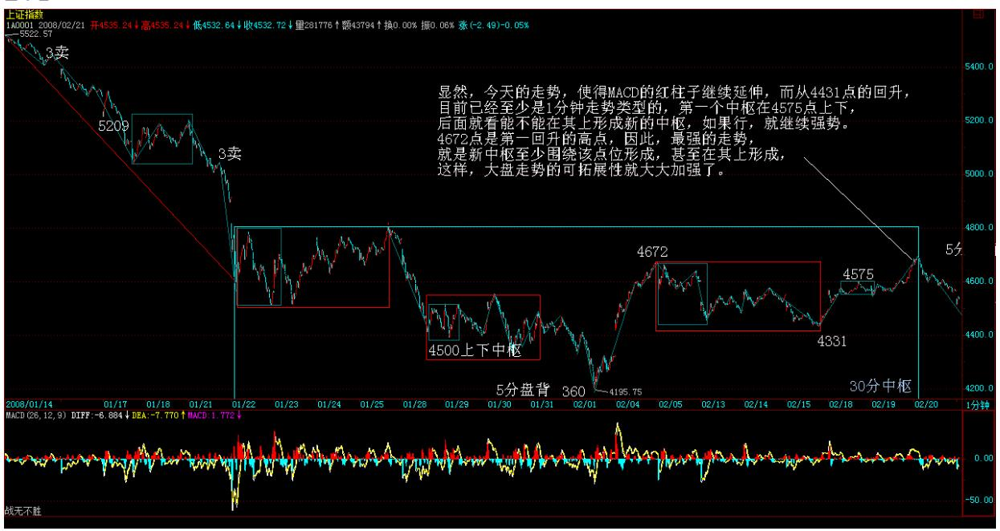

当然,站在本 ID 理论的角度,由于这次的底分型范围的上沿也在 4672 点,所以 4195 点上来的走势最终是否延伸为笔,关键也在4672 点的站稳。因为笔的最基本条件就是顶和底分型之间必须有不重合的 部分,1 月 23 日那个底分型,就是因为后面不能突破站住 1 月22 日高点 4818 点,所以使得不可能延伸

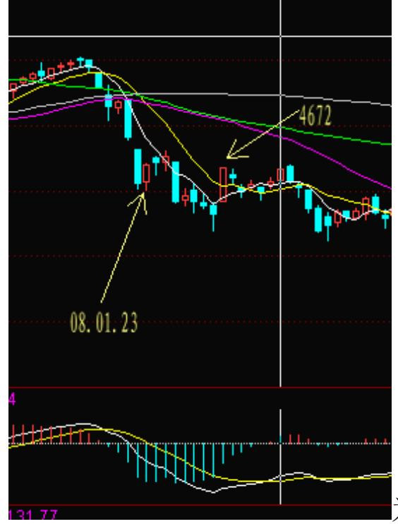

为笔,进而原来的向下笔继续延伸,形

成后面的下跌。

因此,从最技术化的角度,4672 点是一个关键的位置。 不过目前短 线最大问题,还是板块行情没有被点燃。靠中石油可以突破,但不能 把人气激发,所以,后几天能否激发出板块行情,将是行情能否有力 度延续的关键。

大规模增发猛于虎(2008-02-20 15:27:33) 5200 点那次,平安的增发 成了最后的稻草,今天,又来了一个浦发的增发,虽然不是正式的消 息,已经足以让大盘回头。 现在的多头,必须如利物浦一样去战斗才 行。三个手球不算,熬到最后一刻才把最后的纸给破了。现在,基金 的新发,等于把空头一个人给罚下了,但要灭空头,没点耐心是不行 的。今天这增发闹剧,等于一个手球不算,估计这不算的手球,还少 不了。不熬到 85分钟以后,胜利的希望是看不到的。 技术上,这 1 分钟的上涨肯定是没戏了,这里最好的情况,就是震荡出一个 5 分钟 的中枢,看能不能搞成 5 分钟的上涨,注意,这是最好的情况。最坏 的情况,当然是4575 点附近的震荡后出现第三类卖点,这样就重新探 底。 中线上,4672 点站不住,真正的行情就不会展开,依然是继续 的震荡走势,等于今早前 85 分钟的闷战。 204

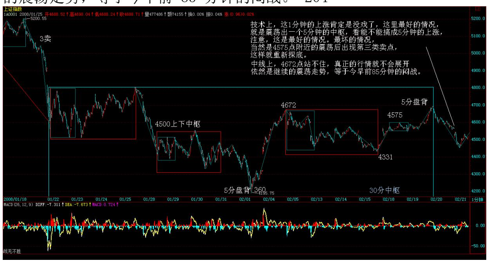

多头需要第一个进球,这进球,必须来自板块的启动。本 ID 一直强 调的农业股,现在已经是整体走强,600737 更是无耻地又新高了。这 板块能否带动化工等,逐步把热点蔓延,这是后面需要留意的。有时 候火点起来了,蔓延不起来,那只好偃旗息鼓,等机会再来,这种事 情也是经常发生的。

前面说了农业,环保新能源,化工,这都很好理解。至于消费消耗品 类的,这其实是中国最大的优势,就是各种消耗品,例如吃的,包括 调味品等等;用的,用的包括很多方面,例如汽车发展了,汽车的配 件如轮胎、玻璃之类的,反正是整天要换要用的。中国什么多?就是 人多,消耗多,这是永恒的题材。酒类,只是其中很小的部分。 中线 真的突破时间,可能真要如前面所说,等到 3 月那会后了,所以一定 要耐心。最主动的做法的,就是追逐最强势的板块;最稳健的做法, 就是逢震荡低吸那些有中线潜力且刚启动的,如高送之类。 580989。 现在是完全和大盘对冲着搞,中枢上的风险就开始加大了,当然,如 果大盘破位,那会有一次冲动的过程,不过风险很大,一般人看看就 算了。

资本市场必须维持生态平衡 (2008-02-20 16:27:15) 环境保护、生态 平衡已经是世界性的大问题,而资本市场,也同样存在一个环境保 护、生态平衡的问题。在资本市场上活动的各种力量,之所以能存在 一个系统中,就是之间有一个基本的协调关系,而一旦这个关系被打 破了,这个资本市场的大系统就会出现生态危机。而一旦出现生态危 机,这资本市场要恢复元气,那就不是一朝一夕的事情了。 对于中国 这初生的资本市场,其生态系统本来就极为脆弱,因此,期间的生态 平衡,必须有些人为的引导,而这种人为的引导,在该系统充分发育 后将逐步减少。因此,对于管理层来说,有意识地对资本市场的生态 系统进行环境保护,是其最为重要的任务。因为对于管理层来说,其 业绩的好坏,完全依赖于资本市场系统运行的顺畅与否,一个导致资 本市场生态灾难的决策,无论如何都不可能是及格的。 资本市场的生 态平衡的维护,是有时间性的,一些决策也因此带有时间性。例如, 目前的环境下,一个资本市场中的大力量,通过强力的圈钱活动对资 本市场的资源进行过度开发,这样的事情,就绝对是不合时宜的,一 旦蔓延,必要要造成生态灾难。 环境保护,很重要一点,就是要对资 本市场的市场资源进行合理、适度的开发,禁止乱砍乱伐,更不能允 许那些无证小煤窑或受到地方以及其他保护势维护而非法开采的煤老 大到处横行,这些资源是属于全中国人民的,没有人有资格随意浪费 或为自己的利益而干苟且之事。

其实,世界上的道理都很简单,资本市场的事情也很简单,不简单的 都是利益。有了利益,一切简单的事情就复杂了,现实中的环境保护 所遇到的问题如此,资本市场上的问题也是如此。 因此,要最终解决 问题,就是一定要砍断这利益的背后黑手,这大概才是问题的关键。 赚钱是靠个股而不是指数 (2008-02-21 15:18:25) 各位元宵好,晚上

过节,就没帖子了,抱歉。 今天,昨天的传闻被证实了,在现代社 会,空穴来风的事情很少有,特别在资本市场。指数勉强地维持了 4575 点的中枢震荡,这 5 分钟中枢是确定了,后面的关键是第三类 买卖点的问题。

207

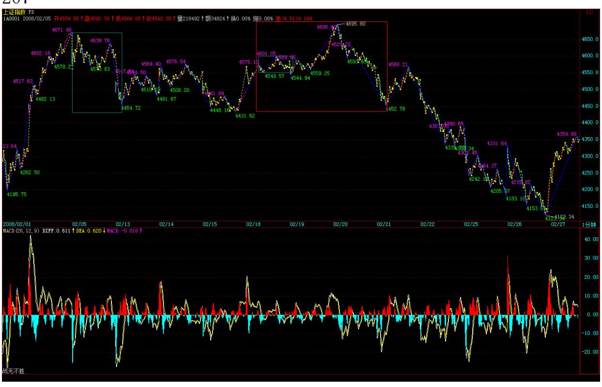

由于大家伙都爱狮子开大口,所以大家只好避而远之,指数折腾不出 花样,并不意味赚钱的机会少了,赚钱是靠个股而不是指数。在去年 的展望中已经明确说过,今年是题材股的天下,而目前,正如昨天所 说,就要到处点火,把板块激荡起来。 今天,从创投到化工、医药、 新能源等等,都被点了一次,这板块轮动是否能起来,现在还不好 说,因为现在人为因素很大,但如果光是点火的人忙乎,最终是燎原 不了的。燎原不了,那点火的人就白忙了。 指数,最悲惨的就是再砸 一次底,但估计有题材的股票,最多就顺着洗洗,你看,现在又有不 少股票新高了。

和指数折腾没多大意思,还是折腾个股吧。 注意,个股折腾,要注意 轮动,一个板块涨起来了,就没必要去追高,要买也买那些没启动但 有新资金关照的。现在的行情,持续性都不高,势头不对就可以跑, 跑了依然会有无数股票等着可以去买,现在可没有踏空一说。 当然, 没这技术的,就抱死一些中线肯定会涨的股票,死守具体的板块。能

轮动起来的,赚 500%,轮动不起来的,死守的,赚 50%,这世界很公 平,技术很重要,没技术就别眼热了。

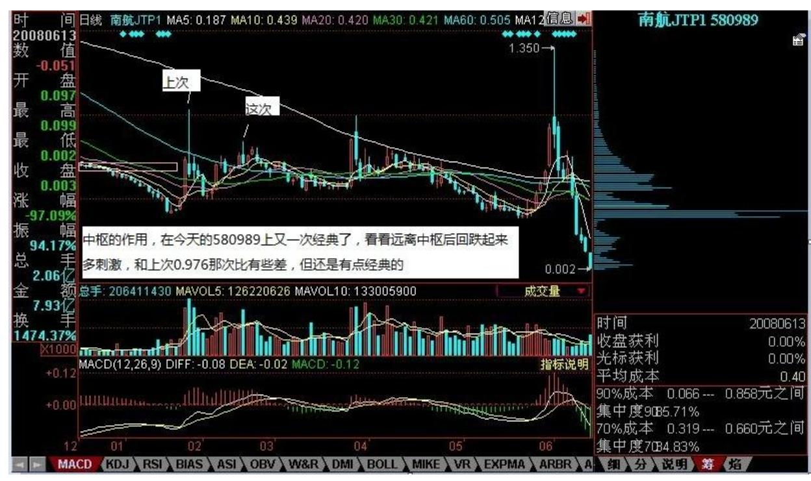

中枢的作用,在今天的580989 上又一次经典了,看看远离中枢后回跌 起来多刺激,和上次0.976 那次比有些差,但还是有点经典的。

下周初决定大盘中线形态 (2008-02-22 15:18:40) 今天继续延续 4695 点浦发闹剧所制造的线段类下跌,在下午 2 点后最终出现一个 类底背驰。该类下跌出现三个类中枢,类背驰后的回拉如理论所要求 的最低幅度回到最后一个类中枢,也就是至少制造了一个 1 分钟中 枢。最坏的情况,这中枢是一个新的 1 分钟下跌的第一个中枢;最好 的情况,就是该 1 分钟中枢出现第三类买点,然后至少回到类下跌的 第二个类中枢范围。因此,下周初该中枢的演化决定了大盘短线的形 态。 211

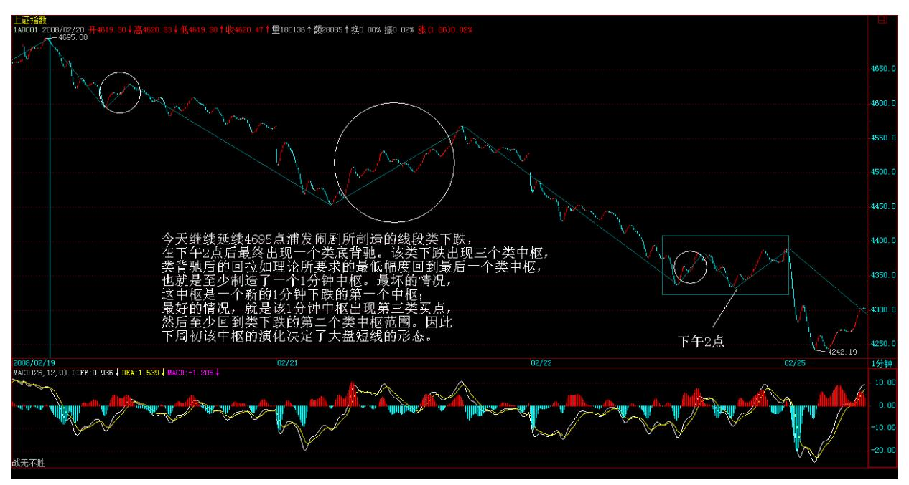

而实际上,大盘下周初的走势还将决定大盘的中线形态。在前几天大 盘 MACD 出红柱子时,已经说过,就是必须注意放几天红柱子后再次 放绿柱子的情况,这样就对应着大盘再次破底形成头肩底形态。那 么,下周,是否要出现这种情况,马上就要分晓。由于今天依然红柱 子,因此还存在不出现绿柱子,红柱子再次伸长的情况,而这一切都 将在下周有分晓。

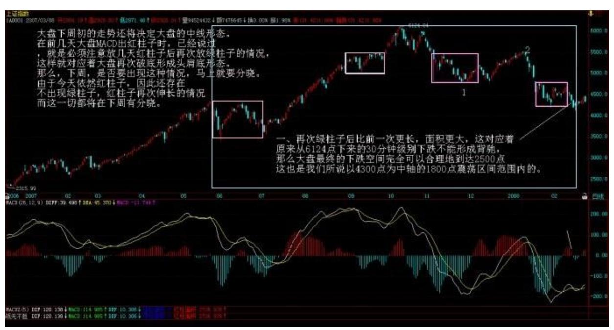

以下的内容,在前面已经多次提过,这里不妨用单纯对 MACD 柱子可 以面临的情况进行最完全的分类再表述一次: 一、再次绿柱子后比前

一次更长,面积更大,这对应着原来从 6124 点下来的 30 分钟级别 下跌不能形成背驰,那么大盘最终的下跌空间完全可以合理地到达 2500 点,这也是我们所说以 4300 点为中轴的 1800 点震荡区间范围 内的。(娇:实际走势 30分 3 卖后继续 30 分类型)评论:这种情 况,在技术上是合理的,但根据大的基本面情况,暂时看不到支持这 种走势的可能,当然,就算这走势真的出现,也没什么大不了的,反 正在真正破位下跌时,根据技术早走了,真有这样的下跌,等于一次 巨大无比的机会在前面招手,那时候,又可以到砸锅卖铁买股票的时 候了。 注意,基本面上其实还是完全存在这种可能性的,就是美国再 次1987 年,本 ID 已经多次表达希望看到这种情况的意愿,可惜这不 是本 ID 所能决定的,那么我们就默默念多点咒语,把 1987 年给咒 出来吧。 二、绿柱子再出现但比前一次短且面积小,对应着 6124 点 下来的 30 分钟下跌背驰,也就是最终结束。然后展开一轮 30 分钟 级别的向上过程。 评论:这是从目前基本面角度最合理的走势,本 ID反复强调,真的行情可能要等到 3 月份的会后,主要就是针对这种 走势的,从月线的角度,底分型并没有出现,也就是说,2、3 月份在 月线上的任务,就是把月线的底分型给弄出来,一旦这成功了,就有 支

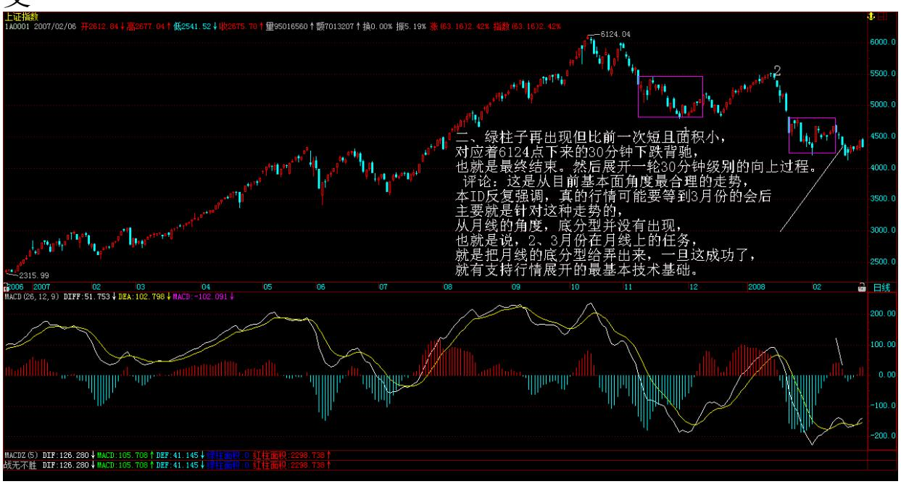

持行情展开的最基本技术基础。 三、不再出现绿柱子,红柱子再次延 长,大盘直接上去。(娇:30 分趋势盘背转折)(注:禅师这里是非 同级别分解,扩展 30 分中枢)评论:由于上次 4195 点对应的是一 个 30 分钟中枢的盘整背驰,从纯技术的角度,这也可以构成底部, 因为 a+A+b+B+c 里,c 并不一定要存在的,可以直接从 B 就向上反

转,这就对应着盘整背驰点的情况。不过,这种情况,一般都需要基 本面的支持。这次,能上来,主要是新基金的发行,但后面一系列的 215

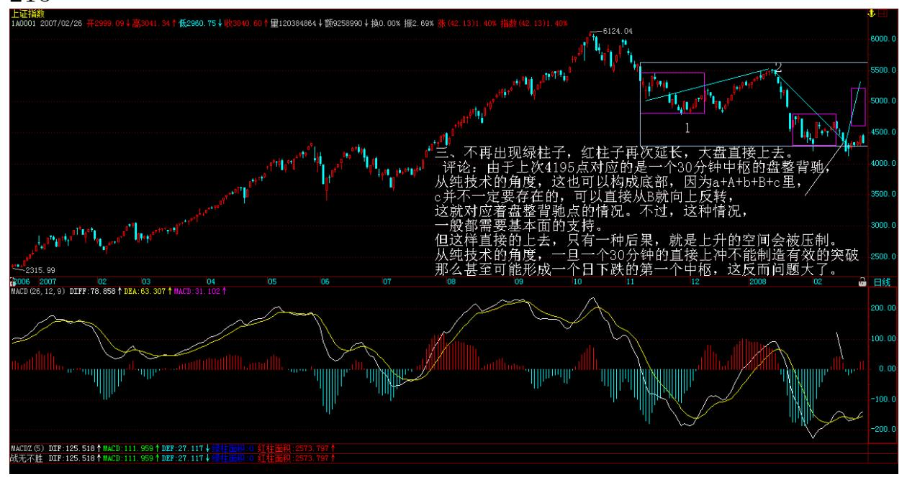

圈钱闹剧,使得新基金的发行基本面支持有所动摇,所以,这种情 况,作为一种良好的愿望,还是可以努力去实践的,但这样直接的上 去,只有一种后果,就是上升的空间会被压制。从纯技术的角度,一 旦一个 30 分钟的直接上冲不能制造有效的突破,那么甚至可能形成 一个日下跌的第一个中枢,这反而问题大了。

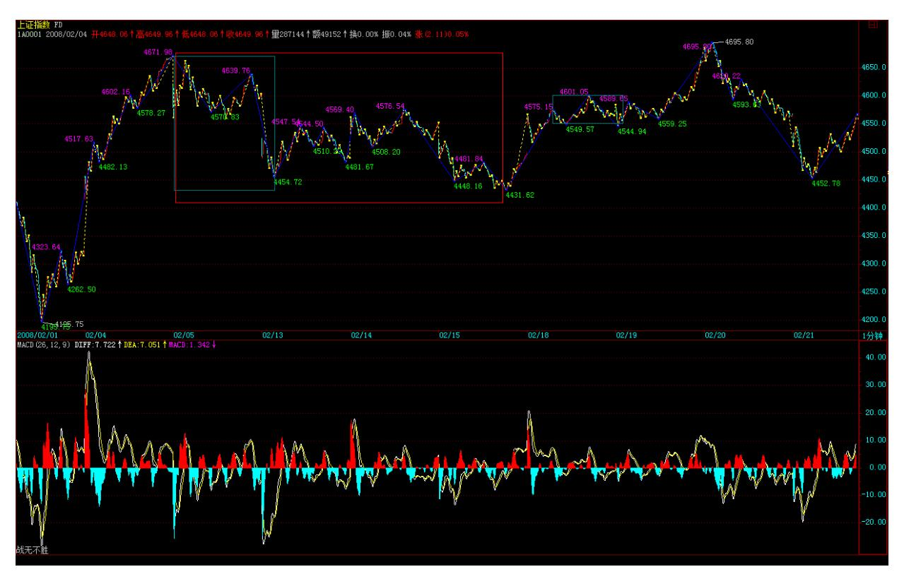

当然,二、三两种情况,都依然存在选择的可能,最终怎么选择,那 是大盘自己的事情,我们只需要等大盘自己去选择,然后根据选择操 作就可以。 操作上,已经多次反复说过,震荡中,就是要逢向上无力 就抛,下来跌不动了再买,这样才是真正操作的节奏,如果你没有这 个节奏,那干脆就坐小板凳看着。 对于大盘大的走势,去年展望中曾 说过,大盘有很大可能今年创不了新高。从纯技术的角度,无论最后 是哪种选择,30分钟的向上最大可能就是形成大的第二类卖点,6124 点是第一类卖点,后面至少要回杀形成一个大的日中枢,所以,今年 行情的困难程度,去年底已经说得很明确了,还是那句话,今年结束 时,大多数股票的年 K 线都将是阴线,这点必须时刻记住。 所以, 各位可以根据自己的情况,决定自己的操作:一、如果觉得自己无法 应付日以下级别的折腾,那么全年坐小板凳也是一个很好的选择。 二、觉得 30分钟的走势还是可以应付的,就好好等待这 30 分钟向上 机会的酝酿、展开,但一定要记住,现在犯点错误问题都不大,但一 旦最终这向上开始后,最终一定要在顶背驰时出来,第二类卖点不 走,后面是什么结果,看看昨天的 580989 在 2 点多 0.76 上那第二 类卖点后,收盘在0.64 就知道了。当然,第二类卖点大幅度调整后会 有再次上涨的机会,但如果这调整不躲开,其痛苦程度可不是一般人 能承受的。 个股方面,已经反复说过,今年除非有期货,否则大盘股 都没什么大戏,而期货是本 ID 所深恶痛绝的,本 ID 今年的三大任

务之一,就是不想看到期货。今年就是题材股的天下,这已经说得太 多了。诸如农业、创投、化工、医药、消费品、奥运、低价股投机股 甚至军工等等都会反复表现的,而且,最近公布了重组的事情,因 此,关于重组的题材将慢慢升温,重组题材的好处,就是熊市也可以 炒得热火朝天,这是一个值得关注的方向。 一定要注意,今年行情, 就算是个股也不可能像以前单边上去,肯定是反复震荡,来回折腾, 除非那 30 分钟的向上过程最终展开,否则那种连续涨停,一去不回 头的走势是很难出现的,操作上一定要见好就收,大力来回折腾,这 样才能把利润洗出来。 某种程度上,今年炒股票是一个体力活,要来 回跑动,要特别勤快才行,这点必须注意。 周末,还是少点股票吧。

新基金难敌乱增发(2008-02-25 15:23:55) 所谓事不过三,就算是管 理层,连续三次用同一的招数,市场也不会领情了。而且,市场甚至 会这样以为:连续发新基金,又不制止乱增发,难道是想让新基金去 配合完成乱增发?一旦市场有了这样的念头,新基金就算有着良苦用 心,也只会被认为良心大大地坏了。因此,今天市场用新低回应管理 层的关怀,最恰当不过了。 今天的走势,给那些政策迷好好上了一 课,政策从来不是万能的,任何政策不过是市场的分力之一,最终决 定市场的是合力。而所有的合力都写在走势之上,所以,今天的市 场,如期地就把上周所分析的第三种走势给废掉了,后面,就是第二 种走势的演化问题了,这也是我们反复强调的最有可能的走势。 注 意,卖出总在向上的过程中,也就是总在红柱子时。在上次刚出红柱 子时,本 ID 已经明确说过了,一旦上冲没力,一定要先走,因此在 4695 点就算你没看出那5 分钟的盘整背驰,里面还包括一个 1 分钟 盘整背驰的区间套,那么,浦发的消息也已经足以让你走人了。至于 那些还要问绿柱子出来再走是不是太晚的人,永远不会懂得什么叫节 奏。不懂得节奏,那就继续被市场调戏吧。 今天的短线走势是超级教 科书的,一开始就跌破上周的 1 分钟中枢,那中枢,只能回到三个类 中枢类下跌的最后一个,超级弱,因此跌破一点都不奇怪。然后早上 那最大的反弹构成第三类卖点,然后继续下跌,下午那波反弹完成第 二个 1 分钟中枢的构造,所以,4695 点下来的走势,肯定至少是 1 分钟级别的下跌了。

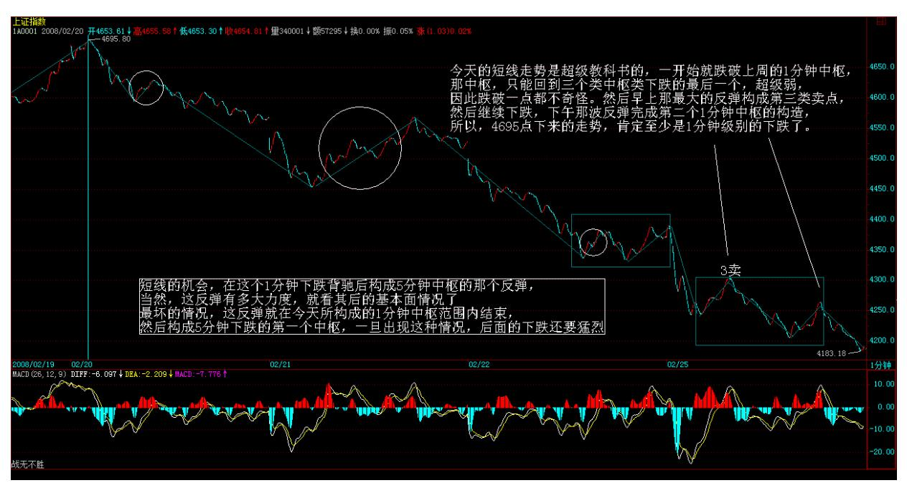

短线的机会,在这个 1 分钟下跌背驰后构成 5 分钟中枢的那个反 弹,当然,这反弹有多大力度,就看其后的基本面情况了。最坏的情 况,这反弹就在今天所构成的 1 分钟中枢范围内结束,然后构成 5分 钟下跌的第一个中枢,一旦出现这种情况,后面的下跌还要猛烈。

当然,现在各种因素交织着,政策面方面经过今天很没面子的一天, 是否有新的动作,这是决定最终形态的一个很重要的因数。其实,现 在最大的利好不是印花税,而是把乱增发给规范,这才是稳定人心的 立杆见影之举。现在就算印花税出来,请问,减少的印花税难道都马 上给平安之流上供去吗? 现在,要密切注意个股了,赚钱是靠个股不 是指数,看好那些趁机洗盘,强力吸纳的股票,技术上最安全的,就 是离前期高位有一定距离,最近强力站稳而成交量一直保持一定数量 的股票,因为新高的股票怕多头陷阱,而这种在下面横着的股票,有 明显的吸纳迹象,就算补跌,也就是洗盘而已,正好继续买。当然, 真能站稳新高的股票,只要前期没有暴炒过的,都是有投机价值的。 但一定要注意,底部不是一天构成的,必然会来回折腾,因此,操作 上一定要把握节奏,在底部震荡中就把成本降下来,一旦行情真启 动,个股刚开始涨,你的成本已经低了 30%,这样不是最美妙的事情 吗? 先下,再见。
