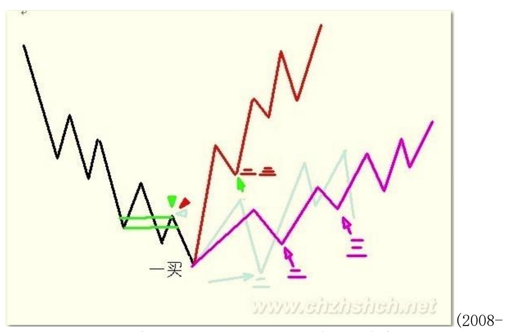
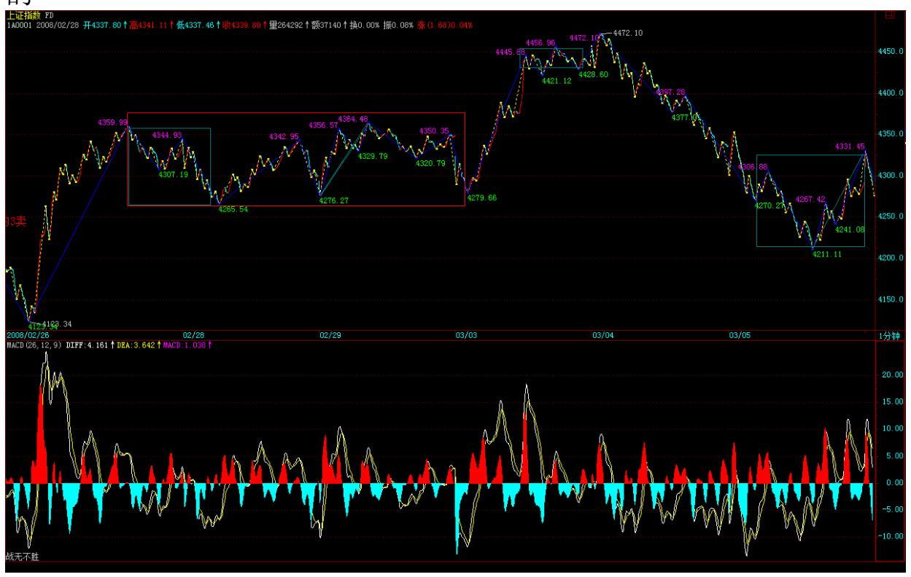
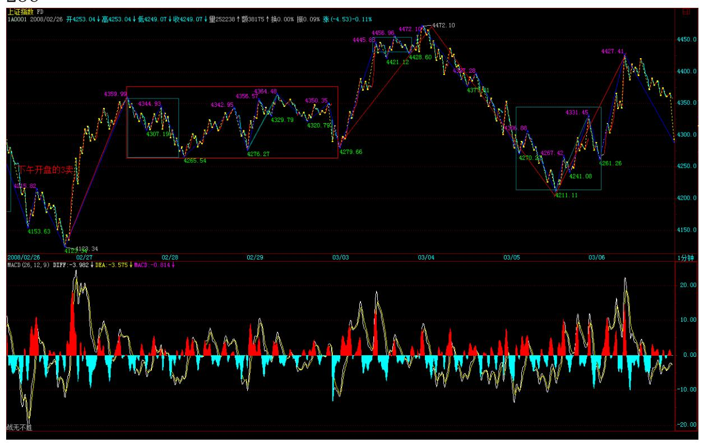

教你炒股票 101:答疑

03-04 16:14:02) 发现课程到这里,后面还有很多内容,但前面的一 些内容,很多人还是没能完全把握。

所以,这里不定时答疑,各位有问题的,最好集中一下,本 ID 有时 间可以把其中典型且重要的回答一下。 1、第二类买卖点的问题 简单 地,就说第二类买点,卖点的情况反过来就是。 第一类买卖点就是背 驰点,第三类买卖点就是中枢破坏点,这都是很清楚的。而这第二类 买卖点,好象还是有很多不明白。 其实,所谓第二类买点,就是第一 类买点的次级别回抽结束后再次探底或回试的那个次级别走势的结束 点。这个定义在前面说得很清楚。例如,一个 5 分钟底背驰后,第一 类买点上去的 1 分钟走势结束后,回头肯定有一个 1 分钟的向下走 势,这走势的结束点,就是第二类买点。 那么,第二类买点有哪几种 可能的情况? (一)、最强的情况 第二类买点刚好构成原来下跌的最 后一个中枢开始的震荡走势的第三类买点,也就是第二、三类买点合 一了,这是最强的走势,这情况,一般都对应 V 型反转的快速回升, 是最有力度的。 (二)、最弱的情况 第二类买点跌破第一类买点,也 就是第二类买点比第一类买点低,这是完全可以的,这里一般都构成 盘整背驰,后面对应这从顺势平台到扩张平台等不同的走势(娇:扩 展成中枢的摸样),这在后面的课程里会说到。

(三)、一般性走势 也就是前面两者之间的走势。这种情况下,第一、 二、三买点,是依次向上,一个比一个高。

站在原来下跌最后一个中枢的角度,第一、二、三类买点都可以看成 是中枢震荡的结果,因此,在第二类与第三类之间,可能会存在着更 多的中枢震荡走势,不一定如第一、二之间是紧接的。那第二类与第 三类买点之间的震荡买点,一般就不给特别的名称了,当然,也可以 看成是第二类买点,这样,并没有多大的影响。注意,只有在这回升 的中阴状态下才有第一、二类买点,中阴状态结束后,所有的中枢震 荡只存在第三类买卖点以及中枢震荡的买卖点,就不存在第一、二类 买卖点了。 2、走势必完美 这问题,估计没有人能真明白,因为这里 学过现代数学的人很少,所以对这样整体性的问题,估计只有糊涂的 份。 所谓走势必完美,就是本 ID 所给出的分型、笔、线段、不同级 别走势类型所对应的递归函数,能将行情的任何走势唯一地分解。 唯 一分解定理,在现代数学理论的任何分枝中都是核心的问题。一个具 备唯一分解定理的理论,都是强有力的。例如,当时在解决费马猜想 时,用到分圆域的问题,但分圆域没有唯一分解定理,也就是唯一分 解并不是总能成立,这样只能引进理想数,使得在理想数的角度能让 唯一分解定理成立,从而展开了代数数论一个全新篇章。 本 ID 理论 最牛的地方,就是把仿佛毫无头绪的股票走势,给出了唯一分解定 理,也就是走势必完美,这等于引进理想数,使得代数数论升堂入室 一样牛。

数学不行,当然看不明白这些关节。很多人,整天纠缠在分型如何如 何上,只能证明这些人根本没看懂本 ID 的理论。分型等于递归函数 的 a0,这完全可以随意设计,如何设计都不会影响到唯一分解定理的 证明。 但现在这种设计,一定是所有可能设计中最好的,这使得笔出 现的可能性最大并把最多的偶然因数给消除了,使得实际的操作中更 容易把走势分解。 注意,很多人连分型都没完全搞明白,分型不需要 任何假设,只需要符合定义就可以,是否符合,只有唯一的答案,不 需要任何假设。 有了走势必完美,就可以把一切关于走势的理论包含 其中,所以本 ID 的理论可以包含所有其他的理论并指出其不足的地 方,就在于本 ID 的理论解决了最根本的理论问题:唯一分解。 当 然,对于这个问题,如果有好的现代数学背景,理解得更深一点。当 然,如果不明白的,也无所谓,本 ID 已经把大的背景藏在后面(娇: 现代数学,自然数的唯一分解),给出了浅的,谁都可以应用的操作 方法,把那方法搞明白就可以。 选股首先要讲政治 (2008-03- 0515:16:02) 今天平安顶风作案成功都在预料之中,不过尚先生关于

将严查巨额融资的表态,暂时抵消平安闹剧的影响。由于平安方面肯 定要粉饰太平,所以一定会对自己的股票进行护盘动作以争取管理层 的

通过,所以,平安的走势将逐步稳定甚至会对大盘短线产生支持。 技 术上,一个标准的线段下跌类背驰后回到最后一个类中枢形成新的 1 分钟中枢,因此,该中枢的最终演化决定大盘短线走势。大点的角 度,原来 4331上下的 5 分钟震荡依然没有被破坏,因为第三类卖点 没出现。

今天最重要的是,MACD 的红柱子依然保持,所以,只要该中枢的震荡 不被破坏,大盘逐步好转的机会还是极大的,毕竟平安的事情告一段 落,但是,平安顶风,会有很坏的示范效应,所以,大盘可能还要不 断受到类似消息的影响,最终解决问题,还是要靠管理层切实落实他 们公开场合的承诺,严查巨额融资,而且一定要相应的法规保障。 虽 然大盘不断反复,但本 ID 一直强调的农业、创投、化工、环保新能 源、消耗品等等,都一直很无耻地走出强劲行情,今天依然新高不 断。连那调味品这两天都可以连续涨停,为什么?因为本 ID 选股讲 政治。 单独的个股行情,当然可以乱搞,但最终大资金,大的安排, 对一个板块进行至少中线运作,如果不讲政治,那肯定有大麻烦。 你 看本 ID 布局的那些板块,都是国家的经济发展的方向,今天的报告

中,温先生都把创业板当成今天经济工作的重要任务,这是什么?这 就是政治。至于农业,一年 5000 亿的投入,环保新能源,经济发展 的最重要方向,这一切都决定了这些板块的无限生命力。 来这里时间 长的都知道本 ID 从来不买贵股票,因为本 ID 当然不可能给人抬轿 子。而所有的大牛股,都是从低价开始的。本 ID 说 20 以上是垃 圾,并不是说 20 以上就没机会,但那些机会是第二、三、四中枢以 后的机会,为什么在个位的时候不买?现在,就是要介入那些新的中 线未启动的股票,下一个中线大板块是什么?是医药,为什么?因为 医疗改革将逐步进入启动,这是一个长期有效的题材,所以那些低价 的医药股,将是极为值得关注的。 注意,一个板块的大资金布局不是 一天就完成的,所以,你可以先关注,毕竟短线最有力的还是那些已 经启动的板块。那么,如果要快赚钱,就要在那些已经启动的板块中 找补涨的,一旦前期没怎么动的股票,有新资金介入,并且技术上要 相应的买点,那当然就可以介入了。 目前,农业、创投都挖掘得差不 多了,正在主升浪阶段。而化工、环保新能源等,热度还没有太猛, 所以,可以寻找的好的介入机会会相应多点。这一切,关键自己要去 寻找,例如本 ID 前几天说调味品,就两只股票,你还选择不出来, 那就没什么可说的了。 至于高送配,这属于短线题材,只要行情稳定 启动,肯定要表现的,只不过是除权和填权的分别而已。 今天,沙特 那边有人过来谈一个项目合作的事情,没时间写帖子了,抱歉。

平安粉饰性护盘闹剧如期上演 (2008-03-06 15:13:00) 昨天已经明确 说了,平安为了得到管理层的认可,肯定要进行相应的护盘制造他们 需要的气氛,今天,这护盘闹剧如期上演。唯一的好处,昨天也说 了,就是让大盘有了短线的支持,但这样的闹剧,如果最终得逞,中 国资本市场的信誉将彻底破产。 技术上,原来 4331 点上下的 5 分 钟中枢震荡依旧,但 4391 点(日线底分型上沿)依然不能站住,因 此,这里的反复依然。站住 4391 点才有攻击 4695 点的本钱,目 前,这依然需要努力中。MACD 的红柱子依然保持,但回拉的力度相当 有限,使得夭折的风险完全不能忽略。

所以,短线 4391 点依然是最重要的位置,这位置上冲没力都必然导 致强力的回拉,这点是超短线操作必须注意的。 个股方面,虽然在平 安带动下,指标股有所表现,但都力度有限,而且追高动力没有,暂 时很难有持续性走势。从政府工作报告中,很明显地,指数期货并不 是今年的工作重点,至于证监会的一相情愿,这在去年底他们企图抢 闸推出时本 ID 已经给予痛斥。指数期货这种事情,哪里是一个小小 的部级单位可以决定的?所以应该摆正自己的位置,别给市场制造错 觉。 本 ID 的观点一直明确,今年希望见到三件事:一、创业板推 出;二、印花税降低;三、指数期货难产。目前的形势看,完全实现 的可能性依然极大。 今天涨幅上,依然是中低价股的天下,只是板块 出现轮动,农业、创投等休息,奥运、消耗品中的造纸启动,这都是 很正常的板块轮动。总之,还是要跟踪有潜力的板块,如果技术过 关,可以参与其中的轮动;如果不行就算了。 注意,轮动操作一定是 把热的冲高时抛,然后吸纳有启动迹象的潜力板块,而不是去追高, 如果这节奏把握不好,还是别操作算了。

中线上,如果这次红柱子放大后不能有效站到 4695 点上,甚至连 4391 点都站不住,那么,大盘再次破位并不是什么天方夜谈。再次提 醒,今年的操作,一定是折腾式的,不要想着单边不回头的操作。 先 下,再见。
