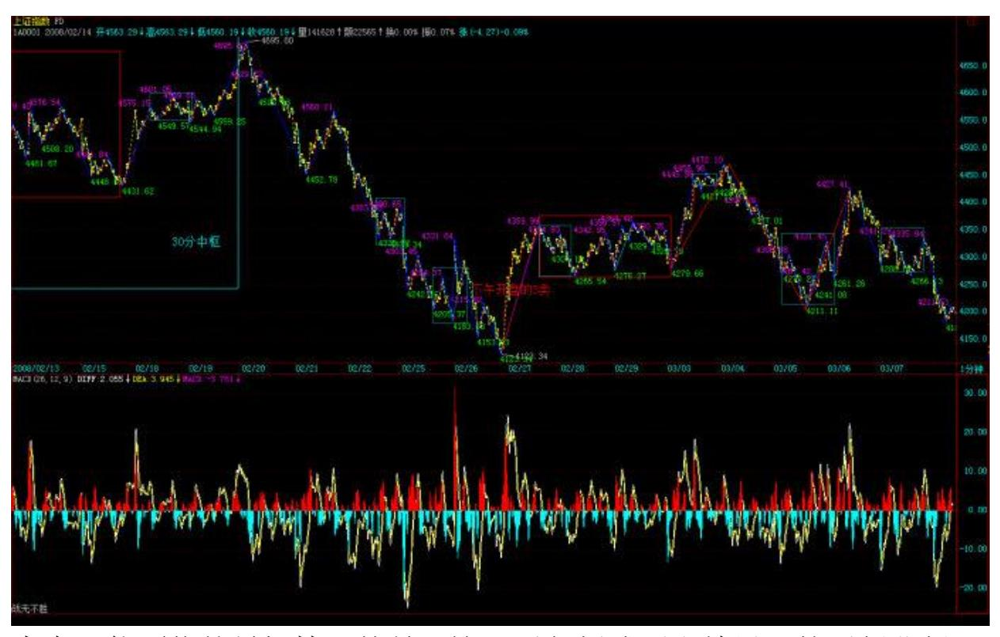
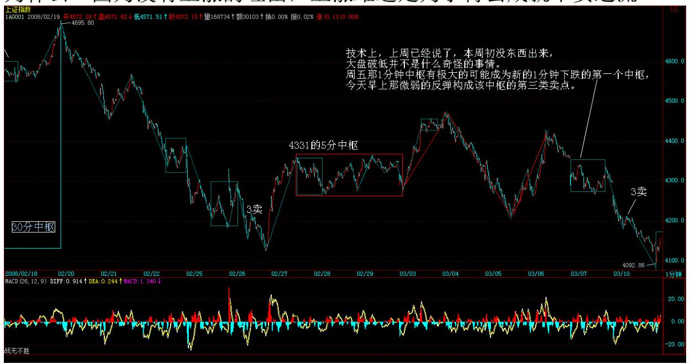
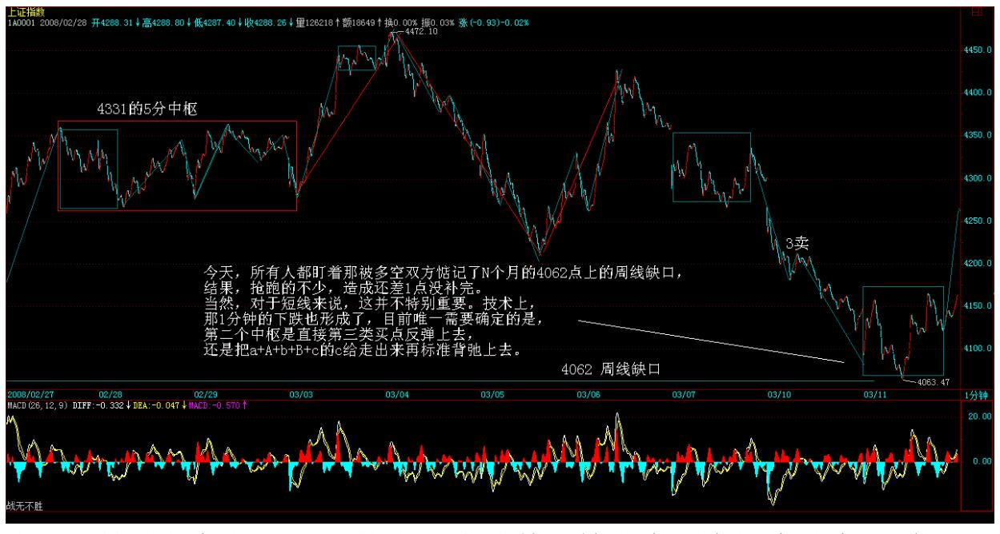
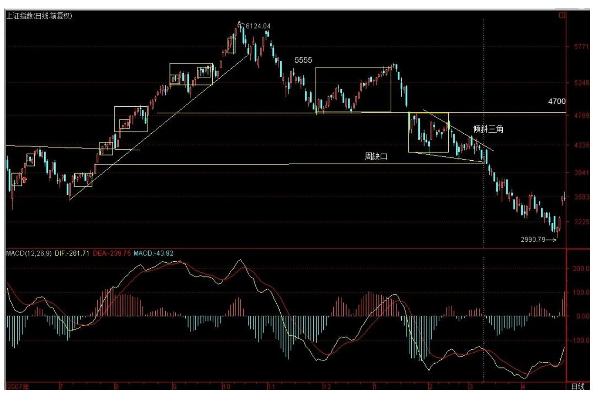
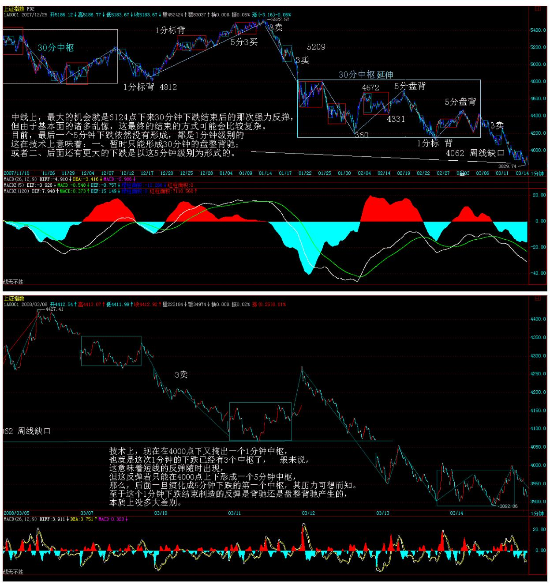
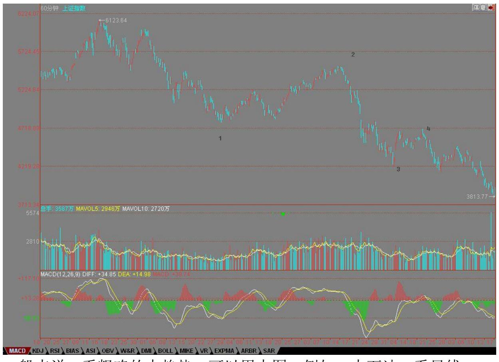
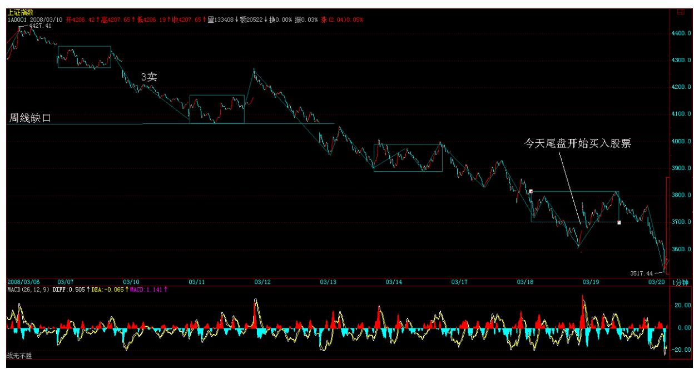
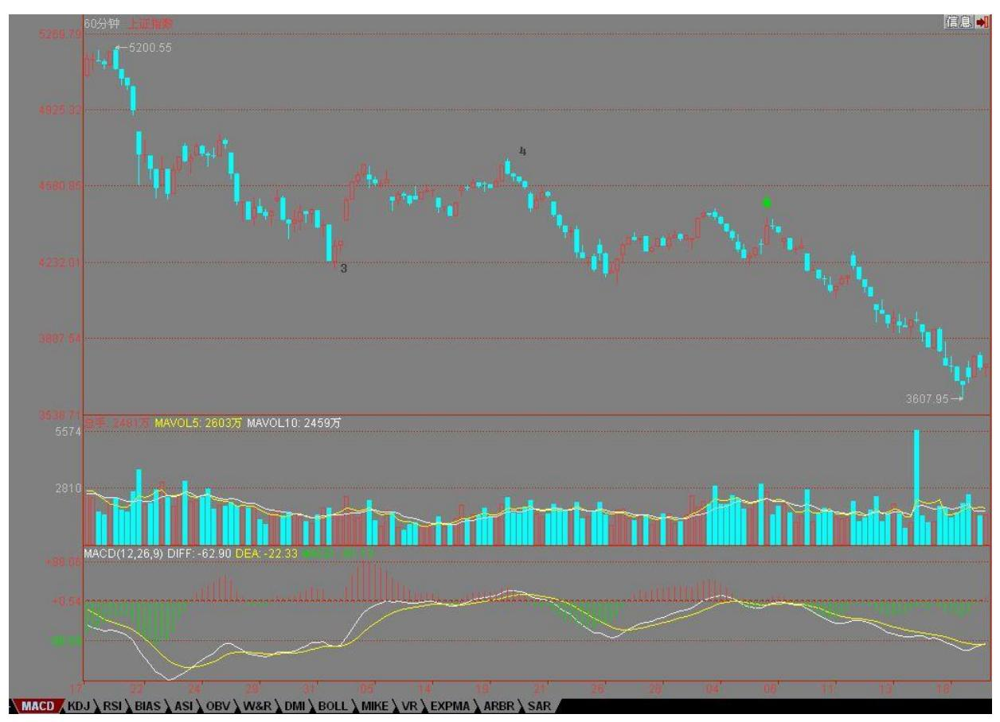
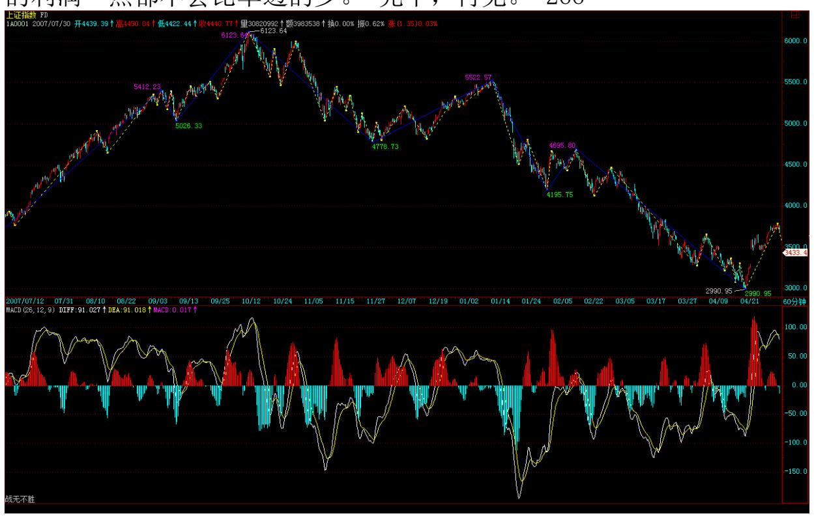

# 教你炒股票102:再说走势必完美

(2008-03-06 16:10:18) 如果是单纯地唯一分解,并不能显示本ID 理 论真正厉害之处,因为走势必完美对应的是一种最特殊、最强有力的 唯一分解,这看似毫无规律的市场走势竟然有这样完美的整体结构, 这才是最牛的地方。 最完美的系统,肯定是自然数了,为什么?因为 自然数具有诸多的唯一分解方式,例如素数的分解,但还有一种最牛 的分解,就是对于幂级数的唯一分解,因为有这种分解,所以自然数 有记数法。例如,2 的幂级数对应的唯一分解就是 2 进位,而10 的 就是 10 进位。如果没有这种分解,我们就不能用记数法记录自然数 了。 正因为这分解如此有力,所以我们都会觉得很平常,似乎自然数 有记数法是天经地义的,其实,这才是自然数整体结构中最牛的地 方。而一般的数系,一般是没有这种性质的。 同样,本 ID 的理论给 出的递归函数,完美地给出市场走势一个类似记数法一样的唯一分 解,也就是说,本 ID 揭示了看似毫无规律的市场走势竟然有着和自 然数有着类似的整体结构,完全超越一般的想象,这才是真正最牛的 地方。 正因为本 ID 的理论揭示了看似毫无规律的市场走势有如此完 美的整体规律,所以才有了其后一系列的操作可能。这才是走势必完 美真正关键的地方。 因此,级别在本 ID 理论中就极端关键了。为什 么?因为本 ID 的递归函数是有级别的,是级别依次升大的。所以, 搞不明白级别,根本就不明白本 ID 的理论。 那么,这样一个整体结 构有什么厉害的结论呢?这可以推演的东西太多了,随便说一个,就 是区间套方法的应用。如果市场走势没有本 ID 所揭示的整体结构, 那么区间套是不会存在,也就是没有操作意义的。因此,区间套的方 法,就是走势必完美的一个重要的应用。有了区间套,买卖点的精确 定位才有可能,也就是说走势必完美的存在导致了买卖点可以精确定 位,这显然是操作中最牛的一种方式了。 从 1 分钟一直到年,对应 着 8 个级别,其实,这些级别的名字是可以随意取的,只是这样比较 符合习惯。否则说级别 1、2 的,容易搞不清楚。

 
239当然,加上线段与笔,可以有更精细的分 解,但一般来说没这必要。

任何走势,都可以在这些级别构成的分解中唯一地表达。但一般来 说,对于一般的操作,没必要所有分解都搞到年、季、月这么大的级 别,因为这些级别,一般几年都不变一下。你看,从 6124 点下来,N 个月了,还在 30 分钟级别里混,所以,一般来说,1、5、30 分钟三 个级别的分解,就足以应付所有的走势。当然,对于大点的资金,可 以考虑加上日级别的。 也就是说,任何走势,都可以唯一地表示为 a1A1+a5A5+a30A30 的形式(娇注:a-连接段 A-中枢)。而级别的存 在,一个必然的结论就是,任何高级别的改变都必须先从低级别开 始。例如,绝对不可能出现 5 分钟从下跌转折为上涨,而 1 分钟还 在下跌段中。有了这样一个最良好的结构,那么,关于走势操作的完 全分类就成为可能。 完全分类,其实是一个超强的实质性质。学点现 代数学就知道,绝大多数系统并不一定存在完全分类的可能,而要研 究一个系统,最关键的是找到某种方式实现完全分类,说得专业点, 就是具备某种等价关系。 而由于走势必完美,所以走势就是可以完全 分类的,而所有的分类,都有明确的界限,这样,任何的走势都成为 可控的。这种可控并不需要任何人的预测或干预,而是当下直接地显 现的,你只需要根据这当下的显示,根据自己的操作原则操作就可 以。 注意,完全分类是级别性的,是有明确点位界限的。而不是粗糙 的上下平的无聊概念。也就是说,本 ID 的理论完全是数量化的,因 此而就是精确化的,里面不存在任何含糊的地方。 所以,明白上面这 些,这样就有了一个大概的框架,而不至于迷失于理论中了。

夜郎自大的中国大机构 (2008-03-10 16:21:13) 本来想写课程,不过 还是先写写这个。 中国的大机构,在 N 年还是很蔫的。但因为出身 正,几年光阴,现在都牛得不得了了。世界也 500 强了不少,个个鼻 孔都插上了大葱。 有那样的环境、那样的资源,任何一个只长了一边 脑子的,都可以干出这样的成就。但这些机构开始膨胀,插上大葱就 满世界晃悠去了。 结果怎么样了?世界期货市场上,最喜欢看到的是 谁?当然是中国的大机构们。大家都开心地等着,看,那送钱的又来 了;世界的股权市场上,现在最喜欢看到的是谁?当然是中国的大机 构们,看,那烧钱的又来了。 真是很难想起,这些大机构们,在世界 金融市场上什么时候干过一件让人觉得是人干的事情?一个律师就可 以在全世界最大之一的公司中坐阵中军,请问,这位先生,在联办的 时候,在后面一系列的资本市场活动中,除了夸夸其谈,有实际操作 过任何一个大的市场活动吗? 这市场是干出来的,不是谈出来的,更 不是读出来的。 本 ID早给这些机构一个最好的定位,就是继续窝里 横,别出来丢人现眼了,他们无论从人才到结构,都完全是一个可笑 的闹剧。 所以,本ID 一直鼓吹,要把中国的窝给做大,让肉烂也烂 在自己锅里,就是本ID 对这些机构的水平一点信心都没有,去当炮 灰,还不如当缩头乌龟。只要乌龟窝够大,成为世界第一大,让全世 界的非乌龟都只能往这跑,那缩头乌龟也能成忍者神龟。 可惜,我们

的机构们牛惯了,他们竟然还想圈国内的钱去玩他们的全球化游戏。 本 ID 可以断言,去一个死一个。在金融领域,可不是单纯的低级制 造业。用中国人民的血汗去让他们自己去爽,去一时炫耀他们所谓的 成就,可能吗? 本ID 一直旗帜鲜明地反对一切企图把中国的资金往 外搞的行为,从那什么无聊直通车到什么搞笑 QDII。事实证明,直通 车已经成了闹剧,QDII 已经成了悲剧,难道我们还希望我们的大机构 继续胡闹下去吗?你们向上爬的水平当然是有的,但你们在国际市场 运做资本的水平,不是插上大葱就好使的。这就是中国大机构的现实 状况,别插了大葱满世界晃悠了,回圈里去吧。

让人无话可说的管理层(2008-03-11 16:23:53) 有了昨天的帖子,按 照本 ID 的性格,一定要去究底穷源的。今天,我们就用最理性的分 析,来说说这让人无话可说的管理层 2007 年以来的表现。 显然, 2007 年后的市场表现,完全超越了管理层的想象力,因为他们根本就 没有深刻理解这轮所谓流动性过剩制造的大行情的历史性意义。 本 ID 肯定是最早也是极少数坚决反对有所谓流动性过剩的人,因为,所 谓的流动性过剩,不过是针对相应的池子说的。如果你只是一个夜 壶,一头猪就可以让你流动性过剩;而如果你是太平洋,又何来流动 性过剩? 请问,中国,一个要成为世界最强大资本大国的国家、一个 要成为世界经济领导者的国家,难道只有一个夜壶大小的池子对面对 所谓的流动性过剩吗?难道不应该把我们池子变成太平洋去吸纳全世 界的资金吗? 问题是,我们的管理层有没有把中国的池子变成太平洋 的远见和具体的策略。而事实上,面对所谓的流动性过剩,我们的管 理层采取了一种最没前途,最没技术含量、最可笑的方式。那连续的 加息、调准备金等等,成了一个毫无技术含量的世纪大笑话。 而管理 层所有金融手段换来的结果却是,不但投机潮没有被阻止,不想见到 的通胀反而不请自来。

更可笑的是,作为管理层重要智囊的某著名经济雪茄,曾不无得意地 把他的设计公开,说只要与美国保持多少的息差,人民币升值的速度 再保持多少,那就如何如何美好新世界了。而不到两年,事实就如此 残酷地摆在面前,那息差鬼使神差地从巨大的正变成负的,而且有继 续扩大的趋势。他们一相情愿设计的玩意,被国际金融残酷现实彻底 给玩意了。 请问管理层,为什么有时间搞这些可笑的玩意,却没有时 间去真正把我们的池子做大? 对付资产价格的过快增长,一个最简单 的办法就是增加供应量,这是用脚趾甲都能想明白的道理。而我们的 管理层,从 530 的半夜鸡叫到直通车的闹剧,百般折腾,结果还是没 压制住这上涨狂潮,为什么?因为方法根本不对路。而这些无聊招数

不仅无效,而且有害。例如,印花税闹剧只维持了几天,最终大盘又 从 4300 点到了 6100 点,使得 530 成了一个有着巨大心理破坏却完 全无用的闹剧。 至于 530 的决策过程,更是一个悲剧。但更可悲的 是,现在讨论重新把印花税减下来时,却开始大走所谓法律途径,又 提案又如何的。请问,530 有必要的法律程序吗?难道有法律规定, 加税可以一人拍脑袋就决定,而减税就需要层层通过走程序?在任何 国家,关于税收的调整都是最重要的民生问题,都必须得到立法机关 等等程序才能得以实施,而530 我们得到的是什么? 不用讳言,530 永远是中国资本市场发展历史中耻辱的一页。 基本温饱住行等当然是 重要的民生问题,但如果中国的民生问题的水平就停在这阶段,那是 历史的悲剧。必须正视的是,民生问题也是有层次的,更高层次的民 生问题,站在历史的角度,更为重要。而我们现在的所谓低级水平的 民生问题,归根结底,是在补课。 但在任何国家,最重要的民生问 题,归根结底,就是经济的稳定增长。一个经济出现问题的国家,任 何的民生问题都是废话。

经济发展,才是最重要的民生。 本来,我们有了一个强烈的势,一个 强大资金流与信心流制造的趋势,让我们得以快速解决大量的问题。

但,我们的管理层并没有驾御这个趋势,而是用了一个相反的错误策 略,去扼杀了这个难得的趋势,那些本该解决的问题,一个也没解 决,却因此留下了更可怕的问题。 这就是管理层 2007 年的成绩单。

最可笑的是,用脚趾甲都应该知道,现货没搞好,期货根本没有基 础。而我们的管理层,一方面被市场的趋势搞得方寸大乱(想想那些 直通车、QDII、530等痉挛式的决策),另一方面又超英赶美式地大力 推进所谓的期货,这世界的可笑,大概最高程度也就是如此了。 无 疑,我们错过了一次轻松解决大问题的机会,因此,我们必须为此付 出代价。 但更重要的是,我们现在面临一个更严重的问题。如果说, 2007 年,我们在虚拟经济层面上错失了点什么,并不至于有太大的影 响,那么,这个抉择,在2008 年将出现在实体经济的层面。 一旦在 实体层面出现错误的抉择,后果是什么,本 ID 都不想多说了。 说实 话,本 ID 一定信心都没有,本 ID 希望自己错了,但事实从来都证 明,在经济问题上,本 ID 错的机会很少。对管理层,本 ID 无话可 说。 我们需要怎样的管理层(2008-03-12 16:25:29) 首先,现在讨论 这些问题,并不是本 ID 的个人问题,而是现在的问题,将严重威胁 我们的大局,而这个大局,是全体中国人的。 至于本 ID 的投资情 况,其实,这早就说过。6100点前后,本 ID 就把相当比例的资金调

出去作 PE 去了,这也是公开的秘密了。至于现在市场上的,操作的 思路也说过 N 次,就是来回在不同板块中折腾。不过,本 ID 从春节 后,把每次折腾多出来的资金已经逐步转出,准备创业板去了。现 在,就是不增加筹码的折腾活动,因为,本 ID 觉得现在的主板,也 就只有这个价值了。 今天,我们不妨都抛开自己的投资状况,冷静的 思考一下这样一个问题,这个问题和你目前投资是否顺利毫无关系, 这是一个长期的、全局性的问题。 我们是纳税人,我们当然有权力让 管理层具有我们所认为应当具备的水平。我们每年交的税收,给社会 做了足够的贡献,对于我们来说,绝对不存在逃税的问题,我们养活 了整个行业,我们当然有这样的权力。 管理层,至少应该具备这样的 一些素质: 一、真正参与过市场 我们现在的管理层,基本就是从银 行系统出来的,这些人根本就不了解市场本身的一些具体问题,而在 办公室里,是折腾不出与市场实际相适应的政策的。否则,挖地、卖 大饼的都可以管理一把,那不成了大笑话了? 二、有真正的宏观视野 如果你不真正理解资本市场在市场经济体系里的核心地位,你当然就 不可能给市场制定相应的高度的战略,而没有高度的战略,只会成为 市场玩弄的对象。

三、具有比市场各方更高的智慧 市场是合力的结果,而一个管理层, 如果其智慧还低于市场各方的水平,那么,他们的所有举动,都只能 成为市场的阻力。没有真正高于市场的智慧,就没资格管理市场。 四、用管理调控来反映国家的经济意志 资本市场是经济的核心,而国 家的经济意志,应该站在全局的、总的国家战略的高度通过资本市场 得以体现,这是对管理层一个最基本的要求。 上面四条,只是随手所 写,各位可以补充,这毕竟是全中国人的事情,和多空无关,和单纯 个人利益无关,只与苹果相关。 我们需要怎样的投资者(2008-03-13 16:18:46) 显然,注定绝大多数投资者都是被市场愚弄的。而所有被 愚弄的,都是陷在市场中,被自己所迷糊。这些人,所有的行为都被 分类为多空两种形式,当自己拿着股票时,思维就被多头所控制,反 之,就是空头的奴隶。 而市场的情绪,就是由此而积聚、被引导。脱 离不了这种状态的,永远成了不真正的市场参与者。

市场,至少分为两个层面。用一个比喻,一个是锅的层面,一个是肉 的层面。而大多数的人,就是停留在肉的层面被市场之锅所熬煎。 本 ID 这几天一直写市场的文章,很多人就是站在肉的层面去理解的,而 本 ID 却是站在锅的层面去写的。本 ID 所写,只是要去保护并重塑 这市场之锅,因为肉可以烂,但锅不可以,否则将是致命的。 这种致 命,不是说将让谁亏多少钱,这关系着国家的前途,这和肉的多空毫

无关系。而绝大多数人那种屁股决定脑袋的思维,也决定了他们不可 能有具有高度的视野。 站在本 ID 的角度,只有相关于锅的事情才值 得本 ID 去留意,至于肉的层面,本 ID 的理论给出了最好的操作程 序,按照操作就是了,没什么可说的。

当然,只有你自由于肉的层面,才会有心情去关系锅的事情。本 ID 当然不讳言,对于本 ID 这种资金来说,锅是最重要的,只要锅在, 那肉还不是随意去玩弄的对象。 因此,对于一般的投资者来,首先要 从肉的层次上自由,要你去肉别人,而不是相反。但这还不够,应该 培养更高的视野,没有大的视野,最终还是被别人所肉。 而这道理, 同样相关于国家的层面、全球战略的层面。美国为什么牛了几十年, 因为他们有一口锅,全世界用了几十年,而不打破这锅,任何国家不 管怎么搞,都是美国人锅里的肉,这才是最为重要的。 我们要用一切 的努力,造一个中国资本市场的大锅,这也是本 ID 写这些文章的出 发点;更重要的是,我们更要造一个中国式全球化的大锅,这是更高 层次的,也是中华复兴的关键。 平安应停牌以维护市场稳定 (2008- 03-07 15:12:32) 平安的一天闹剧被揭穿后马上露出本来面目,像平 安如此大的动作,而且平安自身又深度介入二级市场,无论如何,在 其增发有管理层的最终结论前,都应该停牌。否则,像现在一样,一 个股票完全影响市场的走势,对市场的稳定是极大的伤害。 今天的大 盘,勉强继续保持原来4331 上下 5 分钟的震荡,但所有股票都有了 疲态,股票这东西都要有点连贯性的,经常被一些无聊的突发性事情 干扰,那就不仅仅是审美疲劳的问题了。 如果反复冲击 4391 点(日 底分上沿)都不能站稳,每次刚上去就出些妖蛾子,那么,大盘再次 探底就成了必然的选择。现在,给大盘的时间不多了,如果下周初还 没有起色,那么再下探甚至破底都不是什么奇怪的事情,毕竟现在离 4123 点(日底分的底)也就一步之遥。 当然,无论大盘怎么走,暂 时都可以看成是原来那大的 30 分钟的震荡。中线上,一个很切实的 问题就是,如果两会开过后还没有什么上去的动力从基本面角度给 出,那么,一次狠跌的过程砸出大的空头陷阱可能就是一个很正常的 选择了。 246

大盘可能面临的最坏情况就是,这里反复折腾不出结果,然后创业版 出来,热钱都跑过去,这里变成一座围城,无聊地在几百点的空间上 耗上 N 个月甚至一年。这种情况并不是不可想象的。 当然,现在给 多头的时间还有,多头还有反击的机会,就算创新底,也不是世界末 日。现在的问题是,如果一些根本性的问题不解决,就算盘住了,那 么上涨的理由呢?难道上涨就为了给平安之流去表演?上涨的空间如 何打开,这需要基本面的支持,而这基本面现在又在哪里? 周末,不 说股票了。先下,再见。

紧跟平安将破罐破摔进行到底 (2008-03-10 15:15:31) 现在最大的问 题是什么,用脚指头都能想明白。但管理层那已经成为滑稽表演的基 金新发依然如故。那么,大盘也只好紧跟平安将破罐破摔进行到底 了,没有比今天创新底更能配合管理层基金连发的滑稽与幽默了。 管 理层大概认为,只要他们批准了,那些基民(一个比股民还恶心的名 字,让人想起饥民)就会如饥似渴地抢光他们的施舍。但现实是什 么?一个过于滑稽的举动,只能让人远离,连唾弃的兴趣都没有。 市 场是最现实的,有行情,有上涨理由,资金不请自到,否则,自己画 饼自己玩去吧。本 ID 已经多次说明,就算现在减印花税,也没用。

为什么?因为没有上涨的理由,上涨难道是为了再去成就平安之流?

在这如此影响市场的最基本融资规范没有解决前,管理层如此地反 应,确实只能让市场寒心。现在市场需要的是明确的法规,一个明确 的预期,否则,所有的上涨都不过是短促的反弹,不能构成真正的行 情。 技术上,上周已经说了,本周初没东西出来,大盘破低并不是什 么奇怪的事情。周五那 1 分钟中枢有极大的可能成为新的 1 分钟下 跌的第一个中枢,今天早上那微弱的反弹构成该中枢的第三类卖点。

当然,由于资金大量从大盘股抽离,让那些自以为是的大盘股自己牛 去,自己圈钱自己玩去,因此,反而成就了中小盘题材股行情的延 伸,这中小盘股至少胃口没那么大,而且也更好在各层面上控制。大 盘下跌,不过给这些股票一个洗盘或打压吸纳的机会。

鉴于目前这么滑稽的氛围,资金只能以更大的投机去获取更大的利 润。大盘股的圈钱投机竟然如此堂而皇之,那么,大中小资金也可以 这么玩,选择各自适合的投机品种,让市场继续分裂,让题材投机的 风暴来得更猛烈,这只能是还想在场里折腾的资金唯一的选择。 今 天,大跌,认购权证一反常态地暗潮涌动,就是这种新的投机行为一 个很好的序幕。而今天,又有不少中低价股开始有新资金注入,借指 数跌而潜伏进入,本来就是很正常的事情。 一句话,让投机来得更猛 烈些。这种游戏当然不适合所有

人,没这种投机细胞的,就小板凳看着,等基本面有根本改变再说。

有的,当然睁大眼睛,发现一切可投机的机会,选择最适合自己的去 投机,劫一票换一地。资金需要收益,资金很饿,总不能一季度没完 就不干活吧。 请明白一个最简单的道理,现在那些所谓的黄金股、绩 优股、高价股,不过也是从垃圾股的垃圾价起来的,上去了就摆阔圈 钱?那就让他们都死去吧。能制造你们,难道就不能从现在的垃圾里 搞出黄金来? 题材都是人造的,股票都是人炒的。没人,什么都白 搭;有人,有什么不能创造? 先下,再见。 回补周线缺口引发反弹 (2008-03-11 15:22:15) 今天,所有人都盯着那被多空双方惦记了 N 个月的 4062 点上的周线缺口,结果,抢跑的不少,造成还差 1 点没 补完。当然,对于短线来说,这并不特别重要。技术上,那 1 分钟的 下跌也形成了,目前唯一需要确定的是,第二个中枢是直接第三类买 点反弹上去,还是把 a+A+b+B+c 的 c 给走出来再标准背弛上去。

前面,已经有两个类似的底点,今天的底点,基本在前面两个底点的 连线上。现在,大盘有初步的倾斜三角形的形态出现,但关键是这两 个底点连线不能被破掉。

由于这次下跌只是 1 分钟级别的,对于原来的 30 分钟震荡并不能制 造真正的破坏,所以,站在6124 点下来的 30 分钟下跌角度,真正的 背驰并没有出现。当然,盘整背驰也可以制造底点,然后再第三类买 点地直接上去,但这需要后面的确认,在确认之前,震荡的格局是不 会变的,也就是说,一旦上冲无力,唯一正确的选择,就是把今天抄 底进入的退出。 后面,最坏的情况,当然就是反弹后形成 5 分钟下 跌的第一个中枢(注:指4427 开始的下跌),然后继续跌破前两个底 点的连线,最后去形成真正的 30分钟背驰。(当然,如果美国 1987 年那种极端情况,背驰是不会有的。) 最好的,就是继续 30 分钟的 震荡。因此,对短线走势的大体格局,应该有一个清醒的技术把握。 个股方面,你看,一反弹,冲在前面的基本都是 10 元上下的所谓垃 圾股票,以及前期强势的板块:创投、农业、军工、消耗品等等。所 以,市场的资金分布格局并没有变化,这种情况要维持相当时间。 今 天的消息面,其实并不好。特别是某副主席,十分不地道地说什么股 市不是谁都能来的。这话,在目前这时候说合适吗?对那些已经来了 并受到伤害的人,难道不是风凉话吗?这种话,难道应该出自管理层

之口? 所以,现在的大盘并不缺乏反弹、震荡,但真正的上涨理由在 哪里?管理层首先都不给一个表率,市场能有信心吗? 更重要的一 点,一定要知道,这市场不能靠任何人,包括管理层,一定只能靠自 己的技术和心态,你足够强,谁都打倒不了你。 本 ID 最讨厌那些哀 求管理层救市的言论,你爱救不救,我们不是你的犯人和奴仆,你们 的工资还是我们的税收所支付的,你没教养,对市场真正的主人出言 不逊,那只能证明管理层里的人员素质并没有达到我们的税收所供养 所应该达到的水平。 有人当官老爷当惯,证监会的人,首先好好去学 习,什么叫为民型政府,想想你们这个部门离这个要求有多远。别以 为你们是谁,上帝式地施舍全国 N 亿的投资者,你们配吗? 市场搞 不好,谁该给纳税人负责,这才是真正的问题所在!先下,再见。

美国救市救不了中国股市(2008-03-12 15:20:52) 美国救市,大盘自 作多情地大幅高开,结果不仅被彻底打回原形,还再次挑战新低,一 日闹剧就此结束。 本 ID已经多次反复说了,这次下跌的根源在于恶 性圈钱问题。5500 点,平安圈钱的消息小范围泄露后回头,5200 点,该消息证实,然后开始大幅度破位下跌。在平安消息出来前,外 围市场一直走得不好,结果中国市场根本没搭理,自己走自己的。而 最终让市场转头的,就是这个恶性圈钱。 为什么?因为这恶性圈钱对 参与其中的资金是致命的,炒上去,然后圈钱就来,这样谁还会出 力。然后,市场资金不断从大盘股出逃,部分直接撤走,部分留下 的,就围绕中低价股票进行,这样,至少可以对圈钱有一定的控制。 而要解决这个问题,药方本 ID一早就给出,就是一个明确的关于再融 资的规定,让市场有一个明确的预期。可惜,我们的管理层一直不作 为,而这种不作为给市场信心有着巨大的打击。 现在的问题已经不单 单是恶性圈钱的问题了,而是一个对管理层的信心问题。 本 ID 前面 已经把最恶劣的情况说了,就是如果在创业板出来前还没有让市场信 心恢复的举动,那么,大量资金将出逃到创业板去,至少那里没有恶 性圈钱的短线担忧,而目前的主板,将成为一座死城。 现在,一个短 线的问题立刻摆在面前,就是,那些对两会还有期待的资金,一旦在 会议结束后没得到他们所需要的东西,是否会再次杀跌出来。而平安 的问题,依然如同一个定时炸弹随时引爆。 而对于中线来说,最大的 问题已经反复说过,就是,谁给我们一个上涨的理由?恶性圈钱的问 题没有一定确定的说法,没人会顶着炸弹往上冲的。 如果管理层有 530 时 1%的效率,这个如此简单的问题早就解决了。从 1 月拖到现 在 3 月,指数下跌 1000 多点,请问,都干什么去了?自然的调整并 不可怕,可怕的是这种完全因为人为不作为造成的市场信心的丧失。

至于技术上,昨天已经说得很清楚。今天的走势,并没有脱离昨天的 那 1 分钟中枢,而这中枢后,是走 1 分钟的 c 段,然后构成 5 分 钟中枢,还是直接就扩展成 5分钟中枢,没有任何实质差异。 最大的 问题就在于,如果这 5 分钟中枢是一个 5 分钟下跌的第一个中枢, 后面面临的短线压力就极为巨大了。 当然,这是最坏的情况(娇注: 实际走势为更坏类型。一分趋势一直延伸出 4 个 1 分中枢)。而是 否如此,让市场自己去选择。

先下,再见。 信心危机引发多杀多 (2008-03-13 15:18:28) 反复强 调,现在已经是信心问题。信心危机下,今天引发多杀多,4000 点成 了纸糊的。不过,下午关于 3G 的利好引发联通快速上涨冲击涨停, 使得大盘不至于收得过分难看。 当然,这多杀多走势一旦出现,意味 着短线的底部将逐步来临。不出现多杀多,底部是不会出现的,市场 就是这么残酷。每一轮行情,甚至是反弹,都需要一些断胳膊断腿来 垫背。 但是,现在的基本面极为微妙:一、平安的事情没有结果,这 是一个大地雷;二、两会结束没有特别的东西,将引发新的信心动 摇;三、管理层以及经济面的现状,使得大资金不敢真正介入。 所 以,短线反弹会有的,中线真正的企稳,还需要诸多的配合。 现在, 也有些股票有新资金介入,例如那些新股,离发行价不远的,都有新 资金开始关照;此外,3G 题材能否成为新的热点,这对大盘短线有一 定意义。 操作上,还是那个原则,进入后一看上冲困难就要坚决退 出,不能恋战。至于没这技术的,本 ID 一直给出一个最好的选择, 就是小板凳。 中线上,技术上最大的机会就是 6124 点下来 30 分钟 下跌结束后的那次强力反弹,但由于基本面的诸多乱像,这最终的结 束的方式可能会比较复杂。目前,255

最后一个 5 分钟下跌依然没有形成,都是 1 分钟级别的。这在技术 上意味着:一、暂时只能形成 30分钟的盘整背驰;或者二、后面还有 更大的下跌是以这5 分钟级别为形式的。至于哪种情况,让市场自己 去选择。

下周,两会结束,这又是一个考验信心的时刻。如果没有什么特别的 消息,那么,那些还傻忽忽希望两会有点什么的人,又要信心动摇 了。现在,一个很大的问题,如果市场格局还是这样,那么每次反弹 只会让信心丧失者不断出逃。 现在,可能这个问题才是最关键的:请 给一个留下来的理由。这才是管理层应该干的事情,不要画饼,我们 需要的是干货。 周末了,股票就一边去吧。春天来了,天地如此广 阔,就没必要还为股票把周末的时间也耗费了。 先下,再见。 多杀 多蔓延加速短期底部来临 (2008-03-17 15:17:29) 画饼救不了市场信 心,同样拉中石油粉饰也不行,这顺理成章地导致多杀多的蔓延,不 过,这反而导致短期底部的加速来临。 今天,如前期所说,那些对会 议还有冀望的人终于也杀出来了,当然,现在还缺一些死多头去献出 胳膊和腿,没有这些胳膊和腿,大盘的反弹是不会有力度的。 现在, 就纯粹探讨技术上的问题,不说那些已经反复说过的东西。看看下面 6124 点下来的 60 分钟图,大的走势就一目了然。这次下来,目前只 走了 4 个线段,连一个1 分钟的中枢都没形成,注意,这是 60 分钟 图上的 1 分钟中枢。

显然,一个标准的跌法,就是这第 5 线段中,有 1 笔对 3 进行反 抽,形成一个类的第三类卖点,然后再破底,一旦当下满足区间套, 那么真正的底部就可以精确定位。 不过,现在这对 3 的反抽笔还没 有出现。因此,下面的反弹的性质,就是对 3 的反抽,如果形成类第 三类卖点,那么是最好的;如果又上去了,那么证明3、4 这个类中枢 的震荡依旧,后面还要折腾。 所以,我们说的短线反弹在技术上是超 级明确的。各位看,4 的位置对应的 MACD 刚好在 0 轴,也就是被这 压住上不去,然后再次破位,这是很标准的走势。

一般来说,看粗略的大趋势,可以用大图,例如,中石油,看日线 图,48 下来连一个线段都没走完。现在,很有机会走这线段的第 4 笔。 所以,对这个反弹,我们就有了一个很明确的把握了,具体的, 可以针对具体个股去操作。不过这反弹点的更具体的定位,必须结合 小图来继续寻找,大图只是给一个大概的轮廓。 明天的新闻发布会很 可能是引起震荡的一个时间,如果其间没有什么值得关注的东西,震 荡后继续会有新一批人杀出,等这批人也杀出来了,这盘就有点意思 了。 现在,市场需要的是更多的断胳膊断腿,即使基本面不会有任何 东西,也可以技术地折腾一把,但要技术地折腾,那就还需要更多的 断胳膊断腿。 再说得明确点,如果基本面没有干货,那么反弹都只能 是技术性的,这需要更充分的杀跌才有反弹的空间;所以,现在的市 场选择前提很明确,就是有干货还是没干货。 先下,再见。

今天尾盘开始买入股票 (2008-03-18 15:16:32) 很多人好象很想知道 本 ID 的操作,今天可以公开宣告,今天尾盘,本 ID 开始买入股 票。 每天的走势,其实本 ID 都描述得很清楚,例如昨天已经说得很 清楚,今天将有对记者会绝望的再杀出来,而记者会其间是一个震 荡,这都在今天的走势中很明确的反应了,看看记者会后那杀跌,难 道不是吗? 本ID 就等这批人杀出来了,这批人杀出来后,所有有幻 想的人都幻想破灭了,这时候,如昨天所说,这大盘就开始有意思 了。 所以,本 ID今天尾盘开始买入、回补第一批股票。(注:实际走 势禅师这里买股基本无获利可能,最好的状况是平出) 但,这个杀跌 过程,很有可能会演化出极端非理性的情况,所以,资金大的,可以 用分批建仓,震荡操作的方法。也就是,有足够的底仓后,保持这部 分仓位不动,其他资金震荡操作,把建仓成本降低下来。 对于小资 金,你可以根据技术图表找到更精确的买点。但大资金是做不到的, 而现在,对于大资金来说,从今天尾盘最低点开始建仓,已经可以 了。 本 ID 多次说过,今年到处是井,井可能是坟墓,也可能是机 会,关键看你的水平,这次这井操作好了,收益少不了。本 ID 更反 复说了,今年的操作是体力活,必须来回折腾,那种死拿股票的人等 单边上涨的就等着去死吧。难道不知道本 ID 去年底就告诉你,今年 绝大多数股票都是年阴线或长上影吗? 如果你没来回折腾的本事,本 ID 一早给你最好的归宿,就是小板凳。如果你自以为自己的水平可以 不小板凳,结果给市场戏弄得鼻青脸肿的,那么就好好去学习这成 语:自知之明。 建仓的股票,依然是低价股,而且短期跌幅最好超过 40%的,这是最好的玩弄对象了,好好去寻找。 好了,逐步进入可以

开始干活时间段,有本事的就开始抄家伙,没本事的,就继续小板 凳。 先下,再见。

自知之明 (2008-03-1816:23:40) 每次大跌,都有人被严重摧残甚至 淘汰,这只是市场中最正常的事情,市场不是慈善场所,从来都是铁 血游戏,如果能从中获得点什么,大概也不枉被市场折腾一把。 人, 一定要自知之明。例如,你必须对你自己的性格有足够的把握。有些 性格是绝对不适合在市场中混的,例如,一根筋的、依赖心理的等 等。 市场的特点就是千变万化,你不能要求市场如何,因为市场永远 正确,错的永远是你。

但有些人的性格,就是死不认错,那唯一的归宿就死在市场中了。 我 们可以抨击政策如何如何,但我们不能把自己放在火上边烤边抨击, 本 ID 经常惊讶于某些人的忍耐力,一边天天不断亏损,一边就只会 骂街,这种人,市场从来就没有给他们留下活的空间。 市场上永远有 不合理,如果你为了合理,那就别来市场了。来市场只有一个目的, 就是赚钱,如果不合理能赚钱,那就合理了。 太多正义感的人是不适 合市场的,只有战胜了市场才有正义,失败者从来没有正义可言。 单 边市永远是稀有的,像前两年那种走势,十年都难得一遇。市场归根 结底,以震荡为主,而震荡最终产生的利润,绝对不少于单边,不会 震荡的人,在市场上就少了一种武器,坐电梯是小事,往往就落在井 里上不来了。 所以,对于不会震荡的,那么最好的选择,就是回避, 如果 10 年才会有 1 次单边的机会,那就 10 年玩一次,这难道不可 以,为什么一定要整天在市场里被市场折腾? 没那本事,就远离,事 情本来就是这么简单。可惜人的贪婪蒙蔽了自己,那就种什么得什 么,没什么可同情的。 市场的残酷,并不是为了某个人,这是市场的 本性,如果对此没有深刻认识,那也只有死路一条。

再说句狠话,这次的下跌其实算是温和的,想见狠的吗?如果这次上 去,在 60 分钟上只能构成一个 1 分钟中枢,后面再演化为一个 60 分钟上的 1 分钟下跌,那时候再看什么叫狠吧。 在市场上混,就要 成为钢铁战士,就算国家经济崩溃,1987、1929 年,也能在市场上屹 立,这才有点象样。像现在这些人,动动不动就求救市,那是没见过 苦日子。1929 年的时候,美国连政府都无能为力了,政府都救不了自 己了,那时候,如果你是钢铁战士,一样能屹立下来。 这世界上,没 有一样东西是可以依靠的,即

使那东西叫政府。我们只需要正确的操作方法,用这方法,把自己锻 炼成钢铁战士,除此之外,都是废话。

3775 点决定反弹能否延续 (2008-03-19 15:21:35) 我们现在只是纯 技术性地探讨走势,那么,3775 点能否站稳将决定大盘反弹能否延 续。今天一大早高开后回试是一个次佳的买入机会,为什么?看看 60 分钟图就知道,这刚好构成底分型。而 3775 点,刚好是这底分型的 上边沿。 如果你明白这技术上的问题,那就会很放心地在早上第一小 时回试时买入,很多股票当时还曾砸出比昨天更低的位置,例如 000938,而收盘是涨停的。 这里,必须有一个纠正,图上绿箭头所指 位置其实已经足够构成一笔,而这笔没有回到 4431 点上,刚好构成 类第三类卖点。所以,现在的大盘走势很简单,直接拉回图中 3 的位 置,还是在这里折腾出一个线段来。 由于目前还没有出现明确的区间 套,不能完全确认从 4 下来的这下跌就一定走完,而单纯从 60 分钟 图看,这显然构成了一个背驰段,只是这背驰段没有得到区间套的精 确定位去确认。不过,按通常的情况下,最终回拉图中 3 的位置是必 然的事情,唯一需要选择的,是完美地完成区间套,还是就此直接上 去了。 而这一切,3775 点是一个关键,为什么?因为这决定了早上

第一小时构成的那底分型能否最终延伸为笔,如果笔都不能延伸出 来,那当然需要再探底去完成区间套的完美构造。 个股方面,一反弹 就知道,低价股和题材股依然是最有活力的,这种弹性十足的股性, 具有最好的操作性,要好好珍惜。再说一次,今年是低价与题材的天 下,但一定要知道,没有单边,只有折腾,而折腾,来回短跑,产生 的利润一点都不会比单边的少。 先下,再见。 266

