# 教你炒股票 104:几何结构与能量动力结构 1

(2008-03-2615:47:42) 本 ID 的理论是一个超级完美的理论,第一是 在数学的角度超级完美(娇:市场结构如自然数唯一分解--走势必完美 以及递归函数),其次,是在物理的角度超级完美(娇:几何结构反 应能量动力衰竭转折--盘背驰的判断)。物理角度,以前说的不多, 因为这需要的思维方式,同样要有一个大的改变。 有些工科或老一代 理科的,对现代物理一点概念都没有,以为能量动力,就如同牛顿时 代,用各种微积分或各种级数等等无聊算法就是了。 现代物理的一个 核心概念,就是物理与几何的高度统一。本质上,现代物理就是一门

几何学,只不过是各种不同高深的几何学。而几何学也不是一般认为 的那些几何学,几何的领域,可以涵盖并超越你思维的所有方面。 广 义相对论是第一种真正意义上的现代物理学,而其基础是几何,一种 比较简单的几何学。而后面,到规范场、超弦、膜空间等等,就涉及 各种超越一般人直观的几何了。 在那些几何学里,能量、动力等结构 对应着一些特殊的几何结构。这才是现代物理的主流。 对于一般人来 说,广义相对论可能是最简单的了。那里,物质结构与几何结构是高 度统一的,而诸如引力结构等对应着一些特殊的几何结构,如果有兴 趣,可以找本广义相对论的课程看看,看看这种几何结构的威力。 而 本 ID 的理论,本质上是站在这种现代物理的角度构建自己的能量动 力学结构的。这里,一切都是几何结构说了算,一切的能量动力形 态,都变几何化,因此,必须有这种思维上的根本改变,才会有真正 的理解。否则,还是牛顿时代那种弱智思维,那就将陷入一种机械化 思维的陷阱中。具体怎么样,以后慢慢说来。 ajiao99999:相对论又 称为时空几何动力学,他把引力场归结为物体周围的时空扭曲,把物 体的运动,归结为物体在弯曲时空时沿短程线的自由运动。 这样说抽 象,娇简单比喻下;弯曲的河流,使四维空间扭曲,河流的运动就是 沿扭曲时空的短程线运动。也就是河流的结构造成时空扭曲,扭曲的 时空,教河流如何运动。 广义相对论的核心:引力场方程,是几何动 力学的集中体现。该方程等号的一边是物质系统的能量,动量分布以 及变化情况。另外一边是物质系统所激发的引力场四维空间的扭曲情 况。 ajiao99999:样就很好玩了 ,该等式方程就表示引力场的弯曲 时空结构具有动力学机制。就是物质及其引力场的动力学等同于引力 场时空的非欧几何。 运用到市场,用娇的话说,就是价格的几何结构 蕴含能量。这个几何结构的能量动量分布状态表现在其独特的几何结 构里。 ajiao99999:这个结构中,彼此间角度是非常重要部分。 ajiao999992010-07-02 11:34:50:量、动力等结构对应着一些特殊的 几何结构。这才是现代物理的主流。 ajiao999992010-07-02:论,本 质上是站在这种现代物理的角度构建自己的能量动力学结构的。这 里,一切都是几何结构说了算,一切的能量动力形态,都变几何化。 破发竞赛宣泄市场情绪 (2008-03-27 15:17:41) 今天的走势,昨天已 经说得很清楚了,就是上次580989 从 0.4 下启动时的翻版,那次同 时带动了大盘的破位,这次如出一辙。各位可以对比一下上次的走 势,后面的走势是否继续一样,这是一个很值得关注的问题。 如果走 势继续一样,那么惯性下探后,大盘会再次回到破位前的平台。3424 点的位置,由于有 3%的确认空间,所以目前并不能说这位置就被有效 跌破了。当然,这位置如果跌破,那么,下面真正有效的位置就是

2500 点了。记得当时本 ID把震荡空间定到 2500 点时,有人觉得本 ID 夸张,现在看来,一点都不夸张。 其实,目前的市场情绪已经开 始扭曲,因为管理层的不作为,市场只能以破发竞赛来宣泄情绪,这 其实是极端危险的状况,管理层的信誉,在这样的市场情绪宣泄中走 向破产,以后如何修复,只有天知道了。 市场现在就是以这样的逻辑 来回应管理层的逻辑,管理层不作为让市场的再融资没有规则,那 么,市场就让市场本身的融资彻底破产,如果这局面不被控制,那么 这场闹剧很可能要演化到有新股一开盘就跌破发行价,让市场完全失 去基本功能,一旦这种局面出现,你说 2500 点很奇怪吗? 当然,作 为市场的参与者,都不希望市场各方以这种对抗性的方式进行下去, 这样只能损害市场本身。但球在管理层那里,他们不作为,市场也只 好如此了。 由于市场重心的下移,我们所需要关注的低价股的价格也 需要有所下移。但原则是一样的,就是低价、题材、更重要的是,一 定要来回折腾。 至于破发走势制造的破发板块,从纯投机的角度,将 蕴藏着一定的市场机会,不过这需要的操作水平以及政策敏感度比较 高,没这水平的不一定要关注。 580989,昨天说得很明确,0.7 上下 的短线中枢是关键,今天冲高后马上 30%回头到这中枢,显示的这中 枢的强大威力,同时也证明,这次的上冲只是一个中枢,是一个盘整 类型,后面的波动就看这中枢的第三类买卖点问题了。 注意,580989 是最后一波害人行情,一般人一定要远离。

3424 点初显威力 (2008-03-28 15:12:27) N 周前的再展望,本 ID给 出了这轮下跌最可能的 3424 点的下跌结束位置,6124 点下来的2700 点,3600 的 3/4,而第一次 4778 点,刚好是 3/8,今天这个位置初 步显示其威力。 注意,一个最基本的技术常识,任何技术位置都有一 个上下 3%的允许空间。由于这世界上脑子有水的人太多,所以必须再 说一次。例如,上次从 4778 点开始的反弹,本 ID 说结束的位置在 900 点,3600 的 1/4 处,也就是 5678 点,最后结束的位置

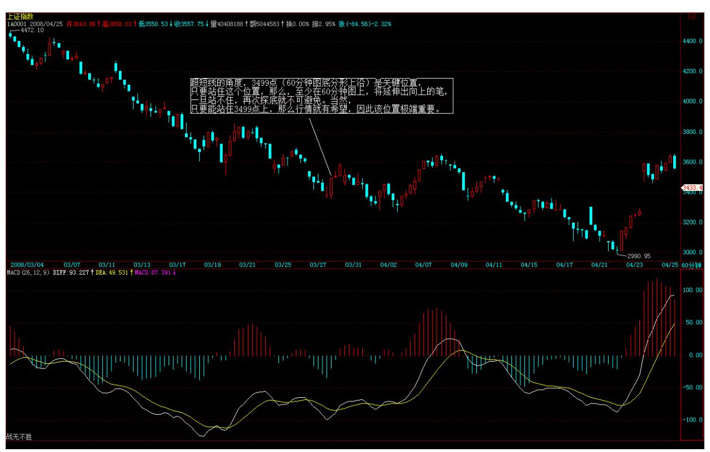

在 5522 点,完全在 5678 点的 3%空间内,但有些人为了没有最终到 5678 点祥林嫂了一个月,这是什么人?自己没常识,蠢还要满大街告 诉所有的人,这世界多的就是这种人。这种人不死,市场哪里还有天 理? 而昨天也说了,和上次 580989 在 0.4 下启动那次一样,引领 大盘破底后,大盘最终又再次回到破底前的平台,今天的走势证明, 这太阳底下,新鲜事并不多。 但一定要更注意的是,由于今天的上扬 甚至不足以在日线上制造一个底分型,而今天上扬受到诸多传闻的引 诱,一旦这些传闻下周没兑现,就不排除又有一个杀跌回试的过程, 因此,3424 点最终能否成为底部,现在根本没有任何最终的结论,必 须采取灵活的策略应付之,而不是脑子里一根筋。 超短线的角度, 3499 点(60 分钟图底分形上沿)是关键位置,一旦站不住,再次探 底就不可避免。当然,只要能站住 3499 点上,那么行情就有希望, 因此该位置极端重要。 超短线可以看下周初,5 分钟 MACD 是否最终 演化为红柱子不能再伸长而比前一柱子面积小的情况,对应着 15 分 钟 MACD 的 0 轴能否被突破,一旦不行,肯292

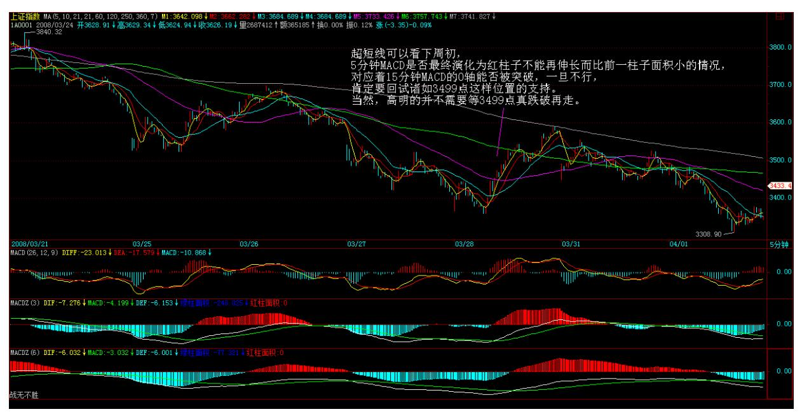

定要回试诸如 3499 点这样位置的支持。当然,高明的并不需要等 3499 点真跌破再走。

对于小资金,原则已经多次说了,就是抓准机会咬一口,一看不能延 续就先跑。这次从 5522 点下来,用这个原则抄了无数次底,都能按 技术把钱赚了又先跑出来,就证明,下跌其实没什么大不了的,关键 你能折腾,折腾好了,下跌一样是天堂。 当然,前面说了,对于大资 金,现在折腾时一定要注意沉淀筹码,大资金和小资金不同,小资金 1 秒钟就可以把仓位建好,大资金可没这本事,因此必须有沉淀筹码 的动作。注意,从5522 点下来,本 ID 直到最近才给出大资金需要沉 淀筹码的要求,为什么?因此以前离底部还远,所以根本不存在沉淀 筹码的问题,而到了目前的位置,就算 3424 点最终不能底部,下面 的也不过是空头陷阱了,对于大资金来说,根本不算什么,所以,现 在开始沉淀筹码,完全对头。周末,股票一边歇去。

3499 点继续决定短线命运 (2008-03-31 15:16:35) 在上周都比较兴 奋时,本 ID 已经明确说,一旦传闻不兑现,又是一轮回试。至于给 出的 3499 点,更成为今天震荡的中心,尾盘最终也没站住。 由于该 位置今天是震荡中心,所以明天如果能站上去,大盘还有点戏,否 则,继续探底就不可避免了。底部不是一天成的,今天显然已经比以 前类似的情况走得稍好一点,显示已经有一点新资金介入并对此位置 有一定的信心,否则,今天将是单边下跌。因此,明天的走势很关 键,如果能回拉上去,证明新资金的信心还是比较足。 但是,多次说

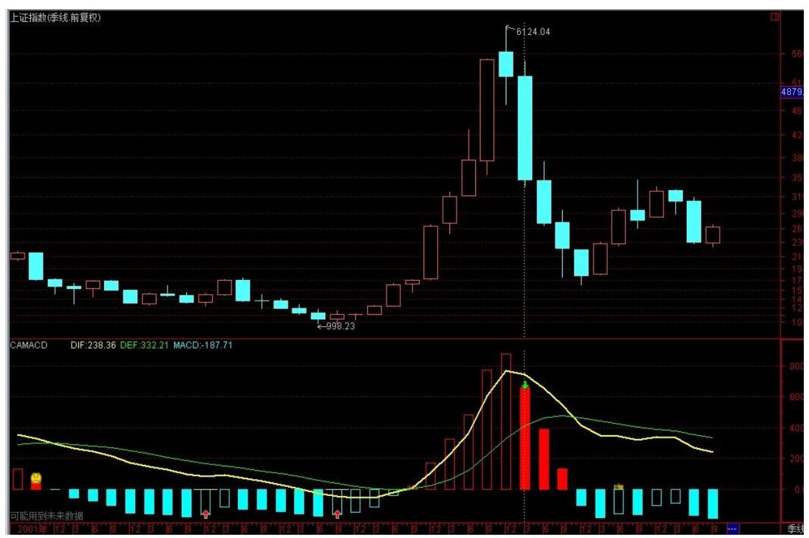

了,现在需要的是干货。没有干货,任何信心都会被磨掉。没有干 货,谁说话都是废话,市场能领情吗?废话说多了,只能显示自己的 无能,这点,有眼睛的人都看得清楚。 其他也没什么可说的,现在就 是等待,今天是月线和季线收盘,有兴趣的自己去看看,中线形势有 多恶劣。这里不起来,季线上就有极大机会形成向下的笔,这意味着 什么,自己想去。现在主管金融的人,其办事风格是十分怪异的,这 点,本 ID 有太多了解了。该来的没来,也只好这样了。 天灾不可 怕,因此,对非系统性风险,要有时刻的提防。对于散户来说,咬一 口就跑,与机会再咬一口,这是最好的策略。先下,再见。

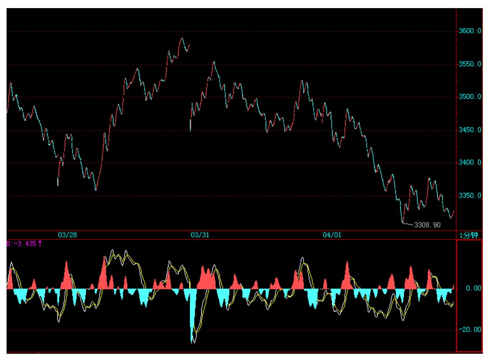

下一个短线机会又将来临 (2008-04-01 15:16:38) 别让本 ID 看不 起,每次短线,本 ID 都把最后的走人位说得一清二楚,就象这次的 3499,今天早上连续冲了两次不行,就开始大幅度下行,如果你这你 都看不明白,还是去孔男人那里吧,你这样的水平在这里只有丢人的 份。或者就自知之明一点,在自己额头上写好永不短线,因为自己无 能。最鄙视那些自己没本事,又要怀疑别人的人。你没本事短线不代 表短线在下跌中就不行,为什么每次本 ID 都能顺利出来?按本 ID 最后的位置,如果你没更高的本事,你哪一次不能出来的?

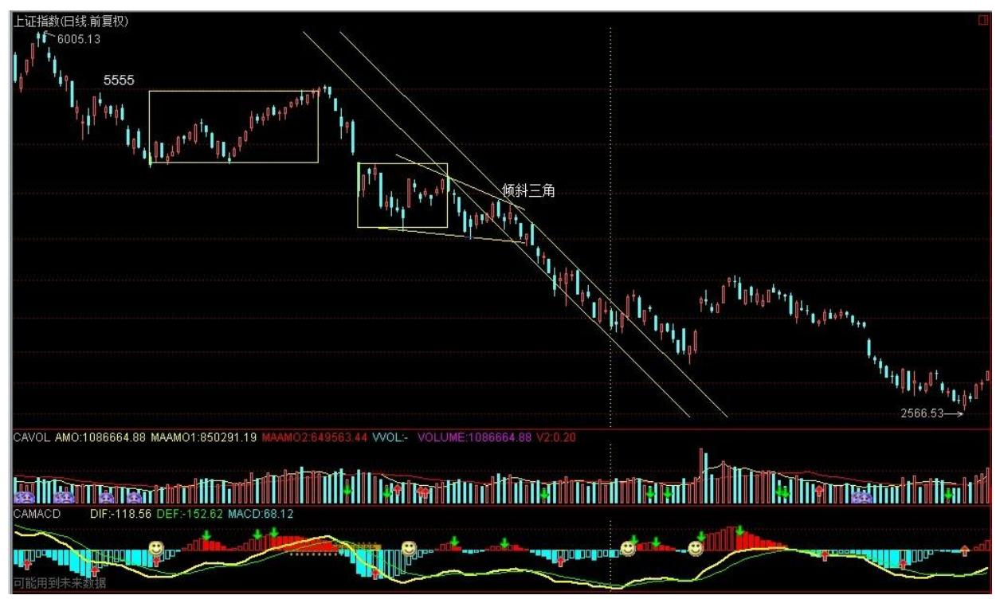

现在,有本事的人将要干什么,就是马上迎接新的短线机会。这机会 在破底后很快到来。其实,很多股票,回跌 10%到 20%后,今天尾盘 就可以回补,特别资金大的。现在,一个标准的下降通道,到下轨就 可以短线,如果破下轨加速,那就要放爆竹了,大的反弹马上就在眼 前,这都是最基本的技术常识,有什么难度? 那管理层爱干什么干什 么,本 ID 就陪他们玩到 2500,1500 也无所谓,反正有本事的人钱 就越来越多,到时候再大买便宜货,从 1990 年和他们玩了快 20年 了,谁怕谁呀。 这世界,只能靠自己的本事,哀求别人救你,有可能 吗?本 ID 早说了,绝对不能依靠任何东西,即使那玩意叫政府。

这就是本 ID 从 1990 年开始的最大经验之一。 本 ID 越来越感觉 到,本年度最大的赚钱机会越来越近了,让孔男人哀号去,求政府 去,我们开始磨刀霍霍了。 先下,再见。 现阶段中国资本市场的地 位 (2008-04-01 15:59:39) 一个成熟的市场经济,其市场中心地位的 就是资本市场,资本市场的任何风吹草动,都是国家级的大事。看 看,这次次贷危机,美国股市的实际跌幅度一点都不大,连 20%都没 有。但已经是朝野倾动而出,用进一切的金融、财政、政府等的资源 来稳定资本市场。为什么在美国以及西方所有的成熟市场经济国家, 资本市场具有如此举足轻重的地位?因为,这是他们经济结构的核 心,后面代表着最大多数人的利益。也就是说,这些成熟的市场经济 国家,其经济已经进化到如此的境地,绝大多数公民的经济利益都与

资本市场密切相关,而经济基础决定上层建筑,自然,没有任何的政 府机构敢对资本市场有丝毫的怠慢。 而现在,中国的资本市场还远远 达不到这样的地位,因为中国的市场经济依然在极为落后的阶段,资 本市场可以说暂时只是一种点缀,本质上,在经济结构中还没有任何 实质的地位。 因为,在中国,目前与资本市场利益相关联的,只是所 谓中产阶级以上的阶层人的利益,而目前中国更多数的人,是与资本 市场无关的,而他们所代表的是一种与市场经济相对无关的经济结 构。而在整体的国家经济利益的取向中,牺牲少数以换取多数,显然 是一个最被采纳的选择。 因此,例如在现在 CPI 与 GDP 的两难抉择 中,资本价格的压制又被人错误地认为是压制 CPI 的好手段,因此, 牺牲资本市场就成为最符合这种经济逻辑的选择了。 可以断言,在中 产阶级以上阶层占据社会人口最大部分之前,这种利益的偏向都无可 避免,对此没有明确的认识,不仅会对诸多中国特有的经济现象产生 迷糊,也会对自身的操作产生重大影响。 其次,按照服务型政府的原 则,资本市场的监管机构,本质上是市场的服务者,但现阶段,显然 远远达不到如此的要求,否则,例如平安事件,就不会一拖几个月都 毫无结果。而对于一个服务型的机构,这是显然的不作为行为,应该 受到相应的监督、纠正甚至惩罚的。 看清本质,你才能有真正的力 量。

3462 点成短线关键位置 (2008-04-02 15:17:01) 今天,如期反弹, 然后大幅度震荡。一般这种走势,最好就是进行对冲式操作,或者如 昨天本 ID 所说,昨天尾盘就可以先介入。 现在,短线最关键位置在 3462 点,明白本 ID 的理论的,都知道在这位置为什么重要。今天下 午冲到该位置,站不住,所以就出现大幅度震荡。但尾盘依然有资金 再度介入,这样,这次反弹可以再来一次,高位出的下来又可以回补 再来一次。 但下面,关键还是看 3462 点,只要再冲不过,那么大盘 依然有继续破底的机会。短线就是要来回折腾,一看不行先回来,一 看行了,甚至可以打点提前量,例如为了避开 T+1,可以在前一天的 尾盘。 299

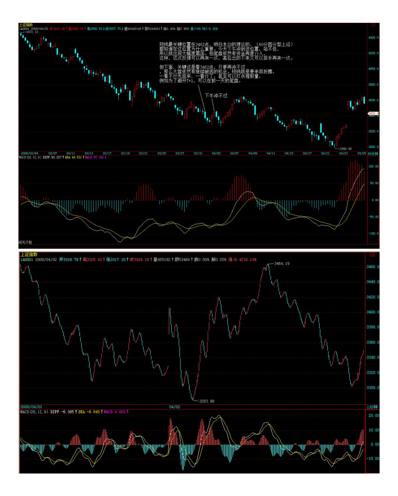

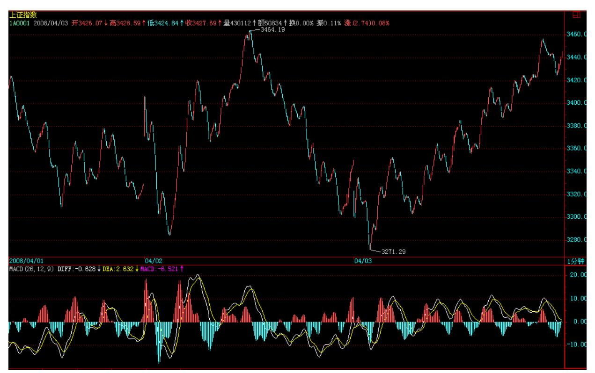

个股方面,金融股已经率先走强,但这走强是否有延续性,是否能向 地产、有色等蔓延,是行情能否延续的关键。题材股经过大洗盘,还 会重来,但暂时以反弹为主。 3462 点如期发挥神奇作用 (2008-04- 03 15:24:59) 今天的走势大概出乎很多人的意外,但一定不包括本 ID 以及昨天看了本 ID 解盘的人。昨天的解盘很明确地告诉你要再来 一次,请问,这一次爽吗?

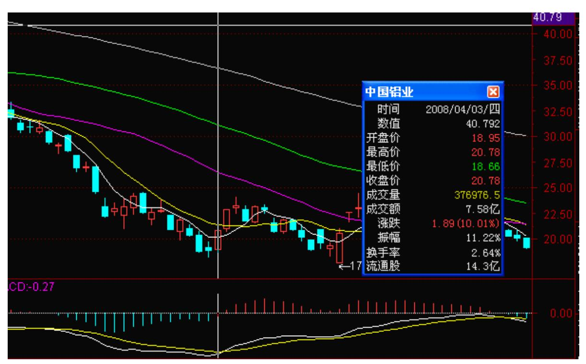

昨天,更说了金融向地产或有色等蔓延的问题,今天,那聪明的驴的 表现,请问爽了没有?有人昨天说,不是题材股吗?但难道这些云铝 中铝不是本 ID股票池子里的?50、60 跑的,20 下买点回来,难道有 罪呀?简直病的不轻。

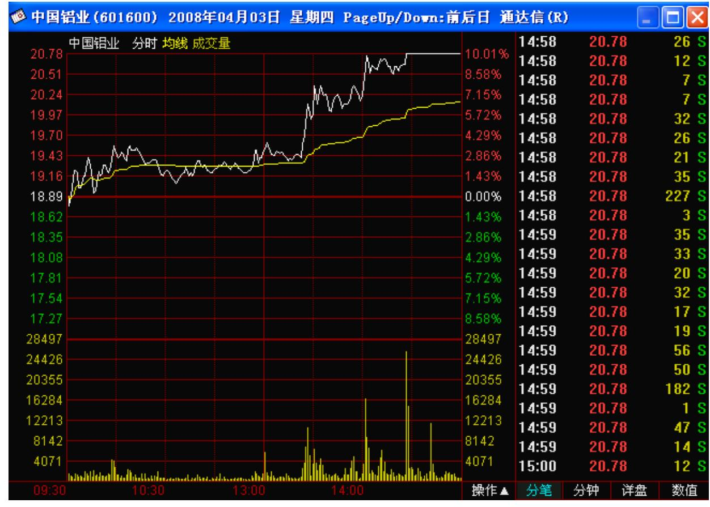

兵无常形,如果要走一波本年度最大级别的向上走势,中字头不启动 怎么可能完成?题材股当然要继续,但一波完整的行情,就是一、 二、三线的轮动次序,这不最简单的道理,有什么可说的? 当然,这 一切暂时还只是蓝图,因为实际的行情并没有走出来,暂时先当成反 弹来干是比较靠谱的,一旦形势不对,反手狠砸,不亦快哉? 显然, 昨天说的 3462点,今天起了明显的作用,大盘最终在该点位前放下步 伐。由于今天搏消息的比较多,所以尾盘小跳让人出来也是应该的。 下周是很关键的一周,因为日以及周是否能底分型,就看这了。当 然,短线这一切,都可以简化为 3462 点能否有效站住的问题,一旦 能站住,这些分型都不成为问题了。 个股方面,注意一线股的轮动次 序,注意新资金流向。另外,如果周一没消息,注意回杀力度,如果 力度不大,反而证明这行情真有戏了。 今天的走势图,超级技术化, 留一个作业:13 点 30 分到 2 点这段时间具体什么的技术意义,为 什么一站住某位置后,就马上出现大的突破,向上攻击 3462点。 305

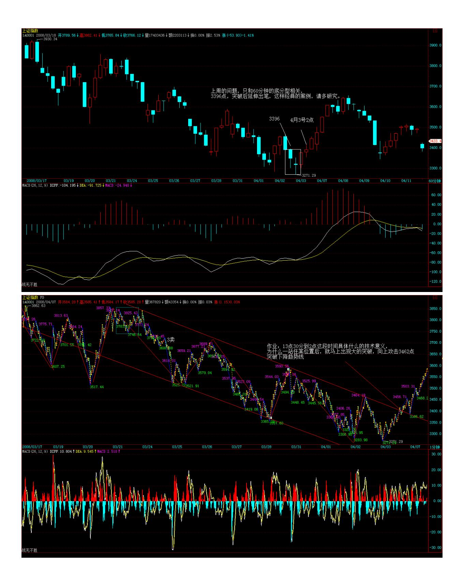

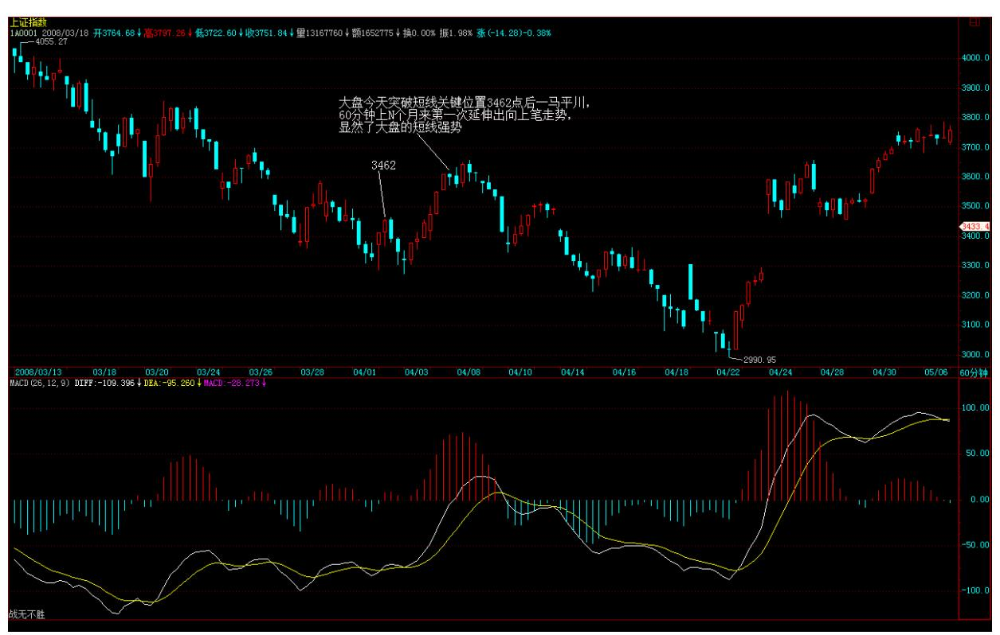

(注:缠师的作业的答案是分型上沿突破,但是趋势线的意义在此图中 也很经典,故保留后图)3613 点成中短线关键位置 (2008-04-07 15:21:25) (娇注:3613,前缺口和日分型上沿)大盘今天突破短线 关键位置 3462 点后一马平川,60 分钟上 N 个月来第一次延伸出向 上笔走势,显然了大盘的短线强势。

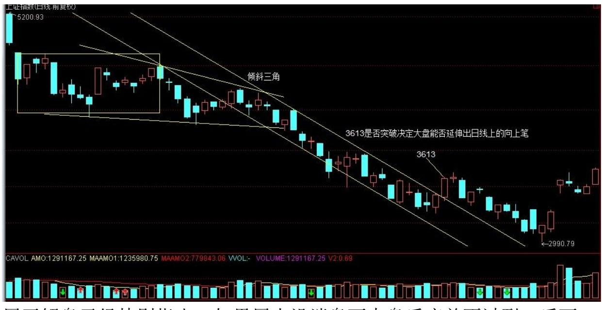

周五解盘已经特别指出,如果周末没消息而大盘反应并不过烈,反而

证明大盘行情真有戏了,今天的走势恰好证明了这一点。个股方面, 中驴为代表的有色继续驴性大发,但要注意,这次启动的板块,都是 回弹 20-30%左右进入调整,例如地产、金融等,因此,有色能否改变 这局面,暂时是有疑问的。 现在,3613 点已经成为中短线关键位 置,因为这位置是否突破决定大盘能否延伸出日线上的向上笔,而今 天的走势,由于已经突破 3555 点,因此,周线上形成底分型的可能 性极大,除非在本周内出现再破底。

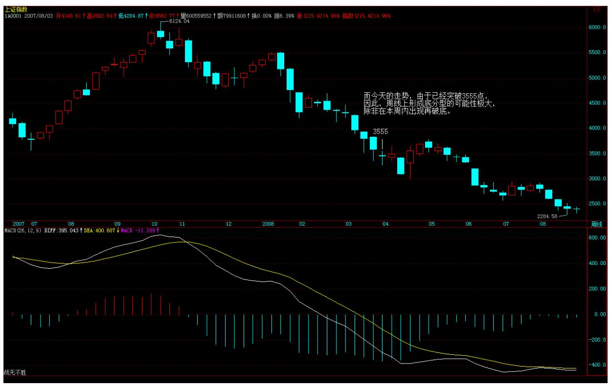

因此,中线上,我们一直预言的本年度最大行情成立的几率已经越来 越大。 当然,最安全的作法还见一步走一步,只要 3613 点攻击不 破,就可以先对筹码进入相应调整,以应付后面的震荡走势。 虽然本 ID 一早就明确3424 点附近将出现中线底部,但真走出来,我们反而 要冷静。不能在操作上留下遗憾。而且,如果真是中线底部,在真正 突破之前,洗盘震荡还少不了,所以,一定要按图作业。 上周的问 题,只和 60 分钟的底分型相关,3396 点,突破后延伸出笔,这样经 典的案例,请多研究。先下,再见。 中国人,不要习惯性当政府的奴 才 (2008-04-0716:05:58) 几千年来,中国人在政府、衙门面前就从 来没抬起过头,即使改朝换代,最终这奴才心理还是改不了。 而实质 上,政府、衙门是我们的奴才,没有我们,哪里有什么政府、衙门, 是我们的血汗供养了这些机构。面对这些机构,任何人都应该腰杆笔

直。 可惜,实质上,绝大多数的人还是不自觉地、完全集体无意识地 当了政府、衙门的奴才,例如,在资本市场上,例如现在还在叫嚣的 救市言论。 本质上,根本不存在政府衙门那种从上而下施舍性的救 市,问题的实质,只是要让这些奴才改正他们的错误,当然,如果奴 才不好听,那么,我们就用公仆这个词。 没有救市,也无须救市,有 的只是纠错。错了就要承认,就要改,就这么简单。可惜,大多数的 人的思维都扭了,都在等待所谓的施舍,这样,中国的资本市场、中 国的现代化真是遥遥无期了。 衙门型的管理机构与服务型的管理机构 相比,最大的特点就是行为完全脱离实际,所有的应对措施都严重慢 几拍。例如,过去两年,面对快速的上涨,最简单的经济学常识都可 以提供最简单有效的应对措施,就是快速加大供给。而供给的加大是 要有时效性的,过了那时间,这措施就对不上点了。那么,请看实际 上管理机构不仅没有加大供给,反而是提供了流通比例极低的疑似非 法蓝筹,这难道不是典型的火上加油吗? 衙门型管理机构,甚至可以 有这样一种可怕的思维,跌比涨好,跌就是安全,资本市场里的人的 行为最好都完全统一到银行存款行为上去,这样就不惹事,不惹事就 是最大的好事。正因为这十几年那如此思维的存在,因为中国的资本 市场走势都显示出最大的投机性,因为大家都知道上涨的时日无多, 一旦有机会就变本加厉地投机,尽量在最短时间内把最大的利润拿到 手。 正因为管理层与投资者的心态都在这样一种氛围下,所以,那种 稳健的长线行情就不可能真正出现,大起大落成为真正的常态。而这 时候,还提防止市场大起大落就成为一件很滑稽的事情,成为衙门型 管理机构语言的一个标准范本。请问,一年不到,从 3400 点到 6124 点又回到 3400 点还不是大起大落?一个已经是事实的东西,还能或 还需要防止什么? 我们不希望再有类似的无聊衙门言论,我们也希望 我们所有的投资者都要站立起来,知道自己的力量,市场是我们创造 的,我们是市场的真正创造者,我们才是市场真正的主人,我们必须 要用我们的力量彻底改变这一切。

3613 点如期发挥神奇作用 (2008-04-08 15:19:39) 昨天给了短线的 关键位置 3613 点,今天全天就是围绕着震荡,连收盘就在 3612.5就 知道,该点确实如期发挥了作用。 现在的问题很简单,站得住3613 点,就继续上攻,否则就出现一个大的调整。所以,本周就看着该点 就可以了。 312

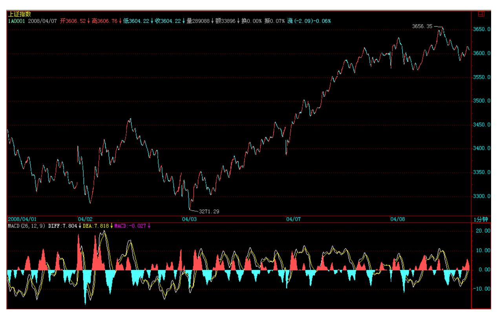

个股方面,板块轮动加速,现在问题的关键是轮动后首先调整的板块 能否再次启动,能,那大盘就肯定有戏,否则至少要调整一下。 目 前,整个次序大致是地产、金融、有色、券商,然后今天是所有几乎 大的题材都动了一下,创投、农业、三通、环保等等,因此,后面还 是要看金融地产能否再次启动。 当然,一些小板块的轮动还会继续, 但对于大局,这些都没多大的意义。行情,关键要看大角度。 大家应 该注意到,本 ID最近一直只用给级别的分型来统一进行分析,其实就 是想告诉各位,你把一招真学会了,绝大多数的问题都能解决,这就 是示范,请把这次整个探底到回升的整个过程好好研究,课程等这个 示范以后再写。

不想说了,留点精力今晚熬夜看球。先下,再见。

3613 点威力尽显 (2008-04-09 15:16:57) 今天的走势极端技术化, 前面已经明确说了,只要站不住 3613 点,就要再次探底。今天低开 后,在 60 分钟刚好跌破顶分型的下边,早上那标准的回抽,极端显 然地上不了 3613 点,因此确认这对顶分型下边的跌破是有效的,因 此后面的下跌就顺理成章了,为什么?因为向下要形成笔。 314

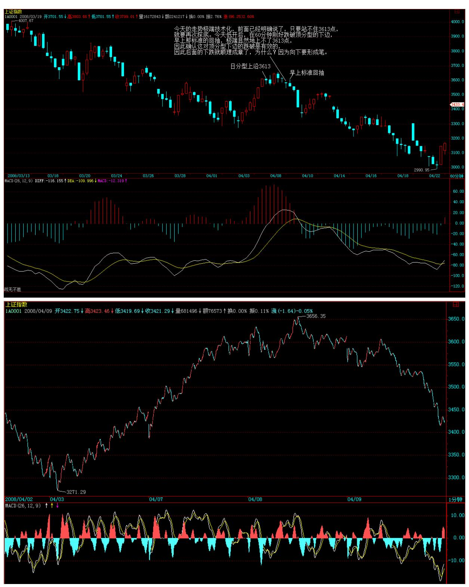

现在的走势很显然了,向上的笔后形成向下笔的调整,也就力度最大 那种调整,因此,后面在向下笔结束前,都不适宜再度介入。但一旦 向下笔结束,就又有一次美妙的短差机会。 各位,看到没有,就用一

个简单的 60 分钟分型结构是否延伸为笔,我们就能完全把握这样的 走势与相应的退出,现在,我们只需要等待新的买点出现,如此简单 而已。 个股方面,昨天已经明确说了,只要地产不能重新启动,就有 问题,今天万科等的走势,一个标准的短线多头陷阱,因此,引发回 跌再正常不过了。 当然,就算有真行情,也需要大的洗盘,但是否洗 盘还是继续下跌,其实根本不重要,我们只关心下一个买点,把走势 支解了进行操作,我们不废那个脑子。 让脑子有水的人继续争论是否 有真的行情,他们负责争论,我们负责挣钱,还有精力的,今晚继续 加班看球。先下,再见。

3533 点成短线关键位置 (2008-04-10 15:25:06) 网络超级慢,登陆 就用了 10 几分钟,什么写东西的心情都没有了。随便说两句。 今 天,又一个完美的短线机会,60 分钟的底分型成立,而 3533 点成短 线关键位置,所谓的关键位置,就是站上去,大盘将继续延续反弹, 也就是 2 次探底结束;站不住,就必然再次探底,而且破底的机会极 大。 317

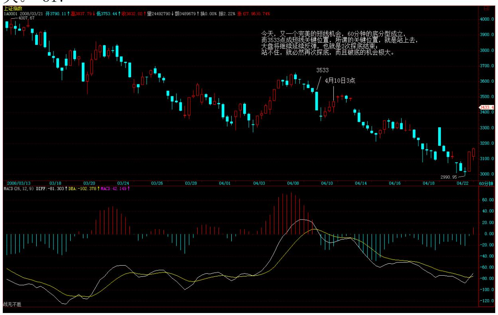

今天,煤炭、券商、滨海等甚至创出本次反弹的新高,这是好现象, 证明至少有部分资金是勇敢做多了。现在,指数上要有大突破,还是 要看金融、地产、有色等,不过先有板块裸奔起来,绝对是好现象。

思维要改,今年的行情不会是一条直线的,底部也要震荡个 N 回才爽 的,不明白这点,就痛苦去吧。注意节奏,自然就爽。

周底分型成立令 3840 点成中线关键 (2008-04-11 15:10:56) 本周折 腾,最后的结果还是把周底分型给折腾出来了,该分型的上边在 3840 点,因此,该分型是否最终有效,延伸为向上笔,或者最终失败,只 构成中继型,3840 点就成了周级别的关键位置了。 319

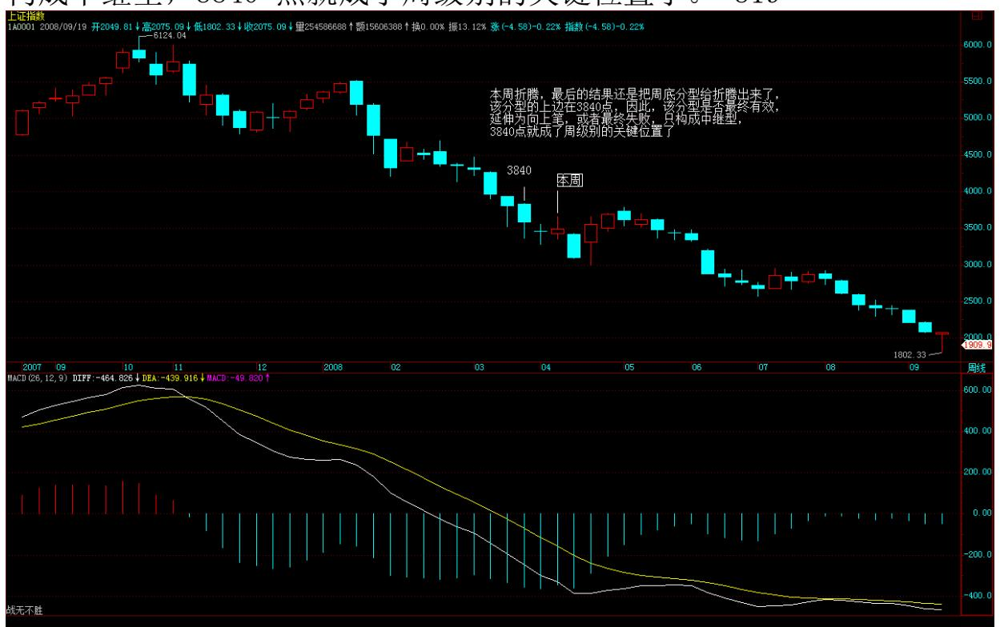

今天,大盘全天在昨天所说的 3533 点下震荡,显示大盘不强,信心 不足,大概是周末的心理压力,因此,下周初,就看这 60 分钟级别 的关键位置能否突破,不行,就再次探底。 日线级别的对应位置在 3613 点,因此,3533、3613、3840,(60 分,日,周)给出了一个 市场运行的密码,由此,超短、短、中的走势都完全把握了。

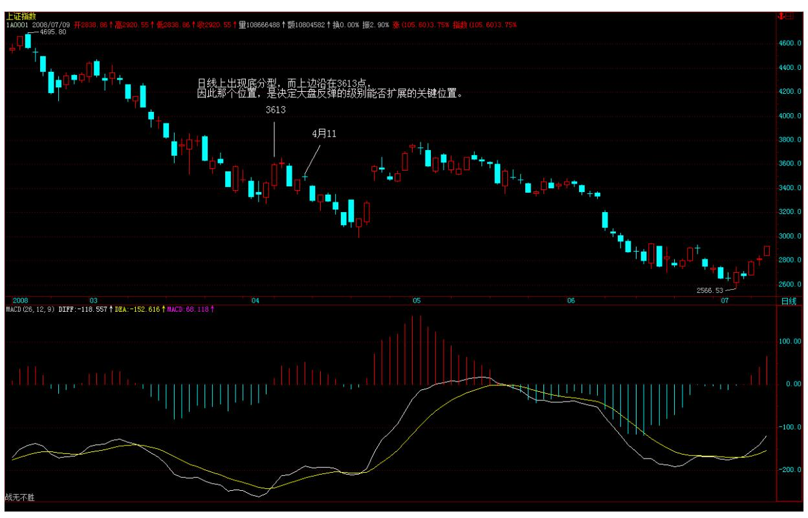

个股方面,板块继续轮动,但力度有所减弱,现在,只要金融、地产 等不再次动起来,大盘就不会有大戏。 322
