教你炒股票 105:远离聪明、机械操作 (2008-04-13 21:51:14) 股 市

里死掉的,大半是聪明人,越聪明的,死得越快。要在市场上生存, 就必须远离聪明,因为,你的聪明在市场面前一钱不值。 市场就如同 一头牛,只有目无全牛,才可能随心解之而合其关节。在本 ID 的理 论中,机械化操作的本质就是目无全牛而合其关节,因为,根据本 ID 的理论,市场的结构已经被彻底分解,站在本 ID 理论的角度,哪里 有什么市场,不过是一堆的关节。而机械化操作,就是逐步合于其关 节的节奏,而不被全牛的繁复所影响。 至于分解这市场的那个标准是 什么并不重要,也就是分类的原则并不重要,关键这分类能导致完全 分类就行了。那些看不起分类的,永远只能在全牛的迷惘中可怜,咱 就不带他们玩了。 本 ID 可以再次明确地说,全牛纷繁,因此可以口 水多多,各有道理,那么,就让这些聪明人去道理去、去争论去;咱 不爱聪明,咱不爱全牛,咱只知道关节的节奏,咱不爱争论,咱更不 爱预测,咱只负责挣钱。 如果你喜欢道理而不喜欢白花花的银两,喜 欢争论而不喜欢挣钱,那么就远离本 ID 的理论吧,那对你没用。 最 近,不写课程,但其实一直都在写(娇注:每日解盘用 60 分,日,周

分型能否延续成笔进行分类),每天,就是用一个最简单的分型以及 能否延伸为笔的最基本标准进行分类,就完全可以处理如此震荡的行 情,人总爱复杂的东西,看不起简单的,而这才是真工夫。 挣钱,本 来就是很简单的事情,不过就是一个良好习惯与操作策略的结果,一 点劲都不用费。那些费力才能挣到的钱,也不会袋得住。 人总爱贪 多,请问,分型这最简单的分类导致的操作,你把握了吗?如果这都 没熟练把握,你再学其他又有什么意义? 好好总结吧。

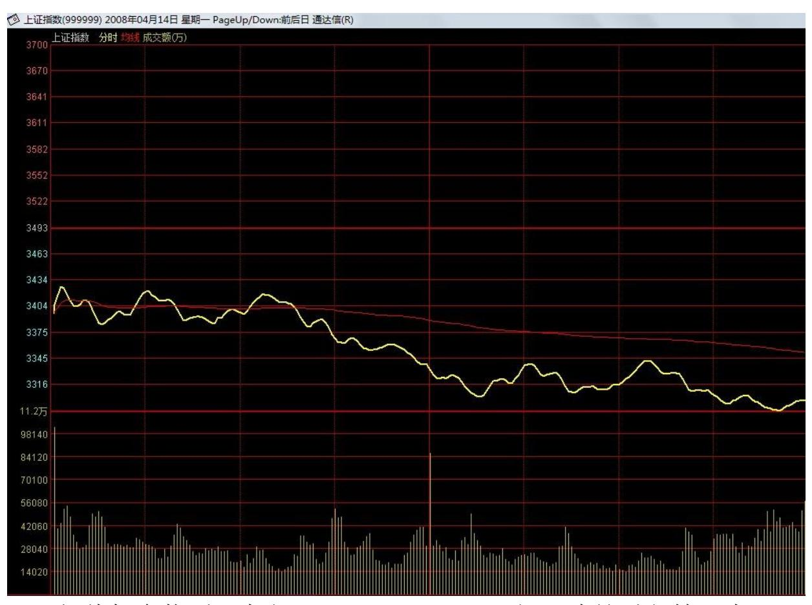

又一短线机会扑面而来(2008-04-14 15:22:10) 现在这种行情,本 ID 一早就给出两种唯一的策略供不同水平的人选择,一是小板凳,二是 短跑运动。本 ID 之所以天天在这里给各位练习短跑,就是假设你有 这水平。否则,小板凳的过来看看就可以。 现在,继续和各位练短 跑,如果你没这水平,就一边晾着,咱不带你玩。已经明确说了, 3533 点上不去破底的机会就大大的,所以,今天的走势其实没什么可 奇怪的,而且早上连续三次冲高都补不了缺口,如此肾亏,你还能假 设这大盘今天不是 ED男?

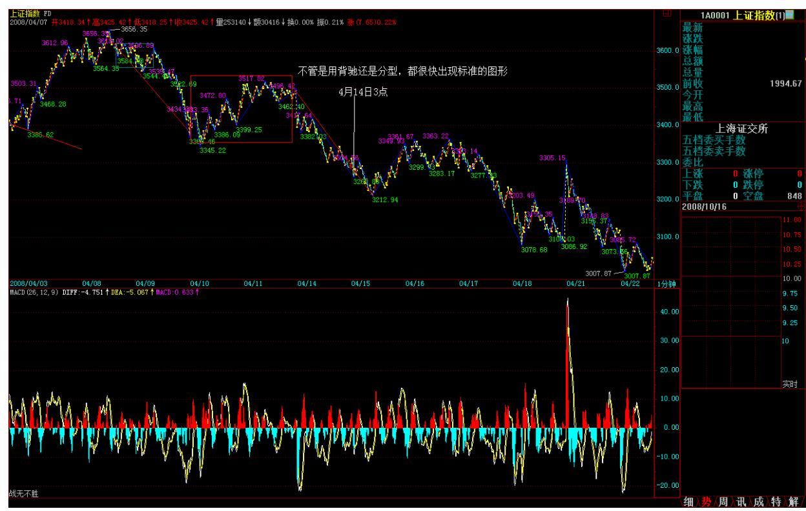

不过,这样的下跌,只是让又一次的短跑机会扑面而来。不管是用背 驰还是分型,都很快出现标准的图形。其实,对于一点货都没有的, 今天尾盘就不妨在水底捞点。

注意了,中线一定要看好地产板块,前几天本 ID 已经说了地产搞了 一个多头陷阱,因此,这几天的大跌很正常,否则就不叫多头陷阱 了,现在的关键是,地产是最早启动的,这次下来是第二买点的清 洗,还是新一轮的下跌,对大盘具有极大的中线指引意义。当然,同 样的包括金融股。 平安那破事一直不出来,对大盘就是一个大的压 制,它不出来,大盘就不可能真正走起来,这点也是必须注意的。 注 意,短跑就是冲刺就完事,千万别搞成长跑。 先下,再见。

如约反弹,3311 点成短线关键 (2008-04-15 15:14:35) 爽了没有? 这扑面而来的感觉如何? 你看透市场以后,反弹不过就是一个 419的 约会。今天,昨天的预约如约而来,4 根 60 分钟线,前三根构造分 型,确认后,第四根突破分型上边,3311点成短线关键位置,一切就 是本 ID 理论的活教材,你说有什么可说的? 注意,只要 3311 点回 试站住,那么反弹继续,否则就结束,如此简单。 326

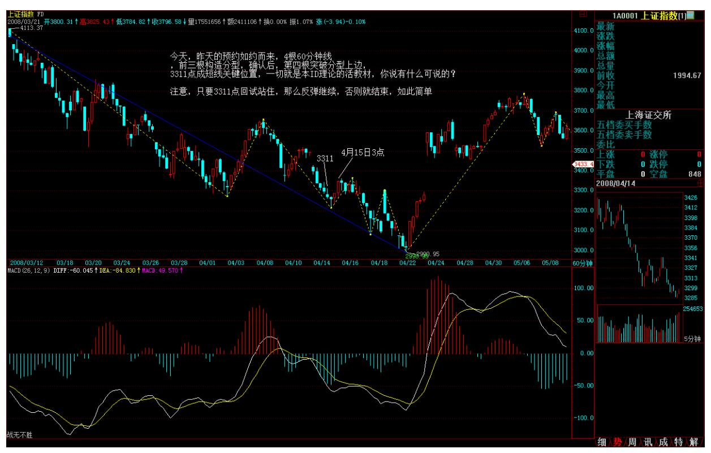

短跑的感觉如何?感觉是跑出来,干出来的。爽是需要真枪真刀来 的。本 ID 这里没有花架子,只有白花花的银两通过技术抢劫回来。 个股方面,创投继续,券商由于可以直投,其实也已经是这个概念 了。后面就看能不能轮动起来,房地产能不能止住来个大反弹。另 外,新能源、环保、农业等是长线大题材,一定是有机会就会被折腾 的。 个股只要能轮动起来,这反弹就能持续。至于中线大盘,过几天 有心情再和各位分析,总之,已经在最后的空头陷阱中了。

CPI 让多空有了再次较劲的理由 (2008-04-16 15:15:02) 今天,大盘 全天和 CPI 震荡较劲,而震荡的中心就是昨天说的短线关键位置3311 点。而最终得到的数据,多空双方都能从中找当适合的说辞,空方自 不必说了,而多方看到 CPI 月环比的回落,当然也有了说道的地方。 其实,最终怎么选择,一点都不重要,今晚,各大报纸、专家就会将 这些数据分析烂了,但这对实际操作没用。 我们不当专家,我们只当 赚家。面对这种围绕关键点位震荡,还没有决定方向的走势,最苯的 方法当然就是等关键点位出现第三类卖点之后走,但这确实太无聊 了。以前已经多次说过,这种操作其实十分简单,就是在震荡高位利 用盘整背驰抛掉,下来不破位就回补,千万别浪费这震荡的短差机 会。注意,这样必然是半仓操作,如果真破位,下来不回补就是,然 后把半仓也扔了,这样效率最好。 当然,还有一种是最干脆的,就是

震荡高位先走了,等真正重新站住关键位置出现第三类买点再介入, 这是最安全又有效的作法,就不费心去预测最终是否站住了。 我们的 操作,一定要用操作的眼光而不是争论的眼光,来市场是为了赚钱而 不是为了表现自己的聪明。明天,就看这 3311 点的第三类买卖点问 题,如果你已经有正确的操作了,那这就没有任何操作问题了。我们 不较劲,等多空较劲完了,我们跟着胜利者走就是。

破底再给短线机会(2008-04-17 15:05:56) 3311 站不住,自然就要破 底,这没什么可说的,但这就又成就新一轮 419,一个新的短线机会 又到面前。 今天,有点脑子的资金都云集到某新股中抢东西,但这反 而搞到盘子乱了。

明天很关键,就看里面的各种势力会不会互相拆台了。 现在,破底并 不是什么坏事,破底反弹再破底再反弹,节奏把握好了,一样赚钱。

中线只能等基本面的明朗,不明朗,谁都没有当炮灰的兴趣。 其他没 什么可说的,看图操作就是。 先下,再见。 后市纯技术分析展望 (2008-04-18 15:24:59) 今天是典型的逼宫行情,中石油破发,使得 所有人觉得该干的事情给干了,但这种希望把管理层的政策弄出来的 想法,显然有点太天真。 由于 60 分钟底分型没有被构造出来,所以 短线出击的时间必须继续看图等待。 周末不想多说,把前面曾经承诺 的中线分析给出,一早就写好,正好贴出来当周末礼物。 先下,再 见。 最近大盘在本 ID 前期所指出的 3424 点上下反复震荡,持续了 相当长的时间。由于目前的基本面完全不配合,因此有力度的行情一 直不能真正走出来,只能维持一种弱市震荡的局面。这种震荡的局 面,最终的结局无非两种,就是逐步震荡走强然后寻机向上突破,或 者就是干脆再狠砸一个空头陷阱,快速下跌后进而再迅速回拉重新回 到该震荡平台蓄势走强。 无论市场最终采取何种选择,最终在根本意 义上,不过都是要以目前的平台为基准展开新的行情。因此在这共同 点上,反而说明了目前平台的技术意义。现在需要探讨的是,该平台 最终确认后走出的行情的级别问题,因为,实质上,根据最严格的技 术分析,还存在三种可能的走势变数。 上海指数,从 6124 点开始, 共出现两个不同级别的有技术意义的反弹。第一级别是 4778 点到 5524 点的所谓跨年度行情,而第二级别是那次在年线附近进行争夺的 走势,具体的范围是4196 点到 4695 点。因此,这三种可能的变数就 是:一、第二级别力度的反弹;二、第一级别力度的反弹;三、超第 一级别力度的反弹。

显然,这三种反弹的力度是逐级加大的。最弱的就是第一种情况。由 于从 4695 点开始的下跌到目前已经进入尾声,因此,其后至少要出 现第一种的情况反弹。而在目前基本面上,国家对市场已经完全受制 于所谓 CPI 情结,因此,资本市场本被当成最终牺牲品的可能性是极 大的,一旦这种基本面继续成立,那么,大盘只出现第一种情况反弹 的可能性就极大了。 也就是说,后面,我们首先可能只会迎来第一种 情况的反弹,其后依然有进一步的下跌去制造新低的必要。而只有当 那次新低制造后,大盘才可能出现第二或第三种情况的走势。至于这 个新低的范围最终出现在 2500 点到 2700 点内甚至更低,都不是一 件太奇怪的事情。 其实,以前已经明确说过,上海指数的走势完全可 以参照深圳成分指数的历史走势。我们之所以能在去年提前指出 6100 点的大顶,除了上海指数本身的分析外,一个很重要的原因,就是因 为深圳成分指数的历史走势在 1996 年到 1997 年就出现从刚破 1000 点到 6100 点的历史性走势,该走势与上海这次的走势吻合具有着极 大的可能性,而事实上,这种吻合最终就变成了事实。 深圳成分指数 的历史走势从 6100 点开始快速回落到 3000 点以下,和这次上海的 走势又出现惊人的指示作用,因此,上海的走势最终跌破 3000 点, 站在这种历史走势值得关注的对照上是完全合理的。 当然,历史走势 的对照并不一定都完全成立,但从目前的情况看,最终成立的可能性 越来越大。特别这次,和上次的情况在基本面上完全一样,上次是所 谓的亚洲金融风暴,政府为应付之,只能把资本市场当成牺牲品。而 这次的所谓的次级贷款,都是外围因素引发内部压力,最终的政策选 择也是牺牲资本市场,所以,这一切,都成为很容易理解的事情了。

注意,目前理解当下的资本市场,一定要彻底明白政府最终抉择中资 本市场一定会被当成牺牲品的必然性,这种必然性在前面已经详细分 析过了,这是理解当前资本市场的关键所在。

从目前的基本面看,出现第三种情况的可能性不大,而第二种可能性 还是有的。上次,深圳通过两年的调整后才出现第三种情况的走势, 如果你相信历史,那么,要出现第三种可能性的走势,怎么都要有 1 年的时间。 当然。分析在本质上涉及预测,并没有任何 100%准确的 可能,而实际的操作,一定要根据市场的最终选择进行,不能把分析 与预测当成市场本身的走势,而后者才是操作所能真正依据的。 多头 版"半夜鸡叫"闹剧收场(2008-04-21 15:09:38) 显然,周五的逼宫 兵临 3000 点,给管理层足够的压力。但现在的管理层,有点葛朗台 的味道。把自己兜里那点货都当宝贝了,总想用最小的代价把市场给 打发了。因此,一个最没实质内容但又用"半夜鸡叫"模式过度包装

的闹剧就此上演。 对此,本 ID 真是无话可说,各位大爷,为什么总 是要低估市场的智慧?大

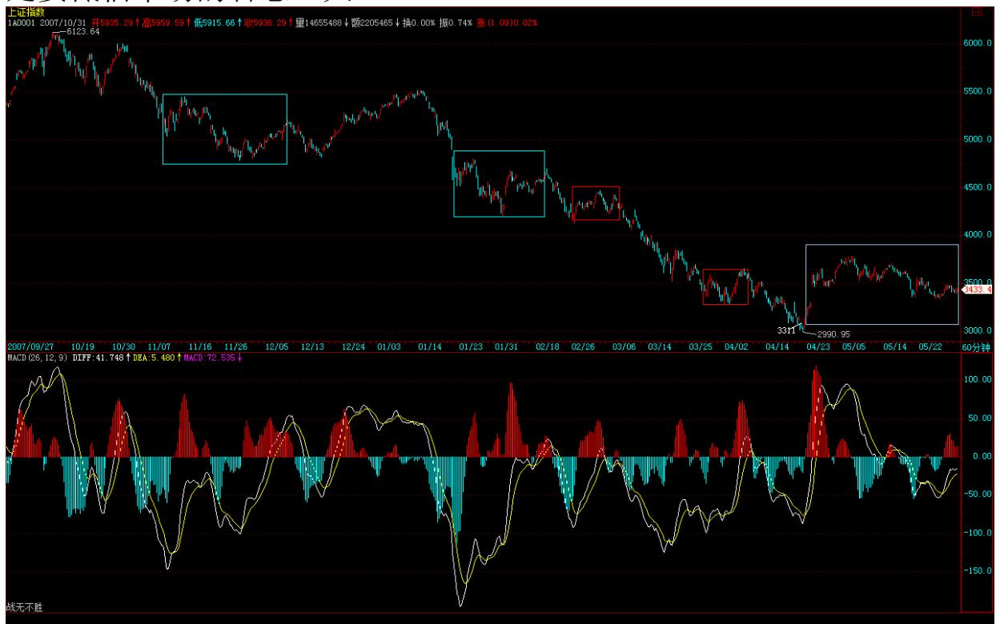

爷们口袋里有什么货色,市场里的人用指甲都能算清楚,又扭捏什么 呢? 不是市场不给管理层面子,而是太自以为是是必须受到嘲笑的。

当然,由于管理层已经有点压力了,所以,不排除他们来点什么组合 拳,因此,过度作空已经面临风险,向下的搏傻游戏也要开始小心。

市场玩的就是心理,不管对象是谁,看穿了对手自然上上下下操作自 如。 技术上,短线看,今天还折腾出一个小的底分型,能否成立就看 3189 点了。 操作是双面的,可以先买后卖,可以先卖后买,可以先 卖后买再卖,关键是看图操作,不要凭自己的情绪。 另外,盘面上一 定要注意是否有领涨板块出现,没有这,就像今天,肯定没戏。 先 下,再见。 小分型顶起大反弹 (2008-04-22 18:20:45) 今天,60 分 钟图上出现的小底分型顶出了一个大反弹,3085 点的突破确认了分型 的成立,后面就是回试能否站住最终形成向上笔的问题。(注:下图标 的3311 的位置实为 3085)

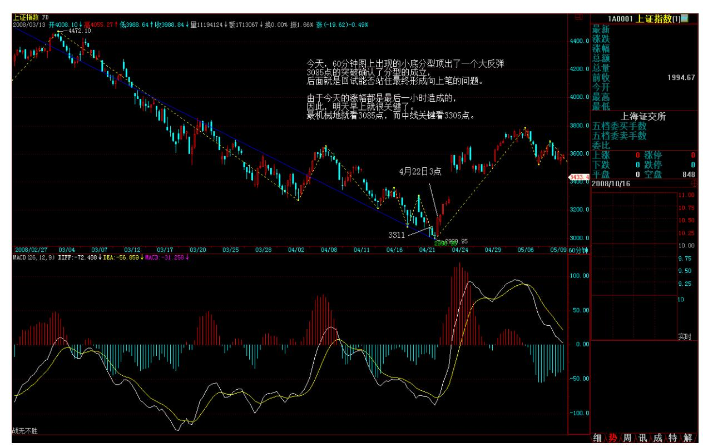

由于今天的涨幅都是最后一小时造成的,因此,明天早上就很关键 了。最机械地就看 3085 点,而中线关键看 3305 点。

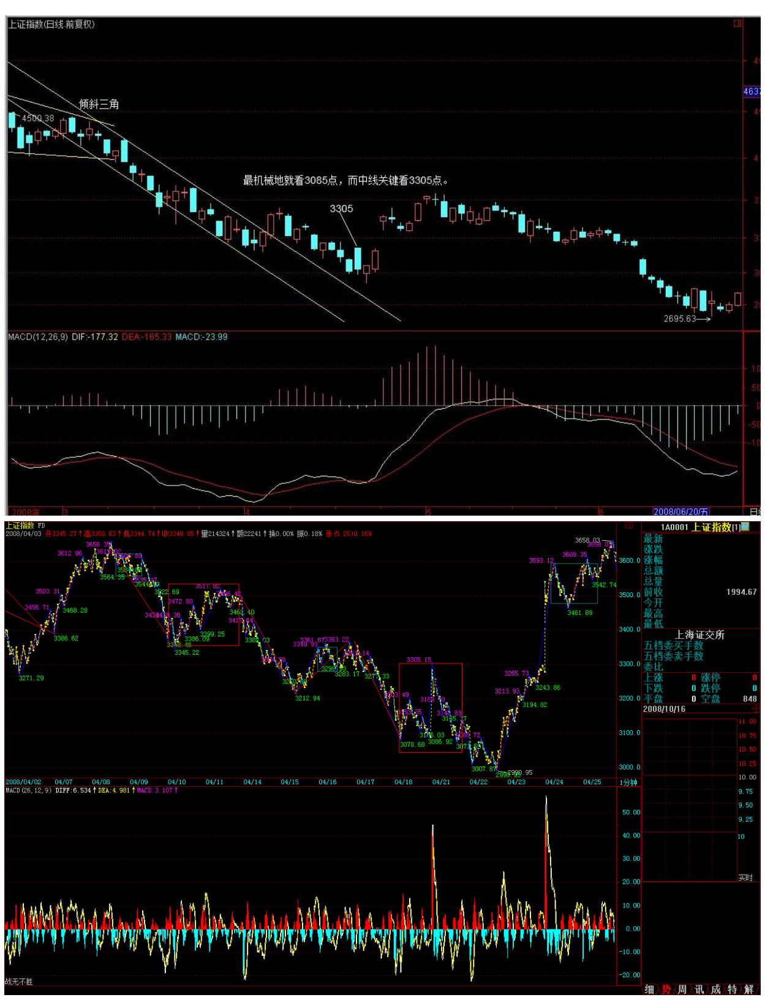

个股方面,金融股,包括银行证券继续走强,这证明长线资金依然坚 定认为 3300 点下的空头陷阱性质,而现在很关键的就是房地产股

了,如果能从前期的空头转为多头,则多头成功的几率就大了去了。 政策方面,今天把王大先生也给逼出来了,这次的逼宫行情,骗到了 筹码,又把政策冲了冲,效果是显然的,但还是缺少干货,这才是行 情迟迟不大动的关键。 今天有事晚了,抱歉。先下,再见。

纯技术化的走势如期遭受 3305 点考验 (2008-04-23 17:58:56) 昨天 分析给出 3085 点与 3305 点,结果今天走势就在这两点演绎。早上 对 3085 点的回试确认极端教科书,下午,最后半小时一直在 3305点 关前徘徊。 显然,突破 3305 点,那行情的性质将升级,而不破,那 就要出现震荡,因此操作上以此为标准就很容易了。 336

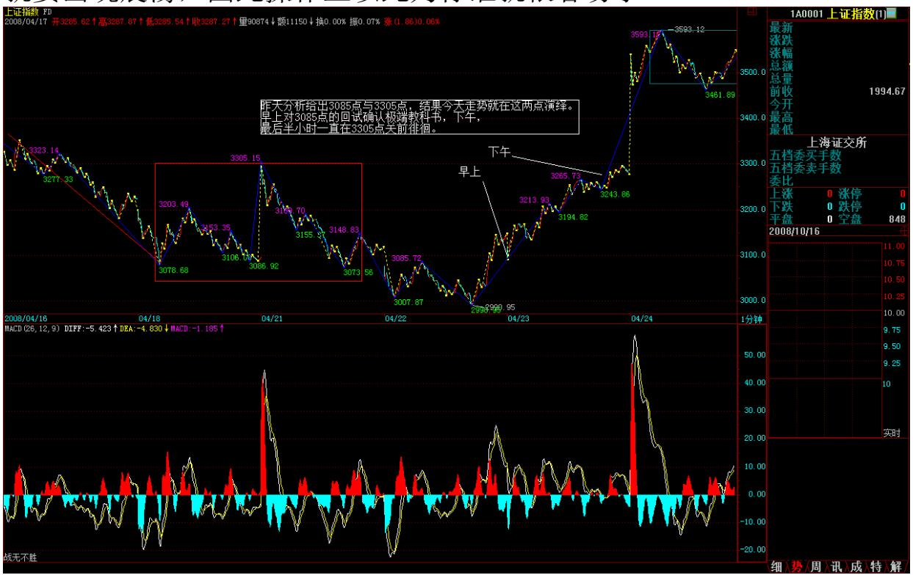

个股现在普遍回暖,而有些板块已经逐步有中线强势特征,只要真有 领头的,行情就有戏。太多就不谈了,看图操作。大略看了各位昨天 的留言,谢谢了,本 ID会认真面对的,有空会把相应的事情一一记 录,就如同一个股票的操作记录。 普涨后注意板块分化 (2008-04-24 15:15:00) 干货的力量,今天全面呈现。市场不是没有资金,而是没 有信心。信心来自干货,有了干货,就有了冲击的能量。 不过,任何 事情都不能昏头。今天是普涨,所有前期压抑的发泄,因此,行情能 否真正健康地展开,关键是其后的分化,强势领涨板块的继续走强, 这才是长远之计。 前面说过,券商由于能直投,所以是真正的创投股 票了,而这次减税,肯定对成交量有大的提升,这板块在前期提示

后,依然值得关注,不过追高就没必要了,因为毕竟会有一次洗盘的 过程。 另外,这次行情的性质,前面也说过,肯定大头的天下,一般 的题材股,暂时只能小打小闹。所以一、二、三的节奏,大概会表现 得比较明显。 注意领涨板块之间的轮动节奏,以及向二、三线的蔓延 节奏。 当然,从纯操作的角度,我们不能一味看好,饭要一口口来, 短线的关键位置在 3656点,站住继续上,否则进入震荡。 3656 点如 期发挥神奇作用 (2008-04-25 15:15:22) 大盘如此气势汹汹,结果还 是在本 ID 一早提示的

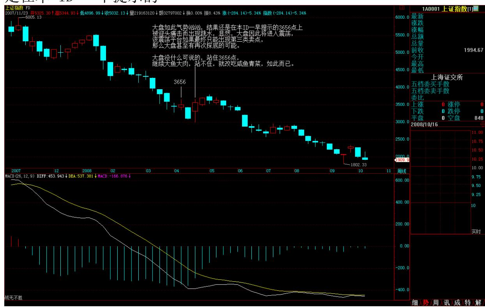

3656 点(周分型上沿)上被迎头痛击而出现跳水,显然,大盘因此将 进入震荡,该震荡平台如果最终只能出现第三类卖点,那么大盘甚至 有再次探底的可能。大盘没什么可说的,站住 3656 点,继续大鱼大 肉,站不住,就改吃咸鱼青菜,如此而已。

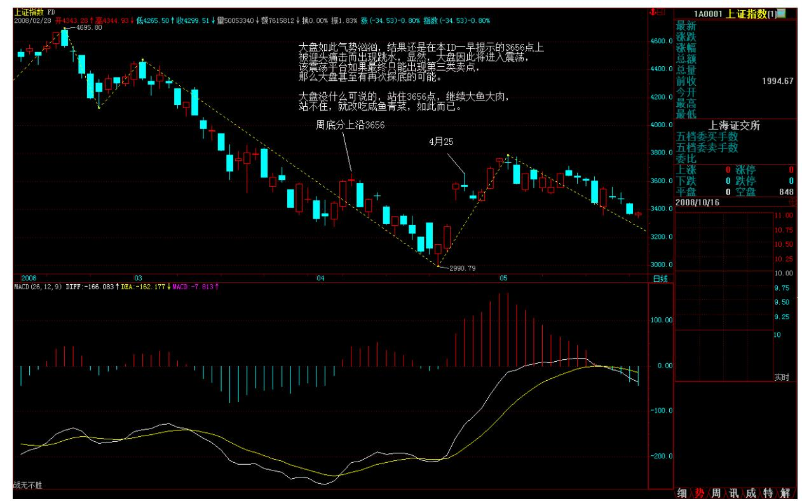

证券板块继续如所说的强势,显然,这是领头的,只要该板块中线继 续走强,那么问题就不大。短线会有震荡。 个股如所说地出现分化, 好好观察调整中有新资金介入的,一旦还有新一波,这就是黑马了。 另外,本 ID 极端鄙视那些拿本 ID 的病到处招摇的,这些不配做 人。人的尊严,就在生命的残酷中的从容,整天鬼哭狼嚎,把一个帖 子贴上几百上千,还是人吗? 人,就要人一样站立。感谢各位的关 心,你们的药方等等都感谢了。不过,本 ID 下周会因此而开始讲授 中医的,这也是战胜疾病的一种方法。 周末了,让我们去体验不一样 的生命。 先下,再见。

3656 点的神奇捍卫技术分析的尊严 (2008-04-28 15:06:21) 很多一 知半解的人,说什么技术分析没用,那么请问为什么本 ID 多次事先 指出的位置都神奇地逆转了大盘?就象这次的 3656 点,事先给出, 其神奇作用是在基本面强烈变动下发生的,结果怎么样?这两天的走 势很无耻地很不给所有人面子地捍卫了技术分析的尊严。 很明确地说 了,站住 3656 点,继续大鱼大肉,站不住,就改吃咸鱼青菜,所 以,各位就开始吃咸鱼青菜了。什么时候才可能再大鱼大肉?很简 单,等 60分钟的向下笔完成。 341

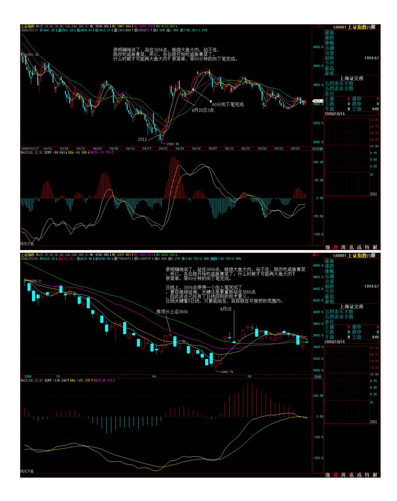

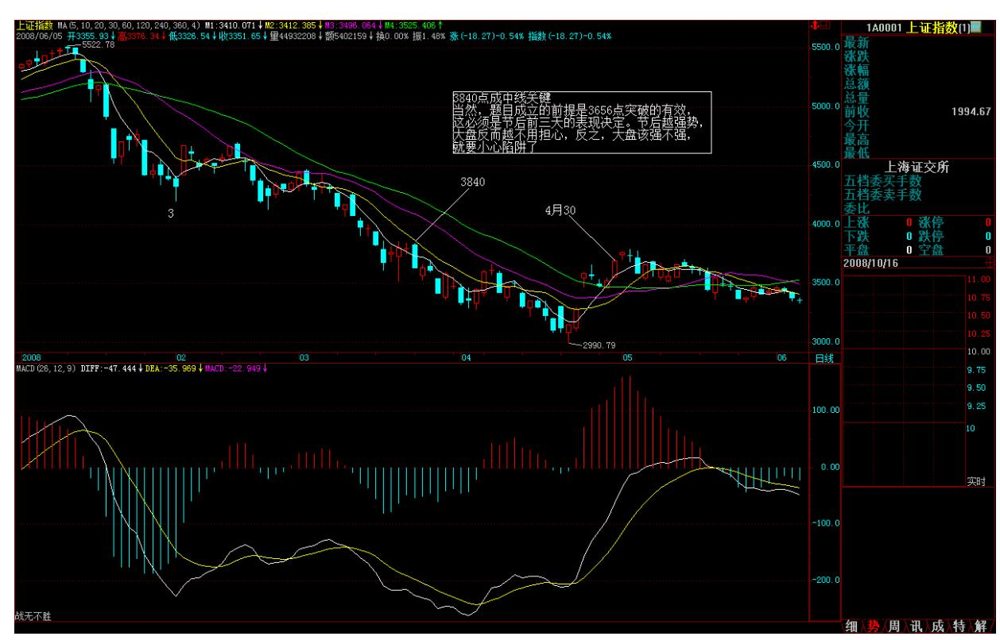

日线上,3656 点使得一个向上笔完成了,要在继续延伸,关键还是要 重新站住 3656 点,因此该点已经有了日线级别的技术意义。日线关 键看 5 日线,只要能站住,回探就在可接受的范围内。

个股上,注意强势股回调时是否有资金承接而有第二波的机会,另 外,调整时,老题材股会趁机活跃。 等一下,简单说说本 ID 病情的 最终全面结果。 5 日线支持产生震荡 (2008-04-29 15:02:13) 在远 离北京的过程中,无线上,只能快速说两句。北京对本 ID 的病是死 地,算了算正向活地转移。

3656 点是大盘的抉择点位,其下的一切震荡本质上都没多大意义。

当然,如果 5 日线震荡失败,那么大盘将确立进入向下笔,调整压力 将加大。 个股,强者恒强在证券中表现明显,所以一直强回调介入机 会。但现在关键看大盘,如果调整加大,将注意相应风险。 不能多说 了。 3840 点成中线关键 (2008-04-30 15:17:52) 当然,题目成立的 前提是 3656 点突破的有效,这必须是节后前三天的表现决定。节后 越强势,大盘反而越不用担心,反之,大盘该强不强,就要小心陷阱 了。

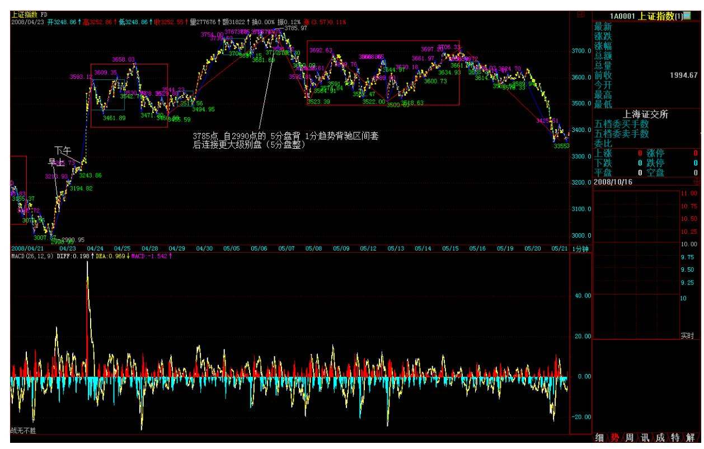

走势趋弱,小心震荡(2008-05-05 16:54:42) 今天,上攻力度明显趋 弱,以板块补涨为主,所以,大的震荡风险已经开始积聚。3840 点的 中线意义已经早说,注意该点位上下表现。 这两天连续检查,活检等 真受了大苦,大概平时根本不来医院,少见多怪了。 先下,再见。

该强不强小心陷阱终被验证 (2008-05-07 15:06:22) 节前已强调,节 后该强不强小心陷阱,而周一又再次提醒,因此今天的走势完全在预料 之中.现在中线很简单,还是看 3656 点,强弱分水岭.站不住甚至不排 除二次探底。 暂时,可以把操作先以 3656 点附近新中轴震荡打短差. 明天开始,可能要开始一次化疗看看效果,这里有最好的针对化疗后果 的特效药,因此可以试,也就 6 天时间,如果没大的效果,会换新的方 式。 因此,后几天不一定有帖子。抱歉。(想说点"",不知道说什么 好,泪奔!----北极狼)3656 点上下的艰苦选择 (2008-05-08 14:45:00) 3656 上下的重要意义已经反复说,至于如何选择,根本没 必要预测,只要保持如此市场节奏,那就 3656 点下跌不动就买,之 上或附近涨不起就抛,不断短差。 市场好操作,但有些选择就很难, 现在就碰到一个。紫杉醇

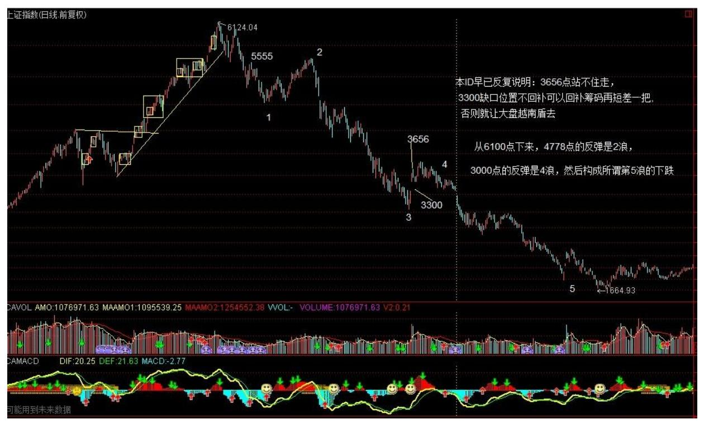

(Taxol),最近在这医院竟然出来两次问题,一个 10 分钟就没了, 连救都没时间。而用的都是最好的美国原装,所以就给 5-FU、DDP、 TAXOL 的化疗组合的抉择带来极大困难。这里的非系统风险太大。所 以,还在抉择中。多谢医院能开诚布公,这才是最好医院的表现。先 下,再见。 今年诸多灾难与妖蛾子事的历史性解释 (2008-06- 1016:40:36) 本 ID 一直等着股市大跌来写这篇文章,因为这样各位 才印象深刻。特别在前面缺口位置,本 ID 指出要多考虑今年的特殊 年份,一些看不出危险的时候,往往会有妖蛾子事潜伏其后,不少人 贬本 ID 为迷信之类。本 ID 当时暂以世界比我们想象的要神秘作 答,就等着这妖蛾子事出现来发这文章,说说这历史的神秘性。 这里 首先把盘子解一下。在市场中,第一就要分清楚预测与操作的严重区 别:预测是游戏,是茶余饭后的谈资;而操作是真刀真枪去干,是血 与火的斗争。绝对的预测归根结底都是笑话,而非绝对的操作归根结 底是死路一条。像这次,绝对的操作是怎么样,本 ID 早已反复说 明:3656 点站不住走,3300 缺口位置不回补可以回补筹码再短差一 把,否则就让大盘越南盾去。这里,整个操作的设计是没有任何不确 定的地方,都是绝对性的,这才能股票股票而不是被股票股票,而任 何预测都只能永远在被股票股票的死路上轮回。 以上的话,反反复复 说过无数次了,但如果不成为自己的自然反应,直接烙到骨髓心窝, 是没用的,一定会经常犯糊涂。 那么,现在的操作就极端简单了,一 个短线的机会在这轮下跌的背弛点上,然后必须看反弹是否能回补今

天缺口,只要不能,一定要走掉,因为必然会有再次的下探去构成更 好的机会;反之,如果能回补,就看回补后构成的中枢的第三类买卖 点情况。这样的操作安排,完全是绝对性的,没有任何含糊的地方, 如果你看不懂,觉得很迷糊,就请虚心把课程好好学,里面都有最数 学化的精确定义。 至于茶余饭后的预测性谈资,本 ID 也早就给出, 就是一直强调的深圳成分指数的历史性轮回现象。本 ID 去年一大早 就指出,上海指数很可能完全照抄上次深圳的整个走势,从 6100 点 的高点到其后的回跌形态与结束位置,这个预测,早就给出,这也是 本 ID为什么说 3000 点的这个反弹很可能后还有最后一跌的一个很重 要的理由。如果一定要套用各位更熟悉的所谓波浪理论,那么从 6100 点下来,4778 点的反弹是 2 浪,3000 点的反弹是 4 浪,然后构成 所谓第 5 浪的下跌,当然,波浪理论是很不精确的东西,这里只是因 为各位可能更熟悉其中的语言,借题发挥一下。 而世界的神秘性使得 历史出现比上面这种沪深轮回更值得关注的循环现象,今年就是其中 32年的循环点,历史的神秘性再次无情地呈现。 首先看看这个历史年 份序列:1912、1944、1976、2008。这序列所在年份,都是妖蛾子事 情频出,令人极端不安的。大家最熟悉的一定是 1976 年,三大头的 连续离去,大地震等等。不过这些年份过后的第二年,都是中华民族 历史上值得关注的历史时刻,1913 年的第二次护法以及后面短时间的 战争,使得封建复辟的最后希望破灭,中国逐步走向一个全新时代; 1945 年抗战胜利以及短时间的内战后,国朝成立,中国走向彻底复兴 之路;1977 年,一个新的时代的开始,经过短时间的思想斗争,1979 年终于在国家层面确立了这种改变,使得中华民族在复兴路上一往无 前。 各位,应该看到这历史序列后一个统一的规律,就是一个极端恶 劣的年份后,迎来一个历史性的转折,而这个转折的最后确立,都需 要几年的反复过程,历史 1913 年后的一系列混战,1945 年后的国内 战争,1977 年后的思想斗争等等,因此,在新的 32 年周期后,我们 有理由预测,2009 年是一个历史性的转折点,其后会有一个几年的反 复过程,最终方向确立,历史的车轮继续飞旋。 那么,这漫长的2008 年,绝对不排除还有很 32 年周期的事情发生,甚至超越了我们目前 的想象,所以在这一年,多想多准备,是一定不会错的。把事情想得 细点,把各种可能的因素考虑周全点,这在如此的年份尤其重要。 2008 年的第一要务是生存,只有生存才能看到后面光明的转折,死在 黎明前那是最悲惨不过的。去年开始,本 ID 一直在说,今年一定要 小心井。当然,往下的井后,就会有相应的机会,例如这次最后一跌 后,就至少有一个重回这次印花税反弹高点的行情机会,只要按图操 作,这个机会一点都不难把握。但总的方面,今年并不是一个大兴土

木的年份,把自己的一分三亩深耕细种,才会有好的收成,才不会倾 家荡产而去。 这里再顺带说说,至于有人反对援手越南,说越南是反 骨仔,这是绝对地把国家利益的机械化操作与道德评价彻底混淆的想 法,国家安全的拱卫式系统构建与里面的构成元素是否有反骨仔无 关,是一个纯粹的机械化系统工程,具体的问题,以后有专门的帖 子。

新鲜七律一首给吾国与吾民:晚望 (2008-06-10 22:23:19) 现在可能 出现的情况,完全在本 ID 那 N 年前所写的《货币战争与人民币战 略》中框定了,而且在去年的补充,本 ID 已经明确预言,因为我们 自己战略的无聊低下,美国已经占据最有利的战略位置,美国将用前 面惯用的招数来折腾中国,如上次对日本以及后面的亚洲金融风暴。

现在,这一切又即将变成现实。我们一直有极为好的战略机会,但我 们都一一错失了。我们的金融管理层依然玩着把无聊的保证金当牙膏 挤的弱智游戏,我们还在美圆利率怎么突然比人民币低的尴尬中迷 茫,因为金融管理给我们设计的蓝图是人民币的利率要和美圆保持一 个基本的息差,对这个蓝图,本 ID在这 N 年里已经多次无情地耻笑 过。 战争本来是可以避免的,但现在已经迫在眉睫。现在唯一正确的 选择,就是把第一场阻击战在国门外打响,在外面来一次平型关,争 取战争的战略主动权,如果操作得当,甚至可以把战争化于无形间。

如果失去这次机会,那么,本 ID 将无情地预言,以后将烽火连三 月,那些泡沫化的资产将成为一个个埋好的炸弹,第五纵队将彻底现 形,一场虽然我们最终可能惨胜但极为血腥的金融战争将在国门内展 开,那时候,是怎样的情形? 当然,即使到了那时候,本 ID 依然无 怨无悔地和吾国吾民一起战斗,我们这一代人的使命,就是要把美国 拉下马,让中国成为领头羊,如果在我们生命最后时刻办不到这样的 事,那我们的生命在世间法的角度将毫无价值。 一个完美的生命,一 定是世间法、出世法都完美的,人生下来,就要站立,就要创造一个 完美的生命,否则,活来干什么?难道就每天为厕所增加点冲刷的物 质吗? 饭后晚望,成七律一首,给吾国与吾民。 晚 望 落霞天散落 花魂 满目残红湖野皴 半世重山复水路 一春愁雨病风人 仍遗意气东 流海 岂许国灵西折身 降大任牢筋骨义 漫空星字漫精神救越南无需一 兵一钱(2008-06-11 16:25:48) 先说大盘,今天的大盘走出一个小型 中枢,由于没破底,因此这种盘整的能量有限,若能走出小的第三类 买点,则有向昨天缺口方向攻击的进一步行动,否则将转化为大跌后 的休整式盘整,后面还有进一步探底。即使是前面好的情况,由于昨

天长阴杀伤过强,人心浮动,如果没有大的消息配合,最终将无功而 返,再考验 3000 点。 大盘要真正找到一个有效的支持,必须在周线 上构造出一个标准的底分型,否则继续下探甚至大面积下探的风险将 难以解除,而月线、季度线上,同样存在类似问题,中长线走势的压 力,看看这几个周期的图形就一目了然。 当然,短线可以看日线分型 的构成情况,一旦出现将有短线一定力度的反抽,如果特别心急的就 看 30或 60 分钟,太短的就算了。个股方面,都要以短跑为主,现在 的情况下,没有什么股票值得长期拥有的,本 ID 前面早说过,自己 今年经常持一只股票就两三天,今年一定要多多 419,少想天长地 久。因为今年的股票都是追命僵尸,一长一久就要尸变吃人血的。 而 越南问题不解决好,美国这僵尸就会来中国继续尸变,这么简单的问 题就不用再多说了。 由于以前的外援,经常勒腰带、打肿脸而成,所 以一说起外援,很多人都很反感。但那是脑子有水的年代制造出来的 无聊外援模式,现在这个年代,我们的外援的最高目的与衡量标准, 就是是否完全满足自身的短、中、长期利益,以自身利益为出发点, 然后再兼顾各方的利益与实际情况,形成一套系统的操作程序。 如果 说,以前的外援是意识形态的狂热,那么现在的外援不过是为保护国 家利益的一种有针对性的系统操作,超越一切道德与意识形态的束 缚,一切以最终的效果为准。至于被援助方是否反骨,这并无所谓。 因为该有的利益在操作中已经达到,如果你的操作设计不能满足这一 点,就不要操作,如此而已。 具体到这一次,如果让本 ID 来,根本 就不需要一兵一钱就可以摆平越南问题。因为越南有一个天然的优 势,就是该国是全世界第二大的粮食出口国,一个国家,只要粮食充 足,就闹不出太大的事,最怕就是连饭都吃不上。此外,从越南的股 市走势就知道,目前越南大概相当于中国 1993 年前后的情形,这种 局面的处理,有太多的办法。

解决越南问题,最关键就是四个字:"兵不厌诈",如果本 ID 操 作,根本不需要什么正面的对攻,那太无聊费劲,太具体的措施,本 ID 不会说,这是秘密的事情,怎么可能公开说?但有一点可以提示 的,就是永远不按美国人的牌理出牌,我的地盘我做主,规则我来 定,不服气就磨墙去。 现在,救越南的舆论是必须要做的,必须从网 络开始迅速向外扩展,形成一种压力。而且这种舆论还不能因为后面 越南出现的暂时好转而停止,因为我们的目的并不是这次,而是要长 远打算。 不谋长远谋一时,那就等着被人教训、让僵尸吸血吧。

解盘、治癌及周末与下周本 ID 动态预告 (2008-06-12 15:23:31) 解 盘前先说点最基本的常识,因为世上糊涂蛋太多,特别还有些中文都

说不利索的有任务的所谓中国人,因此如此常识也必须费时间说说。

一个最简单的中文现象,当我们说什么化时,这个什么化的肯定不是 什么本身,例如,我们说美国化,那被化的肯定不是美国本身而是其 他什么玩意,例如什么龟之类的。而本 ID 在早上文章里提到的数学 化证明,就意味着这不是数学的证明,只是用一个数学中的例子进行 的一个类比性的证明。而这个证明,只不过是让各位一窥循环与轮回 的大概轮廓,而且本 ID 在最开始已经特别强调,对历史循环与六道 轮回"最直接的认识,当然就回到历史与六道的循环与轮回中切身感 受" ,就算是纯数学的证明,也只能说是在人类思维模式的前提下的 一种证明,也没有任何的绝对性,替代不了这种切身的实践与证明。

那么,历史的循环与六道轮回能不能给出纯数学的证明,那当然是可 以的。不过这首先要将两者公理化,给出一个基本概念的精确定义, 例如,对历史的循环,我们首先要从人的合力的角度给出历史动力的 概念,然后证明这个动力对于人的分力来说是线性的,然后再定义历 史事件、以及相应的集合、循环等等,一步步把这些模糊的概念数学 地精确,最后再证明循环的存在。这里的思路很简单,就是把历史数 学公理化,没有数学公理化,哪里会有什么纯数学的证明? 其实,以 上这个纯数学的证明,只要有一定现代数学基础的人都能自己完成, 而这里的人,连数学化的证明都大多看不明白,说这纯数学的证明就 没必要了。

另外,由于大多数人的科学与哲学知识都很贫乏,容易被人唬住,本 ID 给大家一个最简单的判别标准,就是可观察量。现代科学最基本的 概念不是其他,而是可观察量,任何在科学的范围内谈论的东西,必 须是可观察的。因此,那一切涉及非可观察量的玩意都是可疑的,例 如什么宇宙的无穷,事件的无穷,神秘的自然规律,上帝的启示,辨 证唯物主义或这主义那非主义的规律所引发的所谓宇宙规律等等。 科 学最大的功绩就是对神秘主义的破除上,本 ID 经常数落科学,只是 因为能科学的只是宇宙很小的部分,而其余部分,并不需要神秘主 义,同样有着科学化的精

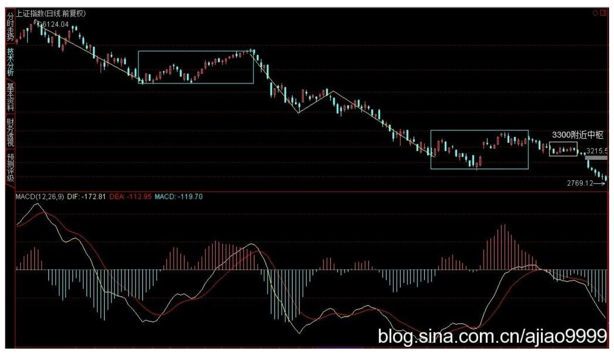

神但并不一定是科学的形态。宇宙中存在着更多非科学也非神秘主义 的东西,但科学是人生的底线,连科学都糊涂,那真是白活了。 至于 股票的运行,在本 ID 的理论观照下同样是很科学的,该怎么样就怎 么样,没有任何含糊的地方。这几天一直没有出现有力度的反弹,而 只要你看看30 分钟以上图的 MACD,就知道这是理所当然的,因为真 正大点级别的背驰根本没出现,60 分钟上甚至连背驰段都说不上,这 样怎么可能有大的反抽? 后面具体的走势,如果你真喜欢预测闹着 玩,那也很容易,从 3786 点下来这最后一跌,显然要走出至少两个 中枢,否则这还是前面中枢的震荡,这就还不是最后一跌了。那么。

现在在 3300 点上有一个中枢了,因此,这一轮下跌要完成,最标准 的走法,就是先反弹出第二个中枢,这个中枢的波动区间基本没可能 回补缺口,然后再一次破位,形成真正的背驰。当然,上面说的是两 中枢的标准下跌情况,如果外围因素恶劣,出现多中枢的下跌,这也 是理论所保证的,关键看第二中枢第三类卖点后是否真正背驰,这在 当下很容易判别。至于还有不破位,直接小级别转大级别的情况,那 是第二中枢出现第三类买点的情况,这种不常见的情况万一出现,都 在理论的可观察范围内,所以还是充分把握的。

以上说明,如果有任何看不明白的,请虚心去读书,亏钱是自己的, 看不看也是自己的,最后的本事也是自己的,就自己看着办吧。 虽然 理论是本 ID 个人发现发明的,但本 ID 的理念从来都是知识是全人

类的,个人不应当藏着掖着,所以本 ID 把理论逐步公开,只是为了 知识是全人类这个信念,和任何的同情或怜悯无关,因此学习得益的 也不需要感谢本 ID,就像你学会了平面几何,也不需要去感谢欧几里 德。至于有人要千方百计去证明平面几何的错误,那也是无所谓的, 这总比打麻将和傻忽忽跑到股市中亏钱强,对本 ID 的理论也是一样 的。 真诚与谦虚才不会有眼无珠 (2008-06-13 16:11:04) 先说大 盘,其实该说的前几天都早说了,唯一可以补充的是 2524 点是 6124 下来的 3600 点,附近应该有强力的中线支持,如果 6124 点下来的 第一段跌幅和这次的最后一跌相等,那么 1345 点的下跌位置大概就 在 2430 点附近,因此,中线的强支持在 2500 点一带,是否最终跌 到这个位置并不重要,关键是昨天说的下跌节奏,下周的首要任务, 就是形成这轮下跌的第二中枢,否则,一切免谈。 操作是一种精细的 活,那些囫囵吞枣之辈肯定没戏。直到今天,竟然还有人自以为是地 拿着自己所理解的所谓"走势必完美"来这里献丑,请好好把课程都 先学一遍,看看本 ID 说的究竟是什么意思,里面有好几个课程专门 说这个问题,可惜和这些人理解的无关。 阉割 (2008-06-23 18:52:18) 股市没什么可说的,具体的判断已经多次说明,这里不妨 再说一次:中线已经进入 6124 点下来大调整的最后阶段,当然也是 最惨烈、最杀人的阶段,否则怎么会有大的反弹?短线,3700 点上下 来的下跌进入第二中枢的震荡,一旦出现背驰将宣告调整结束进而展 开对 6124 点大调整的总修正过程,也就是一个超级大反弹。但必须 指出,这个超级大反弹的高度并不一定令人满意,因为其形态一旦走 出三角形,那么第一段的向上就是最大的幅度了,最坏的情况下,上 次 3300 点上的第一中枢就足以阻挡这个三角形的进一步向上拓展。 这种以时间换空间的反弹当然是最坏的,却是不得不注意的,因为大 跌后出现三角形的几率,在中线较大周期从来都不是罕见的。 357

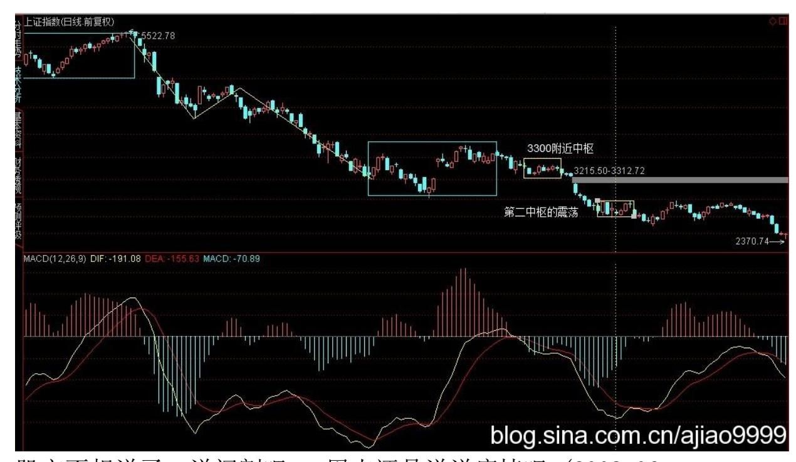

股市不想说了,说阉割吧。 周末还是说说病情吧 (2008-06- 2716:40:23) 昨天的帖子,引用旧帖子的时间上出了点差错,谢谢有 人指出,现在已经修改。关于不到 20%达到破 6100 点当天时值的话 是在 6124 点出现前一天,也就是去年 10 月 16 日"6100 点终破, 无憾矣"的帖子里,特此说明一下,也顺便为本 ID 有点偷懒,引用 前没切实核对时间道歉。 就这事情,顺便也说说对待批评的态度。本 ID 刚看到了昨天为这事情还有人吵了起来,其实,就算批评的人本来 就不怀好意,故意找茬来的,但应该注意的是客观而不是主观。人主 观怎么想,那是他自己制造自己的业力,该怎么承受是他自己的事 情,但客观至少指出了一个错误,有错就要改,这是一个最基本的做 人原则,否则都如现在某大国的金融管理层一样,错了还要死撑,那 就可笑了。 更重要的是,有些网友出于维护本 ID 的角度,用一些不 雅的词语进行争论。本 ID从来不介意不雅词语,但本 ID 要请这些网 友想想,如此激动地维护本ID,是否在深层次上是维护着自己。这里 一个显然的逻辑就是,因为你觉得本 ID 是好的,而你更认为你认为 本 ID 是好的这种看法是正确的,一旦有人挑战这种看法,你就觉得 受不了。因此,实质上你维护的是你自己看法,和本 ID 毫无关系。 而本 ID 是否好,这和任何人的看法都没关系,就算千万人觉得本 ID 如何如何,都和本 ID无关。 所以本 ID 是不需要维护的,就如同本 ID 的股票理论,如欧几里德几何一样无须维护。那些囫囵吞枣的人, 认为这理论如何如何,就如同他们面对一条几何题时,出现任何反应 都是正常的。欧几里德几何的正确从来不保证任何人都能正确地证明

任何一个几何问题,本 ID 的理论一样。如果你没能力去证明一条几 何题,而怀疑欧几里德几何进而心生怨恨,那是你的业力,就自我承 担吧,没人能替你的。 至于股市,2945 点破不了(娇:日顶分上 沿),继续中枢震荡,那是好事情,又给了一个短差的机会。你可能 说,这短差你做不来,那做不来就小板凳,做不来还要做,什么后 果,顺便找个医生问问就知道。 再说一次,今年开的是短跑运动会。 更再次强调的是,中枢震荡的操作原则是,向上出现次级别甚至次次 级别的顶背驰或盘整背驰先出来,反之,向下就是再进去了。如果你 一定要和这个原则背着来以显示对本 ID 理论的厌恶,那本 ID 一点 意见都没有。按照这个原则,你去看看所有的中枢震荡包括这一次, 有哪次是有意外的?忍着没去桌球,赶回来写帖子 (2008-07-01 22:56:39) 虽然本 ID 对各位并没有任何的责任与承诺,但这么多日 子,毕竟有了感情。说实在,本 ID 现在应该和朋友在玩桌球的,想 着如果今天没有帖子不太好,就匆忙赶回来了。 在医院,没有事干, 写帖子的动力比较强。出来了,到处都有好摆弄的东西,本 ID 爱好 又多,但本 ID 会尽量坚持写帖子的,虽然这样对本 ID 本身伤害比 较大,但这也认了。 大概还有很多人关心市场的走势,其实现在市场 的走势,在 N 周前已经明确说过,而市场也一直按部就班走着。如果 不明白的,就多看看课程,就知道什么是第二中枢后再走背驰这种走 势为什么是最标准的,现在,这种最标准的走势就如同教科书一样走 着,看过本 ID 课程,都应该对这种按部就班的走势有所了解,所以 本 ID 确实没有太多可说的。 当然,从最严密的分析角度,大盘当然 有可能走第三中枢,但这个前提就是这次按部就班的破底不能形成标 准的区间套背驰,而这,只要看过本 ID 课程的,都应该能当下轻松 判断,不构成任何的操作困难。 这里,必须把理论上严密确认的最后 一跌后最小的反弹幅度事先指出:按照本 ID 的理论,一旦这次的下 跌最终完成,针对 6124 点下来的最低反弹理论确保幅度是必然回到 2990 点之上,换言之,只要这反弹以相应级别回到过 2990 点之上, 那么,继续下跌下去,都是理论所允许的。

(娇:禅师解盘认为这里出现了 30 分趋势背驰区间套,但是实际走 势没有到 2990 上,形成第三个 30 分中枢) 360

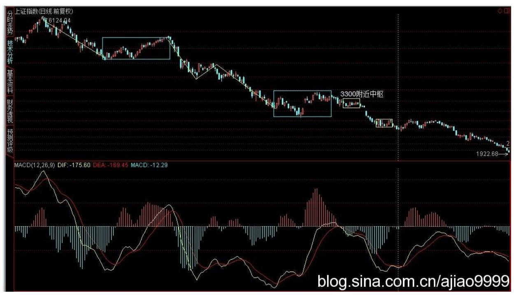

注意,由于这里文科生理科生太多,对理论的严密性与实践中的经验 性分别不清楚,因此本 ID 必须严重指出,除了上面的理论严密下的 2990 点的 100%确保幅度,还有一个实践中的经验性幅度,就是整个 下跌的 1/3,这肯定不是 100%保证的东西,但实践中确认,一般都有 90%以上的准确性,因此,这个幅度,就是一个参考性的幅度,所以, 本 ID 前面说,这个反弹基本可以回到 3700 点上,但这是在经验性 的角度说的,而在本 ID 理论的确保性上说,只能说是 2990 点。

本 ID 的理论就是几何性的,有 100%的严密性,因此,上面的分别一 定要清晰,否则就白学了。而在具体的操作中,是在 2990 点还是 3700 点,或者更高的位置再结束反弹,那是由最终反弹走势的内部结 构决定的,而前面中枢对应的中枢角度构成双重独立的判断角度,这 两个不同的角度,就构成了一个双确认的理论保证,如同一个联立方 程,理论确认的可能结果就只有极少甚至唯一的可能。 对于看不明白 本 ID 理论或操作熟练程度有问题的人,本 ID 已经给出了两条路 子:小板凳或主动买套并顺势降低成本。目前的大盘的中线判断,本 ID 已经多次说过,从3700 点上开始的这一段下跌就是 6124 点下来 的最后一个下跌(注意,这不是理论 100%确保的,因为可以有大的第 三中枢,但根据基本面与其他判断,基本可以否定这种情况,用最严 密的理论语言,这是一种有 99%把握的判断)。因此,主动买套的操 作在这个最后一个下跌的内部结构出现第二中枢后,已经十分现实, 特别对于大资金,是必须的。 现在主动买套,唯一的风险就是两个:

6124 点下来的下跌出现第三中枢、3700 点上下来的这次下跌出现第 三中枢。无论是哪种情况,主动买套的实际风险其实都没有,因为买 套是分批的,而且每天的波动都有足够空间去降低成本,更重要的 是,无论哪一种第三中枢,都意味着相应力度的反弹,因此有足够的 退出余地。 因此,本ID 再次用最明确的语言宣告,针对那些对精确 应用本 ID 理论有困难的人,现在已经进入必须主动买套的阶段,特 别资金量比较大的,一定要开始分批进入,选择那些已经从高位回落 80%而基本面没有出现重大改变的,例如,本 ID 可以明确告诉各位, 在中国铝业跌破 12元前后,本 ID 就开始回补60 元上下抛掉的股 票,当然,本 ID 的筹码是不断运动降低成本的,但操作的方式是公 开性的。类似的,如600737,来这里的人都知道本 ID 曾严重拥有, 30 多元回跌到 15 元下了,本 ID 当然没有不回补的理由。 严重声 明,本 ID 之所以回补这些股票,只是本 ID 比较懒,只爱反复操作 曾经操作的股票,只要这些股票基本面依然可以操作。而有更多比中 国铝业、6007373更好的股票,各位可以自己去发现,没必要一定要和 本 ID 扎堆,一扎堆,股票就跑不高,这是必然的。 二元经济结构, 中国经济的核心竞争力。 (2008-07-02 15:35:56) 就像最早反对港股 直通车而最终事实证明当时该政策的确实不可行,本 ID 也最早就白 字黑字、旗帜鲜明地反对所谓中国经济存在流动性过剩的谬论以及相 应过度宏观调控的措施。其后的经济变化再次无情地证明,一切经济 措施都有其理论与现实成立的前提,那种照抄西方经济学初级课本的 所谓流动性过剩判断以及相应的过度宏观调控措施,在中国现存的经 济结构中,根本就不存在其现实与理论的相应成立前提,也就注定不 可能发挥实际有效的作用,反而要生出诸多并发症状。 就像一个癌症 病人,最终杀死他的往往不是癌症本身而是诸多的并发症。这些并发 症,基本都是因为不正确的医疗方法所造成,导致最终引发死亡也不 是病死而是治死的。经济调控的道理一样,很多经济失败的例子,都 是因为无的放失、生搬硬套的乱调控最终导致并发症而失控造成的。 任何一个对中国经济有最基本认识的人都知道一个最基本的常识,目 前中国经济是典型的二元经济结构而不是纯而又纯的所谓西方成熟市 场经济模式,这就注定了我们所采取的经济调控方式必然与西方式的 有着重大的区别。纯西药在这里肯定不会特别好使,反而中西结合, 倒有最大可能去实现最理想的调控效果。 在这种二元的经济结构下, 必须注意杜绝任何纯意识形态的偏激做法。中药西药都是药,都是手 段,都是过江之筏,偏执于哪一方面,都是医者技艺与境界低劣的表 现。世界万物,无一不是药,关键是医者如何用之。最理想的当然就 是行之于未病之时,但如果因为各种原因,已经现实地存在于将病或

已病状态,如何无分别地切实根据现实情况用好这世间万药,是对医 者、调控者智慧的最大考验。如果没有这种智慧,只能生搬硬套,那 是比病更严重的灾难,真是国之大不幸矣。 然而,有一点比上述情形 更为重要,就是必须警惕那种企图用一切手续、通过各种包装逐渐改 变中国二元经济结构的做法。二元经济结构,恰恰是中国经济的核心 竞争力,是中国经济这几十年来快速发展的最大秘密之一。那种认为 二元经济阻碍中国发展的言论不过是站在西方所谓纯而又纯的市场经 济角度发出的,实际上,这种理论上纯而又纯的市场经济,在西方的 历史与现实中都从来没有稳定地存在过。

而对于中国如此庞大的经济落后体,要追赶西方,唯一可行与现实的 就是二元经济模式,中国经济三十年来的巨大成就与多次化解巨大危 机的成功实践都恰好是在二元经济模式的现实前提下完成的。那种企 图用纯而又纯的西方市场经济模式生搬硬套到中国的做法,比前面乱 调控的更为阴险与有害。 现在,我们的最紧迫任务反而是要继续坚持 与完善这中国特色的二元经济模式。完善的原则归根结底只有一条, 就是必须让二元都强大起来,而不能是单纯的一元强大,否则就完全 违背了二元经济的实质。二元经济的成功,必须存在同时强大的二 元,这样才是真正的二元经济。中国经济的最大风险反而在于二元经 济被伪二元经济所取代。何谓伪二元经济?就是一元畸形发展而另一 元被实际压制,表面的二元而实际是单核化运行。 真正的二元经济, 必然是双核化运行的,而胡乱调控所引发的并发症中最恶劣的一种就 在于彻底破坏双核有效运行的机制。目前,中国经济恰好面临如此单 核化的风险,单核化最终的结局,必然是无核化,一个无核的经济, 注定的命运只能是系统的崩溃。一旦发生这种情况,就算能重装系 统,那也于事无补了。

对本题目展开论述,太浪费时间,还不如玩去。至于今天的大盘,没 什么可说的。如果你对技术有点兴趣,本 ID 可以多说一点,就是今 天收的是典型的连续下跌后新低倒 T 型 K 线,上次出现这种 K 线是 2007 年的 12 月 18日,其后就是 6124 点下来的第一轮反弹的继 续。一般来说,出现这种 K 线,成为最终反弹底部的概率是 70%,这 次和上次唯一不同是上次是二次探底中产生的。如果有兴趣的,可以 收集一下指数在历史走势中出现这种 K 线后的走势,对这种技术形态 的认识就会深刻点了。

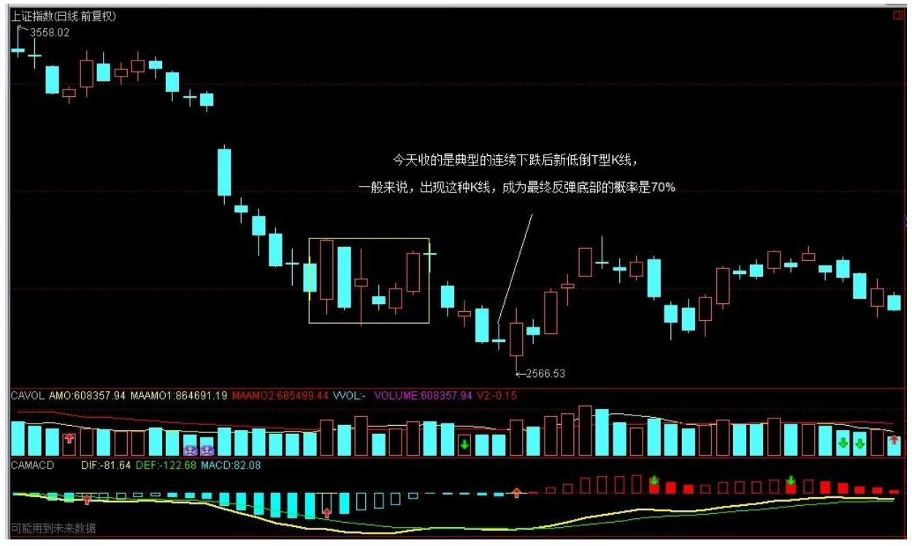

注意,以上的 K 线方法都是一些经验性的东西,和本 ID 的理论没什 么关系,但可以辅助性应用。一般这种应用就如同一个联立方程解出 极少的解,再利用这些辅助性工具,决定其中最大概率的解。但在实 际操作中,关键还是要根据当下走势去判别,而不能先入为主地蒙蔽 了自己的眼睛。 至于主动买套的操作,例如今天冲高出现小级别盘整 背驰就可以用部分筹码做空,然后回来有差价,就把所有的重新买回 来,这样,筹码就会不断增加,当然,如果筹码已经足够多,就可以 保持数量不变,只回补固定的筹码。这种操作的原则就是,利用震荡 把成本降下来,如果要熟练操作,就要好好研究本 ID 课程里关于一 天 8 根 30 分钟线如何构成不同走势形态的章节,里面说得十分清 楚,就不多说了。

资本主义社会形态的二元经济结构 (2008-07-03 15:42:51) 本 ID 的 理论从来都是一而贯之,本 ID 说在经济圈子从来没有同路,就是那 些人的视野都过于狭隘,或被斯大林甚至老毛之类的伪马克思主义经 济学所迷惑,或者就是被西方的无聊弱智经济学所迷惑,这些人从来 都没搞清楚,站在历史与现实角度,这些经济现象与规律的根源在哪 里。 先说股票,今天的低开虽然让昨天的倒 T 不太标准,但最终的 结果是类似的,只是由于今天与昨天构成包含关系,所以使得本来可 以标准生成的底分型需要等待明天去构成。目前关键的位置分别是

2753、2945、3483(注:依次为日周月的分型上沿),分别构成短中长 的关键所在。下周初前,首先要确认的是2753 点这个位置,一旦这个 位置不能有效攻克,短线技术好的就要短差一把,因为再次探底不可 避免。主动买套的,也可以利用这降低成本。当然,如果能有效攻 克,那一轮较大级别的反弹就此确认,接着就看 2945 点的位置,这 个位置后是缺口处,然后才是 3483 点。这一切,都是按部就班进行 的,不能超越阶段。 股票就此打住,继续说二元关系,至于三角关 系,以后会有机会说的,三角关系,比二元关系更大更关键。 本 ID 在 N 年前比"货币战争与人民币战略"更重要的帖子里,就曾前无古 人地、但本质上是纯马克思思路地给出资本主义的两种现实与历史类 型:一、西方式的资本主义;二、列宁指鹿为马而成的披着所谓社会 主义外衣的以反资本主义为口号旗帜的民族主义的资本主义,这种资 本主义无一例外地演变为斯大林式的权力资本主义。 这两种类型的继 续演变与纠缠,就是一切资本主义现象的根源与秘密。所有资本主义 社会的二元现象,无论是国营民营、官办民办、计划市场等等,当然 也无一例外地源自于此。

注意,已经多次反复强调,但由于被所谓常识洗脑的人太多,必须再 次说明,在纯马克思的视野里,现在是不可能存在纯马克思意义上的 社会主义国家的,因为那将是一个资本主义全球化后的一个全球性事 件。社会主义不可能在一国成立,这是马克思理论中不可能改变的必 然结论,一旦改变,就必然蜕变成列宁式的反资本主义而实质是纯民 族主义的资本主义形态,最终也将蜕变为斯大林式的权力资本主义。

二元经济,其实全面地存在于任何一个资本主义国家的任何一个阶 段,但在西方式的资本主义国家里,其中的一元是以潜结构的方式存 在的,而这种潜结构方式的存在,一方面是内部统治愚民性的需要, 另一方面是一种在国家战略与全球化进程中的关键杀伤性武器(这当 然也是本 ID 的独特发现,只此一家的说法,具体的,在以后关于国 家战略与全球化的帖子里再说,这方面的弱智理论太多,本 ID 又要 费工夫去清理垃圾,好无聊呀。) 而斯大林式的权力资本主义中的二 元结构,在一定的文化与历史地缘条件下,反而会演化为民族主义国 家经济发展的强大基础与动力。这些条件是十分苛刻的,例如必须是 大国,有深厚而独特的文化传统等等,一般的国家基本不可能全面拥 有,而中国却恰好完全满足这些条件,这确实是中华民族的幸运之 处。 由于受西方垃圾理论影响的人太多,这里必须再次强调,所谓二 元结构是落后表现的说法不过是一个狭隘角度的无聊言论,二元结构 贯穿在资本主义社会的任何一个历史阶段,在资本主义社会灭亡之

前,都将存在,只是不断演化出不同的历史形态而已,这点都看不 清,活该被西方佬洗脑。 N 年前,本 ID 在那被收集的集子里就已经 明确指出,二十世纪,本质上就是斯大林式的资本主义与西方式资本 主义竞争的过程,最终,后者战胜前者,前者无一例外地向着后者演 化。 注意,这是关键之处了。但资本主义的游戏在历史与现实的客观 条件下,不可能平等地容纳如此多的国家同时以平等的进程与阶段同 时存在,说句大白话,就是地球现在的环境,不可能同时容纳 200 个 美国一样发展水平的同时玩西方式资本主义游戏的国家,这注定了什 么? 这注定了,先进入西方式资本主义游戏的国家,必然要引导出这 样的全球化游戏规则,就是以全球分工为基础的资本式的国家奴隶 制,用大白话说,就是美国这些所谓的先进国家,就要制造这样的陷 阱,让后面这些蜂拥而至的被西方式资本主义天堂所鼓动的国家成为 新全球化秩序中的新经济奴隶。 告诉各位又是本 ID 经济理论严格推 导出来的独此一门的定律:现实总是在环境与结构对抗中寻找最佳的 结构,而奴隶制或等级化结构,就是资源缺乏环境下的最佳结构。

那些叫嚣民主平等的蠢人,却不知道,现实的资本主义是以奴隶制或 等级化结构为真实基础的,内部的社会分工与外部的国际分工构成了 这种结构的表皮。

而一元化的经济结构谎言,本质上就是诱骗后进国家成为奴隶的甜蜜 诱饵。 好了,后面都用大白话说了,因为这是说给所有中国人听的, 希望都能听明白。有了上面的理论准备,用脚趾甲都能知道:如果要 拒绝这种美国主导的资本奴隶化过程,不让中国跌入美国全球化奴隶 结构中的陷阱,唯一的现实选择,就是以不同的经济结构去对抗这种 进程。 中国一直以来的特殊的二元结构,现实与历史、又无意识但却 幸运而尚且完满地实现着这种对抗,这是构成中国这三十年来经济奇 迹的真正秘密。 本 ID 的理论从来都是一而贯之无须修改,N 年前, 本 ID 已经无情地指出,资本主义是可见将来所有人类不可逃避的共 业,而全球化,或用更准确但更残酷的语言说,是以全球分工为基础 的资本式的国家奴隶制,也必然成为可见将来人类不可逃避的共业, 而中国人唯一可做的是什么呢? 本 ID 同样在 N 年前明确指出,中 国人唯一可做的,就是坚决不当奴隶,而是让别人去当,必须在这全 球化游戏中执牛耳,既然奴隶制结构是不可避免的,那么,中国人就 必须历史性地扮演奴隶主的角色,这就是现实与历史唯一正确的选 择。 当然,有些贱人当奴隶也可以当得兴高采烈的。而且,奴隶有大 小之分,有些贱人,就先鸡鸭鹅兔地当了美国人的性奴隶,然后就跑 回来传销式地企图诱骗十三亿中国人兴高采烈地去奴隶,他们就可以

奴隶头了。 中国经济与中国国运最大的风险不是其他,而是被这些贱 人去把持了中国的文化经济政治命脉。中国不能被贱人化,这就是目 前最刻不容缓的事情。 只要中国式的二元经济结构的双核化运行依然 畅顺,中国就是不可战胜的。对中国经济的调控其实很简单,核心原 则就是这个:保持二元经济结构的双核化运行。只要坚持这个原则, 一切问题都将迎刃而解。 但这远远不够,政治与经济的关系问题,国 家战略问题等更深入的问题,依然要继续展开。关于这些问题,以后 本 ID 有心情时,都会展开论述的,今天这帖子也太长了,就算了。

不过可以用下面可能会让很多人背过气去的话结尾:本 ID 的经济理 论如同股票理论一样,同样是可以涵盖一切曾有的经济理论,而且是 一个纯公理化的类几何系统。本 ID 曾经写了十来个帖子,不过连该 理论的序言都没写完,而且这些理论,在目前环境下能出版的可能性 基本没有,写了也白写,就不想写了。

不过可以明确告诉各位,本 ID 的经济理论,只需要两个前提:一、 人需要吃饭;二、人都要死。如果有违背这两个前提的人出现,本 ID 就无须理论了,所以,如果有人发现这种将大面积取代现在的人,请 马上通知本 ID,这样本ID 就有了一个偷懒的理由,不用写那么厚的 一本书,多打点麻将算了。 各位,拜托啦。 侃侃股票\音乐\房价\病 情 (2008-07-0916:06:27) 今天就来个杂谈,先说股票。股票走成这 样,应该都在各位的预算之中,今天继续板块轮动,没什么可说的, 只是想提一个问题,让各位思考一下,明天专门谈这问题:用最简单 的均线方式对现在的股票进行完全分类,从而设计出短线轮动的最佳 操作方式。这类问题都是让你终身受益的东西,请好好思考一下,明 天继续说。 各位应该发现,今天本博客又有了音乐,当然,由于原来 本 ID 的音乐博客所在空间一直关闭,所以,只能随便在网上找点音 乐。前两天说了唱歌,今天特意在网上找来中国老一辈老高音里本 ID 尚能接受的几位的一些录音。为什么都找男高音,因为男高音最难训 练,技术上要求最高,所以可以更好地体会本ID 说的技术要点。其 实,站在纯技术的角度,这些人的发音技术都很有点毛病,但他们的 声音比现在技术似乎很好但千篇一律的声音要好得多,音乐不光是技 术,音乐首先必须是音乐的,否则找一个发声机器得了。现在的男高 音,除了张建一、范竞马、魏松等少数几个还稍微可以,其他都不堪 一听,就让他们自我娱乐去吧。 昨天看房子,发现有人已经开始预谋 反弹了,现在国家的态度很关键,是被劫持还是继续坚定不移(其实 也从来没坚定过,说句不爱听的,秀的成分太多),利益集团肯定是 不会束手待毙的(其实他们在这次所谓的调整中也没受什么伤,只是

清洗了一些虾兵蟹将,真正的厉害角色好象更牛了)。当然,按本 ID 对管理层的认识,他们被劫持的概率太大,一个银行系统就够他们想 的,而实际上,用银行系统的所谓风险来劫持国家,这种把戏搞了十 几年还在玩,而管理层竟然每次都中招不误,你让本 ID 还能说什 么? 银行就是银行,一边股份化商业化,一边还让国家背着,这世界 上哪有这么变态的事,如果有了,这说明了什么?如果一定要这样, 干脆就双轨制算了,专门有几家留下来,福利性质地针对低收入人 群,保证不会倒闭,其业务来源主要以政府性项目提供,这样就基本 旱涝保收。其他银行一律市场化,特别与房地产相关的业务,只能市 场化的银行从事,而这种银行是可以随时倒闭的,一切风险自担,国 家就不背这本无关的玩意了。 如果不这样,国家永远会被人劫持,现 在的利益集团已经逐步国际化,后面的国家层面风险,如果不彻底来 一下,就怕以后想被劫持也没人管你,因为不久的将来,极有可能就 被直接打倒,对打倒的还劫持什么呀? 双轨制当然是很笨的方法,但 却是对应二元化基础本身的,世界上的事情,有时候最笨的就是最好 的,这叫傻人有傻福,怕的就是有些人聪明不来又不肯去傻还占着茅 坑,那就吃某些饭桌上不宜谈论的物体去吧。 最后说说本 ID 的病 情,现在这情况既没有那些天天咒本 ID去死的人希望那样坏,也没有 认为本 ID 有神迹的人想象那样好。本ID 说了,这二三次化疗的三周 间隙,就给我弟去摆弄了,但看来,纯粹药的作用是有限的,三周内 出现根治的效果几乎不可能,而中医当然不止用药一招,但我弟目前 好象只会这一招,而目前残留的位置,药物都很难达到,要有效果, 估计要一年半载地磨下来才行。 而那会十九路的高手,现在估计世上 就没有了,问题是连会十路的好象都没找到,中医荒废如此,真令另 人心寒。暂时,不想直接去找那奇人,最近本 ID左侧开始出现状况, 而这病根,当时那奇人已经事先说过,由于没有找到合适的人,所以 这病根就发展了,不过这不是癌症的问题,更不是肿块,而是这种病 根最终引发了癌症的病根,所以西医要根治,肯定是不行的。不过, 把癌症的肿块削掉,应该还是有希望,所以,就等月末重新开始的化 疗了。 本 ID 暂时不想用纯打坐的方法去根治这病,因为,这样就不 能尝试别的方法的功效,现在,本 ID的身体就是一个实验品,难得有 这种状况和机会,必须珍惜。 370
