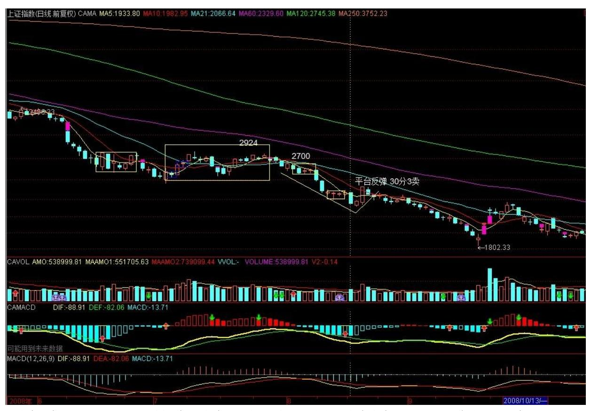

# 教你炒股票 106:均线、轮动与缠中说禅

板块强弱指标 的不一定完全在所有均线之上的,为什么?(各位思考 一下,不要所有答案都依赖本 ID,思考一次的效果比本 ID 说 1000 次答案都要好。) 还是用本 ID 长期反复折腾的股票为例子: 000802、000998、600636 显然是最厉害的第 9 类;600139 属于第 8 类;600578、600607 属于第 7 类,这几天在 89 日线上的调整极端 标准;600195、600343属于第 6 类;600737、000600 属于第 5 类;

而大盘最大周期均线只站上 21 日,属于从最弱数起的第 4 类。 从 这分类可以看出两点,统计一下,目前被 34 天线上下压制的股票是 最大量的,这就提示我们,34 天线对于大盘也是压力很大的,由于大 盘还没到该线,因此这提示就有预示的意义了。 此外,由于每类股票 一旦在 N 类调整,要到 N+1 类,至少有很大一段时间折腾,所以这 就给了一个轮动的最好选择,一旦一个趋势级别的走势在 N 类上出现 顶背弛,就可以先出来一下,至少有几天偷欢的时间可以去找找别的 已经调整可以再启动的股票或者补涨的。 还有一种更重要的,就是根 据板块来,要判别一板块的强弱很简单,就是把类别数平均一下,越 大越强,而这个平均类别数,可以叫缠中说禅板块强弱指标。 最强的 板块属于领涨板块,该板块的动态就十分关键了,此外,把所有板块 的缠中说禅板块强弱指标列在一个图上,其轮动的次序与节奏就一目 了然了,根据这并配合具体股票的走势分析来,轮动操作当然就极为 简单了。 以上操作,用电脑设计一个程序是很容易解决的,这就不是 本ID 应该为各位准备的事了。面包的制作方法说了,没理由让本 ID 还把面包烘好一个个喂吧,各位就自己糕点一把了。 说说股票和咒语 (2008-07-11 11:46:05) 先说一句梦话:该修理都会被修理,该被王 先生的最终都王先生,当然,时候未到,过了该过的无聊节目,真正 的修理才会来的。本 ID 什么都没说,梦话一段,千万不要当真。

下午要去理疗,没时间写帖子,抱歉。 确实,如果你脑子里已经有了 期盼,那么什么理论都是白费的,因为你甚至可以把刀子的白光看成 了情人桥下那一轮月光。昨天中午就出来的帖子,这么多话,当然主 要都是针对长期来说的,都是你终身受益的东西,但例子里也顺便给 了短线的重要提示,可惜似乎看到的不多,竟然很多人,在今天明明 要构成顶分型的时候还谈论轮动,虽然这顶分型最终不一定延伸为 笔,但其中的风险是理论性存在的,因此这时候脑子里风险是第一位 的,就算有轮动也可能是刀口舔血的勾当。 股票不是吃饭,一顿不吃 就饿得慌,理论是让你心里不受贪婪恐惧影响,别明明是刀子都跑过 去大吃一顿。请好好重温这两段:"从这分类可以看出两点,统计一 下,目前被 34 天线上下压制的股票是最大量的,这就提示我们,34 天线对于大盘也是压力很大的,由于大盘还没到该线,因此这提示就 有预示的意义了。" "此外,由于每类股票一旦在 N 类调整,要到 N+1 类,至少有很大一段时间折腾,所以这就给了一个轮动的最好选 择,一旦一个趋势级别的走势在 N 类上出现顶背弛,就可以先出来一 下,至少有几天偷欢的时间可以去找找别的已经调整可以再启动的股 票或者补涨的。" 例如在昨天下午,一个品种出现短线顶背驰又接近 压力线(娇:34 线),应该干什么?如果这品种恰好是大盘指数,应

该干什么?注意,帖子可是中午就给出了,这是一个很好的现场例 子,不管你如何了,但一定要记住这个例子。 今天,除非下午大幅度 起来形成包含关系,否则这顶分型就构成了,因此最关键就是 5 日 线,不有效破就不形成笔,就会再冲一次 34 天线,否则将形成笔的 调整,那就等笔对应的短线出现底背驰再说了。 昨天下午正确操作, 现在就不用左右为难,左右为难的操作都是因为节奏不对,因此,节 奏是一个永远的主题,高手还是低手,最终考验的就是节奏,轮动只 是节奏的一种方式,而最重要的节奏,还是买卖点,一切的节奏都必 须以此为基础,当然轮动也不例外。 本不想说股市,因为确实没什么 可讲的,但这时候发帖子不说两句,好象也不好。不过,说了也白 说,例如,周末本 ID 把之定义为搏消息,结果就很多人不乐意,你 说能让本 ID说什么好? 大家如果想听好话,本 ID 这里没有,对不 起了。本 ID唯一知道的事情是,无论什么理由,别说那无聊的什么 运,就是天王老子下凡,走势如果不体现出底部,就没有底部。每个 人都企望来一下所谓的奥运行情,然后胜利大逃亡,都这样想,谁埋 单?那些说奥运要到 8000 点的,现在死了多少了? 真正的钢铁战 士,只看走势本身,一切都在其中反应,如果连这都遵守不了,就别 学什么理论了,买把扫帚去证什么会门口无间道去吧。 本 ID 也不想 再说本 ID 理论那些高深的道理,就用最简单的均线,5 日线都上不 去,能有行情?还有,现在最明确的技术提示就是 MACD 准备 0 轴破 还是不破、破了是否假破这类老哈姆雷特问题,要看清楚行情,只要 搞明白这问题就可以,在这没决断之前,你急什么? 本 ID 不想培养 懒人,MACD 的用法说过多次,自己去判别,真明白的,现在一看就知 道该怎么安排后面的操作,做不到就学习。打针得一律,记录下来。 (2008-08-04 15:26:00) 短线关键 2762 点(附诗人画廊(七):孟 郊) (2008-08-0615:38:08) 短线大盘已经很明确,2924 点下来这段 至少其第一段在今早的小背驰段区间套完美后就结束了,现在短线的 关键点是 2762点,只要这点不有效站住,大盘短线依然将面临短线盘 整歇息后的第二段下跌;反过来,一旦有效站稳该点,则第一段结束 的反弹就至少延伸出日线上的笔,也就是至少是有一定力度与时间度 的,至于是否有更大的可能,那是以后图形要告诉你的事情,没必要 现在去预测。

打针时候骚扰了一下孟东野,就有了下面的七律,附录如下吧:先 下,再见。 2762 点,大盘短线已到临界点 (2008-08-08 08:23:58) 昨天,一个包含性 K 线,构造出短线的第二类买点后回拉到 5 日线 附近,大盘短线已到临界点。当然,最干脆的走势就是今天中长阳突 破 2762 点确认笔走势,而反过来,若大盘依然在 2762 点下犹疑,

那最晚下周初,大盘中继中枢扩展完成后向下延续新一段跌势就理所 当然了。所以,今天开始三天内的走势是短线必须密切关注的。 中线 来说,已经三次探底,一般性地,即使从概率的角度,如果还有第四 次的探底,那破底的概率至少是 95%。所以,这基本就是多头的最后 一次努力了, 就看如何收场了。 操作上,见买点就可以介入,冲不 上去就把货倒给多头让多头去死,这就是目前唯一正确的操作。而没 这短线本事的,或者就把持仓位每天继续折腾差价降低成本,或者就 继续小板凳,自己根据能力选择吧。 本 ID 现在早对那些什么会审美 大疲劳,快点完、别惹事就谢天谢地了。如果一定要让本 ID 说真 话,那就让为资本全球化画眉贴金的末世大铺张见鬼去吧!中华民族 的大复兴无须这种恶心的堕落背书!先下,再见。 苦口良药,预演后 奥运断崖走势 (2008-08-08 15:20:58) 今早,有人企图用为什么深成 指四次探底就破底而上海没破之类的烂问题刁难本 ID,不知道今天的 走势算不算一个回答?本 ID 也想问,为什么你就不会完成以下的填 空:"既然深成指都已破罐破摔,那么 还远吗?" 什么叫断崖走 势?这几天本ID 的长篇文章不断提到这个词,大白话就是破罐破摔, 信心一致崩了那还有什么不可以摔的?本 ID 早上说冲不上去就把货 倒给多头让多头去死,有人反问为什么要多头死?多头不死,哪里有 大底?问题是,你为什么要站在死多头一边呢,世界如此宽广,你为 什么要陪多头死呢? 多头是什么货色,请看: 你别砸盘,不然对你 身体不利!(2008-08-08 14:21:32) 拜托,先照顾好自己吧,本 ID 的健康就不劳烦了。 苦口良药,什么会都养不起 13 亿中国人,今天 不过是一个预演而已。如果真为中国、中国人好,那么就吸取教训 吧,股市不算什么,经济断崖才是真正可怕的,过了今晚,面子也有 了,干点实质的事吧,中国 13 亿人要吃饭的,一天都少不了,一顿 都少不了,像今天中午那些饭还是少吃点吧。 为对抗经济断崖而努 力,这是 2008年 8 月 8 日唯一需要的口号。一个刘某、张某某、赵 某某都大肆招摇的玩意,爱啥是啥吧。 密切关注买点出现 (2008-08- 11 07:54:18) 2762 点下的三角反弹构成 2924 点下来的第一个中 枢,然后是新一段的下跌,那么,后面的演化无非两种:两段力度对 比(30 或 60 分钟),后一段强于前一段,则还需要一个中枢后的下 跌背驰才有机会完成2924 点开始的下跌;反之,则 2924 点下来只是 盘整走势,只需要一个中枢,其后将快速回到 2679点之上。 大的角 度,目前 7 月 3 日开始的中枢震荡暂时还没出现第三类卖点,依然 可以看成是该中枢震荡的延续,除非 2924 点开始的向下次级别走势 类型完成后,其后的次级别反弹不能重回该中枢,才能确认中枢的彻 底破坏。 因此,综上所述,目前最大的短线机会,就是 2924 点下来

的走势类型结束点构成的买点,其后至少有一个 2924 点下来同一级 别的反弹。密切关注短线买点,就是本周最大的任务。 看不明白上面 所说的,也有两种途径:一、张某某去吧;二、虚心把课程真正读明 白。 本 ID 可以自豪地宣告,本 ID 的所有财富都是靠自己的智慧从 毁既得利益者手中抢来的,要击毁他们,就是要把他们的血吸光,资 本市场是一个最公平的地方,关键你是否有如此的智慧。 没有智慧, 就等着陪葬,这有什么可说的?当然,自我有清楚认识,危险之下坚 持小板凳,也是智慧之一。自知之明,从来都是最大的智慧。没能 力,练能力,没人可以替你。先下,再见。 断崖走势继续让短线买点 逼近 (2008-08-1115:07:35) 今早已经让各位看 30 或 60 分钟图判 断力度,从那 60分钟不断伸长的绿柱子,只要是人,都知道下跌的动 能依然强大,因此,早上说的第一种情况成立的可能性越来越演化为 必然性了。 最坏的情况,本周只有 2700 点那中枢破位后的第二中枢 反弹(一般来说,这走势明天、最晚后天盘中就出现),这反弹的力 度,甚至不能触及今天的高点,然后再继续暴跌;而第二中枢后,一 旦出现背驰,就意味着更高一级别的买点出现,这买点,最小是 2924 点下来第二中枢级别,至少能构成 30 分钟上的笔走势。(最坏的情 况下,最迟下周初就一定出现,一般情况下,如果不是最坏,本周出 现的概率很大。) 但这个反弹的出现,如果只是 2924 点下来的第二 中枢级别,那么后面还有下跌去构成背驰完成 2924 点以来的下跌走 势,其后的更大级别就是所谓 7 月以来大中枢的次级别反弹将是最为 重要的,(娇注:30分中枢的 5 分级别反弹)是否构成第三类卖点, 就看这次了,一旦构成该卖点,后面还有更断崖的下跌。(注:实际走 势为此类 30 分中枢3 卖点后断崖下跌) 时间上看,要不出现这种第 三类卖点,就看政策是否明白事了,如果还幻想,还开幕式,那就如 那无聊变态的烟花一样眼花吧,让断脚断腿漫天飞舞,这比烟花好 看。 如果要严格分析,本次上海也是典型的四次破底,只是第二底比 6 月 20 那第一个要低,这是弱式盘整经常会碰到的。关于盘整形态 的问题,以后在课程里再详细说。 股市开幕式地预演着断崖,本 ID 前段时间反复说的断崖是否蔓延到经济领域,就看某些人的表演了, 有本事就如同开幕式那天发 1000 多支火箭来做假天气,本 ID 很想 开开眼,拜托了。 经济基本面给了调控下台阶的机会 (2008-08-12 15:21:43) 大盘今天走得极为规范,如期出现昨天说的盘中反弹以构 成 2700 点那中枢破位后的第二中枢反弹,后面请注意了,这里严格 说将有两种演化可能:一、最规范的就是破该中枢,然后再分两种可 能,形成背驰见更大级别底形成更大级别反弹,不形成背驰就继续下 跌去形成第三中枢,一般来说,后一种情况出现的概率不会超过

10%,而且是否形成背驰,可以很直观地判断,根本没有模糊混淆的可 能,除非你根本没搞清楚背驰的判断。 二、不大规范地的,就是直接 从该中枢第三类买点扩展成更大级别的反弹。这等于标准的下跌走势 a+A+b+B+c 中的 c 不出现,读过课程的都知道,只要有A 和 B,a、c 不出现不改变下跌的性质,趋势与盘整在于中枢数量,这是最基本的 常识。

同样地,第二种情况的概率也不超过 10%,按中枢震荡的判别原则, 第三类买点与第三类卖点都分辨不清楚,那就根本没看明白课程,补 课是唯一选择。 看明白上面的内容,后面的操作就得心应手了。当 然,具体个股与指数的节奏可能不同,这也是最基本的常识,那就各 自去分析了,本 ID 不可能把个股也分析了,没那时间。 今天 CPI 有比较好的数据,油价、汇率都有了有利的变化,这也为某些人准备 了台阶,下不下就是他们的事了,不下,市场是不会给面子的。所 以,从基本面上看,短线反弹是有了些条件了,但中线的关键还是要 低头、下台阶,否则给脸不要脸,只能撕破脸了。不说了,看着办 吧。 确保经济高增长已刻不容缓 (2008-08-13 08:28:09) 春节后写 了要通胀还是要经济增长 (2008-02-28 15:53:15),当时就很尖锐地 指出高通涨低增长死局的潜在可能与危害性,在错过了诸多有利时机 后,很不幸地,现在这种风险正日益迫近。现在,已经别无选择,当 时已经给出了当下最现实的模式,高增长高通涨,然后在此基础上逐 步利用有利时机改变经济结构与利益分配机制,使得结构性通涨的压 力消解。无论如何,确保经济高增长已刻不容缓,不想死得很难看, 这是唯一实际的选择了。 最近,对经济增长的再次强调逐渐有了较大 的声音,这是好事情,但其中依然有诸多的摇摆,这是十分糟糕的, 机会不会无条件地等你觉悟,因为迟疑,多少机会浪费了,而这会有 什么报应,难道真想见识吗? 对于像本 ID 这类人,经济断崖不过提 供一次大量买入超廉价资产以提供下次济热潮的筹码而已,但对于绝 大多数的国人,那可能面对的就是生存问题了,这不是危言耸听,而 是经济变动极可能出现的状况,大难几乎都在兴高采烈之时,这难道 还少见? 本 ID很希望自己错了,但无数的事实证明,本 ID 对经济 的判断从来没错过,只不过本 ID 都很早就提醒,而绝大多数人却依 然沉浸在梦里,难道一定要经济大地震才醒来? 股市方面,对于超短 线,看好 30、60 分钟形成底分型后上边沿的位置是否能有效站住, 一旦站不住,超短线依然要继续下探。这一简单的招数,用在日线上 曾经让多少次短线操作最终能胜利大逃亡,这在以前屡次反弹中,本 ID 用短线关键位置是多少曾演示过多次,一定要把握好。当然,如果

你对本 ID 的理论有很深入的认识,有更精确的方法,但对一般性的 操作,这招数简单又有效率,不把握就浪费了。

这两天准备出院,诸多事情,明天开始就不可能一天两帖了,抱歉。 第二级别反弹教科书般降临 (2008-08-13 15:23:14) 今天的走势,前 面都描述过了,没什么可说的,这极为标准地构成了前面所说那三级 别反弹中的第二个,也就是构成 2924 点下来的第二中枢那一个。今 早特别强调了底分型的用法,今天的走势教科书一样,各位如果还闹 不明白的,就从 15、30、60 一直看过来,研究去吧。 最大那个反 弹,也就是前面大中枢的次级别反抽,同样有两种可能:更大底背驰 或从今天构成的中枢直接上去,分析和昨天说的那小级别的道理是一 样的。

从大盘的实际走势,显然并不是最恐怖那种,本周已经出现第二级别 的反弹,因此就是一般性走势,后面的操作无非是从这第二级别反弹 成功逃掉然后再抄更大级别也就是第三级别那个底,如果你真有本 事,这三级别的反弹你完全可以根据本 ID 的理论按照如此美妙的节 奏自如地完成,现在达不到,就继续训练,没有什么东西是可以随意 达到的。 至于经济,某些人爱干什么是什么,只要你有本事,越跌越 赚钱,既然有人这么乐意送钱给咱们花,为什么要拒绝? 有时候,让 大浪自然去淘沙,可能更有意义,浪淘尽千古风流人物,现在又有谁 是千古风流人物呢?这和你的官位、财富无关,某些人有点自知之明 吧! 最后说句狠话,之所以有人敢于如此,就是没人需要为经济出大 问题负责任,因此就占着什么不什么了,那就随它去吧! 106 课缠师 的解盘及回帖:什么才是真正的"和"? (2008-08-14 08:03:14) 学 东西,必须搞清楚细节。就像现在,依然有 N 多人把分型上边沿站稳 作为最好的买入点,却搞不清楚,恰好相反,这只不过是判断是否延 伸为笔的一个简单判断法,如果说买点,必须从走势类型去判别,分 型上下边沿之类的东西,最多就类似于第三买卖点,因此以这当成买 卖的根据,将不时面临买后第二根 K 线就是转折的尴尬。道理很简 单,如果抛去包含关系,6 根 K 线就可以构成笔,而确认站稳上下边 沿的那至少是第 4 根,而转折在第 5 根,这意味着什么,不是很简 单的问题吗? 因此,各种方法,必须知道其使用范围,在什么情况下 如何用是最有效率的,否则如此囫囵吞枣,不亏钱真是没天理了。课 程里也有单纯用分型的不同级别,用类似区间套的方法确定买卖点的 方法,这可不是单纯的上下边沿判别,千万别搞糊涂了。 股票糊涂 了,大不了就亏点钱,如果一些基本概念糊涂了,又当成国家的战略 依据,那真是国将不国了。像最近被反复口淫的"和" ,被解释成所

谓的"和谐"之类的可笑玩意,甚至为所谓的"和平崛起"去依据, 简直是祸国殃民。 "和" ,是相应的意思,这在最基本的《说文解 字》就有的意思,最后被阉割成"和谐"之类的废柴,大概也成了宋 以后被长期凌辱的最好注释了。 何谓"相应"?就是根据当下实际的 条件,给出的最适宜的行为,简单地说,就是构成"相互应和" 。最 简单的,对垃圾、衣冠禽兽就要彻底清扫,而不是去"和谐" ,这才 是相应;世界历史证明,"大国崛起"从来就没有"和平"的,当 然,现在可能可以进化成经济、金融的战争,但这更不"和平" ,所 谓的"和平崛起" ,真是不知所谓,可笑之极。 你只要想"崛起" ,就有人不让你"和平" ,从各方面折腾你,这是最基本的常识和世 态,企图掩盖,究竟想蒙谁呢?美国之类的会让你的口号忽悠吗?最 终害的不过就是自己而已。 要"崛起" ,其"和"其相应就是斗 争,斗争不一定都是大规模的对抗,斗争本来就是一门艺术,只是你 是否把握而已,这点与把"和"折腾成口淫版的张某某之类人,根本 没什么可谈的,就让他们继续口淫快乐吧,但这皇帝新衣必须指出 来,让更多国人知道,这群人是如何光着腚子相互淫乱以让他们的利 益继续既得的。 至于股票,该说的都说了,自己修炼吧。今天下午没 帖子,可能要等明天或后天早上才有了,抱歉。

分型上边沿再起神奇作用 (2008-08-18 15:09:52) 十分感谢各位的关 心,这边的问题,无论多难,本 ID 都会尽量处理好的,毕竟机会难 得,是否最终如愿,就看是否有此善缘了。 今天大盘值得各位好好研 究,周五所给的日底分型上边沿不能站住将继续探底,今天的走势已 经给出最好的阐释。而这个探底,在最开始的三级别反弹分析中已经 仔细分析过,这一般有 90%可能性走势下面预防的走势无非是不能形 成背驰从而只能先有第三中枢的问题,因此,明后两天走势极为关 键,一旦延续跌势力度,那么第三中枢的可能性就很大了。反之,就 那次级别的反弹就将展开。 一定要注意,这次级别反弹可能只构成原 来大中枢的第三类卖点,其后将是更猛烈的下跌,第三类卖点后最好 也就是构成更大级别中枢,因此,这反弹相面对的风险还是需要留意 的。 从基本面上看,时间刚好极端配合,这次级别的反弹,最弱的就 是平台式的,也就是连 2500 点都碰不到,然后基本对应上那什么会 结束,最后的机会给管理层,如果还如此,后面不第三类卖点才怪 了,这点必

须有清醒认识,而这在原来三级别反弹的分析中已经明确指出过,市 场显然与我们的分析完全合拍。

不说了,本 ID 现在的任务是学习、治病,顺便看管理层的反应,一 切都在分析之中,没什么可继续说了。先下,再见。 382
