# 教你炒股票 108:何谓底部?从月线看中期走势演化

(2008-08-29 09:15:01)何谓底部?这里给出精确的定义,以后就不会 糊涂一片了。底部都是分级别的,如果站在精确走势类型的角度,那 么第一类买点出现后一直到该买点所引发的中枢第一次走出第三类买 卖点前,都可以看成底部构造的过程。只不过如果是第三类卖点先出 现,就意味着这底部构造失败了,反之,第三类买点意味着底部构造 的最终完成并展开新的行情。当然,顶部的情况,反过来定义就是。 此外,用分型的角度同样可以给出底部的概念,只是这粗糙一点,对 一时把握不了精确走势类型分类的,这是一个将就的办法;此外,一 般性分析中,这方法也可以用,因为对把握大方向已经足够。 站在分 型的角度,底部就是构成底分型的那个区间,而跌破分型最低点意味 着底部构成失败,反之,有效站住分型区间上边沿,就意味着底部构 造成功并至少展开一笔一上行情。其实,这都不是什么新鲜内容,但 这里统一说出来,还是有好处的。同样,顶部反过来就是。 注意了, 有了这个定义,就一定要搞明白,不是在底部的区间上买,而是相 反,应该和中枢震荡的操作一样,在区间下探失败时买,这才是最好 的买点,连这都搞不明白,就白学了。此外,底部是有级别的,日线 图上的底分型,当然就对应着分型意义上的日线级别底部。 现在就有 一个现成有意义的例子,2008 年 8 月这月 K 线基本走出来了,显 然,9 月是否能构造出底分型,关键是看这个区间(2284,2952), 其中 2284 点是绝对不能破的,一旦破了,就马上宣告月底分型至少 要到 10 月后才有戏。

因此,即使 9 月没到,我们已经可以有一个大致的操作强弱分类空间 了,只要回 2284 点不破的任何分型意义上周级别以下走势,都必然 成为一个良好的短线买点,而且其中可以充分利用类似区间套的方法 去找到最精确的买入位置。

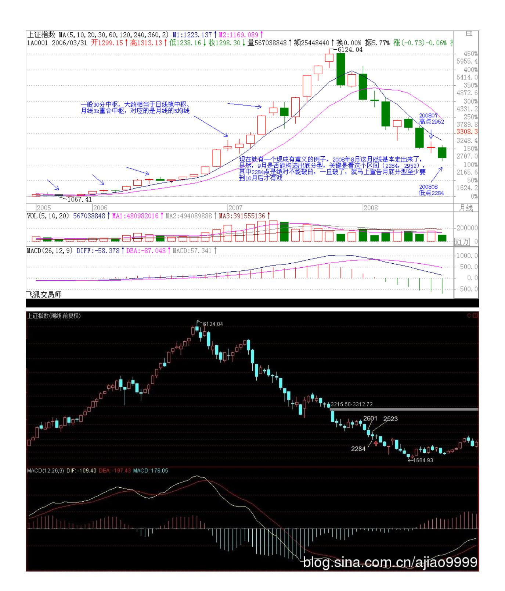

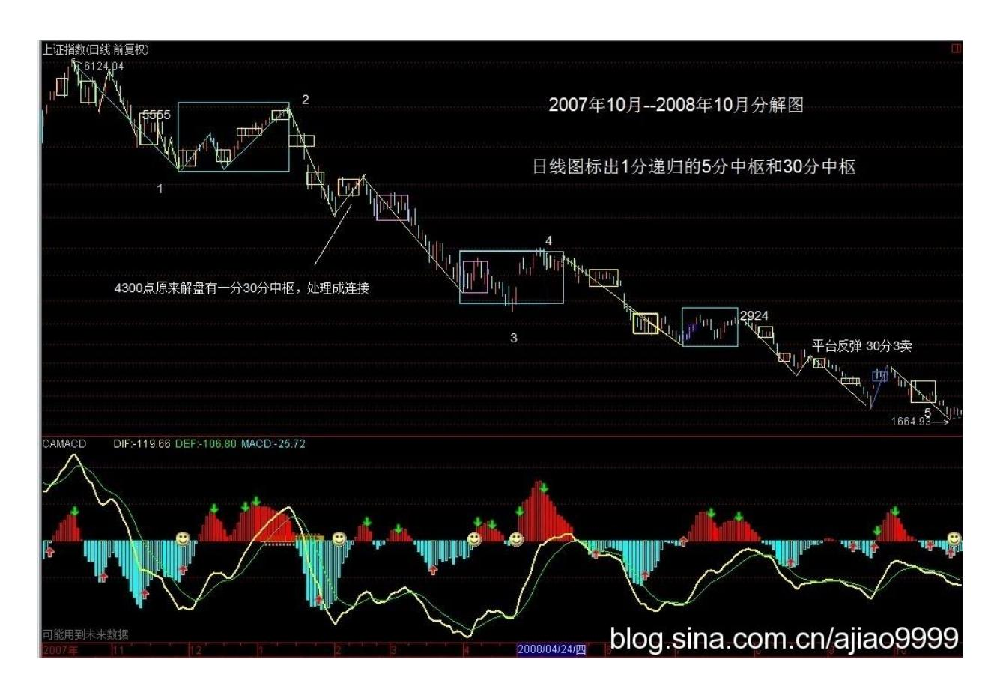

同样,马上可以断言的是,在 10 月有效确认站住 2952 点前,月线 意义上的行情是没有的,最多都只能看成是分型意义下月线级别的底 部构造过程。因此,这对我们操作参与的力度与投入就有了一个很明 确的指引。 当然,对于一般投资者,月线图太大了,因此可以看周线 图,例如,本周与上周比,到目前为止就是一个包含关系,因此,到 下周是关键的能否构成底分型的日子,而真正要走出底部,那还需要 对(2284,2601)突破有效的确认,也就说,在中秋前,要确认一个 分型意义下的周线行情是不可能的,除非今天,本周最后一天能突然 突破 2523点,否则就绝对不可能了。

从更短的日线看,目前无非就在 8 月 18 日开始那底分型引发的底部 构造中,是否最终有效,就看(2284,2455)区间走势的演化了。

从月线看中期走势演化 操作其实很简单,一个基本的原则就是,任何 走势,无论怎么折腾,都逃不出这个节奏,就是底、顶以及连接两者 的中间过程,因此,在两头的操作节奏就是中枢震荡,只是底的时候 要先买后卖,顶的时候要先卖后

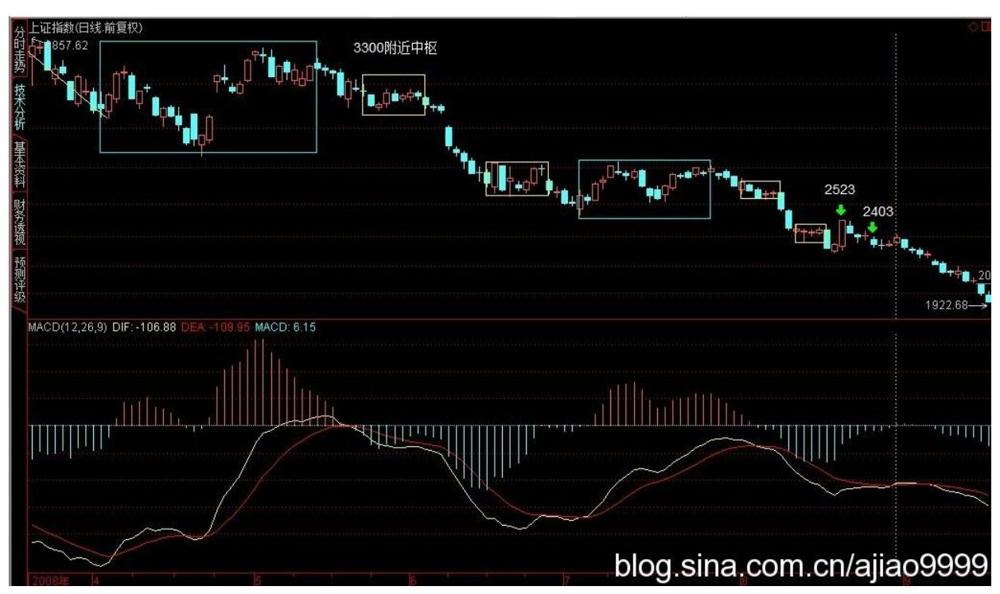

买,这样更安全点。至于中间的连接部分,就是持有,当然,对于空 头走势,小板凳就是一个最好的持有,一直持有到底部构造完成。 而 有技术的,根本就不需要什么小板凳,按操作级别,分清楚目前是三 阶段中的哪一段,然后日日是好日,时时是花时,不赚钱那真是脑子 有水了。亏钱都是错误操作引起的,不断反省,才会有进步的。 超短 线就看周一及 2403 点 (2008-08-29 15:11:47) 今天,继续周末消息 市,由于外围造好,就有了比较强的盘面。现在,最基本的,超短线 就看周一能否站住 2403 点,能就极大机会延伸出日线图上的向上 笔,2523 点是下一个重要位置。更大时间的分析,请看今早的文章。

大盘当然已经暗潮汹涌,你看中信证券,大盘没动,也快上来 30% 了,没人搞是决无可能的。其他不少中字头的也如此,但是,这搞是 有分寸的,就是万一管理层真不给面子,翻脸就可以不玩,成为新的 下跌动力。现在的大资金,只要比配合理,都是十分自如的,一有机 会可以狂飙突进一次,没机会、不给面子就继续砸出机会,谁怕谁 呀? 总之,现在不要一边思维,有能力的要多活动,大盘在大的底部 构造中,机会多多,来回几次,比来一次大的都好玩,最后再在大的 上面狠咬一口,那又够一年半载消费了。 另外,有一种错误的思维一 定要消灭,否则死无全尸。千万别有等下一大级别再如何如何的想 法。10000点跌到 6000 点反弹到 8000 点,然后到 2000 点再反弹到 4000点,你说相对 6000 点到 8000 点,2000 点到 4000 点是不是大 扬?但这有什么用?不会分段操作,一味死扛的根本不该到股票中

来,股票就是分段操作的,下一段就算有天大的宝贝,都和当下这一 段无关,任何的操作只关心当下的苹果,吃到就是英雄,否则就是垃 圾。

人,总爱编造一些故事来给自己一个支持的理由,那都是弱者的表 现,在本 ID 这里,只有当下的走势,任何所谓的预测,都是闲谈, 活动一下唾液的分泌功能,这已经说过无数次,如果还不明白,那真 不能股票了。 而实际上,对于真正的操作者,本 ID 每天后面写的, 等于是一个操作的完全分类,任何操作必须以完全分类为基础,否 则,只有死路一条,也说过无数遍了,又有多少人真正机械地做到? 周末中医一把,本 ID 的绝对前无古人,有时间可以先把抽象代数复 习一下,本 ID 的中医是以抽象代数为基础展开的,当然其中不会用 到相关术语,但思路是一样的,这才能构造真正的中医基础。 股票是 几何的,医学是代数的,世界就是这么简单,如此地数学了。 退一步 海阔天空 (2008-09-01 15:56:14) 关于本 ID 坐骨神经的最新进展, 后面有附录。来本 ID 这里,首先就要有最基本的科学精神,科学精 神你都做不到,还如何能破科学而进入更高的境界?本 ID 这里一是 一、二是二,只看实际效果。 至于股市,周末搏消息的又一次失望, 因此就自然有了今天的走势。对消息,不能急,你想大爷们的工作效 率,就算真想干点什么,能快得了吗?退一步海阔天空,没什么不好 的。 纯技术的角度,已经明确分析过了,就是要有较大行情,必须月 线闹出底分型来。如果本月初破上月底,并不是什么世界末日,反而 使得这底分型更有力点,行情早一月晚一月其实并没什么大不了的。 试想,如果本月不破底而硬搞一个分型,那么本月就需要拉一长阳, 你凑在图上看看,总让人感觉不舒服不塌实,现在硬上去,弄成包含 关系的可能更大,这样,后面反而会使得真正底分型来临时间更遥 远。所以,有时候急了并不是什么好事情。 从纯美学的角度,10 月 见底是最美的,因为刚好对应一年周期,顶和底一个完美的周期,当 然,9 月其实也可以,因为周期是可以正负一两个月的。站在这个角 度,在月初砸一次破一次,对长期走势来说是件大好事。当然,这只 是从美的角度说,至于市场怎么选择,市场说了算,实际操作中,根 本可以不搭理这些事情。 下午有朋友打电话过来,说他到了一中央级 最重要之一的经济管理部门的杂志当头,那杂志是每个大国企以及大 企业的头都会看的,希望本 ID 给他们写点什么。本 ID 有更好的渠 道,本对这事没兴趣,想想,这可能也有点用处,专门写就算了,有 些老东西改装一下弄过去就可以。各位有什么好的想法,也可以说 说。本 ID 和他明确说了,他也知道本 ID 从来很少给什么杂志写东 西,就算偶尔为了加大吹风力量弄的,也是闹着玩的,所以和他的合

作不可能固定,本 ID 也不要他的稿费,反正想到有东西给他,他能 用就用,不用就算,这样比较自然点。 他专门问了本 ID 对调整的看 法,因为他知道本 ID6100 点做空以后一直不感冒这市场,所以问本 ID 调整还有多长时间。因为是朋友,就直说了。如果真要重新来过, 那是 N 年以后的事了,现在唯一可以等待的是 MACD 在月线上回 0 轴后产生的中级回拉,这时间也快到了,狠的,就等 17、18 月,也 就是明年3、4 月开始;不太狠的就是 10 月前后了,这关系到周期运 行的问题。

至于是什么时候,关键是看管理层的作为,如果吊儿郎当的,那就狠 吧,一切都是因缘和合,可没有任何必须的东西现在就规定行情如何 如何。 这里说的是大的走势,至于周线以下级别的走势,更没什么可 分析,以前都说得很明白了,没必要预测什么,看图,那里什么都 有。 好,关心本 ID 坐骨神经的朋友,请看过来。 奇人那一下很有 效果,但效果没有持续到足够让本 ID 满意的程度。这里有一个客观 因素,就是酒店的床太软,本 ID 要求更换木板床,说没有,晕。什 么治疗后,一睡那床估计都要反复。闹不好,本 ID 要在地上睡了, 在地上铺好了,可能会好点。 昨晚,比较痛苦,打了两针竟然也没起 作用,后来还是本 ID 自己解决了问题,把穴位用东西封上,结果一 晚安稳,当然,奇人把一些东西弄回去了也是很关键的,否则本 ID的 招数也用不上。总结一下,奇人弄好后,一是没睡到正确的床上,二 是大采购过于劳累,把刚弄正确的位置又搞偏了,所以这次先用本ID 的招数控制着,等奇人两天后来再最终处理一下。至于今晚如何,天 知道,不过本 ID 已经开始喜欢这游戏,就是如何当下地处理好这问 题,然后得到一晚的安睡,这是多有趣的事情,目前状态可以,就看 晚上了。 5 日线控制超短线走势 (2008-09-02 15:15:15) 今天差点 没破底,然后扭捏了一天,但深圳破了,只要没有半夜鸡叫之类突发 事件,破是迟早的事情,快的明天开盘就实现。上海现在的超短线走 势就看5 日线了,5 日线站不住,这轮杀跌就没完。所以,如果懒 的,就看 5 日线足够。 其实,大盘现在走成怎样都没什么意义,因 为没量,就算现在一直阴跌下去,一旦回头,很快就可以回到目前的 位置。关键还是月底分型的最终结果,其他都没多大意义。 本 ID 很 高兴能一直写这博客,例如现在,孤身一人,在这每天写两句,总有 一种温暖的感觉。十分感谢各位的建议,这让本 ID 感到和各位同在 经历一些事情的感觉,很好。 大的说,现实中的人都是可怜之人,否 则就不会因业力牵引而成就人的生涯了。人,有苦有乐,乐最终还是 苦,在本 ID看来,所有人都如同无端流放于荒野的一群,互相之间能 相互帮助,一定是人间最美的事情。所谓同体大悲,无论你是谁,最

终的意义上,和本 ID 有着共同的共业而因此落于地球之上,这是多 大的因缘,所以,能就此因缘而共同走出这生死迷局,这才是人生真 正有意义的事情。 本 ID 的心和各位是同在的,同悲同乐,无论谁, 有幸突破这生死轮回,都无一例外地广渡,这里,任何的争吵算计都 如此无聊,站在生命的根本上,人生很多事情都会放下的,您呢? 不 破不立,反弹可期 (2008-09-03 15:14:03) 大盘终于破底,这使得月 线底分型最快也要到 10 月才能构成,但站在短线的角度,反弹反而 有了技术基础。当然,这类反弹都是纯技术性质的,属于短跑型,能 否参与就看各自的技术了。 2329 点是短线关键压力,站不上去将继 续弱势,从纯心理的角度,如果反弹前能有一段急促下跌,那么其后 反弹的力度将更有操作性,但目前,破底后追 杀的动力不足,市场完 全进行一种麻木状态,这时候,行情没有太大的稳定性,最终还是归 于折腾。 大盘真没什么可说的,本 ID 这几天状态一般,主要是要和 坐骨神经斗争,暂时是棋逢对手,还没分胜负。人生中最难熬的大概 就是这种状态了,首先你不知道平衡什么时候打破,而你又不能松 懈,否则平衡马上就破了,所以只能熬着。这就如同现在的大盘,就 是熬着,谁能最终熬出头,就是胜利者。 但在熬之中,胜利只是一种 安慰,唯一可能的,只能去欣赏、享受这种煎熬的状态。站在审美的 角度,熬的状态其实真的很有趣,那种无声的生命相搏,不知道后 果,只能一路前行,没有退缩的机会,这种状态在人类历史中成就了 无数的奇迹,想想贝多芬,几十年不断严重的耳聋,一种没有边际的 熬,最终成就了最伟大的作品。真正的作品,都是生命熬出来的汁 液,所以才如此纯美。 本 ID 别无选择地一定继续熬下去,坐骨神 经、癌症等等一一熬破,好一场生命的游戏。

对经济调整的严酷性决不能掉以轻心 (2008-09-04 15:30:25) 股市整 天说也没意思,今天一个包含关系日 K 线,基本的分析和昨天是一样 的。 说点别的,就有了下面的内容: 现在,无论世界还是国内经 济,都进入一个较大级别的调整,这点已经是无须讨论的现实。经济 有涨有跌,潮起潮落,本是正常的事情,问题的关键在于,如何用最 好的策略对应对这不可避免的调整,使得最终的调整痛苦程度减到最 低,甚至就此借力达到调整总体经济结构,培育新的经济增长点,为 新一轮的经济上升做好充足的准备。而要做到这一点,首要的,必须 对经济调整的严酷性有成分清醒的认识,任何的掉以轻心都可能导致 灾难性的结果。 现在有一种极为有害的观点,认为现在资产价格已经 大幅度调整,其他经济指标也没有进一步恶化,因此本轮调整将很快 过去。而事实上,任何的有一定级别的经济调整,最终的资产价格都 不是刚好回到所谓合理的水平,而是大幅度地折让,这正如任何一次

资产价格的上升热浪,总要把价格抛向远离合理水平的疯狂状态,而 下跌时的道理是一样的,市场总是以不理性的行为为其基础,而这种 非理性的状态才是最有杀伤力的。任何以资产价格已经充分调整为理 由,都不足以说明经济调整的结束,甚至往往意味着一轮更残酷的非 理性下跌的开始。 402 而这轮的经济调整,从走势形态上看,并没有 出现加速恶化的状态,而是在不断的犹疑中徘徊,而这种状态,往往 意味着更大的风险还在后面,一旦这种状态被打破,经济不可避免地 进入加速调整中,在这加速调整还没有出现前,任何对经济调整结束 的断言都是可疑的。 更重要的是,一次较大规模的经济调整过后,总 是有一段漫长的恢复期,而这恢复期的杀伤力,往往比调整期还要严 重,那是一种磨和耗的状态,一种没有边际的、失望与希望交替的煎 熬,那才是最为惨烈的,能否耗过这段时期,决定了经济下一轮增长 能否顺利起步并占有最有利位置,因此,即使调整结束了,也决不能 掉以轻心。 而这轮调整,在世界范围内,越来越显示出其级别之大, 甚至有可能是1929 年以来最为严重的一次经济调整。而这次调整,同 时纠缠了各种政治势力与经济利益的博弈,最终将决定今后数十年世 界政治、经济利益的再分配,所以,站在国家战略的层面,是绝对不 可以掉以轻心的。经济,从来都是政治的,特别在这全球化的背景 下,老的经济格局越来越束缚经济的发展,如何破局、如何在此中谋 取最大的国家利益,这才是关键所在。 中国当然有足够的资源与国运 在新的世界经济格局中占有更为重要的地位,但这并不是可以不劳而 获,这并不是一个已经在天上挂好一定要掉到中国头上的馅饼,要达 到此目的,任何的松懈都是不允许的。 而中国整体的经济结构,还远 远达不到基本完善的状态,里面还藏有诸多严重影响经济调整顺利过 度的结构性弊端,就此,大力调整经济结构,把不合理的结构性弊端 清除,理顺整体经济关系,这里有大量的工作需要去完成。 站在资本 全球化的大格局中,本次中国经济面临的调整的复杂程度是前所未有 的,诸多国际性因素将在其中起着前所未有的作用。而很多因素,并 不是中国一国所能控制的,而中国由于完善的整体经济结构并没有完 全确立,所以其中存在的诸多漏洞可谓防不胜防,在这种状况下,非 系统性风险随时存在,这是最难把控的。 要应付如此复杂的局面,观 望、犹豫、甚

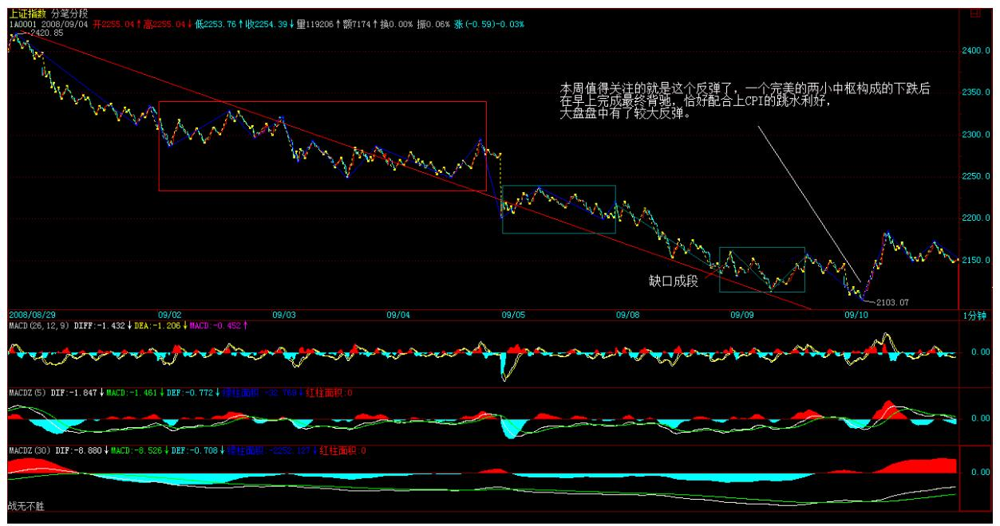

至随波逐流、坐以待毙都是没有出路的,必须首先确立明确的调整思 路,使得调整以尽可能少的代价完成,然后动用一切资源确保调整按 照可控的范围内进行,而中国目前的经济状态,完全有能力做到这一 点,只是时机不能错失,否则代价极为昂贵。 有足够的理由相信,风 雨之后的中国将更有力量,但现在的问题是,必须首先安全平稳地度 过风雨,否则光叨唠风雨之后见彩虹,是毫无意义的。而风雨,真正 的风雨可能还没真正到来,而我们已经有足够的准备了吗?从月线看 中期走势演化 2220 点决定最终反弹级别高度 (2008-09-1011:18:07) 下午收盘就要走。所以先说两句。 上周已经明确说过,本周值得关注 的就是这个反弹了,一个完美的两小中枢构成的下跌后在早上完成最 终背驰,恰好配合上 CPI 的跳水利好,大盘盘中有了较大反弹。显 然,后面受阻 5 日线,因此,下面的任务是 5 日线的攻关。但最终 决定反弹级别与高度的还是 2220 点,站住,级别就大,否则就将再 次回探。 从最恶劣的情况看,最小级别的升幅已经完成,所以 5 日 线能否攻克是这两天的关键。基本面应该有进一步的好转,如果各方 面能配合上,最好的 9、10月构成月底分型的过程就能实现,但就不 知道某些大爷们是否又出妖蛾子了。看图作业,多想无益。

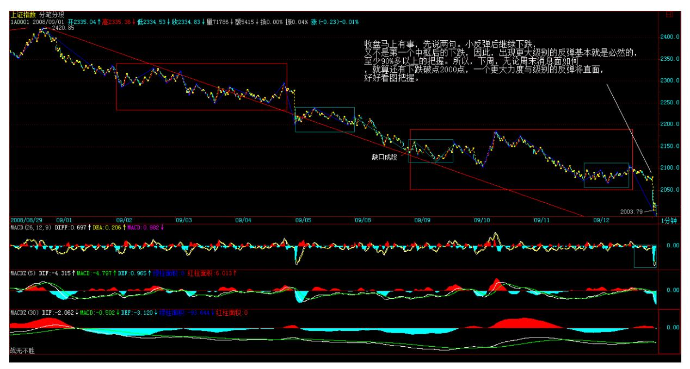

何谓底部?从月线看中期走势演化 5 日线继续主宰大盘短线 (2008- 09-11 16:14:14) 终于回到广州,早上 5 点半到,一到酒店公寓,就 知道英格兰队的喜讯,一天心情大好。 股市还是逃不掉 5 日线,这 在昨天中午已经特别强调。这次反弹的技术性由此可见,昨天中午强 调最恶劣情况下,最基本升幅已经达到,结果大盘无情选择最恶劣的 情况,这是理论所允许,感情所必须接受的。 任何理论允许的情况, 就要时刻面对接受,这点是最基本的准则,下面,由于反弹构成较大 中枢后继续下跌,因此下一次买点就要站在这新级别上看,各位自己 去数数在这级别级别上已经有多少中枢,然后该干什么一目了然。 还 是那句话,无欲无求,按图作业。 好了,本 ID 要找录像或重播了, 上次搞德国 5 比 1 看了现场,这次刚好错过,一定要补课。

直面更大级别反探 (2008-09-12 12:59:29) 原网址:

http://blog.sina.com.cn/s/blog\_486e105c0100afx0.html 住酒店公 寓而不是家里真是最正确的选择,这里,一切设备都有,服务又好, 省了太多的麻烦,弟弟也专心于本 ID 的食疗,效果很好,武汉有这 里 30%的程度,本 ID 也不至于跑回来了。好事多磨吧。

收盘马上有事,先说两句。小反弹后继续下跌,又不是第一个中枢后 的下跌,因此,出现更大级别的反弹基本就是必然的,至少 90%多以 上的把握。所

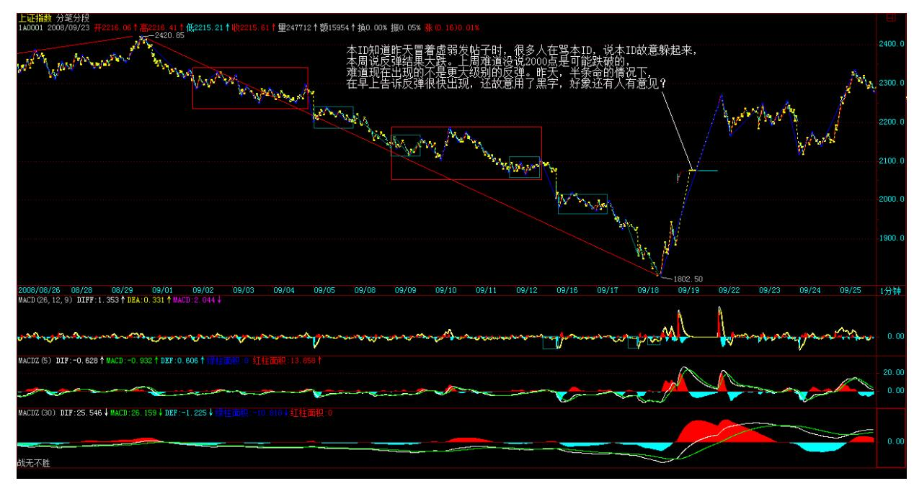

以,下周,无论周末消息面如何,就算还有下跌破点 2000 点,一个 更大力度与级别的反弹将直面,好好看图把握。

好了,开盘了,先下,再见。

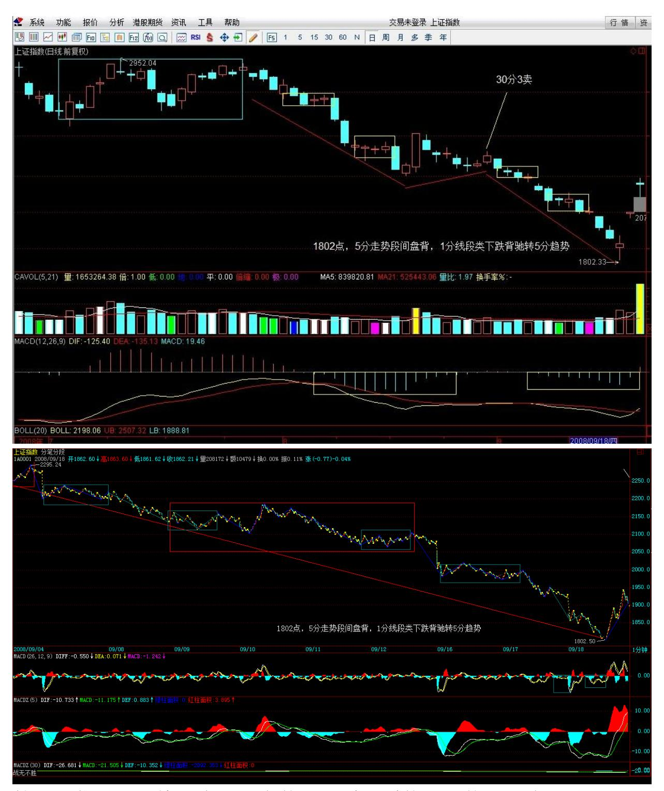

算了,你赚不赚钱和本 ID 有什么关系?爱什么是什么。昨天进去 的,咬一口就要跑,当然,跑也要看图的,没卖点你跑什么?因为, 美国方面并不稳定,所以一定有反复,短跑就是跑了还可以进,一切 看图。以后都自己学技术,自己看图,这种半条命上来暗示的事情永

远不会有了。明天,有帖子,写一些亲人之间的血腥,有时候本 ID可 能太善良了。

从月线看中期走势演化 请记住 1987 年的股灾发生在 10 月 19 日 (2008-09-18 10:26:15) 身体没有完全调整过来,但这几天市场风雨 飘摇,虽然和本 ID 没什么关系,正乐见其跌,但还是勉强写两句, 让各位心里更明白点。 奥运前,本 ID 提出断崖论,9 月 4 日又就 几位所谓著名经济雪茄的无聊言论给出了对经济调整的严酷性决不能 掉以轻心 (2008-09-04 15:30:25) ,这些都请重温。而且反复提出, 一旦美股跌破 10000 点将发生什么?这几天看来,那 10000 点已不 是什么钢板。 请记住,1987 年的股灾发生在 10 月 19 日,今年恰 好 21 年的神奇数字,这也是为什么本 ID 对经济一直担忧的一个重 要理由。短线反弹很快就有,但关键还要看外围,国内从某种程度上 已经被美国所左右,这是本 ID 反复强调一定要避免的,结果还是没 办法,天要下雨,随它去吧。 当然,就算股灾,也没什么大不了的, 87 年之后还不涨了 20 年?所以,10 月见底依然有可能,只是需要 更猛烈的暴跌,否则,真要等 17 月周期了。 短跑好的,注意很快就 有的反弹,抢一口就跑。另外,密切注意世界消息面的变化,看这次 老美用尽气力能搞点什么? 中美联手后的潜在陷阱 (2008-09- 2114:16:40) 原网

址:http://blog.sina.com.cn/s/blog\_486e105c0100aj12.html 世界 经济最大的秘密之一就是共和党收割财富,烂摊子由民主党收拾。这 次中美联手的最终命运取决于大选。反正用的纳税人的钱,小布才不 心疼。 联手制造的反弹过后,是否一个平台期还是新一次真正毁灭的 开始,其实早被老奴隶主所算计。好戏总是情节百转,有钱就赚,有 戏就看,关键脚底要牙买加,这样,怎么都可以了。 话说多没意义行 情级别分析,该说的都说了,各自领悟吧。 行情级别分析 (2008-09- 22 15:13:38) 原网址:

[http://blog.sina.com.cn/s/blog\\_486e105c0100ajgn.html快](http://blog.sina.com.cn/s/blog_486e105c0100ajgn.html)速说两 句。6124 点下来只出现过一次周的笔反弹,因此,最大期望就是这次 能制造第二个。具体自己去分析。把握了这个级别,后面的操作就很 明确了。本周会有一次较大震荡,这是短线需要注意的。

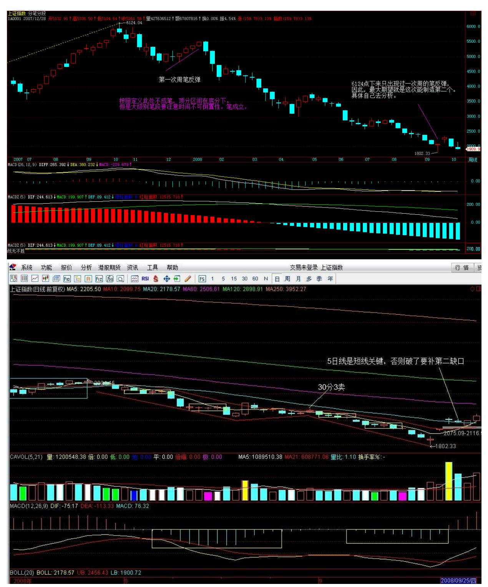

如果中美联手都搞不出第二次周笔反弹,那就成经典笑话了。但具体 看图,不要有成见。好了,最关键点已经说了,具体自己操作。 真正 的震荡还在后面(2008-09-23 15:40:14) 昨天吃了片安定。没想到困 到现在,10 年前,一瓶下去,还可以继续去吃喝酒,真是没法比。真

正的震荡在后面,有心理准备。5 日线是短线关键,否则破了要补第 二缺口。

从月线看中期走势演化 不想说了,困。 今天见到了神 (2008-09- 2414:38:08) 原网

址:http://blog.sina.com.cn/s/blog\_486e105c0100ak52.html 中国 烧钱,美国画饼,这叫中美联手,现在唯一值得看的闹剧是,美国会 不会顺便把这些整持的套在这个位置。5 日线,股票就这样了。 今天 有幸,我弟在争吵中暴了一句,这几年美国鸡毛鸭血是他背后一手造 成。本 ID 现在不敢面对了,已改称其为神,这日子真没法过了。不 说了,消业吧。

最终解脱了 (2008-09-25 20:14:17) 原网址:

http://blog.sina.com.cn/s/blog\_486e105c0100akm3.html 股市不破 5 日线继续天经地义地上攻。这次主要注意是否背驰。现在,日笔是 没有问题了。本 ID 说的周笔看有没有机会吧。关键看美国是否继续 使坏了。

有些事情不想说了,今天在地下爬了几个小时,这就是调养,悲哀。

一切解脱了,狗一样活者,还不如打破。亲情太重,无福消受, 不当 美国佬的刹车片。(2008-09-26 10:32:38) 美国佬的把戏在本 ID 关 于联手后陷阱的帖子中已经揭示,显然,王先生这次真的虚竹了一 把,不过是太嫩那种,被美国佬耍了把。但美国佬的把戏还是蒙骗不 了本 ID,美国佬送的钱本 ID 要了,中国政府以后死顶如十几年前 777 的闹剧,那种伤心钱就算了。 后面的行情都是 777 精神的重 演,就算继续,也是悲烈的。只要美国佬继续发狠,那闹剧可能就成 悲剧,下陷阱后困兽犹斗的感觉不好呀。 这是一场国际性的大棋,自 己想去吧,本 ID 不在其位,残躯一具,休养好了。 美国救市,闹剧 一场 (2008-10-05 17:01:24) 中国放假七天,美国参众两院来回折 腾,引得旁观者一惊一乍,终于通过了一个饮鸠止渴的救市方案。但 世界金融市场并没有太领情,当天多以暴跌报收,且不管本次救市效 益如何,现在必须追问的是这就是说 8500 亿的救市基金难道是天上 掉下来的馅饼? 本次世界经济大调整必须明确的是,最终的任务应该 是彻底摧毁几十年来统治世界经济的美元体系,美国经济之所以走到 这一步完全是自作自受,以前多次的经济危机都因为美元体系的存 在,使美国能够把危机转嫁到全世界去,除了保持绝不正常的超前高 消费和高消耗的经济生活模式,而这种模式已超越了地球及世界经济

体系的承受力,这种美国消费世界埋单的格局到必须打破的时候。而 这次美国故伎重演不过是企图继续维持原有的模式,而美国原有的模 式以及这几十年来以美国为主导的世界经济格局不彻底改变,本次世 界经济危机将没完没了,终难有解决之时。 现在 8500 亿的救市方案 通过了,但这 8500 亿绝对不是天山掉下来的馅饼,它归根结底来源 于美元泡沫的继续加大,本次世界经济危机的根源归根结底是美元已 经彻底泡沫化,最大的风险和危机就是美元本身,而这 8500 亿不仅 使美元的泡沫化加大,使得包括中国在内的其他国家美元资产外汇储 备全面爆发危机。更会使得世界金融市场的流动性以乘数效应急速增 大,使得石油、粮食、黄金等商品价格面临进一步的疯狂上涨,最终 加速美元泡沫的破裂,从而带动商品泡沫的破裂。使得世界经济迅速 倒退的危险境地。 面对这种危机的情况,中国应该采取正确态度是不 跟风,绝不把自己绑在美国的战车上,而且目前的救市方式是极端错 误的。政府不应该直接运用基金方式进入市场本身,而是应该积极培 育和领导新的经济热点,使得流动性资金有更多可参与的领域,进而 大量吸引外来正欲脱离美元体系的资金进入。只要控制好该类资金的 有足够长的投资周期,提供良好的投资环境,使得资金沉淀于比美国 更有前途的中国高速发展的潮流之中。那么大的蓄水池一新兴的、以 人民币为基础的大的世界火车头才得以确立。美国的危机应该成为我 们加速发展的契机。 现在特别要注意的是,目前政府介入股市的局面 已经形成,因此必须好好把握好的推出时机,以免重蹈九十年代"七 七七"救市的覆辙。 只要我们能以我为主,对美国的闹剧只看绝不参 与,只防美国闹剧引发的经济危机对中国经济的伤害,那么我们就有 足够的理由和信心在这场世界大风暴里保存实力,调整经济发展模式 和结构。使得在风暴过后能迅速以新的姿态快速进入新的经济增长周 期。 416

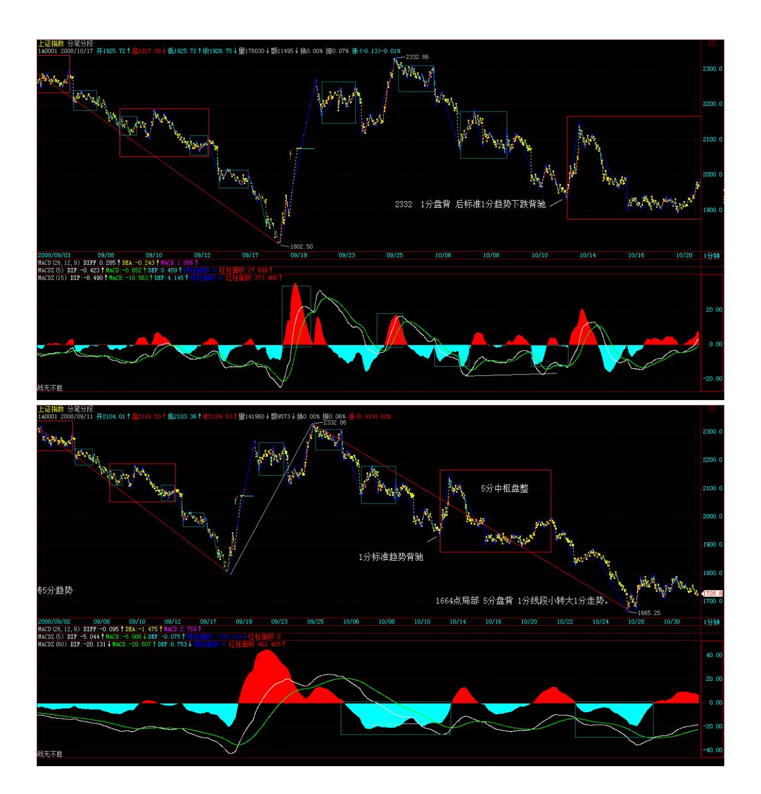

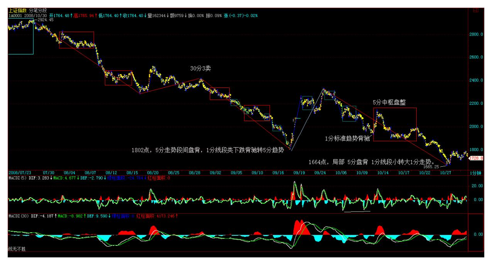

419 无话可说 (2008-10-10 09:24:36) 原网 [址:http://blog.sina.com.cn/s/blog\\_486e105c0100ar8b.html](http://blog.sina.com.cn/s/blog_486e105c0100ar8b.html)

继续看图\短跑,美国破万确实如期壮观,1019 前后还有什么,等 着。顺便问好。

### 缠师心法荟萃

(摘自悟多整理的缠中说禅博客回复)

# 一、心态

- 1. 一定不要追高买股票,一定要有这样的心态,它爱长多少是多少, 权当这股票不存在。
- 2. 股票只有两种,买点上的股票都是好股票,否则就是垃圾股票;大 级别买点的就是最好的绩优股,耐心等待股票成为真正的绩优股,这 才是真正的心态。
- 3. 本 ID 反复强调过,心态最重要。很多人明明知道不是买点,就是 手痒忍不住,这就是心态问题,不解决这个,任何理论都没用。
- 4. 心态要稳,对股票、点位都不要有感情,只看市场的信号。应该对 买卖点有感情。技术好,如果资金又不大,例如可以按 30 分钟操

- 作,那什么时间都不存在晚的问题。
- 5. 失误的原因永远与市场无关,找原因,只能找自己的原因,任何一 次失误都要马上总结。
- 6. 没有技术保证的心态是傻子心态,傻子心态最好,见什么都没反 应。智慧指引下的洞察才是心态好的唯一保证。
- 7. 为什么不能把自己变成狼,这和资金大小无关。只要你能买点买、 卖点卖,就是最凶猛的狼。
- 8. 操作,一定要冷静,有钱,什么都有,还怕没有好股票?

# 二、市场、节奏与参与者

- 1. 市场里,任何的侥幸都只能是暂时的,而且会被市场所加倍索还, 面对市场,不经过一番洗心革面,是不可能战胜市场的。
- 2. 急着挣钱的心理是市场参与者的大忌,连自己的心都控制不住,对 自己的贪婪、欲望都不能控制,是不能在市场中长久成功的。注定绝 大多数投资者都是被市场愚弄的,而所有被愚弄的,都是陷在市场 中,被自己所迷糊。这些人,所有的行为都被分类为多空两种形式, 当自己拿着股票时,思维就被多头所控制,反之,就是空头的奴隶。 而市场的情绪,就是由此而积聚、被引导。脱离不了这种状态的,永 远成了不真正的市场参与者
- 3. 市场里,好习惯是第一重要的。一个坏习惯可能可以让你一度赢 利,但最终都是坟墓。别怕机会都没了,市场中永远有机会,关键是 有没有发现和把握机会的能力,而这种能力的基础是一套好的操作习 惯。
- 4. 市场考验的是长期的赢利能力,而不是一次爆发的能力,关键是长 期有效的交易策略。买入时要把各种情况想好,持有要坚决,卖更要 坚决,这才能逐步提高。是你炒股票,不是股票炒你,先从自己下 手。
- 5. 市场只会给耐心者以回报;股票是需要养大的,天天要新股票的, 肯定永远是小资金,小打小闹。专一点吧,每天跑来跑去的,一定挣 不了大钱。

- 6. 本 ID 只知道跟着市场的节奏舞蹈,只要跟着市场的节奏,在刀锋 上一样可以凌波微步。节奏,永远是市场的节奏,一个没有节奏感的 市场参与者,等待他的永远都是折磨,抛开你的贪婪、恐惧,去倾听 市场的节奏。只要你能按照节奏来,没有人能阻击你。市场是有节奏 的,把握当下节奏,没有人能战胜你。
- 7. 在市场中,只能存天理,灭人欲。买卖点是合力的结果,买点出 来,涨就是天经地义,一切事情要按节奏来,先干什么后干什么,是 规矩的。
- 8. 在市场里,复利的力量是最大的,只要有好的心态与技术,复利是 必然的,这就可以战胜一切。
- 9. 市场不是慈善机构。该涨的时候要凶,该跌的时候一样要凶,关键 是你的技术。有卖点不卖就是最大的错误,比有买点不买还要严重。
- 10. 所有情况都逃不过高位背驰卖,低位背驰买,不预测,有股票的,在 短线买点进入,短线卖点出来,这样就可以降低成本.市场中,成本是最 关键的,只要成本不断降低,你将战无不胜。
- 11. 在最顺利时,也必须谨慎,市场永远是风险市场,股票永远是废 纸,任何追高杀跌的行为都是自寻死路。
- 12. 每次大跌,都有人被严重摧残甚至淘汰,这只是市场中最正常的 事情,市场不是慈善场所,从来都是铁血游戏。

# 三、节奏、级别与买卖点

- 1. 节奏是一个永远的主题,高手还是低手,最终考验的就是节奏,轮 动只是节奏的一种方式,而最重要的节奏,还是买卖点,一切的节奏 都必须以此为基础,当然轮动也不例外。
- 2. 操作的节奏是最重要的,操作,归根结底就是买点买、卖点卖。能 否做到,那是技术精确度问题,这个通过实践,一定会不断提高,所 谓熟能生巧。而节奏来源自对级别的清楚认识,没有级别,任何的买 卖点都是白搭,更别谈什么节奏了。
- 3. 用小级别操作的,节奏更重要。你抛了不买回,那还不如不抛,等 大级别的卖点再说。买了就要想着卖点,卖了就要想着买点。如果时

间不够,操作不方便,就要选择大级别的操作。不要玩小级别的,否 则买卖点很容易错过,开个会,干件事就没了。小级别只适合职业、 或至少是半职业看盘的。

- 4. 为什么要看买卖点,为什么要强调节奏,最终都是为了资金的安全 与利用率,这对大资金同样的,而对小资金,掌握了节奏,你的效率 更高。要有效率,必须有节奏,要有节奏,就首先要把握好买卖点。
- 5. 大跌,就把眼睛放大,去找会形成第三类买点的股票,这才是股票 操作真正的节奏与思维。最好就是找有大级别第三类买点的强势股票 (次级别不跌回中枢里面就是,但能不跌回最高点那自然是最强 的)。选股票一定要按技术来找,找有第三类买点的,或至少是刚从 第三类买点起来的。

# 四、本ID 的理论与理念

- 1. 本 ID 的理论永远都是按图办事,没有死多、死空这些无聊玩意。
- 按图操作,走了的,就要继续按图,把该买的买回来。本 ID 的理论 的有效性,通过每一次的震荡,都会无情地告诉你。
- 2. 如果你真掌握了本 ID 的理论,用一个 30 分钟级别的买卖点,操 作 3 次,50%都回来了,关键是你会还是不会。
- 3. 学了本 ID 的理论还像一般人那样抢开盘就是太无聊了。要学会耐 心等待买点。要把这些追高或不在买点买、卖点卖的坏毛病改了,否 则很难进步的。等买点,股票又不是什么,一定要马上拥有的,有买 点再说。没买点,什么股票都是垃圾。
- 4. 抓住中枢这个中心,走势类型与级别两个基本点,其他都是辅助。
- 5. 本 ID 见到背弛就要发狠。一旦有卖点,无论什么股票,本 ID 一 定比谁都砸得狠。对于高手来说,调整最好,来回的机会更多,更好 玩。
- 6. 精通本 ID 的理论后,涨跌的分别就会消失,在里脑子里,只有买 点卖点,没什么涨跌,达到这种境界,就算初步有成了。成为人,首 先就是要摆脱金钱的压力,于金钱而自由。

- 7. 本 ID 从来不让人在非买点买股票,任何好股票也都需要好买点。 本ID 只希望大家都在买点,而且是级别大的买点再买。在本 ID 的理 论里,没所谓空头多头,只有见买点买卖点卖。本 ID 只知道卖点出 来了要卖,买点要买,跌多了,就要考虑密切关注回补的时机了。
- 8. 本 ID 最鄙视追涨的人。追涨,一点技术含量都没有,有本事的就 在第一、二、三买点买;第一、二、三卖点卖。学会了本 ID 的理 论,有什么股票找不出买点的?那才是最关键的。
- 9. 本 ID 局的那些板块(农业、创投、化工、环保新能源、消耗 品),都是国家的经济发展的方向,本 ID 从来不买贵股票,因为本 ID 当然不可能给人抬轿子。而所有的大牛股,都是从低价开始的。本 ID 说 20 以上是垃圾,并不是说 20 以上就没机会,但那些机会是第 二、三、四中枢以后的机会,为什么在个位的时候不买?
- 10. 对于散户,根本没必须长期持有一只股票,那是大资金没办法的 办法。对于散户,如果通道畅通的,最快的方法就是用第三类买点去 操作,杀完一只423 继续一只,不断干下去,不参与任何的中枢震 荡,只搞最强势的这才是散户该干的事情。持有到背驰卖点,然后坚 决走人,等待新的买点。
- 11. 本 ID 所有介入的股票都不会走的,但一定会用震荡减低成本到 0 后继续增加筹码。本 ID 介入一只股票,都是要至少持有两年以上 的,甚至是天长地久,想快,就学好第三类买点,那是最快的。
- 12. 长期投资,就是要在大级别买点介入,例如年线、季线、月线的 买点,然后一直持有到大级别卖点再卖,这才是真正的长期投资。
- 13. 选什么股票其实不重要,关键是要选好买点,等待你的买点或换 股的时机,别抛了一只买点上的股票去换一个卖点上的。一个人,可 以操作一只股票获取最大利润,关键是买点、卖点的节奏,而不是股 票本身。
- 14. 要保证操作正确,最好就是一心一意,选好一定的股票,反复操 作,如果你把所有该级别的震荡都基本把握,其实效率并不低。

# 五、交易习惯

- 1. 不追高是投资第一要点。永远不追涨杀跌。没有股票是值得追高买 的,当然也没必须杀跌卖股票。
- 2. 一定要强迫自己把股票的种类降下来,对于小资金来说,一定要集 中点,一般来说,100 万以下的资金,超过 5 只都太多了。
- 3. 有买点吗?有符合自己操作的级别的买点吗?这才是你受用一生的 思维模式。应该培养这样的习惯,就是你的眼光,只投向有买点的股 票。关键是看图,看是否有符合操作级别的买卖点。如果能把 30 分 钟级别的节奏抓住,这市场 95%的人都不是你对手了。
- 4. 所有操作的困难都是操作的失误造成的,养成好习惯是投资第一重 要的事情。要养成绝对不追高的好习惯,除非是刚启动。
- 5. 一定要习惯于在放量突破回调时买股票,这样风险小很多。不要在 以巨量大阴线构造顶部的下跌反抽中介入,这是投资就大忌。
- 6. 一定要在调整结束后将启动时介入,这是在市场中生存的最好办 法。中线大幅上涨后,再等中线调整结束再买,这样虽然会浪费很多 所谓的机会,但这样一定能活下来。
- 7. 股票是一个快乐的游戏,别把自己搞得那么苦。坚持只选择第一类 第二类买点进入,就是保持快乐的好方法。

# 六、常识

- 1. 股票只要中线启动,其升势就不会很简单的改变。如果按次级别进 入,就要按次级别的规程来。一旦上涨趋势确认,就一定要持有到卖 点出现为止。
- 2. 所有股票都适合波段,不要对有规律的走势产生定式,人经常就是 这样被杀的。
- 3. 一定要紧跟大部队,有集团进驻的领域会反复活跃,而没有的,就 可能出现长期不动的局面。
- 4. 第二龙头的补涨比第一龙头还有力时,往往是该板快要进入调整的 标志。

- 5. 关键不是点位,而是如何利用大的调整去增加资金利用率。别关心 点位,特别对于散户来说,任何一个级别大点的调整都应该避开,没 必要参与。如果你怕大调整,就去看 30 分钟的第一类卖点。
- 6. 对短线走势特别猛股票,如果资金不太大的,不能看日线,那反应太 慢,看 30分钟线足以.
- 7. 股票是有节奏的,对于散户,根本没必要专门弄一只股票,热点在 哪里就去哪里。
- 8. 有一种错误的思维一定要消灭,否则死无全尸:千万别有等下一大 级别再如何如何的想法。10000 点跌到 6000 点反弹到 8000 点,然 后到 2000 点再反弹到 4000 点,你说相对 6000 点到 8000 点, 2000 点到 4000 点是不是大扬?但这有什么用?不会分段操作,一味 死扛的根本不该到股票中来,股票就是分段操作的,下一段就算有天 大的宝贝,都和当下这一段无关,任何的操作只关心当下的苹果,吃 到就是英雄,否则就是垃圾。
- 9. 破患得患失,恐惧、贪婪,靠的是智慧而不是其他。看日线图,级 别大点的,就可以忽略盘中的震荡。
- 10. 新资金介入迹象:放量后有一个缩量站住的过程。
- 11. 最基本的技术常识:一个标准的下降通道,到下轨就可以短线, 如果破下轨加速,那就要放爆竹了,大的反弹马上就在眼前。破底并 不是什么坏事,破底反弹再破底再反弹,节奏把握好了,一样赚钱。
- 12. 最基本的技术常识:任何技术位置都有一个上下 3%的允许空间。
- 13. 注意看盘时间,14、14:45。这些都是敏感时间。跳水经常在 14:45 分。
- 14. 短线是用来摊成本的,要挣大钱,关键是看中线。

越难弄短差的,越是中线的好股票。有些股票,大盘跌了,涨得更兴 奋,所以短差是要具体看个股的具体走势的,不能一概而论。

15. 股市经常会出现所谓的对称性上涨,怎么跌下来的就怎么涨上 去。这主要就是因为前面下跌中枢的影响。

- 16. 中线就是在周线级别上,中短线指日线级别,短线指 30 分钟, 超短指 5 分钟或 1 分钟的最小级别。
- 17. 忘记内幕,只看买卖点。有卖点,天王老子不让你卖也要卖。大 牛市,也没必要死拿着,有大级别的卖点,也 可以先卖再买。
- 多头,不是傻多头。是要充分利用震荡降低成本的快乐多头。
- 18. 那些第一波走势太强,其后调整时间又太长的股票,这种股票充 满骗线。 上升途中的大阴线,只会引发多头 更凶猛的反扑。放巨量 后就是一个好的短线出手时机
- 19. 开盘大幅度低开后,第一次次级别回拉不破顶或盘整背驰将构成 最好的第二类卖点,这类卖点往往是突发事件中最好的逃命点。
- 20. 个股,强者恒强在证券中表现明显,所以一直强调回调介入机 会。
- 21. 不管谁,都改变不了中枢的整体系统本身。量当然有意义,但更 多是辅助的,图形的结构才是第一位的。
- 22. 消息跟着走势走,空头主控,当然利空漫天飞,哪天等多头主控 了,你想听什么利多消息都有。
- 23. 在大的调整市道中,历史经验反复证明,低价题材是永远不败的 主题。重组的挖掘是一个长期有效的主题。一个最简单的道理,那些 所谓的黄金股、绩优股、高价股,不过也是从垃圾股的垃圾价起来 的。

# 七、震荡、盘整与降低成本

- 1. 震荡是好事,震荡正是短差最好的机会,对于节奏好的人,越震荡 成本越低,最好天天震。先卖后买,先买后卖,根据向下向上段的节 奏来,这是市场考验的机会。技术好的,见到震荡就高兴,成本又可 以降下来;否则就是坐电梯,上上下下享受。
- 2. 大盘震荡,有些个股反而会大幅上涨,个股就按个股走势看,在这 种震荡中,充分利用本 ID 的理论来操作,是一个最好的选择。

- 3. 盘整总占居大多数的交易时间,不会利用盘整,基本还是属于不入 流的。在盘整中,绝对不能小看小级别的背驰,特别是那种离开中产 生的背驰,。
- 4. 盘整背驰一定要防止变成第三类买卖点,这要配合大级别综合看。 例如一个 30 分钟上的下跌刚开始破位,那 5 分钟上的盘整背驰就转 化为第三类卖点的几率就 99%了。所以这种盘整背驰,一般都没必要 参与。

如果 30 分钟是刚开始上涨的,5 分钟向下的盘整背驰反而是一个好 的买点了。

- 5. 对小资金来说,最重要的就是不能参与太长时间的盘整。技术上, 三角整理已经接近尾声,但这种图形,如果是本 ID 坐庄,一定狠狠 往下跳水洗一次盘,把所有人都洗出来,再反手往上。
- 6. 盘整就要敢抛敢买,一旦出现第三类卖点进入破位急跌,就要等跌 透,有一点级别的背驰再进入,这样才能既避开下跌,又不浪费盘整 的震荡机会。
- 7. 一个周线中枢的形成,怎么都弄好几个月,你完全可以回家抱孩子 去。但真正的杀手,盘整就是天堂,盘整往往能创造比上涨更大的利 润,抛了可以买回来,而且可以自如地在各板块中活动,但能达到这 种境界,必须刻苦的学习与训练。
- 8. 不要当死多,要充分利用自己可以把握的级别震荡去减低成本。死 多,最后往往就是上上下下坐电梯,没意义。
- 9. 在震荡中,要注意千万别追高。操作上一定要记住,只要是赚钱卖 的,就无所谓对错,这么多股票,总能找到股票有更好的买点,没必 要一棵树吊死。

# 八、买点与卖点

1. 买点和卖点是有级别的,日线上的第一类买点,可能两年才出现一 次,而 5 分钟上的,可能两天就出现一次。如果你按 30 分钟线操 作,就看 30 分钟图就完了,和收盘有什么关系?

- 2. 一个最基本的原则就是,在某级别买点买的,就在某级别的卖点 卖。买了股票,就一定要从买点一直持有到至少是同级别的第一卖 点。除非你的短线技术特别好,否则就不要乱动,没必要为券商打 工。只要不追高,严格按买点买入,不会有大问题的.如果你是在日线级 别买的,那么 30 分钟的调整基本可以不看。当然,如果你时间充 裕,可以按照 30 分钟的卖点来打短差,在 30 分钟的卖点出,30 分 钟的买点回补。
- 3. 站在周线的角度,一个漂亮的第一类买点与第二类买点相组合的, 都应该持有。什么时候加速?就是在周线、或至少在日线上出现第三 类买点,然后就进入加速。
- 4. 买点并不一定是一个点,一个价位,级别越大的,可以容忍的区间 越大,大级别的买点买入后等待较大级别卖点的出现,卖点没出现 的,就持有。卖点卖了,就等着跌出买点再进去,把中线有潜力的股 票当成自选,不断的反复操作。
- 5. 下跌的 2-3 个中枢之后你考虑的应该是买点,上涨的 2-3 中枢之 后你考虑的应该是卖点。比较安全的原则就是把操作级别放大,因为 这样才有足够的时间和空间让你面对一些走势的变化。"在区间下探 失败时买,这才是最好的买点"。
- 6. 选股票要找好买点,在牛市里,第三类买点的爆发力是最强的,例 如日线上的,如果实在找不到,就找 30 分钟上的。你可以把一些有 潜力的板块,价位不高的,周线还没拉升当成自选,弄个 100、几十 只的,然后每天在这些股票里选买点,这样就不会太累了。节奏弄好 了,基本可以达到出了马上又可以买别的地步,这样资金利用率就高 的,散户资金不大,就要发挥优势,没必要参与大级别的调整。把已 经走坏的挑出你的股票池,不断换入有潜力的新板块,这样不断下 去,一定会有大成果的。
- 7. 要找日线的第三类买点就看一个 30 分钟的回抽,而该回抽低点, 就看 5 分钟的背弛,必须三个级别共同来才可以。第三类买点一定要 等到次级别的背驰或双次回拉确认。日线的第三类买点至少是一个 30 分钟的回拉,不可能是一天完成的。一般第三类买点突破,都有至少 20%以上的涨幅,各位等 30 分钟背弛就出来,换别的第三类买点的, 这样来回几次,资金利用率就高了。

- 8. 买股票一定要分清楚买卖点,在长线买点介入,然后根据中线震荡 把成本降低为 0 然后继续增加筹码,先把筹码弄到手,然后根据震荡 把成本降低,这428 样,什么时候介入问题都不大。
- 9. 所有买点,归根结底都是第一类买点,要找第二、三类,其精确 的,都要下次级别以下找第一类。第三类买点,一定要在第一个中枢 后效果最好。
- 10. 第三类买点最有效的,就是最底部那个中枢所产生的,因为即使 变成较大的中枢,问题也不大。而在日线上出现第二个以上中枢时, 就别用什么第三类买点了。那时候完全可以用低级别的第一类买点找 到中枢震荡的低点。特别是第二次下探的低点。
- 11. 所有买点都肯定是调整时出现的.一个 30 分钟的买点到卖点所产 生的利润,比日线启动初期要大多了。对于日线上的第三类买点,只 要一个 30 分钟级别的回抽不破日线中枢就可以了.标准的第三类买点 产生的上扬,怎么都该等到次级别的背弛卖点出来才走。要养成好习 惯,别荡两下就晕了。

# 九、MACD 与背驰

- 1. 如果庄家边拉边出,走势上自然留下痕迹,就是背驰。注意,背弛 了并不是说就跌个没完了,只要次级别再出现买点,就又涨回去。如 果 30 分钟或日线在一个明确的上涨初期时,那 5 分钟的背驰当然不 可能制造太大的回挡。创新高或新低才有背驰或盘整背驰的可能。未 创新高的情况,其实可以按中枢震荡的方式去看。
- 2. 缠中说缠的MACD 定律:第一类买点都是在 0 轴之下背驰形成的, 第二类买点都是第一次上 0 轴后回抽确认形成的;卖点的情况就反过 来。
- 3. 第一次大洗盘让 MACD 日线第一次回拉 0 轴后一定要买回来,就 算是背驰的情况,还有创新高的机会,而且还存在不背驰的情况,那 就厉害了
- 4. 大级别上,如果你要用 MACD 来辅助判断,那至少需要 MACD 回抽 0 轴附近后,再上去产生背驰才是真的。 刚从 0 轴上来,不存在的 背驰的问题;真正的背弛,一般都要先回抽 0 轴,然后再上造成的。

回抽 0 轴可以破 0 轴,但不能太深,一般都在 0 轴附近.

- 5. 如果用 MACD 来辅助看,拉回 0 轴后再上去,都可以先看成是进 入背驰段,例如现在大盘的日线上,但最后是否黄白线创新高,在刚 走的时候是不可能知道的,然后就要看小级别的结构,如果小级别的 走势特别强,使得黄白线创出新高,那就不存在背驰的问题了。
- 6. 一般最有效的背离是这样发生的:黄白线回到 0 轴附近再上去, 股价新高而两线以及柱子都不新高 。
- 7. 黄白线创新高一般都不会是本级别的背驰。注意,背驰是要看前后 级别的走势的。不是光看一个级别就可以。5 分钟黄白线大幅新高, 怎么会有背驰?要背驰,首先要黄白线再回抽一次 0 轴,然后黄白线 不创新高,且柱子面积又小了。

# 十、操作策略

- 1. 任何时候,都要集中兵力,而且要有机动的资金.然后用机动的资金 不断弄短差把成本降低,这才是最安全的弄法.
- 2. 任何时候都不应该追高,应该选择好买卖点,特别对于散户来说, 否则,一个小的震荡就足以出问题。激烈冲高的时候一定要看好卖 点,先出来,否则一下调整很大,等于上下白折腾就没意思了。
- 3. 卖点出来后,唯一需要关心的就是什么时候出现买点。不要对股票 有感情,只对买卖点有感情就可以了。一个 30 分钟的买点,怎么都 比 1 分钟的有吸引力,对于小资金,这点更重要。关键是先找到大一 点级别的背驰段,然后再用小级别的背驰来找精确买点,这才是有用 的。最好就是在 30 分钟的背驰段用 5 分钟找买点,短线这样就比较 安全了。
- 4. 一个股票如果突然上涨 50%后,先把仓位减掉一半,然后无论上下 都无所谓了,下来一补再上去,再出掉,成本可能就快负数了。
- 5. 在别人热情的时候我们要走开,在别人抛弃的时候我们要捡起来。 这就是最重要的操作策略。只是买入的时点很重要。
- 6. 在一个大级别买点买入后持有到大级别的卖点,怎么都应该是 30 分钟以上的。至于中枢震荡中的短差,那是一个高难度的活动,至于

趋势中时,根本就不存在做差价的可能,趋势中,唯一需要干的就是 等待背驰。注意,上面说的,都是在你的操作级别的意义上。

- 7. 注意,最好选择周线刚脱离底部的股票,特别那些技术不好的,就 算判断错误,也有改正的时候。只要盘整足够,重新有启动迹象的, 都可以关注。
- 8. 技术不好,可以把操作级别扩大为 30 分钟以上、甚至是日线的, 这样,一个月也就操作一两次。股票操作中最大的毛病就是用一个超 短线的买点去期待一个超长线的卖点。
- 9. 低级图上用中枢、走势类型。高级图上用分型,线段,等于有两套 有用的工具去分析同一走势,这是天大的好事。
- 10. 四种技术形态的个股:一、创新高后回试的,这可以用第三类买 点来把握;二、在前期高位下盘整蓄势的,这可以用小级别的第三类 买点把握其突破,或在震荡低点介入;三、反弹受阻拉平台整理的, 这个第二同样处理,只是位置与前期高位有距离;四、依然在底部构 筑双底、头肩底之类图形的,这可以用第一、二类买点把握。必须按 照技术图形分别对待。特别是创新高的股票,必须注意有没有大级别 背驰,有的,一定要小心,小心中了多头陷阱。如果没有背驰,或者 盘整背驰最终转化为第三类买点,才可以介入。
- 11. 在中枢震荡中,安全的作法应该是先卖后买、形成节奏。必须注 意,一旦震荡的力度大于前面有可能形成第三类卖点时,就一定要停 止回补,等待第三类卖点引发的下跌出现买点时再介入,很多人经常 出问题,就是心里先假设一个可能的跌幅,觉得肯定跌不深,这都是 大毛病。一定要养成只看图形操作的习惯。
- 12. 一般来说,如果卖了没回补,最好别养成追高回补的坏习惯。抛 了,在技术允许的情况下,一定要买回来,否则节奏就会乱,一旦发 现再冲高,再追,反而容易被套住。
- 13. 一个上涨的股票,如果是日线级别的,最晚就是在第三类买点介 入,这是最安全的,100%获利。如果错过了,那就按小级别的介入, 30 分钟、5 分钟、甚至 1 分钟,总能找到介入的位置,关键是怎么 去把握了。但级别越小,可操作性越差。

- 14. 你可以选好几只节奏有错位的股票,当成股票池,然后不断反复 操作这些股票,在这些股票中不断根据买卖点买卖换股,每次只操作 一只,最多两只
- 15. 大盘不好,一定要等待大一点级别的买点,或者在尾盘出现的买 点。否则不一定能逃过 T+1 的限制。
- 16. 卖了是为了买回来,特别对那些大级别在强劲上升的股票,否 则,卖了不买,那为什么要卖?
- 17. 回补不能着急,连中枢都不形成,意味着趋势很强烈,就一定要 耐心等待中枢的出现。两个中枢以后出现背弛,那这就很安全的回补 点了。抢反弹都是必须跌透的,也就是至少两个以上中枢的原因。在 5 分钟图上,一般来说,一个下跌最多就是 3、4 个中枢,超过 4 个 的极为罕见。(指大盘熊市)
- 18. 5 分钟的背驰是否要走,你要根据当时 30分钟、日线的情况来 看,如果大级别在主升段,就算走了也要买回来,如果符合区间套的 情况,那就不能随便买回来了。
- 19. 如果你资金量不大,又能短线操作,那看 30 分钟的买点就足够 了。当然,最好日线不能在背弛段里。
- 20. 5 分钟、30 分钟这些级别,能把成本降很多,特别那些活跃的, 震荡幅度大的,一次 30 分钟级别的操作,如果资金不大,基本能把 成本至少降 10%以上。
- 21. 15、30分钟的背驰,对于小资金,足以有 10%的短差了,8 次这 样的机会足以翻番了。一定要灵活,不能光会先买后卖,也应该学会 先卖后买。
- 一个 5分钟的买点出现,抓住了 10%的利润是跑不掉的。震荡才能产 生利润,才能把成本降下来。
- 22. 背驰走了一定要找机会补回来,没人说背驰了以后一定下跌 50% 的,特别是大级别上涨里的小级别背驰,很多情况下就一个盘中回档 就完成了。要综合地看。

- 23. 一个中线的仓位,至少应该在一个日线级别的买点介入,这样才 有中线运用的价值。
- 24. 涨的多,有大级别卖点的,可以先出来,没必要参与盘整,找那 些有较大买点的,这样利用率就高了。
- 25. 操作是双面的,可以先买后卖,可以先卖后买,可以先卖后买再 卖,关键是看图操作,不要凭自己的情绪。按图形来操作,把级别定 好,但千万别太机械了,要配合好大级别的,否则都按 1 分钟来,就 机械了。首先要判断好大级别的走势,如果是日线的上涨中,太多短 线是不适合的,特别技术不过关,就会买不回来给夹空了,而在日线 的下跌中,就会被严重套住了。所以先要判断好日线等大级别的走 势,然后再说短线。
- 26. 如果你手头的股票在一个良好的上涨趋势中,就一定要坚决持 有,有些股票开始走得慢,但越走越快,不拿着,扔了换其他股票, 一来要忍受刚进去时震荡产生的亏损,二来一旦扔掉的涨得更好,心 里影响就更大了。
- 27. 从来,大多数人都是容易买对,永远卖不对,结果就是坐电梯。 说白了,就是贪婪所致。宁愿卖早,不要卖晚,卖早,有钱,就有新 的机会可以把握。卖晚,不仅坐电梯,还把机会成本给搞起来了。至 于卖点的精度问题,那是一个磨练的过程。卖多了,精度自然高,对 理论的把握自然好。一把好刀,一次都不用,有什么用?
- 28. 跌,只能考虑买;涨,只能考虑卖。请把整个思路要扭过来。

# 十一、轮动

- 1. 轮动操作一定是把热的冲高时抛,然后吸纳有启动迹象的潜力板 块,而不是去追高。
- 2. 板块轮动很快,千万不能追高买,应该找没动的有买点的买,这样 才能占据先机。对于散户来说,没必要参与板块的调整。动过的,等 调整好了,自然又动了。任何板块的演绎,基本都是一二三节奏的。
- 3. 一个板块的大资金布局不是一天就完成的,所以,你可以先关注, 毕竟短线最有力的还是那些已经启动的板块。那么,如果要快赚钱, 就要在那些已经启动的板块中找补涨的,

- 4. 离开中枢的回抽的力度越小,后面可以期待越高。一般,资金不大 的,最多两、三个板块持股就可以,这样在轮动时可以互相照应。一 旦前期没怎么动的股票,有新资金介入,并且技术上要相应的买点, 那当然就可以介入了。
- 5. 下一个中线大板块是什么?是医药,为什么?因为医疗改革将逐步 进入启动,这是一个长期有效的题材,所以那些低价的医药股,将是 极为值得关注的。

### 缠论经典

- 1、 就在买点买,卖点卖;当然,买点并不一定是一个点,一个价 位,级别越大的,可以容忍的区间越大。
- 2、 你要经常考虑的是大的级别是什么,才考虑 1 分钟的图;除了最 后的冲刺及权证,一般都没必要看 1 分钟的。
- 3、 散户绝对不要抄底,一定要等股票走稳将启动才介入;如果是短 线,一定要在均线粘合时介入,这样就不用浪费时间。记住 5 周线是 中线生命线,5日线是短线生命线。
- 4、 中线的顶不是一天形成的,只有筑顶一定时间后才会出现那种大 阴线,而上升途中的大阴线,只会引发多头更凶猛的反扑。
- 5、 不要在以巨量大阴线构造顶部的下跌反抽中介入,这是投资中的 大忌。
- 6、 要养成绝对不追高的好习惯,不要在所有均线都向下发散时买股 票,风险太大。
- 7、 背驰只是告诉你相应的升势告一段落,但没有承诺一定要调整多 长时间与多大幅度,这个问题应该看低一级别的第一类买点回补,你 看看该股低一级别的 5 分钟。出现明显的第一类买点,这就是一个回 补的最好时机,后面的上涨,一点都没耽误。
- 8、 如果你怕大调整,就去看 30 分的第一类卖点。
- 9、 30 分图上,如果你用 MACD背驰,它明显走出三次红柱,一次比 一次低,这是明显的背驰信号,根本不需要等跌破再有反应。

- 10、 一般最有效的背离是这样发生的:黄白线回到 0 轴附近再上 去,股价新高而两线及柱子都不新高,这时出现的背离最有效。
- 11、 缠中说禅的 MACD 定律:第一类买点都是在 0 轴之下背驰形成 的,第二类买点都是第一次上 0 轴后回抽确认形成的,卖点情况反过 来。
- 12、 缠中说禅定律:任何非盘整性的转折性上涨,都是在某一级别的 "下跌+盘整+下跌"后形成的,下跌反之。
- 13、 离开级别,无所谓趋势;没有趋势,没有背驰;背驰是前后趋势 间的比较,也就是说,在同一级别图上存在两段同方向的趋势是比较 背弛的前提;趋势,盘整等都必须要在图上有明显的高低点。没有明 显的高低点的,只能构成趋势或盘整中一段。
- 14、 买了股票就要随时监控着出货的位置,股票买了是要用来出掉 的。其次,什么时间出?关键就看你是什么位置买的,一个最基本的 原则就是,在某级别买点买的,就在某级别的卖点卖。
- 15、 这个 MACD 是最好那种,从 0 轴很低的位置回到 0 轴上,然后 一个双回试,典型的启动形态。
- 16、 一个日线级别的调整,就必然在 30 分上有三段走势。
- 17、 买了股票,就一定要从买点一直持有到至少同级别的第一卖点。 除非你的短线技术特别好,否则就不要乱动,没必要为券商打工。
- 18、不要追高介入任何股票,一定要在调整结束后,将启动时介入, 这是市场生存的最好的办法。
- 19、 记住,最好的当然是卖得准,但如果不能;宁愿早了,千万别晚 了。
- 20、无论哪类买点,都是在下跌或回试中形成的,一定要养成习惯, 不要回调不敢买反而追高买。
- 21、 最差的调整也至少要去考验 5 日线甚至 10 日线,对调整无须 畏惧,调整正是寻找下一次上涨好股票的时机,至少可以利用调整换

- 股或打差价,前期没动的股票也会借调整启动。大盘调整时,关注逆 市不跌的股票,下轮的黑马由此产生的可能性很大。
- 22、 MACD从 0 轴刚上来,不存在背驰的问题。用 MACD 判断背驰, 首先要有黄白线对 0 轴的回拉,这个都没有,在该级别就不存在什么 背驰,其他级别要相应去看了。
- 23、 中线指周线级别的,日线算是中短线,月线算是长线,30 分线 算是短线,5 分线算是超短线的,而 1 分线只有 T+0 有意义。
- 24、 要反省自己的操作思路和持仓结构,如果资金量特别小就全仓进 出,该卖就全卖,该买就全买,这样利用率高。
- 25、 这种黄白线刚上 0 轴的,根本就谈不上背驰,背驰是要上 0 轴 后有一次大拉升,然后回抽 0 轴,再拉升,才会有背驰。
- 26、 一般双次拉回都上不去,一定有再次下跌,这种双次拉回的第二 次,都是构成下跌中的第一个中枢的最小级别的第三类卖点。
- 27、 看技术买点,一定要综合地看,如果 30 分很强的,甚至是 1 分钟的买点也该回补了;但如果 30 分很弱,那至少要等 30 分的买 点出现。
- 28、个股按图形来操作,把级别定好,但千万别太机械了,要配合好 大级别的,否则都按 1 分图线段就机械了。首先要判断好大级别的走 势,例如日线在上涨中,那 1 分钟之类的就算走了,也一定要及时买 回来,而且最好别按 1 分弄,按 5 分图甚至更长都可以,除非是最 后的急拉,那就要配合好 1 分图了。
- 29、 精通本 ID 的理论后,涨跌的分别就消失了,在脑子里只有买点 和卖点,没有什么涨跌,达到这种境界,就算初步有成了。
- 30、 注意:背驰后不必然出现 V 型反转,也可以形成盘整后再选择 方向。所以为什么抢反弹都是必须跌透,也就是至少两个以上中枢的 原因。
- 31、 因为 1 分钟是被看到的最低一个图,如果要发现比 1 分钟还低 的精确走势,可以单纯参考 1分钟 MACD 的柱子对比。绿柱比前一波 小但股价新低,435 这其实构成 1 分钟的次级别的背驰。

- 32、 5 分钟的背驰,至少制造一个 5分钟的走势类型;但还可以制造 更大级别的,但这都要通过中枢的扩展完成。因此,一个 1 分钟的背 驰,当然也可以构成大顶或大底。背驰是制造底部,制造第一类买点 的,而中枢扩展,延伸是制造第二、三类买点。
- 33、 对于卖货来说,最好还是在上涨中抓住背驰,这样的技巧要求当 然很高。
- 34、 第一类买点次级别上涨后,第一次次级别回调构成的第二类买 点,其后肯定有利润,但经常会演化成大级别的盘整,特别在一些超 级底部里,所以那时就要看中枢的演化情况,根据中枢的次级别的走 势来决定大型中枢的第二类买点;而第三类买点和第二类买点在判断 上唯一不同的就是,第三类买点的中枢级别比下面突破那中枢要小。
- 35、 小级别的背驰要发挥大作用:第一种是在大级别走势的背驰段 里,否则,小级别的背驰不会引发大级别的反转;第二种,在急促的 走势里,小级别的背驰往往反转的幅度特别大,这也是特别值得关注 的。
- 36、 二三线股对大盘的敏感度不大,只要大盘不大跌,行情都会有。
- 37、 第一个中枢后上扬的一段,如果不出现背驰段,就会形成第二中 枢,如果这个中枢的级别比第一个低,那这个上涨就厉害了,所以不 用急。任何能第一二三类买点完美出现的基本比较厉害。
- 38、 如果你的资金量不大,不能短线操作,那看 30 分的买点就足够 了,当然,最好日线不能在背驰段里。
- 39、一个次级别的回抽,至少在分时图上有三段下上下。
- 40、 你要根据股票自身的走势,大盘的只能是参考,一般来说,只要 大盘不是单边下跌,那二、三线的股票受大盘影响不会太大。
- 41、 盘整其实可以很简单处理,就是按次级别来看就行了,一段段分 解操作。当然,有些特别小级别的,就没必要操作了。
- 42、 每个中枢的 GG、DD 都是最重要的位置之一,都会产生阻力或支 撑。

- 43、 选股票要找好买点,在牛市里,第三类买点的爆发力是最强的, 例如日线上的,如果实在找不到,就找 30 分上的。你可以把一些有 潜力的板块,价位不高的,周线还没有拉升的当成自选,弄个 100, 几十只的,然后每天在这些股票里选买点,这样就不会太累了。节奏 弄好了,基本可以达到出了马上可以买别的地步,这样资金利用率就 高的。把已经走坏的挑出你的股票池,不断换入有潜力的新板块,这 样不断下去,一定会有大成果的。
- 44、 盘整就要敢抛敢买,一旦出现第三类卖点进入破位急跌,就要等 跌透,有点级别背驰再进入,这样才能既避开下跌,又不浪费盘整的 震荡机会。
- 45、 关于定理三的两个次级别组合:趋势+反趋势,趋势+盘整,盘整 +反趋势;这两个"次级别"和连接的结合性有关,简单的说,只要能 分解出两段次级别走势就可以。
- 46、 A、B、C 三段,C 段不一定创新高,没有规定 ABC 三段,C 一 定比 A 高的,无论盘整背驰,背弛都是比较其力度,如果连新高都创 不出,那力度就最弱,当然更不行。这时,根本连 MACD 的辅助都没 有必要。MACD 主要是辅助创新高的情况。
- 47、 背驰,盘整背驰都是走势分段的依据;所谓第三类买卖点对盘整 结束的确认,最终也要看其内部结构的背驰,盘整背驰。
- 48、 不是等跌了才问卖不卖,而是涨的时候一旦进入背驰段的区间套 里,就要陆续走,当然资金小的可以等到最后几个价位,资金大的就 不可能了,第一卖点没走,就要在第二卖点走。如果是第三卖点估计 跌很多了。
- 49、 同级别分解,当然都是同级别的中枢,不存在盘整中枢更大的问 题。更大就分解成小的,这才叫同级别分解。同级别分解的起始点, 必须是前面的走势类型的结束点。
- 50、 散户不一定要买指标股,因为相对慢点,可以多关注二线股,只 要盘整足够,重新启动迹象的都可以关注。
- 51、 炒股必须有一定的节奏韵律,如果高没走,低位去回补等于加 仓,这样不好,一定要搞清楚向下段与向上段。特别资金不大的,买

- 就全买,回补如果信心不足,可以分单回补。只要是先卖的,回补起 来就不会害怕了。
- 52、 离开中枢后的回抽力度越小,后面可以期待越高。
- 53、 在中枢震荡中,甚至同时向上的两段,都可以用类似背驰的方法 来比较。这就是背驰方法的推广。
- 54、 同级别分解,不允许盘整里的中枢延伸,因此 3 段次级别就是 了,不存在任意的问题。
- 55、 历史密集区就是历史上大多数的人都套在这个地方,股票又不是 慈善晚会,那些没信心,没耐心的不下来,换手不充分,怎么可能大 涨呢?
- 56、 技术不好就看 5 日线,如果是短线,就看 60 分的 5 均线,这 些不破根本不用理会。
- 57、 对于散户,根本没必要专门弄一只股票,热点在哪就去哪?
- 58、 思维要转过来,太猛不是走的理由,该猛不猛或想猛猛不起来, 才是走的理由上。
- 59、 对 T+1 的局限是必须考虑的,但一般来说,特别大的下跌,如 果真有 5 分钟的背驰,其反弹力度已经足够短线。对小资金来说。
- 60、 除非有较大级别的买点,否则买股票都应该在下午,特别在走势 不明朗的时侯。
- 61、 对技术不行的,本 ID 给出一个最简单的方法,中线看 5 周 线,短线看5 日线。
- 62、 缺口在今后三天的整理中能不破,就构成所谓的突破性缺口,这 样,大盘中短期的上涨目标就大大拓展了。这个缺口成为今后行情的 重要下拉与支持力量。
- 63、 30 分级别操作的,一个 5分级别的背驰是在你操作的忍受范围 内的;5 分的背驰,正常情况下只能引发对 5 分走势类型的修正,一

- 旦该修正的第一个中枢级别大于5 分,那就要先出来,因为这里至少 形成 30 分的盘整,这就是为什么需要第二类卖点的原因。
- 64、 一般来说,只看柱子面积,不看黄白线的,都是代表着相应小级 别的比较。分笔的背驰可用 1 分的柱子面积比较就可以了。
- 65、 大盘震荡,具体的个股要根据自己的走势来决定进出,很多比大 盘强的个股,就算大盘要补缺口反而大幅上扬。个股操作一定要注 意,技术不好的,即使是短线,也就看 5 日线,不破就拿着,不要习 惯性乱跑,否则大盘一震荡,左右挨巴掌。
- 另外心态一定要好,如果卖早卖错了,也没必要追高,等一个短线买 点再介入不迟,大盘震荡中这种买点不难发现。
- 66、 破 5 日线这是通用的不精确方法,按通常的理解,一般是 3 天 拉不回来就是真跌破。
- 67、 5 分中枢推移中,其前提就是不能出现5 分中枢,否则,这移动 就结束了。所以一个 1 分钟走势向下后,再一个 1 分钟向上,如果 出现背驰或不创新高,就意味着一定会形成 5分中枢。所以这是就可 以先出来。
- 68、 要学会用 MACD 黄白线第一次上 0 轴以后横在 0 轴上形成第二 类买点的判断.
- 69、 既然你看好大级别的,就要按大级别的图形来思维,而不用管小 级别的事情。如果你不能忍受小级别的波动,就按小级别操作,不能 大小级别搞乱了。
- 70、 大盘震荡,有些个股会大幅上涨,如果你按大盘来看,那肯定是 要出问题的。个股按个股的走势看,如果个股要跟着大盘,那自然就 表现出与大盘一致的买卖点结构。从这,不难判断大盘与个股的相关 程度。

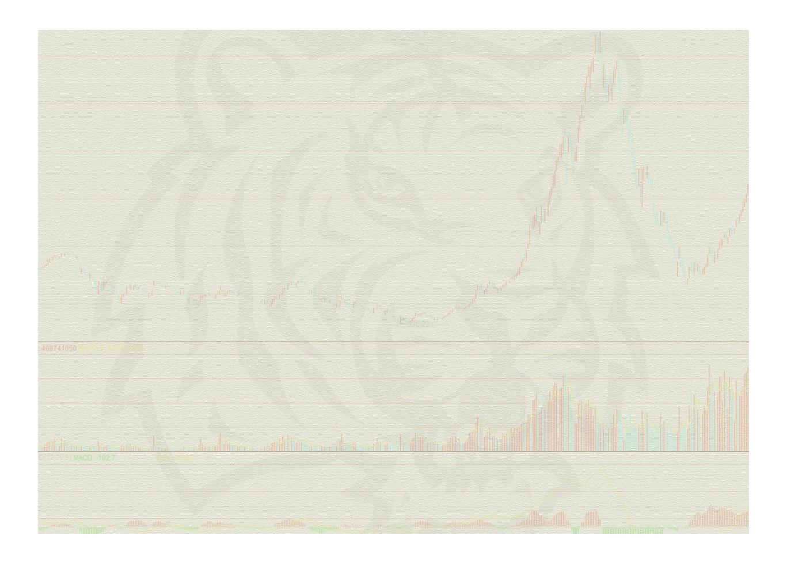
